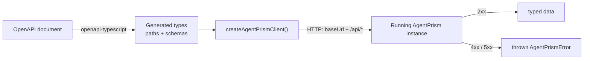

`@agentprism/client` is the npm counterpart to [`AgentPrism.Client`](/guides/cli/):
a typed client for the management API (`/api/*`), generated from the same
[OpenAPI document](/openapi/agentprism.json), for a caller that is not on .NET —
a Node.js service, a browser admin panel, or a script.



## Install

```bash
npm install @agentprism/client
```

## Create a client

```ts
import { createAgentPrismClient } from '@agentprism/client';

const client = createAgentPrismClient({
  // The application root PLUS the MapAgentPrism prefix. The default prefix
  // is "/agentprism"; an app that called MapAgentPrism("/control") needs
  // "https://example.com/control" instead.
  baseUrl: 'https://example.com/agentprism',
  token: 'a-secret-token', // or a function called per request
  onUnauthorized: () => {
    // The server answered 401 — your app decides what that means: drop the
    // stored token, redirect to sign-in, or prompt for a new one.
  },
});
```

`baseUrl` needs the prefix because `MapAgentPrism`'s mount point is a runtime
parameter, not a fixed value — the document this package is generated from
carries no prefix at all. If a request went to the document's bare path, a
server mounted anywhere but the default `/agentprism` would answer every call
with a silent `404`.

`token` can be a function instead of a fixed string, so a caller whose token
rotates or is read from storage per request never has to rebuild the client.

## A typed call

```ts
const { data: agents } = await client.GET('/api/agents');
```

The path, its parameters, its request body, and its response are all checked
at compile time against the OpenAPI document. A schema type is also exported
by name for every schema in the document, so a response can be typed without
indexing into the generated `components` object:

```ts
import type { RunRecord } from '@agentprism/client';
```

## Errors are thrown, not returned

The underlying `openapi-fetch` library returns `{ data, error }` for every
call. This client wraps that so a failed response instead **throws**
`AgentPrismError` — a call either resolves with `data`, or the call rejects:

```ts
import { AgentPrismError } from '@agentprism/client';

try {
  await client.GET('/api/agents/{name}', { params: { path: { name: 'missing' } } });
} catch (error) {
  if (error instanceof AgentPrismError) {
    console.error(error.status, error.title, error.detail);
  }
}
```

`title` and `detail` come from the server's `application/problem+json` body
and are shown exactly as the server wrote them — this client does not
translate them, the same rule the server itself follows for error text.

## What this client does not cover

**Server-Sent Events.** Six operations answer `text/event-stream`, not JSON:
agent `run`, workflow `run`/`resume`/`respond`, and the OpenAI-compatible
`responses` and `chat/completions` endpoints. A `fetch`-based typed client
reads a response body as JSON, so none of these can go through
`createAgentPrismClient`. Call them with your own `EventSource` or a
`fetch` plus `ReadableStream` reader instead — this package's exported path
types still describe their request shape, even though the client cannot make
the call itself.

**Token storage.** This client reads the token you supply on every request —
it never reads or writes `localStorage`, a cookie, or anything else. Store it
however the rest of your application already does.

## Checking for schema drift

The generated types ship as part of the package, committed rather than built
on install. If you work in the AgentPrism repository itself and change the
OpenAPI document, regenerate the client's types before committing:

```bash
npm run generate   # OpenAPI document -> generated types (committed)
npm run build       # compiles the package
npm test            # includes a schema-drift check against the OpenAPI document
```

`npm run generate` is a development step — it is not part of `npm run build`
and does not run automatically. A committed type that no longer matches the
OpenAPI document fails the drift check rather than shipping silently out of
sync.

## Read next

- [Typed client and CLI](/guides/cli/) — the .NET counterpart, generated from the same document
- [Versions and upgrades](/reference/versioning/) — how this package's version tracks the NuGet family
- [HTTP API conventions](/http-api/) — authentication, paging, and error shapes this client wraps
