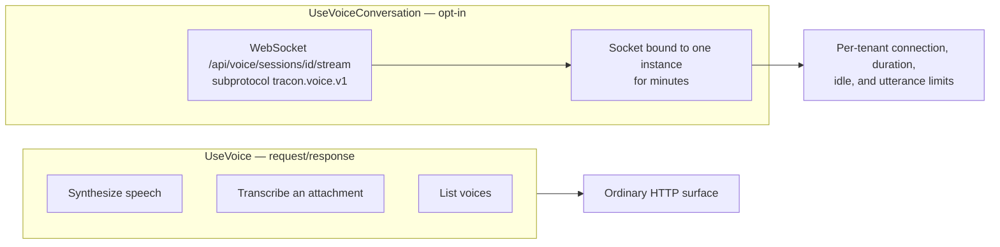
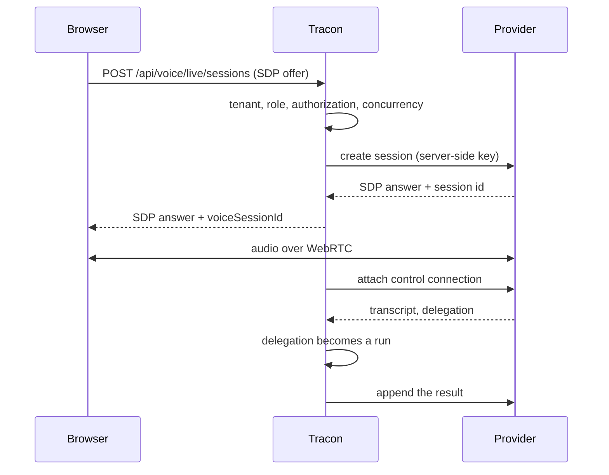

:::note[Preview packages]
Tracon is published as `1.0.0-preview.2`. Use `--prerelease` for discovery or
pin the exact version for reproducible builds.
:::

Tracon has three voice layers:

| Layer | Use it for | Registration |
|---|---|---|
| Voice tools and REST | Generate speech, transcribe an attachment, list voices | `UseVoice()` from `Tracon.Voice` |
| Live conversation | Keep a bidirectional audio/text session over WebSocket, with Tracon transcribing and synthesizing | `UseVoiceConversation()` from Core |
| Provider-hosted live voice | Let a realtime model run the conversation and hand the heavy work back to your agents | `UseLiveVoice()` plus a provider such as `UseOpenAILive()` |

The second and third solve the same problem in opposite directions, and the choice
matters. Under `UseVoiceConversation()` the audio reaches Tracon, so every turn is
a run, the content guard sees what was said, and any speech provider works. Under
`UseLiveVoice()` the provider owns the conversation and the audio never touches your
server — you get true full duplex and provider-side turn detection, and you give up
seeing most of what was said. [What you give up](#what-the-provider-hosted-path-gives-up)
lists that trade in full.



The tool layer is request/response. The conversation layer changes the hosting model:
a socket stays bound to one application instance for minutes. Enable only the layer
you need.

## Add speech tools

Install `Tracon.Voice`, keep the provider key out of files, and register it:

```bash
dotnet add package Tracon.Voice --prerelease
dotnet user-secrets set "Tracon:Voice:ApiKey" "..."
```

```csharp
var tracon = builder.AddTracon()
    .UseVoice(builder.Configuration.GetSection(VoiceOptions.SectionName));

tracon.AddAgent(new AgentDefinition
{
    Name = "voice-assistant",
    Instructions = "Answer clearly. Speak the answer when the caller asks.",
    Model = new ModelBinding
    {
        Provider = OpenAIProviderNames.ChatCompletions,
        Model = "your-model",
    },
    ToolNames = ["speak", "transcribe", "list_voices"],
});
```

| Tool | Input and result |
|---|---|
| `speak` | Text in; generated audio attachment ID out |
| `transcribe` | Audio attachment ID in; resolved text out |
| `list_voices` | Provider voice names, identifiers, and safe scalar attributes out |

Generated audio is stored through the normal attachment contract. The model receives
an attachment ID, not a large byte array.

### Voice attributes

`VoiceDescriptor.Attributes` carries a provider's own bounded, safe scalar
metadata for a voice — for example `gender`, `language`, `accent`, `age`, or
`use-case`. `VoiceAttributeNames` names the well-known keys, but the set is not
closed: any other safe scalar label a provider reports survives under its own
key. The collection is empty, never `null`, when the provider reports nothing.

```csharp
var voices = await synthesizer.ListVoicesAsync();
var femaleEnglish = voices.Where(v =>
    v.Attributes.GetValueOrDefault(VoiceAttributeNames.Gender) == "female" &&
    (v.Attributes.GetValueOrDefault(VoiceAttributeNames.Language) ?? "").Contains("en"));
```

Bounds keep a misbehaving provider response from becoming a payload: at most 32
attributes per voice, a 64-character key, a 256-character value. A duplicate
key that differs only by case or by `_`/`-` collapses to one canonical
lowercase, hyphenated entry (`use_case` and `use-case` both become `use-case`).
`preview_url` is never carried — playing it would connect the browser directly
to the provider's address — and neither is any other provider-internal field;
only the declared safe scalar labels reach the model.

Whether `language` is populated depends entirely on what the underlying
provider reports: the built-in ElevenLabs implementation reads it from that
provider's per-model verified-languages list, joining multiple verified
languages into one comma-separated value (for example `"en,fr"`). A provider
that reports nothing comparable simply omits the key — it is never guessed.

### Use a storable output format

The attachment guard trusts magic bytes, not a claimed media type. Raw `pcm_*` and
`ulaw_*` output has no file header and cannot be stored as an attachment. The default
`mp3_44100_128` is valid; choosing a non-storable provider format fails option
validation at startup.

### Voice cost has a different unit

Synthesis cost uses characters and transcription cost uses duration. Tracon
writes that measurement on the tool invocation but does not add it to token cost.
If pricing is not configured, cost stays `null`; zero would claim the call was free.
If the provider omits billed characters, the text length is used and marked as an
estimate.

### Character-level timing

`POST /api/voice/speak` accepts `includeTimestamps` (default `false`). When set, the
response's `alignment` field carries one entry per character — the character itself
and its start/end offset from the beginning of the audio. Alignment is not a separate
billing unit: `characters` and `cost` are computed exactly as without it.

Timestamps are not available on the streaming synthesis path
(`ISpeechSynthesizer.SynthesizeStreamingAsync`): that method returns raw audio chunks
only and has no channel to carry per-character timing back to the caller. Requesting
both together throws rather than silently dropping the alignment. Grouping characters
into words, or producing a subtitle format such as SRT or VTT, is left to the
consumer — the raw per-character form is what the provider gives, and turning it into
something else is application-specific.

The built-in implementation uses ElevenLabs through raw `HttpClient` and
source-generated JSON. The package adds no NuGet dependency and remains AOT
compatible. To replace it, register your implementation first; `TryAdd` preserves it:

```csharp
builder.Services.AddSingleton<ISpeechSynthesizer, ContosoSpeechProvider>();
builder.Services.AddSingleton<ISpeechTranscriber, ContosoSpeechProvider>();

builder.AddTracon().UseVoice(options =>
{
    options.DefaultVoiceId = "customer-care";
    options.MaxCharactersPerRequest = 5_000;
});
```

## Enable live conversation

Live conversation needs both an `ISpeechTranscriber` and `ISpeechSynthesizer`. Add
the opt-in before the application is built:

```csharp
var tracon = builder.AddTracon()
    .UseVoice(builder.Configuration.GetSection(VoiceOptions.SectionName))
    .UseVoiceConversation(options =>
    {
        options.MaxConcurrentConnectionsPerTenant = 5;
        options.MaxConnectionDuration = TimeSpan.FromMinutes(30);
        options.IdleTimeout = TimeSpan.FromMinutes(2);
        options.MaxUtteranceDuration = TimeSpan.FromSeconds(60);
        options.MaxUtteranceBytes = 8 * 1024 * 1024;
        options.PersistAudio = false;
    });

var app = builder.Build();
app.MapTracon("/tracon");
```

`MapTracon` maps
`/api/voice/sessions/{sessionId}/stream` and installs WebSocket middleware only when
the conversation services exist. Without `UseVoiceConversation()`, the route does not
exist.

### Protocol

The negotiated subprotocol is `tracon.voice.v1`. The client sends JSON control
frames and binary audio:

1. Send `{"type":"start","agent":"voice-assistant","inputFormat":"webm-opus"}`.
2. Send audio chunks as binary frames.
3. Send `{"type":"commit"}` when client-side voice activity detection finds the
   end of speech.
4. Read `transcript`, `runStarted`, `text`, `audioStart`, binary audio, `audioEnd`,
   and `done` frames.
5. Read `idle` — a commit that closed no turn. Handle it or your client hangs.
6. Send `cancel` for barge-in or `stop` to close cleanly.

:::caution[A commit does not always produce a turn]
Two ordinary cases end a commit without a turn: the commit reaches the server
before any audio does (voice activity detection fired on a cough, or the user
pressed send inside the recorder's first timeslice), and the audio transcribes to
nothing usable (a noisy room). Both answer with a single `idle` frame and no
`done`.

Your client must treat `idle` as "the turn is over, start listening again" —
return to the listening state and reopen the microphone if you stopped it to
commit. Do not fold it into `done`: `done` closes a turn that exists and carries
that turn's number and cancelled flag, so a client that handles the two alike
rewrites the record of the previous turn. A client that ignores `idle` stays in
whatever pending state it entered when it committed, and never recovers.
:::

Input formats are `webm-opus` and raw mono 16-bit little-endian `pcm16`. WebM Opus is
the browser-friendly default. Raw PCM uses `InputSampleRate`, 16 kHz by default, when
the server adds a WAV header for transcription.

The server does not run voice activity detection. The 60-second utterance limit is a
safety net for a client whose VAD never commits.

### WebSocket authentication

Browsers cannot set an `Authorization` header on the WebSocket handshake. Tracon
accepts the bearer value through a second subprotocol with the
`tracon.token.` prefix and validates it with the same constant-time path as HTTP.
It never accepts the credential in the query string, where browser, server, and proxy
logs would capture it.

Authentication is not authorization. A registered
[`IRunAuthorizationHandler`](/guides/embedding/#6--run-and-session-authorization) is
asked before the socket upgrades, with `SessionAccess.Voice` and the session id from
the route, so a host can stop one user from speaking into another user's
conversation. A denial refuses the handshake with `404` — the same answer an
unreachable session already gives, so a refusal never confirms the conversation
exists.

A session id the server has never seen is **not** rejected: the first turn opens it.
The handler is still asked, so only you decide whether that caller may open a new
conversation under that id.

## Provider-hosted live voice

Some providers now host the whole spoken conversation themselves: the model listens,
speaks, detects turns, and carries the audio straight to the browser over WebRTC. It
is genuinely full duplex — the caller can interrupt mid-sentence — which a one-turn-at-a-time
pipeline cannot reproduce no matter how fast it gets.

Tracon stands in exactly two places on that path:

1. **It creates the session.** The browser sends an SDP offer to Tracon, not to the
   provider. Tenancy, role, authorization and concurrency gates all apply before
   anything is created, and your API key never reaches the browser.
2. **It attaches a sideband.** A server-side control connection joins the same session.
   When the model hands work back — a lookup, a calculation, anything needing your
   tools — Tracon turns that delegation into an **ordinary run**, with the same
   tool registry, content guard, quota, cost accounting and audit trail as
   `POST /api/agents/{name}/run`.

The provider runs the conversation; your agents do the work.



### Enable it

`UseLiveVoice()` turns the layer on; a provider registration supplies the model. Both
calls are needed, and they are separate on purpose: the provider connection is billed
by the second, so an application opts into that spend explicitly rather than inheriting
it from an unrelated call.

```csharp
var tracon = builder.AddTracon()
    .UseOpenAI(builder.Configuration.GetSection(OpenAIProviderOptions.SectionName))
    .UseOpenAILive(builder.Configuration.GetSection(OpenAILiveOptions.SectionName))
    .UseLiveVoice(options =>
    {
        options.MaxConcurrentSessionsPerTenant = 3;
        options.MaxConcurrentDelegations = 2;
        options.MaxSessionDuration = TimeSpan.FromMinutes(30);
        options.PendingSessionTimeout = TimeSpan.FromMinutes(2);
        options.PersistTranscript = true;
        options.Instructions = "Delegate any lookup to the client; never guess.";
    });

var app = builder.Build();
app.MapTracon("/tracon");
```

`UseLiveVoice()` is independent of `UseVoiceConversation()`. Enable either, both, or
neither. Without `UseLiveVoice()` the live routes do not exist at all and the address
returns `404`; with the layer on but no provider registered, it returns `501` naming
the call that is missing.

`UseOpenAILive()` reuses the key from `UseOpenAI()`, so that call has to come first.
Validation says so by name at startup if it does not.

### Settings

The live layer reads `Tracon:Voice:Live`, bound to `VoiceLiveOptions`:

| Setting | Default | What it does |
|---|---|---|
| `MaxConcurrentSessionsPerTenant` | `3` | How many live sessions one tenant may hold open. Checked before the provider is called, so a rejected request never leaves a billed session behind. |
| `MaxSessionDuration` | `00:30:00` | How long a session may stay open before it is closed. |
| `PendingSessionTimeout` | `00:02:00` | How long a created session waits for its media peer. After this the record closes as `Abandoned` — not `Error`, because an unused session is not a failure. |
| `MaxConcurrentDelegations` | `2` | How many delegations may run at once in one session. The provider decides when to delegate, so without this ceiling it decides how many agent runs you start. |
| `MaxAppendsPerDelegation` | `12` | How many appends one delegation may push back into the conversation. |
| `DelegationTimeout` | `00:02:00` | How long one delegated run may take. |
| `MaxTranscriptLedgerCharacters` | `20000` | How much transcript is kept for cutting delegations from. Oldest entries drop first, so a long conversation cannot grow without limit. |
| `MaxLedgerEntriesPerDelegation` | `40` | How many transcript entries one delegation's prompt may carry. |
| `DelegationMode` | `Client` | Who executes delegated work. `Client` means your agents do. |
| `Instructions` | *(none)* | System instructions for the live model — for example, telling it to delegate rather than guess. |
| `PersistTranscript` | `true` | Whether the conversation text is written to durable session history. See [Privacy and retention](#privacy-and-retention). |

The OpenAI provider reads `Tracon:Providers:OpenAI:Live`, bound to
`OpenAILiveOptions`:

| Setting | Default | What it does |
|---|---|---|
| `Model` | `gpt-live-1` | The live model. |
| `Voice` | *(provider default)* | The output voice. |
| `Endpoint` | `https://api.openai.com/v1/` | The API root. |
| `MaxAppendCharacters` | `1000` | The per-append ceiling. The provider states its limit in tokens; Tracon ships no tokenizer, so the limit is converted once and conservatively — text over it is split, never dropped. |
| `BackendModel` | *(none)* | The backing model for provider-side delegation. |
| `Timeout` | `00:00:30` | The timeout of the session-creation call. |

The API key comes from `Tracon:Providers:OpenAI:ApiKey`; the live provider does
not take one of its own.

### The endpoints

| Method | Path | Role | Purpose |
|---|---|---|---|
| `POST` | `/api/voice/live/sessions` | Operator | Relay the SDP offer, create the session, attach the sideband |
| `DELETE` | `/api/voice/live/sessions/{voiceSessionId}` | Operator | Close the session and write its record |
| `GET` | `/api/voice/live/sessions/{voiceSessionId}` | Reader | Report state, duration and delegation count |

These are plain HTTP, so they use the ordinary bearer layer — the subprotocol token
that the conversation WebSocket needs does not apply here.

`POST` takes `{ sessionId, agent, sdp, voice? }` and answers
`{ voiceSessionId, sdp, model, persistTranscript }`. Hand the `sdp` to
`RTCPeerConnection.setRemoteDescription` and the media flows.

A caller that may not reach a session is told the session does not exist, in exactly
the words a genuinely missing session produces. That is deliberate: a distinguishable
`403` would tell an attacker which session ids are real in someone else's tenant.

### What the provider-hosted path gives up

This is a real trade, and the honest list is short but sharp:

| What you lose | Why it matters |
|---|---|
| **Tracon does not see most of the conversation** | The media flows between the browser and the provider. The content guard never inspects what is spoken, so the model can say a sentence Tracon never reviewed. |
| **Not every turn is a run** | Only delegations produce runs. Token accounting, quota and guards cover the **delegated work**, not the chat around it. |
| **`PersistAudio` does not apply** | There is no audio passing through Tracon to store. That setting belongs to `UseVoiceConversation()` and is ignored here. |
| **The caller's audio goes to a third party** | Nothing is stored by Tracon, but the transmission itself is a change worth telling your users about. |
| **The transcript text is durable by default** | See [Privacy and retention](#privacy-and-retention) below. |
| **Your own speech providers are unused** | `ISpeechTranscriber` and `ISpeechSynthesizer` are not called on this path. |
| **The spend ceiling is duration, not quota** | Voice seconds are not a quota unit. `MaxSessionDuration` and `MaxConcurrentSessionsPerTenant` are what bound the cost. |

None of this makes `UseVoiceConversation()` obsolete. For any provider without a
realtime API, it remains the right layer.

### Cost

A live session is billed by wall-clock duration, and the number in the record is the
**provider's**, not a local stopwatch: Tracon does not carry the media and cannot
time it honestly. When the provider reports nothing, `liveSeconds` stays `null` rather
than being invented.

Price the model per minute:

```json
{
  "Tracon": {
    "Pricing": {
      "Currency": "USD",
      "Voice": { "openai": { "gpt-live-1": { "PerMinute": 0.60 } } }
    }
  }
}
```

`GET /api/voice/sessions` then reports `provider`, `model`, `liveSeconds` and a `cost`
object. With no price configured, `cost` is `null` — never `0`, which would claim the
conversation was free.

:::caution[This figure is not the whole bill]
`cost` covers the **voice connection only**. Every delegated task also produces a
`runs` row with its own token cost, which is deliberately not repeated here. The
honest total is this cost plus the session's run costs.
:::

## Privacy and retention

Voice is personal data. `PersistAudio` defaults to `false`; transcripts and normal
run records can still exist. When audio persistence is enabled, the `ready` frame
tells the client and the console shows the recording state. Apply attachment and
session retention policies, document consent, and test deletion before production.

On the provider-hosted path the audio is never stored, because it never reaches
Tracon — but the **text** is a separate question. `PersistTranscript` defaults to
`true`, which writes the conversation into the agent session's durable history so that
`GET /api/sessions/{id}` shows the full exchange and delegated runs see the whole
context. That is a real retention decision, so it is handled two ways:

- Set `PersistTranscript = false` to keep the transcript in memory only. Delegation
  keeps working with the same context for the session's lifetime; only the durable
  write is skipped.
- Either way the effective value comes back in the session-creation response as
  `persistTranscript`, so a client can show it. No recording happens silently.

The `MaxSpokenCharactersPerTurn` default is 5,000. Text beyond it still appears as
captions but is not synthesized, which bounds voice cost without hiding the complete
answer.

## Production checklist

- [ ] The reverse proxy permits WebSocket upgrade and preserves the full path.
- [ ] Load balancing is sticky for the lifetime of a connection.
- [ ] Proxy and server idle timeouts exceed the configured conversation idle timeout.
- [ ] Connection limits match file descriptors, memory, provider concurrency, and
  tenant quotas.
- [ ] `OutputMediaType` matches the configured synthesis format.
- [ ] Audio persistence, consent, access, backup, and retention policy are explicit.
- [ ] Barge-in, reconnect, maximum duration, provider outage, and slow clients are
  tested through the real proxy.

For the provider-hosted path:

- [ ] The trade in [what it gives up](#what-the-provider-hosted-path-gives-up) is
  acceptable for this workload, and the gap in content-guard coverage is written down.
- [ ] `PersistTranscript` matches your retention policy and your users were told.
- [ ] The model is priced per minute, and dashboards add the session's run costs to
  `cost` rather than showing it alone.
- [ ] `MaxConcurrentSessionsPerTenant` and `MaxSessionDuration` bound the spend a
  single tenant can cause.
- [ ] Load balancing is sticky: a live session binds to the instance that created it.

## In the reference

- [Voice HTTP endpoints](/http-api/voice/)

## Read next

- [Attachments and multimodal input](/guides/multimodal/) — attach validated files, images, and audio to a conversation.
- [Observability and cost](/guides/observability/) — interpret telemetry, pricing, and recorded token use.
- [Production deployment](/guides/production/) — prepare migrations, replicas, health checks, and operational settings.
