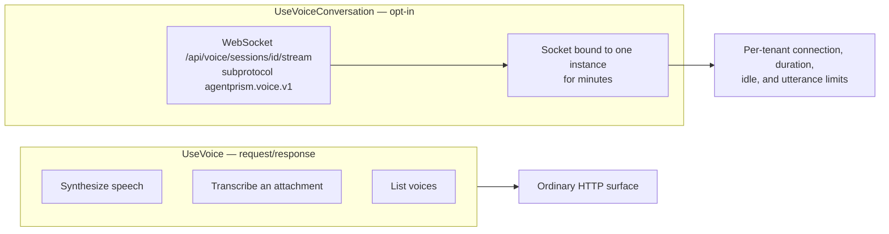

AgentPrism has two voice layers:

| Layer | Use it for | Registration |
|---|---|---|
| Voice tools and REST | Generate speech, transcribe an attachment, list voices | `UseVoice()` from `AgentPrism.Voice` |
| Live conversation | Keep a bidirectional audio/text session over WebSocket | `UseVoiceConversation()` from Core |



The tool layer is request/response. The conversation layer changes the hosting model:
a socket stays bound to one application instance for minutes. Enable only the layer
you need.

## Add speech tools

Install `AgentPrism.Voice`, keep the provider key out of files, and register it:

```bash
dotnet add package AgentPrism.Voice --prerelease
dotnet user-secrets set "AgentPrism:Voice:ApiKey" "..."
```

```csharp
var agentPrism = builder.AddAgentPrism()
    .UseVoice(builder.Configuration.GetSection(VoiceOptions.SectionName));

agentPrism.AddAgent(new AgentDefinition
{
    Name = "voice-assistant",
    Instructions = "Answer clearly. Speak the answer when the caller asks.",
    Model = new ModelBinding
    {
        Provider = OpenAIProviderNames.ChatCompletions,
        Model = "your-model",
    },
    ToolNames = ["speak", "transcribe", "list_voices"],
});
```

| Tool | Input and result |
|---|---|
| `speak` | Text in; generated audio attachment ID out |
| `transcribe` | Audio attachment ID in; resolved text out |
| `list_voices` | Provider voice names and identifiers out |

Generated audio is stored through the normal attachment contract. The model receives
an attachment ID, not a large byte array.

### Use a storable output format

The attachment guard trusts magic bytes, not a claimed media type. Raw `pcm_*` and
`ulaw_*` output has no file header and cannot be stored as an attachment. The default
`mp3_44100_128` is valid; choosing a non-storable provider format fails option
validation at startup.

### Voice cost has a different unit

Synthesis cost uses characters and transcription cost uses duration. AgentPrism
writes that measurement on the tool invocation but does not add it to token cost.
If pricing is not configured, cost stays `null`; zero would claim the call was free.
If the provider omits billed characters, the text length is used and marked as an
estimate.

### Character-level timing

`POST /api/voice/speak` accepts `includeTimestamps` (default `false`). When set, the
response's `alignment` field carries one entry per character — the character itself
and its start/end offset from the beginning of the audio. Alignment is not a separate
billing unit: `characters` and `cost` are computed exactly as without it.

Timestamps are not available on the streaming synthesis path
(`ISpeechSynthesizer.SynthesizeStreamingAsync`): that method returns raw audio chunks
only and has no channel to carry per-character timing back to the caller. Requesting
both together throws rather than silently dropping the alignment. Grouping characters
into words, or producing a subtitle format such as SRT or VTT, is left to the
consumer — the raw per-character form is what the provider gives, and turning it into
something else is application-specific.

The built-in implementation uses ElevenLabs through raw `HttpClient` and
source-generated JSON. The package adds no NuGet dependency and remains AOT
compatible. To replace it, register your implementation first; `TryAdd` preserves it:

```csharp
builder.Services.AddSingleton<ISpeechSynthesizer, ContosoSpeechProvider>();
builder.Services.AddSingleton<ISpeechTranscriber, ContosoSpeechProvider>();

builder.AddAgentPrism().UseVoice(options =>
{
    options.DefaultVoiceId = "customer-care";
    options.MaxCharactersPerRequest = 5_000;
});
```

## Enable live conversation

Live conversation needs both an `ISpeechTranscriber` and `ISpeechSynthesizer`. Add
the opt-in before the application is built:

```csharp
var agentPrism = builder.AddAgentPrism()
    .UseVoice(builder.Configuration.GetSection(VoiceOptions.SectionName))
    .UseVoiceConversation(options =>
    {
        options.MaxConcurrentConnectionsPerTenant = 5;
        options.MaxConnectionDuration = TimeSpan.FromMinutes(30);
        options.IdleTimeout = TimeSpan.FromMinutes(2);
        options.MaxUtteranceDuration = TimeSpan.FromSeconds(60);
        options.MaxUtteranceBytes = 8 * 1024 * 1024;
        options.PersistAudio = false;
    });

var app = builder.Build();
app.MapAgentPrism("/agentprism");
```

`MapAgentPrism` maps
`/api/voice/sessions/{sessionId}/stream` and installs WebSocket middleware only when
the conversation services exist. Without `UseVoiceConversation()`, the route does not
exist.

### Protocol

The negotiated subprotocol is `agentprism.voice.v1`. The client sends JSON control
frames and binary audio:

1. Send `{"type":"start","agent":"voice-assistant","inputFormat":"webm-opus"}`.
2. Send audio chunks as binary frames.
3. Send `{"type":"commit"}` when client-side voice activity detection finds the
   end of speech.
4. Read `transcript`, `runStarted`, `text`, `audioStart`, binary audio, `audioEnd`,
   and `done` frames.
5. Read `idle` — a commit that closed no turn. Handle it or your client hangs.
6. Send `cancel` for barge-in or `stop` to close cleanly.

:::caution[A commit does not always produce a turn]
Two ordinary cases end a commit without a turn: the commit reaches the server
before any audio does (voice activity detection fired on a cough, or the user
pressed send inside the recorder's first timeslice), and the audio transcribes to
nothing usable (a noisy room). Both answer with a single `idle` frame and no
`done`.

Your client must treat `idle` as "the turn is over, start listening again" —
return to the listening state and reopen the microphone if you stopped it to
commit. Do not fold it into `done`: `done` closes a turn that exists and carries
that turn's number and cancelled flag, so a client that handles the two alike
rewrites the record of the previous turn. A client that ignores `idle` stays in
whatever pending state it entered when it committed, and never recovers.
:::

Input formats are `webm-opus` and raw mono 16-bit little-endian `pcm16`. WebM Opus is
the browser-friendly default. Raw PCM uses `InputSampleRate`, 16 kHz by default, when
the server adds a WAV header for transcription.

The server does not run voice activity detection. The 60-second utterance limit is a
safety net for a client whose VAD never commits.

### WebSocket authentication

Browsers cannot set an `Authorization` header on the WebSocket handshake. AgentPrism
accepts the bearer value through a second subprotocol with the
`agentprism.token.` prefix and validates it with the same constant-time path as HTTP.
It never accepts the credential in the query string, where browser, server, and proxy
logs would capture it.

## Privacy and retention

Voice is personal data. `PersistAudio` defaults to `false`; transcripts and normal
run records can still exist. When audio persistence is enabled, the `ready` frame
tells the client and the console shows the recording state. Apply attachment and
session retention policies, document consent, and test deletion before production.

The `MaxSpokenCharactersPerTurn` default is 5,000. Text beyond it still appears as
captions but is not synthesized, which bounds voice cost without hiding the complete
answer.

## Production checklist

- [ ] The reverse proxy permits WebSocket upgrade and preserves the full path.
- [ ] Load balancing is sticky for the lifetime of a connection.
- [ ] Proxy and server idle timeouts exceed the configured conversation idle timeout.
- [ ] Connection limits match file descriptors, memory, provider concurrency, and
  tenant quotas.
- [ ] `OutputMediaType` matches the configured synthesis format.
- [ ] Audio persistence, consent, access, backup, and retention policy are explicit.
- [ ] Barge-in, reconnect, maximum duration, provider outage, and slow clients are
  tested through the real proxy.

## In the reference

- [Voice HTTP endpoints](/http-api/voice/)

## Read next

- [Attachments and multimodal input](/guides/multimodal/)
- [Observability and cost](/guides/observability/)
- [Production deployment](/guides/production/)
