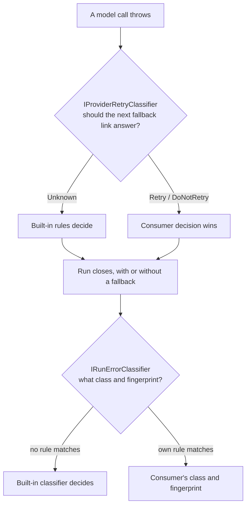

A provider failure raises two separate questions, answered by two separate
extension points:



Both are registered with `TryAddSingleton`, so your own registration
(`services.AddSingleton<...>()`, called before or after `AddAgentPrism()` —
`TryAdd*` means your registration always wins) replaces the built-in default.
Neither one needs the other: register just the one you need.

## Decide whether a failure retries

`IProviderRetryClassifier` runs once per failed attempt, before AgentPrism's
[fallback chain](/guides/reliability/#fall-back-to-a-secondary-provider) falls
back to its own rules:

```csharp
public sealed class AcmeRetryClassifier : IProviderRetryClassifier
{
    public ProviderRetryDecision Classify(Exception exception)
        => exception.Message.Contains("Acme.Sdk.ThrottledException", StringComparison.Ordinal)
            ? ProviderRetryDecision.Retry
            : ProviderRetryDecision.Unknown;
}
```

```csharp
services.AddSingleton<IProviderRetryClassifier, AcmeRetryClassifier>();
```

`ProviderRetryDecision` has three values, not two. Returning `Unknown` for
every exception you do not recognize matters: AgentPrism's built-in rules are
a closed, positive set — an unrecognized failure does not retry by default,
because hiding a configuration error behind a silent provider switch costs
more than the switch saves. A `bool` contract would force your classifier to
take a side on every exception, silently breaking that guarantee the moment
it is registered.

A cancellation is never offered to your classifier, however it is nested
inside the exception you receive — that check runs before this seam and
cannot be overridden. If your classifier throws, AgentPrism logs the failure
and falls back to the built-in rules for that call; a broken classifier does
not break the model call it decorates.

## Decide how a failed run is classified

`IRunErrorClassifier` runs once, when a run closes with an error, and
produces the `runs.error_class` value and the clustering fingerprint used to
group repeated failures. `DefaultRunErrorClassifier` is public and carries no
dependencies, so composing it needs no dependency injection:

```csharp
public sealed class AcmeErrorClassifier(DefaultRunErrorClassifier builtIn) : IRunErrorClassifier
{
    public RunErrorClassification Classify(RunError runError)
        => runError.Type.Contains("Acme.Sdk.ThrottledException", StringComparison.Ordinal)
            ? new RunErrorClassification
            {
                Class = RunErrorClass.RateLimited,
                Fingerprint = RunErrorFingerprint.Compute(runError.Message),
            }
            : builtIn.Classify(runError);
}
```

```csharp
services.AddSingleton<IRunErrorClassifier>(
    _ => new AcmeErrorClassifier(new DefaultRunErrorClassifier()));
```

Use `RunErrorFingerprint.Compute` for your own rule's fingerprint so it lands
in the same cluster convention the built-in classifier uses — identifiers,
numbers, and timestamps normalized out, quoted text kept (a tool name is
distinguishing). Return `RunErrorClass.Unknown` rather than guessing when
nothing matches; a high `Unknown` share in `RunStatistics` is a signal that
your taxonomy is incomplete, not a failure.

If your classifier throws, the run still reaches its terminal state: the
class comes from the built-in classifier instead, and the failure is logged.

## Read next

- [Reliable runs](/guides/reliability/#fall-back-to-a-secondary-provider) — the fallback chain this seam sits in front of
- [Observability and cost](/guides/observability/) — where `RunErrorClass` and fingerprints surface in the dashboard
- [Runs and recording](/concepts/runs/) — the run record `runs.error_class` and `runs.error_fingerprint` belong to
