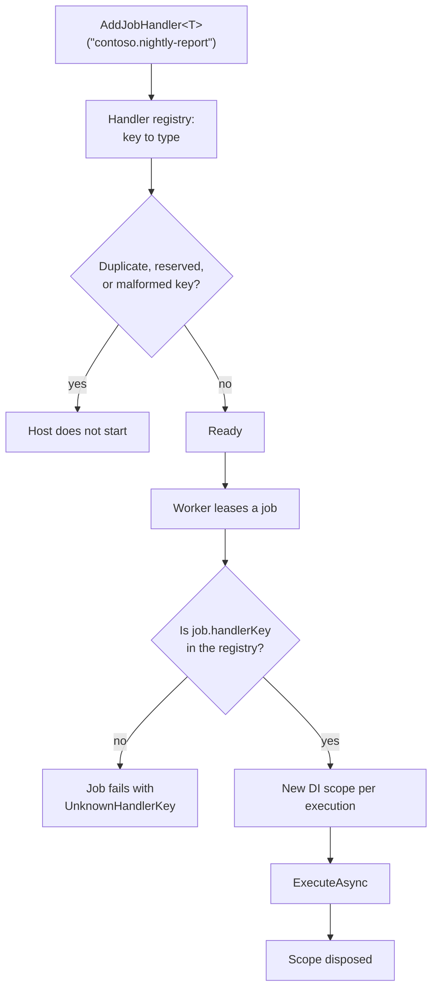

:::caution[Package availability]
Tracon packages and templates are not published yet. Package-install examples on
this page describe the release form and do not currently resolve from public
registries. With authorized repository access, use the
[source build instructions](/getting-started/first-agent/).
:::

`IJobHandler` executes a durable job under one **handler key** — a stable
string such as `contoso.nightly-report`. The key is the job's identity: it is
both how the job is classified and how the background worker picks the handler
that runs it. Tracon's own handlers live under the reserved `tracon.`
prefix; you pick a prefix of your own.

```csharp
public sealed class NightlyReportJobHandler(ILogger<NightlyReportJobHandler>? logger = null) : IJobHandler
{
    public async ValueTask ExecuteAsync(JobContext context, CancellationToken cancellationToken = default)
    {
        foreach (var item in context.Items)
        {
            // context.Items is UNFILTERED: a retry hands back items an
            // earlier, now-dead attempt already finished. Skip them.
            if (item.Status != JobItemStatus.Pending)
            {
                continue;
            }

            if (await context.IsCancelledAsync(cancellationToken))
            {
                break;
            }

            logger?.LogInformation("Nightly report generated for '{Subject}'.", item.Input);

            await context.ReportItemAsync(
                new JobItemResult { JobId = context.Job.Id, Seq = item.Seq, Status = JobItemStatus.Completed },
                cancellationToken);
        }
    }
}
```

Register it with the key it answers to:

```csharp
builder.Services.AddJobHandler<NightlyReportJobHandler>("contoso.nightly-report");
```

The worker looks the key up by exact match, so **this call may come before or
after `AddTracon()`** — registration order never decides which handler
runs, and no handler can shadow another. The handler is registered *scoped*
and resolved from a fresh scope for every execution, so it may take scoped
dependencies in its constructor: two jobs running in parallel, and two attempts
of the same job, never share an instance.



Three mistakes stop the host from starting rather than failing quietly later:

- **Two handlers under one key.** A key identifies exactly one handler.
- **A key inside the `tracon.` namespace.** That prefix is reserved.
- **A malformed key.** 1-128 characters: lowercase ASCII letters, digits,
  `.`, `_`, or `-`, starting with a letter or digit. Uppercase is rejected
  rather than normalized, so one key can never become two.

## Queue work for your handler

`IJobDispatcher` is the supported way to create a job from your own code. It
fills in the identifier, status and timestamps, and refuses a key no handler
serves:

```csharp
public sealed class ReportScheduler(IJobDispatcher jobs)
{
    public ValueTask<JobRecord> QueueNightlyAsync(string tenantId, IReadOnlyList<string> customers)
        => jobs.EnqueueAsync(new JobRequest
        {
            TenantId = tenantId,
            HandlerKey = "contoso.nightly-report",
            TargetName = "nightly-report",
            Items = customers,
        });
}
```

If a job is somehow queued for a key nobody registered — a stale row, a
mistyped key — the worker fails that job with the stable code
`JobErrorCodes.UnknownHandlerKey` instead of leaving it in the queue forever.
The raw key is written to the log, not to the job's `errorMessage`: that field
is read back over HTTP, and an unregistered key may have come from an
untrusted source.

:::note[Scheduling from outside is opt-in]
`PUT /api/schedules/{name}` accepts only the keys listed in
`TraconSchedulingOptions.HttpSchedulableHandlerKeys`, which defaults to
Tracon's own built-in keys. A handler key is a dispatch identity, so an
unrestricted endpoint would turn every registered handler — including internal
ones you registered for your own background work — into an externally callable
surface. Name your key there only when you want it schedulable over HTTP.

A non-empty list **replaces** that default rather than extending it, so an
allow-list can also narrow the surface. To keep the built-in keys as well, name
them alongside your own:

```csharp
builder.Services.UseScheduling(options =>
{
    foreach (var key in JobHandlerKeys.BuiltIn)
    {
        options.HttpSchedulableHandlerKeys.Add(key);
    }

    options.HttpSchedulableHandlerKeys.Add("contoso.nightly-report");
});
```
:::

## Runtime contract

**Execution is at-least-once, not exactly-once.** The same job — the same
`JobContext.Job`, with the SAME item list — can reach `ExecuteAsync` more than
once: a thrown exception is retried up to the job's attempt limit
(`JobRetryException.RetryAfter` controls the delay), and a worker that
crashes, or whose lease lapses, lets another worker (or the same one, on its
next poll) re-lease the job and call `ExecuteAsync` again from scratch.
Neither path resets item progress.

**A running handler is never interrupted by its own lease, and nothing caps
how long it may run.** The worker renews the lease on a timer for as long as
`ExecuteAsync` has not returned, without a limit — there is no `JobTimeout`
setting. So a handler that blocks forever holds its worker slot forever, that
slot counts against `MaxConcurrentJobs` (default 2), and no replica can pick
the work up instead: the job is leased, not abandoned. Give any handler that
calls out to the network its own timeout. The `CancellationToken` you receive
is cancelled when the worker shuts down, not when the job has taken too long.

`JobContext.Items` reflects that: it carries **every** item, not only the
`Pending` ones. On a retry, items already `Completed` or `Failed` from an
earlier attempt are present too. A handler with a side effect (an email, a
payment, a call to an external system) must therefore either be idempotent on
its own, or — the pattern every built-in handler uses, shown above — check
`JobItemRecord.Status` and skip anything that is not `Pending`.

`IsCancelledAsync` reflects a `POST /api/jobs/{id}/cancel` request; check it
between items so a canceled job stops promptly instead of finishing every
remaining item first. `ReportItemAsync` must be called for every item the
handler actually processes — it updates the item's persisted status and the
job's `doneItems`/`failedItems` counters, which the job list and detail
endpoints read.

A handler that throws is retried by the worker itself; there is no need to
catch and report a job-level failure by hand. Report per-item failures with
`JobItemStatus.Failed` and continue the loop instead, if a single bad input
should not stop the rest of the batch — a batch with both successful and
failed items still completes as `Completed`, and only a batch where every
item failed completes as `Failed`.

## Verify your implementation

Add the contract package to your test project:

```bash
dotnet add package Tracon.Testing.Contracts.Xunit --prerelease
```

```csharp
using Tracon.Testing.Contracts.Scheduling;

public sealed class NightlyReportJobHandlerTests : JobHandlerContract
{
    protected override string HandlerKey => "contoso.nightly-report";

    protected override ValueTask<IJobHandler> CreateHandlerAsync()
        => ValueTask.FromResult<IJobHandler>(new NightlyReportJobHandler());

    protected override JobItemRecord CreateItem(int sequence, JobItemStatus status)
        => new() { Id = Guid.NewGuid(), JobId = JobId, Seq = sequence, Input = $"customer-{sequence}", Status = status };
}
```

The inherited tests verify that a `Completed` item is not processed again,
that a retry with mixed item statuses only processes the `Pending` ones, and
that cancellation is observed between items. They do not test the queue
itself — leasing, retry scheduling, or persistence; see
[Reliable runs](/guides/reliability/) for that.
`samples/Tracon.Samples.CustomJobHandler` in the repository runs this same
contract as a package consumer, and also boots a real host to prove the sample
handler actually receives a queued job.

## Read next

- [Jobs, schedules, and queues](/guides/background-work/) — leasing, retries, cancellation, and multi-instance behavior
- [Reliable runs](/guides/reliability/) — what happens to a queued run when a worker dies during execution
- [Testing](/guides/testing/) — test package guidance
