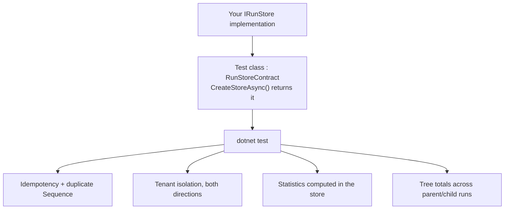

:::caution[Package availability]
Tracon packages and templates are not published yet. Package-install examples on
this page describe the release form and do not currently resolve from public
registries. With authorized repository access, use the
[source build instructions](/getting-started/first-agent/).
:::

The three built-in providers (`Tracon.PostgreSql`, `.SqlServer`, `.Sqlite`) cover
most deployments. When none of them fit — a document database, an existing
event-sourced system, a managed table service — `IRunStore` and the 32 other store
interfaces in `Tracon.Abstractions` are the extension point. This guide covers the
largest and most-documented one, `IRunStore`, using its behavior contract to verify
the result.

```bash
dotnet add package Tracon.Testing.Contracts.Xunit --prerelease
```

Add it to your **test** project only. It brings in `Tracon.Abstractions` and
nothing else from Tracon — no `Tracon.Core`, no SQL package, no ASP.NET Core.
xunit.v3 and Shouldly are ordinary dependencies: your test project's own xunit.v3
runner discovers the `[Fact]` methods the inherited contract class declares.

## Implement the interface

```csharp
public sealed class MyRunStore : IRunStore
{
    public ValueTask<RunRecord> StartRunAsync(RunStartInfo info, CancellationToken ct = default) { /* ... */ }
    public ValueTask AppendEventAsync(RunEvent runEvent, CancellationToken ct = default) { /* ... */ }
    public ValueTask CompleteRunAsync(RunCompletion completion, CancellationToken ct = default) { /* ... */ }
    public ValueTask<RunRecord?> GetRunAsync(Guid runId, CancellationToken ct = default) { /* ... */ }
    public ValueTask<IReadOnlyList<RunRecord>> QueryRunsAsync(RunQuery query, CancellationToken ct = default) { /* ... */ }
    public ValueTask<RunStatistics> GetStatisticsAsync(RunStatisticsQuery query, CancellationToken ct = default) { /* ... */ }
    public IAsyncEnumerable<RunEvent> ReadEventsAsync(Guid runId, long fromSequence = 0, CancellationToken ct = default) { /* ... */ }
    public ValueTask RecordToolInvocationAsync(ToolInvocationRecord invocation, CancellationToken ct = default) { /* ... */ }
    public ValueTask<IReadOnlyList<ToolInvocationRecord>> ListToolInvocationsAsync(Guid runId, CancellationToken ct = default) { /* ... */ }
    public ValueTask<IReadOnlyList<ToolUsage>> GetToolUsageAsync(ToolUsageQuery query, CancellationToken ct = default) { /* ... */ }
    public ValueTask<IReadOnlyList<ExperimentVariantResult>> GetExperimentResultsAsync(ExperimentResultsQuery query, CancellationToken ct = default) { /* ... */ }
    public ValueTask<IReadOnlyList<TimeSeriesPoint>> GetTimeSeriesAsync(RunTimeSeriesQuery query, CancellationToken ct = default) { /* ... */ }
    public ValueTask UpdateRunCostAsync(Guid runId, RunCost? cost, string? tenantId = null, CancellationToken ct = default) { /* ... */ }
    public ValueTask TouchHeartbeatAsync(IReadOnlyCollection<Guid> runIds, DateTimeOffset at, CancellationToken ct = default) { /* ... */ }
    public ValueTask<IReadOnlyList<RunRecord>> ClaimOrphanedRunsAsync(DateTimeOffset staleBefore, int max, CancellationToken ct = default) { /* ... */ }
}
```

Fifteen methods, and seven behavior axes the contract suite checks that a compiler
cannot:

| Axis | Rule |
|---|---|
| Idempotency | `StartRunAsync` is an UPSERT. A second call with the same `RunId` updates the row instead of opening a new one; `UserId` and `Labels` are COALESCED (a `null` value on the call leaves the previous value in place), and the **returned** record reflects that COALESCE, not the raw call arguments |
| Tenant behavior | Three modes across the interface: **expected tenant** (`AppendEventAsync`, `CompleteRunAsync`, `UpdateRunCostAsync` compare the call's tenant against the record's own, ignoring the ambient tenant), **ambient tenant** (the read methods filter by `ITenantContext` unless overridden), **tenant-independent** (`TouchHeartbeatAsync`, `ClaimOrphanedRunsAsync` are maintenance work that scans every tenant) |
| Thread safety | Registered as a singleton; must be safe under concurrent calls from unrelated runs and must not depend on a scoped service |
| Null / not-found semantics | `GetRunAsync` returns `null`; `ReadEventsAsync` returns an empty sequence; `AppendEventAsync` and `CompleteRunAsync` throw `TraconException` |
| Completion overrides | `CompleteRunAsync` may correct the model attribution a run started with: `RunCompletion.ModelId` and `RunCompletion.ModelProvider` each **overwrite** the stored value when set, and **leave it unchanged** when `null` — the common case, since only a `ModelBinding.Fallbacks` link answering makes a completion carry them. Persisting `ModelId` but forgetting `ModelProvider` costs the run its provider attribution silently, and the cost resolver then falls back to matching by model name alone |
| Event order | `RunEvent.Sequence` is assigned by the caller, not the store; events are append-only; `ReadEventsAsync`'s `fromSequence` is inclusive |
| Duplicate `Sequence` | A second `AppendEventAsync` call reusing a sequence number already written for that run is a caller error — reject it with `TraconException`, do not silently accept or silently drop it |

The full text lives on `IRunStore`'s own XML documentation — see [the API
reference](/api/tracon.irunstore/) for the exact wording each method carries.

## Prove it with the contract suite

```csharp
using Tracon.Testing.Contracts.Storage;

public sealed class MyRunStoreTests : RunStoreContract
{
    protected override ValueTask<IRunStore> CreateStoreAsync()
        => new(new MyRunStore(/* your dependencies */));
}
```

`dotnet test` now runs every scenario `RunStoreContract` defines: the idempotency and
duplicate-`Sequence` rules above, two-directional tenant isolation (a tenant reads its
own runs and never another tenant's), statistics aggregation computed *inside* the
store rather than by fetching rows into memory, tree totals across parent/child runs,
and error-cluster grouping. A method your store has not implemented yet makes the
inherited test **fail** with whatever exception that method throws — it does not fail
to compile, so an incomplete store is still a normal, greppable red build.

:::caution[Testing against a prerelease build]
If you point your project at a **prerelease** Tracon package that you built
yourself rather than one from nuget.org, give the run its own package cache:

```bash
NUGET_PACKAGES=$(mktemp -d) dotnet test
```

A prerelease version string can name different content over time. NuGet caches
by package id and version, so once `1.0.0-preview.1` is extracted into your
global cache, a later build carrying the same version is never re-read — your
store then compiles against the older contract and the contract suite reports
failures that do not exist in the package you just built.
:::



## What the suite does not check

The same three things every store contract leaves to you, regardless of interface:

- **Performance at scale.** The suite proves correctness on a handful of records; it
  is not a load test.
- **Your own persistence engine's guarantees.** If your backing store does not offer
  atomic upserts, `StartRunAsync`'s idempotency requirement is your problem to solve,
  not something the contract can verify for you.
- **Wiring into `AddTracon()`.** The contract suite exercises the store directly.
  Registering it (`services.AddSingleton<IRunStore, MyRunStore>()`, called before or
  after `AddTracon()` — `TryAdd*` means your registration always wins) is a
  separate, ordinary DI step.

## Other store interfaces

`IRunStore` is the largest and most heavily documented seam, but the same package
ships a contract class for every other store interface in `Tracon.Abstractions` —
sessions, agent definitions, jobs, evals, experiments, webhooks, and more. Each follows
the same shape: derive the matching `*Contract` class, supply a store instance, run
`dotnet test`.

`IJobStore`'s contract (`JobStoreContract`) also verifies lane behavior: `LeaseAsync`
takes an optional list of lanes and must only return a job from one of them, `null` or
an empty list applies no filter, and a retried job keeps its lane. See
[Background work](/guides/background-work/) for what a lane is and how a job's lane is
chosen.

`ISessionStore`'s contract (`SessionStoreContract`) checks the two rules that make
per-user [session ownership](/concepts/sessions/#session-ownership) work, and they are
easy to miss in a custom store because everything else keeps passing without them:

- **`SessionQuery.OwnerId` filters before `Skip`/`Take`.** The contract seeds five
  owned and five unowned sessions with the unowned ones newest, then asks for
  `Take = 3`. A store that pages first and filters the page afterwards returns fewer
  than three rows — and the gaps let a caller count how many sessions other users
  hold. A row with a `null` owner matches no owner filter at all: an unowned session
  is nobody's, not everybody's.
- **A write that carries no owner does not clear one already stored.** A session is
  written more than once, and a later write can come from a background worker with no
  request behind it. The three shipped SQL stores `COALESCE` the column for exactly
  this reason. Without the rule, a session silently drops out of its owner's list on
  the second write while every first-write test stays green.

A store that ignores `OwnerId` still compiles and still runs — session ownership just
never works on it. Running `SessionStoreContract` is what makes that visible.

`IJobStore` carries one aggregate method alongside the record-level ones.
`GetQueueDepthAsync` counts outstanding jobs grouped by lane and status, the way
`IRunStore.GetStatisticsAsync` sits on the run store rather than in an interface of
its own. Three rules the contract checks, and that a custom store has to honor:

- Count **only** the open statuses — `Pending`, `Leased`, and `Running`. A terminal
  job is counted by `tracon.job.executions` when it finishes, so scanning for it
  here would tie the query's cost to the queue's whole history.
- Omit a lane/status pair with no open jobs rather than reporting it as zero.
- Take **no tenant argument and apply no tenant filter**. Like `LeaseAsync`, this is
  a question about the worker pool, which leases across every tenant. The shipped SQL
  stores answer it from the same partial index that backs leasing.

## Read next

- [Persistence](/getting-started/persistence/) — the three shipped providers, for
  comparison
- [Runs and recording](/concepts/runs/) — what `IRunStore` records and why
- [Reference: every public type](/api/) — generated from the shipped XML documentation
