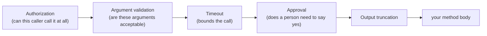

Use `[AgentPrismTool]` with `AddGeneratedTools()` for a custom tool. It is the AOT-safe
path. Tool instances are singletons and can run concurrently for different tenants and
runs. Keep no mutable run state in fields.

```csharp
using System.ComponentModel;
using System.Text.Json.Serialization;

[JsonSerializable(typeof(OrderReceipt))]
internal partial class OrderToolJsonContext : JsonSerializerContext;

public sealed record OrderReceipt(string OrderId, string Status);

public static class OrderTools
{
    [AgentPrismTool(
        "submit_order",
        "Submits an order to the fulfillment system.",
        Effect = ToolEffect.External,
        RequiredPermission = "orders.submit",
        RequiresApproval = true,
        SafeToRepeat = true,
        TimeoutSeconds = 30,
        MaxOutputBytes = 4096,
        JsonSerializerContext = typeof(OrderToolJsonContext))]
    public static Task<OrderReceipt> SubmitOrderAsync(
        [Description("The identifier of the order to submit.")] string orderId,
        CancellationToken cancellationToken)
        => Task.FromResult(new OrderReceipt(orderId, "submitted"));
}
```

`[Description]` (`System.ComponentModel.DescriptionAttribute`) reaches the generated
JSON Schema as the parameter's `description` — the strongest signal the model has for
filling in that argument correctly. A parameter without one still compiles; the
generator reports it as a warning (`APG0009`).

**What the generator can express:** a parameter's scalar type (primitive types,
`string`, `Guid`, `DateTime`/`DateTimeOffset`, `enum`), an array of these,
`description`, and whether it is required. **What it cannot express, on any
parameter:** a nested object, or a `minimum`, `maximum`, length, or `pattern`
constraint. For a nested object parameter, register the tool by hand instead:

```csharp
public sealed record OrderFilter(string Status, int MinAmount);

[JsonSerializable(typeof(OrderFilter))]
internal partial class OrderFilterJsonContext : JsonSerializerContext;

agentPrism.Services.AddSingleton<AgentPrismToolRegistration>(provider =>
    new(AIFunctionFactory.Create(
        (OrderFilter filter) => SearchOrders(filter),
        "search_orders",
        "Searches orders matching a filter.",
        OrderFilterJsonContext.Default.Options)));
```

The source generator preserves all this metadata. For a complex result, declare its
`JsonSerializerContext` in your own source as shown above; Roslyn does not let one
source generator feed a context to another in the same compilation. The context makes
the result canonical JSON, so content guards, the output limit, run records, and the
model inspect the same data. Return `AIContent` only for the existing attachment
contract; attachments are not inline output and are not subject to `MaxOutputBytes`.

Do not resolve dependencies from `AIFunctionArguments.Services`: MAF supplies an empty
provider. Resolve a singleton dependency when you register an `AIFunction`, as shown
above.

```csharp
var repository = provider.GetRequiredService<IOrderRepository>();
agentPrism.AddTool(AIFunctionFactory.Create(
    (string orderId) => repository.Find(orderId), "get_order", "Fetches an order."));
```

`ToolRegistrationOptions` contains `RequiresApproval`, `Effect`,
`RequiredPermission`, `Timeout`, `SafeToRepeat`, `MaxOutputBytes`, and `Source`.
Code-defined tools normally leave `Source` unset.

Do not replace `IToolRegistry`. It is AgentPrism's immutable startup snapshot and owns
authorization, timeout, approval, and output truncation. Startup rejects an unverified
replacement unless `Tools.AllowUnverifiedToolRegistry` is explicitly enabled.

Timeout is not a forced abort: the model stops waiting, but a tool body can still have
started an external side effect. Make external calls idempotent. AgentPrism records and
streams controlled error text, but arguments and successful results can be persisted;
never return a secret.

## Call pipeline order

Every registration — code-defined or MCP-sourced — passes through the same layers, in
the same fixed order, before your method body ever runs:



Authorization runs first: asking a person to approve, waiting out a timeout, or
validating arguments for a call the caller could never make at all is backwards.
Argument validation runs next, still before the timeout and the approval wait — a
malformed call should not consume a timeout budget or wait on a human decision. The
scope `AddScopedTool` opens (below) surrounds only the innermost box, `your method
body`: nothing outside it ever resolves a scoped dependency.

## Scoped dependencies

A singleton dependency is resolved once, at registration. When the dependency has to
be fresh **per call** — a repository, a `DbContext` — use `AddScopedTool` instead of
`AddTool`. Its shape is identical; the difference is one word, and the word means
exactly this: every call opens its own dependency-injection scope, exposes it through
`AIFunctionArguments.Services`, and closes it as soon as the call ends.

```csharp
agentPrism.AddScopedTool(
    AIFunctionFactory.Create(
        async (string orderId, AIFunctionArguments arguments) =>
        {
            var writer = arguments.Services!.GetRequiredService<IOrderWriter>();
            return await writer.SubmitAsync(orderId);
        },
        "submit_order",
        "Submits an order."),
    options =>
    {
        options.RequiresApproval = true;
        options.Effect = ToolEffect.External;
        options.RequiredPermission = "orders.submit";
        options.Timeout = TimeSpan.FromSeconds(30);
        options.SafeToRepeat = true;
        options.MaxOutputBytes = 4096;
    });
```

`AIFunctionArguments.Services` is real inside a tool registered this way — the empty
provider MAF otherwise supplies is only ever seen by a plain `AddTool`/`AddToolsFrom`
registration. Two concurrent calls to the same scoped tool never share a scope. An
instance method marked `[AgentPrismTool]` still cannot be a tool (the source generator
rejects it at scan time) — the rejection message points here.

## Argument validation

Binding a call's JSON arguments already rejects a type mismatch, a missing `required`
field, or an invalid `enum` value, but it never rejects an extra field the schema does
not declare. Register `IToolArgumentsValidator` to add your own check, applied
uniformly before every server-side call — a code-defined tool and an MCP-sourced tool
share the same gate:

```csharp
public sealed class NoExtraFieldsValidator : IToolArgumentsValidator
{
    public ValueTask<ToolArgumentsValidationResult> ValidateAsync(
        ToolDescriptor tool, AIFunctionArguments arguments, CancellationToken cancellationToken = default)
        => arguments.Count > ExpectedFieldCount(tool)
            ? new(ToolArgumentsValidationResult.Invalid("Unexpected argument field."))
            : new(ToolArgumentsValidationResult.Valid);
}

services.AddSingleton<IToolArgumentsValidator, NoExtraFieldsValidator>();
```

There is no built-in JSON Schema validator — validation stays inside your own trust
boundary, the same stance [structured output](/guides/structured-output/) takes on the
response side. Nothing is registered by default, so an application that never adds a
validator keeps today's behavior exactly. A rejected call is recorded as `ToolFailed`,
never runs the real body, and the model receives your `Invalid` reason as its result —
never write an argument's actual value into that reason; a run event is persistent and
an argument can carry a secret. If your validator throws, the call is rejected
(fail-closed), the same way a throwing `IToolAuthorizationHandler` denies instead of
crashing the run.

## Prove the registration

The `AgentPrism.Testing.Contracts.Xunit` package ships `CustomToolContract`.
Derive it in your test project to check the registration name, metadata, and concurrent
server-side invocation.

```csharp
using AgentPrism.Testing.Contracts;
using AgentPrism.Testing.Contracts.Tools;

public sealed class OrderToolTests : CustomToolContract
{
    protected override ValueTask<AgentPrismToolRegistration> CreateRegistrationAsync()
        => new(new AgentPrismToolRegistration(MyOrderTool));
}

[Fact]
public void All_tool_contracts_are_covered()
    => ContractCoverage.MissingDerivedTypes(
        typeof(OrderToolTests).Assembly,
        ContractCoverage.ToolContracts).ShouldBeEmpty();
```

## Read next

- [Tools, skills, and MCP](/concepts/tools/) — the governance model
- [Adding a tool](/getting-started/tools/) — the generated and reflection paths
