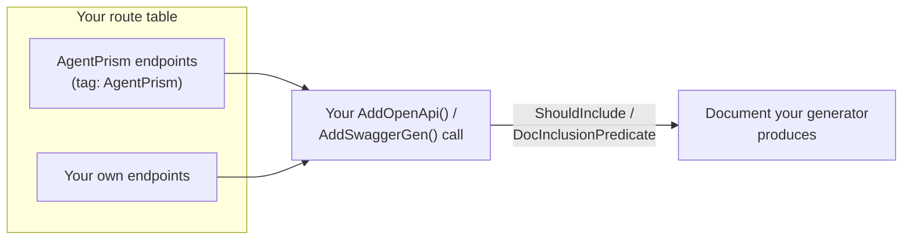

163 operations across 126 paths. This page is the shape they all share; the groups in
the sidebar are the operations themselves, each with what it does and what it returns.

The OpenAPI document is published as
[`/openapi/agentprism.json`](/openapi/agentprism.json) — load it into
Scalar, Swagger UI, Postman, or a client generator.

## The prefix is yours

Generated operation pages use `{prefix}`. Replace it with the value passed to
`MapAgentPrism`; the project template uses `/agentprism`.

```csharp
app.MapAgentPrism("/agentprism");
```

## Two surfaces

**The management API** (`/api/*`) drives the control plane: agents, runs, sessions,
skills, workflows, evals, experiments, jobs, and governance.

**OpenAI-compatible endpoints** (`/v1/*`) let an OpenAI client talk to your agents
with the familiar request and streaming formats. Configure its base URL and
authentication, and set `model` to the **agent** name — which provider model the
agent calls is server-side policy. See the [OpenAI API guide](/guides/openai-api/)
for copyable clients and the compatibility boundary.

## Authentication

A bearer token in the `Authorization` header, holding either the configured static
token or an API key. See
[securing the endpoints](/getting-started/security/) for the layers and how
scopes narrow roles.

`{prefix}/api/meta` answers without authentication — the console needs to learn which
method to present. It returns nothing sensitive.

## Streaming

Run endpoints answer with `text/event-stream`, one frame per run event, and the first
frame reports the run id.

```bash
curl -N -X POST http://localhost:5081/agentprism/api/agents/support/run \
     -H 'Content-Type: application/json' \
     -d '{"message":"Where is order 4182?"}'
```

Two headers change the shape:

| Header | Effect |
|---|---|
| `Idempotency-Key` | One JSON response instead of a stream — a replay cannot be rebuilt from a stream |
| `Prefer: respond-async` | `202 Accepted` plus a `Location` header; poll the job |

:::caution[A stream cannot report a late failure as a status code]
The status code is sent before the first frame. A failure after that arrives as an SSE
`error` frame, not an HTTP error. A client that only checks the status code will treat
a failed run as a success.
:::

A run that stops on a tool call needing a human decision sends an `approvals` frame
before the stream ends — the pending request's id and tool name, plus whatever an
[approval presenter](/concepts/governance/#approvals) resolved for it. See
[Approvals](/concepts/governance/#approvals) for the queued-run mailbox shape, which
answers the same request differently.

With `Quotas:PublishThresholdToRunStream` turned on (off by default), a run whose
completion crosses a [quota threshold](/concepts/governance/#quotas-and-rate-limits)
also gets a `custom` frame before `done` — the same notice, byte for byte, that
`GET /api/runs/{runId}/events` carries for that run.

`GET /api/runs/{runId}/events` is a **separate** SSE contract with its own, larger
set of frame names (`run.started`, `tool.invoking`, ...) — see
[the two-contract table in Runs and recording](/concepts/runs/#two-sse-contracts-not-one).


## Paging

List endpoints that page use `skip` and `take`. `skip` defaults to 0, `take` to 50,
and **`take` is clamped to 1..200 rather than rejected** — an out-of-range value never
fails a request.

Ordering is usually newest first, which means an item can move between pages while a
client is paging. Use the id as identity, never the position.

Some lists are deliberately not paged — agents, skills, quotas, retention policies —
because their size is bounded by configuration rather than by traffic.

## Errors

Failures are `application/problem+json` with a title and a detail. Two conventions run
through the whole API:

**A resource you may not see is reported as `404`, not `403`.** Another tenant's run,
session, or conversation is reported as missing, so the API does not confirm that it
exists.

**Error text is English and is not translated.** The same failure has to read the same
way in a log, a test, and a support ticket. The console translates its own labels and
shows server text as it is.

| Status | Means |
|---|---|
| `400` | The request is malformed or fails validation |
| `401` | Missing or invalid credentials |
| `403` | Authenticated, but not allowed — including the loopback restriction |
| `404` | Not found, or not yours |
| `409` | Conflicting state — a name in use, a running experiment, a code-defined agent, a client-side tool that cannot be replayed |
| `422` | A content guard blocked the content |
| `429` | A quota or rate limit was exceeded |
| `501` | The capability is not registered — the workflow engine, voice, or knowledge |
| `503` | The process is draining in-flight runs before it stops; retry shortly |

`501` is worth its own note: it means "this build does not have that package wired
up", which is a different problem from a wrong address, and the API says so rather
than answering `404`.

**A `502`'s `detail` is deliberately shallow** — it never carries the failing
provider's own error text, only its exception type and a correlation id you can
match against your server's log. The same rule applies to a streaming run's `error`
frame and to MCP tool-call errors. See
[errors are classified](/concepts/runs/#the-error-message-is-safe-to-display-not-safe-to-debug-from)
for why.

## The groups

Pick one from the sidebar. Each operation shows every declared media type, parameters,
responses, and response headers. [HTTP schemas](/http-api/schemas/) expands
all 254 request and response contracts with required fields, defaults, and validation
constraints from the OpenAPI snapshot.

## About the published document

The AgentPrism packages do not generate the OpenAPI document themselves — they carry
route metadata, and your own `AddOpenApi()` call produces the document. Taking an
OpenAPI dependency would force it, and its transitive CVE exposure, onto every
consumer.

The consequence: the title, version, and server list in the published snapshot come
from the host that generated it. In **your** document they come from your application.
The paths, schemas, and descriptions are the same.

Because AgentPrism maps plain minimal API endpoints on your own
`IEndpointRouteBuilder`, they are also picked up by **your** OpenAPI/Swagger
generator, right alongside your own endpoints — no separate setup on AgentPrism's
side turns this on or off.



### Excluding AgentPrism from your document

Every AgentPrism endpoint carries the `AgentPrism` tag. If your document should not
describe AgentPrism's operations — for example, one you publish to external
partners — filter on that tag in your own OpenAPI setup; AgentPrism has no
built-in switch for this.

With `Microsoft.AspNetCore.OpenApi`:

```csharp
using Microsoft.AspNetCore.Http.Metadata;

builder.Services.AddOpenApi(options =>
{
    options.ShouldInclude = description =>
        !description.ActionDescriptor.EndpointMetadata
            .OfType<ITagsMetadata>()
            .Any(tags => tags.Tags.Contains("AgentPrism"));
});
```

With Swashbuckle:

```csharp
builder.Services.AddSwaggerGen(options =>
{
    options.DocInclusionPredicate((_, apiDescription) =>
        !apiDescription.ActionDescriptor.EndpointMetadata
            .OfType<ITagsMetadata>()
            .Any(tags => tags.Tags.Contains("AgentPrism")));
});
```

The filter only changes what your document *describes*. AgentPrism's endpoints stay
reachable; they just stop appearing in your Swagger UI or generated document.

## Read next

- [HTTP API reference](/http-api/) — every operation, grouped by tag
- [Securing the endpoints](/getting-started/security/) — the authentication these conventions assume
- [OpenAI-compatible API](/guides/openai-api/) — the other HTTP surface, with different rules
