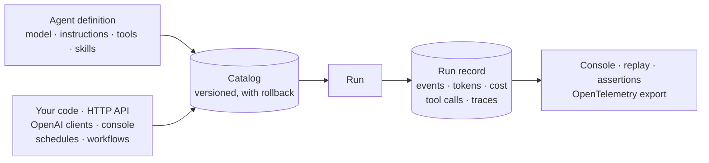

import { Card, CardGrid, Code } from '@astrojs/starlight/components';

  You wrote an agent with the Microsoft Agent Framework and it works. Now someone has
  to operate it: find out what it did last Tuesday, stop it spending without a limit,
  test it without calling a model, and let a second team drive it over HTTP. That
  layer is what AgentPrism is.

  <strong>20</strong> NuGet packages
  <strong>168</strong> generated HTTP operations
  <strong>30</strong> embedded console screens
  <strong>0</strong> required infrastructure to start

<CardGrid>
  <Card title="A control plane, not another agent abstraction" icon="puzzle">
    Keep using MAF's `AIAgent`, `AgentSession`, `ChatMessage`, and `AIFunction`.
    AgentPrism adds the operational layer around them without replacing their model.
  </Card>
  <Card title="Evidence for every important decision" icon="approve-check">
    Default-on runs capture events, tool calls, traces, tokens, cost, errors, and
    child-agent trees. Store failure never gets permission to stop product work.
  </Card>
  <Card title="From empty folder to production topology" icon="rocket">
    Start in memory. Add PostgreSQL, SQL Server, or SQLite; workers, scheduling,
    health, OpenTelemetry, quotas, retention, and tenant isolation when you need them.
  </Card>
  <Card title="One agent, every useful surface" icon="seti:c-sharp">
    Call it from .NET, the management API, OpenAI Responses or Chat Completions.
    Publish selected agents as MCP tools or A2A endpoints with explicit budgets.
  </Card>
</CardGrid>

## Thirty seconds

<Code
  lang="csharp"
  title="Program.cs"
  code={`var builder = WebApplication.CreateBuilder(args);

var agentPrism = builder.AddAgentPrism()
    .UseOpenAI(builder.Configuration.GetSection(OpenAIProviderOptions.SectionName))
    .UseUI();

agentPrism.AddAgent(new AgentDefinition
{
    Name = "support",
    Instructions = "Resolve customer issues clearly and safely.",
    Model = new ModelBinding
    {
        Provider = OpenAIProviderNames.ChatCompletions,
        Model = "your-model"
    }
});

var app = builder.Build();

app.MapAgentPrism("/agentprism");
app.Run();`}
/>

Run it and open `/agentprism`. Create an agent, talk to it in the playground, then
open the run and read it back event by event.

<figure class="product-shot">
  
  <figcaption>The embedded console reads the same API you can automate.</figcaption>
</figure>

## Choose your path

<CardGrid>
  <Card title="Build an agent" icon="open-book">
    Go from install to a real provider, a code-defined tool, persistence, and a
    deterministic test. [Start the five-minute guide](/getting-started/first-agent/).
  </Card>
  <Card title="Integrate an existing client" icon="list-format">
    Use OpenAI Responses or Chat Completions, manage agents over HTTP, or publish
    a selected agent through MCP or A2A. [Choose a surface](/guides/openai-api/).
  </Card>
  <Card title="Operate the platform" icon="setting">
    Design storage, migrations, workers, health, telemetry, security, quotas,
    retention, and recovery. [Use the production guide](/guides/production/).
  </Card>
  <Card title="Evaluate the fit" icon="information">
    See every feature, its package and surface, its default state, and its production
    boundary. [Open the capability map](/capabilities/).
  </Card>
</CardGrid>

  <strong>It is a library, not a hosted service.</strong> It runs inside your ASP.NET
  Core process, on your configuration, your authentication, and your database. There
  is no account, and AgentPrism sends no telemetry of its own — nothing is
  reported back to AgentPrism or to any vendor. What does leave your process is
  what you configure: an OpenTelemetry exporter you register, and the model
  provider, MCP server, and webhook calls your agents make. Four rules hold
  everywhere:
  <code>AddAgentPrism()</code> works with no infrastructure, tools are defined in code
  and never in the console, MAF objects are passed through rather than wrapped, and
  every extension point registers with <code>TryAdd</code> so your own implementation
  wins. <a href="/getting-started/">What AgentPrism is</a> explains each.

:::caution[Pre-release]
AgentPrism has not shipped `1.0`. The ASP.NET Core package depends on preview Microsoft
Agent Framework hosting packages, and public APIs can still move between previews. Pin
package versions and validate an upgrade before production — see [Versions and
upgrades](/reference/versioning/).
:::
