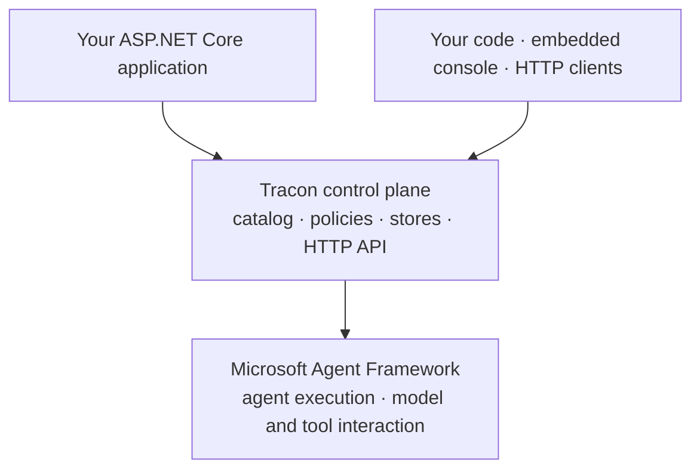

import '../../styles/landing.css';

import { Code } from '@astrojs/starlight/components';

  <h2>Autonomy needs an operating model.</h2>
  
Your agent can answer a question. Operating it asks different questions: which tenant owns the session, who may call a tool, how work resumes, and what happened during a run. Tracon gives those questions a place in your application.

  <section class="operation-strip">
    
01 / Boundary<h3>Separate.</h3>

    
One host can serve several tenants. Tenant-scoped stores keep their records apart; authentication and caller attribution determine which scope a request enters.

    <a href="/getting-started/security/">Set the tenant boundary →</a>
  </section>
  <section class="operation-strip">
    
02 / Coordination<h3>Sequence.</h3>

    
A task can involve several agents and a human decision. Coordinate workflows with checkpoints and resume; schedule recurring work or queue a run for a worker.

    <a href="/concepts/workflows/">Follow a workflow →</a>
  </section>
  <section class="operation-strip">
    
03 / Permission<h3>Clear.</h3>

    
A model proposing a tool call does not set its policy. Define tools in code, apply authorization, and require approval for the calls you choose to review.

    <a href="/concepts/tools/">Define the tool policy →</a>
  </section>
  <section class="operation-strip">
    
04 / Evidence<h3>Record.</h3>

    
Inspect run events, tool calls, timing, and configured cost data. Catalog agents record by default. Recording is best-effort: a store failure is logged while the agent continues.

    <a href="/concepts/runs/">Read a recorded run →</a>
  </section>

<a href="/packages/"><strong>20</strong> NuGet packages</a> · <a href="/http-api/"><strong>168</strong> generated HTTP operations</a> · <a href="/ui/"><strong>30</strong> embedded console screens</a>

## MAF runs the agent. Tracon provides the controls.

Keep MAF's `AIAgent`, `AgentSession`, `ChatMessage`, and `AIFunction`. Tracon adds
catalogs, policies, persistence, inspection, and HTTP access around those objects.
There is no parallel agent type hierarchy to adopt.

## The console ships in the assembly.

Add `Tracon.UI` and register `UseUI()` to embed the console in your host. It reads
the same management API that your own clients can call. The consuming application
does not need Node.js or a JavaScript build to serve it.

<figure class="product-shot">
  
  <figcaption>The real console, captured from a local sample with seeded runs. This is sample data, not live telemetry.</figcaption>
</figure>

<Code lang="csharp" title="Program.cs · registration in a configured host" code={`using Tracon;

var builder = WebApplication.CreateBuilder(args);
builder.AddTracon().UseUI();

var app = builder.Build();
app.MapTracon("/tracon");
app.Run();`} />

This registers the control plane and console. An agent and model provider are
configured separately. Storage starts in memory; add persistence when the records
must survive a restart. Tracon is not yet published: the [source-based guide](/getting-started/first-agent/)
requires access to a checkout of the repository.

## Choose your path

<ul class="route-list">
  <li><a href="/getting-started/first-agent/"><strong>Build</strong>Configure a source checkout, run an agent, and inspect the result.↗</a></li>
  <li><a href="/guides/openai-api/"><strong>Integrate</strong>Connect an OpenAI-compatible client to an existing agent.↗</a></li>
  <li><a href="/guides/production/"><strong>Operate</strong>Plan persistence, authorization, workers, telemetry, and recovery.↗</a></li>
  <li><a href="/capabilities/"><strong>Evaluate</strong>Review capabilities, package choices, defaults, and operating limits.↗</a></li>
</ul>

  
<strong>Your host owns the boundary.</strong> Tracon is a .NET package family embedded in your application. You configure authentication, model providers, storage, and outbound connections. Tools are defined in code; the console cannot write tool code. <a href="/getting-started/">Read the architecture and limits</a> before choosing an integration.

Public packages are not available yet. The ASP.NET Core integration also uses
preview MAF hosting dependencies. Review [compatibility](/reference/compatibility/),
[versioning](/reference/versioning/), and [licensing](/reference/licensing/)
as part of your evaluation.
