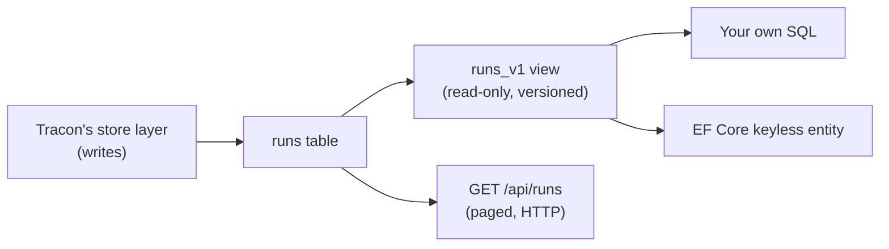

Two ways exist today to put a run's cost or status next to your own entity in a
report: page through `GET /api/runs` and join in memory, or connect straight to
Tracon's internal tables and risk breaking on the next release. `runs_v1` is a
third way — a narrow, versioned, read-only SQL view built for exactly this.



## What the view is

`runs_v1` is a plain SQL view over the `runs` table, published as an **opt-in**
migration set on all three SQL providers: PostgreSQL, SQL Server, and SQLite.

```csharp
builder.AddTracon()
       .UsePostgreSql(o =>
       {
           o.ConnectionString = connectionString;
           o.EnableReadViews = true;
       });
```

The equivalent setting exists on `TraconSqlServerOptions.EnableReadViews` and
`TraconSqliteOptions.EnableReadViews`. It defaults to `false`<!-- claim:option TraconSqliteOptions.EnableReadViews=false -->: a deployment
that never turns it on pays nothing for it, and never sees a `runs_v1` object in
its database.

| Provider | Object name |
|---|---|
| PostgreSQL | `{schema}.runs_v1` (default schema `tracon`) |
| SQL Server | `{schema}.runs_v1` (default schema `tracon`) |
| SQLite | `{prefix}runs_v1` (default prefix `tracon_`, no separating dot) |

## Columns

| Column | Type | Notes |
|---|---|---|
| `run_id` | uuid / uniqueidentifier / text | |
| `tenant_id` | text | Not filtered — see [It is not a tenant boundary](#it-is-not-a-tenant-boundary) |
| `agent_name` | text | |
| `session_id` | text | `NULL` for a run with no session |
| `status` | smallint | The numeric `RunStatus` value; stable, never renumbered |
| `status_name` | text | The `RunStatus` name (`"Completed"`, `"Failed"`, …) so you never hand-write the mapping |
| `started_at`, `completed_at` | timestamp | UTC; `completed_at` is `NULL` while a run is in progress |
| `is_streaming` | boolean | |
| `input_tokens`, `output_tokens`, `cached_input_tokens`, `reasoning_tokens`, `total_tokens` | bigint | `cached_input_tokens` is counted **inside** `input_tokens`, not in addition to it |
| `input_cost`, `output_cost`, `cached_input_cost` | decimal | The raw priced terms; `NULL` when pricing is undefined |
| `total_cost` | decimal | See [Reading `total_cost`](#reading-total_cost) below |
| `cost_currency` | text | Populated whenever `total_cost` is |
| `error_type` | text | The raw error type string; `NULL` for a run that has not failed |
| `model_provider` | text | The provider that actually answered; `NULL` for a row written before this column existed |
| `input_price_per_mtok`, `output_price_per_mtok`, `cached_input_price_per_mtok` | decimal | The unit price (per million tokens) applied when the run completed — a price snapshot, `NULL` when the price was unknown. Rates, not amounts: they are never part of `total_cost` |

Everything here is metadata or a value derived from metadata. No conversation
content, tool argument, tool result, or file content is ever in scope for this or
any future view — those columns are protected at rest and stay reachable only
through the HTTP API and `IRunStore`.

## Reading `total_cost`

`total_cost` sums every priced term (`input_cost`, `output_cost`,
`cached_input_cost`) with one rule that matters: **`NULL` is not zero.**

- If pricing was never resolved for the run (an unpriced code agent, for example),
  all three terms are `NULL` and `total_cost` is `NULL` — the run has no known cost,
  which is a different fact than "this run cost nothing."
- If at least one term is populated, `total_cost` sums the populated terms.

This is the exact value `IRunStore.GetStatisticsAsync` reports for the same run —
querying the view and reading the API give you the same number, because both read
the same underlying columns with the same null-preserving rule.

## It is not a tenant boundary

`runs_v1` carries `tenant_id` as a plain column. It does **not** filter by tenant.
A query against the view with no `WHERE tenant_id = ...` clause returns every
tenant's rows, in a single multi-tenant deployment. Add your own tenant filter —
the same way you would against any other multi-tenant table you own.

## EF Core: a keyless entity

Map the view as a keyless entity — it has no primary key you should rely on for
change tracking, and you are not writing through it:

```csharp
public sealed class TraconRun
{
    public Guid RunId { get; set; }
    public string TenantId { get; set; } = default!;
    public string AgentName { get; set; } = default!;
    public string? SessionId { get; set; }
    public short Status { get; set; }
    public string StatusName { get; set; } = default!;
    public DateTimeOffset StartedAt { get; set; }
    public DateTimeOffset? CompletedAt { get; set; }
    public bool IsStreaming { get; set; }
    public long? InputTokens { get; set; }
    public long? OutputTokens { get; set; }
    public long? CachedInputTokens { get; set; }
    public long? ReasoningTokens { get; set; }
    public long? TotalTokens { get; set; }
    public decimal? InputCost { get; set; }
    public decimal? OutputCost { get; set; }
    public decimal? CachedInputCost { get; set; }
    public decimal? TotalCost { get; set; }
    public string? CostCurrency { get; set; }
    public string? ErrorType { get; set; }
}

modelBuilder.Entity<TraconRun>()
    .HasNoKey()
    .ToView("runs_v1", "tracon");
```

Three things to keep in mind:

- **`.ToView(...)` never appears in your own `dotnet ef migrations add` output.**
  Tracon's migration creates the view; your own migration history stays
  untouched. This is why the two migration steps never conflict — see
  [Two migration steps, one order that matters less than you think](/guides/ef-core/#two-migration-steps-one-order-that-matters-less-than-you-think).
- **Your own query still needs the tenant filter** — the view does not apply one
  (above).
- **Retention deletes rows out from under the view.** If a retention policy
  deletes an old run, it disappears from `runs_v1` too — the view reflects the
  table's current contents, not a separate archive.

## The compatibility rule

`runs_v1` is a **published contract**: once shipped, it never loses a column,
renames a column, or narrows a column's type. Adding a column is always safe and
does not require a new version. A change that would break an existing consumer
ships as `runs_v2` instead, and `runs_v1` keeps working for at least one major
version afterward.

## Read next

- [Two connection planes — EF Core and Tracon](/guides/ef-core/) — sharing a connection pool, and what an EF `DbContext` does not get
- [Observability](/guides/observability/) — run statistics through the HTTP API, the same numbers this view reads
- [Choose a migration strategy](/guides/production/#choose-a-migration-strategy) — `AutoApplyMigrations` and running `tracon migrate` as its own deploy step
