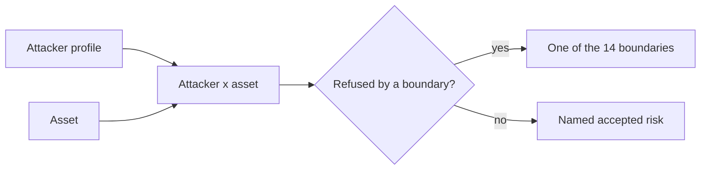

Tracon is a control plane: it holds agent definitions, session content, tool call
authority, and the credentials that reach model providers and MCP servers. That makes
it a security boundary in its own right, not just a caller of one. This page names the
attackers a deployment should assume, the assets they go after, which boundary stops
each combination, and — just as important — which combinations nothing stops today.

:::note[Measured against this build]
The boundary list below is kept in lockstep with [Securing the
endpoints](/getting-started/security/#the-boundaries-tracon-enforces) by an automated
check. If the two ever disagree, this page is the one that is stale.
:::

## Attacker profiles

Seven profiles. The last two do not come through Tracon's own API at all — a
meaningful share of the risk in a system like this comes from people who already have
some form of legitimate access.

| Profile | Description |
|---|---|
| Unauthenticated network caller | Reaches a Tracon route with no token, API key, or policy |
| Low-privilege tenant user | Authenticated, holds `Reader` or `Operator`, tries to reach another session or an `Admin`-only action inside their own tenant |
| Another tenant's user | Authenticated, but belongs to a different tenant than the one they target |
| Content carried through a tool result | Text arriving through a tool's output, a fetched file, or an MCP resource that behaves like an instruction (prompt injection) |
| A malicious MCP server | A remote server Tracon connects to, abusing the tools or resources it advertises, or the content it returns |
| An operator with console or API access | A legitimately authorized identity, acting outside — deliberately or accidentally — what that authorization was meant to cover |
| Someone with direct database read access | A stolen backup, a misconfigured grant, a decommissioned disk — reads storage without ever going through Tracon's HTTP surface |

## Assets

What an attacker in the table above is after:

- **Secrets** — provider API keys, webhook and MCP signing values
- **Tenant data** — agent definitions, tenant settings, approval rules, provider bindings
- **Session content** — prompts, responses, tool arguments and results, attachments
- **The audit trail** — the record of who did what, and the state before and after
- **Tool call authority** — the right to invoke a specific tool with specific arguments
- **Model budget** — request rate and spend ceilings
- **Script execution rights** — running a skill script inside its sandbox

## Boundary mapping

The boundaries a deployment gets by using Tracon as designed. Configuring any one of
them is covered in [Securing the endpoints](/getting-started/security/); this table is
the complementary question — which boundaries exist, and what each one refuses.

| Boundary | What it refuses |
|---|---|
| Endpoint access | An unauthenticated or unauthorized caller |
| Tenant isolation | Reading or writing another tenant's rows |
| Session ownership | Continuing a conversation the caller does not own |
| Tool authorization | A tool call the caller is not entitled to make |
| Tool approval | An unapproved tool call, until a human decides |
| Tool definition | A tool written from the console — tools exist only in code |
| Script sandboxing | A skill script escaping its sandbox, when scripts are on at all |
| Outbound egress | A request to a private network target or a disallowed host |
| Content guards | Input or output a configured guard rejects |
| Secret handling | A secret value reaching storage, a log, or a response |
| At-rest protection | Readable content in a database you do not fully trust |
| Audit trail | Six operations proceeding without their record |
| Quotas and rate limits | Spend and request volume above the configured ceiling |
| Production profile | A host starting with a security decision never made |

Most of these boundaries run inside the ASP.NET Core request pipeline. Someone with
direct database read access never enters that pipeline, so only two of the fourteen —
secret handling and at-rest protection — reach them at all.

## Accepted risks

A threat model is only honest if it says what it does not close. These are not
defects; they are named so a deployment can make an informed call.

:::caution[Prompt injection is only stopped where a guard is configured]
Content that arrives through a tool result or an MCP server's own response is not
inspected by default. [Content guards](/concepts/governance/#content-guards) close
this, but they are opt-in — an unconfigured deployment has no boundary here. This is
listed as out of scope in the [security policy](/reference/security-policy/) for the
same reason: Tracon cannot promise a guard it was not asked to run.
:::

:::caution[Direct database access bypasses application-layer boundaries]
Tenant isolation, session ownership, tool authorization, and role checks all run in
the HTTP pipeline. Someone reading the database directly skips all of them. The only
defenses that still apply are that secret values are never written there at all, and
[at-rest content protection](/getting-started/security/#at-rest-content-protection),
which is off by default and — even when on — does not cover the audit trail's stored
state.
:::

:::caution[The audit trail's best-effort half can go silently thin under a storage outage]
Six operations — an approval decision, granting or running a skill script, saving or
deleting an inbound trigger, an automatic canary rollback, and a data subject erasure
— refuse to proceed if their audit record fails to write. Every other audit write is
best-effort: the operation continues and the record can be missing. See [what is
guaranteed to be written](/concepts/governance/#what-is-guaranteed-to-be-written) for
the full split and how a failed write is surfaced in metrics.
:::

:::caution[An authorized identity can still exceed what it was meant to do]
Roles bind to your own authentication claims; Tracon stores no users of its own. A
role policy proves it was applied correctly — it cannot prove the underlying claim was
handed to the right person. Misuse of a legitimately granted `Admin` role is your
identity provider's boundary, not Tracon's.
:::

:::note[Deliberate, not a gap]
The console shell (its HTML, JavaScript, and CSS) is exempt from the bearer-token
layer because a browser cannot attach an `Authorization` header to a script tag. It
carries no data, and every endpoint behind it stays fully protected — see [two
deliberate exemptions](/getting-started/security/#two-deliberate-exemptions).
:::

Turning on [`RequireProductionProfile()`](/concepts/governance/#requiring-a-production-decision)
forces a deployment to answer — or explicitly accept, by name — the risks that a
permissive default otherwise leaves open: single-tenant mode, unowned sessions,
unencrypted content at rest, uninspected content, unlimited request rate, and
unbounded retention.

## Read next

- [Securing the endpoints](/getting-started/security/) — the layers you configure
- [Security policy](/reference/security-policy/) — reporting a vulnerability, and scope
- [Governance](/concepts/governance/) — audit trail, quotas, tenancy
