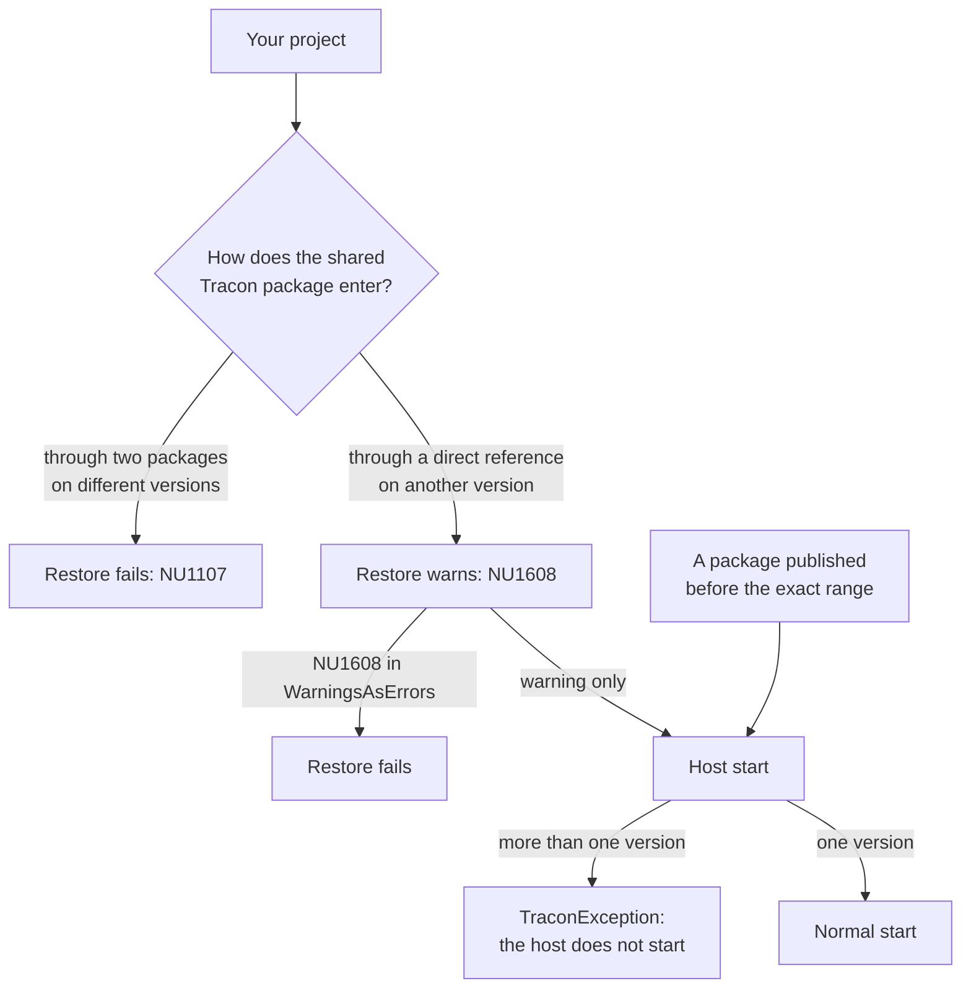
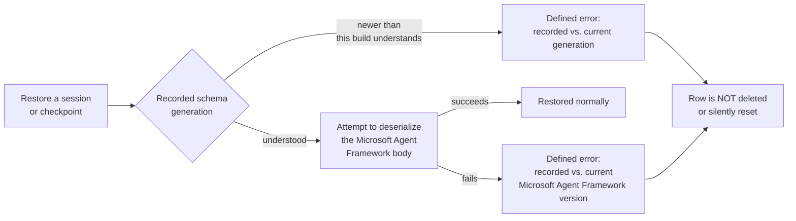

:::note[Preview packages]
Tracon is published as `1.0.0-preview.2`. Use `--prerelease` for discovery or
pin the exact version for reproducible builds.
:::

Tracon is a pre-1.0 package family. Treat version selection as part of your
application architecture, not as a restore detail.

The release process produces 20 NuGet packages and one npm package (`@tracon/client`), all
cut from the same `v*` tag and sharing one version line: there is no split between
a stable subset and a preview subset. The public surface carries no compatibility
promise for as long as that line stays pre-1.0 - a narrowing or a reshaped type is
not treated as a breaking change until the family reaches `1.0.0`.

## Release notes

Every published version has a dated entry on the [Release
notes](/reference/changelog/) page, grouped as Added, Changed, Deprecated,
Removed, Fixed, and Security. Each package's `PackageReleaseNotes` metadata
links to the entry for the exact version you installed.

## Package identity

For packages produced by the official release process, a `<package id, version>`
pair names exactly one artifact. That guarantee comes from the pipeline, not from
NuGet: a locally packed or otherwise unofficial build can reuse a version string
that already named different content, and NuGet's cache will not notice — see
[the caching caution](/guides/write-your-own-store/) if you pack previews
yourself. For official artifacts the release process enforces this before a
package is ever produced:

- **Every packed artifact traces back to a commit.** The build refuses to
  produce a package from an uncommitted working tree — there is no version
  that can mean "whatever the source happened to be at the time." Each
  package's `.nuspec` carries the exact commit it was built from.
- **A version is never silently replaced with different content.** If a
  release run would produce a `<package id, version>` pair that already
  exists with different bytes, the run stops and the existing, previously
  published artifact is left untouched — it is never overwritten in place.

This is independent of NuGet's own package integrity check: every `.nupkg`
carries a content hash (`<id>.<version>.nupkg.sha512` next to it in your local
package cache — find the cache path with `dotnet nuget locals global-packages
--list`), and nuget.org publishes the same hash for the version it lists. If
those two ever disagree, something between the registry and your machine
changed the bytes — that check exists independently of anything Tracon
does, and applies to any NuGet package, not only this family.

## Which version do these docs describe?

This site is built from the repository's `main` branch. The .NET reference is generated
from the assemblies built from that same source, and the HTTP reference is generated from
the OpenAPI snapshot in that source tree.

That makes the site the best description of the next build. It can also document a public
API that is newer than the preview package you installed. When exact reproducibility
matters, pin every Tracon package and check the [Release
notes](/reference/changelog/) entry for the version you installed before you rely on
anything this site describes.

:::caution[Preview contract]
Tracon has not shipped `1.0`. Public APIs, migrations, configuration keys, and
provider behavior can change between previews. Review the [Release
notes](/reference/changelog/) and this site's compatibility matrices before each
upgrade.
:::

## Install the newest preview

Use NuGet's pre-release selection explicitly:

```bash
dotnet add package Tracon --prerelease
```

The project template resolves pre-release packages by default, but pinning it makes a
team build reproducible:

```bash
TRACON_VERSION=1.0.0-preview.N # replace N with the published preview
dotnet new install "Tracon.Templates@$TRACON_VERSION"
dotnet new tracon-api --TraconVersion "$TRACON_VERSION"
```

## Pin the whole package family

Do not mix Tracon preview versions. The packages share public contracts, DI
registrations, database migrations, and generated code, and one package can call a
sibling member that another release removed.

Every Tracon package depends on its Tracon siblings at **exactly its own version**
(`[1.0.0-preview.N]`), so NuGet and the host stop a mixed graph at three points:



- **Two packages on different versions** that share a sibling (for example
  `Tracon.AspNetCore` and `Tracon.Voice`, which both need `Tracon.Core`) fail
  restore with `NU1107`.
- **A direct reference wins.** Referencing `Tracon.Core` at another version
  overrides the exact range; NuGet reports only warning `NU1608`. Add
  `<WarningsAsErrors>$(WarningsAsErrors);NU1608</WarningsAsErrors>` to stop
  restore instead. The `dotnet new tracon-api` project already carries that
  line. It also turns the same warning from any other package into an error;
  delete it if you want `NU1608` to stay a warning.
- **A graph that restores anyway does not start.** When the host starts, before
  any hosted service runs, Tracon compares the versions of the Tracon package
  assemblies the process loaded. If they differ, the host stops with a
  `TraconException` that lists each assembly and its version on its own line.
  `Tracon.Client` is not compared: it talks to a server over HTTP and may call
  another release by design. The check has no setting to turn it off, and it
  runs only in a process that starts a host.
- **`1.0.0-preview.1` and `1.0.0-preview.2` accept any newer sibling.** They
  were published before the exact range, so restore cannot stop them; the host
  check does when a host starts.
- **A store author** who tests with `Tracon.Testing.Contracts.Xunit` sees
  `NU1608` when `Tracon.Abstractions` is on a newer version than the contract
  package. Upgrade the contract package with it: an older contract package can
  call members the newer abstractions package no longer exposes.

With Central Package Management, keep the versions in one place:

```xml
<ItemGroup>
  <PackageVersion Include="Tracon" Version="1.0.0-preview.N" />
  <PackageVersion Include="Tracon.PostgreSql" Version="1.0.0-preview.N" />
  <PackageVersion Include="Tracon.OpenAI" Version="1.0.0-preview.N" />
  <PackageVersion Include="Tracon.UI" Version="1.0.0-preview.N" />
</ItemGroup>
```

If you reference individual packages directly, pin each one to the same version. Avoid
floating ranges in production.

### The typed client and the server it calls

`Tracon.Client` is generated from the exact same OpenAPI document the server
build carries — both come from the same repository build, so they cannot drift
apart at a given version the way a hand-written client could. A caller on a
newer preview than the server it targets sees only the operations the server
actually serves; calling one the server does not yet have returns a `404`.
`Tracon.Cli` follows the same version family, since it wraps `Tracon.Client`.

The npm package `@tracon/client` is cut from the same `v*` git tag as every
NuGet package above — there is no separate npm version scheme. `@tracon/client
1.0.0-preview.N` and `Tracon.Client 1.0.0-preview.N` always describe the
identical OpenAPI document.

## Persisted session and checkpoint state

An upgrade can leave sessions and workflow checkpoints in storage from before
the upgrade. This is the compatibility promise for that stored payload,
split by who owns each layer:

| Layer | Owner | Promise |
|---|---|---|
| Record envelope (id, tenant, timestamps, generation, schema version) | Tracon | A minor version only *adds* envelope fields; it never removes one. An envelope written by an older Tracon version is still readable |
| Session state body (`SessionRecord.State`) | Microsoft Agent Framework | **No promise.** A Microsoft Agent Framework minor version bump can make an older body unreadable |
| Checkpoint state body (`WorkflowCheckpointRecord.State`) | Microsoft Agent Framework | Same as the session body — no promise |

`SessionRecord.StateSchemaVersion` (always stamped, never `null`) and
`WorkflowCheckpointRecord.StateSchemaVersion` (`null` on a row written before
this field existed) record Tracon's own envelope generation.
`StateMafVersion` on both records (`null` on an older row) records the
Microsoft Agent Framework package version that wrote the body — this is what
lets a failure message name the exact recorded and running versions instead
of guessing.

**What happens when a body cannot be read:**



- The error names both compared facts: the recorded generation or Microsoft
  Agent Framework version, and the one this build runs. It never says a row
  "may have become unreadable" without saying why.
- The row is **never deleted or silently reset**. A silently reset session
  loses conversation history with nothing telling the caller it happened.
- You have two ways forward: open a new session or workflow run under a new
  identity, or clear old sessions and checkpoints before the upgrade if you
  do not need them to survive it.

### The supported upgrade window

Until now this page said what happens when a stored body cannot be read, but
not which upgrades are supposed to work in the first place. This is that
promise:

**Any Tracon version can read the envelope written by any earlier version
in the same major version line.** You are never required to step through
intermediate releases. Going from `1.0.0-preview.3` straight to
`1.0.0-preview.19` is supported; so is any `1.x` to any later `1.x`.

A change that would break this is, by definition, a major version bump — the
envelope generation (`StateSchemaVersion`) advances, and a build that meets a
generation newer than it understands refuses with a defined error rather than
guessing.

What the promise rests on: the repository keeps session and checkpoint state
captured from real runs of earlier versions and reads it back with today's
code on every build. That is a test, not an intention — when it goes red, a
release is blocked rather than shipped with a footnote.

:::caution[The window covers Tracon's envelope, not Microsoft Agent Framework's body]
The table above splits ownership for a reason. Tracon promises its own
envelope stays readable across the window. It cannot promise the same for the
**state body**, which Microsoft Agent Framework writes and owns: a Microsoft
Agent Framework version bump inside a Tracon upgrade can make older
bodies unreadable, and that is Microsoft's compatibility surface, not
Tracon's.

This is exactly why the preflight below decodes a sample instead of only
comparing version numbers — and why a failure names both the recorded and the
running Microsoft Agent Framework version.
:::

### Check before you upgrade, not after

`tracon state-check` asks the question while the old build is still
serving traffic. It reads the database directly, so it needs no running
application:

```bash
tracon state-check --provider postgres --connection "$TRACON_CONNECTION"
```

Run it **with the new version of the tool** against a copy of production data.
It writes nothing — no row, no migration table entry, no lock — so it is also
safe against the live database.

It reports two different things, and reads them out separately:

- **A count of every row**, grouped by the envelope generation stamped on it,
  across every tenant. Each generation is marked readable or not by the build
  running the command. This part is complete.
- **A decode of a sample**, at most `--sample` rows of *each* generation
  (default 5), deserialized through Microsoft Agent Framework. This part is a
  sample. A clean run says the rows that were read came back readable — it
  never says all of them would.

Exit code `0` means nothing was found that blocks reading; `3` means it found
state this build cannot read. Two kinds of row are reported as checked for
structure only and are never counted as failures: workflow checkpoints (whose
payload has no decoder outside a running workflow) and sessions encrypted at
rest (the CLI holds no content protection key). See the
[CLI guide](/guides/cli/) for the full command surface, and [Production
deployment](/guides/production/) for what to do when it comes back red.

## Upgrade safely

1. Create a branch and update all Tracon packages together.
2. Read the [Release notes](/reference/changelog/) for public API,
   configuration, and migration changes — and whether the Microsoft Agent
   Framework version moved, which affects persisted session and checkpoint
   bodies (above).
3. Build with warnings as errors and run the full test suite.
4. Run `tracon state-check` with the new tool version against a copy of
   production data (above). A `3` here is a stop sign, not a warning.
5. Start a disposable environment against a copy of production-shaped data.
6. Inspect `/api/meta`, health checks, provider health, and migration diagnostics.
7. Exercise one synchronous run, one streamed run, every enabled background service, and
   your approval and guard paths.
8. Back up the database before the production migration. Deploy API and worker processes
   from the same artifact.
9. Watch run failures, provider latency, queue depth, webhook delivery, and cost after the
   rollout.

Database migrations are forward-only. Do not assume that rolling back the application
also rolls back the schema. See [Production deployment](/guides/production/)
for the migration and backup contract.

## Record the version in incident reports

Include these facts when you report a defect:

- the exact Tracon package versions from `dotnet list package`;
- the .NET target framework and deployment runtime;
- the model provider, model or Azure deployment name, and provider SDK version;
- the storage engine and migration state;
- the failing endpoint or .NET API and a minimal reproduction;
- redacted diagnostics, logs, trace ids, and run ids.

Never attach credentials, connection strings, raw API keys, or unreviewed prompt and tool
content.

## Read next

- [Compatibility matrices](/reference/compatibility/) — the framework, runtime, and protocol versions each release supports
- [Choosing packages](/packages/) — which packages you actually take a version of
- [Configuration](/reference/configuration/) — the options an upgrade can move
