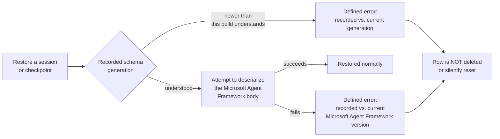

AgentPrism is a pre-1.0 package family. Treat version selection as part of your
application architecture, not as a restore detail.

AgentPrism ships 20 NuGet packages and one npm package (`@agentprism/client`), all
cut from the same `v*` tag and sharing one version line: there is no split between
a stable subset and a preview subset. The public surface carries no compatibility
promise for as long as that line stays pre-1.0 - a narrowing or a reshaped type is
not treated as a breaking change until the family reaches `1.0.0`.

## Release notes

Every published version has a dated entry on the [Release
notes](/reference/changelog/) page, grouped as Added, Changed, Deprecated,
Removed, Fixed, and Security. Each package's `PackageReleaseNotes` metadata
links to the entry for the exact version you installed.

## Package identity

For packages produced by the official release process, a `<package id, version>`
pair names exactly one artifact. That guarantee comes from the pipeline, not from
NuGet: a locally packed or otherwise unofficial build can reuse a version string
that already named different content, and NuGet's cache will not notice — see
[the caching caution](/guides/write-your-own-store/) if you pack previews
yourself. For official artifacts the release process enforces this before a
package is ever produced:

- **Every packed artifact traces back to a commit.** The build refuses to
  produce a package from an uncommitted working tree — there is no version
  that can mean "whatever the source happened to be at the time." Each
  package's `.nuspec` carries the exact commit it was built from.
- **A version is never silently replaced with different content.** If a
  release run would produce a `<package id, version>` pair that already
  exists with different bytes, the run stops and the existing, previously
  published artifact is left untouched — it is never overwritten in place.

This is independent of NuGet's own package integrity check: every `.nupkg`
carries a content hash (`<id>.<version>.nupkg.sha512` next to it in your local
package cache — find the cache path with `dotnet nuget locals global-packages
--list`), and nuget.org publishes the same hash for the version it lists. If
those two ever disagree, something between the registry and your machine
changed the bytes — that check exists independently of anything AgentPrism
does, and applies to any NuGet package, not only this family.

## Which version do these docs describe?

This site is built from the repository's `main` branch. The .NET reference is generated
from the assemblies built from that same source, and the HTTP reference is generated from
the OpenAPI snapshot in that source tree.

That makes the site the best description of the next build. It can also document a public
API that is newer than the preview package you installed. When exact reproducibility
matters, pin every AgentPrism package and check the [Release
notes](/reference/changelog/) entry for the version you installed before you rely on
anything this site describes.

:::caution[Preview contract]
AgentPrism has not shipped `1.0`. Public APIs, migrations, configuration keys, and
provider behavior can change between previews. Review the [Release
notes](/reference/changelog/) and this site's compatibility matrices before each
upgrade.
:::

## Install the newest preview

Use NuGet's pre-release selection explicitly:

```bash
dotnet add package AgentPrism --prerelease
```

The project template resolves pre-release packages by default, but pinning it makes a
team build reproducible:

```bash
AGENTPRISM_VERSION=1.0.0-preview.N # replace N with the published preview
dotnet new install "AgentPrism.Templates@$AGENTPRISM_VERSION"
dotnet new agentprism-api --AgentPrismVersion "$AGENTPRISM_VERSION"
```

## Pin the whole package family

Do not mix AgentPrism preview versions. The packages share public contracts, DI
registrations, database migrations, and generated code. A mixed graph can restore but
fail during startup or at runtime.

With Central Package Management, keep the versions in one place:

```xml
<ItemGroup>
  <PackageVersion Include="AgentPrism" Version="1.0.0-preview.N" />
  <PackageVersion Include="AgentPrism.PostgreSql" Version="1.0.0-preview.N" />
  <PackageVersion Include="AgentPrism.OpenAI" Version="1.0.0-preview.N" />
  <PackageVersion Include="AgentPrism.UI" Version="1.0.0-preview.N" />
</ItemGroup>
```

If you reference individual packages directly, pin each one to the same version. Avoid
floating ranges in production.

### The typed client and the server it calls

`AgentPrism.Client` is generated from the exact same OpenAPI document the server
build carries — both come from the same repository build, so they cannot drift
apart at a given version the way a hand-written client could. A caller on a
newer preview than the server it targets sees only the operations the server
actually serves; calling one the server does not yet have returns a `404`.
`AgentPrism.Cli` follows the same version family, since it wraps `AgentPrism.Client`.

The npm package `@agentprism/client` is cut from the same `v*` git tag as every
NuGet package above — there is no separate npm version scheme. `@agentprism/client
1.0.0-preview.N` and `AgentPrism.Client 1.0.0-preview.N` always describe the
identical OpenAPI document.

## Persisted session and checkpoint state

An upgrade can leave sessions and workflow checkpoints in storage from before
the upgrade. This is the compatibility promise for that stored payload,
split by who owns each layer:

| Layer | Owner | Promise |
|---|---|---|
| Record envelope (id, tenant, timestamps, generation, schema version) | AgentPrism | A minor version only *adds* envelope fields; it never removes one. An envelope written by an older AgentPrism version is still readable |
| Session state body (`SessionRecord.State`) | Microsoft Agent Framework | **No promise.** A Microsoft Agent Framework minor version bump can make an older body unreadable |
| Checkpoint state body (`WorkflowCheckpointRecord.State`) | Microsoft Agent Framework | Same as the session body — no promise |

`SessionRecord.StateSchemaVersion` (always stamped, never `null`) and
`WorkflowCheckpointRecord.StateSchemaVersion` (`null` on a row written before
this field existed) record AgentPrism's own envelope generation.
`StateMafVersion` on both records (`null` on an older row) records the
Microsoft Agent Framework package version that wrote the body — this is what
lets a failure message name the exact recorded and running versions instead
of guessing.

**What happens when a body cannot be read:**



- The error names both compared facts: the recorded generation or Microsoft
  Agent Framework version, and the one this build runs. It never says a row
  "may have become unreadable" without saying why.
- The row is **never deleted or silently reset**. A silently reset session
  loses conversation history with nothing telling the caller it happened.
- You have two ways forward: open a new session or workflow run under a new
  identity, or clear old sessions and checkpoints before the upgrade if you
  do not need them to survive it.

## Upgrade safely

1. Create a branch and update all AgentPrism packages together.
2. Read the [Release notes](/reference/changelog/) for public API,
   configuration, and migration changes — and whether the Microsoft Agent
   Framework version moved, which affects persisted session and checkpoint
   bodies (above).
3. Build with warnings as errors and run the full test suite.
4. Start a disposable environment against a copy of production-shaped data.
5. Inspect `/api/meta`, health checks, provider health, and migration diagnostics.
6. Exercise one synchronous run, one streamed run, every enabled background service, and
   your approval and guard paths.
7. Back up the database before the production migration. Deploy API and worker processes
   from the same artifact.
8. Watch run failures, provider latency, queue depth, webhook delivery, and cost after the
   rollout.

Database migrations are forward-only. Do not assume that rolling back the application
also rolls back the schema. See [Production deployment](/guides/production/)
for the migration and backup contract.

## Record the version in incident reports

Include these facts when you report a defect:

- the exact AgentPrism package versions from `dotnet list package`;
- the .NET target framework and deployment runtime;
- the model provider, model or Azure deployment name, and provider SDK version;
- the storage engine and migration state;
- the failing endpoint or .NET API and a minimal reproduction;
- redacted diagnostics, logs, trace ids, and run ids.

Never attach credentials, connection strings, raw API keys, or unreviewed prompt and tool
content.

## Read next

- [Compatibility matrices](/reference/compatibility/) — the framework, runtime, and protocol versions each release supports
- [Choosing packages](/packages/) — which packages you actually take a version of
- [Configuration](/reference/configuration/) — the options an upgrade can move
