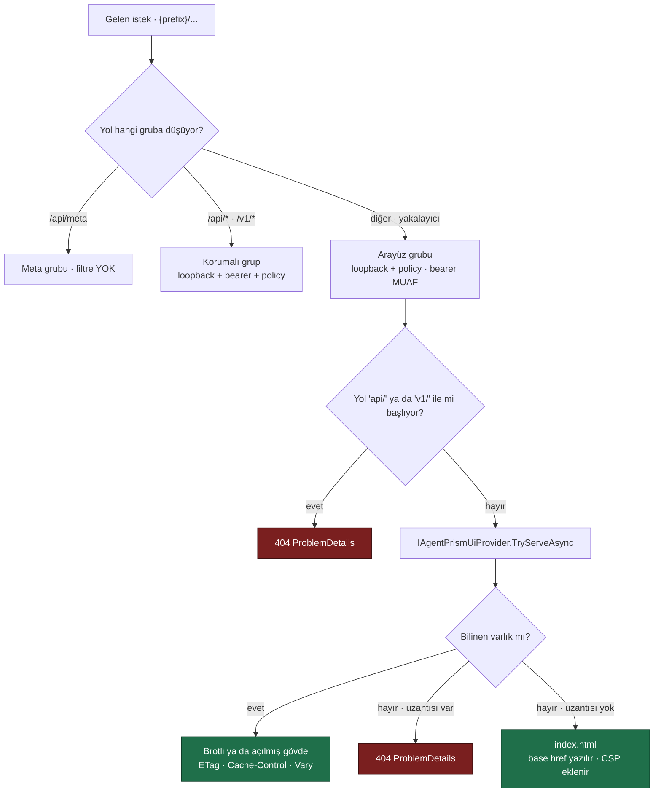
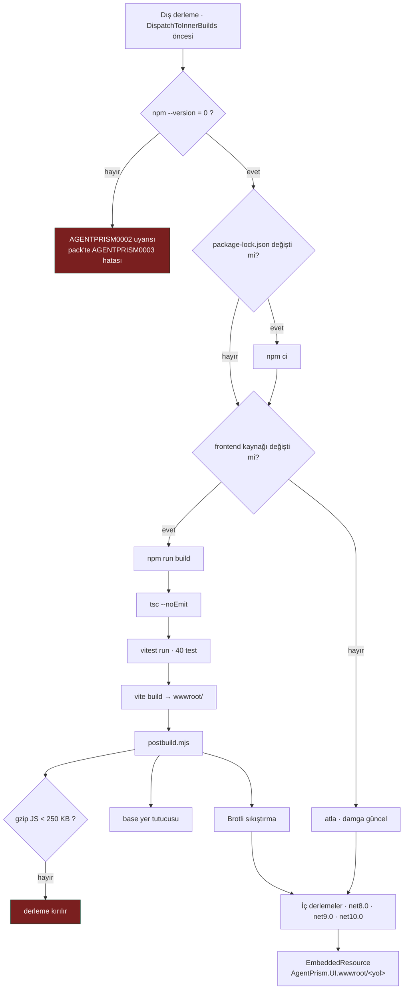

# Faz 5 — AgentPrism.UI

> **Durum:** ✅ Tamamlandı (2026-08-02)
> **Önkoşul:** [04-HTTP-API.md](04-HTTP-API.md) — tamamlandı
> **Sonraki:** [06-GOZLEMLENEBILIRLIK.md](06-GOZLEMLENEBILIRLIK.md)
> **Paket:** `AgentPrism.UI`

---

## Bu Faza Başlarken

Önce şunları bu sırayla okuyun:

1. [`MIMARI.md`](MIMARI.md) — bölüm 3 (dört değişmez kural), bölüm 6 (çalıştırma yolu), bölüm 7 (güvenlik)
2. [`KARARLAR.md`](KARARLAR.md) — kapatılmış tartışmaları yeniden açmayın
3. [`04-HTTP-API.md`](04-HTTP-API.md) — "Gerçekleşen Public API", "Plandan Sapmalar" ve "Faz 5'e Devreden Notlar"
4. [`../MEMORY.md`](../MEMORY.md) — önceki oturumların keşfettiği tuzaklar
5. Bu doküman

Arayüzü geliştirirken **çalışan bir arka uç** gerekir:

```bash
cd samples/AgentPrism.Api && dotnet run
# http://localhost:5080/agentprism
```

Örnek uygulama API anahtarı olmadan da çalışır (ağ çağrısı yapmayan `EchoModelProvider`).

Frontend üzerinde çalışıyorsanız Vite geliştirme sunucusu daha hızlıdır:

```bash
cd src/AgentPrism.UI/frontend && npm run dev
# http://localhost:5173  —  /agentprism/* istekleri 5080'e vekillenir
```

---

## Devraldığınız HTTP Sözleşmesi

Bu uçlar **tamamlandı ve testlidir**. Faz 5 bunları değiştirmedi, tüketti; tek ekleme
`/api/agents/{name}/run` akışına konan `run` çerçevesidir (sapma S1).

```
GET    {prefix}/api/meta                       [kimlik dogrulamasi YOK]
GET    {prefix}/api/agents · /{name} · POST · PUT · DELETE · /versions · /rollback
POST   {prefix}/api/agents/{name}/run          -> SSE
GET    {prefix}/api/sessions[?agentName=&skip=&take=] · /{id} · DELETE
GET    {prefix}/api/runs[?agentName=&status=&sessionId=&startedAfter=&skip=&take=] · /{id}
GET    {prefix}/api/runs/{id}/events           -> SSE  (canli veya replay)
GET    {prefix}/api/tools · /api/models · /api/stats
POST   {prefix}/v1/responses · /v1/chat/completions · /v1/conversations · GET · DELETE · /items
```

### SSE olay adları — **kararlı sözleşme**

`{prefix}/api/runs/{id}/events`:

```
run.started · message.delta · message.completed
tool.invoking · tool.invoked · tool.failed
run.completed · run.failed
```

`{prefix}/api/agents/{name}/run`:

```
run     -> { runId, sessionId }        ← Faz 5'te eklendi, ilk cerceve
update  -> AgentResponseUpdate  (Microsoft.Extensions.AI serilestirmesi)
done    -> { sessionId }
error   -> { type, message }
```

> Bu uçta `Last-Event-ID` ile devam **desteklenmez**: canlı bir model çağrısı
> yeniden oynatılamaz. Devam yalnızca `/api/runs/{id}/events` üzerindedir.

---

## Amaç

Hafif ama eksiksiz bir yönetim arayüzü. Gömülü, sıfır kurulum. Tüketici projede hiçbir JavaScript bağımlılığı oluşmaz.

Bu faz sonunda kabul senaryosu tamamlandı: paket kurulur, iki satır kod yazılır, tarayıcıda çalışan bir kontrol düzlemi açılır.

```csharp
builder.AddAgentPrism()
       .UseOpenAI(apiKey)
       .UseUI();            // ← arayuz varliklarini kaydeder

app.MapAgentPrism("/agentprism");   // api + v1 + arayuz, tek onek
```

---

## Teknoloji Seçimi

| Katman | Seçim | Gerekçe |
|--------|-------|---------|
| Çatı | React 19.2 + TypeScript 5.9 | Streaming, SSE ve karmaşık durum yönetiminde olgun ekosistem |
| Build | Vite 7.3 | Hızlı, çıktı küçük, statik varlık üretimi basit |
| Veri | TanStack Query 5 | Sunucu durumu, önbellek, yeniden deneme |
| Yönlendirme | **Elle yazılmış (~110 satır)** | Sapma S2 — TanStack Router yerine |
| Stil | Tailwind CSS 4 | Küçük çıktı, tema değişkenleri kolay |
| Bileşen | Elle yazılır | Ağır UI kütüphanesi çıktıyı şişirir |
| Test | Vitest 3 (saf mantık) + Playwright (E2E) | |

**Bütçe:** gzip sonrası **250 KB altı** JavaScript. Ölçülen: **88,1 KB**.
Kapı `npm run build` içindedir, dolayısıyla `dotnet build` de kırılır.

Blazor WebAssembly değerlendirildi ve elendi (bkz. KARARLAR.md).

---

## Ekranlar

| Ekran | İşlev | Durum |
|-------|-------|-------|
| **Dashboard** | **Giriş ekranı (Faz 20).** Bugün/dün karşılaştırması, çalıştırma+hata zaman serisi, model/agent kırılımı, uyarılar (fiyatsız model, sağlıksız sağlayıcı, bekleyen onay) | ✅ |
| **Agents** | Katalog listesi (kod/DB rozeti), tanım editörü, versiyon geçmişi, geri alma | ✅ |
| **Playground** | Akışlı sohbet; tool çağrıları, argümanlar, sonuçlar ve reasoning adımları açılır kartlar hâlinde | ✅ |
| **Sessions** | Oturum listesi, mesaj geçmişi, silme, ham JSON görünümü | ✅ |
| **Runs** | Çalıştırma listesi + özet kutuları; olay akışı adım adım zaman çizelgesi | ✅ |
| **Tools** | Kayıtlı tool'lar, JSON şemaları, hangi agent'ların kullandığı | ✅ (istatistik Faz 6 — sapma S5) |
| **Models** | Sağlayıcılar, modeller, yetenek bayrakları | ✅ (sağlık kontrolü Faz 6 — sapma S5) |
| **Settings** | Sürüm, prefix, kimlik yöntemi, aktif depolar, tema, etkinlik özeti | ✅ |

### Agent editörü

Tool seçimi **çoktan seçmeli listedir**, serbest metin değildir. Liste `{prefix}/api/tools`
uçundan gelir. Arayüzden tool kodu yazılamaz — tasarım kuralı K2.

Sağ panelde gönderilecek gövdenin **salt okunur JSON önizlemesi** canlı görünür.
Kullanıcı ne kaydedeceğini görür ama geçersiz JSON yazamaz; doğrulama tek yerde kalır.

`isEditable=false` olan (kodda tanımlı) agent'larda düzenleme ve silme düğmeleri
hiç çizilmez ve ekranda gerekçesi yazılıdır.

### Playground

Akış `{prefix}/api/agents/{name}/run` uçundan SSE ile gelir:

```
run              → calistirma kimligi; "Runs ekraninda ac" baglantisi hemen kurulur
update           → metin akisi + tool kartlari (FunctionCall/FunctionResultContent)
done             → tur tamamlandi
error            → hata detayi
```

Oturum kimliği `POST /v1/conversations` ile **sunucudan** rezerve edilir (K-043);
arayüz kendi kimlik biçimini uydurmaz.

---

## Paketleme

```
src/AgentPrism.UI/
├── frontend/                          (Vite kaynagi, git'te tutulur)
│   ├── src/
│   │   ├── lib/        api · sse · router · transcript · format · theme · auth · base · i18n · shortcuts · palette
│   │   ├── locales/    en.ts (anahtar kümesinin kaynağı) · tr.ts (`Messages` tipini karşılar)
│   │   ├── components/ ui · layout · icons · transcript · access-gate
│   │   ├── screens/    agents · agent-detail · agent-editor · playground
│   │   │               sessions · session-detail · runs · run-detail
│   │   │               tools · models · settings
│   │   ├── app.tsx · main.tsx · styles.css
│   ├── scripts/postbuild.mjs          base yer tutucusu + Brotli + butce kapisi
│   ├── index.html · package.json · package-lock.json
│   ├── tsconfig.json · vite.config.ts · vitest.config.ts
├── wwwroot/                           (Vite ciktisi, .gitignore'da)
├── AgentPrism.UI.Frontend.targets     npm zinciri + EmbeddedResource toplama
├── AgentPrismUiBuilderExtensions.cs   UseUI()
├── Internal/EmbeddedUiProvider.cs     IAgentPrismUiProvider uygulamasi
├── Internal/EmbeddedUiAssetCatalog.cs gomulu kaynak dizini
├── Internal/UiAsset.cs
└── AgentPrism.UI.csproj
```

### Build zinciri

`AgentPrism.UI.Frontend.targets`:

1. `npm --version` → Node var mı
2. `npm ci` — yalnız `package-lock.json` değiştiğinde (damga dosyası)
3. `npm run build` — yalnız frontend kaynağı değiştiğinde (damga dosyası)
   → `tsc --noEmit` + `vitest run` + `vite build` + `postbuild.mjs`
4. Çıktı `EmbeddedResource` olarak `AgentPrism.UI.wwwroot/<yol>` mantıksal adıyla gömülür

Damgalar `BaseIntermediateOutputPath` altındadır — orası hedef çerçeveden bağımsızdır.

🚨 **Zincir dış (outer) derlemede çalışır.** Üç hedef çerçeve paralel derlenir ve
üçü de aynı `wwwroot/` dizinine yazmaya kalkarsa birbirinin dosyasını siler.
Ölçüldü: `ENOENT: no such file or directory, unlink .../index-*.js`. Bkz. sapma S3.

**Node.js bulunmazsa:** önceden derlenmiş `wwwroot/` varsa build devam eder.
Varlık yoksa `AGENTPRISM0002` uyarısı verilir; `dotnet pack` sırasında aynı durum
`AGENTPRISM0003` **hatasıdır** — içi boş bir arayüz paketi yayınlanamaz.

### Base path

`MapAgentPrism` herhangi bir prefix'e bağlanabilir. Vite `base: './'` ile derlenir;
`postbuild.mjs` `<head>` içine `<base href="__AGENTPRISM_BASE__">` yazar ve
`EmbeddedUiProvider` bunu çalışma anında gerçek prefix ile değiştirir. Mutlak varlık
yolu kullanılmaz.

### Sunum

`EmbeddedUiProvider` (`IAgentPrismUiProvider` uygulaması):

- Metin varlıklar **Brotli sıkıştırılmış** gömülür; istemci `br` kabul ediyorsa
  olduğu gibi sunulur (çalışma anı maliyeti sıfır), etmiyorsa bir kez açılıp
  bellekte tutulur
- Hash'li dosyalar `Cache-Control: public,max-age=31536000,immutable`; `index.html` `no-cache`
- `ETag` + `If-None-Match` → `304`
- Sıkıştırılmış ve açılmış temsiller **farklı ETag** taşır (`"…-br"`)
- Bilinmeyen yollarda SPA geri dönüşü → `index.html`; **uzantısı olan** yol `404` verir
- `{prefix}/api/*` ve `{prefix}/v1/*` yakalayıcı rotada açıkça reddedilir
- `GET` ve `HEAD` desteklenir
- Kabuk `Content-Security-Policy`, `X-Content-Type-Options`, `Referrer-Policy` taşır

---

## İstek Yolu



Yakalayıcı rota en düşük önceliğe sahiptir; harfi harfine segmentler her zaman
kazanır. Buna rağmen `api/` ve `v1/` açıkça reddedilir: yanlış yazılmış bir API
yolu (`/api/agentz`) aksi hâlde `index.html` alır ve bir API istemcisi için bu,
hata ayıklanması zor bir sessiz başarısızlıktır.

---

## Derleme Zinciri



Zincirin dış derlemede olması zorunludur: iç derlemeler paralel koşar ve üçü de
aynı `wwwroot/` dizinine yazar (sapma S3).

---

## Güvenlik

Arayüz **üçüncü bir uç grubuna** bağlanır. Güvenlik katmanları API'den farklıdır:

| Katman | API uçları | Arayüz kabuğu |
|--------|-----------|---------------|
| Loopback kısıtı | ✅ | ✅ |
| Authorization policy | ✅ | ✅ |
| Bearer token | ✅ | ❌ **muaf** |

**Gerekçe:** tarayıcı bir `<script src>` isteğine `Authorization` başlığı ekleyemez.
Kabuk token katmanıyla kilitlenseydi kullanıcı token'ı girebileceği ekranı hiçbir
zaman göremezdi. Kabuk veri taşımaz; her veri ucu tam korumada kalır. Karar K-046.

Token arayüzde `sessionStorage`'da tutulur — sekme kapanınca silinir. `localStorage`
bilinçli olarak seçilmedi: token bir sırdır ve diskte kalma süresi en kısa olmalıdır
(K-047).

---

## Test Stratejisi

`tests/AgentPrism.Ui.E2ETests` — **8 test**, Playwright + gerçek Kestrel.

| Test | Neyi doğrular |
|------|---------------|
| `Arayuz_acilir_ve_ana_ekran_cizilir` | `/agentprism` açılır, başlık ve yedi gezinme bağlantısı çizilir |
| `Kod_agenti_listede_gorunur_ve_duzenlenemez` | Kod agent'ı listede; düzenleme düğmesi **yok**, gerekçe yazılı |
| `Playground_akisi_gelir_ve_tool_karti_dolar` | Gerçek tool döngüsü: kart açılır, argüman ve sonuç dolar, metin akar, `run` bağlantısı kurulur |
| `Arayuzden_agent_olusturulur_ve_hemen_calistirilir` | Editörden tanım kaydedilir, detay ekranı açılır, agent hemen çalıştırılır |
| `Farkli_onek_altinda_varliklar_yuklenir` | `/panel` prefix'i: hiçbir istek `>=400` dönmez, derin rota kabuğu alır |
| `Koyu_tema_gecisi_calisir_ve_kalici_olur` | `data-theme` değişir ve yeniden yüklemede korunur |
| `Token_gerektiginde_kabuk_acilir_ve_token_sorulur` | Kabuk token muafiyeti; token girilince ekran açılır |
| `Calistirma_olaylari_ekranda_adim_adim_gorunur` | Playground → Runs köprüsü; `run.started · tool.invoking · tool.invoked · run.completed` |

Tarayıcı ikilisi eksikse fixture onu kendisi indirir; `dotnet test` ek kurulum
istemez. Süre: **5,6 sn** (ikili indirilmiş durumdayken).

Frontend birim testleri: **Vitest, 40 test**, yalnız saf mantık.

| Dosya | Adet | Kapsam |
|-------|------|--------|
| `sse.test.ts` | 9 | Çerçeveleme, parçalı gövde, CRLF, yorum satırı, çok satırlı `data` |
| `transcript.test.ts` | 12 | Delta birleştirme, tool kartı eşleme, `$type` bilinmezken şekle göre sınıflama, kullanım |
| `format.test.ts` | 19 | Zaman/süre/sayı biçimleme, rota eşleme, taban yol çözümleme |

Bu testler `npm run build` içinde koşar, dolayısıyla **`dotnet build` de onları koşar**.

### Bundle boyutu kapısı

`postbuild.mjs` gzip boyutunu ölçer ve 250 KB aşılırsa hata verir. Yerelde ve CI'da
aynı kapıdır.

---

## Gerçekleşen Public API

```csharp
// AgentPrism.UI
public static class AgentPrismUiBuilderExtensions
{
    // Ayri bir esleme cagrisi YOKTUR. MapAgentPrism kaydi DI'dan cozer.
    public static IAgentPrismBuilder UseUI(this IAgentPrismBuilder builder);
}

// AgentPrism.AspNetCore — arayuz paketinin uyguladigi sozlesme
public interface IAgentPrismUiProvider
{
    bool HasAssets { get; }
    ValueTask<bool> TryServeAsync(HttpContext context, string basePath, string relativePath);
}

// AgentPrism.Abstractions — calistirma kimligini cagiran uretir
public sealed class AgentPrismRunOptions : Microsoft.Agents.AI.AgentRunOptions
{
    public AgentPrismRunOptions();
    public Guid? RunId { get; init; }
    public override AgentRunOptions Clone();   // RunId'yi korur
}
```

`IAgentPrismUiProvider` bilerek **tek metotludur**: varlık listesi, içerik tipi,
`ETag`, önbellek başlıkları, sıkıştırma biçimi ve SPA geri dönüşü tamamen uygulamaya
aittir. Arayüz paketi paketleme biçimini değiştirdiğinde HTTP katmanının public
API'si değişmez.

---

## Plandan Sapmalar

### S1 — `/api/agents/{name}/run` akışına `run` çerçevesi eklendi *(kullanıcı kararı)*

Faz 5 planı kendi kendisiyle çelişiyordu: "Playground `/api/agents/{name}/run`
kullanır" diyor, ama olay adlarını `/api/runs/{id}/events` sözleşmesinden
(`run.started`, `tool.invoking`, …) listeliyordu. Gerçek uç `update`/`done`/`error`
gönderir.

Ayrıca akış başladığında çalıştırma kimliği **bilinmiyordu**; Playground ile Runs
ekranı arasında köprü kurulamıyordu. `RunRecordingAgent` kimliği kendi içinde
üretiyor ve dışarı bildirmiyordu.

**Çözüm:** `AgentPrismRunOptions.RunId` eklendi (K-044). Uç kimliği kendisi üretir,
ilk SSE çerçevesinde bildirir ve sarmalayıcıya geçer. Kırıcı olmayan bir eklemedir:
mevcut `StreamingTests` değişmeden geçti.

Değerlendirilen alternatifler: `OnRunStarted` geri çağrımı (kimlik ancak ilk
olaydan sonra bilinir), `AsyncLocal` ortam bağlamı (gizli durum, akışlı
numaralandırıcılarda hata ayıklaması zor).

### S2 — TanStack Router yerine elle yazılmış router *(kullanıcı kararı)*

Uygulamada yedi ekran ve iki dinamik parametre var. `History` API üzerine ~110
satır yeterli oldu; base path çalışma anından doğal olarak geliyor (kütüphanelerin
her birine ayrıca bildirilmesi gerekir). Bundle ~32 KB gzip küçüldü.

Maliyet: rota tipleri elle tanımlanır. Karar K-045.

### 🚨 S3 — Frontend derlemesi dış (outer) derlemeye taşındı

İlk uygulamada zincir her hedef çerçevede çalışıyordu. Üç iç derleme **paralel**
koşar ve Vite `emptyOutDir` ile aynı dizini boşaltır. Ölçülen hata:

```
EXEC : error : ENOENT: no such file or directory, unlink
       .../src/AgentPrism.UI/wwwroot/assets/index-B9ruDlq1.js
```

Zincir `BeforeTargets="DispatchToInnerBuilds"` ile dış derlemeye alındı. İç
derlemeler damgayı güncel bulup adımı atlar. Tek hedefle derlerken (`-f net10.0`)
dış derleme yoktur; o durumda toplama hedefi zinciri kendisi çalıştırır.

### 🚨 S4 — `AgentPrism.UI.csproj` açık `Import` biçimine geçti

`Sdk="Microsoft.NET.Sdk"` niteliği kullanıldığında SDK hedefleri projenin **en
sonuna** yerleştirilir. `AgentPrism.UI.Frontend.targets` ondan önce yüklenir ve
içindeki `BeforeTargets="AssignTargetPaths"` hedefi şu mesajla **sessizce** atılır:

```
The target "AssignTargetPaths" listed in a BeforeTargets attribute
does not exist in the project, and will be ignored.
```

Sonuç: arayüz varlıkları hiç gömülmüyor ve paket sessizce arayüzsüz üretiliyordu.
Açık `<Import Project="Sdk.targets" Sdk="Microsoft.NET.Sdk" />` biçiminde frontend
hedefleri SDK hedeflerinden sonra yüklenir.

### S5 — Tool istatistikleri ve model sağlık kontrolü Faz 6'ya bırakıldı *(kullanıcı kararı)*

Plan Tools ekranı için "kullanım istatistikleri", Models ekranı için "bağlantı
sağlık kontrolü" diyordu. İkisi de **veri kaynağı olmadan** yazılamaz:

- `tool_invocations` tablosu Faz 2'de kuruldu ama boş; yazan yok (KARARLAR, bölüm 1)
- `/api/models` yapılandırmadan gelen listeyi döndürür ve sağlayıcıya hiç gitmez (K-032)

Ekranlar bu bilgileri göstermek yerine Faz 6'ya işaret eden bir not taşıyor.
Alternatifler değerlendirildi: çalıştırma olaylarından saymak yalnız sayfalanmış
bir alt kümeyi kapsardı (K-041'de bilerek reddedilen hata), sağlık kontrolü ucu ise
her denetimde ücretli bir model çağrısı harcardı.

### S6 — Vitest `npm run build` içine alındı

Frontend birim testleri yalnız CI adımı olsaydı `dotnet test` onları koşmazdı ve
bir geliştirici onları sessizce kırabilirdi. Ölçüldü: 40 test **0,3 saniyede**
koşuyor — her derlemeye eklemenin maliyeti yok denecek kadar az.

### S7 — Middleware yerine endpoint

Plan `AgentPrismUiMiddleware` diyordu. Bunun yerine üçüncü bir `MapGroup` ve
yakalayıcı (`{**path}`) rota kullanıldı. Sebep: middleware sırası tüketicinin
`app.Use...` çağrılarına duyarlıdır ve `MapAgentPrism` tek giriş noktası olma
vaadini bozardı. Endpoint yönlendirmesinde harfi harfine segmentler yakalayıcıdan
önce gelir, dolayısıyla `/api/*` ve `/v1/*` her zaman kazanır.

---

## Bitiş Ölçütleri (DoD)

| Ölçüt | Durum | Kanıt |
|-------|-------|-------|
| `dotnet run` → `http://localhost:5080/agentprism` açılır | ✅ | Aşağıda gerçek çıktı |
| Yedi ekranın hepsi çalışır | ✅ | `Arayuz_acilir_ve_ana_ekran_cizilir` + elle doğrulama |
| Playground akışı token token gelir | ✅ | `Playground_akisi_gelir_ve_tool_karti_dolar` |
| Tool çağrısı kartı argüman ve sonuç gösterir | ✅ | Aynı test; ekran görüntüsünde `orderId: "ORD-7"` → `ORD-7 siparisi kargoya verildi.` |
| Arayüzden agent oluşturulur, kaydedilir, çalıştırılır | ✅ | `Arayuzden_agent_olusturulur_ve_hemen_calistirilir` |
| Uygulama yeniden başlatılır, her şey yerinde durur | ✅ | Gerçek PostgreSQL ile doğrulandı, aşağıda |
| Farklı prefix ile çalışır | ✅ | `Farkli_onek_altinda_varliklar_yuklenir` (`/panel`) |
| gzip JS < 250 KB | ✅ | **88,1 KB** — `postbuild.mjs` çıktısı |
| Playwright testleri geçer | ✅ | 8/8, 5,6 sn |
| Dört doğrulama kapısı temiz | ✅ | build / test / pack / format → 0 uyarı, 0 hata |
| Sır taraması temiz | ✅ | Çıktı boş |

### Gerçek çıktı — kabuk

```bash
$ curl -si localhost:5080/agentprism | head -11
HTTP/1.1 200 OK
Content-Length: 844
Content-Type: text/html; charset=utf-8
Cache-Control: no-cache
ETag: "5GEJhVqfXvyEXhrb"
Content-Security-Policy: default-src 'none'; script-src 'self'; style-src 'self' 'unsafe-inline';
                         img-src 'self' data: blob:; media-src 'self' blob:; font-src 'self';
                         connect-src 'self'; base-uri 'self'; form-action 'none'; frame-ancestors 'none'
X-Content-Type-Options: nosniff
Referrer-Policy: same-origin

<!doctype html>
<html lang="en">
  <head>
    <base href="/agentprism/" />
```

### Gerçek çıktı — varlık sunumu

```bash
$ curl -sI -H 'Accept-Encoding: br' .../assets/index-B9ruDlq1.js
Content-Length: 78295          # gomulu hali; calisma aninda sikistirma YOK
Content-Encoding: br
Cache-Control: public,max-age=31536000,immutable
ETag: "KkqbyJDrS4D23N7P-br"
Vary: Accept-Encoding

$ curl -sI -H 'Accept-Encoding: identity' .../assets/index-B9ruDlq1.js
Content-Length: 302133         # bir kez acilir ve onbelleklenir
ETag: "f_SKsY4C1cggxDM8"       # farkli temsil, farkli etiket

$ curl -H "If-None-Match: <etag>" .../agentprism        -> 304 Not Modified
$ curl .../agentprism/runs/abc123                        -> 200 text/html  (SPA geri donusu)
$ curl .../agentprism/assets/missing.js                  -> 404
$ curl .../agentprism/api/agentz                         -> 404 application/problem+json
```

### Gerçek çıktı — `run` çerçevesi

```bash
$ curl -sN -X POST .../api/agents/faz5-agent/run -d '{"message":"merhaba faz5","sessionId":"conv_…"}'
id: 0
event: run
data: {"runId":"019fc0ce-d8c2-7b3b-b061-0206dc301743","sessionId":"conv_019fc0ced85d7a65880977a2f4476c04"}

id: 1
event: update
data: { "authorName": "faz5-agent", "role": "assistant", … }
```

### Gerçek çıktı — kalıcılık ve yeniden başlatma

PostgreSQL 18 (Docker), örnek uygulama, iki tur, sonra süreç öldürülüp yeniden başlatıldı:

```
$ curl .../api/meta
"storage":{"persistent":true,"agentDefinitionStore":"PostgresAgentDefinitionStore",
           "runStore":"PostgresRunStore","sessionStore":"PostgresSessionStore"}

=== YENIDEN BASLATMA SONRASI ===
--- agent tanimi ---
  arastirmaci    origin=Code      v1
  faz5-agent     origin=Database  v1      ← arayuzden olusturulan tanim yerinde
  support        origin=Code      v1
--- oturum gecmisi ---
  user       ['birinci']
  assistant  ['Echo: birinci ']
  user       ['ikinci']
  assistant  ['Echo: ikinci ']            ← gecmis turlar arasi birikiyor
--- calistirmalar ---
  019fc0ce-d961-7633 faz5-agent   Completed  events=5
  019fc0ce-d8c2-7b3b faz5-agent   Canceled   events=4   ← istemci akisi kesti
--- OpenAI SDK uyumu ---
  /v1/conversations/{id}/items -> 4 oge   ← konusma ile oturum ayni kimlik uzayi
--- sema yalitimi ---
  public sema tablo sayisi: 0
  agentprism sema tablo sayisi: 14
```

> Kesilen akışın `Canceled` olması doğru davranıştır: oturum ancak akış tamamlandığında
> kaydedilir, dolayısıyla yarım kalan turun geçmişi yazılmaz.

### Ölçülen boyutlar

```
javascript : 88.1 KB gzipped (butce 250 KB)
gomulu     : 80.9 KB brotli, 315.1 KB ham
AgentPrism.UI.nupkg : 288 KB (uc hedef cerceve x gomulu varliklar)
nuspec dogrudan bagimlilik : 1  (AgentPrism.AspNetCore)
```

---

## Riskler — kapanış durumu

| Risk | Sonuç |
|------|-------|
| CI'da Node.js gerekliliği build zincirini karmaşıklaştırır | **Kapandı.** Node adımı Faz 0'da eklenmişti; zincir artımsal, `pack` varlık yoksa `AGENTPRISM0003` ile anlaşılır hata veriyor |
| Gömülü varlıklar assembly boyutunu büyütür | **Kapandı.** Brotli gömme ile 315 KB → 81 KB; nupkg 288 KB |
| Ters vekil arkasında SSE arabelleği | **Kapandı** (Faz 4). `X-Accel-Buffering: no` |
| `npm ci` ağ hatası build'i kırar | **Açık.** `package-lock.json` sabit; CI'da npm önbelleği var. Ağsız bir ortamda ilk derleme başarısız olur |
| Üç hedef çerçeve tek çıktı dizinine yazar | **Kapandı.** Sapma S3 |

---

## Faz 6'ya Devreden Notlar

**1. `AgentPrismRunOptions` genişletilebilir.** Faz 6 örnekleme (sampling) oranı veya
kiracı geçersiz kılma gibi çalıştırma başına ayarlar eklerse yeri burasıdır.
`Clone()` her yeni alan için güncellenmelidir — aksi halde ayarları kopyalayan bir
ara katman değeri sessizce düşürür.

**2. Tools ve Models ekranlarında Faz 6 için yer hazır.** İkisi de altta "gözlemlenebilirlik
fazında gelir" notu taşıyor (sapma S5). `tool_invocations` doldurulduğunda ve
`runs.model` sütunu eklendiğinde bu notlar gerçek verilerle değiştirilir.

**3. Runs ekranı trace görüntüleyiciye hazır.** `run-detail.tsx` iki panelli
(transkript + olay zaman çizelgesi) düzendedir; waterfall üçüncü bir panel veya
zaman çizelgesinin yanına bir sütun olarak eklenebilir. Olay hue'ları
`EVENT_STYLE` sabitinde toplu.

**4. Maliyet sütunu Faz 20'de eklendi.** `/api/stats` artık `totalCost`/`currency`/
`runsWithUnknownPricing` döndürür; Dashboard'un model kırılımı grafiği fiyat
yapılandırıldığında maliyeti gösterir. Settings ekranındaki "Token use by model"
paneli artık yalnız hızlı bakış içindir ve Dashboard'a işaret eder.

**5. ~~Arayüz dili İngilizce, i18n altyapısı yoktur.~~ — geçersiz (Faz 30).**
Arayüz 2026-08-05'ten beri **iki dillidir**: her metin `locales/en.ts` ve
`locales/tr.ts` sözlüklerinden gelir, bileşenler `useT()` kullanır ve eksik bir
anahtar **derlemeyi kırar** (K-228). Ayrıntı: [`30-ARAYUZ-CILASI.md`](30-ARAYUZ-CILASI.md),
tuzaklar: [`hafiza/frontend.md`](hafiza/frontend.md).

**6. Frontend testleri `npm run build` içindedir.** Yeni bir saf mantık modülü
yazarken testini de yazın; `dotnet build` onu koşar ve kırılırsa .NET derlemesi de kırılır.

**7. Bundle bütçesinde ~99 KB boşluk var** (151,3 / 250 KB — Faz 30 ölçümü;
bu satır yazıldığında 88,1 KB idi). Kapı `postbuild.mjs` içindedir.

**8. `IAgentPrismUiProvider` tek metotlu kalmalıdır.** Arayüz paketi kendi paketleme
biçimini değiştirebilsin diye böyle tasarlandı; yeni metot eklemek bu esnekliği
harcar ve public API'de kırıcı olur.

**9. Çok kiracılılıkta arayüz henüz kiracı seçtirmiyor.** `/api/meta` kiracı bilgisi
döndürmez (bilerek — kimlik doğrulaması olmayan bir uçtur). Faz 6 kiracı yönetimi
getirdiğinde arayüze bir kiracı seçici ve korumalı bir kiracı listesi ucu gerekir.
