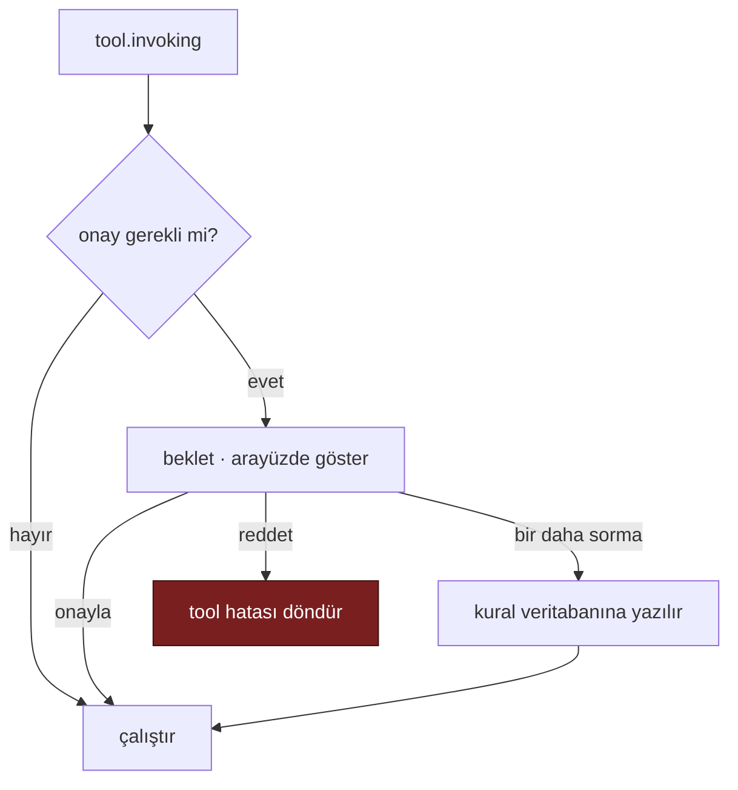

# Faz 6 — Gözlemlenebilirlik, Workflows ve Çok Kiracılılık

> **Durum:** Planlandı
> **Önkoşul:** [05-AGENTPRISM-UI.md](05-AGENTPRISM-UI.md)
> **Sonraki:** [07-SAGLAMLASTIRMA-VE-YAYIN.md](07-SAGLAMLASTIRMA-VE-YAYIN.md)
> **Paketler:** `AgentPrism.Core`, `AgentPrism.PostgreSql`, `AgentPrism.AspNetCore`, `AgentPrism.UI`

---

## Amaç

Üretim işletimi için gereken görünürlüğü ve ileri MAF yeteneklerini eklemek. Faz 5 sonunda AgentPrism çalışır; bu faz sonunda **işletilebilir** olur.

---

## 6.1 OpenTelemetry

### Toplama

MAF, `IChatClient` boru hattındaki `UseOpenTelemetry()` ile GenAI semantic convention span'leri üretir. Biz bu akışa **ek dinleyici** olarak takılırız.

**Akışı ele geçirmeyiz.** Tüketici kendi OTLP exporter'ını kullanmaya devam eder. AgentPrism yalnızca kendi `ActivitySource`'unu ekler ve ilgilendiği span'leri `agentprism.spans` tablosuna yazar.

```csharp
public static class AgentPrismDiagnostics
{
    public const string ActivitySourceName = "AgentPrism";
    public const string MeterName = "AgentPrism";
}
```

### Kalıcılık

`traces` ve `spans` tabloları Faz 2'de kuruldu (boş), bu fazda doldurulur. Aynı şey `tool_invocations` için de geçerlidir: şema hazır, yazan yok — `duration_ms` alanı `ToolInvoking`/`ToolInvoked` olay çiftinin korelasyonunu gerektirir.

Yazma yolu **örneklenir** (sampling). Varsayılan: hatalı çalıştırmaların %100'ü, başarılıların yapılandırılabilir bir oranı. Gerekçe: her span'i yazmak yüksek hacimde veritabanını darboğaza sokar.

### Metrikler

`Meter` üzerinden:

| Metrik | Tip | Etiketler |
|--------|-----|-----------|
| `agentprism.runs` | Counter | agent, status, tenant |
| `agentprism.run.duration` | Histogram | agent, status |
| `agentprism.tokens` | Counter | agent, model, direction |
| `agentprism.tool.invocations` | Counter | tool, status |
| `agentprism.tool.duration` | Histogram | tool |

### Arayüz

Runs ekranına trace görüntüleyici (waterfall) eklenir. Her span: ad, süre, öznitelikler, hata. Zaman çizelgesi çalıştırma olaylarıyla hizalanır.

---

## 6.2 Workflows

`Microsoft.Agents.AI.Workflows` (GA, 1.16.0) entegrasyonu.

| Bileşen | İş |
|---------|-----|
| `WorkflowCatalog` köprüsü | MAF'ın `WorkflowCatalog` yapısı `IAgentCatalog` yanında görünür |
| Checkpoint kalıcılığı | Workflow checkpoint'leri PostgreSQL'de; `previous_response_id` eşlemesi kiracı doğrulaması ile |
| Graf görselleştirme | Arayüzde düğüm/kenar diyagramı; çalışan düğüm vurgulanır |
| Human-in-the-loop | Bekleyen onay ekranı; onay/ret arayüzden |

**Önemli:** MAF dokümanı `previous_response_id` ve `conversation_id` için açık uyarı verir — checkpoint yüklemeden önce kiracı sahipliği doğrulanır.

---

## 6.3 MCP Tool Desteği

`Microsoft.Agents.AI.Mcp` ile uzak MCP sunucularının tool olarak bağlanması.

- Sunucu tanımları veritabanında (`mcp_servers` tablosu, bu fazda eklenir)
- Tool'lar bağlantı anında keşfedilir ve `IToolRegistry`'ye kayıtlı tool'ların yanında listelenir
- MCP tool'ları **ayrı bir rozet** ile gösterilir — kaynağı kod değil, uzak sunucudur

### Güvenlik sınırı

MCP sunucusu eklemek, dışarıdan gelen tool tanımlarını kabul etmek demektir. Bu, tasarım kuralı K2'nin ("tool'lar yalnız kodda") bilinçli bir istisnasıdır ve şu korumalarla gelir:

- MCP sunucusu ekleme yetkisi ayrı bir authorization policy gerektirir
- Her MCP tool çağrısı `tool_invocations` tablosuna kaynak sunucu bilgisiyle yazılır
- Varsayılan olarak MCP tool'ları **onay gerektirir** (auto-approval kapalı)

---

## 6.4 Çok Kiracılılık

MAF'ın hazır yapıları kullanılır:

```
SessionIsolationKeyProvider          → kiracı anahtarını üretir
IsolationKeyScopedAgentSessionStore  → oturum deposunu kiracıya kapar
```

Bunun üzerine:

- Her sorguya `tenant_id` filtresi
- `ITenantContext` — istek başına kiracıyı çözer (header, claim veya alt alan adı)
- Tek kiracılı kurulumda sabit varsayılan kiracı; hiçbir ek yapılandırma gerekmez

**Doğrulama:** `TenantIsolationTests` (Faz 2'de yazıldı) bu fazda genişletilir — her API ucu için kiracı sızıntısı testi.

---

## 6.5 Tool Onayı

`tool_invocations` tablosuna bekleyen onay durumu eklenir.

Akış:



"Bir daha sorma" kuralları kiracı + agent + tool üçlüsüne bağlıdır ve arayüzden geri alınabilir.

---

## 6.6 Harness İleri Yetenekleri

Faz 3'te kapalı bırakılan yetenekler burada değerlendirilir:

| Yetenek | Karar |
|---------|-------|
| Shell erişimi | Varsayılan **kapalı**. Açmak açık yapılandırma + ayrı policy gerektirir. Her komut `audit_log`'a yazılır. |
| Arka plan agent'ları | Varsayılan **kapalı**. Açıldığında çalıştırma kaydı ve kaynak sınırı zorunludur. |

Gerekçe: bu iki yetenek sunucuda kod çalıştırma yüzeyi açar. Varsayılan olarak açık olmaları kabul edilemez.

---

## Bitiş Ölçütleri (DoD)

- [ ] Runs ekranında trace waterfall görünür
- [ ] Metrikler `Meter` üzerinden yayılır; Prometheus formatı opsiyonel olarak sunulur
- [ ] Workflow tanımlanır, çalıştırılır, grafı arayüzde görünür
- [ ] Workflow checkpoint'i PostgreSQL'den geri yüklenir
- [ ] MCP sunucusu eklenir, tool'ları keşfedilir ve onayla çalıştırılır
- [ ] İki kiracılı senaryoda hiçbir uçta veri sızıntısı yok
- [ ] Tool onay akışı arayüzden uçtan uca çalışır
- [ ] Span yazma yolu örnekleme ile sınırlı; yük testinde darboğaz oluşturmuyor

---

## Riskler

| Risk | Önlem |
|------|-------|
| Span yazma yolu veritabanını darboğaza sokar | Örnekleme + toplu yazma + `run_events` partition'ı bu fazda açılır |
| MCP sunucuları güvenilmez tool tanımı gönderir | Ayrı policy, varsayılan onay zorunluluğu, denetim izi |
| Workflow checkpoint boyutu büyür | Boyut sınırı ve saklama süresi yapılandırılabilir |
| Çok kiracılılık her sorguya dokunur | Kiracı filtresi tek bir sorgu oluşturucudan geçer; unutulması derleme hatası verir |
