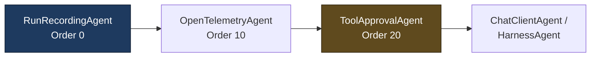
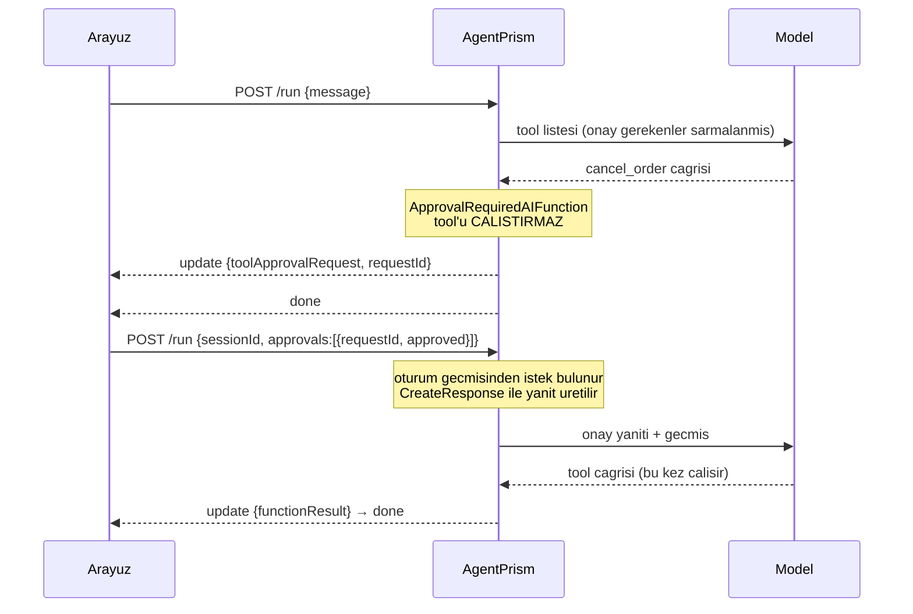

# Faz 6 — Gözlemlenebilirlik, Tool Onayı, MCP ve Çok Kiracılılık

> **Durum:** ✅ Tamamlandı (2026-08-02)
> **Önkoşul:** [05-AGENTPRISM-UI.md](05-AGENTPRISM-UI.md) — tamamlandı
> **Sonraki:** [07-SAGLAMLASTIRMA-VE-YAYIN.md](07-SAGLAMLASTIRMA-VE-YAYIN.md)
> **Paketler:** `AgentPrism.Abstractions`, `.Core`, `.PostgreSql`, `.AspNetCore`, `.UI`, **`.Mcp` (yeni)**

---

## Amaç

Üretim işletimi için gereken görünürlüğü ve denetimi eklemek. Faz 5 sonunda
AgentPrism **çalışıyordu**; bu faz sonunda **işletilebilir** hâle geldi:

- her çalıştırmanın span ağacı ve metriği var
- geri alınamaz tool'lar kullanıcı onayı bekliyor
- tool'lar uzak MCP sunucularından da gelebiliyor
- kiracı istekten çözülüyor ve hiçbir uçtan sızmıyor

---

## Plandan Sapmalar

Plan ile gerçekleşen arasındaki fark, sonraki oturumun en değerli bilgisidir.
Aşağıdakiler **gizlenmemiş sapmalardır**.

### S1 — Workflows (6.2) yapılmadı, ikinci faz planına ertelendi

**Kullanıcı kararı.** Faz 6 planı altı iş alanı içeriyordu; hepsini bir oturumda
yapmak her alanı yüzeysel bırakırdı. `Microsoft.Agents.AI.Workflows` ayrı bir
yürütme modeli getirir (graf, checkpoint, human-in-the-loop) ve API'si hiç
keşfedilmemişti; arayüzdeki graf görselleştirme ayrıca bundle bütçesini zorlardı.
Karar **K-054**; iş [Faz 15](15-WORKFLOWS-YURUTME.md) ve [Faz 16](16-WORKFLOWS-ARAYUZ.md) olarak planlandı (kalem F-27).

### S2 — 🚨 `Microsoft.Agents.AI.Mcp` diye bir paket **yok**

Plan bu paketi varsayıyordu. NuGet'te arandı ve doğrulandı: böyle bir paket
yayınlanmamış. Gerçek yol resmî C# SDK'sıdır — **`ModelContextProtocol.Core` 2.0.0**.
`McpClientTool` doğrudan `AIFunction` türetir, dolayısıyla MAF'a ek bir adaptör
olmadan takılır. Tam `ModelContextProtocol` paketi yerine `.Core` seçildi
(karar **K-057**): tam paket sunucu barındırma bağımlılıkları da çeker.

### S3 — 🚨 Harness'ta **shell erişimi diye bir şey yok**

Plan 6.6, shell erişimini "varsayılan kapalı" olarak listeliyordu. Reflection ile
ölçüldü: MAF 1.16.0'ın `HarnessAgentOptions` yüzeyinde shell üyesi **yoktur**.
Sunucuda yüzey açan gerçek üyeler `FileAccessStore` ve `BackgroundAgents`'tır;
ikisi de yalnızca değer atandığında etkinleşir ve derleyici o değerleri hiç
atamaz. Karar **K-062**.

### S4 — Onay akışı "beklet/devam et" değil, "tur tabanlı"

Plan, bekleyen bir çağrının beklemeye alınıp sonra devam ettirilmesini
öngörüyordu. MAF'ın gerçek modeli farklı: onay gereken çağrıda çalıştırma
**biter** ve yanıtta `ToolApprovalRequestContent` döner; karar bir **sonraki turun
girdisidir**. Bu daha basittir ve SSE akışını askıya almayı gerektirmez —
`AgentRunRequest.Approvals` alanı bu yüzden vardır.

### S5 — "Bir daha sorma" MAF'ın biçimiyle değil kendi depomuzda

MAF `CreateAlwaysApproveToolResponse` sunar ama kararı kalıcılaştıracak yer
sunmaz. Kural `IToolApprovalRuleStore` içine yazılır; kiracıya bağlıdır ve
arayüzden geri alınabilir. Karar **K-061**.

### S6 — `run_events` partition'ı açılmadı

Plan bunu bir risk önlemi olarak listeliyordu. Partition'a geçmek birincil
anahtarı değiştirmeyi ve tabloyu yeniden kurmayı gerektirir; **ölçüm olmadan**
yapılan böyle bir değişiklik çözdüğünden fazla risk taşır. Tetikleyici Faz 7'nin
yük testidir. Karar **K-063**.

### S7 — Trace/span sözleşmesi `traces` + `spans` şemasına uyduruldu

Şema 0001'de kurulmuştu ve `spans.parent_span_id` bir `uuid`. W3C span kimliği
ise 8 baytlık onaltılıktır. Çözüm: veritabanı kimliği W3C kimliklerinden
**türetiliyor** (`SHA-256(traceId + ":" + spanId)` → ilk 16 bayt). Böylece
üst span'in kimliği haritasız hesaplanır (bir span, ebeveyninden önce
tamamlanabilir) ve aynı span iki kez yazılırsa tekrar kaydı oluşmaz.
Migration 0002, W3C kimliğini `spans.span_id` sütununda ayrıca saklar — kullanıcı
aynı span'i kendi APM sisteminde bulabilmelidir.

---

## Gerçekleşen Public API

### AgentPrism.Abstractions

```csharp
// Telemetri
public sealed record TraceSpan {
    Guid Id; Guid? ParentId; string SpanId; string Name;
    TraceSpanKind Kind; DateTimeOffset StartedAt; DateTimeOffset? EndedAt;
    TraceSpanStatus Status; IReadOnlyDictionary<string,string> Attributes;
    TimeSpan? Duration { get; }            // [JsonIgnore]
}
public sealed record RunTrace { Guid Id; string TraceId; Guid? RunId; string TenantId;
                                DateTimeOffset StartedAt; DateTimeOffset? EndedAt;
                                IReadOnlyList<TraceSpan> Spans; }
public enum TraceSpanKind   { Internal, Server, Client, Producer, Consumer }   // JSON: ad
public enum TraceSpanStatus { Unset, Ok, Error }                               // JSON: ad

public interface ITraceStore {
    ValueTask WriteSpansAsync(TraceSpanBatch batch, CancellationToken ct = default);
    ValueTask<RunTrace?> GetTraceByRunAsync(Guid runId, CancellationToken ct = default);
}
public sealed record TraceSpanBatch { string TraceId; string TenantId; Guid? RunId;
                                      IReadOnlyList<TraceSpan> Spans; }

// Tool cagrilari — IRunStore'a UC yeni uye eklendi
public sealed record ToolInvocationRecord {
    Guid Id; Guid RunId; string ToolName; string? ToolCallId; string? Source;
    string? Arguments; string? Result; TimeSpan? Duration; string? Error;
    DateTimeOffset CreatedAt; bool Succeeded { get; }
}
public sealed record ToolUsage { string ToolName; long TotalCalls; long FailedCalls;
                                 double? AverageDurationMs; DateTimeOffset? LastCalledAt;
                                 double? ErrorRate { get; } }
public sealed record ToolUsageQuery { string? TenantId; DateTimeOffset? StartedAfter; int MaxTools = 50; }

interface IRunStore {                        // ...mevcut uyeler + :
    ValueTask RecordToolInvocationAsync(ToolInvocationRecord invocation, CancellationToken ct = default);
    ValueTask<IReadOnlyList<ToolInvocationRecord>> ListToolInvocationsAsync(Guid runId, CancellationToken ct = default);
    ValueTask<IReadOnlyList<ToolUsage>> GetToolUsageAsync(ToolUsageQuery query, CancellationToken ct = default);
}

// Onay
public sealed record ToolApprovalRule { Guid Id; string TenantId; string? AgentName;
                                        string ToolName; string? ArgumentsHash;
                                        string? CreatedBy; DateTimeOffset CreatedAt; }
public interface IToolApprovalRuleStore {
    ValueTask<IReadOnlyList<ToolApprovalRule>> ListAsync(string tenantId, CancellationToken ct = default);
    ValueTask<ToolApprovalRule> AddAsync(ToolApprovalRule rule, CancellationToken ct = default);
    ValueTask<bool> DeleteAsync(string tenantId, Guid ruleId, CancellationToken ct = default);
}

// MCP
public enum McpTransportMode { StreamableHttp, Sse }                            // stdio YOK (K-058)
public sealed record McpServerDefinition { Guid Id; string TenantId; string Name; string? Description;
                                           Uri Endpoint; McpTransportMode Transport;
                                           string? AuthorizationConfigurationKey;   // SIR DEGIL, ANAHTAR ADI
                                           IReadOnlyDictionary<string,string> Headers;
                                           bool Enabled = true; bool RequiresApproval = true;
                                           DateTimeOffset CreatedAt; DateTimeOffset UpdatedAt; }
public interface IMcpServerStore  { ListAsync · GetAsync · SaveAsync · DeleteAsync }
public interface IMcpToolRefresher { ValueTask<int> RefreshAsync(CancellationToken ct = default); }

// Kiracilar
public sealed record TenantDescriptor { Guid Id; string Slug; string DisplayName; DateTimeOffset CreatedAt; }
public interface ITenantStore { ListAsync · SaveAsync · DeleteAsync }

// Genisletilen tipler
record RunRecord     { ...; string? ModelId; }
record RunStartInfo  { ...; string? ModelId; }
record RunStatistics { ...; IReadOnlyList<RunModelStatistics> ByModel; }        // Faz 20'de TotalCost/Currency/RunsWithUnknownPricing eklendi
record RunModelStatistics { string ModelId; long TotalRuns; long InputTokens; long OutputTokens; long TotalTokens; }  // Faz 20'de TotalCost eklendi
record ToolDescriptor { ...; string? Source; }     // MCP tool'unda sunucu adi
class  AgentPrismToolRegistration(AIFunction function, bool requiresApproval = false, string? source = null)
```

### AgentPrism.Core

```csharp
public static class AgentPrismDiagnostics {
    const string ActivitySourceName = "AgentPrism";
    const string MeterName          = "AgentPrism";
    const string RunActivityName    = "agentprism.run";
    const string RunCounterName     = "agentprism.runs";
    const string RunDurationName    = "agentprism.run.duration";
    const string TokenCounterName   = "agentprism.tokens";
    const string ToolCounterName    = "agentprism.tool.invocations";
    const string ToolDurationName   = "agentprism.tool.duration";
    static class Tags { RunId, AgentName, TenantId, SessionId, Status, Streaming, ModelId, ToolName, Direction }
}

public sealed class AgentPrismMetrics : IDisposable {
    AgentPrismMetrics(IMeterFactory? meterFactory = null);
    void RecordRun(string agentName, RunStatus status, string tenantId, string? modelId,
                   TimeSpan duration, RunUsage? usage);
    void RecordToolInvocation(string toolName, bool succeeded, TimeSpan? duration);
}

public sealed class RunTraceCollector : IDisposable {
    bool IsCollecting { get; }
    bool BeginRun(string traceId);
    ValueTask<bool> CompleteRunAsync(string traceId, Guid runId, string tenantId,
                                     RunStatus status, CancellationToken ct = default);
}

public sealed class ToolApprovalRuleEvaluator {
    ValueTask<bool> IsAutoApprovedAsync(string agentName, FunctionCallContent call, CancellationToken ct = default);
    static string ComputeArgumentsHash(IDictionary<string, object?>? arguments);
}

public sealed class OpenTelemetryAgentDecorator : IAgentDecorator { int Order => 10; }
public sealed class ToolApprovalAgentDecorator  : IAgentDecorator { int Order => 20; }

public sealed class AgentPrismObservabilityOptions {
    bool   Enabled              = true;
    bool   PersistSpans         = true;
    double SuccessSampleRatio   = 0.1;
    bool   AlwaysPersistFailures = true;
    int    MaxSpansPerRun       = 200;
    bool   RecordSensitiveData  = false;
}

// Bellek ici depolar
InMemoryTraceStore · InMemoryToolApprovalRuleStore · InMemoryMcpServerStore · InMemoryTenantStore
```

### AgentPrism.AspNetCore

```csharp
public static IAgentPrismBuilder UseTenancy(this IAgentPrismBuilder builder,
                                            Action<AgentPrismTenancyOptions> configure);

public sealed class AgentPrismTenancyOptions {
    bool         Enabled              = false;   // varsayilan KAPALI
    string?      ClaimType;                      // ayarliysa baslik HIC okunmaz
    string       HeaderName            = "X-AgentPrism-Tenant";
    bool         AllowHeaderResolution = false;  // baslik sahtelenebilir
    IList<string> AllowedTenants       { get; }
}

public sealed partial class HttpTenantContext : ITenantContext {
    static bool IsValidTenantId(string? tenantId);
}

// Sozlesmeler
record CurrentTenantResponse { string TenantId; }
record TenantRequest         { string? DisplayName; }
record McpServerRequest      { ... }            // sir alani YOK
record McpRefreshResponse    { int ToolCount; }
record ToolApprovalDecision  { string RequestId; bool Approved; string? Reason;
                               bool Remember; bool RememberArgumentsOnly; }
record AgentRunRequest       { string? Message;  // artik istege bagli
                               string? SessionId;
                               IReadOnlyList<ToolApprovalDecision> Approvals = []; }
```

### AgentPrism.Mcp (yeni paket)

```csharp
public static IAgentPrismBuilder UseMcp(this IAgentPrismBuilder builder,
                                        Action<AgentPrismMcpOptions>? configure = null);

public sealed class AgentPrismMcpOptions {
    const string SectionName = "AgentPrism:Mcp";
    bool     Enabled           = true;
    TimeSpan RefreshInterval   = 5 dk;
    TimeSpan ConnectionTimeout = 30 sn;
    int      MaxToolsPerServer = 100;
}

public sealed class McpToolRegistry : IToolRegistry;   // kodda kayitli tool'lar ONCELIKLI
```

---

## Yeni HTTP Uçları

| Uç | Ne döner |
|----|----------|
| `GET  {prefix}/api/runs/{id}/trace` | Span ağacı. **404 normaldir** — span yazımı örneklenir |
| `GET  {prefix}/api/runs/{id}/tools` | Çalıştırmanın tool çağrıları, zaman sırasına göre |
| `GET  {prefix}/api/tools/usage` | Tool bazında çağrı sayısı, hata oranı, ortalama süre |
| `GET  {prefix}/api/tenants/current` | Geçerli isteğin kiracısı |
| `GET/PUT/DELETE {prefix}/api/tenants[/{slug}]` | Kiracı kayıtları |
| `GET/PUT/DELETE {prefix}/api/mcp-servers[/{name}]` | Uzak MCP sunucuları |
| `POST {prefix}/api/mcp-servers/refresh` | Tool listesini şimdi tazeler (`501` = MCP kayıtlı değil) |
| `GET/DELETE {prefix}/api/approvals/rules[/{id}]` | Kalıcı "bir daha sorma" kuralları |

`POST {prefix}/api/agents/{name}/run` gövdesi genişledi: `message` artık isteğe
bağlı, `approvals` eklendi. İkisinden **en az biri** zorunludur.

---

## Sarmalayıcı Sırası

Üç dekoratör `IAgentDecorator.Order` ile sıralanır; küçük değer **dışa** sarılır.



Gerekçe: kayıt en dışta olmalıdır ki iç katmanların harcadığı süreyi de ölçsün;
onay ise model çağrısına en yakın katmandadır, dışına alınsaydı telemetri onay
beklemesini kendi süresine katardı.

---

## Onay Akışı (gerçekleşen)



`remember: true` gönderilirse aynı istekte `IToolApprovalRuleStore` içine bir
kural yazılır ve sonraki çağrılar `ToolApprovalRuleEvaluator` tarafından otomatik
onaylanır.

---

## Veritabanı — Migration 0002

`0002_observability.sql`:

| Değişiklik | Neden |
|-----------|-------|
| `runs.model_id text` + kısmi indeks | Maliyet ve model kırılımı raporları — fiyat sütunları Faz 20'de eklendi (migration 0011: `input_cost`, `output_cost`, `cost_currency`, `pricing_source`; bkz. `docs/20-MALIYET-VE-GOSTERGE-PANELI.md`) |
| `tool_invocations.arguments/result` `jsonb` → `text` | Argümanlar AOT uyumlu kalmak için elle biçimlendirilir ve geçerli JSON değildir (`run_events.payload` ile aynı gerekçe) |
| `tool_invocations.source text` | MCP tool'unda kaynak sunucu adı |
| `spans.span_id text` | W3C span kimliği; kullanıcı aynı span'i kendi APM'inde bulabilmeli |
| `tool_approval_rules` tablosu | Kalıcı onay kuralları; `COALESCE`'li ifade indeksi ile tekrarsız |
| `mcp_servers` tablosu | Uzak sunucu tanımları. **Sır taşımaz** |

> `tool_approval_rules` benzersizliği düz bir `UNIQUE` kısıtla kurulamaz:
> `agent_name` ve `arguments_hash` `NULL` olabilir ve PostgreSQL'de `NULL`'lar
> birbirine eşit sayılmaz — aynı kural sınırsız kez eklenebilirdi.

---

## Dosya Listesi

```
src/AgentPrism.Abstractions/
├── Observability/TraceSpan.cs · ITraceStore.cs
├── Runs/ToolInvocationRecord.cs
├── Approvals/ToolApprovalRule.cs
├── Mcp/McpServerDefinition.cs · IMcpToolRefresher.cs
└── Tenancy/TenantDescriptor.cs

src/AgentPrism.Core/
├── Diagnostics/AgentPrismDiagnostics.cs · AgentPrismMetrics.cs
│                RunTraceCollector.cs · TraceSpanIdentity.cs
│                OpenTelemetryAgentDecorator.cs
├── Approvals/ToolApprovalRuleEvaluator.cs · ToolApprovalAgentDecorator.cs
├── Recording/ToolInvocationTracker.cs
└── Storage/InMemoryTraceStore.cs · InMemoryApprovalAndMcpStores.cs

src/AgentPrism.PostgreSql/
├── Migrations/0002_observability.sql
└── Stores/PostgresTraceStore.cs · PostgresApprovalAndMcpStores.cs

src/AgentPrism.Mcp/                            (YENI PAKET)
├── AgentPrismMcpBuilderExtensions.cs · AgentPrismMcpOptions.cs
├── McpToolRegistry.cs · README.md
└── Internal/McpToolCatalog.cs · McpConnection.cs
             McpTenantTools.cs · McpToolNaming.cs · McpDiscoveryService.cs

src/AgentPrism.AspNetCore/
├── Endpoints/ObservabilityEndpoints.cs · GovernanceEndpoints.cs
├── Contracts/GovernanceContracts.cs
├── Internal/ToolApprovalResolver.cs
└── Tenancy/AgentPrismTenancyOptions.cs · HttpTenantContext.cs
            AgentPrismTenancyBuilderExtensions.cs

src/AgentPrism.UI/frontend/src/
├── components/waterfall.tsx
└── screens/mcp.tsx
```

---

## Testler

| Paket | Test | Değişim |
|-------|------|---------|
| `AgentPrism.Core.UnitTests` | 85 | +23 (telemetri, onay) |
| `AgentPrism.OpenAI.UnitTests` | 48 | — |
| `AgentPrism.AspNetCore.FunctionalTests` | 112 | +24 (yönetişim, kiracılık) |
| `AgentPrism.PostgreSql.IntegrationTests` | 128 | +21 (tool çağrısı + span sözleşmeleri) |
| `AgentPrism.Ui.E2ETests` | 10 | +2 (MCP ekranı, tool istatistiği) |
| Frontend (Vitest) | 40 | — |
| **Toplam** | **383 + 40** | |

Yeni test sınıfları:

- `Diagnostics/ObservabilityTests` — metrik adlarının kararlılığı, saniye birimi,
  örnekleme (hata %100 / başarı orana bağlı), sızıntısız tampon ve
  **iç span'lerin kök span'in çocuğu olması** (S8 regresyonu)
- `Approvals/ToolApprovalTests` — defterin sarmalaması, kural kapsamı
  (agent/argüman/kiracı), depo hatasında onay **verilmemesi**, parmak izinin
  anahtar sırasından bağımsızlığı
- `GovernanceEndpointTests` — yeni uçlar, MCP sır sızdırmama, stdio reddi
- `TenancyTests` — **claim ayarlıyken başlığın hiç okunmaması**, beyaz liste,
  kiracılar arası sızıntı
- `Contracts/ToolInvocationContract` + `Contracts/TraceStoreContract` — bellek içi
  ve PostgreSQL uygulamalarında **aynı** davranış

---

## Bitiş Ölçütleri (DoD)

| Ölçüt | Durum | Kanıt |
|-------|-------|-------|
| Runs ekranında trace waterfall görünür | ✅ | 5 span, doğru hiyerarşi (aşağıdaki çıktı) |
| Metrikler `Meter` üzerinden yayılır | ✅ | `ObservabilityTests`; Prometheus formatı **tüketiciye ait** — AgentPrism `Meter` yayar, exporter'ı ele geçirmez |
| Workflow tanımlanır ve grafı görünür | ⏭️ | Ertelendi — sapma S1, karar K-054 |
| MCP sunucusu eklenir, tool'ları keşfedilir | ✅ | `AgentPrism.Mcp`; uç `PUT /api/mcp-servers/{name}` |
| İki kiracılı senaryoda sızıntı yok | ✅ | `TenancyTests` 8 test |
| Tool onay akışı uçtan uca çalışır | ✅ | Gerçek OpenAI modeliyle doğrulandı (aşağıda) |
| Span yazma yolu örneklemeyle sınırlı | ✅ | `SuccessSampleRatio` 0,1; hatalar %100 |
| `tool_invocations` dolduruluyor | ✅ | `duration` korelasyonu ile |
| `traces`/`spans` dolduruluyor | ✅ | Migration 0002 + `PostgresTraceStore` |
| Tools ekranındaki "faz 6'da gelir" notu kalktı | ✅ | Gerçek çağrı sayısı gösteriliyor |

### Gerçek çıktılar

**Onay akışı** (`gpt-5.4-mini`, `cancel_order` tool'u):

```
TUR 1 → POST /run {"message":"ORD-77 numarali siparisi iptal et"}
        {"$type":"toolApprovalRequest",
         "toolCall":{"$type":"functionCall","name":"cancel_order",
                     "arguments":{"orderId":"ORD-77"},
                     "callId":"call_RtHhlcLUBWsDWIkyyROaaZVy"},
         "requiresConfirmation":true,
         "requestId":"ficc_call_RtHhlcLUBWsDWIkyyROaaZVy"}
        → event: done      (tool CALISMADI)

TUR 2 → POST /run {"sessionId":"...","approvals":[{"requestId":"ficc_...",
                    "approved":true,"remember":true}]}
        {"$type":"functionResult","result":"ORD-77 numarali siparis iptal edildi."}

GET /api/approvals/rules
        [{"tenantId":"default","agentName":"support","toolName":"cancel_order",
          "argumentsHash":null}]
```

**Span ağacı** (`SuccessSampleRatio=1` ile):

```
agentprism.run                   2680ms
  invoke_agent support(support)    2670ms
    chat gpt-5.4-mini                1837ms
    execute_tool get_order_status       2ms
    chat gpt-5.4-mini                 795ms

kok span oznitelikleri:
  agentprism.agent.name   = support
  agentprism.model.id     = gpt-5.4-mini
  agentprism.run.id       = 019fc14f-3eb6-780e-a928-faf9b95821a5
  agentprism.run.status   = Completed
  agentprism.run.streaming= True
  agentprism.session.id   = conv_019fc14f3e5877718505d5b38d01ed05
  agentprism.tenant.id    = default
```

**Tool kullanımı ve model kırılımı:**

```
GET /api/tools/usage
  [{"toolName":"cancel_order","totalCalls":1,"failedCalls":0,
    "averageDurationMs":14.6553,"errorRate":0}]

GET /api/stats
  byModel: [{"modelId":"gpt-5.4-mini","totalRuns":2,
             "inputTokens":488,"outputTokens":35,"totalTokens":523}]
```

**Doğrulama kapıları:** dördü de temiz — `build` 0 uyarı, `test` 383/383,
`pack` 8 paket + 8 sembol paketi, `format` değişiklik yok. Sır taraması boş.

**Bundle:** 92,4 KB gzip (bütçe 250 KB) — waterfall ve MCP ekranı +4,3 KB.

---

## Faz 7'ye Devreden Notlar

1. **Public API yüzeyi bu fazda ciddi büyüdü.** `EnablePublicApiTracking=true`
   açıldığında doldurulacak `PublicAPI.Shipped.txt` dosyaları, faz 5 sonuna göre
   belirgin biçimde uzun olacaktır. Yeni tipler yukarıdaki "Gerçekleşen Public API"
   bölümünde tam listelidir.

2. **`AgentPrism.Mcp` yeni bir yayınlanabilir pakettir.** Yayın zinciri, paket
   ikonu, README ve sürüm politikası onu da kapsamalıdır. `AgentPrismAotCompatible`
   **false**'tur (MCP şemaları çalışma anında çözülür).

3. **`run_events` partition kararı yük testine bağlandı** (K-063). Faz 7'nin
   "saniyede 100 çalıştırma × ~50 olay" senaryosu bu kararın tetikleyicisidir.
   Span yazma yolu da aynı testte ölçülmelidir: örnekleme varsayılanı 0,1'dir,
   1,0'da davranış farklı olacaktır.

4. **Benchmark listesine iki ölçüm eklenmeli:** `RunTraceCollector` span tamponu
   (bellek) ve `ToolApprovalRuleEvaluator.IsAutoApprovedAsync` (her tool çağrısında
   depo okur — kural sayısı arttıkça maliyeti ölçülmelidir).

5. **Depo adresi hâlâ yer tutucu.** `PackageProjectUrl` / `RepositoryUrl`
   `https://github.com/farukatasoy/AgentPrism` olarak duruyor; kullanıcı gerçek
   adresin henüz belli olmadığını bildirdi. Faz 7'nin açık kalemi.

6. **Arayüzde kiracı *seçici* bilerek yoktur.** Faz 6 planı bunu öneriyordu; Settings
   ekranı geçerli kiracıyı **gösterir** ama değiştirmez. Bir seçici, arayüzün kiracı
   başlığını göndermesi demektir — yani tam olarak sahtelenebilir yol. Doğru tasarımda
   kiracı kullanıcının kimliğinden (claim) gelir. Sonraki oturum bunu bir eksik sanıp
   "düzeltmemelidir".

7. **Hâlâ boş duran iki şey:** `audit_log` tablosu (kuruldu, yazılmıyor) ve sağlayıcı
   sağlık denetimi (faz 5'ten açık kalem). İkisi de
   planlandı: [Faz 9](09-YONETISIM-VE-DENETIM-IZI.md) (denetim izi) ve
   [Faz 8](08-SAGLAYICI-GENISLEMESI.md) (sağlık denetimi).

8. **İkinci faz planı hazır:** [`IKINCI-FAZ-YOL-HARITASI.md`](IKINCI-FAZ-YOL-HARITASI.md)
   (Faz 8–30; hammadde [`BEYIN-FIRTINASI.md`](BEYIN-FIRTINASI.md)).
   Faz 7 (yayın) ile ikinci faz planı birbirinden bağımsızdır; yayın önce
   yapılabilir.

---

## 🚨 Bu Fazda Keşfedilen Tuzaklar

**1. `Activity.Current` bir `AsyncLocal`'dir ve async yardımcı metottan geri akmaz.**
Kök span bir `async ValueTask` yardımcısında açılmıştı; ölçüldü: iç span'ler
(`invoke_agent`, `chat`) kök span'in **çocuğu değil kardeşi** oldu ve waterfall
düz bir liste çizdi. Span, çağıran metodun **kendi gövdesinde** açılmalıdır
(`RunRecordingAgent.PrepareRun` bu yüzden eşzamanlıdır). Regresyon testi:
`Ic_spanler_kok_spanin_cocugu_olur`.

**2. Yapılandırma bağlamada erken dönüş sonraki bölümleri yutar.**
`Bind` metodu `RunRecording` bölümü yoksa `return` ediyordu ve `Observability`
hiç okunmuyordu. Ölçüldü: `AgentPrism__Observability__SuccessSampleRatio=1`
sessizce yok sayıldı. Her alt bölüm **kendi varlığından** sorumludur.

**3. `TryAddEnumerable` fabrika kaydında implementasyon tipini çözemez.**
`ServiceDescriptor.Singleton<IAgentDecorator>(factory)` biçiminde fabrikanın dönüş
tipi arayüzdür ve kayıt *"indistinguishable from other services"* hatası verir.
İki tür argümanlı aşırı yükleme kullanılmalıdır:
`ServiceDescriptor.Singleton<IAgentDecorator, RunRecordingAgentDecorator>(factory)`.

**4. Migration sayısını teste sabit yazmayın.** `MigrationTests` "1 migration"
bekliyordu ve 0002 eklenince kırıldı; kırılma testin doğruladığı davranışla
ilgisizdi. Sayı artık gömülü kaynaklardan okunuyor.

**5. Postgres span deposu kiracı bağlamıyla okur.** Sözleşme testi span'leri
`"test"` kiracısına yazıp varsayılan kiracıyla okumaya çalışınca trace hiç
bulunamadı. Yazma ve okuma aynı kiracıya düşmelidir.

**6. Shouldly'nin `ShouldContain(predicate)` aşırı yüklemesi `void` döner.**
Bulunan öğeyi kullanmak için LINQ `Single(...)` gerekir.

**7. `System.Threading.Lock` net9+.** `src/` net8.0 da hedefler; orada `lock`
nesnesi olarak listenin kendisi kullanılır (ayrı bir `object` alanı `MA0158`
tetikler). Test projeleri net10.0 hedefler ve `Lock` kullanabilir.
