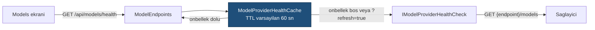

# Faz 8 — Sağlayıcı Genişlemesi ve Sağlık Denetimi

> **Durum:** ✅ Tamamlandı (2026-08-02)
> **Kaynak:** [BEYIN-FIRTINASI.md](arsiv/BEYIN-FIRTINASI.md) · **F-03**, **F-05**, **F-16**
> **Önkoşul:** Yok — Faz 6 sonundaki kod tabanı yeterli
> **Paketler:** `AgentPrism.OpenAI` (genişler), `AgentPrism.Abstractions`, `.Core`, `.AspNetCore`, `.UI`
> **Yeni paket:** Yok · **Migration:** Yok

---

## Bu Faza Başlarken

1. [`MIMARI.md`](MIMARI.md) — bölüm 4 (Faz 3'te kullanılanlar), bölüm 6 (çalıştırma yolu)
2. [`KARARLAR.md`](KARARLAR.md) — **K-032** (model kataloğu yapılandırmadan), **K-030** (Responses depolama), **K-007** (geçişli sabitleme kapalı), **K-025** (`Replace` vs `TryAdd`)
3. [`03-SAGLAYICI-VE-DERLEYICI.md`](03-SAGLAYICI-VE-DERLEYICI.md) — bugünkü sağlayıcı tasarımı
4. [`../MEMORY.md`](../MEMORY.md) — OpenAI tip adı tuzakları
5. Bu doküman

---

## Amaç

Bugün AgentPrism tek satıcıya bağlı. "Kontrol düzlemi" iddiası tek sağlayıcıyla
zayıf kalır. Bu faz üç şeyi yapar:

- **F-03** — OpenAI uyumlu **herhangi** bir uca bağlanma (OpenRouter, Groq, vLLM, Together…)
- **F-05** — Yerel modeller (Ollama, LM Studio) — F-03 ile büyük ölçüde bedava gelir
- **F-16** — Sağlayıcı sağlık denetimi ve devre kesici (Faz 5'ten **açık kalem**)

Bu faz baştadır çünkü **sonraki her fazı ucuzlatır**: skill, workflow ve eval
fazları çok token harcar; yerel bir modelle veya ucuz bir OpenRouter modeliyle
geliştirmek maliyeti düşürür.

---

## Bugün Ne Var (ölçüldü, 2026-08-02)

`src/AgentPrism.OpenAI/`:

| Dosya | Bugünkü davranış |
|-------|------------------|
| `OpenAIProviderOptions.cs` | **`Endpoint` alanı ZATEN VAR** ve yapılandırmadan bağlanıyor (`OpenAIProviderExtensions.Bind`) |
| `OpenAIProviderExtensions.cs` | `UseOpenAI(...)` **tek** bir options örneği yapılandırır; `alreadyRegistered` bayrağı ikinci çağrıyı yok sayar |
| `OpenAIProviderNames.cs` | Sağlayıcı adları **sabit**: `openai`, `openai-responses` |
| `OpenAIChatClientFactory.cs` | Tek `OpenAIClient`; iki sağlayıcı paylaşır |
| `OpenAIModelCatalog.cs` | Katalog yalnız yapılandırmadan gelir (K-032) |

**Sonuç:** taban adres zaten verilebiliyor. Eksik olan şey **aynı anda birden çok
uyumlu sağlayıcı** ve **sağlayıcı adının serbest olması**. F-03'ün gerçek işi
budur — beyin fırtınası belgesinin sandığından da küçüktür.

`ModelDescriptor` şu alanları **zaten taşıyor**: `InputCostPerMillionTokens`,
`OutputCostPerMillionTokens`. Faz 20 (maliyet) bunları kullanacak; bu fazda
yalnız yapılandırmadan doldurulur.

---

## 8.1 — Adlandırılmış OpenAI Uyumlu Sağlayıcılar (F-03)

Hedef kullanım:

```csharp
builder.AddAgentPrism()
       .UseOpenAI(apiKey)                                   // degismedi
       .UseOpenAICompatible("openrouter", o =>
       {
           o.Endpoint = new Uri("https://openrouter.ai/api/v1");
           o.ApiKey   = configuration["OpenRouter:ApiKey"];  // SIR: user-secrets
       })
       .UseOpenAICompatible("ollama", o =>
       {
           o.Endpoint = new Uri("http://localhost:11434/v1");
           // ApiKey YOK — yerel sunucu istemiyor
       });
```

Yapılandırmadan (K-028 ile uyumlu alt bölüm düzeni):

```
AgentPrism:Providers:OpenAICompatible:openrouter:Endpoint
AgentPrism:Providers:OpenAICompatible:openrouter:ApiKey        ← user-secrets
AgentPrism:Providers:OpenAICompatible:openrouter:DefaultModel
AgentPrism:Providers:OpenAICompatible:openrouter:Models:0:Name
```

Yapılacak işler:

1. **Adlandırılmış ayar.** `IOptionsMonitor<OpenAIProviderOptions>.Get(name)`
   kullanılır. `services.Configure<OpenAIProviderOptions>(name, configure)`.
   Doğrulayıcı (`OpenAIProviderOptionsValidator`) adlandırılmış örnekleri de
   denetlemelidir — `IValidateOptions<T>.Validate(string? name, T options)`
   imzası bunu zaten destekler; bugünkü uygulama `name` parametresini yok
   sayıyorsa düzeltilir.
2. **Fabrika artık ada göre.** `OpenAIChatClientFactory` tekil kayıttan çıkar;
   `IOpenAIChatClientFactoryProvider.Get(name)` benzeri bir sözlük gelir veya
   fabrika `name` parametresi alır. `OpenAIClient` **ad başına bir kez** kurulur
   ve önbelleklenir — her çağrıda yeni istemci kurmak bağlantı havuzunu bozar.
3. **Ad doğrulaması.** Sağlayıcı adı `[a-z0-9][a-z0-9-]{0,31}` ile sınırlanır.
   `openai` ve `openai-responses` **rezervedir**; bu adlarla kayıt hata verir.
   Gerekçe: agent tanımındaki `ModelBinding.Provider` bu adı taşır ve çakışma
   sessiz bir yanlış yönlendirmedir.
4. **Yalnız Chat Completions yüzeyi.** Uyumlu sağlayıcılar için `Responses`
   yüzeyi **kaydedilmez**. Ölçülmedi ama biliniyor: uyumlu sunucuların çoğu
   `/v1/responses` uygulamıyor. İsteyen `o.EnableResponsesSurface = true` ile
   açar; varsayılan kapalıdır.
5. **API anahtarı isteğe bağlı.** Yerel sunucular anahtar istemez (F-05).
   `ApiKey` boşsa sabit bir yer tutucu ile `ApiKeyCredential` kurulur
   (`OpenAIClient` boş kimlik kabul etmez). Bu davranış **yalnız** uyumlu
   sağlayıcılarda geçerlidir; `UseOpenAI` anahtarsız çalışmaya devam etmez.

> 🚨 **K-032 aynen geçerlidir.** Uyumlu sağlayıcının model kataloğu da
> yapılandırmadan gelir. Katalog bir **doğrulama listesi değildir**: listede
> olmayan model adı da kullanılabilir.

---

## 8.2 — Yerel Modeller (F-05)

F-03 tamamlandığında Ollama ve LM Studio ek kod istemez. Bu bölüm yalnız
**doğrulama ve dokümantasyondur**:

- `samples/AgentPrism.Api` içine yorumlanmış bir Ollama örneği eklenir
- `src/AgentPrism.OpenAI/README.md` yerel kurulum bölümü alır
- Bilinen fark listesi yazılır: Ollama `tool_choice` desteğini model bazında
  değiştirir; akışta `usage` göndermeyen sunucular vardır — o durumda
  `RunRecord.TotalTokens` **null** kalır ve bu bir hata değildir

---

## 8.3 — Sağlayıcı Sağlık Denetimi (F-16)

Faz 5'in Models ekranındaki "sağlık kontrolü faz 6'da gelir" notu **hâlâ
açıktır**; Faz 6 bunu yapmadı. Burada kapanır.

### Sözleşme

`IModelProvider` arayüzüne üye **eklenmez** — bu, tüketicinin kendi sağlayıcı
uygulamasını kırar (K4). Ayrı ve isteğe bağlı bir arayüz gelir:

```csharp
namespace AgentPrism;

public interface IModelProviderHealthCheck
{
    ValueTask<ModelProviderHealth> CheckHealthAsync(CancellationToken ct = default);
}

public sealed record ModelProviderHealth
{
    public required string ProviderName { get; init; }
    public required ModelProviderHealthStatus Status { get; init; }
    public string? Detail { get; init; }              // SIR TASIMAZ
    public TimeSpan? Latency { get; init; }
    public DateTimeOffset CheckedAt { get; init; }
    public IReadOnlyList<string> Models { get; init; } = [];
}

public enum ModelProviderHealthStatus { Unknown, Healthy, Degraded, Unhealthy }
```

Bir sağlayıcı bu arayüzü uygulamıyorsa durumu `Unknown`'dır ve bu bir hata
değildir.

### Denetim nasıl yapılır

**Ücretli bir model çağrısı yapılmaz.** OpenAI ve uyumlu sunucular
`GET {endpoint}/models` ucunu sunar; denetim bu uca gider. Yanıt gövdesi model
adlarını verir, ücret oluşturmaz.



- Denetim **isteğe bağlıdır**, arka planda zamanlayıcı ile koşmaz.
  `AgentPrismHealthOptions.BackgroundInterval` verilirse koşar; varsayılan `null`.
- Sonuç önbelleklenir. Arayüz her açılışta sağlayıcıya gitmez.
- Hata detayı **sır taşımaz**: HTTP durum kodu ve kısa neden yazılır, yanıt
  gövdesi ve başlıklar yazılmaz.

### Devre kesici

Bugün bir sağlayıcı çökerse her çalıştırma tek tek hata verir ve kullanıcı aynı
hatayı defalarca görür.

**Yeni paket eklenmez.** `Microsoft.Extensions.Http.Resilience` (10.8.0) mevcut
ama `AgentPrism.OpenAI` AOT uyumludur ve K-007 gereği tüketicinin bağımlılık
grafiği kirletilmez. Yerine `AgentPrism.Core` içinde ~120 satırlık bir
`ModelProviderCircuitBreaker` yazılır:

| Durum | Davranış |
|-------|----------|
| `Closed` | İstekler geçer. Ardışık hata sayacı tutulur |
| `Open` | `AgentPrismProviderUnavailableException` **anında** atılır; model çağrısı yapılmaz |
| `HalfOpen` | Tek bir deneme geçer; başarılıysa `Closed`, değilse yeniden `Open` |

Ayarlar: `FailureThreshold` (varsayılan 5), `BreakDuration` (varsayılan 30 sn),
`Enabled` (varsayılan **true**). Devre durumu sağlık ucunda görünür.

> Devre kesici `IChatClient` boru hattına **dekoratör** olarak girer, sağlayıcı
> uygulamasının içine değil. Böylece Anthropic (Faz 26) ve Azure (Faz 27) aynı
> korumayı bedava alır.

---

## Yeni HTTP Uçları

| Uç | Ne döner |
|----|----------|
| `GET {prefix}/api/models/health` | Tüm sağlayıcıların önbellekli sağlık durumu |
| `GET {prefix}/api/models/health?refresh=true` | Önbelleği atlar, sağlayıcıya gider |
| `GET {prefix}/api/models/health/{provider}` | Tek sağlayıcı |

`GET {prefix}/api/models` yanıtı `providers[].status` alanı ile genişler.

---

## Arayüz

`frontend/src/screens/models.tsx`:

- Her sağlayıcı kartında durum rozeti (yeşil / sarı / kırmızı / gri)
- "Şimdi denetle" düğmesi → `?refresh=true`
- Devre kesici açıksa kart üzerinde geri sayım
- Faz 5'ten kalan "sağlık kontrolü faz 6'da gelir" notu **silinir**

Bundle etkisi hedefi: **+3 KB gzip'ten az**. Yeni kütüphane eklenmez.

---

## Testler

| Proje | Yeni test |
|-------|-----------|
| `AgentPrism.OpenAI.UnitTests` | Adlandırılmış sağlayıcı kaydı; rezerve ad reddi; ad doğrulama; anahtarsız uyumlu sağlayıcı; iki sağlayıcının **farklı** `Endpoint` kullandığının kanıtı (`ChatClientMetadata.ProviderUri`) |
| `AgentPrism.Core.UnitTests` | Devre kesici durum makinesi; `HalfOpen` tek deneme; eşik sonrası çağrı **yapılmaması** |
| `AgentPrism.AspNetCore.FunctionalTests` | Sağlık ucu; önbellek davranışı; sağlayıcı hata detayının **sır taşımaması**; kimlik doğrulama katmanlarının uygulanması |
| `AgentPrism.Ui.E2ETests` | Models ekranında rozet görünür |

> `ChatClientMetadata.ProviderUri` kullanın — `OpenAIClient.Endpoint` `OPENAI001`
> işaretlidir ve testte bastırma ister (MEMORY.md).

---

## Bu Fazda Verilen Kararlar

Karar defterine yazıldı (bkz. `docs/KARARLAR.md`, K-069–K-073):

1. **Uyumlu sağlayıcılarda Responses yüzeyi varsayılan kapalı** — çoğu uyumlu
   sunucu uygulamıyor; açık bırakmak çalışma anında anlaşılmaz hata üretir.
2. **`IModelProvider` genişletilmedi, ayrı arayüz eklendi** — K4 gereği.
3. **Devre kesici için yeni paket alınmadı** — K-007 ve AOT vaadi.
4. **Sağlık denetimi `/models` ucunu kullanır, model çağrısı yapmaz** — denetim
   ücret üretmemelidir.
5. **Devre kesici varsayılan açık** *(kullanıcı kararı)*.
6. **`UseOpenAICompatible` ayrı ad, `UseOpenAI` aşırı yüklemesi değil** *(kullanıcı kararı)*.
7. **Sağlık denetimi arka planda varsayılan kapalı** *(kullanıcı kararı)*.

---

## Uygulamadan Önce Sorulan Sorular — Cevaplandı

Üçü de dokümanın önerisiyle aynı yönde karara bağlandı (kullanıcı onayı,
2026-08-02):

1. **Devre kesici varsayılan açık** (`Enabled = true`).
2. **`UseOpenAICompatible(ad, ...)`** — ayrı ad, `UseOpenAI` aşırı yüklemesi değil.
3. **Sağlık denetimi arka planda varsayılan kapalı** (`BackgroundInterval = null`).

---

## Gerçekleşen Public API

Plandaki taslak değil, koddaki gerçek imzalar.

### `AgentPrism.OpenAI` — yeni/değişen

```csharp
public sealed class OpenAIProviderOptions
{
    // ...mevcut uyeler...

    // YENI. Yalniz UseOpenAICompatible() okur; UseOpenAI() yok sayar.
    public bool EnableResponsesSurface { get; set; }
}

// YENI dosya. Yalniz SectionName tasir.
public static class OpenAICompatibleProviderOptions
{
    public const string SectionName = "AgentPrism:Providers:OpenAICompatible";
}

// YENI dosya.
public static class OpenAICompatibleProviderExtensions
{
    public static IAgentPrismBuilder UseOpenAICompatible(
        this IAgentPrismBuilder builder, string name, Action<OpenAIProviderOptions> configure);

    public static IAgentPrismBuilder UseOpenAICompatible(
        this IAgentPrismBuilder builder, string name, IConfiguration configurationSection);
}

// OpenAIProviderOptionsValidator — DEGISTI. name parametresi artik kullaniliyor:
//   name bos (varsayilan ornek, UseOpenAI())  -> ApiKey ZORUNLU
//   name dolu  (adlandirilmis, UseOpenAICompatible()) -> Endpoint ZORUNLU, ApiKey ISTEGE BAGLI

// OpenAIModelProvider — DEGISTI: artik IModelProviderHealthCheck da uyguluyor.
public sealed class OpenAIModelProvider : IModelProvider, IModelProviderHealthCheck
{
    public OpenAIModelProvider(
        string name, OpenAIApiSurface apiSurface, OpenAIChatClientFactory chatClientFactory,
        IReadOnlyList<ModelDescriptor> models, ILogger<OpenAIModelProvider>? logger = null,
        OpenAIProviderOptions? healthCheckOptions = null);   // YENI, son parametre, opsiyonel

    public ValueTask<ModelProviderHealth> CheckHealthAsync(CancellationToken cancellationToken = default);
}

// internal — GET {endpoint}/models denetimi. Statik yardimcilari testler icin internal.
internal sealed class OpenAIProviderHealthCheck(string providerName, OpenAIProviderOptions options)
    : IModelProviderHealthCheck
{
    internal static Uri BuildModelsEndpoint(Uri? baseEndpoint);
    internal static ValueTask<IReadOnlyList<string>> ReadModelIdsAsync(HttpResponseMessage response, CancellationToken ct);
}

// internal — adlandirilmis ornekler icin OpenAIChatClientFactory onbellegi.
internal sealed class OpenAINamedChatClientFactoryCache
{
    public OpenAIChatClientFactory Get(string name);
}
```

### `AgentPrism.Abstractions` — yeni

```csharp
public interface IModelProviderHealthCheck
{
    ValueTask<ModelProviderHealth> CheckHealthAsync(CancellationToken cancellationToken = default);
}

public sealed record ModelProviderHealth
{
    public required string ProviderName { get; init; }
    public required ModelProviderHealthStatus Status { get; init; }
    public string? Detail { get; init; }              // SIR TASIMAZ — HTTP kodu + kisa neden
    public TimeSpan? Latency { get; init; }
    public DateTimeOffset CheckedAt { get; init; }
    public IReadOnlyList<string> Models { get; init; } = [];
}

[JsonConverter(typeof(JsonStringEnumConverter<ModelProviderHealthStatus>))]   // K-040
public enum ModelProviderHealthStatus { Unknown, Healthy, Degraded, Unhealthy }

// ModelProviderDescriptor — YENI ALAN:
public sealed record ModelProviderDescriptor
{
    // ...mevcut uyeler...
    public ModelProviderHealthStatus Status { get; init; }   // onbellekten; /api/models ag cagrisi yapmaz
}

// YENI istisna.
public sealed class AgentPrismProviderUnavailableException : AgentPrismException
{
    public string? ProviderName { get; init; }
    public DateTimeOffset? RetryAfter { get; init; }
}
```

### `AgentPrism.Core` — yeni

```csharp
public sealed class AgentPrismOptions
{
    // ...mevcut uyeler...
    public AgentPrismCircuitBreakerOptions CircuitBreaker { get; set; } = new();
    public AgentPrismHealthOptions Health { get; set; } = new();
}

public sealed class AgentPrismCircuitBreakerOptions
{
    public bool Enabled { get; set; } = true;
    public int FailureThreshold { get; set; } = 5;
    public TimeSpan BreakDuration { get; set; } = TimeSpan.FromSeconds(30);
}

public sealed class AgentPrismHealthOptions
{
    public TimeSpan CacheTtl { get; set; } = TimeSpan.FromSeconds(60);
    public TimeSpan? BackgroundInterval { get; set; }   // null = kapali (varsayilan)
}

public sealed class ModelProviderCircuitBreaker
{
    public ModelProviderCircuitBreaker(IOptionsMonitor<AgentPrismOptions> optionsMonitor, TimeProvider? timeProvider = null);
    public bool IsEnabled { get; }
    public IChatClient Wrap(string providerName, IChatClient inner);
    public void EnsureRequestAllowed(string providerName);   // Open ise atar
    public void RecordSuccess(string providerName);
    public void RecordFailure(string providerName);
    public bool IsOpen(string providerName, out TimeSpan? retryAfter);   // durumu DEGISTIRMEZ
}

public sealed class ModelProviderHealthCache
{
    public ModelProviderHealthCache(
        IEnumerable<IModelProvider> providers, IOptionsMonitor<AgentPrismOptions> optionsMonitor,
        ModelProviderCircuitBreaker? circuitBreaker = null, TimeProvider? timeProvider = null);

    public ValueTask<IReadOnlyList<ModelProviderHealth>> GetAllAsync(bool refresh, CancellationToken ct = default);
    public ValueTask<ModelProviderHealth?> GetAsync(string providerName, bool refresh, CancellationToken ct = default);
    public bool TryPeek(string providerName, out ModelProviderHealth health);   // ag cagrisi YAPMAZ
}

// internal — BackgroundInterval null ise hicbir zamanlayici kurmadan doner.
internal sealed class ModelProviderHealthBackgroundService : BackgroundService;

// internal — devre kesici dekoratoru.
internal sealed class CircuitBreakingChatClient : DelegatingChatClient;

// ModelProviderRegistry — DEGISTI: yeni, OPSIYONEL ikinci parametre (geriye uyumlu).
public sealed class ModelProviderRegistry : IModelProviderRegistry
{
    public ModelProviderRegistry(IEnumerable<IModelProvider> providers, ModelProviderCircuitBreaker? circuitBreaker = null);
}
```

### `AgentPrism.AspNetCore` — yeni uçlar

```
GET {prefix}/api/models/health                  -> ModelProviderHealth[]  (onbellekli, TTL 60 sn)
GET {prefix}/api/models/health?refresh=true      -> ayni, onbellek atlanir
GET {prefix}/api/models/health/{provider}        -> ModelProviderHealth (404 bilinmeyen ad)
GET {prefix}/api/models                          -> ModelProviderDescriptor[] — DEGISTI: her ogede artik `status` alani var (onbellekten, ag cagrisi YOK)
```

---

## Plandan Sapmalar

Yedi sapma var; hepsi ölçüme veya analyzer'a dayanıyor.

### S1 — Ad deseni doğrulaması regex değil, elle karakter denetimi

**Plan:** `^[a-z0-9][a-z0-9-]{0,31}$` deseni.
**Sorun:** `MA0009` (regex DoS analizi) `[GeneratedRegex]` ile kaynak üretilmiş
düzenli ifadeleri de işaretliyor; bu kadar basit bir desen için bastırmaya
gerek yoktu.
**Yapılan:** `OpenAICompatibleProviderExtensions.IsValidNamePattern` elle
karakter döngüsüyle aynı kuralı uyguluyor. Regex bağımlılığı yok.

### S2 — Doğrulayıcı `name`'i artık kullanıyor (plan zaten böyle öngörmüştü)

`OpenAIProviderOptionsValidator.Validate(string? name, ...)` adsız örnekte
(`UseOpenAI()`) `ApiKey` zorunlu tutar; adlandırılmış örnekte
(`UseOpenAICompatible()`) `Endpoint` zorunlu, `ApiKey` isteğe bağlıdır. Bu,
dokümanın 8.1 bölümünde zaten öngörülmüştü ("bugünkü uygulama `name`
parametresini yok sayıyorsa düzeltilir") — sapma değil, planın kendisi.

### S3 — Sağlık denetiminin hata detayı `HttpRequestException.Message` değil, `HttpRequestError` kategorisi

**Ölçüldü:** Bağlantı reddi (`connection refused`) gibi durumlarda
`.Message` hedef adresi (host:port) gövdeye gömüyor. DoD açıkça "hata
detayında API anahtarı veya uç adresi sızmıyor" diyor; ham mesaj bunu ihlal
ederdi. **Yapılan:** `exception.HttpRequestError` (.NET 8+ kategori enum'u,
adres taşımaz) kullanıldı. Fonksiyonel test
(`Baglanamayan_saglayicinin_detayinda_ne_anahtar_ne_adres_gorunur`) bunu
kapalı bir porta bağlanarak doğruluyor.

### S4 — `ModelProviderRegistry` yapıcısına opsiyonel devre kesici parametresi

Devre kesicinin entegrasyon noktası olarak `ModelProviderRegistry.CreateChatClient`
seçildi (üretilen her istemciyi sağlayıcı adına göre sarar). Yapıcıya
`ModelProviderCircuitBreaker? circuitBreaker = null` eklendi — varsayılan
`null` sayesinde doğrudan `new ModelProviderRegistry(providers)` ile kurulan
mevcut testler (`ModelProviderRegistryTests`) değişmeden geçti.

### S5 — Ollama gerçek kurulu değildi; anahtarsız yerel bağlantı sahte bir sunucuyla doğrulandı

Kullanıcı "Ollama bilgisayarımda yok, kendi yöntemlerinle test et" dedi. Gerçek
bir Ollama kurulumu yerine `FakeOpenAiCompatibleServer` (gerçek bir Kestrel
dinleyicisi, `127.0.0.1`, rastgele port) yazıldı ve `AgentPrism.AspNetCore.FunctionalTests`
projesine eklendi. Bu, F-05'in asıl riskli mekanizmasını (yerel adrese
bağlanma + anahtarsız istek + `OpenAIClient`'in boş kimlik kabul etmemesi
için yer tutucu kullanılması) **gerçek bir soket üzerinden**, deterministik
ve CI-güvenli biçimde doğrular. Gerçek OpenAI/OpenRouter çağrısı yapan
otomatik test **yoktur** (Faz 3'teki aynı kararla tutarlı); ağ gerektiren
doğrulama elle yapıldı (aşağıdaki DoD kanıtı).

### S6 — Örnek uygulamada OpenRouter modeli için `MaxOutputTokens` verildi

**Ölçüldü:** `openrouter-destek` agent'ı ilk halinde `MaxOutputTokens`
belirtmiyordu; MAF/OpenAI istemcisi varsayılan olarak `max_tokens=65536`
gönderiyor. OpenRouter'ın kredi kontrolü `max_tokens`'i "en kötü durum"
maliyeti olarak hesaba katıyor ve düşük bakiyeli anahtarlarda gerçek bir
`HTTP 402 (insufficient credits)` üretti — kodda hata değil, gerçek bir
hesap kısıtı. **Yapılan:** `ModelBinding.MaxOutputTokens = 512` eklendi;
sonrasında çağrı sorunsuz tamamlandı (bkz. DoD kanıtı). Uyumlu bir sağlayıcı
eklerken bu, bilinmesi gereken bir tuzaktır — `MEMORY.md`'ye yazıldı.

### S7 — `/api/models` yanıtı katkısal olarak genişledi

Doküman "`/api/models` yanıtı `providers[].status` alanı ile genişler"
diyordu. Üst düzey şekil (dizi) korunarak her `ModelProviderDescriptor`'a
`status` alanı eklendi — mevcut tüketicileri kırmayan, katkısal bir değişiklik.
Alan **onbellekten** doldurulur (`ModelProviderHealthCache.TryPeek`); bu uç
hiçbir zaman sağlayıcıya ağ çağrısı yapmaz.

---

## Dosya Listesi (gerçekleşen)

```
src/AgentPrism.OpenAI/
├── OpenAIProviderOptions.cs               EnableResponsesSurface eklendi
├── OpenAIProviderOptionsValidator.cs      name-duyarli dogrulama
├── OpenAIProviderExtensions.cs            Bind() internal yapildi, EnableResponsesSurface baglama
├── OpenAIModelProvider.cs                 IModelProviderHealthCheck eklendi
├── OpenAICompatibleProviderOptions.cs     YENI
├── OpenAICompatibleProviderExtensions.cs  YENI — UseOpenAICompatible
├── OpenAINamedChatClientFactoryCache.cs   YENI — internal
└── OpenAIProviderHealthCheck.cs           YENI — internal, GET /models denetimi

src/AgentPrism.Abstractions/
├── Models/IModelProviderHealthCheck.cs    YENI — arayuz + ModelProviderHealth + enum
├── Models/ModelDescriptor.cs              ModelProviderDescriptor.Status eklendi
└── AgentPrismException.cs                 AgentPrismProviderUnavailableException eklendi

src/AgentPrism.Core/
├── AgentPrismOptions.cs                   CircuitBreaker + Health nested options
├── AgentPrismOptionsValidator.cs          yeni alan dogrulamalari
├── AgentPrismServiceCollectionExtensions.cs  DI kayitlari + Bind
├── Models/ModelProviderRegistry.cs        opsiyonel devre kesici parametresi
├── Models/ModelProviderCircuitBreaker.cs  YENI
├── Models/CircuitBreakingChatClient.cs    YENI — internal
├── Models/ModelProviderHealthCache.cs     YENI
└── Models/ModelProviderHealthBackgroundService.cs  YENI — internal

src/AgentPrism.AspNetCore/
├── Endpoints/ModelHealthEndpoints.cs      YENI
├── Endpoints/CatalogEndpoints.cs          /api/models 'status' alani ile genisledi
└── AgentPrismEndpointRouteBuilderExtensions.cs  ModelHealthEndpoints.Map baglandi

src/AgentPrism.UI/frontend/src/
├── screens/models.tsx                     saglik rozeti, "Check now", devre kesici notu
├── lib/types.ts                           ModelProviderHealth(Status) turleri
├── lib/api.ts                             modelsHealth/modelHealth
└── lib/format.ts (+.test.ts)              timeSpanMs/latencyText

samples/AgentPrism.Api/
├── Program.cs                             UseOpenAICompatible("openrouter", ...) + yorumlanmis Ollama + /health
└── appsettings.json                       OpenAICompatible:openrouter semasi

tests/AgentPrism.OpenAI.UnitTests/
├── OpenAICompatibleProviderExtensionsTests.cs  YENI (16 test)
└── OpenAIProviderHealthCheckTests.cs           YENI (9 test)

tests/AgentPrism.Core.UnitTests/
├── Models/ModelProviderCircuitBreakerTests.cs  YENI (14 test)
└── Fakes/ManualTimeProvider.cs                 YENI

tests/AgentPrism.AspNetCore.FunctionalTests/
├── ModelHealthEndpointsTests.cs                 YENI (7 test)
├── Infrastructure/FakeOpenAiCompatibleServer.cs YENI — gercek Kestrel, 127.0.0.1
└── AgentPrism.AspNetCore.FunctionalTests.csproj ProjectReference: AgentPrism.OpenAI eklendi

tests/AgentPrism.Ui.E2ETests/
└── UiTests.cs                             Models_ekraninda_saglik_rozeti_gorunur eklendi
```

---

## Testler

**434 test geçiyor** (Faz 7 sonunda ~407 idi; artış +27 net yeni test, bazı
sayılar mevcut projelere eklendi).

| Proje | Sayı | Faz 8'de eklenen |
|-------|------|-------------------|
| `AgentPrism.OpenAI.UnitTests` | 77 | `OpenAICompatibleProviderExtensionsTests` (ad dogrulama, rezerve ad, anahtarsiz yerel saglayici, iki farkli Endpoint kaniti, Responses yuzeyi acik/kapali, yapilandirmadan okuma), `OpenAIProviderHealthCheckTests` (adres birlestirme, JSON ayristirma, 200 model sinirlamasi) |
| `AgentPrism.Core.UnitTests` | 99 | `ModelProviderCircuitBreakerTests` (Closed/Open/HalfOpen gecisleri, `ManualTimeProvider` ile mola suresi kontrolu, `Wrap` ile gercek basari/hata sayimi) |
| `AgentPrism.AspNetCore.FunctionalTests` | 119 | `ModelHealthEndpointsTests` (Unknown/404/onbellek/refresh/hata detayi sizinti testi/devre kesicinin saglik ucuna yansimasi) — `FakeOpenAiCompatibleServer` ile gercek soket |
| `AgentPrism.Ui.E2ETests` | 11 | Models ekraninda rozet + "Check now" dugmesi |
| `AgentPrism.PostgreSql.IntegrationTests` | 128 | degismedi |

**Gerçek OpenAI/OpenRouter çağrısı yapan test yoktur** (Faz 3'teki karar
korunuyor). Ağ gerektiren doğrulama elle yapıldı — aşağıda.

---

## Bitiş Ölçütleri (DoD)

Elle doğrulama: gerçek OpenAI anahtarı + gerçek OpenRouter anahtarı,
`samples/AgentPrism.Api`, `ASPNETCORE_ENVIRONMENT=Development` (user-secrets
yalnız Development'ta yüklenir).

| Ölçüt | Durum | Kanıt |
|-------|-------|-------|
| Aynı uygulamada `openai` + iki uyumlu sağlayıcı kayıtlı, üçünden de gerçek yanıt alınıyor | ✅ | `openai` (support), `openai-responses` (kayıtlı, denetlendi), `openrouter` (openrouter-destek) — aşağıdaki çıktı |
| Ollama ile anahtarsız yerel çalıştırma doğrulandı | ⚠️ **kısmi — bkz. sapma S5** | Ollama bu makinede kurulu değil; mekanizma `FakeOpenAiCompatibleServer` ile gerçek bir soket üzerinden doğrulandı (fonksiyonel test, 7 senaryo) |
| `GET /api/models/health` üç sağlayıcı için durum döndürüyor | ✅ | aşağıdaki çıktı — üçü de `Healthy` |
| Sağlayıcı kapatıldığında devre açılıyor, `BreakDuration` sonunda kapanıyor | ✅ | `ModelProviderCircuitBreakerTests` (9 senaryo) + `ModelHealthEndpointsTests.Ardisik_hatada_devre_acilir_ve_saglik_ucu_bunu_yansitir` |
| Models ekranındaki "faz 6'da gelir" notu kalktı | ✅ | `models.tsx` güncellendi; E2E testi doğruluyor |
| Hata detayında API anahtarı veya uç adresi **sızmıyor** | ✅ | `HttpRequestError` kategorisi kullanılır (sapma S3); `Sunucu_hata_dondurunce_...` ve `Baglanamayan_saglayicinin_detayinda_...` testleri |
| Dört doğrulama kapısı sıfır uyarı; sır taraması boş | ✅ | build/test(434)/pack(8 paket)/format → 0 uyarı; `grep` sır taraması boş |
| Bundle ölçüldü ve DoD'ye yazıldı | ✅ | **93,0 KB gzip** (bütçe 250 KB), Faz 6 sonu 92,4 KB idi → **+0,6 KB** (hedef: +3 KB altı) |

### Gerçek çıktı — üç sağlayıcı, gerçek yanıt (2026-08-02)

```
$ curl -s localhost:5080/health
{"status":"healthy","phase":"8 - saglayici genislemesi ve saglik denetimi",
 "storage":{"persistent":false,"runStore":"InMemoryRunStore","sessionStore":"InMemorySessionStore"},
 "provider":{"openAI":true,"model":"gpt-5.4-mini","name":"openai"},
 "openRouter":true}

$ curl -s localhost:5080/agentprism/api/models/health
[
  {"providerName":"openai","status":"Healthy","latency":"00:00:00.8933032","models":["gpt-5.4-mini","gpt-5.6-luna","gpt-5.6-terra"]},
  {"providerName":"openai-responses","status":"Healthy","latency":"00:00:00.4520805","models":["gpt-5.4-mini","gpt-5.6-luna","gpt-5.6-terra"]},
  {"providerName":"openrouter","status":"Healthy","latency":"00:00:00.3373152","models":[/* 200 model, ucret uretmedi */]}
]

$ curl -s -X POST localhost:5080/agentprism/api/agents/support/run \
       -d '{"message":"ORD-7 siparisim nerede","sessionId":"faz8-openai-test"}'
# ... tool cagrisi (get_order_status) + akisli yanit ...
# Son metin: "ORD-7 siparişiniz kargoya verilmiş. Tahmini teslim süresi: 2 gün."

$ curl -s -X POST localhost:5080/agentprism/api/agents/openrouter-destek/run \
       -d '{"message":"ORD-9 siparisim nerede","sessionId":"faz8-openrouter-test"}'
# openrouter -> openai/gpt-5.4-mini (resmi OpenAI DEGIL, farkli satici)
# ... tool cagrisi (get_order_status) + akisli yanit ...
# Son metin: "ORD-9 siparişiniz kargoya verildi. Tahmini teslim süresi: 2 gün."

$ curl -s localhost:5080/agentprism/api/models | # her ogede status alani
[{"name":"openai","status":"Healthy",...},{"name":"openai-responses","status":"Healthy",...},{"name":"openrouter","status":"Healthy",...}]
```

**Not:** İlk OpenRouter denemesi `HTTP 402 (insufficient credits)` ile
başarısız oldu — `max_tokens` varsayılanı (65536) hesabın karşılayabileceği
kredinin üzerindeydi. `ModelBinding.MaxOutputTokens = 512` eklenince sorun
çözüldü (sapma S6). Bu, koddaki bir hata değil, gerçek bir OpenRouter hesap
kısıtıydı ve gizlenmedi.

---

## Riskler — kapanış durumu

| Risk | Sonuç |
|------|-------|
| "OpenAI uyumlu" iddiası her sunucuda tutmaz | Sağlık ucu erişilebilirlik ölçer, yetenek değil. OpenRouter'ın `max_tokens` kredi davranışı (sapma S6) bunun somut bir örneği — README'ye bilinen sınır olarak eklenmeli |
| Adlandırılmış ayar doğrulaması atlanır | `Endpoint_verilmeyen_adlandirilmis_saglayici_dogrulama_hatasi_verir` testi bunu koruyor |
| Devre kesici çok agresif olur | Eşik ve süre yapılandırılabilir; `Enabled=false` ile tamamen kapanır. Varsayılan `Enabled=true` (kullanıcı kararı) |
| Yerel modelde `usage` gelmez | Kod değişmedi; `TotalTokens` null kalır — Faz 20'ye devredildi |
| Ollama gerçek kurulu değildi | **Gerçekleşti.** Sapma S5 — mekanizma sahte sunucuyla doğrulandı, gerçek Ollama ile yeniden doğrulama Faz 8 sonrası açık kalan bir iştir |

---

## Sonraki Faza Devir Notu

- **Ollama ile gerçek doğrulama henüz yapılmadı.** Mekanizma (anahtarsız
  bağlantı, yer tutucu kimlik, `GET /models` denetimi) gerçek bir Kestrel
  sunucusuyla test edildi ve doğru çalışıyor, ancak gerçek Ollama'nın kendi
  `tool_choice`/`usage` davranışı bu ortamda hiç gözlenmedi. Ollama kurulu bir
  makinede fırsat çıkarsa `samples/AgentPrism.Api` içindeki yorum satırları
  açılıp elle doğrulanmalı.
- **OpenRouter (ve muhtemelen diğer uyumlu sağlayıcılar) `max_tokens`
  varsayılanına duyarlıdır.** Yeni bir uyumlu sağlayıcı eklerken
  `ModelBinding.MaxOutputTokens` verilmemesi hesap kredi hatası (`HTTP 402`
  benzeri) üretebilir — bu AgentPrism'in hatası değildir ama şaşırtıcıdır.
  Bkz. `MEMORY.md`.
- Faz 20 (maliyet) `ModelDescriptor.*CostPerMillionTokens` alanlarını
  kullanacak. Uyumlu sağlayıcılar için de yapılandırmadan doldurulabildiği
  bu fazda **doğrulanmadı** (appsettings örneğinde fiyat alanı boş bırakıldı);
  Faz 20'de gerçek bir örnekle ölçülmeli.
- Faz 26 (Anthropic/Gemini) devre kesici dekoratörünü **hazır bulacaktır**;
  entegrasyon noktası `IModelProviderRegistry` seviyesinde olduğu için yeni
  sağlayıcı paketleri hiçbir ek kod yazmadan aynı korumayı alır — tek şart
  `IModelProvider` singleton olarak DI'da kayıtlı olmak.
- Sağlık sözleşmesi (`IModelProviderHealthCheck`) Faz 26 ve 27'de
  uygulanmalıdır; desen `OpenAIProviderHealthCheck` ile birebir aynıdır
  (`GET {endpoint}/models`, `internal` statik yardımcılar test edilebilir).
- `AgentPrismHealthOptions.BackgroundInterval` seti çalışıyor
  (`ModelProviderHealthBackgroundService`) ama gerçek bir uzun-ömürlü
  süreçte hiç gözlenmedi (yalnızca `null` — kapalı — yolu elle doğrulandı).
