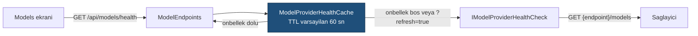

# Faz 8 — Sağlayıcı Genişlemesi ve Sağlık Denetimi

> **Durum:** 📋 Planlandı
> **Kaynak:** [BEYIN-FIRTINASI.md](BEYIN-FIRTINASI.md) · **F-03**, **F-05**, **F-16**
> **Önkoşul:** Yok — Faz 6 sonundaki kod tabanı yeterli
> **Paketler:** `AgentPrism.OpenAI` (genişler), `AgentPrism.Abstractions`, `.Core`, `.AspNetCore`, `.UI`
> **Yeni paket:** Yok · **Migration:** Yok

---

## Bu Faza Başlarken

1. [`MIMARI.md`](MIMARI.md) — bölüm 4 (Faz 3'te kullanılanlar), bölüm 6 (çalıştırma yolu)
2. [`KARARLAR.md`](KARARLAR.md) — **K-032** (model kataloğu yapılandırmadan), **K-030** (Responses depolama), **K-007** (geçişli sabitleme kapalı), **K-025** (`Replace` vs `TryAdd`)
3. [`03-SAGLAYICI-VE-DERLEYICI.md`](03-SAGLAYICI-VE-DERLEYICI.md) — bugünkü sağlayıcı tasarımı
4. [`../MEMORY.md`](../MEMORY.md) — OpenAI tip adı tuzakları
5. Bu doküman

---

## Amaç

Bugün AgentPrism tek satıcıya bağlı. "Kontrol düzlemi" iddiası tek sağlayıcıyla
zayıf kalır. Bu faz üç şeyi yapar:

- **F-03** — OpenAI uyumlu **herhangi** bir uca bağlanma (OpenRouter, Groq, vLLM, Together…)
- **F-05** — Yerel modeller (Ollama, LM Studio) — F-03 ile büyük ölçüde bedava gelir
- **F-16** — Sağlayıcı sağlık denetimi ve devre kesici (Faz 5'ten **açık kalem**)

Bu faz baştadır çünkü **sonraki her fazı ucuzlatır**: skill, workflow ve eval
fazları çok token harcar; yerel bir modelle veya ucuz bir OpenRouter modeliyle
geliştirmek maliyeti düşürür.

---

## Bugün Ne Var (ölçüldü, 2026-08-02)

`src/AgentPrism.OpenAI/`:

| Dosya | Bugünkü davranış |
|-------|------------------|
| `OpenAIProviderOptions.cs` | **`Endpoint` alanı ZATEN VAR** ve yapılandırmadan bağlanıyor (`OpenAIProviderExtensions.Bind`) |
| `OpenAIProviderExtensions.cs` | `UseOpenAI(...)` **tek** bir options örneği yapılandırır; `alreadyRegistered` bayrağı ikinci çağrıyı yok sayar |
| `OpenAIProviderNames.cs` | Sağlayıcı adları **sabit**: `openai`, `openai-responses` |
| `OpenAIChatClientFactory.cs` | Tek `OpenAIClient`; iki sağlayıcı paylaşır |
| `OpenAIModelCatalog.cs` | Katalog yalnız yapılandırmadan gelir (K-032) |

**Sonuç:** taban adres zaten verilebiliyor. Eksik olan şey **aynı anda birden çok
uyumlu sağlayıcı** ve **sağlayıcı adının serbest olması**. F-03'ün gerçek işi
budur — beyin fırtınası belgesinin sandığından da küçüktür.

`ModelDescriptor` şu alanları **zaten taşıyor**: `InputCostPerMillionTokens`,
`OutputCostPerMillionTokens`. Faz 20 (maliyet) bunları kullanacak; bu fazda
yalnız yapılandırmadan doldurulur.

---

## 8.1 — Adlandırılmış OpenAI Uyumlu Sağlayıcılar (F-03)

Hedef kullanım:

```csharp
builder.AddAgentPrism()
       .UseOpenAI(apiKey)                                   // degismedi
       .UseOpenAICompatible("openrouter", o =>
       {
           o.Endpoint = new Uri("https://openrouter.ai/api/v1");
           o.ApiKey   = configuration["OpenRouter:ApiKey"];  // SIR: user-secrets
       })
       .UseOpenAICompatible("ollama", o =>
       {
           o.Endpoint = new Uri("http://localhost:11434/v1");
           // ApiKey YOK — yerel sunucu istemiyor
       });
```

Yapılandırmadan (K-028 ile uyumlu alt bölüm düzeni):

```
AgentPrism:Providers:OpenAICompatible:openrouter:Endpoint
AgentPrism:Providers:OpenAICompatible:openrouter:ApiKey        ← user-secrets
AgentPrism:Providers:OpenAICompatible:openrouter:DefaultModel
AgentPrism:Providers:OpenAICompatible:openrouter:Models:0:Name
```

Yapılacak işler:

1. **Adlandırılmış ayar.** `IOptionsMonitor<OpenAIProviderOptions>.Get(name)`
   kullanılır. `services.Configure<OpenAIProviderOptions>(name, configure)`.
   Doğrulayıcı (`OpenAIProviderOptionsValidator`) adlandırılmış örnekleri de
   denetlemelidir — `IValidateOptions<T>.Validate(string? name, T options)`
   imzası bunu zaten destekler; bugünkü uygulama `name` parametresini yok
   sayıyorsa düzeltilir.
2. **Fabrika artık ada göre.** `OpenAIChatClientFactory` tekil kayıttan çıkar;
   `IOpenAIChatClientFactoryProvider.Get(name)` benzeri bir sözlük gelir veya
   fabrika `name` parametresi alır. `OpenAIClient` **ad başına bir kez** kurulur
   ve önbelleklenir — her çağrıda yeni istemci kurmak bağlantı havuzunu bozar.
3. **Ad doğrulaması.** Sağlayıcı adı `[a-z0-9][a-z0-9-]{0,31}` ile sınırlanır.
   `openai` ve `openai-responses` **rezervedir**; bu adlarla kayıt hata verir.
   Gerekçe: agent tanımındaki `ModelBinding.Provider` bu adı taşır ve çakışma
   sessiz bir yanlış yönlendirmedir.
4. **Yalnız Chat Completions yüzeyi.** Uyumlu sağlayıcılar için `Responses`
   yüzeyi **kaydedilmez**. Ölçülmedi ama biliniyor: uyumlu sunucuların çoğu
   `/v1/responses` uygulamıyor. İsteyen `o.EnableResponsesSurface = true` ile
   açar; varsayılan kapalıdır.
5. **API anahtarı isteğe bağlı.** Yerel sunucular anahtar istemez (F-05).
   `ApiKey` boşsa sabit bir yer tutucu ile `ApiKeyCredential` kurulur
   (`OpenAIClient` boş kimlik kabul etmez). Bu davranış **yalnız** uyumlu
   sağlayıcılarda geçerlidir; `UseOpenAI` anahtarsız çalışmaya devam etmez.

> 🚨 **K-032 aynen geçerlidir.** Uyumlu sağlayıcının model kataloğu da
> yapılandırmadan gelir. Katalog bir **doğrulama listesi değildir**: listede
> olmayan model adı da kullanılabilir.

---

## 8.2 — Yerel Modeller (F-05)

F-03 tamamlandığında Ollama ve LM Studio ek kod istemez. Bu bölüm yalnız
**doğrulama ve dokümantasyondur**:

- `samples/AgentPrism.Api` içine yorumlanmış bir Ollama örneği eklenir
- `src/AgentPrism.OpenAI/README.md` yerel kurulum bölümü alır
- Bilinen fark listesi yazılır: Ollama `tool_choice` desteğini model bazında
  değiştirir; akışta `usage` göndermeyen sunucular vardır — o durumda
  `RunRecord.TotalTokens` **null** kalır ve bu bir hata değildir

---

## 8.3 — Sağlayıcı Sağlık Denetimi (F-16)

Faz 5'in Models ekranındaki "sağlık kontrolü faz 6'da gelir" notu **hâlâ
açıktır**; Faz 6 bunu yapmadı. Burada kapanır.

### Sözleşme

`IModelProvider` arayüzüne üye **eklenmez** — bu, tüketicinin kendi sağlayıcı
uygulamasını kırar (K4). Ayrı ve isteğe bağlı bir arayüz gelir:

```csharp
namespace AgentPrism;

public interface IModelProviderHealthCheck
{
    ValueTask<ModelProviderHealth> CheckHealthAsync(CancellationToken ct = default);
}

public sealed record ModelProviderHealth
{
    public required string ProviderName { get; init; }
    public required ModelProviderHealthStatus Status { get; init; }
    public string? Detail { get; init; }              // SIR TASIMAZ
    public TimeSpan? Latency { get; init; }
    public DateTimeOffset CheckedAt { get; init; }
    public IReadOnlyList<string> Models { get; init; } = [];
}

public enum ModelProviderHealthStatus { Unknown, Healthy, Degraded, Unhealthy }
```

Bir sağlayıcı bu arayüzü uygulamıyorsa durumu `Unknown`'dır ve bu bir hata
değildir.

### Denetim nasıl yapılır

**Ücretli bir model çağrısı yapılmaz.** OpenAI ve uyumlu sunucular
`GET {endpoint}/models` ucunu sunar; denetim bu uca gider. Yanıt gövdesi model
adlarını verir, ücret oluşturmaz.



- Denetim **isteğe bağlıdır**, arka planda zamanlayıcı ile koşmaz.
  `AgentPrismHealthOptions.BackgroundInterval` verilirse koşar; varsayılan `null`.
- Sonuç önbelleklenir. Arayüz her açılışta sağlayıcıya gitmez.
- Hata detayı **sır taşımaz**: HTTP durum kodu ve kısa neden yazılır, yanıt
  gövdesi ve başlıklar yazılmaz.

### Devre kesici

Bugün bir sağlayıcı çökerse her çalıştırma tek tek hata verir ve kullanıcı aynı
hatayı defalarca görür.

**Yeni paket eklenmez.** `Microsoft.Extensions.Http.Resilience` (10.8.0) mevcut
ama `AgentPrism.OpenAI` AOT uyumludur ve K-007 gereği tüketicinin bağımlılık
grafiği kirletilmez. Yerine `AgentPrism.Core` içinde ~120 satırlık bir
`ModelProviderCircuitBreaker` yazılır:

| Durum | Davranış |
|-------|----------|
| `Closed` | İstekler geçer. Ardışık hata sayacı tutulur |
| `Open` | `AgentPrismProviderUnavailableException` **anında** atılır; model çağrısı yapılmaz |
| `HalfOpen` | Tek bir deneme geçer; başarılıysa `Closed`, değilse yeniden `Open` |

Ayarlar: `FailureThreshold` (varsayılan 5), `BreakDuration` (varsayılan 30 sn),
`Enabled` (varsayılan **true**). Devre durumu sağlık ucunda görünür.

> Devre kesici `IChatClient` boru hattına **dekoratör** olarak girer, sağlayıcı
> uygulamasının içine değil. Böylece Anthropic (Faz 26) ve Azure (Faz 27) aynı
> korumayı bedava alır.

---

## Yeni HTTP Uçları

| Uç | Ne döner |
|----|----------|
| `GET {prefix}/api/models/health` | Tüm sağlayıcıların önbellekli sağlık durumu |
| `GET {prefix}/api/models/health?refresh=true` | Önbelleği atlar, sağlayıcıya gider |
| `GET {prefix}/api/models/health/{provider}` | Tek sağlayıcı |

`GET {prefix}/api/models` yanıtı `providers[].status` alanı ile genişler.

---

## Arayüz

`frontend/src/screens/models.tsx`:

- Her sağlayıcı kartında durum rozeti (yeşil / sarı / kırmızı / gri)
- "Şimdi denetle" düğmesi → `?refresh=true`
- Devre kesici açıksa kart üzerinde geri sayım
- Faz 5'ten kalan "sağlık kontrolü faz 6'da gelir" notu **silinir**

Bundle etkisi hedefi: **+3 KB gzip'ten az**. Yeni kütüphane eklenmez.

---

## Testler

| Proje | Yeni test |
|-------|-----------|
| `AgentPrism.OpenAI.UnitTests` | Adlandırılmış sağlayıcı kaydı; rezerve ad reddi; ad doğrulama; anahtarsız uyumlu sağlayıcı; iki sağlayıcının **farklı** `Endpoint` kullandığının kanıtı (`ChatClientMetadata.ProviderUri`) |
| `AgentPrism.Core.UnitTests` | Devre kesici durum makinesi; `HalfOpen` tek deneme; eşik sonrası çağrı **yapılmaması** |
| `AgentPrism.AspNetCore.FunctionalTests` | Sağlık ucu; önbellek davranışı; sağlayıcı hata detayının **sır taşımaması**; kimlik doğrulama katmanlarının uygulanması |
| `AgentPrism.Ui.E2ETests` | Models ekranında rozet görünür |

> `ChatClientMetadata.ProviderUri` kullanın — `OpenAIClient.Endpoint` `OPENAI001`
> işaretlidir ve testte bastırma ister (MEMORY.md).

---

## Bu Fazda Verilecek Kararlar

Karar defterine gerekçesiyle yazılacaklar:

1. **Uyumlu sağlayıcılarda Responses yüzeyi varsayılan kapalı** — çoğu uyumlu
   sunucu uygulamıyor; açık bırakmak çalışma anında anlaşılmaz hata üretir.
2. **`IModelProvider` genişletilmedi, ayrı arayüz eklendi** — K4 gereği.
3. **Devre kesici için yeni paket alınmadı** — K-007 ve AOT vaadi.
4. **Sağlık denetimi `/models` ucunu kullanır, model çağrısı yapmaz** — denetim
   ücret üretmemelidir.

---

## Açık Sorular (uygulamadan önce kullanıcıya sorulacak)

1. **Devre kesici varsayılan açık mı olmalı?** Açık olursa bir sağlayıcı
   sorununda çalıştırmalar hızlı başarısız olur — bu genelde istenendir ama
   davranışı değiştirir. Öneri: **açık**.
2. **`UseOpenAICompatible` mi, `UseOpenAI(name, …)` aşırı yüklemesi mi?**
   Ayrı ad, kod okunurluğunu artırır; aşırı yükleme API yüzeyini küçük tutar.
   Öneri: **ayrı ad**.
3. **Sağlık denetimi arka planda varsayılan olarak koşsun mu?** Koşarsa boşta
   duran bir kurulum bile sağlayıcıya düzenli istek atar. Öneri: **kapalı**.

---

## Bitiş Ölçütleri (DoD)

- [ ] Aynı uygulamada `openai` + iki uyumlu sağlayıcı birlikte kayıtlı ve
      üçünden de gerçek yanıt alınıyor (gerçek çıktı dokümana yazılır)
- [ ] Ollama ile anahtarsız yerel çalıştırma doğrulandı
- [ ] `GET /api/models/health` üç sağlayıcı için durum döndürüyor
- [ ] Sağlayıcı kapatıldığında devre açılıyor, `BreakDuration` sonunda kapanıyor
- [ ] Models ekranındaki "faz 6'da gelir" notu kalktı
- [ ] Hata detayında API anahtarı veya uç adresi **sızmıyor** (test ile)
- [ ] Dört doğrulama kapısı sıfır uyarı; sır taraması boş
- [ ] Bundle ölçüldü ve DoD'ye yazıldı

---

## Riskler

| Risk | Önlem |
|------|-------|
| "OpenAI uyumlu" iddiası her sunucuda tutmaz | Sağlık ucu yetenek değil **erişilebilirlik** ölçer. Tool çağrısı farkları README'de bilinen sınır olarak yazılır |
| Adlandırılmış ayar doğrulaması atlanır | `IValidateOptions<T>.Validate(name, options)` testi yazılır; adsız örnek için `null` gelir |
| Devre kesici çok agresif olur | Eşik ve süre yapılandırılabilir; `Enabled=false` ile tamamen kapanır |
| Yerel modelde `usage` gelmez | `TotalTokens` null kalır; Faz 20 maliyet raporu bunu "bilinmiyor" gösterir, sıfır göstermez |

---

## Sonraki Faza Devir Notu

- Faz 20 (maliyet) `ModelDescriptor.*CostPerMillionTokens` alanlarını kullanacak.
  Bu fazda uyumlu sağlayıcılar için de doldurulabildiğini **doğrulayın**.
- Faz 26 (Anthropic/Gemini) devre kesici dekoratörünü hazır bulacaktır; oraya
  yeniden yazılmamalıdır.
- Sağlık sözleşmesi (`IModelProviderHealthCheck`) Faz 26 ve 27'de uygulanır.
