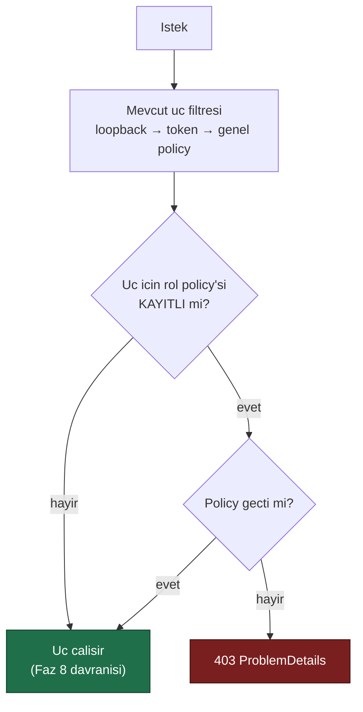
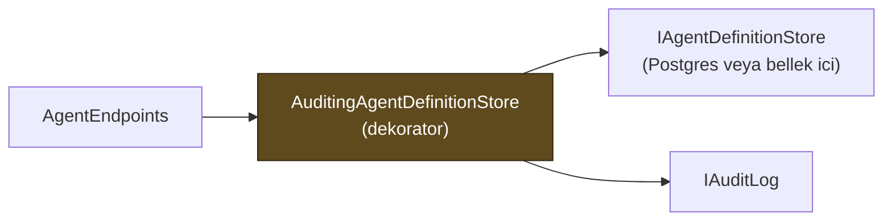

# Faz 9 — Yönetişim: Rol Tabanlı Yetkilendirme ve Denetim İzi

> **Durum:** 📋 Planlandı
> **Kaynak:** [BEYIN-FIRTINASI.md](BEYIN-FIRTINASI.md) · **F-21**, **F-20**
> **Önkoşul:** Yok
> **Sonrasında mümkün olan:** [Faz 11](11-SKILL-SCRIPT-CALISTIRMA.md) — script çalıştırma bu fazsız yapılamaz
> **Paketler:** `AgentPrism.Abstractions`, `.Core`, `.PostgreSql`, `.AspNetCore`, `.UI`
> **Yeni paket:** Yok · **Migration:** Yok (`audit_log` tablosu 0001'de kuruldu)

---

## Bu Faza Başlarken

1. [`MIMARI.md`](MIMARI.md) — bölüm 7 (güvenlik modeli), bölüm 5 (`audit_log`)
2. [`KARARLAR.md`](KARARLAR.md) — **K-010** (üç katmanlı erişim), **K-042** (iki `MapGroup`), **K-046** (arayüz kabuğu muafiyeti), **K-012** (tool'lar yalnız kodda)
3. [`04-HTTP-API.md`](04-HTTP-API.md) — uç listesi ve güvenlik filtresi
4. [`06-GOZLEMLENEBILIRLIK.md`](06-GOZLEMLENEBILIRLIK.md) — kiracı çözümleme
5. Bu doküman

---

## Amaç

Bugün erişim **ikilidir**: kapıdan giren her şeyi yapar. Aynı token'a sahip biri
hem bir çalıştırmayı okuyabilir hem de bir MCP sunucusu ekleyip onay verebilir.
`audit_log` tablosu Faz 0'da kuruldu ve **hâlâ boştur** — kimin ne değiştirdiği
hiçbir yerde yazmıyor.

Bu faz iki şeyi getirir ve **birlikte** getirmelidir: rol ayrımı olmadan denetim
izi "herkes her şeyi yapabilir, ama yazıyoruz" demektir; denetim izi olmadan rol
ayrımı ihlal edildiğinde kanıt bırakmaz.

---

## Bugün Ne Var

```
audit_log (0001_initial.sql, satir 229)
    id         uuid        PK
    tenant_id  text        NOT NULL
    actor      text                     ← NULL, hic yazilmiyor
    action     text        NOT NULL
    entity     text        NOT NULL
    before     jsonb
    after      jsonb
    created_at timestamptz NOT NULL
INDEX audit_log_tenant_created_idx (tenant_id, created_at DESC)
```

Şema **yeterlidir**. Migration gerekmez. Eksik olan tek şey yazan koddur.

Erişim katmanları (`AgentPrismEndpointFilter`): loopback → bearer token →
authorization policy. Üçü de **tüm** korumalı uçlara aynı şekilde uygulanır.

---

## 9.1 — Rol Modeli

Üç rol. Daha fazlası kurumsal gereksinimden önce karmaşıklık üretir.

| Rol | Yapabildiği | Yapamadığı |
|-----|-------------|------------|
| **Reader** | Agent, çalıştırma, oturum, trace, istatistik **okuma** | Çalıştırma başlatmak dâhil her yazma |
| **Operator** | Reader + çalıştırma başlatma, onay verme, oturum silme | Agent tanımı yazma, MCP sunucusu ekleme, onay kuralı silme |
| **Admin** | Hepsi | — |

**AgentPrism kullanıcı veya rol saklamaz.** Roller tüketicinin kimlik sisteminden
gelir. AgentPrism yalnız **policy adı** tanımlar; tüketici bunları kendi
claim'lerine bağlar:

```csharp
builder.Services.AddAuthorization(options =>
{
    options.AddPolicy(AgentPrismPolicies.Reader,   p => p.RequireRole("agentprism-reader",
                                                                     "agentprism-operator",
                                                                     "agentprism-admin"));
    options.AddPolicy(AgentPrismPolicies.Operator, p => p.RequireRole("agentprism-operator",
                                                                     "agentprism-admin"));
    options.AddPolicy(AgentPrismPolicies.Admin,    p => p.RequireRole("agentprism-admin"));
});

app.MapAgentPrism("/agentprism");   // policy'ler otomatik baglanir
```

```csharp
public static class AgentPrismPolicies
{
    public const string Reader   = "AgentPrism.Reader";
    public const string Operator = "AgentPrism.Operator";
    public const string Admin    = "AgentPrism.Admin";
}
```

### Geriye uyum kuralı — kritik

Bir policy **kayıtlı değilse** o uç eski davranışına döner (yalnız mevcut üç
katman). Aksi hâlde bu faz, güncelleyen herkesin kurulumunu `403` ile kırardı.



> `AgentPrismEndpointOptions.RequireRolePolicies = true` verilirse policy eksikse
> uygulama **açılışta** hata verir. Üretim kurulumu bunu açmalıdır; sessizce
> açık kalmış bir kapı, kapalı sanılan bir kapıdan kötüdür.

### Uç → rol haritası

| Uç grubu | Rol |
|----------|-----|
| `GET /api/agents`, `/runs`, `/sessions`, `/tools`, `/models`, `/models/health*`, `/stats`, `/runs/{id}/trace` | Reader |
| `POST /api/agents/{name}/run`, `/v1/*` | Operator |
| `DELETE /api/sessions/{id}` | Operator |
| Onay kararı (`approvals` gövdesi ile çalıştırma) | Operator |
| `PUT/DELETE /api/agents/{name}`, sürüm geri alma | Admin |
| `PUT/DELETE /api/mcp-servers/*`, `POST /api/mcp-servers/refresh` | Admin |
| `GET/DELETE /api/approvals/rules` | Admin |
| `PUT/DELETE /api/tenants/*` | Admin |
| `GET /api/meta` | Rol yok (K-042) |
| Arayüz kabuğu | Rol yok (K-046) |

> 🚨 **MCP sunucusu ekleme ve onay kuralı silme ayrı policy'lerdir** — beyin
> fırtınası belgesinin açık talebi. İkisi de Admin'dir; Operator bir çağrıyı
> onaylayabilir ama "bir daha sorma" kuralını **silemez**.

---

## 9.2 — Denetim İzi

### Sözleşme

```csharp
namespace AgentPrism;

public sealed record AuditEntry
{
    public Guid Id { get; init; }
    public required string TenantId { get; init; }
    public string? Actor { get; init; }              // claim'den; yoksa null
    public required string Action { get; init; }     // "agent.update"
    public required string Entity { get; init; }     // "agent:support"
    public string? Before { get; init; }             // JSON metni, SIR TASIMAZ
    public string? After { get; init; }
    public DateTimeOffset CreatedAt { get; init; }
}

public interface IAuditLog
{
    ValueTask WriteAsync(AuditEntry entry, CancellationToken ct = default);
    ValueTask<IReadOnlyList<AuditEntry>> QueryAsync(AuditQuery query, CancellationToken ct = default);
}

public sealed record AuditQuery
{
    public string? TenantId { get; init; }
    public string? Actor { get; init; }
    public string? Action { get; init; }
    public string? Entity { get; init; }
    public DateTimeOffset? After { get; init; }
    public DateTimeOffset? Before { get; init; }
    public int Limit { get; init; } = 100;
}
```

Uygulamalar: `InMemoryAuditLog` (Core) ve `PostgresAuditLog` (PostgreSql).
Sözleşme testi `tests/AgentPrism.PostgreSql.IntegrationTests/Contracts/AuditLogContract.cs`
ikisinde de koşar — Faz 2'de kurulan desen.

### Kaydedilecek eylemler

| Action | Entity | Ne zaman |
|--------|--------|----------|
| `agent.create` / `agent.update` / `agent.delete` | `agent:{name}` | Tanım deposu yazımı |
| `agent.rollback` | `agent:{name}` | Sürüm geri alma (`before`/`after` = sürüm no) |
| `mcp.create` / `mcp.update` / `mcp.delete` | `mcp:{name}` | MCP sunucu kaydı |
| `mcp.refresh` | `mcp:*` | Elle tazeleme |
| `approval.decision` | `tool:{toolName}` | Onay verildi/reddedildi (`after` = karar + gerekçe) |
| `approval.rule.create` / `.delete` | `rule:{id}` | "Bir daha sorma" kuralı |
| `tenant.create` / `.delete` | `tenant:{slug}` | Kiracı kaydı |
| `session.delete` | `session:{id}` | Oturum silme |

**Çalıştırma başlatma denetim izine yazılmaz.** `runs` tablosu zaten tam kaydı
tutar; ikinci kez yazmak `audit_log`'u en hacimli tabloya çevirir ve okunmaz
hâle getirir.

### Nasıl yazılır

Yazma **uç katmanında** değil, **depo dekoratöründe** yapılır:



Gerekçe: uçta yazmak, aynı depoya başka bir kod yolundan (ör. Faz 17'nin toplu
işleri) yapılan değişikliği kaçırır. Dekoratör tek kapıdır — Faz 6'da tool onayı
için `ToolRegistry` neden tek kapıysa aynı gerekçe.

### İki değişmez kural

1. **Denetim izi sır taşımaz.** `before`/`after` yazılmadan önce süzgeçten
   geçer: `apiKey`, `authorization`, `token`, `password`, `secret` anahtarları
   `"***"` ile değiştirilir. `McpServerDefinition` zaten sır taşımaz (K-059) ama
   süzgeç yine de uygulanır — sonraki bir tip taşıyabilir.
2. **Denetim izi hatası işlemi kesmez.** `IAuditLog.WriteAsync` hata verirse
   loglanır ve işlem devam eder. Faz 6'nın "gözlemlenebilirlik işlevselliği
   bozmaz" kuralının aynısı.

> ⚠️ **Bu kuralın istisnası Faz 11'dir.** Script çalıştırmada denetim izi
> yazılamıyorsa çalıştırma **reddedilir**. Orada denetim izi bir kayıt değil, bir
> güvenlik kontrolüdür. Faz 11 bunu `IAuditLog` üzerinden değil, ayrı bir
> `RequireAudit` bayrağıyla ister.

### Aktör kim?

`IAuditActorResolver` — varsayılan uygulama `HttpContext.User`'dan okur:
`ClaimTypes.NameIdentifier` → `ClaimTypes.Name` → `sub` → `null`.
Yapılandırılabilir claim adı (`AgentPrismAuditOptions.ActorClaimType`).
Kimlik doğrulaması yoksa aktör `null`'dur ve bu **gizlenmez**; arayüz
"bilinmiyor" gösterir.

---

## Yeni HTTP Uçları

| Uç | Rol | Ne döner |
|----|-----|----------|
| `GET {prefix}/api/audit` | Admin | Filtrelenebilir denetim kayıtları (`actor`, `action`, `entity`, tarih aralığı, `limit`) |
| `GET {prefix}/api/audit/{entity}` | Admin | Tek varlığın geçmişi, zaman sırasına göre |

Denetim izi **yalnız okunur**. Silme veya düzeltme ucu yoktur ve olmayacaktır —
saklama politikası Faz 25'in işidir.

---

## Arayüz

- Yeni ekran: **Audit** (`frontend/src/screens/audit.tsx`) — tablo, filtre,
  `before`/`after` farkı için basit bir JSON gösterimi
- Agent detay ekranına "Bu agent'ın değişiklik geçmişi" bölümü
- Kullanıcının rolü `/api/meta` yanıtından okunur; yetkisi olmayan düğmeler
  **gizlenir** (gösterip 403 almak kötü deneyimdir)
- Sunucu tarafı yetkilendirme yine de tek gerçektir; arayüz gizlemesi bir
  güvenlik önlemi **değildir**

Bundle hedefi: **+6 KB gzip'ten az**. Diff için kütüphane alınmaz; Faz 19 gerçek
bir diff görünümü getirecek.

---

## Testler

| Proje | Yeni test |
|-------|-----------|
| `AgentPrism.Core.UnitTests` | Sır süzgeci; aktör çözümleme; denetim hatasının işlemi kesmemesi; dekoratörün her yazma yolunda çalışması |
| `AgentPrism.PostgreSql.IntegrationTests` | `AuditLogContract` — bellek içi ve Postgres aynı davranış; kiracı yalıtımı; filtre ve sıralama |
| `AgentPrism.AspNetCore.FunctionalTests` | Rol matrisi (üç rol × uç grupları); **policy kayıtlı değilken eski davranış**; `RequireRolePolicies=true` ile açılış hatası; `/api/audit` Reader'a `403` |
| `AgentPrism.Ui.E2ETests` | Audit ekranı listeler; Reader rolünde yazma düğmeleri görünmez |

---

## Bu Fazda Verilecek Kararlar

1. **Üç rol, daha fazlası değil** — dört ve üzeri rol, kullanıcıdan gelen somut
   bir gereksinim olmadan yapılandırma yükü üretir.
2. **AgentPrism rol saklamaz** — kimlik tüketicinin sistemindedir; rol tablosu
   eklemek AgentPrism'i bir kimlik sağlayıcısına dönüştürürdü.
3. **Policy yoksa eski davranış** — aksi hâlde sürüm yükseltmesi çalışan
   kurulumları kırardı.
4. **Denetim izi depo dekoratöründe yazılır, uçta değil** — tek kapı kuralı.
5. **Çalıştırmalar denetim izine yazılmaz** — `runs` tablosu zaten kayıttır.

---

## Açık Sorular

1. **Operator onay verebilmeli mi?** Yukarıdaki tablo "evet" diyor. "Hayır"
   denirse geri alınamaz tool'lar yalnız Admin ile çalışır ve operasyon yavaşlar.
   Öneri: **evet**.
2. **`RequireRolePolicies` varsayılanı?** `false` geriye uyumludur ama güvenli
   varsayılan değildir. Öneri: **`false`**, README'de üretim için `true` önerisi.
3. **Denetim izinde `before`/`after` tam tanım mı, yalnız değişen alanlar mı?**
   Tam tanım basittir ve `agent_definition_versions` ile tutarlıdır; hacmi
   büyütür. Öneri: **tam tanım**, Faz 25 saklama politikasını çözer.

---

## Bitiş Ölçütleri (DoD)

- [ ] Üç policy tanımlı; uç → rol haritası uygulanmış ve testli
- [ ] Policy kaydedilmemiş bir uygulamada Faz 8 davranışı **birebir** korunuyor
- [ ] `audit_log` gerçekten doluyor — agent güncelleme, MCP ekleme ve onay
      kararının gerçek satırları dokümana yazılır
- [ ] Denetim kaydında hiçbir sır yok (test + gerçek çıktı)
- [ ] `GET /api/audit` filtreleri çalışıyor, kiracılar arası sızıntı yok
- [ ] Audit ekranı çalışıyor; rol tabanlı düğme gizleme çalışıyor
- [ ] `MIMARI.md` bölüm 7'deki "⚠️ `audit_log` hâlâ yazılmıyor" uyarısı **kalktı**
- [ ] Dört doğrulama kapısı sıfır uyarı; sır taraması boş

---

## Riskler

| Risk | Önlem |
|------|-------|
| Rol katmanı mevcut kurulumları kırar | Policy yoksa eski davranış; `RequireRolePolicies` isteğe bağlı |
| `audit_log` hızla büyür | Çalıştırmalar yazılmaz; saklama politikası Faz 25'te. Bu fazda yalnız indeks doğrulanır |
| Denetim yazımı yazma yolunu yavaşlatır | Aynı istekte eşzamanlı yazılır ama hata yutulur; ölçüm Faz 7 benchmark listesine eklenir |
| Sır süzgeci bir alanı kaçırır | Süzgeç anahtar adına göre çalışır ve testi vardır; yeni sır alanı ekleyen faz süzgeci güncellemekle yükümlüdür |

---

## Sonraki Faza Devir Notu

- **Faz 11 (script) bu fazın çıktısına bağlıdır.** Script çalıştırma yetkisi
  Admin'dir ve her çalıştırma denetim izine yazılır. `IAuditLog` orada
  "yazılamazsa reddet" modunda kullanılacaktır.
- Faz 19 (diff) Audit ekranındaki basit JSON gösterimini gerçek bir diff ile
  değiştirecektir; bu fazda diff kütüphanesi **alınmaz**.
- Faz 21 (kota) rol modelini genişletmez; kota kiracı bazlıdır, rol bazlı değil.
