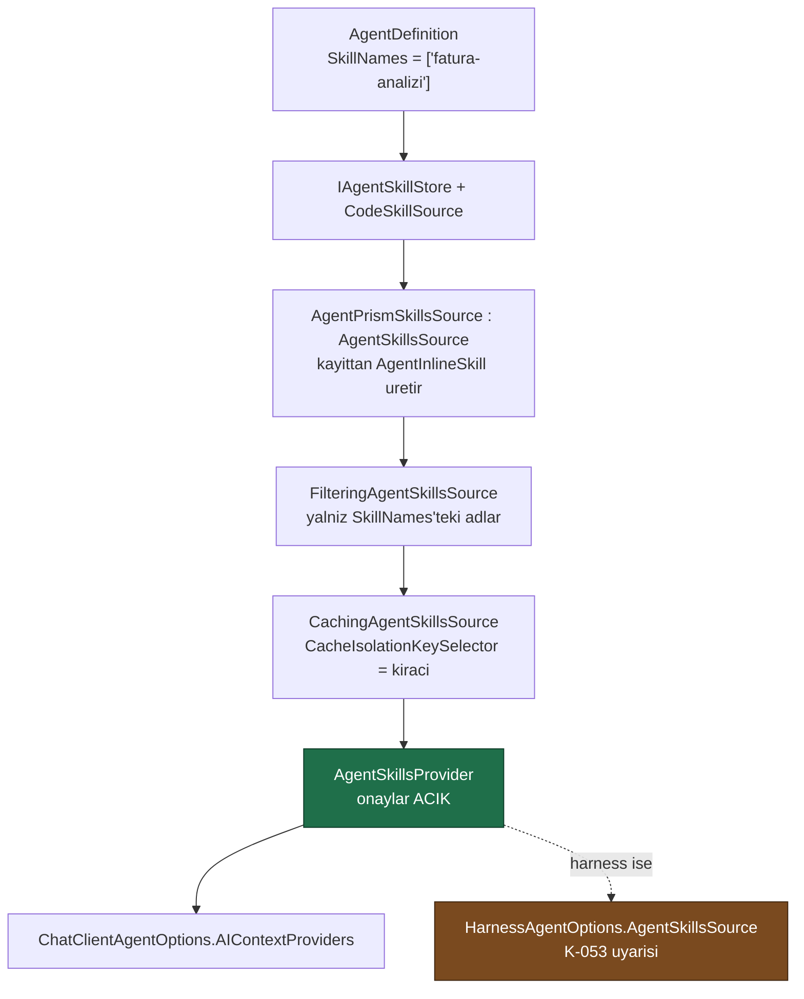

# Faz 10 — Agent Skill'leri (script'siz)

> **Durum:** 📋 Planlandı
> **Kaynak:** [BEYIN-FIRTINASI.md](BEYIN-FIRTINASI.md) · **F-09** (1/2)
> **Önkoşul:** [Faz 9](09-YONETISIM-VE-DENETIM-IZI.md) — denetim izi dekoratörü hazır olmalı
> **Sonraki:** [Faz 11](11-SKILL-SCRIPT-CALISTIRMA.md) — script çalıştırma
> **Paketler:** `AgentPrism.Abstractions`, `.Core`, `.PostgreSql`, `.AspNetCore`, `.UI`
> **Yeni paket:** Yok · **Migration:** 0003 (planlanan sırada)

---

## Bu Faza Başlarken

1. [`MIMARI.md`](MIMARI.md) — bölüm 3 (**K2 kuralı**), bölüm 4 (MAF genişleme noktaları)
2. [`KARARLAR.md`](KARARLAR.md) — **K-012** (tool'lar yalnız kodda), **K-053** (Harness + tool çağrısı **bozuk**), **K-058** (MCP'de stdio yok — aynı gerekçe burada da geçerli)
3. [`03-SAGLAYICI-VE-DERLEYICI.md`](03-SAGLAYICI-VE-DERLEYICI.md) — `AgentDefinitionCompiler`
4. Bu doküman
5. `.agents/skills/maf-api-kesfi/scripts/dump-api.sh '*Skill*'` — imzaları **yeniden** doğrulayın

---

## Amaç

Bir agent'a çalışma anında yüklenen, markdown tabanlı yetenek paketleri
verilebilsin. Claude Code'un skill mekanizmasının MAF karşılığıdır ve MAF 1.16.0
içinde **hazırdır**.

Bu faz **yalnız talimat ve kaynak** taşıyan skill'leri destekler. Script
çalıştırma Faz 11'dir ve ayrı bir güvenlik kararıdır.

---

## Doğrulanmış MAF API'si

Reflection ile çıkarıldı (`Microsoft.Agents.AI` 1.16.0, 2026-08-02). **Tahmin
yok, ölçüm var.**

```csharp
// Skill'in kendisi
abstract class AgentSkill {
    ValueTask<string> GetContentAsync(CancellationToken ct);
    ValueTask<AgentSkillResource> GetResourceAsync(string name, CancellationToken ct);
    ValueTask<AgentSkillScript>   GetScriptAsync(string name, CancellationToken ct);
    AgentSkillFrontmatter Frontmatter { get; }
}

sealed class AgentSkillFrontmatter {
    AgentSkillFrontmatter(string name, string description, string compatibility);
    string Name { get; }  string Description { get; }
    string? Compatibility { get; set; }  string? License { get; set; }
    string? AllowedTools { get; set; }   AdditionalPropertiesDictionary? Metadata { get; set; }
    static bool ValidateName(string name, out string reason);          // KULLANIN
    static bool ValidateDescription(string description, out string reason);
    static bool ValidateCompatibility(string compatibility, out string reason);
}

sealed class AgentInlineSkill : AgentSkill {                            // BU FAZIN TIPI
    AgentInlineSkill(AgentSkillFrontmatter frontmatter, string instructions,
                     JsonSerializerOptions? serializerOptions,
                     Func<JsonElement?, AIFunctionArguments>? argumentMarshaler);
    AgentInlineSkill AddResource(string name, object value, string? description);
    AgentInlineSkill AddScript(string name, Delegate method, ...);      // BU FAZDA CAGRILMAZ
}

// Kaynak zinciri
abstract class AgentSkillsSource { Task<IList<AgentSkill>> GetSkillsAsync(AgentSkillsSourceContext ctx, CancellationToken ct); }
sealed class AgentSkillsSourceContext { AIAgent Agent { get; } AgentSession Session { get; } }
sealed class AgentInMemorySkillsSource(IEnumerable<AgentSkill> skills);
sealed class CachingAgentSkillsSource(AgentSkillsSource inner, CachingAgentSkillsSourceOptions options);
sealed class CachingAgentSkillsSourceOptions {
    Func<AgentSkillsSourceContext, string>? CacheIsolationKeySelector { get; set; }   // → KIRACI
    TimeSpan? RefreshInterval { get; set; }
}
sealed class FilteringAgentSkillsSource · DeduplicatingAgentSkillsSource · AggregatingAgentSkillsSource

// Agent'a baglanma — IKI YOL
sealed class AgentSkillsProvider : AIContextProvider {
    AgentSkillsProvider(AgentSkillsSource source, AgentSkillsProviderOptions? options,
                        ILoggerFactory? lf, bool ownsSource);
}
sealed class AgentSkillsProviderOptions {
    bool DisableLoadSkillApproval          { get; set; }   // VARSAYILAN false = ONAY ISTENIR
    bool DisableReadSkillResourceApproval  { get; set; }   // VARSAYILAN false
    bool DisableRunSkillScriptApproval     { get; set; }   // VARSAYILAN false
    bool IncludeDetailedErrors             { get; set; }
    string? SkillsInstructionPrompt        { get; set; }
}

ChatClientAgentOptions.AIContextProviders   // duz agent bu yoldan alir
HarnessAgentOptions.AgentSkillsSource       // harness bu yoldan alir
HarnessAgentOptions.DisableAgentSkillsProvider
```

### 🚨 Üç kritik bulgu

1. **Onay mekanizması hazır ve varsayılan olarak AÇIK.** `Disable*Approval`
   alanlarının varsayılanı `false`'tur; yani skill yükleme ve kaynak okuma
   Faz 6'nın onay akışından geçer. **Bu bayraklar açılmaz.** Skill yüklemek
   agent'ın talimatını çalışma anında değiştirmektir — onaya değer.
2. **Düz `ChatClientAgent` de skill alabilir.** `AIContextProviders` alanı
   `ChatClientAgentOptions` üzerinde vardır; harness zorunlu değildir.
3. **K-053 burada ısırır.** `Microsoft.Agents.AI.Harness` + tool çağrısı
   zinciri bozuktur (ölçüldü, Faz 6). Skill yükleme bir **tool çağrısıdır**.
   Bu yüzden bu faz skill'leri **öncelikle `AIContextProviders` üzerinden**
   bağlar; harness yolu da bağlanır ama K-053 uyarısıyla ve testi
   `Skipped` değil, **bilinen kusur** olarak belgelenir.

---

## 10.1 — Veri Modeli (Migration 0003)

```sql
CREATE TABLE {schema}.agent_skills (
    id            uuid        NOT NULL PRIMARY KEY,
    tenant_id     text        NOT NULL,
    name          text        NOT NULL,
    description   text        NOT NULL,
    instructions  text        NOT NULL,        -- markdown govde
    compatibility text,
    license       text,
    allowed_tools text,                        -- MAF frontmatter alani
    metadata      jsonb       NOT NULL DEFAULT '{}'::jsonb,
    enabled       boolean     NOT NULL DEFAULT true,
    version       integer     NOT NULL DEFAULT 1,
    created_at    timestamptz NOT NULL,
    updated_at    timestamptz NOT NULL,
    CONSTRAINT agent_skills_tenant_name_uq UNIQUE (tenant_id, name)
);

CREATE TABLE {schema}.agent_skill_resources (
    id          uuid        NOT NULL PRIMARY KEY,
    skill_id    uuid        NOT NULL REFERENCES {schema}.agent_skills (id) ON DELETE CASCADE,
    name        text        NOT NULL,
    description text,
    media_type  text        NOT NULL DEFAULT 'text/plain',
    content     text        NOT NULL,
    created_at  timestamptz NOT NULL,
    CONSTRAINT agent_skill_resources_skill_name_uq UNIQUE (skill_id, name)
);
```

`instructions` ve `content` **`text`**, `json` değil — bunlar markdown'dır.
`metadata` sorgulanabilir olduğu için `jsonb` (K-027 ile uyumlu).

Skill'in bir agent'a bağlanması `agent_definitions.definition` içindeki yeni
`SkillNames` alanıyla olur; ayrı bir bağlantı tablosu **yoktur**. Gerekçe: agent
tanımı zaten sürümlenir (`agent_definition_versions`) ve skill listesi tanımın
bir parçasıysa geri alma da doğru çalışır.

---

## 10.2 — Public API

```csharp
namespace AgentPrism;

public sealed record AgentSkillDefinition
{
    public Guid Id { get; init; }
    public required string TenantId { get; init; }
    public required string Name { get; init; }
    public required string Description { get; init; }
    public required string Instructions { get; init; }
    public string? Compatibility { get; init; }
    public string? License { get; init; }
    public string? AllowedTools { get; init; }
    public IReadOnlyDictionary<string, JsonElement> Metadata { get; init; }
    public bool Enabled { get; init; } = true;
    public int Version { get; init; } = 1;
    public IReadOnlyList<AgentSkillResourceDefinition> Resources { get; init; } = [];
    public DateTimeOffset CreatedAt { get; init; }
    public DateTimeOffset UpdatedAt { get; init; }
}

public sealed record AgentSkillResourceDefinition
{
    public required string Name { get; init; }
    public string? Description { get; init; }
    public string MediaType { get; init; } = "text/plain";
    public required string Content { get; init; }
}

public interface IAgentSkillStore
{
    ValueTask<IReadOnlyList<AgentSkillDefinition>> ListAsync(string tenantId, CancellationToken ct = default);
    ValueTask<AgentSkillDefinition?> GetAsync(string tenantId, string name, CancellationToken ct = default);
    ValueTask<AgentSkillDefinition> SaveAsync(AgentSkillDefinition skill, CancellationToken ct = default);
    ValueTask<bool> DeleteAsync(string tenantId, string name, CancellationToken ct = default);
}

// AgentDefinition genisler
public sealed record AgentDefinition
{
    // ...mevcut uyeler
    public IReadOnlyList<string> SkillNames { get; init; } = [];
}
```

Ayrıca kodda skill tanımlama yolu (K1 — veritabanısız çalışma):

```csharp
builder.AddAgentPrism()
       .AddSkill(new AgentSkillDefinition { Name = "fatura-analizi", ... });
```

Kodda tanımlı skill'ler `CodeSkillSource`'tan gelir ve **ad çakışmasında
kazanır** — K-003'ün agent'lar için kurduğu kuralın aynısı.

---

## 10.3 — Derleyiciye Bağlanma



Kurallar:

- **Bilinmeyen skill adı derleme hatasıdır.** `AgentPrismCompilationException`
  atılır — bilinmeyen tool adı ve bilinmeyen sağlayıcı ile aynı davranış.
- **`enabled = false` skill listede görünür ama derlemeye girmez.** Silmeden
  kapatmak, bir skill'in yan etkisini test etmenin en hızlı yoludur.
- **Önbellek kiracı bazlıdır.** `CacheIsolationKeySelector` `ITenantContext`
  değerini döndürür. Bu satır yazılmazsa bir kiracının skill'i diğerine sızar —
  Faz 6'nın MCP önbelleğinde aynı tuzağa düşülmüştü, oradaki çözüm örnektir
  (`McpToolCatalog._byTenant`).
- **Derlenmiş agent önbelleği (`CompiledAgentCache`) skill değişiminde
  geçersizleşmelidir.** Bugün anahtar `(name, version)`. Skill içeriği değişince
  agent sürümü değişmez. Çözüm: agent tanımının sürümüne ek olarak bağlı
  skill'lerin `UpdatedAt` damgalarından türetilen bir parmak izi anahtara girer.
  **Bu atlanırsa skill düzenlemesi çalışan sürece hiç yansımaz.**

---

## 10.4 — HTTP Uçları

| Uç | Rol (Faz 9) | Ne yapar |
|----|-------------|----------|
| `GET {prefix}/api/skills` | Reader | Kiracının skill listesi |
| `GET {prefix}/api/skills/{name}` | Reader | Tek skill + kaynakları |
| `PUT {prefix}/api/skills/{name}` | Admin | Oluştur/güncelle |
| `DELETE {prefix}/api/skills/{name}` | Admin | Sil |

Doğrulama `AgentSkillFrontmatter.ValidateName/ValidateDescription/ValidateCompatibility`
ile yapılır — kendi kurallarımızı uydurmayız, MAF'ın kabul ettiği biçimi
kullanırız. Geçersiz ad `400` + hata gerekçesi döner.

Boyut sınırı: `instructions` en çok 64 KB, kaynak içeriği en çok 256 KB, skill
başına en çok 20 kaynak. Sınırlar `AgentPrismSkillOptions` ile ayarlanır.
Gerekçe: skill içeriği her çalıştırmada bağlama girer; sınırsız metin, sınırsız
token demektir.

---

## 10.5 — Arayüz

Yeni ekran: **Skills** (`frontend/src/screens/skills.tsx`)

- Liste: ad, açıklama, kaynak sayısı, durum, son güncelleme
- Düzenleyici: frontmatter alanları + markdown gövde (`<textarea>`, önizleme yok)
- Kaynak ekleme/çıkarma
- Agent düzenleyicisine (`agent-editor.tsx`) skill seçici eklenir
- Playground'da bir skill yüklendiğinde transcript'te **onay kartı** görünür —
  Faz 6'nın onay kartı yeniden kullanılır, yeni bileşen yazılmaz

> Markdown **render edilmez**. Bir markdown kütüphanesi 15–40 KB gzip ekler ve
> düzenleyici için gerekli değildir. Bütçe hedefi: **+8 KB gzip'ten az**.

---

## Testler

| Proje | Yeni test |
|-------|-----------|
| `AgentPrism.Core.UnitTests` | Kayıt → `AgentInlineSkill` dönüşümü; frontmatter doğrulama; bilinmeyen skill adında derleme hatası; `enabled=false` derlemeye girmez; **önbellek parmak izi** skill güncellenince değişir; kodda tanımlı skill kazanır |
| `AgentPrism.PostgreSql.IntegrationTests` | `AgentSkillStoreContract` (bellek içi + Postgres); kaynak cascade silme; kiracı yalıtımı |
| `AgentPrism.AspNetCore.FunctionalTests` | CRUD uçları; boyut sınırları; rol matrisi; geçersiz ad `400` |
| `AgentPrism.Ui.E2ETests` | Skill oluşturma → agent'a bağlama → Playground'da onay kartı |

**Gerçek model ile doğrulama zorunludur:** skill'i olan bir agent çalıştırılır ve
modelin skill'i yüklediği, talimatın bağlama girdiği transcript'ten gösterilir.
Birim testi bunu kanıtlamaz.

---

## Bu Fazda Verilecek Kararlar

1. **Skill onayları kapatılmaz** (`Disable*Approval` hep `false`) — skill
   yükleme, agent'ın talimatını çalışma anında değiştirmektir.
2. **Skill → agent bağlantısı `AgentDefinition.SkillNames` içinde** — ayrı
   bağlantı tablosu sürüm geri almayı bozardı.
3. **Bu fazda `AgentFileSkill` kullanılmaz** — dosya kaynağı script çalıştırıcı
   ister; o Faz 11'dir.
4. **Önbellek anahtarına skill parmak izi eklendi** — aksi hâlde düzenleme
   çalışan sürece yansımaz.
5. **Markdown arayüzde render edilmez** — bundle bütçesi.

---

## Açık Sorular

1. **Skill'ler sürümlensin mi?** Agent tanımları sürümlü
   (`agent_definition_versions`). Skill'ler için aynısı yapılabilir ama ikinci
   bir sürüm mekanizması bakım maliyetidir. Öneri: **hayır** — değişiklik
   denetim izine yazılır (Faz 9), geri alma Faz 19'da ele alınır.
2. **`AllowedTools` frontmatter alanı zorlanacak mı?** MAF bu alanı taşıyor ama
   zorlayan bizim kodumuz olur: skill yüklendiğinde agent'ın tool listesi
   daraltılsın mı? Öneri: **bu fazda yalnız saklanır**, zorlama Faz 11'de
   script'lerle birlikte gelir.
3. **Bir agent en çok kaç skill taşıyabilir?** Sınırsız bırakmak bağlam
   penceresini sessizce tüketir. Öneri: **varsayılan 10**, ayarlanabilir.

---

## Bitiş Ölçütleri (DoD)

- [ ] Arayüzden skill oluşturulur, bir agent'a bağlanır
- [ ] Gerçek bir model çalıştırmasında skill yükleme **onay ister** ve onaydan
      sonra talimat bağlama girer (transcript çıktısı dokümana yazılır)
- [ ] Skill düzenlenince **yeni içerik** bir sonraki çalıştırmada görünür
      (önbellek parmak izi kanıtı)
- [ ] İki kiracı senaryosunda skill sızıntısı yok
- [ ] Kaynak okuma onay isteği üretiyor ve içerik dönüyor
- [ ] Harness yolunda K-053 davranışı **belgelendi** (gizlenmedi)
- [ ] Dört doğrulama kapısı sıfır uyarı; bundle ölçüldü

---

## Riskler

| Risk | Önlem |
|------|-------|
| K-053 harness kusuru skill akışını da bozar | Öncelik `AIContextProviders` yolunda; harness yolu belgelenir |
| Skill içeriği bağlam penceresini şişirir | Boyut ve adet sınırları; Faz 13 (sıkıştırma) bunu tamamlar |
| MAF skill API'si "evaluation" işaretli olabilir | Uygulamadan önce `dump-api.sh` ile tanı kontrol edilir; `MAAI001` çıkarsa bastırma **tek dosyada** ve gerekçeli |
| Skill adı MAF doğrulamasından geçmez | `ValidateName` uçta çağrılır, çalışma anında değil |

---

## Sonraki Faza Devir Notu

- Faz 11 bu fazın `AgentSkillsSource` zincirine **script'li bir kaynak** ekler.
  Zincir bu yüzden `AggregatingAgentSkillsSource` ile kurulmalıdır; tek kaynak
  varsayımı yapmayın.
- `AgentSkillsProviderOptions.DisableRunSkillScriptApproval` alanı Faz 11'in
  konusudur ve **yine `false` kalacaktır**.
- Boyut sınırlarını taşıyan `AgentPrismSkillOptions` Faz 11'de script sınırları
  (zaman aşımı, çıktı boyutu) ile genişler.
