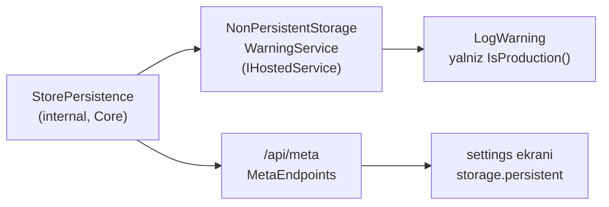

# Faz 104 — Beyan Doğruluğu ve Giriş Rampası

> **Durum:** ✅ Tamamlandı (2026-08-25)
> **Kaynak:** [`kesif/2026-08-23-yapisal-sorun-envanteri.md`](kesif/2026-08-23-yapisal-sorun-envanteri.md) — **kalem 14** (Blok C'den öne çekildi, kullanıcı kararı 👤) · **kalem 12** ve **kalem 23** (Blok B). `ADAYLAR.md`'de F-NN karşılığı yoktur; bu kalemler keşif turundan gelir
> **Önkoşul:** Yok
> **Paketler:** `AgentPrism.Core` (uyarı servisi + kalıcılık yargısının tek kaynağı) · `AgentPrism.AspNetCore` (yalnız `/api/meta` o tek kaynağa bağlanır)
> **Yeni paket:** Yok — `Microsoft.Extensions.Hosting.Abstractions` `Core`'un mevcut bağımlılığıdır ([`AgentPrism.Core.csproj:93`](../src/AgentPrism.Core/AgentPrism.Core.csproj)) · **Migration:** Yok
> **Public API:** **Büyümüyor.** Uyarı servisi `internal`, kalıcılık yardımcısı `internal`. Değişen tek şey mevcut bir tipin XML doküman metnidir. `EnablePublicApiTracking` açıktır (K-421) ve `PublicAPI.Shipped.txt` dosyalarının hepsi boştur — uygulayan oturum bunu `wc -l src/*/PublicAPI.Shipped.txt` ile ölçüp doğrular
> **Tüketici yüzeyi:** site — [`guides/production.md`](../docs-site/src/content/docs/guides/production.md) (ölçekleme bölümüne hız sınırı kapsamı), [`concepts/governance.md`](../docs-site/src/content/docs/concepts/governance.md) (kiracı yalıtımının nerede zorlandığı), `api/AgentPrism.AgentPrismRateLimitOptions.md` (**üretilir** — iş XML dokümanındadır) · sevk edilen — `AgentPrismRateLimitOptions` XML dokümanı. Kök `CONTRIBUTING.md` ve `ARCHITECTURE.md` **pakete girmez**, depoya gelen katkıcıya dönüktür
> **Manuel test alanı:** [`manuel-test/25-SAGLIK-TESHIS-OPENAPI.md`](manuel-test/25-SAGLIK-TESHIS-OPENAPI.md) (§104.3 uyarısı) · [`manuel-test/31-DOKUMAN-DOGRULUGU.md`](manuel-test/31-DOKUMAN-DOGRULUGU.md) (§104.1 · §104.2 · §104.4 beyanları)

---

## Bu Faza Başlarken

> `faz-baslangic` skill'ini uygula. Aşağıdaki liste o skill'in 2. adımıdır —
> **tamamını değil, yalnız işaret edilen bölümleri oku.**

1. Bu doküman
2. Kararlar — dosyanın tamamını **okuma**, yalnız bu kalemleri grep'le:
   ```bash
   grep -n "K-421\|K-483\|K-186\|K-317\|K-176" docs/KARARLAR.md
   ```
   **K-421** (public API takibi açık, `Shipped.txt` boş) · **K-483** (🚨 elle
   tekrarlanan ifade bir kusur **sınıfı** üretir — §104.3'ün tek kaynak kuralının
   sebebi budur) · **K-186** ve **K-317** (gerçek `mssql/server` yerelde hâlâ
   koşturulamadı — §104.1'in RLS gerekçesinde geçer) · **K-176** (`Sql.Shared`
   ayrı bir assembly değildir)
3. [`arsiv/fazlar/103-EXTENSION-SOZLESMELERININ-YAYIN-ONCESI-SERTLESTIRILMESI.md`](arsiv/fazlar/103-EXTENSION-SOZLESMELERININ-YAYIN-ONCESI-SERTLESTIRILMESI.md)
   — yalnız devir notunun **🚨 tuzaklar** bölümü:
   ```bash
   awk '/## Sonraki Faza Devir Notu/,0' docs/arsiv/fazlar/103-*.md
   ```
   Bu faz yeni bir sözleşme devralmaz. Gereken şey iki koşum tuzağıdır: merkezi
   `ArtifactsPath` ve tam solution koşumundaki flaky test çifti.
4. Alan hafızası (bu faz iki alana dokunuyor):
   [`hafiza/aspnetcore-di.md`](hafiza/aspnetcore-di.md) (`IHostedService` kaydı ve
   `TryAdd*` sırası) · [`hafiza/dokumantasyon.md`](hafiza/dokumantasyon.md)
   (`docs/` ile `docs-site/` sınırı, dil kapısının kapsamı, site yayın hattı)
5. Gerektiğinde, tamamı değil ilgili bölümü:
   [`MIMARI-GUVENLIK.md`](MIMARI-GUVENLIK.md) **§Çok kiracılılık ve tool onayı**
   (satır 72) — §104.1 buraya yazacaktır

---

## Amaç

Bu faz **kod yeteneği eklemez**. Üç yerde, sistemin kendisi hakkında söylediği
ile gerçeği arasındaki farkı kapatır: kiracı yalıtımının **hangi katmanda**
durduğu bir karar olarak kaydedilir, hız sınırının çok örnekli kurulumdaki
kapsamı eksiksiz beyan edilir, ve `Production` ortamında kalıcı olmayan bir
store ile kalkan kurulum bunu **sunucu tarafında** söyler. Dördüncü iş depoya
dışarıdan gelen kişi içindir: bugün giriş rampası yoktur.

- **Kalem 14** — RLS kararı kaydedilir (👤 karar: uygulama katmanı tek hat
  kalır); hız sınırının kapsam beyanı tamamlanır. RLS **uygulaması** ve dağıtık
  hız sınırı kapsam dışıdır.
- **Kalem 12** — `Production` + kalıcı olmayan store için başlangıçta uyarı
  log'u (👤 karar: yalnız uyarı; hata fırlatılmaz).
- **Kalem 23** — `CONTRIBUTING.md` + kökte İngilizce `ARCHITECTURE.md`
  (👤 karar).

Üç kalem tek fazda birleşiyor. `faz-planlama` iki kalemi sınır sayar; bu sapma
bilinçlidir ve gerekçesi ortak eksendir: **kurulum ve depo kendi gerçeğini
söyler.** Üçünün DoD'si birbirinden bağımsız ölçülebilir, bu yüzden bulanıklık
riski yoktur.

### Bugün ne çalışmıyor — doğrulanmış kanıt

| Kanıt | Gözlem |
|---|---|
| `grep -rn "ROW LEVEL SECURITY" src/` → **0** | Kiracı yalıtımı tümüyle uygulama katmanındadır |
| `grep -rni "rls\|row level" docs/KARARLAR.md docs/MIMARI-GUVENLIK.md docs-site/` → **0** | Karar hiçbir yerde **kayıtlı değil**. Kalem 14'ün asıl boşluğu budur |
| [`TenantCoverageTests.cs:30-45`](../tests/AgentPrism.SqlServer.IntegrationTests/TenantCoverageTests.cs) | Kapı **vardır** (Faz 41): paylaşılan store katmanının her public metodu ya kiracı sözleşmesiyle test edilir ya gerekçeli muaftır; bayat girdi de hatadır |
| [`AgentPrismRateLimitOptions.cs:14-17`](../src/AgentPrism.Core/Quotas/AgentPrismRateLimitOptions.cs) | "lives in memory" der; **çok örnekli** kurulumdaki kapsamı yazmaz |
| [`InboundTriggerRateLimiter.cs:8-13`](../src/AgentPrism.Core/Triggers/InboundTriggerRateLimiter.cs) | Kardeş tip "PER INSTANCE" diye **açıkça yazar**. Beyan tutarsızdır, eksik olan taraf `AgentPrismRateLimitOptions`'tır |
| `grep -in "rate limit" docs-site/.../guides/production.md` → **0** | Üretim rehberi ölçeklemeyi anlatır, hız sınırının örnek başına olduğunu söylemez |
| [`guides/inbound-triggers.md:156-160`](../docs-site/src/content/docs/guides/inbound-triggers.md) | Site tetik limitini **zaten** doğru beyan ediyor — bu iş yeniden yapılmaz |
| `grep -rn "IsProduction" src/` → yalnız `JsonBindingProblemMiddleware` yorumu | Kalıcılık için ortam kontrolü **hiç yoktur** |
| [`MetaEndpoints.cs:40-43`](../src/AgentPrism.AspNetCore/Endpoints/MetaEndpoints.cs) | Kalıcılık yargısı (üç tip kontrolü + `Unwrap`) **tek yerdedir ve `AspNetCore`'dadır**; `Core` onu göremez |
| [`settings.tsx:129`](../src/AgentPrism.UI/frontend/src/screens/settings.tsx) · `settings.inMemoryNotice` | Arayüz zaten dürüsttür. Eksik olan **sunucu tarafı** sinyalidir |
| [`ToolRegistrationValidationService.cs`](../src/AgentPrism.Core/Tools/ToolRegistrationValidationService.cs) | Başlangıç doğrulaması için hazır desen: `Core` içinde `IHostedService`, `LogWarning` ve `AgentPrismException` birlikte kullanılır |
| `InMemoryRunStore` · `InMemorySessionStore` · `InMemoryAgentDefinitionStore` | Üçü de **`internal`** (Faz 96). `AspNetCore` onları `InternalsVisibleTo` ile görür |
| `ls CONTRIBUTING.md` → yok | Depo yayında görünür olacak; giriş rampası sıfırdır |
| [`SourceLanguageTests.cs:53`](../tests/AgentPrism.Core.UnitTests/Architecture/SourceLanguageTests.cs) | Dil kapısı yalnız `^(?:src\|packages)/[^/]+/README\.md$` tarar — **kök dosyalar kapsam dışıdır** |
| [`scripts/dokuman-bakim.py:109`](../scripts/dokuman-bakim.py) | Kök `README.md` bütçelidir (20 KB); yeni kök dosyaların bütçe girdisi yoktur |

> Kanıtlar 2026-08-25 tarihinde doğrulandı.

---

## 104.1 — Kiracı yalıtım modelinin kararı ve beyanı

**Karar (👤 kullanıcı, 2026-08-25):** kiracı yalıtımı **uygulama katmanında tek
hat** kalır. Veritabanı RLS'i eklenmez.

Gerekçe kapanışta `K-*` olarak `KARARLAR.md`'ye yazılır. Kararın dayandığı üç
ölçüm:

1. Yalıtımın bir **kapısı** vardır. `TenantCoverageTests` (Faz 41) yeni bir
   store metodunun sessizce test dışı kalmasını derleme sonrası bir hataya
   çevirir; muafiyet gerekçesiz olamaz ve bayat girdi de hatadır.
2. **SQLite'ta RLS yoktur.** Eklemek üç sağlayıcının davranışını ayrıştırır ve
   `RunStoreContract`'ın "davranış sözleşmesi sağlayıcıdan bağımsızdır" iddiasını
   kırar.
3. Doğrulama zemini eksiktir. Gerçek `mssql/server` yerelde hâlâ koşturulamıyor
   (K-186, K-317); SQL Server security policy'lerini yalnız `azure-sql-edge`
   üzerinde kanıtlamak, güvenlik sınırı için yeterli bir kanıt değildir.

Karar **kapıyı kapatmaz**: RLS savunma derinliği olarak sonradan eklenebilir.
Kayıt bunu "yeniden açılma koşulu" sütununda söyler — koşul, üç sağlayıcının
hepsinde gerçek container üzerinde doğrulanabilir bir zeminin oluşmasıdır.

**Nereye yazılır:**

| Yer | Ne yazılır |
|---|---|
| `docs/KARARLAR.md` | `K-*` kaydı: karar, üç maddelik gerekçe, yeniden açılma koşulu |
| [`MIMARI-GUVENLIK.md`](MIMARI-GUVENLIK.md) §Çok kiracılılık | Yalıtımın **hangi katmanda** durduğu ve kapısının adı; karara link |
| [`concepts/governance.md`](../docs-site/src/content/docs/concepts/governance.md) | Bugün satır 47 "contract tests" diyor. Cümle, yalıtımın uygulama katmanında zorlandığını ve veritabanı RLS'ine **dayanmadığını** okurun anlayacağı biçimde tamamlar |

Site metni bir mazeret değil, bir kapsam beyanıdır: tüketici kendi
veritabanında RLS kurmak isterse bunun AgentPrism'in varsaydığı bir şey
olmadığını bilmelidir.

## 104.2 — Hız sınırının kapsam beyanı

Tek iş, iki taraf arasındaki tutarsızlığı gidermektir.

| Yüzey | Bugün | Sonra |
|---|---|---|
| `InboundTriggerRateLimiter` XML | "PER INSTANCE" yazar | Değişmez |
| `guides/inbound-triggers.md` | `caution` bloğu doğru | Değişmez |
| `AgentPrismRateLimitOptions` XML | "lives in memory" | Çok örnekli kurulumda sınırın **örnek başına** uygulandığını açıkça yazar; kardeş tipe atıf verir |
| `guides/production.md` | Hiç geçmez | Ölçekleme bölümüne bir paragraf: örnek başına sınır, ve gerçek toplam tüketim sınırının veritabanında sayılan **kota** olduğu (`AgentPrismQuotaOptions`) |

🚨 `api/AgentPrism.AgentPrismRateLimitOptions.md` **üretilen** bir sayfadır.
Elle düzenlenmez; kaynak XML dokümanıdır ve sayfa yeniden üretilir.

## 104.3 — `Production` + kalıcı olmayan store uyarısı

**Karar (👤 kullanıcı):** yalnız uyarı. Hata fırlatılmaz, seçenek eklenmez.
Gerekçe: kalıcı olmayan store **desteklenen bir moddur**, bozuk kurulumun
yedeği değil — arayüz metni de bunu böyle söyler. Hataya çevirmek meşru bir
demo/test kurulumunu ilk çalıştırmada düşürür ve K1'i (sıfır sürpriz) ihlal
eder.

### 🚨 Tek kaynak kuralı — bu fazın asıl riski

Bugün "bu kurulum kalıcı mı" yargısı **tek yerde** yaşıyor:
[`MetaEndpoints.cs:40-43`](../src/AgentPrism.AspNetCore/Endpoints/MetaEndpoints.cs)
— üç tip kontrolü artı denetim dekoratörünü soyan `Unwrap`. Uyarı servisi
`Core`'da yaşayacağı için bu ifadeyi **kopyalamak** en kolay yoldur ve tam
olarak K-483'ün kusur sınıfıdır: dördüncü bir kalıcı olmayan store eklendiğinde
biri güncellenir, diğeri sessizce yanlış cevap verir.

Bu yüzden ifade **önce tek kaynağa iner**, sonra iki tüketici ona bağlanır:



`Core`, `AspNetCore`'a `InternalsVisibleTo` verdiği için yardımcı `internal`
kalabilir — public yüzey büyümez.

### Davranış

- Servis `IHostedService.StartAsync` içinde çalışır. **Veritabanına dokunmaz**;
  yalnız DI'dan çözülen store örneklerinin tipine bakar.
- `IHostEnvironment.IsProduction()` yanlışsa hiçbir şey yapmaz. Geliştirme
  ortamındaki gürültü bir kusurdur.
- Kalıcılık yargısı `false` ise **tek bir** `LogWarning` düşer. Mesaj üç şeyi
  söyler: hangi store'lar kalıcı değil, verinin süreç ömrüyle sınırlı olduğu,
  ve kalıcılığa geçiş çağrısı (`UsePostgreSql(...)`).
- Kayıt `TryAdd*` semantiğine uyar ve `AddAgentPrism()` içinde yapılır.

## 104.4 — Giriş rampası: `CONTRIBUTING.md` + `ARCHITECTURE.md`

**Karar (👤 kullanıcı):** kökte iki dosya. `CONTRIBUTING.md` giriş rampasıdır ve
`ARCHITECTURE.md`'ye link verir.

**İkisi de İngilizce'dir.** Bu, dil sınırının bilinçli bir uygulamasıdır:
`docs/` Türkçe geliştirme günlüğüdür ve öyle kalır, ama depoya dışarıdan gelen
kişiye dönük metin İngilizcedir — `README.md` ve `docs-site/` ile aynı taraf.

| Dosya | Ne anlatır | Ne anlatmaz |
|---|---|---|
| `CONTRIBUTING.md` | Kurulum, dört doğrulama kapısı ve `scripts/kapi.py kapanis` komutu, test seviyeleri, dal ve commit kuralı, XML doküman zorunluluğu, public API takibi | Faz zinciri ve `.agents/skills/` — o aparat tek bakımcılıdır, dışarıdan katkıcıyı ilgilendirmez |
| `ARCHITECTURE.md` | Paket ailesi ve bağımlılık yönü, kontrol düzlemi ile MAF sınırı, çalıştırma yolu, kalıcılık sağlayıcıları, genişleme noktaları | `docs/MIMARI.md`'nin tamamı. Özet, ayrıntı için siteye ve XML'e yönlendirir |

İki kapı bu dosyaları **kapsamalıdır**, yoksa ilk Türkçe cümle sessizce girer:

1. `SourceLanguageTests` regex'i kök `CONTRIBUTING.md` ve `ARCHITECTURE.md`'yi
   kapsayacak biçimde genişletilir. Taban çizgisi **yalnız küçülür** kuralı
   geçerlidir.
2. `scripts/dokuman-bakim.py` bütçesine iki girdi eklenir. 🚨 Sınır **kapanışta
   ölçülen** boyuta %15 boşluk eklenerek konur (Faz 58.4 kalibrasyon kuralı) —
   tahminle değil.

---

## Planlanan Public API

**Yeni public üye yoktur.** Taslak imzalar `internal`'dır:

```csharp
// AgentPrism.Core — internal
internal static class StorePersistence
{
    // Denetim dekoratorunu soyar ve uc store'un kalici olup olmadigini soyler.
    internal static bool IsPersistent(
        IAgentDefinitionStore definitions,
        IRunStore runs,
        ISessionStore sessions);

    internal static object Unwrap(object store);
}

// AgentPrism.Core — internal
internal sealed class NonPersistentStorageWarningService : IHostedService;
```

Değişen public yüzey yalnız **XML doküman metnidir**
(`AgentPrismRateLimitOptions`). İmza değişmez, `PublicAPI.Unshipped.txt`
değişmez.

### HTTP `endpoint`'leri

Yok. `/api/meta` sözleşmesi **değişmez** — yalnız kalıcılık yargısını nereden
aldığı değişir.

### Arayüz payı

Yok. Arayüze dokunulmaz; `en.ts` ve `tr.ts` değişmez.

---

## Planlanan Dosya Listesi

```
src/AgentPrism.Core/
├── Storage/
│   └── StorePersistence.cs                     (yeni, internal)
└── Storage/
    └── NonPersistentStorageWarningService.cs   (yeni, internal)

src/AgentPrism.Core/Quotas/
└── AgentPrismRateLimitOptions.cs               (yalnız XML dokümanı)

src/AgentPrism.Core/
└── AgentPrismServiceCollectionExtensions.cs    (hosted service kaydı)

src/AgentPrism.AspNetCore/Endpoints/
└── MetaEndpoints.cs                            (kendi ifadesini birakir, tek kaynagi cagirir)

tests/AgentPrism.Core.UnitTests/Storage/
└── StorePersistenceTests.cs                    (yeni)

tests/AgentPrism.AspNetCore.FunctionalTests/
└── NonPersistentStorageWarningTests.cs         (yeni)

tests/AgentPrism.Core.UnitTests/Architecture/
└── SourceLanguageTests.cs                      (regex kok dosyalari kapsar)

CONTRIBUTING.md                                 (yeni, Ingilizce)
ARCHITECTURE.md                                 (yeni, Ingilizce)
docs/MIMARI-GUVENLIK.md                         (§Cok kiracililik)
docs/KARARLAR.md                                (RLS karari)
scripts/dokuman-bakim.py                        (iki butce girdisi)
docs-site/src/content/docs/guides/production.md
docs-site/src/content/docs/concepts/governance.md
```

---

## Hata Modları ve Testler

> Mutlu yoldan değil, **ne bozulabilir**den türetilir. Seviyeyi plan seçer.

| Ne bozulabilir | Seviye | Test sınıfı |
|---|---|---|
| Kalıcılık yargısı iki yerde ayrışır: `/api/meta` `persistent: true` derken uyarı yine de düşer | Fonksiyonel | `NonPersistentStorageWarningTests` — aynı kurulumda uç yanıtı ile log kararı birlikte doğrulanır |
| Denetim dekoratörü sarılıyken kalıcı store kalıcı **değil** sanılır (yanlış pozitif) | Birim | `StorePersistenceTests` — `IAuditDecorated` sarmalı ile |
| SQL sağlayıcı kayıtlıyken uyarı düşer (yanlış pozitif) | Fonksiyonel | `NonPersistentStorageWarningTests` — Sqlite bağlıyken **sıfır** uyarı |
| Uyarı `Development`'ta da düşer (gürültü) | Fonksiyonel | Aynı sınıf, sahte `IHostEnvironment` ile |
| Servis başlangıçta veritabanına dokunur ve migration'dan önce çöker | Fonksiyonel | Aynı sınıf — bağlantısız bir bağlantı dizesiyle kalkış tamamlanır |
| Uyarı her istekte tekrarlanır (log gürültüsü) | Fonksiyonel | Aynı sınıf — kalkışta **tam bir** kayıt |
| Dördüncü bir kalıcı olmayan store eklenir, yalnız bir taraf güncellenir | Birim | `StorePersistenceTests` + `MetaEndpoints`'te kopya ifade **kalmadığının** grep'le kanıtı (DoD) |
| Kök dosyalara Türkçe cümle sızar | Birim (mimari) | `SourceLanguageTests` — genişletilmiş regex |
| Site metni koddan sapar (hız sınırı kapsamı) | Manuel | `31-DOKUMAN-DOGRULUGU` case'i |
| İptal · eşzamanlılık · boş girdi | — | Servis `StartAsync` içinde eşzamanlılık taşımaz, girdi almaz ve I/O yapmaz; iptal token'ı kullanılmaz. Bu satır bilinçli bir "yok" cevabıdır |
| Başka kiracının kaydı | — | Kapsam dışı: bu faz kiracı **verisine** dokunmaz |

Sözleşme testi gerekmez: yeni davranış depo sağlayıcısına bağlı değildir.

---

## Manuel Kabul Case'leri

| # | Ön koşul | Adımlar | Beklenen sonuç |
|---|---|---|---|
| 1 | `samples/AgentPrism.Api`, hiçbir SQL sağlayıcı kayıtlı değil | `ASPNETCORE_ENVIRONMENT=Production dotnet run` | Kalkış log'unda **tam bir** uyarı: kalıcı olmayan store, süreç ömrü, `UsePostgreSql(...)` |
| 2 | Aynı örnek, `ASPNETCORE_ENVIRONMENT=Development` | `dotnet run` | Uyarı **yok** |
| 3 | Aynı örnek, Sqlite kayıtlı, `Production` | `dotnet run` | Uyarı **yok**; `/api/meta` `storage.persistent: true` |
| 4 | Uygulama ayakta (case 1) | `curl -s .../api/meta` | `storage.persistent: false` — uyarı ile aynı yargı |
| 5 | Site derlendi | `guides/production.md` ölçekleme bölümü okunur | Hız sınırının örnek başına olduğu ve kotanın veritabanında sayıldığı yazılıdır |
| 6 | Site derlendi | `concepts/governance.md` kiracı bölümü okunur | Yalıtımın uygulama katmanında zorlandığı, veritabanı RLS'ine dayanmadığı okunur |
| 7 | Depo klonlandı | `CONTRIBUTING.md` adımları sırayla uygulanır | Dört kapı komutu çalışır; hiçbir adım eksik değildir 👤 insan gerekir |

---

## Açık Sorular

| # | Soru | Seçenekler | Öneri |
|---|---|---|---|
| 1 | Kalıcılık yargısı `IJobStore`'u da saysın mı? | A: Hayır — `/api/meta`'nın bugünkü üçlü semantiği korunur · B: Evet — dördüncü store da sayılır | **A.** Uyarı ile uç aynı yargıyı vermelidir; semantiği değiştirmek uç sözleşmesini de değiştirir. `JobStore` `/api/meta`'da zaten ayrı raporlanıyor |
| 2 | `AgentPrismDiagnosticsReport`'a alan eklenmemesi kayda geçsin mi? | A: Evet, `K-*` · B: Hayır, faz dokümanında kalsın | **A.** Tip public ve alanları `required`; yayından sonra alan eklemek kırıcıdır. "Bilinçli olarak eklenmedi" bilgisi karar defterine aittir |
| 3 | Uyarı seviyesi `Warning` mi `Critical` mi? | A: `Warning` · B: `Critical` | **A.** Desteklenen bir mod `Critical` üretmez; `ToolRegistrationValidationService` de aynı seviyeyi kullanır |

---

## Bitiş Ölçütleri (DoD)

- [x] ✅ `Production` + varsayılan store ile kalkışta **tam bir** uyarı düşer;
  `Development`'ta ve Sqlite bağlıyken **düşmez**. Üç koşum, `samples/AgentPrism.Api`:

  | Ortam | Store | Uyarı sayısı | `/api/meta` `storage.persistent` |
  |---|---|---:|---|
  | `Production` | bellek içi | **1** | `false` |
  | `Development` | bellek içi | **0** | `false` |
  | `Production` | Sqlite | **0** | `true` (`runStore = SqlRunStore`) |

  Uyarının gerçek çıktısı (`warn:` seviyesi, kaynak
  `AgentPrism.NonPersistentStorageWarningService`):
  > `AgentPrism is running in the Production environment with storage that is not persistent: agent definitions, runs, sessions. The data lives as long as this process does; a restart loses it and a second instance does not see it. Register a persistence package to keep it - for example UsePostgreSql(connectionString), UseSqlServer(...) or UseSqlite(...). In-memory storage is a supported mode; this message reports the environment, it does not report a broken setup.`

- [x] ✅ Kalıcılık yargısı tek kaynakta: `grep -rn "InMemoryRunStore\|InMemorySessionStore\|InMemoryAgentDefinitionStore" src/AgentPrism.AspNetCore/` → **sıfır satır** (DoD "yalnız yorum" bekliyordu; sonuç daha güçlü)
- [x] ✅ RLS kararı **K-623**; `MIMARI-GUVENLIK.md` §Çok kiracılılık ona link veriyor; `KARARLAR-INDEKS.md` yeniden üretildi
- [x] ✅ `AgentPrismRateLimitOptions` XML'i çok örnekli kapsamı yazıyor; `api/AgentPrism.AgentPrismRateLimitOptions.md` yeniden üretildi ve "per instance" satırını taşıyor
- [x] ✅ `guides/production.md` · `concepts/governance.md` · (denetim bulgusu 3) `getting-started/persistence.md` güncellendi. `check:content` **temiz** (46 elle yazılan · 1028 toplam sayfa). ⚠️ `npm run build` **koşulamadı** — `docfx metadata` `CS1704` veriyor ve bu kaynaktan bağımsız bir makine sorunudur (devir notu)
- [x] ✅ `CONTRIBUTING.md` ve `ARCHITECTURE.md` kökte, İngilizce; `SourceLanguageTests` üç kök dosyayı da tarıyor ve **taban çizgisi boş kaldı**. Kapının gerçekten koştuğu kanıtlandı: `CONTRIBUTING.md`'ye Türkçe bir satır eklenince test `+ CONTRIBUTING.md: 1 offending lines` ile düştü, geri alınınca geçti
- [x] ✅ İki bütçe girdisi eklendi; sınırlar **ölçülen** son boyuta göre kondu (`CONTRIBUTING.md` 6 624/7 800 · `ARCHITECTURE.md` 7 484/8 900, ikisi de %15+ boşluk). `dokuman-bakim.py --denetle` çıkış kodu **0**
- [x] ✅ Public yüzey büyümedi — `git diff` `PublicAPI.*.txt` dosyalarında **sıfır** satır
- [x] ⚠️ **Dört kapı — üçü yeşil, biri kırılgan.** `build` ✅ (0 uyarı) · `pack` ✅ (çıkış 0, 20 paket) · `format` ✅ (çıkış 0 — **Faz 103'ten kalma** bir import sırası kırmızısı düzeltildikten sonra) · `test`: tam koşum **kırılgan**. Bir tam koşum uçtan uca **yeşil** geçti (çıkış 0); diğerlerinde her seferinde **farklı** bir test düştü ve aynı desen **değiştirilmemiş tabanda da** ölçüldü. Fazın dokunduğu dört proje tek tek yeşil: `Core.UnitTests` 1948 · `AspNetCore.FunctionalTests` 670 · `Mcp.UnitTests` 31 · `Ui.E2ETests` 57
- [x] ✅ `samples/AgentPrism.Api` ile gerçek `run` yapıldı: `POST /api/agents/support/run` SSE ile akıttı, üç `run` kaydı `Completed` olarak listelendi
- [x] ✅ `secret` taraması temiz (`kapi.py tarama`)
- [x] ✅ Manuel case'ler eklendi: `25-SAGLIK-TESHIS-OPENAPI.md` **MT-DIAG-052..054** (üçü de koşuldu) · `31-DOKUMAN-DOGRULUGU.md` **MT-DDG-030..032**
- [x] ✅ `faz-denetim` koşuldu; **2 🔴 + 5 🟡** bulgu üretti, **hepsi kapandı**; 🔴 kalmadı

### Doğrulama komutları

```bash
# Uyari yalniz Production'da ve yalniz kalici olmayan store ile duser
ASPNETCORE_ENVIRONMENT=Production dotnet run --project samples/AgentPrism.Api 2>&1 | grep -i "not persistent"
ASPNETCORE_ENVIRONMENT=Development dotnet run --project samples/AgentPrism.Api 2>&1 | grep -ci "not persistent"   # 0

# Uc ile log ayni yargiyi verir
curl -s http://localhost:5081/agentprism/api/meta | python3 -c "import sys,json; print(json.load(sys.stdin)['storage']['persistent'])"

# Kopya ifade kalmadi
grep -n "InMemoryRunStore\|InMemorySessionStore" src/AgentPrism.AspNetCore/Endpoints/MetaEndpoints.cs

# Public yuzey buyumedi
git diff --stat -- 'src/*/PublicAPI.Unshipped.txt'
wc -l src/*/PublicAPI.Shipped.txt

# Butce ve kapilar
python3 scripts/dokuman-bakim.py --denetle
python3 scripts/kapi.py kapanis --taban <faz oncesi commit>
```

---

## Riskler

| Risk | Önlem |
|------|-------|
| 🚨 Kalıcılık ifadesi kopyalanır ve K-483'ün kusur sınıfı tekrarlar | Tek kaynak **önce** çıkarılır, iki tüketici ona bağlanır; DoD bunu grep ile ölçer |
| Hosted service store'ları erken çözer ve DI grafiğini ya da migration sırasını bozar | Servis yalnız tipe bakar, I/O yapmaz. `MigrationHostedService` ile sıraya bağımlı değildir; fonksiyonel test bağlantısız dizeyle kalkışı kanıtlar |
| `MetaEndpoints` değişikliği `/api/meta` sözleşmesini sessizce kaydırır | Mevcut fonksiyonel testler korunur; case 4 yargının aynı kaldığını kanıtlar |
| Kök dosyalar dil kapısının dışında kalır ve Türkçe metin sızar | Regex genişletilir; DoD taban çizgisinin büyümediğini ölçer |
| Doküman bütçesi iki yeni dosyayla aşılır | Girdiler ölçülen boyuta göre konur; aşım hâlinde içerik **silinmez**, taşınır |
| RLS kararı "yapmama" kararı olduğu için ileride görünmez olur | Karara **yeniden açılma koşulu** yazılır; `MIMARI-GUVENLIK.md` ve site metni ona link verir |

---

<!-- ============================================================
     AŞAĞISI KAPANIŞTA DOLDURULUR — `faz-tamamlama` skill'i.
     Plan anında boş kalır. Başlıkları SİLME.
     ============================================================ -->

## Plandan Sapmalar

**1. Kalem 14'ün yarısı zaten yapılmıştı — kapsam plan turunda daraldı.**
Envanter "hız sınırı bellekte, beyan yok" diyordu. Ölçüm bunun **yarısını**
düşürdü: `InboundTriggerRateLimiter.cs:8-13` "PER INSTANCE" yazıyor ve
`guides/inbound-triggers.md:156-160` bir `caution` bloğu taşıyor. Faza yalnız
iki gerçek boşluk girdi (`AgentPrismRateLimitOptions` XML'i ve
`guides/production.md`) ve RLS kararı — o hiçbir yerde kayıtlı değildi.

**2. Kalem 12 de daraldı.** Arayüz zaten dürüsttü (`settings.inMemoryNotice`).
Eksik olan yalnız sunucu tarafı sinyaliydi.

**3. Üç kalem tek fazda birleşti.** `faz-planlama` iki kalemi sınır sayar. Sapma
bilinçliydi; ortak eksen "kurulum ve depo kendi gerçeğini söyler" ve üç kalemin
DoD'si birbirinden bağımsız ölçüldü.

**4. 🚨 Kayıt biçimi plandan saptı: açık fabrika zorunlu çıktı.** Plan
`TryAddEnumerable(ServiceDescriptor.Singleton<IHostedService, T>())` varsayıyordu.
Kapılar bunu **kırmızıyla** yakaladı: `IHostEnvironment`'ı yalnız bir host
kaydeder, ve `AddAgentPrism()` çıplak bir `ServiceCollection` üzerinde de
geçerlidir. Kurucu çözümlemesiyle kayıt, host'suz her tüketicide
`GetServices<IHostedService>()` çağrısını patlatıyordu — üç mevcut test sınıfı
düştü. Çözüm `AgentPrismDrainService`'in emsalidir: opsiyonel bağımlılık +
açık fabrika. Bu, `docs/hafiza/aspnetcore-di.md`'deki kayıtlı tuzağın aynısıdır.

**5. Faz dışı iki düzeltme yapıldı.**
[`ModelRunJudgeTests.cs`](../arsiv/fazlar/103-EXTENSION-SOZLESMELERININ-YAYIN-ONCESI-SERTLESTIRILMESI.md)
`using System.Reflection;`'ı son sıraya koyuyordu ve `dotnet format` kapısı
**Faz 103'ün commit'inden (`1d9b9bd`) beri kırmızıydı**. Tek satırlık import
sırası düzeltildi. İkincisi: `MetaEndpoints`'ten `Unwrap` kaldırılınca öksüz
kalan XML yorumu silindi.

**6. Site yayın adımı (Adım 10) koşulmadı.** İki sebep: `docfx metadata` bu
makinede `CS1704` veriyor (aşağıda, devir notunda) ve yayın geri alınamaz bir
dış eylemdir — kullanıcı kararına bırakıldı (👤).

**7. `--site-gerekce-yazildi` gerekçesi.** `dokuman-bakim.py --site-denetle`
`MetaEndpoints.cs` değiştiği için `http-api.md`'yi bekliyor. **HTTP sözleşmesi
değişmedi:** `/api/meta` aynı alanları aynı anlamla döndürür; değişen tek şey
`storage.persistent` yargısının nereden okunduğudur (`StorePersistence`).
Uç için üretilen sayfa ve OpenAPI belgesi bit düzeyinde aynıdır.

## Bu Fazda Verilen Kararlar

| Karar | Özet |
|---|---|
| **K-623** 👤 | Kiracı yalıtımı uygulama katmanında tek hat kalır; veritabanı RLS'i eklenmez. Üç gerekçe: `TenantCoverageTests` kapısı zaten var · SQLite'ta RLS yok (üç sağlayıcı ayrışır) · gerçek `mssql/server` yerelde koşturulamıyor (K-186, K-317). Yeniden açılma koşulu kayıtlı |
| **K-624** 👤 | `Production` + kalıcı olmayan store **uyarır**, hata fırlatmaz, susturma seçeneği yoktur. `AgentPrismDiagnosticsReport`'a alan bilinçli olarak **eklenmedi** (`required` alan yayından sonra kırıcıdır) |

## Gerçekleşen Public API

**Public yüzey büyümedi.** Denetim ölçtü:
`git diff 5a98868 -- 'src/*/PublicAPI.*.txt'` **boş**;
`wc -l src/*/PublicAPI.Shipped.txt` hepsi 1 satır.

Gerçekleşen imzalar `internal`'dır ve plandakinden tek farkı fabrika kaydının
gerektirdiği nullable parametredir:

```csharp
// AgentPrism.Core — internal
internal static class StorePersistence
{
    internal static object Unwrap(object store);
    internal static bool IsPersistent(IAgentDefinitionStore definitions, IRunStore runs, ISessionStore sessions);
    internal static IReadOnlyList<string> NonPersistentStores(IAgentDefinitionStore definitions, IRunStore runs, ISessionStore sessions);
}

// AgentPrism.Core — internal. environment NULLABLE (plandan sapma 4)
internal sealed class NonPersistentStorageWarningService(
    IHostEnvironment? environment,
    IAgentDefinitionStore definitions,
    IRunStore runs,
    ISessionStore sessions,
    ILogger<NonPersistentStorageWarningService> logger) : IHostedService;
```

Değişen tek public metin `AgentPrismRateLimitOptions`'ın XML dokümanıdır.

## Dosya Listesi (gerçekleşen)

```
src/AgentPrism.Core/Storage/StorePersistence.cs                        (yeni)
src/AgentPrism.Core/Storage/NonPersistentStorageWarningService.cs      (yeni)
src/AgentPrism.Core/AgentPrismServiceCollectionExtensions.cs           (fabrika kaydi)
src/AgentPrism.Core/Quotas/AgentPrismRateLimitOptions.cs               (XML)
src/AgentPrism.AspNetCore/Endpoints/MetaEndpoints.cs                   (tek kaynak)

tests/AgentPrism.Core.UnitTests/Storage/StorePersistenceTests.cs                        (yeni, 7)
tests/AgentPrism.Core.UnitTests/Storage/NonPersistentStorageWarningRegistrationTests.cs (yeni, 2)
tests/AgentPrism.AspNetCore.FunctionalTests/NonPersistentStorageWarningTests.cs         (yeni, 5)
tests/AgentPrism.AspNetCore.FunctionalTests/Infrastructure/AgentPrismTestHost.cs        (environment parametresi)
tests/AgentPrism.Core.UnitTests/Architecture/SourceLanguageTests.cs                     (kok dosyalar)
tests/AgentPrism.Core.UnitTests/Evaluation/ModelRunJudgeTests.cs                        (faz disi: import sirasi)

CONTRIBUTING.md                                                        (yeni, Ingilizce)
ARCHITECTURE.md                                                        (yeni, Ingilizce)
README.md                                                              (iki dosyaya baglanti)
docs/KARARLAR.md                                                       (K-623, K-624)
docs/MIMARI-GUVENLIK.md                                                (§Cok kiracililik)
docs/hafiza/test-altyapisi.md · docs/hafiza/dokumantasyon.md           (iki olcum notu)
docs/manuel-test/25-SAGLIK-TESHIS-OPENAPI.md                           (MT-DIAG-052..054)
docs/manuel-test/31-DOKUMAN-DOGRULUGU.md                               (MT-DDG-030..032)
docs/kesif/2026-08-23-yapisal-sorun-envanteri.md                       (12·14·15·23 durumu, Blok B/C)
scripts/dokuman-bakim.py                                               (iki butce girdisi)
docs-site/src/content/docs/guides/production.md
docs-site/src/content/docs/concepts/governance.md
docs-site/src/content/docs/getting-started/persistence.md              (denetim bulgusu 3)
docs-site/public/llms-full.txt                                         (uretilen)
```

## Denetim Bulguları

Denetçi: bağımsız `general-purpose` agent, taze bağlam, yalnız DoD + diff.
**Temiz çıkan başlıklar:** 3.1 (DoD) · 3.3 (test seviyesi) · 3.5 (imza-gövde) ·
3.6 (plan dışı public API) · 3.7 (repo kuralları).

| # | Seviye | Bulgu | Sonuç |
|---|---|---|---|
| 1 | 🔴 | `ARCHITECTURE.md` "19 packable proje" diyordu; gerçek **20** (21 `csproj` − `Generators`). "19" Faz 97'den kalma bayat sayıydı — Faz 98 `Testing.Contracts.Xunit`'i ekledi | **Düzeltildi.** `ls src/*/*.csproj` ve 20 `.nupkg` ile doğrulandı. Beyan doğruluğu fazının kendi ilk teknik iddiası yanlıştı — bulgu haklı |
| 2 | 🔴 | `ARCHITECTURE.md` diyagramı (`HTTP --> UI`, `HTTP --> PROV`) altındaki paragrafın tersini çiziyordu | **Düzeltildi.** Diyagram artık **derleme-zamanı** yönünü çizer; çalışma anı ilişkisi ayrı bir paragrafta anlatılır |
| 3 | 🟡 | Yeni `Production` uyarısı tüketiciye dönük bir davranış ama `docs-site`'ta karşılığı yoktu | **Düzeltildi.** `getting-started/persistence.md`'ye `caution` bloğu eklendi; K-624'ün "susturulamaz" kararı da orada söylenir |
| 4 | 🟡 | `CONTRIBUTING.md` `/api/diagnostics` çıktısını istiyordu; uç **varsayılan kapalı** ve `Admin` politikası ister | **Düzeltildi** |
| 5 | 🟡 | `StartAsync` korumasızdı: `IAuditDecorated.AuditedInner` **public**'tir, fırlatan bir uygulama host'un kalkışını düşürürdü — sınıfın kendi XML'i "asla hata fırlatmaz" diyordu | **Düzeltildi.** `try/catch` + `LogDebug`; `A_decorator_that_throws_does_not_stop_the_host` testi önce **kırmızı** koştu, sonra yeşil |
| 6 | 🟡 | Log **seviyesi** ölçülmüyordu; `AllText.ShouldContain("Warning")` başka bir satırla da yeşil kalırdı | **Düzeltildi.** Eşleşen tek girdi üzerinde `ShouldStartWith("Warning AgentPrism.NonPersistentStorageWarningService")` |
| 7 | 🟡 | `Without_a_host_environment_the_service_stays_silent` hiçbir iddia taşımıyordu — yalnız "patlamadı"yı kanıtlıyordu | **Düzeltildi.** Kaydeden logger provider takıldı; `logs.Entries.ShouldBeEmpty()` |
| 8 | 🟢 | `CONTRIBUTING.md` `kapanis`'i `--taban` olmadan gösteriyordu (argparse hatası verir) | **Düzeltildi** — tek kelime |
| 9 | 🟢 | `AuditedInner` `null` dönerse `/api/meta` `NullReferenceException` verir | **Devredildi.** Fazdan önce vardı, davranış aynen taşındı |
| 10 | 🟢 | `MetaEndpoints` üç store'u `Unwrap` ediyor, `IsPersistent` aynısını tekrar yapıyor | **Gerekçelendi.** Ölçülebilir maliyeti yok; tek kaynak kuralı sağlandı |

## Sonraki Faza Devir Notu

**Devralınan sözleşmeler:**
- `StorePersistence` (internal, `Core`) kalıcılık yargısının **tek kaynağıdır**.
  Yeni bir kalıcı olmayan store eklenirse **yalnız orası** güncellenir;
  `/api/meta` ve başlangıç uyarısı ikisi de oradan okur. Kanıt:
  `grep -rn "InMemoryRunStore" src/AgentPrism.AspNetCore/` → **sıfır**.
- `NonPersistentStorageWarningService` **asla fırlatmaz** ve `Production`
  dışında hiçbir şey yapmaz. `IHostEnvironment` yoksa da sessizdir.
- K-623 gereği kiracı yalıtımı uygulama katmanındadır; bir sonraki güvenlik
  fazı RLS varsayamaz.

**🚨 Bilinen tuzaklar:**
- 🚨 **`Core` içinde host-only bir servise bağımlı `IHostedService` yazma.**
  `IHostEnvironment` ve `IHostApplicationLifetime` yalnız bir host'ta kayıtlıdır;
  `AddAgentPrism()` çıplak `ServiceCollection` üzerinde de geçerlidir. Parametreyi
  nullable yapmak **yetmez** — kayıt **açık fabrika** ile yapılmalıdır
  (`provider.GetService<IHostEnvironment>()`). Sınıf taraması yapıldı:
  `Core`'da bu deseni taşıyan yalnız iki servis var ve ikisi de artık doğru
  (`AgentPrismDrainService`, `NonPersistentStorageWarningService`).
- 🚨 **`docs-site` API referansı bu makinede kırık.** `docfx metadata` **360**
  `CS1704` veriyor ve hata **kaynaktan bağımsızdır** (`git stash` ile taban
  kaynağında birebir aynı). `references.exclude`'a test ve örnek host dizinleri
  eklemek sayıyı **değiştirmedi**. Aynı oturumda iki kez de 0 hatayla koştu, ama
  koşul izole edilemedi. Bir sonraki oturum bunu bir **kusur kalemi** olarak ele
  almalı; ayrıntı `docs/hafiza/dokumantasyon.md`.
- 🚨 **Tam test koşumu kırılgan ve bu ölçüldü.** `UiTests.Runs_button_on_session_page_navigates_to_filtered_list`
  fazın değişiklikleri **rafa alınıp taban kaynağı derlendiğinde de** düştü.
  Ölçüm yolu `docs/hafiza/test-altyapisi.md`'ye yazıldı: `git stash push -u` →
  tam koşum → `git stash pop`. Worktree denemesi **işe yaramaz** (extension
  sample'ları yerel NuGet feed'i ister).
- 🚨 **`dotnet format` kapısı Faz 103'ten beri kırmızıydı** ve kimse görmemişti;
  çünkü `kapi.py kapanis` ilk kırmızıda durur ve test adımı ondan önce gelir.
  Kırılgan bir test adımı, arkasındaki kapıları **görünmez** yapar.

**Yarım kalan işler:** Site yayını (Adım 10) koşulmadı — `docfx` kırmızısı ve
yayının geri alınamazlığı sebebiyle kullanıcıya bırakıldı (👤).

**Sıradaki adım:** Faz yok. Keşif turunun sıra tablosu
([`kesif/2026-08-23-yapisal-sorun-envanteri.md`](kesif/2026-08-23-yapisal-sorun-envanteri.md) §7.2)
Blok C'yi yayından sonraya koyuyor; yayın kararı kullanıcınındır.
