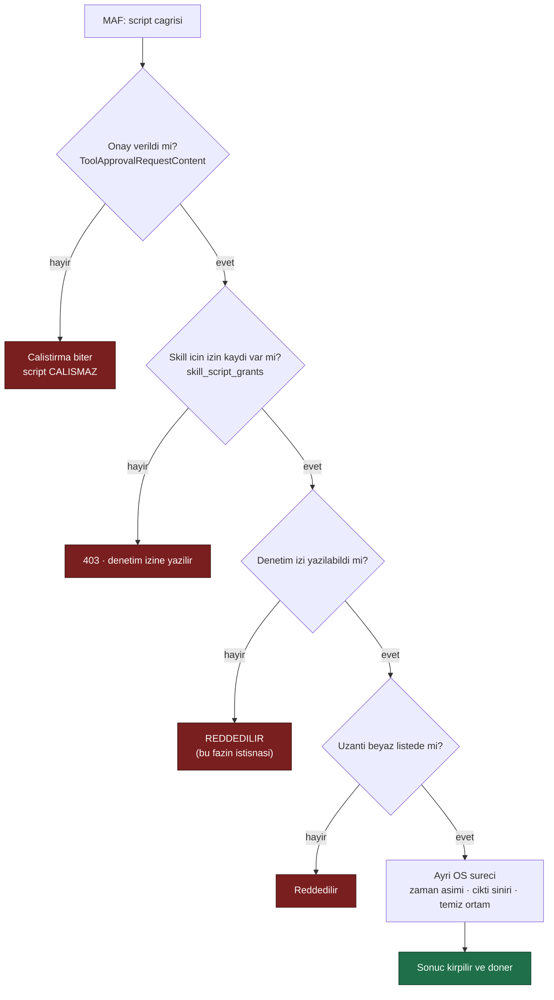

# Faz 11 — Skill Script Çalıştırma

> **Durum:** ✅ Tamamlandı (2026-08-02)
> **Kaynak:** [BEYIN-FIRTINASI.md](arsiv/BEYIN-FIRTINASI.md) · **F-09** (2/2)
> **Önkoşul:** [Faz 9](09-YONETISIM-VE-DENETIM-IZI.md) **ve** [Faz 10](10-AGENT-SKILLERI.md) — ikisi de zorunlu
> **Paketler:** `AgentPrism.Abstractions`, `.Core`, `.PostgreSql`, `.AspNetCore`, `.UI`
> **Yeni paket:** Yok · **Migration:** 0004 (`0004_skill_scripts.sql`)

---

## ⚠️ Bu Faz Bir Güvenlik Sınırını Değiştirir

Tasarım kuralı **K2** şunu der: *"Tool'lar yalnız kodda tanımlanır. Arayüze
erişen herkes sunucuda kod çalıştırabilseydi bu bir güvenlik açığı olurdu."*

Bu faz, K2'nin **ikinci bilinçli istisnasıdır**. Birincisi MCP'ydi (K-058) ve
orada süreç **uzakta** çalışıyordu. Burada süreç **AgentPrism'in makinesinde**
çalışır. Fark budur ve bu fazın tüm tasarımı bu farkı yönetmek üzerinedir.

**Kullanıcı kararı (2026-08-02):** script çalıştırma kabul edilebilir (K-066).
Karar, kontrolsüz çalıştırma anlamına gelmez.

---

## Bu Faza Başlarken

1. [`10-AGENT-SKILLERI.md`](10-AGENT-SKILLERI.md) — skill zinciri ve depo
2. [`09-YONETISIM-VE-DENETIM-IZI.md`](09-YONETISIM-VE-DENETIM-IZI.md) — roller, `IAuditLog`
3. [`KARARLAR.md`](KARARLAR.md) — **K-012**, **K-058** (uzak süreç istisnası), **K-061** (onay kuralları), **K-066** (bu fazın izni)
4. [`MIMARI.md`](MIMARI.md) — bölüm 7 (güvenlik modeli)
5. Bu doküman

## Faz 10'dan Devralınan Sözleşmeler

Faz 10 tamamlandı. Önce bu yüzeyleri oku; script desteği bunları genişletecek,
yerine paralel bir skill zinciri kurmayacaktır.

| Sözleşme | Mevcut davranış |
|----------|-----------------|
| `AgentSkillDefinition` | `Instructions`, frontmatter, `Resources`, `Enabled`, `Version`, UTC zamanları taşır. Script alanı yoktur. |
| `IAgentSkillStore` | `ListAsync(tenantId)`, `GetAsync(tenantId, name)`, `SaveAsync(skill)`, `DeleteAsync(tenantId, name)`; PostgreSQL kaynakları `agent_skill_resources` tablosunda cascade bağlıdır. |
| `AgentSkillCatalog` | Kod kaydı store kaydını aynı adda geçersiz kılar. Bilinmeyen skill derleme hatasıdır; `Enabled = false` MAF'a girmez. |
| `AgentPrismSkillsSource` | `AgentSkillDefinition` değerini `AgentInlineSkill`e çevirir. Kaynak zinciri `Aggregating` → `Filtering` → tenant anahtarlı `Caching` → `Deduplicating` biçimindedir. |
| `AgentDefinition.SkillNames` | Agent tanımının sürümlü JSON yükündedir. `CompiledAgentCache` anahtarı skill parmak izini içerir; script ekleme bu geçersiz kılma davranışını korumalıdır. |
| Onay | `AgentSkillsProviderOptions.Disable*Approval` değerleri ayarlanmaz. Gerçek OpenRouter denemesinde `load_skill` onayı Playground'da göründü ve onaylanınca skill talimatı yüklendi. |

🚨 `AgentInlineSkill.AddScript` Faz 10'da bilerek çağrılmadı. Faz 11 ekleme
yaparsa `AgentSkillCatalog` ve `AgentPrismSkillsSource` üzerinden gitmeli;
MAF'ın dosya tabanlı kaynaklarını doğrudan veritabanı verisi için kullanmak
tenant yalıtımını ve cache parmak izini atlar.

---

## Doğrulanmış MAF API'si

```csharp
// Calistiriciyi MAF DEGIL, BIZ yaziyoruz. MAF yalniz cagirir.
sealed delegate AgentFileSkillScriptRunner :
    Task<object?> Invoke(AgentFileSkill skill,
                         AgentFileSkillScript script,
                         JsonElement? arguments,
                         IServiceProvider serviceProvider,
                         CancellationToken ct);

sealed class AgentFileSkillsSource : AgentSkillsSource {
    AgentFileSkillsSource(string skillPath, AgentFileSkillScriptRunner scriptRunner,
                          AgentFileSkillsSourceOptions? options, ILoggerFactory? lf);
    AgentFileSkillsSource(IEnumerable<string> skillPaths, ...);
}

sealed class AgentFileSkillsSourceOptions {
    IEnumerable<string>? AllowedScriptExtensions   { get; set; }   // BEYAZ LISTE
    IEnumerable<string>? AllowedResourceExtensions { get; set; }
    Func<AgentFileSkillFilterContext, bool>? ScriptFilter   { get; set; }
    Func<AgentFileSkillFilterContext, bool>? ResourceFilter { get; set; }
    int? SearchDepth { get; set; }
}

sealed class AgentFileSkillScript : AgentSkillScript {
    string FullPath { get; }
    JsonElement? ParametersSchema { get; }
}

sealed class AgentFileSkill : AgentSkill { string Path { get; } AgentSkillFrontmatter Frontmatter { get; } }
```

### 🚨 En önemli bulgu

**MAF hiçbir script'i kendi başına çalıştırmaz.** `AgentFileSkillScriptRunner`
bir delegedir ve onu biz sağlarız. Yani sandbox, zaman aşımı, kaynak sınırı ve
denetim izi **tamamen AgentPrism'in sorumluluğundadır**. MAF'ın "script
çalıştırma özelliği" aslında bir **çağrı noktasıdır**, bir çalıştırıcı değil.

Bu iyi haberdir: sınırı biz çiziyoruz, devraldığımız bir davranış yok.

---

## 11.1 — Script Nereden Gelir? (Bu fazın merkezî kararı)

İki seçenek vardır ve güvenlik profilleri aynı değildir.

### Seçenek A — Yalnız diskten, kodda yapılandırılmış kökten (ÖNERİLEN)

```csharp
builder.AddAgentPrism()
       .UseSkillScripts(o =>
       {
           o.SkillRoots.Add("/opt/agentprism/skills");    // KODDA, arayuzden DEGIL
           o.Interpreters["py"] = "/usr/bin/python3";      // BEYAZ LISTE
           o.Timeout = TimeSpan.FromSeconds(30);
       });
```

- Script **içeriğini** yazan kişi, uygulamayı dağıtan kişidir
- Arayüzden yapılabilen tek şey: bir skill'i **açmak/kapatmak** ve çalıştırma
  iznini vermek
- K2 özünde korunur: arayüze erişen biri sunucuda **yeni kod yazamaz**, yalnız
  dağıtımla gelen kodu **etkinleştirebilir**

### Seçenek B — Veritabanından, arayüzde yazılan script

- Arayüze erişen Admin, sunucuda çalışacak kodu yazabilir
- Bu, K2'nin tam anlamıyla kaldırılmasıdır
- Yapılırsa **varsayılan kapalı** olmalıdır: `AllowStoredScripts = false`, açmak
  için hem kod tarafında bayrak hem Admin rolü hem de skill başına açık izin
  gerekir

**Bu dokümanın planı A'yı çekirdek, B'yi bayrakla kapatılmış bir uzantı olarak
kurar.** Kullanıcı B'yi istemezse 11.5 bölümü uygulanmaz ve faz yine tamamdır.

---

## 11.2 — Çalıştırıcı: `SandboxedSkillScriptRunner`



### Zorunlu davranışlar

| Kural | Uygulama |
|-------|----------|
| **Asla süreç içinde çalışmaz** | Her script ayrı bir `Process`. AgentPrism süreci hiçbir zaman script kodunu yüklemez |
| **Yorumlayıcı beyaz listesi** | `Interpreters` sözlüğü boşsa **hiçbir script çalışmaz**. Varsayılan boştur |
| **Uzantı beyaz listesi** | `AgentFileSkillsSourceOptions.AllowedScriptExtensions` ile MAF tarafında da sınırlanır |
| **Zaman aşımı** | Varsayılan 30 sn. Aşımda **süreç ağacı** öldürülür (`Process.Kill(entireProcessTree: true)`) |
| **Çıktı sınırı** | stdout+stderr en çok 256 KB; aşan kırpılır ve kırpıldığı belirtilir |
| **Temiz ortam** | Ortam değişkenleri **beyaz listeyle** aktarılır. Varsayılan liste `PATH` ve `HOME`. Bağlantı dizesi ve API anahtarı **asla** geçmez |
| **Çalışma dizini** | Skill'in kendi dizini; yazma için ayrı bir geçici dizin verilir ve çalıştırma sonunda **silinir** |
| **Onay zorunlu** | `DisableRunSkillScriptApproval` **açılmaz**. Her script çağrısı Faz 6 onay akışından geçer |
| **Denetim izi zorunlu** | Yazılamazsa çalıştırma **reddedilir** — Faz 9'un "hata işlemi kesmez" kuralının bilinçli istisnası |
| **Argümanlar doğrulanır** | `AgentFileSkillScript.ParametersSchema` varsa argümanlar ona göre denetlenir; yoksa yalnız JSON boyutu sınırlanır |

### Dürüst olunması gereken sınır

**AgentPrism işletim sistemi düzeyinde izolasyon sağlamaz.** .NET ile taşınabilir
biçimde yapılamayanlar:

- Ağ erişimini kesmek
- Dosya sistemini gerçek anlamda kısıtlamak (chroot/namespace)
- CPU ve bellek kotası uygulamak
- Ayrıcalık düşürmek (farklı kullanıcıya geçmek)

Bunlar **barındırma ortamının** işidir. README ve `MIMARI.md` şunu açıkça
yazacaktır: script çalıştırma açıksa AgentPrism **container içinde, ayrıcalıksız
bir kullanıcıyla ve kısıtlı ağ ile** çalıştırılmalıdır. Sağlayamadığımız
korumayı sağlıyormuş gibi yazmak, hiç yazmamaktan kötüdür.

`AgentPrismSkillScriptOptions.PlatformIsolationAcknowledged` — bu bayrak `true`
yapılmadan script çalıştırma **açılmaz**. Tüketici sınırı okuduğunu böyle
bildirir.

---

## 11.3 — İzin Kaydı (Migration 0004)

```sql
CREATE TABLE {schema}.skill_script_grants (
    id           uuid        NOT NULL PRIMARY KEY,
    tenant_id    text        NOT NULL,
    skill_name   text        NOT NULL,
    script_name  text,                        -- NULL = skill'in tum script'leri
    granted_by   text,
    granted_at   timestamptz NOT NULL,
    expires_at   timestamptz,                 -- NULL = suresiz
    revoked_at   timestamptz,
    CONSTRAINT skill_script_grants_uq UNIQUE (tenant_id, skill_name, script_name)
);
```

> Faz 6'nın `tool_approval_rules` tablosunda öğrenilen ders burada da geçerlidir:
> `script_name` `NULL` olabildiği için düz bir `UNIQUE` kısıt yetmez;
> `COALESCE`'li bir ifade indeksi gerekir.

İzin verme **Admin** rolüdür ve denetim izine `script.grant` / `script.revoke`
olarak yazılır. Süresi dolmuş izin **otomatik olarak** geçersizdir; temizleme
işi Faz 25'in konusudur.

---

## 11.4 — Çalıştırma Kaydı ve Gözlemlenebilirlik

Her script çalıştırması:

- `tool_invocations` tablosuna yazılır (`source = "skill:{skillName}"`)
- Kendi span'ini açar: `execute_skill_script`, öznitelikler `skill.name`,
  `script.name`, `exit_code`, `duration_ms`
- `agentprism.tool.invocations` metriğine `tool_name = "skill_script"` etiketiyle
  girer
- Denetim izine `script.run` olarak yazılır — argümanlar **kırpılmış** ve
  sır süzgecinden geçmiş hâlde

Böylece "bu sunucuda hangi script ne zaman, kim tarafından, hangi argümanla
çalıştı" sorusu tek sorguyla cevaplanır. Bu, script çalıştırmayı kabul etmenin
karşılığında alınan şeydir.

---

## 11.5 — (İsteğe bağlı) Veritabanından Script — Seçenek B

Yalnız kullanıcı açıkça isterse uygulanır.

- `agent_skill_scripts` tablosu: `skill_id`, `name`, `extension`, `content`,
  `parameters_schema`
- Çalıştırma anında içerik geçici bir dizine **0700 izinle** yazılır, çalıştırılır,
  silinir
- Üç kapı birden gerekir: `AllowStoredScripts = true` (kod) **ve** Admin rolü
  **ve** `skill_script_grants` kaydı
- Arayüzde script düzenleyicisi açıldığında **kırmızı bir uyarı** gösterilir:
  *"Bu içerik sunucuda çalıştırılacaktır."*
- Denetim izinde `script.content.update` eylemi, `before`/`after` ile

---

## Testler

| Proje | Yeni test |
|-------|-----------|
| `AgentPrism.Core.UnitTests` | Beyaz liste boşken **hiçbir şey çalışmaz**; zaman aşımında süreç ağacı ölür; çıktı kırpma; ortam değişkeni sızmaz (`ConnectionString` içeren ortam ile test); izinsiz script reddedilir; denetim izi yazılamazsa **reddedilir**; süresi dolmuş izin geçersiz |
| `AgentPrism.PostgreSql.IntegrationTests` | `SkillScriptGrantContract`; `NULL` script adında tekrar kaydı oluşmaz |
| `AgentPrism.AspNetCore.FunctionalTests` | İzin uçları rol matrisi; `PlatformIsolationAcknowledged` olmadan açılışta hata |
| `AgentPrism.Ui.E2ETests` | İzin verme akışı; uyarı metni görünür |

**Gerçek çalıştırma kanıtı zorunludur:** basit bir `echo` script'i onaydan
geçirilip çalıştırılır, çıktısı ve denetim izi satırı dokümana yazılır.

> Test script'leri `tests/` altında geçici bir dizinde üretilir, depoya
> **çalıştırılabilir dosya eklenmez**.

---

## Bu Fazda Verilen Kararlar

| Karar | Konu |
|-------|------|
| **K-086** | K2'nin ikinci istisnası; `PlatformIsolationAcknowledged` şartı; sağlanan ve **sağlanmayan** korumaların listesi |
| **K-087** | Hem dosya tabanlı hem saklanan script'ler; script kökü koddan gelir |
| **K-088** | Yorumlayıcı beyaz listesi boş varsayılan |
| **K-089** | Denetim izi yazılamazsa çalıştırma reddedilir |
| **K-090** | Sığ argüman doğrulaması; yeni bağımlılık yok |
| **K-091** | Argümanlar stdin ile geçirilir; ortam sıfırlanır |
| **K-092** | İzin kaydı silinmez, iptal edilir; `COALESCE` benzersizlik indeksi |

---

## Açık Soruların Cevapları (kullanıcı kararı, 2026-08-02)

1. **Seçenek B uygulanacak mı?** → **Evet, A + B birlikte.** Dosya tabanlı
   kaynak (`AgentFileSkillsSource`) kökleri **yalnız kodda** verilir; saklanan
   script'ler ayrıca `AllowStoredScripts` bayrağıyla kapılıdır (K-087).
2. **Hangi yorumlayıcılar?** → **`python3` + `node` + `bash`.** Üçü de
   desteklenir ancak hiçbiri kendiliğinden kayıtlı değildir (K-088).
3. **Eşzamanlılık?** → Kiracı başına **2**, toplam **8**;
   `SkillScriptConcurrencyLimiter` iki katmanlı `SemaphoreSlim` kullanır.
4. **`AllowedTools` zorlansın mı?** → **Evet.**

---

## Plandan Sapmalar

| Sapma | Gerekçe |
|-------|---------|
| Seçenek B (arayüzde script yazma) da uygulandı | Kullanıcı kararı. Arayüz script **içeriği** yazabilir ama script **kökü** ekleyemez; kök keyfî dosya sistemi okuması demek olurdu (K-087). |
| Üç yorumlayıcı desteklendi, yalnız `python3` değil | Kullanıcı kararı. Beyaz liste boş varsayıldığı için ek risk kurulum anında bilinçli olarak alınır (K-088). |
| JSON Schema doğrulaması sığ yapıldı | Tam doğrulayıcı yeni bir NuGet bağımlılığı gerektirirdi; kütüphane tüketicinin bağımlılık grafiğini kirletmez (K-090). |
| İzin uçlarında `TimeProvider` yerine `DateTimeOffset.UtcNow` | `TimeProvider` DI'da kayıtlı olmadığı için minimal API metadata çıkarımı tüm uçları kırıyordu. |

---

## Gerçek Çalıştırma Kanıtı

Test: `SandboxedSkillScriptRunnerTests.Izinli_script_gercekten_calisir_ve_denetim_izine_yazilir`

Kurulum: `Enabled = true`, `PlatformIsolationAcknowledged = true`,
`AllowStoredScripts = true`, `Interpreters["sh"] = "/bin/bash"`, kiracı
`default` için skill geneli izin.

Script içeriği:

```sh
echo merhaba-agentprism
```

Modele dönen çıktı:

```text
merhaba-agentprism
```

Denetim izi satırı: `action = "script.run"`, `tenantId = "default"`.
İzin kaldırıldığında aynı çağrı `AgentPrismException` ile reddedilir ve
`action = "script.denied"` yazılır.

Koşum sonucu (macOS arm64, .NET 10):

```text
AgentPrism.Core.UnitTests            149 passed, 0 failed
AgentPrism.PostgreSql.IntegrationTests 156 passed, 0 failed
AgentPrism.AspNetCore.FunctionalTests  136 passed, 0 failed
```

---

## Bitiş Ölçütleri (DoD)

- [x] Yapılandırma yapılmamış bir kurulumda script çalıştırma **kapalı** ve
      denendiğinde anlaşılır bir hata veriyor
- [x] Beyaz listedeki bir yorumlayıcı ile gerçek bir script onaydan geçip
      çalışıyor; çıktısı modele dönüyor (gerçek çıktı yukarıda)
- [x] Zaman aşımı, çıktı sınırı ve ortam temizliği testlerle kanıtlı
- [x] İzinsiz script çalışmıyor; reddedilme denetim izinde görünüyor
- [x] `tool_invocations`, span ve metrik dolduruluyor
- [x] README ve `MIMARI.md` sağlanamayan izolasyon sınırlarını **açıkça** yazıyor
- [x] Dört doğrulama kapısı sıfır uyarı; sır taraması boş

---

## Riskler

| Risk | Önlem |
|------|-------|
| **Sunucuda kod çalıştırma** | Beyaz liste + izin kaydı + onay + denetim izi + varsayılan kapalı. Kalan risk barındırma ortamına devredilir ve yazılır |
| Script uzun sürer, iş parçacığını tutar | Ayrı süreç + zaman aşımı + eşzamanlılık sınırı |
| Zombi süreçler | `Kill(entireProcessTree: true)`; testte doğrulanır |
| Geçici dizin dolar | Çalıştırma sonunda silinir; `finally` bloğunda |
| Sır sızması | Ortam beyaz listesi; argüman ve çıktı denetim izine süzülerek yazılır |
| Kullanıcı sınırı yanlış anlar | `PlatformIsolationAcknowledged` bayrağı bilinçli bir onay adımıdır |

---

## Sonraki Faza Devir Notu

- Faz 12 (agent'ın agent'ı çağırması) benzer bir "kaynak sınırı" sorusuyla
  gelir. Buradaki eşzamanlılık sınırı deseni oraya taşınabilir.
- Faz 25 (saklama) süresi dolmuş `skill_script_grants` kayıtlarını temizlemekle
  yükümlüdür.
- Faz 7 (yayın) yapılırken bu fazın public API'si **güvenlik yüzeyi** olarak
  ayrıca gözden geçirilmelidir.
