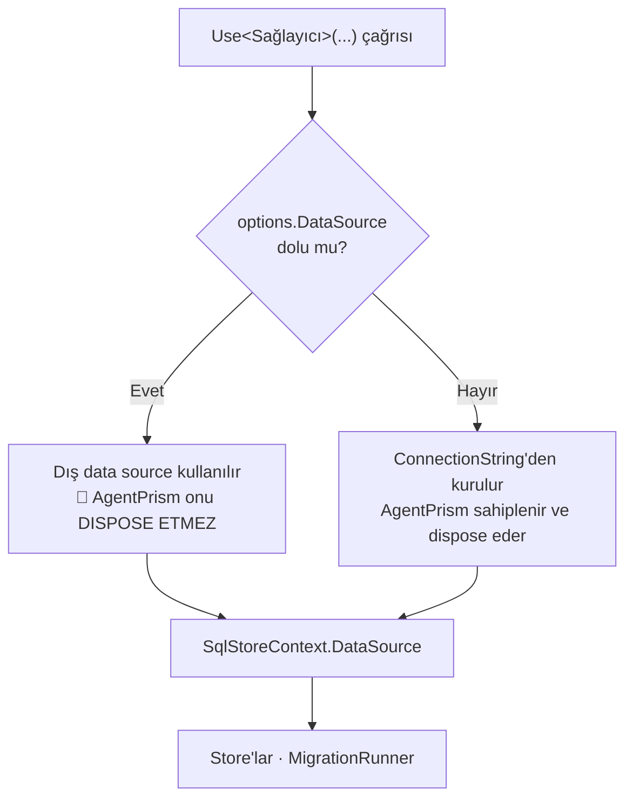

# Faz 110 — Tüketici Bağlantı Düzlemi

> **Durum:** ✅ Tamamlandı (2026-08-26)
> **Kaynak:** [`kesif/2026-08-26-ef-core-uyum-olcumu.md`](kesif/2026-08-26-ef-core-uyum-olcumu.md) — kalem **P1 · P2 · P3 · P5 · P6**. Bu faz bir `F-NN` adayından gelmez
> **Önkoşul:** Yok. Teknik zorunluluk yoktur; [Faz 109](arsiv/fazlar/109-FRONTEND-MODULLERI-VE-EKRAN-TESTLERI.md) kapandıktan sonra sıraya girer
> **Paketler:** `AgentPrism.PostgreSql`, `.SqlServer`, `.Sqlite`, `.Sql.Shared` · `samples/AgentPrism.Embedded`
> **Yeni paket:** NuGet paketi **yok**. Sample-only bağımlılık: `Npgsql.EntityFrameworkCore.PostgreSQL` — yalnız `samples/`, sevk edilen hiçbir pakete girmez · **Migration:** Yok
> **Public API:** **Büyüyor** — üç `Options` tipine birer `DbDataSource?` alanı. Bugün ucuz: `wc -l src/*/PublicAPI.Shipped.txt` = **17 satır** (19 paketin tamamı yalnız başlık taşıyor, K-603). Faz 7 sonrası aynı alanı eklemek kırıcı olurdu
> **Tüketici yüzeyi:** Site — yeni sayfa `docs-site/src/content/docs/guides/ef-core.md` · değişen: `guides/embedding.md`, `guides/production.md`, `packages.md` · Sevk edilen: `src/AgentPrism.PostgreSql/README.md`, `.SqlServer/README.md`, `.Sqlite/README.md` ve yeni alanın XML `<example>` bloğu
> **Manuel test alanı:** [`manuel-test/03-KALICILIK-POSTGRESQL.md`](manuel-test/03-KALICILIK-POSTGRESQL.md) · [`manuel-test/04-KALICILIK-DIGER.md`](manuel-test/04-KALICILIK-DIGER.md) — plan `26-ISTEMCI-TOOLLARI-VE-GOMULEBILIR.md`'yi işaret ediyordu, o dosya istemci tool'ları/gömülebilir sohbet widget'ına özgü ve bu fazla ilgisiz; SQL Server/SQLite'ın simetrik `DataSource` alanı `04`'e girdi (bkz. "Plandan Sapmalar")

---

## Bu Faza Başlarken

> `faz-baslangic` skill'ini uygula. Aşağıdaki liste o skill'in 2. adımıdır —
> **tamamını değil, yalnız işaret edilen bölümleri oku.**

1. Bu doküman
2. Kararlar — dosyanın tamamını **okuma**, yalnız bu kalemleri grep'le:
   ```bash
   grep -n "K-004\|K-013\|K-190\|K-603" docs/KARARLAR.md
   grep -n "L16\|L29" docs/arsiv/KARARLAR-INDEKS-REDDEDILEN.md
   ```
   **K-004** (veri erişimi ham ADO.NET + gömülü migration), **K-013** (ayrı
   `agentprism` şeması; tüketicinin `public` şeması ellenmez), **K-190**
   (SQLite'ta şema yerine tablo öneki), **K-603** (`Shipped.txt` preview
   boyunca boş), **L16/L29** (EF Core reddi — bu faz onu **yeniden açmaz**)
3. [`kesif/2026-08-26-ef-core-uyum-olcumu.md`](kesif/2026-08-26-ef-core-uyum-olcumu.md)
   — fazın tamamının gerekçesi. Kısa dosyadır, tamamını oku
4. Alan hafızası (bu faz üç alana dokunuyor):
   [`hafiza/sql-saglayicilari.md`](hafiza/sql-saglayicilari.md) (üç sağlayıcıda
   ortak kurulum katmanı) · [`hafiza/postgresql.md`](hafiza/postgresql.md)
   (`NpgsqlDataSource` ve migration runner tuzakları) ·
   [`hafiza/dokumantasyon.md`](hafiza/dokumantasyon.md) (site senkronu, `docs/`
   ile `docs-site/` sınırı)
5. Gerektiğinde, tamamı değil ilgili bölümü:
   [`MIMARI.md`](MIMARI.md) — kalıcılık katmanı bölümü

---

## Amaç

EF Core kullanan bir uygulama AgentPrism'i gömünce **iki bağlantı düzlemi**
doğar. Bugün bu düzlemler arasındaki temas ne bir sözleşmedir ne belgelidir:
PostgreSQL'de kazara çalışır, diğer iki sağlayıcıda hiç yoktur, ve sitedeki
kapasite iddiası mekanizmayla çelişir. Faz bu temas yüzeyini açık, simetrik ve
ölçülmüş bir sözleşmeye bağlar.

Faz **EF Core'u içeriye almaz.** L16 · L29 geçerlidir ve bu faz onları
güçlendirir: tüketicinin EF'i kendi tarafında kalır, AgentPrism kendi ADO.NET
yolunda kalır, ikisi tek bir `DbDataSource` üzerinde buluşur.

- **P1** — havuz paylaşımı iddiasını ölç, dokümanı gerçeğe çek
- **P2** — dışarıdan `DbDataSource` verme yüzeyi, üç sağlayıcıda simetrik
- **P3** — "ortak transaction yok" cevabını tüketiciye dönük yüzeye taşı
- **P5** — `agentprism migrate` ile `dotnet ef database update` sırasını belgele
- **P6** — gömme örneğine EF Core boyutu ekle; P1 ve P2 iddialarını orada kanıtla

### Bugün ne çalışmıyor — doğrulanmış kanıt

| Kanıt | Gözlem |
|---|---|
| [`AgentPrismPostgreSqlBuilderExtensions.cs:94`](../src/AgentPrism.PostgreSql/AgentPrismPostgreSqlBuilderExtensions.cs) | `TryAddSingleton<NpgsqlDataSource>`. Tüketici de `NpgsqlDataSource` kaydettiyse **hangi tarafın kazandığı kayıt sırasına bağlıdır** |
| [`AgentPrismPostgreSqlOptionsValidator.cs:22`](../src/AgentPrism.PostgreSql/AgentPrismPostgreSqlOptionsValidator.cs) | `ConnectionString` **koşulsuz** zorunlu — dış data source kazansa bile tüketici çelişebilecek ikinci bir değer yazmak zorunda |
| [`NpgsqlDataSourceFactory.cs:41`](../src/AgentPrism.PostgreSql/Internal/NpgsqlDataSourceFactory.cs) | Data source connection string'den kurulur. Havuz **data source'a** aittir, connection string'e değil |
| [`AgentPrismSqlServerBuilderExtensions.cs:91`](../src/AgentPrism.SqlServer/AgentPrismSqlServerBuilderExtensions.cs) · [`AgentPrismSqliteBuilderExtensions.cs:80`](../src/AgentPrism.Sqlite/AgentPrismSqliteBuilderExtensions.cs) | İç adaptör tipi (`SqlServerDataSource`, `SqliteDataSource`) kaydedilir. Dış seam **yok** — davranış sağlayıcılar arasında asimetrik |
| [`SqlStoreContext.cs:24`](../src/AgentPrism.Sql.Shared/Internal/SqlStoreContext.cs) | `DataSource` zaten `DbDataSource` tipinde. Store'lar hiçbir sürücü tipi görmez — **taşıma işi yalnız kurulum katmanındadır** |
| [`docs-site/.../embedding.md:165`](../docs-site/src/content/docs/guides/embedding.md) | *"the two planes share one Npgsql connection pool"* — [uygulanabilirlik raporu §7.1](kesif/2026-08-21-uygulanabilirlik-raporu.md) *"bağlantı havuzu iki katına çıkar"* diyor. İkisi aynı anda doğru olamaz |
| `AgentPrismPostgreSqlOptions` beş alan taşır | Connection string ile ifade edilemeyen ayar (token sağlayıcı geri çağrımı, istemci sertifikası, özel tip eşlemesi) **erişilemez** |
| `ls samples/AgentPrism.Embedded/` | Gömme örneğinde veritabanı yok, EF yok. `Program.cs:54` hiçbir `Use*` sağlayıcısı çağırmaz — bellek içi store'larla koşar |

> Kanıtlar 2026-08-26 tarihinde doğrulandı.

---

## 110.1 — Önce ölç: havuz iddiası

**Bu fazın ilk işi kod değil, ölçümdür.** Site bir kapasite sayısı vaat ediyor;
o sayı yanlışsa tüketici bağlantı tavanını yanlış planlıyor.

Ölçüm, `tests/AgentPrism.PostgreSql.IntegrationTests` altında bir testtir:

1. Aynı connection string ile **iki** `NpgsqlDataSource` kur (biri tüketiciyi,
   biri AgentPrism'i temsil eder)
2. İkisinden de N eşzamanlı komut koştur
3. `pg_stat_activity` üzerinden bu veritabanına açık **backend sayısını** oku

| Sonuç | Ne yapılır |
|---|---|
| Backend sayısı ≈ 2N | İddia yanlıştır. `embedding.md` düzeltilir **ve** 110.2 tek havuzu gerçekten mümkün kılar |
| Backend sayısı ≈ N | İddia doğrudur. `embedding.md` korunur, 110.2 yine de token/sertifika gerekçesiyle uygulanır |

Ölçüm sonucu plana değil, **kapanış bölümüne** yazılır. Bugün tahmin
edilmez — mekanizma birinci sonucu işaret ediyor ama bu bir ölçüm iddiası
değildir.

## 110.2 — `DataSource` seçeneği, üç sağlayıcıda simetrik

Üç `Options` tipine aynı alan girer:

```csharp
public DbDataSource? DataSource { get; set; }
```

Tip **`DbDataSource`**, `NpgsqlDataSource` değil. Gerekçe: `SqlStoreContext`
zaten bu tipi taşıyor, üç sağlayıcı aynı zihinsel modeli kullanır, ve
`AgentPrism.PostgreSql`'in public yüzeyine yeni bir Npgsql tipi girmez.



Üç kural bu tasarımın gövdesidir:

| Kural | Gerekçe |
|---|---|
| **Sahiplik geçmez** | AgentPrism, kurmadığı bir data source'u **dispose etmez**. Ederse host kapanışında tüketicinin kendi `DbContext`'i ölür. Bu, fazın en somut kusur riskidir |
| **Sessiz öncelik yok** | `DataSource` **ve** `ConnectionString` birlikte verilirse davranış Açık Soru 1'de karara bağlanır. Bugünkü sessiz yok sayma korunmaz |
| **`ConnectionString` koşullu zorunlu olur** | Validator, `DataSource` doluysa connection string aramaz. Hiçbiri yoksa **bugünkü hata mesajı korunur** |

### DI kaydının kaldırılması

Bugün `NpgsqlDataSource` **public bir DI servisi** olarak kaydediliyor. Bu, iki
yönlü bir sıra yarışıdır: ya tüketicinin data source'u AgentPrism'e sızar, ya
AgentPrism'inki tüketicinin `DbContext`'ine sızar.

Faz bunu kapatır: AgentPrism kendi kurduğu data source'u **public tip altında
kaydetmez**; `SqlStoreContext` üzerinden taşır. Tüketicinin data source'unu
almak isteyen tek yol açık `DataSource` alanıdır.

Bu bir davranış değişikliğidir ve bugünkü kazara paylaşıma dayanan bir
tüketiciyi etkiler. `Shipped.txt` boş olduğu için (K-603) **bugün ucuzdur**;
Faz 7 sonrası bir sürüm kararı olurdu.

### SQL Server ve SQLite için dürüst not

Alan üç sağlayıcıda da vardır, ama ekosistem bugün yalnız Npgsql tarafında bir
`DbDataSource` **üretiyor**. [`SqlServerDataSource.cs:12`](../src/AgentPrism.SqlServer/Internal/SqlServerDataSource.cs)
`Microsoft.Data.SqlClient`'ın bir `DbDataSource` sunmadığını yazıyor; pinlenen
sürüm `7.0.2` için bu **yeniden ölçülmelidir**. Ölçüm hangi sonucu verirse
versin alan eklenir — simetri korunur ve ekosistem yetiştiğinde tüketici hazır
bulur. Doküman bu farkı gizlemez.

## 110.3 — İki veri düzlemi: yeni site sayfası

Yeni sayfa: `docs-site/src/content/docs/guides/ef-core.md`. Kapsamı:

| Bölüm | İçerik |
|---|---|
| Tek data source | 110.2'nin kullanımı; token sağlayıcı ve sertifika geri çağrımının artık AgentPrism trafiğine de uygulanması |
| Ortak transaction **yoktur** | `SaveChanges` ile koşu kaydı asla atomik değildir. Neden: store'lar singleton, koşu kaydı işlevselliği durdurmaz |
| `RunId` referans deseni | Domain entity koşuya yalnız `RunId` ile referans verir. Ters yönde kopyalama yapılmaz. Tekrar riski `IIdempotencyStore` ile kapanır |
| İki migration adımı | 110.4'ün CI sırası |
| Kazanılmayanlar | EF global query filter AgentPrism satırlarına işlemez; `dotnet ef migrations` AgentPrism şemasını görmez; `DbContext` AgentPrism tablolarına sahip olmaz |

`embedding.md` bu sayfaya bağlanır ve havuz cümlesi 110.1'in ölçümüne göre
düzeltilir. `packages.md`'nin *"No ORM, and no Entity Framework"* satırı
korunur — doğrudur ve bu faz onu değiştirmez.

## 110.4 — Migration sırası

`production.md` içine kopyalanabilir bir CI adımı girer:

```bash
dotnet ef database update            # tüketicinin kendi şeması
agentprism migrate --provider postgres --connection "$AGENTPRISM_CONNECTION"
```

Sıra bağlayıcı değildir — iki şema birbirine yabancı anahtarla bağlı değildir
(K-013) — ama **`AutoApplyMigrations=false` ile birlikte** yazılır: aksi hâlde
tüketici iki mekanizmayı aynı anda açık tutar.

## 110.5 — Gömme örneğine EF Core boyutu

`samples/AgentPrism.Embedded` bugün bellek içi store'larla koşuyor. Faz ona
**isteğe bağlı** bir kalıcılık yolu ekler — `samples/AgentPrism.Api`'nin
yapılandırmayla sağlayıcı seçme deseninin aynısı:

- Connection string tanımlıysa: tek `NpgsqlDataSource` kurulur, hem host'un
  `DbContext`'ine hem `UsePostgreSql(o => o.DataSource = ...)` çağrısına verilir
- Tanımlı değilse: bugünkü bellek içi yol aynen korunur — örnek veritabanısız
  koşmaya devam eder, CI kırılmaz

Host tarafına tek bir entity girer: koşuya yalnız `RunId` ile referans veren bir
kayıt. Bu, 110.3'ün desenini anlatan değil **koşan** hâlidir.

---

## Planlanan Public API

> Taslak imzalardır. Gerçekleşen imzalar kapanışta ayrı bir bölüme yazılır.

```csharp
// AgentPrism.PostgreSql — aynısı AgentPrism.SqlServer ve AgentPrism.Sqlite için
public sealed class AgentPrismPostgreSqlOptions
{
    /// <summary>
    /// The data source AgentPrism uses. When set, <see cref="ConnectionString"/>
    /// is not required and AgentPrism does NOT dispose the instance — the
    /// caller keeps ownership.
    /// </summary>
    public DbDataSource? DataSource { get; set; }
}
```

Kaldırılan davranış: `NpgsqlDataSource`'un public DI servisi olarak kaydı
(bkz. 110.2).

### HTTP `endpoint`'leri

Yok. Faz hiçbir HTTP yüzeyine dokunmaz.

### Arayüz payı

Yok. Arayüze dokunulmaz; `en.ts`/`tr.ts` değişmez.

---

## Planlanan Dosya Listesi

```
src/AgentPrism.PostgreSql/
├── AgentPrismPostgreSqlOptions.cs            (+DataSource)
├── AgentPrismPostgreSqlOptionsValidator.cs   (koşullu ConnectionString)
├── AgentPrismPostgreSqlBuilderExtensions.cs  (çözümleme + DI kaydının kaldırılması)
└── Internal/NpgsqlDataSourceFactory.cs       (sahiplik bayrağı)
src/AgentPrism.SqlServer/   — aynı dört dosyanın karşılığı
src/AgentPrism.Sqlite/      — aynı dört dosyanın karşılığı
src/AgentPrism.Sql.Shared/
└── Internal/SqlStoreContext.cs               (OwnsDataSource)

tests/AgentPrism.PostgreSql.IntegrationTests/
├── ConnectionPoolSharingTests.cs             (110.1 ölçümü)
└── ExternalDataSourceTests.cs
tests/AgentPrism.SqlServer.IntegrationTests/ExternalDataSourceTests.cs
tests/AgentPrism.Sqlite.IntegrationTests/ExternalDataSourceTests.cs

samples/AgentPrism.Embedded/
├── Program.cs                                (isteğe bağlı kalıcılık yolu)
├── Persistence/HostDbContext.cs
└── Persistence/SupportTicket.cs

docs-site/src/content/docs/guides/ef-core.md  (yeni)
docs-site/src/content/docs/guides/embedding.md
docs-site/src/content/docs/guides/production.md
```

---

## Hata Modları ve Testler

> Mutlu yoldan değil, **ne bozulabilir**den türetilir. Seviyeyi plan seçer.
> Sınır geçen davranış (DI · HTTP · kiracı · akış · depo · paket) birim
> testiyle kanıtlanamaz — [`.agents/ortak/test-seviyeleri.md`](../.agents/ortak/test-seviyeleri.md).

| Ne bozulabilir | Seviye | Test sınıfı |
|---|---|---|
| 🚨 AgentPrism dış data source'u dispose eder; host kapanışında tüketicinin `DbContext`'i ölür | Fonksiyonel (host yaşam döngüsü) | `ExternalDataSourceOwnershipTests` |
| `DataSource` verildi ama validator yine `ConnectionString` ister → başlangıçta çöker | Fonksiyonel (DI + Options) | `ExternalDataSourceTests` |
| İkisi de verildi ve farklı veritabanını gösteriyor → **sessizce yanlış veritabanına yazılır** | Fonksiyonel | `ExternalDataSourceTests` |
| Hiçbiri verilmedi → bugünkü anlaşılır hata mesajı kaybolur | Birim | `AgentPrismPostgreSqlOptionsValidatorTests` |
| Dış data source ile store'ların kiracı izolasyonu bozulur | Sözleşme (`TenantIsolationContract`) | Mevcut sözleşme seti, dış data source fixture'ı ile |
| Migration runner dış data source ile şemayı kuramaz | Fonksiyonel | `MigrationTests` (dış data source varyantı) |
| Dış data source kapalı/erişilemez → başlangıç hatası anlaşılmaz | Fonksiyonel | `ExternalDataSourceTests` |
| Havuz gerçekten paylaşılmıyor ama doküman paylaşıldığını söylüyor | Fonksiyonel (ölçüm) | `ConnectionPoolSharingTests` |
| Eşzamanlı `run`'lar dış data source üzerinde birbirinin bağlantısını tüketir | Fonksiyonel | `ConnectionPoolSharingTests` |
| Site sayfası kırık bağlantı taşır | Kapı | `check-links.mjs` |

**Beş sorunun cevabı.** *İptal:* yeni kod yolu kurulum anındadır, `run` başına
iptal token'ı taşımaz — yeni iptal yüzeyi yoktur. *Eşzamanlılık:* havuz
testiyle kapsanır. *Boş/aşırı girdi:* validator tablosunun ilk dört satırı.
*Başka kiracı:* mevcut sözleşme seti dış data source fixture'ıyla yeniden
koşar. *Alt sistem hatası:* erişilemez data source satırı.

---

## Manuel Kabul Case'leri

| # | Ön koşul | Adımlar | Beklenen sonuç |
|---|---|---|---|
| 1 | PostgreSQL ayakta | `AgentPrism.Embedded`'i connection string ile başlat | Host `DbContext` ve AgentPrism aynı data source'u kullanır; başlangıç logunda tek data source görünür |
| 2 | Case 1 koşuldu | Bir `run` başlat, ardından host'un kendi ucundan kaydı oku | Host kaydı `RunId` taşır; `GET /api/runs/{id}` aynı kimliği döndürür |
| 3 | PostgreSQL ayakta | `DataSource` **ve** farklı bir veritabanına bakan `ConnectionString` ver | Başlangıç, hangi değerin çeliştiğini adıyla söyleyen bir hata verir (Açık Soru 1'in kararına göre) |
| 4 | Case 1 koşuldu | Uygulamayı durdur | Kapanışta `ObjectDisposedException` yok; host `DbContext`'i kapanışa kadar çalışır |
| 5 | 👤 insan gerekir | `psql` ile `pg_stat_activity` sayımını gözle | Sayı 110.1'in kapanışta yazdığı sonuçla tutarlı |

---

## Açık Sorular

| # | Soru | Seçenekler | Öneri |
|---|---|---|---|
| 1 | `DataSource` **ve** `ConnectionString` birlikte verilirse? | A: Başlangıçta hata · B: `DataSource` kazanır, connection string yok sayılır | **A.** K1 "sıfır sürpriz". B, bugünkü sessiz davranışın devamıdır ve yanlış veritabanına yazma riskini korur |
| 2 | `Microsoft.Data.SqlClient 7.0.2` bir `DbDataSource` sunuyor mu? | Ölçülmeli | Ölçüm hangi sonucu verirse versin alan eklenir; yalnız dokümanın dili değişir |
| 3 | Dış data source verildiğinde `CommandTimeoutSeconds` yine uygulansın mı? | A: Evet, komut başına uygulanır · B: Dış data source'un kendi ayarına bırakılır | **A.** Ayar komut seviyesindedir, data source seviyesinde değil; davranış bugünküyle aynı kalır |

---

## Bitiş Ölçütleri (DoD)

- [x] `UsePostgreSql(o => o.DataSource = ds)` ile kurulan uygulama `run` yapar ve `ConnectionString` **istemez** — `ExternalDataSourceTests.DataSource_alone_does_not_require_a_connection_string` + `Compiled_agent_runs_against_an_external_data_source` (gerçek PostgreSQL)
- [x] Aynı davranış `UseSqlServer` ve `UseSqlite` için de doğrudur — her ikisinin kendi `ExternalDataSourceTests`'i, gerçek sunucu/dosyaya karşı
- [x] Host kapanışında dış data source dispose **edilmez**; case 4 kanıtlar — `External_data_source_is_not_disposed_when_the_host_stops` (üç sağlayıcı) + `samples/AgentPrism.Embedded`'in canlı `SIGTERM` koşumu (bkz. `MT-PG-070`)
- [x] `NpgsqlDataSource` artık public DI servisi olarak kaydedilmez; bunu doğrulayan test yeşildir — `The_data_source_is_not_registered_as_a_public_DI_service` (üç sağlayıcı; denetimin 🔴 bulgusu üzerine eklendi, bkz. "Denetim Bulguları")
- [x] `ConnectionPoolSharingTests` ölçümü koşuldu ve sonucu "Plandan Sapmalar" bölümüne yazıldı
- [x] `embedding.md` havuz cümlesi ölçümle uyumludur
- [x] `guides/ef-core.md` yayında; `npm run build` + `check-links.mjs` temiz
- [x] `samples/AgentPrism.Embedded` hem veritabanısız hem PostgreSQL'li yolda koşar — veritabanısız: `AgentPrism.Embedded.Tests` 3/3; PostgreSQL'li: canlı konteynere karşı `POST /tickets` + `GET /agentprism/api/runs/{id}` (bkz. `MT-PG-068`)
- [x] Dört doğrulama kapısı sıfır uyarı verir — `python3 scripts/kapi.py kapanis --taban 678ba30`
- [x] `samples/AgentPrism.Embedded` ile gerçek `run` yapıldı, çıktı belgeye yazıldı — plan `samples/AgentPrism.Api`yı işaret ediyordu; bu fazın kendi örneği `AgentPrism.Embedded` olduğu için kanıt oradan alındı (bkz. "Plandan Sapmalar")
- [x] `secret` taraması boş döndü — `python3 scripts/kapi.py tarama` → ✅ temiz
- [x] Manuel kabul case'leri `docs/manuel-test/03-KALICILIK-POSTGRESQL.md` ve `04-KALICILIK-DIGER.md` içine eklendi (plan `26-...`yi işaret ediyordu, bkz. "Plandan Sapmalar"); otomatikleştirilebilenler koşuldu
- [x] `faz-denetim` koşuldu; 🔴 bulgu kalmadı — ilk turda 1×🔴 + 2×🟡 çıktı, üçü de kapatıldı (bkz. "Denetim Bulguları")

### Doğrulama komutları

```bash
# Dış data source ile kurulan örnek gerçekten koşuyor mu
curl -s http://localhost:5081/agentprism/api/runs | head -c 400

# Public DI kaydı gerçekten kalktı mı
grep -rn "TryAddSingleton(static provider => NpgsqlDataSourceFactory" src/

# Havuz ölçümü
./artifacts/bin/AgentPrism.PostgreSql.IntegrationTests/release/AgentPrism.PostgreSql.IntegrationTests \
  --filter-method "*ConnectionPoolSharing*"
```

---

## Riskler

| Risk | Önlem |
|------|-------|
| 🚨 Dış data source'un dispose edilmesi — sessiz, yalnız kapanışta görünür | `SqlStoreContext`'e sahiplik bayrağı; case 4 fonksiyonel test |
| DI kaydının kaldırılması bugünkü kazara paylaşıma dayanan tüketiciyi kırar | Preview hattı, `Shipped.txt` boş (K-603). Değişiklik `guides/ef-core.md` ve paket README'lerinde açıkça yazılır |
| Simetri, iki sağlayıcıda bugün kullanılamayan bir alan üretir | Doküman bunu gizlemez; Açık Soru 2 ölçülür |
| Sample'a EF eklemek CI'ı veritabanına bağımlı yapar | Kalıcılık yolu **isteğe bağlıdır**; connection string yoksa bugünkü bellek içi yol koşar |
| Üç sağlayıcıda dört dosyanın elle tekrarı — kusur sınıfı üretir | Değişiklik `grep` ile taranır; sözleşme testleri üç sağlayıcıda birden koşar |

---

<!-- ============================================================
     AŞAĞISI KAPANIŞTA DOLDURULUR — `faz-tamamlama` skill'i.
     Plan anında boş kalır. Başlıkları SİLME.
     ============================================================ -->

## Plandan Sapmalar

**110.1 ölçüm sonucu: "Backend sayısı ≈ 2N" — iddia YANLIŞTI.**
`ConnectionPoolSharingTests.Two_data_sources_built_from_the_same_connection_string_do_not_share_a_pool`
aynı connection string'le kurulan iki `NpgsqlDataSource`'tan 5'er eşzamanlı
bağlantı tuttu; `pg_stat_activity` tam **10** backend gördü (5 değil, ölçülen
kesin sayı — `ShouldBe`, `ShouldBeGreaterThan` değil, geçici olarak sıkı
assert ile doğrulandı). Mekanizma: Npgsql 7.0'dan beri havuz `NpgsqlDataSource`
**örneğine** aittir, connection string'e değil — iki ayrı örnek, aynı string
olsa bile, iki ayrı havuz açar. `embedding.md`'nin "aynı connection string iki
tarafı tek havuzda buluşturur" cümlesi düzeltildi; 110.2 tek havuzu GERÇEKTEN
mümkün kılıyor (planın öngördüğü ikinci satır).

**Manuel test alanı referansı yanlıştı.** Plan `26-ISTEMCI-TOOLLARI-VE-GOMULEBILIR.md`
işaret ediyordu; o dosya istemci tool'ları/gömülebilir sohbet widget'ına özgü ve
bu fazla hiçbir ilgisi yok. Doğru sağlayıcı-simetri dosyası
`04-KALICILIK-DIGER.md` (SQL Server/SQLite) idi — case'ler oraya ve
`03-KALICILIK-POSTGRESQL.md`'ye eklendi.

**PostgreSQL için `DataSource`'un kabul ettiği tip planın öngördüğünden dar
tutuldu.** Plan yalnız "`DbDataSource`, `NpgsqlDataSource` değil" diyordu (public
imza için — bu aynen korundu). Uygulamada `NpgsqlDataSourceFactory.Resolve`
RUNTIME'da `options.DataSource`'un gerçekten bir `NpgsqlDataSource` olmasını
zorunlu kılıyor (aksi hâlde `AgentPrismException`, açık mesajla). Gerekçe: (1)
PostgreSQL için üretim kalitesinde tek `DbDataSource` uygulaması zaten Npgsql'in
kendisi — plan da "SQL Server/SQLite dürüst not"unda bunun SQL Server için
henüz hiç var olmadığını, SQLite için de var olmadığını zaten kabul ediyordu;
(2) `PgVectorSearchStore` somut `NpgsqlDataSource` tipini gerektiriyor ve tek
kaynaktan (`SqlStoreContext.DataSource`) beslenmesi gerekiyordu — aksi hâlde
`EnableKnowledge` açıkken İKİ ayrı data source (dolayısıyla iki havuz) kurulurdu,
bu fazın kendi "tek havuz" iddiasıyla çelişirdi. SQL Server ve SQLite için
kısıtlama YOK — `Options.DataSource` orada gerçekten herhangi bir `DbDataSource`
kabul eder (kendi `SqlServerDataSource`/`SqliteDataSource` adaptörleri dahil);
testler bunu doğrudan kanıtlar.

**SQL Server/SQLite'ta "kendi kurduğu data source'u dispose eder" iddiası
FONKSİYONEL olarak doğrulanamadı — tasarım yine de doğru.** Ölçüldü: ne
`SqlServerDataSource` ne `SqliteDataSource`, `DbDataSource.Dispose()`'u
override ETMİYOR (temel sınıfın no-op'u kalıyor) — sürücünün kendi havuzu bu
ince adaptöre değil `Microsoft.Data.SqlClient`/`Microsoft.Data.Sqlite`'ın
kendisine ait. `Own_data_source_is_disposed_when_the_host_stops` bu yüzden
`Own_data_source_is_marked_as_owned` olarak yeniden yazıldı — `OwnsDataSource`
bayrağının doğru değeri taşıdığını kanıtlar, ama dispose'un GÖZLENEBİLİR bir
etkisi yoktur (bu iki sağlayıcıda). PostgreSQL tarafında `NpgsqlDataSource`
gerçekten bir kaynak sahibidir; oradaki fonksiyonel test (`ObjectDisposedException`)
aynen planlandığı gibi çalıştı. Sahiplik mantığının KENDİSİ (`SqlStoreContext
.Dispose()`/`DisposeAsync()`) ayrıca bir spy `DbDataSource` ile sağlayıcıdan
bağımsız, izole kanıtlandı (`SqlStoreContextDisposalTests`, Docker gerekmez) —
bu üçü de kapsıyor, çünkü kod paylaşılan kaynaktır (K-176).

## Bu Fazda Verilen Kararlar

- **K-625** — Üç SQL sağlayıcısına `Options.DataSource` alanı eklendi;
  AgentPrism kendi kurduğu data source'u artık public bir DI servisi olarak
  kaydetmez; `DataSource` ve `ConnectionString` birlikte verilirse başlangıç
  hatası. Tam gerekçe: `docs/KARARLAR.md`.

## Gerçekleşen Public API

Plandaki taslakla birebir aynı, üç sağlayıcıda simetrik:

```csharp
// AgentPrism.PostgreSql — AgentPrism.SqlServer ve AgentPrism.Sqlite için aynısı
public sealed class AgentPrismPostgreSqlOptions
{
    /// <summary>
    /// The data source AgentPrism uses, instead of building its own from
    /// <see cref="ConnectionString"/>.
    /// </summary>
    public DbDataSource? DataSource { get; set; }
}
```

Kaldırılan davranış: `NpgsqlDataSource`/`SqlServerDataSource`/`SqliteDataSource`'un
public DI servisi olarak kaydı (`services.TryAddSingleton<NpgsqlDataSource>(...)`
ve karşılıkları). `Internal/XxxDataSourceFactory.cs`'e eklenen `Resolve(...)`
metodu (internal, public yüzeye girmez) tek çözümleme noktasıdır.

## Dosya Listesi (gerçekleşen)

```
src/AgentPrism.PostgreSql/
├── AgentPrismPostgreSqlOptions.cs            (+DataSource)
├── AgentPrismPostgreSqlOptionsValidator.cs   (koşullu ConnectionString + çakışma)
├── AgentPrismPostgreSqlBuilderExtensions.cs  (Resolve + PgVectorSearchStore artık SqlStoreContext.DataSource'tan)
├── Internal/NpgsqlDataSourceFactory.cs       (+Resolve, NpgsqlDataSource tip kontrolü)
└── PublicAPI.Unshipped.txt
src/AgentPrism.SqlServer/            — aynı beş dosyanın karşılığı (Internal/SqlServerDataSourceFactory.cs)
src/AgentPrism.Sqlite/               — aynı beş dosyanın karşılığı (Internal/SqliteDataSourceFactory.cs)
src/AgentPrism.Sql.Shared/
└── Internal/SqlStoreContext.cs               (+OwnsDataSource, IDisposable/IAsyncDisposable)

tests/AgentPrism.PostgreSql.IntegrationTests/
├── ConnectionPoolSharingTests.cs             (110.1 ölçümü)
├── ExternalDataSourceTests.cs
└── SqlStoreContextDisposalTests.cs           (izole spy testi, Docker gerekmez)
tests/AgentPrism.SqlServer.IntegrationTests/ExternalDataSourceTests.cs
tests/AgentPrism.Sqlite.IntegrationTests/ExternalDataSourceTests.cs

samples/AgentPrism.Embedded/
├── Program.cs                                (isteğe bağlı kalıcılık yolu + POST /tickets)
├── CreateTicketRequest.cs
├── Persistence/HostDbContext.cs
├── Persistence/SupportTicket.cs
├── README.md
└── AgentPrism.Embedded.csproj                (+Npgsql.EntityFrameworkCore.PostgreSQL)

Directory.Packages.props                      (+Npgsql.EntityFrameworkCore.PostgreSQL, sample-only)
docs-site/src/content/docs/guides/ef-core.md  (yeni)
docs-site/src/content/docs/guides/embedding.md
docs-site/src/content/docs/guides/production.md
docs-site/src/sidebar.mjs
docs/manuel-test/00-INDEKS.md · 03-KALICILIK-POSTGRESQL.md · 04-KALICILIK-DIGER.md
docs/KARARLAR.md (K-625) · docs/hafiza/postgresql.md · docs/hafiza/sql-saglayicilari.md
```

`docs-site/src/content/docs/packages.md` **değişmedi** — "No ORM, and no Entity
Framework" satırı doğru ve bu faz onu değiştirmedi (planın öngördüğü gibi).

## Denetim Bulguları

`faz-denetim` skill'i taze bağlamlı bağımsız bir agent ile koşuldu (kod
yazmadan yalnız `git status`/`git diff` + gerçek `dotnet build`/`dotnet test`
ile doğrulama). İlk tur 1×🔴 + 2×🟡 buldu; üçü de aynı fazda kapatıldı.

| # | Seviye | Bulgu | Sonuç |
|---|---|---|---|
| 1 | 🔴 | DoD'nin istediği "`NpgsqlDataSource` artık public DI servisi değil" iddiasını doğrulayan hiçbir test yoktu — yalnız elle çalıştırılan bir `grep` vardı | **Düzeltildi.** Üç sağlayıcıya `The_data_source_is_not_registered_as_a_public_DI_service` testi eklendi (`provider.GetService<NpgsqlDataSource>()`/`SqlServerDataSource`/`SqliteDataSource` `null` döner), gerçek sunucu/dosyaya karşı yeşil |
| 2 | 🟡 | DoD'nin 13 satırı hâlâ `- [ ]` işaretsizdi, doküman başlığı "✅ Tamamlandı" diyordu | **Düzeltildi.** Her satır kanıtına göre `[x]` işaretlendi |
| 3 | 🟡 | `samples/AgentPrism.Embedded`'in kurduğu `NpgsqlDataSource` hiçbir yerde dispose edilmiyordu — fazın kendi sözleşmesi ("caller keeps ownership and disposes it when the host shuts down") referans örnekte uygulanmıyordu | **Düzeltildi.** `app.Lifetime.ApplicationStopping.Register(() => dataSource.Dispose())` eklendi; canlı bir PostgreSQL konteynerine karşı `SIGTERM` ile doğrulandı — kapanış logunda hata yok |

🔴 ve 🟡 bulgu kalmadı. Temiz çıkan başlıklar (ilk tur): 3.2 (test tiyatrosu
yok), 3.3 (test seviyeleri doğru), 3.5 (imza-gövde kayması yok), 3.6 (plan
dışı public API yok), 3.7 (repo kuralları), 3.8 (ürün yüzeyi/site sözleşmesi).

## Sonraki Faza Devir Notu

- **Faz 111** (Okuma Sözleşmesi Görünümleri, P4) bu fazdan bağımsızdır ama aynı
  `AgentPrism.Sql.Shared`/üç sağlayıcı katmanına dokunacaktır — `SqlStoreContext`
  artık `IDisposable`/`IAsyncDisposable`; yeni bir alan eklerken bu iki metodu
  unutma.
- **SQL Server'ın `DbDataSource` durumu yeniden ölçülmeli** bir sonraki
  `Microsoft.Data.SqlClient` sürüm yükseltmesinde (bugün 7.0.2, ölçülen: yok).
  Ölçüm sonucu ne olursa olsun `AgentPrismSqlServerOptions.DataSource` alanı
  zaten var — yalnız dokümanın "henüz yok" cümlesi değişir.
- **`samples/AgentPrism.Embedded`'in EF Core yolu `Database.EnsureCreatedAsync()`
  kullanır, gerçek `dotnet ef migrations` DEĞİL** — örnek basitliği için
  bilinçli bir tercih (`production.md`'nin CI adımı gerçek `dotnet ef database
  update`'i belgeler, ama örnek kod içinde migration scaffolding'i taşımaz).
  Bir sonraki oturum bunu "eksik" sanmasın.
