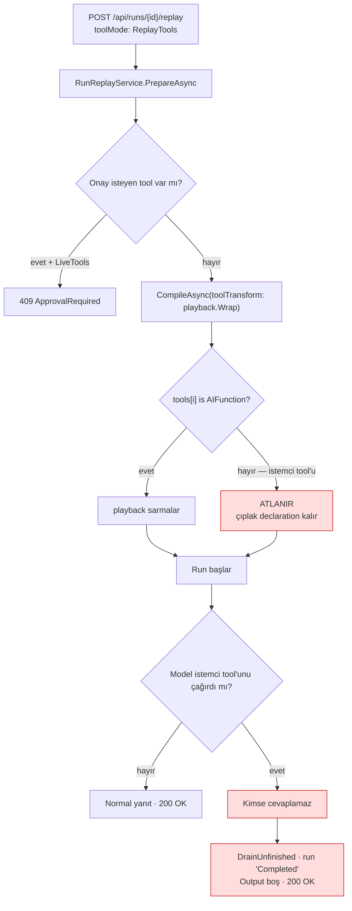

# Faz 112 — Replay'in İstemci Tool Sözleşmesi

> **Durum:** 📋 Planlandı (2026-08-26)
> **Kaynak:** [ADAYLAR.md](ADAYLAR.md) · **F-109**
> **Önkoşul:** Faz 61 (istemci tool'ları, K-435) ve Faz 47 (replay, K-315) — ikisi de arşivde; yalnız aşağıdaki grep'lerle okunur
> **Paketler:** `AgentPrism.Core` (`Replay/`), `AgentPrism.AspNetCore` (`Endpoints/RunEndpoints.cs`)
> **Yeni paket:** Yok · **Migration:** Yok
> **Public API:** Büyüyor — `RunReplayOutcome`'a bir üye. Faz 7'den önce ucuz: `wc -l src/*/PublicAPI.Shipped.txt` toplamı **17** satır ve her dosya yalnız başlık taşıyor (K-603)
> **Tüketici yüzeyi:** `docs-site/src/content/docs/guides/client-side-tools.md`, `capabilities.md`, `troubleshooting.md`
> · sevk edilen: `RunReplayOutcome` XML dokümanı, replay ucunun `.WithDescription` metni (`api/` ve `http-api/` üretilir)
> **Manuel test alanı:** `docs/manuel-test/26-ISTEMCI-TOOLLARI-VE-GOMULEBILIR.md`

---

## Bu Faza Başlarken

> `faz-baslangic` skill'ini uygula. Aşağıdaki liste o skill'in 2. adımıdır —
> **tamamını değil, yalnız işaret edilen bölümleri oku.**

1. Bu doküman
2. Kararlar — dosyanın tamamını **okuma**, yalnız bu kalemleri grep'le:
   ```bash
   grep -n "K-585\|K-586\|K-603" docs/KARARLAR.md
   grep -n "K-315\|K-435" docs/arsiv/KARARLAR-INDEKS-ARSIV.md
   ```
   **K-315** (replay OTURUMSUZDUR — bu fazın tasarımını belirleyen kısıt),
   **K-435** (`IToolRegistry` `AIFunction`'a değil `AIFunctionDeclaration`'a genişledi — istemci tool'unun gövdesiz olmasının kaynağı),
   **K-585** (`ReplayToolMode`'a dördüncü üye AÇILMADI — bu fazda da açılmaz),
   **K-586** (skill/alt-agent taşıyan agent devam ettirilemez — aynı sınıf sınır),
   **K-603** (`PublicAPI.Shipped.txt` boş; yüzey büyütmek bugün ucuz).
3. Alan hafızası (bu faz iki alana dokunuyor):
   [`hafiza/cekirdek-calistirma.md`](hafiza/cekirdek-calistirma.md) (`RunRecording` zinciri, tool kaydı) ·
   [`hafiza/http-uc-tuzaklari.md`](hafiza/http-uc-tuzaklari.md) (problem details, durum kodu eşlemesi)
4. Gerektiğinde, tamamı değil ilgili bölümü: [`MIMARI.md`](MIMARI.md) — çalıştırma yolu

---

## Amaç

Faz 61 `AddClientTool` ile **sevk edilmiş** bir yetenek getirdi: gövdesi
tarayıcıda çalışan, sunucuda yalnız beyan olarak duran bir tool. Faz 47 replay'i
getirdi ve "her run yeniden oynatılabilir" beklentisini kurdu. İkisi hiç
karşılaşmadı. Bugün istemci tool'u taşıyan bir agent'ın run'ı replay edildiğinde
istek `200 OK` döner, fakat run **sessizce yarım biter** — çünkü çağrıyı
cevaplayacak hiçbir istemci yoktur.

Bu faz o boşluğu bir **açık sözleşme** ile kapatır: replay bu run türünü
çalıştırmaya kalkışmaz, erken ve anlaşılır biçimde reddeder.

- **F-109** — replay ile istemci tool'u arasındaki sözleşmeyi seç ve HTTP,
  replay kaydı ve site anlatısı boyunca tutarlı kıl.

### Bugün ne çalışmıyor — doğrulanmış kanıt

| Kanıt | Gözlem |
|---|---|
| [`AgentDefinitionCompiler.cs:465-478`](../src/AgentPrism.Core/Compilation/AgentDefinitionCompiler.cs) | `toolTransform` yalnız `tools[index] is AIFunction` olanlara uygulanır. İstemci tool'u `AIFunctionDeclaration`'dır; **bilerek** atlanır — sarmalanacak sunucu gövdesi yoktur |
| [`RunReplayService.cs:137-140`](../src/AgentPrism.Core/Replay/RunReplayService.cs) | `ReplayTools` modunda `playback.Wrap` `toolTransform` olarak geçirilir. İstemci tool'u sarmalanmadığı için oynatma defterine **hiç bakılmaz** |
| [`RunReplayService.cs:159-163`](../src/AgentPrism.Core/Replay/RunReplayService.cs) | `ReplayMismatchGuard` yalnız `playback` çağrıldığında tetiklenir. İstemci tool'unda `playback` hiç çağrılmaz → **muhafız da susar** |
| `grep -rn "ClientTool" src/AgentPrism.Core/Replay/` | **Sıfır isabet.** Replay yolunda istemci tool'u için ne kontrol, ne ret, ne uyarı var |
| [`RunRecordingAgent.Completion.cs:57`](../src/AgentPrism.Core/Recording/RunRecordingAgent.Completion.cs) | Cevaplanmamış çağrı `DrainUnfinished("The run ended before the tool result arrived.")` ile kapatılır. Replay run'ı **`Completed` biter**, bir tool kaydı da hatalı görünür |
| [`RunReplayResponse`](../src/AgentPrism.AspNetCore/Contracts/ReplayContracts.cs) | Yanıtta bekleyen tool çağrısı taşıyan **hiçbir alan yok**. Çağıran `200 OK` ve boş `Output` alır; nedenini öğrenemez |

> Kanıtlar 2026-08-26 tarihinde doğrulandı.

### 🚨 Aday metnindeki iddia ölçümle daraldı

`ADAYLAR.md`, F-109'un kapsamını *"kaydedilmiş istemci tool sonucunu tekrar
oynatmak **veya** bu run türünü reddetmek"* diye iki seçenekli yazmıştı.
Ölçüm birinci seçeneği **bugünkü kayıtla imkânsız** buldu:

| Ölçüm | Sonuç |
|---|---|
| [`ToolInvocationTracker.cs:161-190`](../src/AgentPrism.Core/Recording/ToolInvocationTracker.cs) `DrainUnfinished` | İstemci tool'u için yazılan kayıt `Result = null`, `Error = "The run ended before the tool result arrived."` taşır. **Sonuç metni kayıtta yoktur** |
| [`RunRecordingAgent.Persistence.cs:188-194`](../src/AgentPrism.Core/Recording/RunRecordingAgent.Persistence.cs) | `OnCall`/`OnResult` yalnız **yanıt** içeriği üzerinde döner. İstemcinin geri gönderdiği sonuç bir sonraki turun **girdisidir**; hiçbir `ToolInvocationRecord` üretmez |
| [`ClientToolResultResolver.cs:110-145`](../src/AgentPrism.AspNetCore/Internal/ClientToolResultResolver.cs) | Sonuç `ChatMessage(ChatRole.Tool, …)` olarak **oturum geçmişine** yazılır — tek yaşadığı yer orasıdır |
| K-315 | Replay **oturumsuzdur**; oturum geçmişi replay'e taşınmaz |

∴ Oynatma seçeneği yeni bir kalıcılık yolu (istemci sonucunu tool defterine
yazmak) açmadan mümkün değildir. O ayrı ve daha pahalı bir iştir. **Bu faz ret
sözleşmesini kurar.**

---

## 112.1 — Bugünkü akış ve deliğin yeri



Kırmızı yol bir hata **döndürmez**. Tüketici için bu, sessizce yanlış cevaptır.

## 112.2 — Seçilen sözleşme: hazırlıkta erken ret

**Karar (2026-08-26, kullanıcı):** Ret, run hiç başlamadan
`RunReplayService.PrepareAsync` içinde, agent **tanımının** tool listesi
taranarak verilir.

Gerekçe ve kabul edilen bedel:

| Lehine | Aleyhine (bilerek kabul edildi) |
|---|---|
| Run hiç başlamaz; token harcanmaz | Agent istemci tool'u **taşıyor** ama o run'da **çağırmamış** olsa bile replay reddedilir |
| Tek yer, tek kural — `ApprovalRequired` deseninin birebir aynısı | Bazı meşru replay istekleri kapanır |
| Kaynak run'ın tool kaydına bakan alternatif deliği **kapatmıyordu**: yeni sürüm tool'u çağırabilir ve run yine sessizce yarım biterdi | — |

Aleyhine satırı bir kusur değil, **bilinçli muhafazakârlıktır**. Aynı seçim
K-586'da (skill/alt-agent taşıyan agent devam ettirilemez) zaten verilmiştir;
bu faz o çizgiyi sürdürür, yeni bir felsefe açmaz.

### Hangi mod reddedilir

**Üç mod da reddedilir.** İstemci tool'u hiçbir modda çalışamaz:

| Mod | Bugünkü davranış | Bu fazdan sonra |
|---|---|---|
| `ReplayTools` | Sarmalanmaz, sessizce yarım biter | Reddedilir |
| `NoTools` | Tool hiç bağlanmaz — **zaten güvenli** | Reddedilir mi? → **Açık Soru 1** |
| `LiveTools` | Sunucuda gövde yok, çalıştırılamaz | Reddedilir |

## 112.3 — `FindClientTool` — `FindApprovalTool`'un aynadaki eşi

Mevcut yardımcı ([`RunReplayService.cs:288-305`](../src/AgentPrism.Core/Replay/RunReplayService.cs))
birebir kopyalanır; tek fark yüklemdir:

| Mevcut | Yeni |
|---|---|
| `descriptor.RequiresApproval` | `descriptor.RunsOnClient` |

`ToolDescriptor.RunsOnClient` ([`ToolDescriptor.cs:50`](../src/AgentPrism.Abstractions/Tools/ToolDescriptor.cs))
zaten vardır ve `ToolRegistry.cs:166` onu `registration.Function is not AIFunction`
ile doldurur. **Yeni bir tespit mekanizması yazılmaz.**

## 112.4 — İki hazırlık yolu ve ikisinin de kapatılması

`PrepareAsync` iki koldan ilerler; onay kontrolü **ikisinde de** vardır ve
istemci tool kontrolü de ikisine birden girer:

| Kol | Konum | Durum |
|---|---|---|
| Kalıcı tanım | `RunReplayService.cs:126` | `definition.ToolNames` taranır |
| Katalog / kod agent'ı | `RunReplayService.cs:230` | `descriptor.ToolNames` taranır |

🚨 **İkinci kol Faz 47'de yazılmış ve kolayca gözden kaçar.** Yalnız birincisi
kapatılırsa kod tanımlı agent'lar delikte kalır. `faz-uygulama` Adım 4'ün
imza–gövde kuralı burada geçerlidir.

## 112.5 — Neden `ReplayToolMode`'a dördüncü üye eklenmiyor

K-585 bu tartışmayı kapattı: `ReplayToolMode` bir **replay isteğinin**
sözleşmesidir. "İstemci tool'u var" bir istek değil, agent'ın **şeklidir**.
Yeni bilgi `RunReplayOutcome`'a girer — o zaten "bu agent bu koşullarda
replay edilemez" sonuçlarının yaşadığı yerdir.

---

## Planlanan Public API

> Taslak imzalardır. Gerçekleşen imzalar kapanışta ayrı bir bölüme yazılır.

```csharp
// AgentPrism.Core — Replay/RunReplayService.cs
public enum RunReplayOutcome
{
    Ready = 0,
    RunNotFound = 1,
    InputNotFound = 2,
    NotSupported = 3,
    ApprovalRequired = 4,

    /// <summary>
    /// The agent carries a client-side tool (<c>AddClientTool</c>). The tool
    /// has no server-side body and no recorded result, so no replay mode can
    /// answer a call to it.
    /// </summary>
    ClientToolNotReplayable = 5,
}
```

Yeni tip, yeni arayüz veya yeni ayar **yoktur**. Yüzey tek bir enum üyesi
kadar büyür.

### HTTP `endpoint`'leri

Yeni uç yok. Mevcut ucun bir sonucu eklenir:

| Metot | Yol | Rol | Ne yapar |
|---|---|---|---|
| `POST` | `/api/runs/{runId:guid}/replay` | Operator (`LiveTools` için Admin) | İstemci tool'u taşıyan agent için **`409 Conflict`** döner |

`409` seçimi `ApprovalRequired`'ın eşidir ([`RunEndpoints.cs:509-512`](../src/AgentPrism.AspNetCore/Endpoints/RunEndpoints.cs)):
istek biçimsel olarak geçerlidir, agent'ın şekli çakışır.

🚨 **`switch` ifadesinin `_ =>` kolu bu değişikliği yutar.** Yeni üye için arm
yazılmazsa istek sessizce `400 "Replay not supported"` döner — makul görünen
**yanlış** cevap. Kapanışta bu satır elle doğrulanır.

### Arayüz payı

**Yok.** Sunucu yanıtı çevrilmez (K-232); replay ekranı hata metnini olduğu
gibi gösterir. `locales/en.ts` ve `tr.ts` değişmez. Bugünkü taban çizgisi
ölçüldü: `index-DESnx11L.js.br` = 148 928 B.

---

## Planlanan Dosya Listesi

```
src/AgentPrism.Core/Replay/
└── RunReplayService.cs          (değişir: FindClientTool + iki kol + enum üyesi)

src/AgentPrism.AspNetCore/Endpoints/
└── RunEndpoints.cs              (değişir: switch arm + .WithDescription metni)

tests/AgentPrism.Core.UnitTests/Replay/
└── ReplayClientToolContractTests.cs        (yeni)

tests/AgentPrism.AspNetCore.FunctionalTests/
└── ReplayClientToolEndpointTests.cs        (yeni)
```

---

## Hata Modları ve Testler

> Mutlu yoldan değil, **ne bozulabilir**den türetilir. Seviyeyi plan seçer.
> Sınır geçen davranış (DI · HTTP · kiracı · akış · depo · paket) birim
> testiyle kanıtlanamaz — [`.agents/ortak/test-seviyeleri.md`](../.agents/ortak/test-seviyeleri.md).

| Ne bozulabilir | Seviye | Test sınıfı |
|---|---|---|
| İstemci tool'u taşıyan agent yine replay edilir ve run sessizce yarım biter | Fonksiyonel (HTTP sınırı) | `ReplayClientToolEndpointTests` |
| Yalnız kalıcı tanım kolu kapatılır; **kod tanımlı** agent delikte kalır | Fonksiyonel | `ReplayClientToolEndpointTests` (katalog kolu ayrı case) |
| `switch` `_ =>` koluna düşer; `409` yerine `400` döner | Fonksiyonel | `ReplayClientToolEndpointTests` (durum kodu iddiası) |
| Sunucu tool'u taşıyan agent yanlışlıkla reddedilir (yanlış pozitif) | Birim | `ReplayClientToolContractTests` |
| Hiç tool taşımayan agent reddedilir | Birim | `ReplayClientToolContractTests` |
| Başka kiracının run'ı üzerinden istemci tool'u bilgisi sızar | Sözleşme (`TenantIsolationContract`) | dört koşumda birden |
| Replay isteği iptal edilirse ret yolu `OperationCanceledException` yutar | Birim | `ReplayClientToolContractTests` |
| MCP kaynaklı declaration-only tool `RunsOnClient` işaretlenir ve yanlışlıkla reddedilir | Birim | `ReplayClientToolContractTests` — 🚨 `McpTenantTools.cs:137` de `is not AIFunction` kullanıyor; **ölçülmeli** |

Beş sorunun cevabı: **iptal** → ret yolu `async` değil, token yalnız depo
çağrısına geçer · **eşzamanlılık** → hazırlık salt okunurdur, paylaşılan durum
yok · **boş/aşırı girdi** → `ToolNames.Count == 0` erken çıkar · **başka
kiracı** → `PrepareAsync` zaten kiracı süzer (`RunNotFound`), sözleşme testi
bunu sabitler · **alt sistem hatası** → `_tools.List()` boş dönerse ret
tetiklenmez ve eski davranışa düşer; bu **kabul edilir**, çünkü tool kaydı
yoksa agent zaten derlenemez.

---

## Manuel Kabul Case'leri

> Kapanışta `docs/manuel-test/26-ISTEMCI-TOOLLARI-VE-GOMULEBILIR.md` içine
> eklenecek case'lerin taslağı.

| # | Ön koşul | Adımlar | Beklenen sonuç |
|---|---|---|---|
| 1 | `AddClientTool` ile bir tool kayıtlı, agent onu taşıyor, tamamlanmış bir run var | `POST /api/runs/{id}/replay` `{"toolMode":"ReplayTools"}` | `409`; `detail` tool adını ve nedeni yazar |
| 2 | Aynı agent | `{"toolMode":"LiveTools"}` (Admin) | `409`, aynı gerekçe |
| 3 | Yalnız sunucu tool'u taşıyan agent | `{"toolMode":"ReplayTools"}` | `200`; replay eskisi gibi çalışır — **gerileme yok** |
| 4 | Kod tanımlı (katalog) agent, istemci tool'u taşıyor | Aynı istek | `409` — katalog kolu da kapalı |
| 5 | Hiç tool taşımayan agent | Aynı istek | `200` |
| 6 | Arayüz: run detayında "Replay" düğmesi | İstemci tool'lu run'da tıkla | Sunucunun `detail` metni hata olarak gösterilir; ekran boş kalmaz 👤 insan gerekir |

---

## Açık Sorular

> Planı bloklamayan, faz uygulanırken karara bağlanacak sorular.

| # | Soru | Seçenekler | Öneri |
|---|---|---|---|
| 1 | `NoTools` modu da reddedilsin mi? O modda tool hiç bağlanmaz, yani teknik olarak güvenlidir | A: Üç modu da reddet · B: Yalnız `ReplayTools`/`LiveTools`'u reddet, `NoTools`'a izin ver | **A.** `NoTools` replay'i tool'suz bir dünyayı ölçer; istemci tool'u davranışın **belirleyici** parçasıysa sonuç kaynak run'la kıyaslanabilir değildir. Tek kural açıklaması kolaydır; iki kural "hangi modda ne olur" tablosu ister |
| 2 | MCP kaynaklı tool `registration.Function is not AIFunction` ile `RunsOnClient = true` alabiliyor mu? (`McpTenantTools.cs:137`) | — | **Ölçülmeli.** `McpClientTool : AIFunction` olduğu `McpTenantTools.cs:74` yorumunda yazıyor, yani beklenen cevap "hayır". İddia doğrulanmadan koda güvenilmez |
| 3 | Ret metni tool adını yazsın mı? | A: Yazsın · B: Yalnız "bir istemci tool'u" desin | **A.** `ApprovalRequired` de adı yazıyor; tool adı zaten agent tanımında görünür, yeni bilgi sızdırmaz |

---

## Bitiş Ölçütleri (DoD)

- [ ] İstemci tool'u taşıyan bir agent'ın run'ına `POST /api/runs/{id}/replay` → `409`, `detail` tool adını içerir (üç `ToolMode` için de)
- [ ] Yalnız sunucu tool'u taşıyan agent için replay eskisi gibi `200` döner — gerileme yok
- [ ] Kod tanımlı (katalog) agent kolu da `409` döner
- [ ] `RunReplayOutcome.ClientToolNotReplayable` için `RunEndpoints` `switch`'inde **açık** bir arm var; `_ =>` koluna düşmüyor
- [ ] Dört doğrulama kapısı sıfır uyarı verir
- [ ] `samples/AgentPrism.Api` ile gerçek `run` yapıldı, çıktı belgeye yazıldı
- [ ] `secret` taraması boş döndü
- [ ] Manuel kabul case'leri `docs/manuel-test/26-ISTEMCI-TOOLLARI-VE-GOMULEBILIR.md` içine eklendi; otomatikleştirilebilenler koşuldu
- [ ] `faz-denetim` koşuldu; 🔴 bulgu kalmadı
- [ ] `docs-site/` güncellendi (`guides/client-side-tools.md` replay sınırını yazar, `capabilities.md` satırı düzeltilir); `npm run build` + `check-links.mjs` temiz
- [ ] OpenAPI belgesi yeniden üretildi ve TS şeması + NSwag istemcisi + `@agentprism/client` `dist`'i zinciri koşuldu (K-627'nin dört adımlı zinciri)

### Doğrulama komutları

```bash
# İstemci tool'lu agent'ın run'ı replay edilemez
curl -si -X POST http://localhost:5081/agentprism/api/runs/$RUN_ID/replay \
  -H 'Content-Type: application/json' -d '{"toolMode":"ReplayTools"}' | head -1
# beklenen: HTTP/1.1 409 Conflict

# Sunucu tool'lu agent'ta gerileme yok
curl -si -X POST http://localhost:5081/agentprism/api/runs/$SERVER_RUN_ID/replay \
  -H 'Content-Type: application/json' -d '{"toolMode":"ReplayTools"}' | head -1
# beklenen: HTTP/1.1 200 OK
```

---

## Riskler

| Risk | Önlem |
|------|-------|
| Yalnız bir hazırlık kolu kapatılır; kod tanımlı agent delikte kalır | Her iki kol için ayrı fonksiyonel test; DoD'de ayrı satır |
| `switch`'in `_ =>` kolu yeni üyeyi yutar ve `400` döner | Test durum kodunu iddia eder; DoD'de ayrı satır |
| Ret fazla geniş olur ve tool'u çağırmayan meşru replay'ler kapanır | Bilinçli kabul edildi (112.2); site sayfası bu sınırı **açıkça** yazar |
| MCP declaration'ları yanlışlıkla istemci tool'u sayılır | Açık Soru 2 ölçülmeden kod yazılmaz |
| Üretilmiş yüzeyler (OpenAPI/TS/NSwag/`dist`) güncellenmez ve frontend `tsc` kırmızı kalır | K-627'nin dört adımlı zinciri DoD'de |

---

<!-- ============================================================
     AŞAĞISI KAPANIŞTA DOLDURULUR — `faz-tamamlama` skill'i.
     Plan anında boş kalır. Başlıkları SİLME.
     ============================================================ -->

## Plandan Sapmalar

> Kapanışta doldurulur.

## Bu Fazda Verilen Kararlar

> Kapanışta doldurulur. K-NNN numaraları burada alınır; plan numara rezerve etmez.

## Gerçekleşen Public API

> Kapanışta doldurulur.

## Dosya Listesi (gerçekleşen)

> Kapanışta doldurulur.

## Denetim Bulguları

> Kapanışta doldurulur — `faz-denetim` çıktısı.

## Sonraki Faza Devir Notu

> Kapanışta doldurulur.
