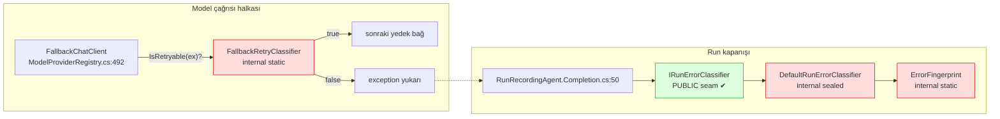

# Faz 113 — Sağlayıcı Arıza Sınıflandırmasının Genişleme Noktası

> **Durum:** 📋 Planlandı (2026-08-26)
> **Kaynak:** [ADAYLAR.md](ADAYLAR.md) · **F-149**
> **Önkoşul:** Faz 44 (hata sınıflandırma) ve Faz 62 (model yedek zinciri) — ikisi de arşivde; yalnız aşağıdaki grep'lerle okunur
> **Paketler:** `AgentPrism.Abstractions` (yeni sözleşme), `AgentPrism.Core` (`Models/`, `Runs/`)
> **Yeni paket:** Yok · **Migration:** Yok
> **Public API:** Büyüyor — bir arayüz, bir enum, bir tipin görünürlüğü. Faz 7'den önce ucuz: `wc -l src/*/PublicAPI.Shipped.txt` toplamı **17** satır ve her dosya yalnız başlık taşıyor (K-603)
> **Tüketici yüzeyi:** `docs-site/src/content/docs/guides/reliability.md`, `guides/model-providers.md`, `concepts/runs.md`
> · sevk edilen: yeni tiplerin XML `<example>`'ları; `write-your-own-*` ailesine bir sayfa (bkz. Açık Soru 3)
> **Manuel test alanı:** `docs/manuel-test/27-MODEL-YEDEK-VE-ON-UCUS.md` · `docs/manuel-test/12-GOZLEMLENEBILIRLIK-MALIYET.md`

---

## Bu Faza Başlarken

> `faz-baslangic` skill'ini uygula. Aşağıdaki liste o skill'in 2. adımıdır —
> **tamamını değil, yalnız işaret edilen bölümleri oku.**

1. Bu doküman
2. Kararlar — dosyanın tamamını **okuma**, yalnız bu kalemleri grep'le:
   ```bash
   grep -n "K-603\|K-627" docs/KARARLAR.md
   ```
   **K-603** (`PublicAPI.Shipped.txt` boş; yüzey büyütmek bugün ucuz),
   **K-627** (üreticisi olmayan beyan kaldırıldı — bu faz **tersini** yapar:
   var olan davranışa sözleşme verir, olmayan davranışa beyan **eklemez**).
3. Alan hafızası (bu faz iki alana dokunuyor):
   [`hafiza/model-boru-hatti.md`](hafiza/model-boru-hatti.md) (`IChatClient` dekoratör halkaları, devre kesici — bu fazın ana alanı) ·
   [`hafiza/cekirdek-calistirma.md`](hafiza/cekirdek-calistirma.md) (`RunRecording` zinciri; sınıflandırıcı yalnız hata yolunda çağrılır)
4. Gerektiğinde, tamamı değil ilgili bölümü:
   [`MAF-GENISLEME-NOKTALARI.md`](MAF-GENISLEME-NOKTALARI.md) (`DelegatingChatClient` halkası)

---

## Amaç

AgentPrism sağlayıcı arızasını iki ayrı yerde ve iki ayrı amaçla sınıflandırır:
**yedek zincirine geçilsin mi** (retry) ve **run hangi hata sınıfına yazılsın**
(taksonomi). İkisi de exception tipinin **adı** ve mesajdaki **HTTP metni**
üzerinden regex ile karar verir. Üçüncü taraf bir sağlayıcı bu metni taşımıyorsa
karar sessizce yanlış olur ve tüketicinin düzeltebileceği hiçbir nokta yoktur.

Bu faz o iki kararı **değiştirilebilir** kılar; varsayılan davranışı korur.

- **F-149** — retry sınıflandırmasına bir genişleme noktası açar ve hata
  sınıflandırmasının yerleşik kurallarını tüketicinin **devralabileceği** hâle
  getirir.

### Bugün ne çalışmıyor — doğrulanmış kanıt

| Kanıt | Gözlem |
|---|---|
| [`FallbackChatClient.cs:350`](../src/AgentPrism.Core/Models/FallbackChatClient.cs) | `FallbackRetryClassifier` **`internal static partial class`**. Ne kaydı, ne türevi, ne parametresi var — değiştirilemez |
| [`FallbackChatClient.cs:122`](../src/AgentPrism.Core/Models/FallbackChatClient.cs) · [`:191`](../src/AgentPrism.Core/Models/FallbackChatClient.cs) | Çağrılar `catch (Exception ex) when (!FallbackRetryClassifier.IsRetryable(ex))` biçiminde **statik** ve sabit |
| [`FallbackChatClient.cs:386-410`](../src/AgentPrism.Core/Models/FallbackChatClient.cs) | Karar dört regex ve bir tip-adı deseniyle verilir: `AuthenticationStatusPattern`, `RateLimitPattern`, `RetryableHttpStatusPattern`, `TransportExceptionTypePattern` |
| [`DefaultRunErrorClassifier.cs:29`](../src/AgentPrism.Core/Runs/DefaultRunErrorClassifier.cs) | **`internal sealed partial class`** — `IRunErrorClassifier`'ı devralan tüketici yerleşik kuralları çağıramaz, hepsini sıfırdan yazmak zorundadır |
| [`ErrorFingerprint.cs:26`](../src/AgentPrism.Core/Runs/ErrorFingerprint.cs) | **`internal static partial class`** — `RunErrorClassification.Fingerprint` zorunlu bir alandır, fakat tüketici yerleşikle **uyumlu** bir parmak izi üretemez |

> Kanıtlar 2026-08-26 tarihinde doğrulandı.

### 🚨 Aday metnindeki iddia ölçümle kısmen çürüdü

`ADAYLAR.md`, F-149'u *"`TryAdd*` ile değiştirilebilir bir failure-classification
seam'i **tasarla**"* diye yazmıştı. Ölçüm o seam'in **yarısının zaten var
olduğunu** buldu:

```
src/AgentPrism.Abstractions/Runs/IRunErrorClassifier.cs:17     public interface IRunErrorClassifier
AgentPrismServiceCollectionExtensions.Registration.Core.cs:112 services.TryAddSingleton<IRunErrorClassifier, DefaultRunErrorClassifier>();
```

Arayüzün kendi XML dokümanı bunu açıkça ilan ediyor: *"Registered with
`TryAddSingleton`, so the consumer's registration wins."* K4 zaten karşılanmış.

∴ Fazın kapsamı **yeni bir seam icat etmek değildir**. Ölçülen üç somut boşluk
şudur:

| # | Boşluk | Bugünkü sonuç |
|---|---|---|
| **A** | Retry sınıflandırmasının **hiç** genişleme noktası yok | Üçüncü taraf sağlayıcının geçici arızası yedek zincirini tetiklemez; run düşer |
| **B** | Hata sınıflandırması **toptan ya da hiç** | Tek bir sağlayıcı kuralı eklemek isteyen tüketici on üç yerleşik kuralı yeniden yazar |
| **C** | Parmak izi hesabı erişilemez | Kendi sınıflandırıcısını yazan tüketicinin run'ları yerleşiklerden **farklı kümelenir**; `RunErrorStatistics` bölünür |

**Karar (2026-08-26, kullanıcı):** Üçü de bu fazın kapsamındadır.

---

## 113.1 — İki sınıflandırıcı, iki farklı soru



Yeşil kutu **zaten değiştirilebilir**. Üç kırmızı kutu bu fazın işidir.

## 113.2 — Boşluk A: retry için genişleme noktası

`FallbackRetryClassifier`'ın bugünkü davranışı **korunur** ve varsayılan
uygulama olarak kalır. Değişen tek şey, kararın bir sözleşme üzerinden
sorulmasıdır.

🚨 **Karar üç durumludur, `bool` değildir.** Gerekçe koddadır
([`FallbackChatClient.cs:344-348`](../src/AgentPrism.Core/Models/FallbackChatClient.cs)):

> *"The list is a closed, positive set: an unrecognized failure does **not**
> retry by default. A silent provider switch on an error nobody anticipated is
> a worse outcome than surfacing the error."*

`bool` dönen bir sözleşme, tüketicinin sınıflandırıcısını **her** exception
için karar vermeye zorlar. Kendi SDK'sı için tek bir kural eklemek isteyen
tüketici, tanımadığı her arızada da bir taraf seçmek zorunda kalır ve yukarıdaki
kapalı-küme garantisi sessizce kırılır. Üç durumlu karar `Unknown` diyebilmeyi
verir; AgentPrism o durumda kendi yerleşik kuralına düşer.

## 113.3 — Boşluk B ve C: yerleşiğin devralınabilmesi

Tüketici kendi sınıflandırıcısını yazarken yerleşik olanı **kompozisyonla**
kullanabilmelidir. Kalıtım değil kompozisyon seçilir: repo `sealed` tipleri
tercih eder ve paralel bir tip hiyerarşisi kurmaz (K3'ün aynı ruhu).

```csharp
// Tüketicinin yazacağı kod — hedeflenen deneyim
internal sealed class AcmeErrorClassifier(DefaultRunErrorClassifier builtIn)
    : IRunErrorClassifier
{
    public RunErrorClassification Classify(RunError runError)
        => runError.Type.Contains("Acme.Sdk.ThrottledException", StringComparison.Ordinal)
            ? new RunErrorClassification
            {
                Class = RunErrorClass.RateLimited,
                Fingerprint = RunErrorFingerprint.Compute(runError.Message),
            }
            : builtIn.Classify(runError);   // ← bugün MÜMKÜN DEĞİL
}
```

Bu deneyim üç görünürlük değişikliği ister: yerleşik sınıflandırıcı, parmak izi
hesabı ve ikisinin kurucusu. Yeni **kavram** eklenmez.

## 113.4 — Core'a sağlayıcı SDK bağımlılığı eklenmez

`ADAYLAR.md` bunu zaten sınırlamıştı ve sınır **korunur**. Tüketicinin kendi
SDK exception'ını tipli ele alması, kendi paketinde yazdığı sınıflandırıcıyla
olur. `AgentPrism.Core` yeni bir sağlayıcı paketi referansı **almaz**;
`AotCompatible` listesi değişmez.

## 113.5 — Kayıt ve varsayılan

Her iki nokta da `TryAdd*` ile kaydedilir (K4). Genişleme noktası **varsayılan
kapalı** anlamına burada "yerleşik davranış aynen sürer" olarak yerleşir (K1):
tüketici hiçbir şey kaydetmezse bugünkü retry ve taksonomi kararları
**bit-bit aynı** kalır. Bunu bir gerileme testi sabitler.

---

## Planlanan Public API

> Taslak imzalardır. Gerçekleşen imzalar kapanışta ayrı bir bölüme yazılır.

```csharp
// AgentPrism.Abstractions — Providers/
/// <summary>Whether a provider failure should move to the next fallback link.</summary>
public enum ProviderRetryDecision
{
    /// <summary>No opinion; the built-in rules decide.</summary>
    Unknown = 0,

    /// <summary>Try the next fallback link.</summary>
    Retry = 1,

    /// <summary>Do not switch providers; surface the error.</summary>
    DoNotRetry = 2,
}

/// <summary>Decides whether a provider failure is retryable on another link.</summary>
public interface IProviderRetryClassifier
{
    /// <summary>Classifies the failure. Return <see cref="ProviderRetryDecision.Unknown"/>
    /// to defer to AgentPrism's built-in rules.</summary>
    ProviderRetryDecision Classify(Exception exception);
}
```

```csharp
// AgentPrism.Core — Runs/  (görünürlük değişikliği; davranış değişmez)
public sealed class DefaultRunErrorClassifier : IRunErrorClassifier
{
    public DefaultRunErrorClassifier() { }
    public RunErrorClassification Classify(RunError runError);
}

/// <summary>Produces the clustering digest AgentPrism's built-in classifier uses.</summary>
public static class RunErrorFingerprint
{
    public static string Compute(string? message);
}
```

`ModelProviderRegistry`'nin kurucusuna sona bir isteğe bağlı parametre eklenir
(`IProviderRetryClassifier? retryClassifier = null`) — tipin bugünkü on iki
isteğe bağlı parametreli deseni ([`ModelProviderRegistry.cs:93-105`](../src/AgentPrism.Core/Models/ModelProviderRegistry.cs))
korunur.

### HTTP `endpoint`'leri

**Yok.** Bu faz hiçbir HTTP yüzeyine dokunmaz. `RunErrorClass` değerleri ve
`runs.error_class` sözleşmesi **değişmez** — yalnız kararı kimin verdiği
değiştirilebilir hâle gelir.

### Arayüz payı

**Yok.** Ekran metni eklenmez, `locales/en.ts` ve `tr.ts` değişmez. Bugünkü
taban çizgisi ölçüldü: `index-DESnx11L.js.br` = 148 928 B.

---

## Planlanan Dosya Listesi

```
src/AgentPrism.Abstractions/Providers/
├── IProviderRetryClassifier.cs             (yeni)
└── ProviderRetryDecision.cs                (yeni)

src/AgentPrism.Core/Models/
├── FallbackChatClient.cs                   (değişir: sözleşmeyi sorar, yerleşiğe düşer)
└── ModelProviderRegistry.cs                (değişir: isteğe bağlı parametre + akış)

src/AgentPrism.Core/Runs/
├── DefaultRunErrorClassifier.cs            (değişir: public sealed)
├── ErrorFingerprint.cs                     (değişir: public facade — bkz. Açık Soru 2)
└── DefaultProviderRetryClassifier.cs       (yeni: FallbackRetryClassifier'ın taşınmış hâli)

src/AgentPrism.Core/
└── AgentPrismServiceCollectionExtensions.Registration.Core.cs   (değişir: TryAddSingleton)

tests/AgentPrism.Core.UnitTests/Providers/
├── ProviderRetryClassifierSeamTests.cs     (yeni)
└── RunErrorClassifierCompositionTests.cs   (yeni)

tests/AgentPrism.Core.UnitTests/Models/
└── FallbackRetryRegressionTests.cs         (yeni: bugünkü karar tablosu bit-bit sabitlenir)
```

---

## Hata Modları ve Testler

> Mutlu yoldan değil, **ne bozulabilir**den türetilir. Seviyeyi plan seçer.
> Sınır geçen davranış (DI · HTTP · kiracı · akış · depo · paket) birim
> testiyle kanıtlanamaz — [`.agents/ortak/test-seviyeleri.md`](../.agents/ortak/test-seviyeleri.md).

| Ne bozulabilir | Seviye | Test sınıfı |
|---|---|---|
| Seam eklenirken bugünkü retry kararları kayar (sessiz gerileme) | Birim | `FallbackRetryRegressionTests` — bugünkü dört desenin karar tablosu **önce** yazılır |
| `Unknown` dönen tüketici sınıflandırıcısı yerleşiğe düşmez | Birim | `ProviderRetryClassifierSeamTests` |
| `OperationCanceledException` seam üzerinden retry'a dönüşür (iptal sızıntısı) | Birim | `ProviderRetryClassifierSeamTests` — 🚨 iptal kontrolü bugün **her şeyden önce** koşuyor; seam onu **geçemez** |
| Tüketici kaydı kazanmaz (`TryAdd*` yerine `Add*` yazılır) | Fonksiyonel (DI sınırı) | `AgentPrismServiceCollectionTests` |
| Tüketici sınıflandırıcısı exception atar ve run yolu düşer | Birim | `ProviderRetryClassifierSeamTests` — gözlemlenebilirlik işlevselliği bozmaz kuralı |
| Kompozisyonla yazılan sınıflandırıcı yerleşikten **farklı** parmak izi üretir | Birim | `RunErrorClassifierCompositionTests` |
| Yedek zinciri gerçek bir sağlayıcı hatasında akışlı yolda çalışmaz | Fonksiyonel (akış sınırı) | mevcut `FallbackChatClient` fonksiyonel testleri genişletilir |
| `IRunErrorClassifier`'ı devralan tüketici `WorkflowNodeRetry`'ı sessizce değiştirir | Fonksiyonel | `WorkflowNodeRetry` testi — 🚨 `WorkflowNodeRetry.cs:53` **aynı** seam'i kullanıyor; kapsam genişlemesi ölçülmeli |

Beş sorunun cevabı: **iptal** → `OperationCanceledException` kontrolü seam'in
**üstünde** kalır, tüketici onu geçersiz kılamaz · **eşzamanlılık** →
sınıflandırıcılar durumsuzdur ve singleton kaydedilir; test bunu iddia eder ·
**boş/aşırı girdi** → `RunError.Message` boş ve çok uzun için ayrı case ·
**başka kiracı** → sınıflandırma kiracı verisi taşımaz; yeni sınır yok ·
**alt sistem hatası** → tüketicinin sınıflandırıcısı atarsa yerleşiğe düşülür
ve hata loglanır, run **durmaz**.

---

## Manuel Kabul Case'leri

> Kapanışta `docs/manuel-test/27-MODEL-YEDEK-VE-ON-UCUS.md` ve
> `docs/manuel-test/12-GOZLEMLENEBILIRLIK-MALIYET.md` içine eklenecek taslak.

| # | Ön koşul | Adımlar | Beklenen sonuç |
|---|---|---|---|
| 1 | Hiçbir özel sınıflandırıcı kayıtlı değil; birincil sağlayıcı `429` veriyor, yedek bağ tanımlı | Agent'ı çalıştır | Yedek bağ devreye girer — **bugünkü davranış aynen** |
| 2 | Aynı kurulum; `IProviderRetryClassifier` kayıtlı ve `DoNotRetry` dönüyor | Agent'ı çalıştır | Yedek bağa **geçilmez**; hata yüzeye çıkar |
| 3 | Tüketici sınıflandırıcısı `Unknown` dönüyor | `429` üret | Yerleşik kural devreye girer; yedek bağ çalışır |
| 4 | Kompozisyonla yazılmış `IRunErrorClassifier` kayıtlı (kendi kuralı + yerleşiğe düşüş) | Bilinen bir timeout hatası üret | `runs.error_class` = `Timeout` — yerleşik kural devralınmış |
| 5 | Aynı kurulum | Aynı hatayı iki kez üret | İki run **aynı** `fingerprint` altında kümelenir |
| 6 | Tüketici sınıflandırıcısı bilerek exception atıyor | Herhangi bir hata üret | Run tamamlanır, sınıf yerleşikten gelir, hata loglanır 👤 insan gerekir (log gözü) |

---

## Açık Sorular

> Planı bloklamayan, faz uygulanırken karara bağlanacak sorular.

| # | Soru | Seçenekler | Öneri |
|---|---|---|---|
| 1 | `IProviderRetryClassifier` `Abstractions`'a mı `Core`'a mı? | A: `Abstractions` · B: `Core` | **A.** `IRunErrorClassifier` zaten `Abstractions/Runs/` altında; kardeşi ayrı pakette yaşarsa tüketici iki paket referansı öğrenir |
| 2 | Parmak izi nasıl açılır? | A: `ErrorFingerprint`'i public yap · B: yeni public `RunErrorFingerprint` facade'ı, internal hesap yerinde kalır | **B.** `ErrorFingerprint` `partial` ve `GeneratedRegex` taşıyor; iç detayını sözleşmeye çevirmek yerine ince bir yüzey açmak sonradan daha ucuzdur |
| 3 | `docs-site`'a `write-your-own-error-classifier.md` açılsın mı? | A: Açılsın · B: `guides/reliability.md`'ye bölüm | **A.** `write-your-own-store` · `-tool` · `-judge` · `-agent-source` ailesi zaten var; bu kalem tam o desenin üyesidir |
| 4 | `WorkflowNodeRetry` aynı seam'i kullanıyor — tüketici sınıflandırıcısı workflow retry'ını da değiştirmeli mi? | A: Evet, tek taksonomi tek yerden · B: Workflow'a ayrı bir kapı | **A**, fakat **ölçülmeli**: `WorkflowNodeRetry.cs:25-53` gerçekten `IRunErrorClassifier` alıyor mu, yoksa yalnız `RunErrorClass` mı okuyor? Doğrulanmadan yazılmaz |

---

## Bitiş Ölçütleri (DoD)

- [ ] Hiçbir sınıflandırıcı kaydedilmemiş bir kurulumda retry ve hata sınıfı kararları **bit-bit bugünküyle aynı** (`FallbackRetryRegressionTests` yeşil)
- [ ] `IProviderRetryClassifier` kaydeden tüketicinin kararı yedek zincirini yönetir; `Unknown` yerleşiğe düşer
- [ ] `OperationCanceledException` hiçbir tüketici sınıflandırıcısı tarafından retry'a çevrilemez
- [ ] `DefaultRunErrorClassifier` kompozisyonla çağrılabilir; kompozisyonla üretilen parmak izi yerleşikle **aynı** kümeye düşer
- [ ] Tüketici sınıflandırıcısı exception atarsa run **durmaz**; yerleşiğe düşülür ve hata loglanır
- [ ] Her iki nokta `TryAdd*` ile kayıtlı; tüketicinin kaydı kazanır
- [ ] `AgentPrism.Core` yeni bir sağlayıcı SDK referansı **almadı** (`grep -c PackageReference src/AgentPrism.Core/*.csproj` değişmedi)
- [ ] Dört doğrulama kapısı sıfır uyarı verir
- [ ] `samples/AgentPrism.Api` ile gerçek `run` yapıldı, çıktı belgeye yazıldı
- [ ] `secret` taraması boş döndü
- [ ] Manuel kabul case'leri iki alan dosyasına eklendi; otomatikleştirilebilenler koşuldu
- [ ] `faz-denetim` koşuldu; 🔴 bulgu kalmadı
- [ ] `docs-site/` güncellendi; `npm run build` + `check-links.mjs` temiz

### Doğrulama komutları

```bash
# Core'a sağlayıcı SDK sızmadı
grep -n "PackageReference" src/AgentPrism.Core/AgentPrism.Core.csproj

# AOT listesi değişmedi
grep -l "AotCompatible>false" src/*/*.csproj
```

---

## Riskler

| Risk | Önlem |
|------|-------|
| Seam eklenirken bugünkü retry davranışı sessizce kayar | Karar tablosunu sabitleyen gerileme testi **koddan önce** yazılır |
| Fazla genel bir soyutlama dört yerleşik sağlayıcıyı karmaşıklaştırır | Yeni **kavram** eklenmez: bir arayüz, bir enum, iki görünürlük değişikliği. Yeni ayar, yeni kayıt sırası, yeni yaşam döngüsü yok |
| Üç durumlu karar `bool` sanılıp iki durumlu yazılır ve kapalı-küme garantisi kırılır | `Unknown` için ayrı birim testi; DoD'de ayrı satır |
| `IRunErrorClassifier`'ı devralmak workflow retry'ını da sessizce değiştirir | Açık Soru 4 ölçülür; sonuç site sayfasına yazılır |
| `internal` tipleri public yapmak 1.0 sonrası geri alınamaz | Faz 7'den önce yapılıyor; `PublicAPI.Shipped.txt` boş (ölçüldü: 17 satır, yalnız başlıklar) |

---

<!-- ============================================================
     AŞAĞISI KAPANIŞTA DOLDURULUR — `faz-tamamlama` skill'i.
     Plan anında boş kalır. Başlıkları SİLME.
     ============================================================ -->

## Plandan Sapmalar

> Kapanışta doldurulur.

## Bu Fazda Verilen Kararlar

> Kapanışta doldurulur. K-NNN numaraları burada alınır; plan numara rezerve etmez.

## Gerçekleşen Public API

> Kapanışta doldurulur.

## Dosya Listesi (gerçekleşen)

> Kapanışta doldurulur.

## Denetim Bulguları

> Kapanışta doldurulur — `faz-denetim` çıktısı.

## Sonraki Faza Devir Notu

> Kapanışta doldurulur.
