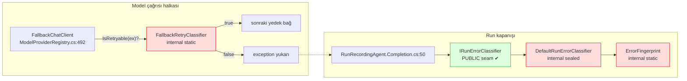

# Faz 113 — Sağlayıcı Arıza Sınıflandırmasının Genişleme Noktası

> **Durum:** ✅ Tamamlandı (2026-08-26)
> **Kaynak:** [ADAYLAR.md](ADAYLAR.md) · **F-149**
> **Önkoşul:** Faz 44 (hata sınıflandırma) ve Faz 62 (model yedek zinciri) — ikisi de arşivde; yalnız aşağıdaki grep'lerle okunur
> **Paketler:** `AgentPrism.Abstractions` (yeni sözleşme), `AgentPrism.Core` (`Models/`, `Runs/`)
> **Yeni paket:** Yok · **Migration:** Yok
> **Public API:** Büyüyor — bir arayüz, bir enum, bir tipin görünürlüğü. Faz 7'den önce ucuz: `wc -l src/*/PublicAPI.Shipped.txt` toplamı **17** satır ve her dosya yalnız başlık taşıyor (K-603)
> **Tüketici yüzeyi:** `docs-site/src/content/docs/guides/reliability.md`, `guides/model-providers.md`, `concepts/runs.md`
> · sevk edilen: yeni tiplerin XML `<example>`'ları; `write-your-own-*` ailesine bir sayfa (bkz. Açık Soru 3)
> **Manuel test alanı:** `docs/manuel-test/27-MODEL-YEDEK-VE-ON-UCUS.md` · `docs/manuel-test/12-GOZLEMLENEBILIRLIK-MALIYET.md`

---

## Bu Faza Başlarken

> `faz-baslangic` skill'ini uygula. Aşağıdaki liste o skill'in 2. adımıdır —
> **tamamını değil, yalnız işaret edilen bölümleri oku.**

1. Bu doküman
2. Kararlar — dosyanın tamamını **okuma**, yalnız bu kalemleri grep'le:
   ```bash
   grep -n "K-603\|K-627" docs/KARARLAR.md
   ```
   **K-603** (`PublicAPI.Shipped.txt` boş; yüzey büyütmek bugün ucuz),
   **K-627** (üreticisi olmayan beyan kaldırıldı — bu faz **tersini** yapar:
   var olan davranışa sözleşme verir, olmayan davranışa beyan **eklemez**).
3. Alan hafızası (bu faz iki alana dokunuyor):
   [`hafiza/model-boru-hatti.md`](hafiza/model-boru-hatti.md) (`IChatClient` dekoratör halkaları, devre kesici — bu fazın ana alanı) ·
   [`hafiza/cekirdek-calistirma.md`](hafiza/cekirdek-calistirma.md) (`RunRecording` zinciri; sınıflandırıcı yalnız hata yolunda çağrılır)
4. Gerektiğinde, tamamı değil ilgili bölümü:
   [`MAF-GENISLEME-NOKTALARI.md`](MAF-GENISLEME-NOKTALARI.md) (`DelegatingChatClient` halkası)

---

## Amaç

AgentPrism sağlayıcı arızasını iki ayrı yerde ve iki ayrı amaçla sınıflandırır:
**yedek zincirine geçilsin mi** (retry) ve **run hangi hata sınıfına yazılsın**
(taksonomi). İkisi de exception tipinin **adı** ve mesajdaki **HTTP metni**
üzerinden regex ile karar verir. Üçüncü taraf bir sağlayıcı bu metni taşımıyorsa
karar sessizce yanlış olur ve tüketicinin düzeltebileceği hiçbir nokta yoktur.

Bu faz o iki kararı **değiştirilebilir** kılar; varsayılan davranışı korur.

- **F-149** — retry sınıflandırmasına bir genişleme noktası açar ve hata
  sınıflandırmasının yerleşik kurallarını tüketicinin **devralabileceği** hâle
  getirir.

### Bugün ne çalışmıyor — doğrulanmış kanıt

| Kanıt | Gözlem |
|---|---|
| [`FallbackChatClient.cs:350`](../src/AgentPrism.Core/Models/FallbackChatClient.cs) | `FallbackRetryClassifier` **`internal static partial class`**. Ne kaydı, ne türevi, ne parametresi var — değiştirilemez |
| [`FallbackChatClient.cs:122`](../src/AgentPrism.Core/Models/FallbackChatClient.cs) · [`:191`](../src/AgentPrism.Core/Models/FallbackChatClient.cs) | Çağrılar `catch (Exception ex) when (!FallbackRetryClassifier.IsRetryable(ex))` biçiminde **statik** ve sabit |
| [`FallbackChatClient.cs:386-410`](../src/AgentPrism.Core/Models/FallbackChatClient.cs) | Karar dört regex ve bir tip-adı deseniyle verilir: `AuthenticationStatusPattern`, `RateLimitPattern`, `RetryableHttpStatusPattern`, `TransportExceptionTypePattern` |
| [`DefaultRunErrorClassifier.cs:29`](../src/AgentPrism.Core/Runs/DefaultRunErrorClassifier.cs) | **`internal sealed partial class`** — `IRunErrorClassifier`'ı devralan tüketici yerleşik kuralları çağıramaz, hepsini sıfırdan yazmak zorundadır |
| [`ErrorFingerprint.cs:26`](../src/AgentPrism.Core/Runs/ErrorFingerprint.cs) | **`internal static partial class`** — `RunErrorClassification.Fingerprint` zorunlu bir alandır, fakat tüketici yerleşikle **uyumlu** bir parmak izi üretemez |

> Kanıtlar 2026-08-26 tarihinde doğrulandı.

### 🚨 Aday metnindeki iddia ölçümle kısmen çürüdü

`ADAYLAR.md`, F-149'u *"`TryAdd*` ile değiştirilebilir bir failure-classification
seam'i **tasarla**"* diye yazmıştı. Ölçüm o seam'in **yarısının zaten var
olduğunu** buldu:

```
src/AgentPrism.Abstractions/Runs/IRunErrorClassifier.cs:17     public interface IRunErrorClassifier
AgentPrismServiceCollectionExtensions.Registration.Core.cs:112 services.TryAddSingleton<IRunErrorClassifier, DefaultRunErrorClassifier>();
```

Arayüzün kendi XML dokümanı bunu açıkça ilan ediyor: *"Registered with
`TryAddSingleton`, so the consumer's registration wins."* K4 zaten karşılanmış.

∴ Fazın kapsamı **yeni bir seam icat etmek değildir**. Ölçülen üç somut boşluk
şudur:

| # | Boşluk | Bugünkü sonuç |
|---|---|---|
| **A** | Retry sınıflandırmasının **hiç** genişleme noktası yok | Üçüncü taraf sağlayıcının geçici arızası yedek zincirini tetiklemez; run düşer |
| **B** | Hata sınıflandırması **toptan ya da hiç** | Tek bir sağlayıcı kuralı eklemek isteyen tüketici on üç yerleşik kuralı yeniden yazar |
| **C** | Parmak izi hesabı erişilemez | Kendi sınıflandırıcısını yazan tüketicinin run'ları yerleşiklerden **farklı kümelenir**; `RunErrorStatistics` bölünür |

**Karar (2026-08-26, kullanıcı):** Üçü de bu fazın kapsamındadır.

---

## 113.1 — İki sınıflandırıcı, iki farklı soru



Yeşil kutu **zaten değiştirilebilir**. Üç kırmızı kutu bu fazın işidir.

## 113.2 — Boşluk A: retry için genişleme noktası

`FallbackRetryClassifier`'ın bugünkü davranışı **korunur** ve varsayılan
uygulama olarak kalır. Değişen tek şey, kararın bir sözleşme üzerinden
sorulmasıdır.

🚨 **Karar üç durumludur, `bool` değildir.** Gerekçe koddadır
([`FallbackChatClient.cs:344-348`](../src/AgentPrism.Core/Models/FallbackChatClient.cs)):

> *"The list is a closed, positive set: an unrecognized failure does **not**
> retry by default. A silent provider switch on an error nobody anticipated is
> a worse outcome than surfacing the error."*

`bool` dönen bir sözleşme, tüketicinin sınıflandırıcısını **her** exception
için karar vermeye zorlar. Kendi SDK'sı için tek bir kural eklemek isteyen
tüketici, tanımadığı her arızada da bir taraf seçmek zorunda kalır ve yukarıdaki
kapalı-küme garantisi sessizce kırılır. Üç durumlu karar `Unknown` diyebilmeyi
verir; AgentPrism o durumda kendi yerleşik kuralına düşer.

## 113.3 — Boşluk B ve C: yerleşiğin devralınabilmesi

Tüketici kendi sınıflandırıcısını yazarken yerleşik olanı **kompozisyonla**
kullanabilmelidir. Kalıtım değil kompozisyon seçilir: repo `sealed` tipleri
tercih eder ve paralel bir tip hiyerarşisi kurmaz (K3'ün aynı ruhu).

```csharp
// Tüketicinin yazacağı kod — hedeflenen deneyim
internal sealed class AcmeErrorClassifier(DefaultRunErrorClassifier builtIn)
    : IRunErrorClassifier
{
    public RunErrorClassification Classify(RunError runError)
        => runError.Type.Contains("Acme.Sdk.ThrottledException", StringComparison.Ordinal)
            ? new RunErrorClassification
            {
                Class = RunErrorClass.RateLimited,
                Fingerprint = RunErrorFingerprint.Compute(runError.Message),
            }
            : builtIn.Classify(runError);   // ← bugün MÜMKÜN DEĞİL
}
```

Bu deneyim üç görünürlük değişikliği ister: yerleşik sınıflandırıcı, parmak izi
hesabı ve ikisinin kurucusu. Yeni **kavram** eklenmez.

## 113.4 — Core'a sağlayıcı SDK bağımlılığı eklenmez

`ADAYLAR.md` bunu zaten sınırlamıştı ve sınır **korunur**. Tüketicinin kendi
SDK exception'ını tipli ele alması, kendi paketinde yazdığı sınıflandırıcıyla
olur. `AgentPrism.Core` yeni bir sağlayıcı paketi referansı **almaz**;
`AotCompatible` listesi değişmez.

## 113.5 — Kayıt ve varsayılan

Her iki nokta da `TryAdd*` ile kaydedilir (K4). Genişleme noktası **varsayılan
kapalı** anlamına burada "yerleşik davranış aynen sürer" olarak yerleşir (K1):
tüketici hiçbir şey kaydetmezse bugünkü retry ve taksonomi kararları
**bit-bit aynı** kalır. Bunu bir gerileme testi sabitler.

---

## Planlanan Public API

> Taslak imzalardır. Gerçekleşen imzalar kapanışta ayrı bir bölüme yazılır.

```csharp
// AgentPrism.Abstractions — Providers/
/// <summary>Whether a provider failure should move to the next fallback link.</summary>
public enum ProviderRetryDecision
{
    /// <summary>No opinion; the built-in rules decide.</summary>
    Unknown = 0,

    /// <summary>Try the next fallback link.</summary>
    Retry = 1,

    /// <summary>Do not switch providers; surface the error.</summary>
    DoNotRetry = 2,
}

/// <summary>Decides whether a provider failure is retryable on another link.</summary>
public interface IProviderRetryClassifier
{
    /// <summary>Classifies the failure. Return <see cref="ProviderRetryDecision.Unknown"/>
    /// to defer to AgentPrism's built-in rules.</summary>
    ProviderRetryDecision Classify(Exception exception);
}
```

```csharp
// AgentPrism.Core — Runs/  (görünürlük değişikliği; davranış değişmez)
public sealed class DefaultRunErrorClassifier : IRunErrorClassifier
{
    public DefaultRunErrorClassifier() { }
    public RunErrorClassification Classify(RunError runError);
}

/// <summary>Produces the clustering digest AgentPrism's built-in classifier uses.</summary>
public static class RunErrorFingerprint
{
    public static string Compute(string? message);
}
```

`ModelProviderRegistry`'nin kurucusuna sona bir isteğe bağlı parametre eklenir
(`IProviderRetryClassifier? retryClassifier = null`) — tipin bugünkü on iki
isteğe bağlı parametreli deseni ([`ModelProviderRegistry.cs:93-105`](../src/AgentPrism.Core/Models/ModelProviderRegistry.cs))
korunur.

### HTTP `endpoint`'leri

**Yok.** Bu faz hiçbir HTTP yüzeyine dokunmaz. `RunErrorClass` değerleri ve
`runs.error_class` sözleşmesi **değişmez** — yalnız kararı kimin verdiği
değiştirilebilir hâle gelir.

### Arayüz payı

**Yok.** Ekran metni eklenmez, `locales/en.ts` ve `tr.ts` değişmez. Bugünkü
taban çizgisi ölçüldü: `index-DESnx11L.js.br` = 148 928 B.

---

## Planlanan Dosya Listesi

```
src/AgentPrism.Abstractions/Providers/
├── IProviderRetryClassifier.cs             (yeni)
└── ProviderRetryDecision.cs                (yeni)

src/AgentPrism.Core/Models/
├── FallbackChatClient.cs                   (değişir: sözleşmeyi sorar, yerleşiğe düşer)
└── ModelProviderRegistry.cs                (değişir: isteğe bağlı parametre + akış)

src/AgentPrism.Core/Runs/
├── DefaultRunErrorClassifier.cs            (değişir: public sealed)
├── ErrorFingerprint.cs                     (değişir: public facade — bkz. Açık Soru 2)
└── DefaultProviderRetryClassifier.cs       (yeni: FallbackRetryClassifier'ın taşınmış hâli)

src/AgentPrism.Core/
└── AgentPrismServiceCollectionExtensions.Registration.Core.cs   (değişir: TryAddSingleton)

tests/AgentPrism.Core.UnitTests/Providers/
├── ProviderRetryClassifierSeamTests.cs     (yeni)
└── RunErrorClassifierCompositionTests.cs   (yeni)

tests/AgentPrism.Core.UnitTests/Models/
└── FallbackRetryRegressionTests.cs         (yeni: bugünkü karar tablosu bit-bit sabitlenir)
```

---

## Hata Modları ve Testler

> Mutlu yoldan değil, **ne bozulabilir**den türetilir. Seviyeyi plan seçer.
> Sınır geçen davranış (DI · HTTP · kiracı · akış · depo · paket) birim
> testiyle kanıtlanamaz — [`.agents/ortak/test-seviyeleri.md`](../.agents/ortak/test-seviyeleri.md).

| Ne bozulabilir | Seviye | Test sınıfı |
|---|---|---|
| Seam eklenirken bugünkü retry kararları kayar (sessiz gerileme) | Birim | `FallbackRetryRegressionTests` — bugünkü dört desenin karar tablosu **önce** yazılır |
| `Unknown` dönen tüketici sınıflandırıcısı yerleşiğe düşmez | Birim | `ProviderRetryClassifierSeamTests` |
| `OperationCanceledException` seam üzerinden retry'a dönüşür (iptal sızıntısı) | Birim | `ProviderRetryClassifierSeamTests` — 🚨 iptal kontrolü bugün **her şeyden önce** koşuyor; seam onu **geçemez** |
| Tüketici kaydı kazanmaz (`TryAdd*` yerine `Add*` yazılır) | Fonksiyonel (DI sınırı) | `AgentPrismServiceCollectionTests` |
| Tüketici sınıflandırıcısı exception atar ve run yolu düşer | Birim | `ProviderRetryClassifierSeamTests` — gözlemlenebilirlik işlevselliği bozmaz kuralı |
| Kompozisyonla yazılan sınıflandırıcı yerleşikten **farklı** parmak izi üretir | Birim | `RunErrorClassifierCompositionTests` |
| Yedek zinciri gerçek bir sağlayıcı hatasında akışlı yolda çalışmaz | Fonksiyonel (akış sınırı) | mevcut `FallbackChatClient` fonksiyonel testleri genişletilir |
| `IRunErrorClassifier`'ı devralan tüketici `WorkflowNodeRetry`'ı sessizce değiştirir | Fonksiyonel | `WorkflowNodeRetry` testi — 🚨 `WorkflowNodeRetry.cs:53` **aynı** seam'i kullanıyor; kapsam genişlemesi ölçülmeli |

Beş sorunun cevabı: **iptal** → `OperationCanceledException` kontrolü seam'in
**üstünde** kalır, tüketici onu geçersiz kılamaz · **eşzamanlılık** →
sınıflandırıcılar durumsuzdur ve singleton kaydedilir; test bunu iddia eder ·
**boş/aşırı girdi** → `RunError.Message` boş ve çok uzun için ayrı case ·
**başka kiracı** → sınıflandırma kiracı verisi taşımaz; yeni sınır yok ·
**alt sistem hatası** → tüketicinin sınıflandırıcısı atarsa yerleşiğe düşülür
ve hata loglanır, run **durmaz**.

---

## Manuel Kabul Case'leri

Kapanışta `docs/manuel-test/27-MODEL-YEDEK-VE-ON-UCUS.md` (MT-MYU-015/016) ve
`docs/manuel-test/12-GOZLEMLENEBILIRLIK-MALIYET.md` (MT-OBS-051/052/053) içine
eklendi ve **gerçek bir OpenAI API anahtarıyla, gerçek `samples/AgentPrism.Api`
koşumuyla** doğrulandı (aşağıdaki plan taslağının 3 ve 4'ü aynı koşumda
birleşti — MT-MYU-015 hem "hiçbir sınıflandırıcı yok" hem "`Unknown` döner"
durumunu tek case'te kanıtlıyor, ikisi de yerleşiğe düşüyor):

| # (plan) | Ön koşul | Adımlar | Beklenen sonuç | Gerçekleşen case |
|---|---|---|---|---|
| 1 | Hiçbir özel sınıflandırıcı kayıtlı değil; birincil sağlayıcı bağlantı hatası veriyor, yedek bağ tanımlı | Agent'ı çalıştır | Yedek bağ devreye girer — **bugünkü davranış aynen** | MT-MYU-015 |
| 2 | Aynı kurulum; `IProviderRetryClassifier` kayıtlı ve `DoNotRetry` dönüyor | Agent'ı çalıştır | Yedek bağa **geçilmez**; hata yüzeye çıkar | MT-MYU-016 |
| 3 | Tüketici sınıflandırıcısı `Unknown` dönüyor | Bağlantı hatası üret | Yerleşik kural devreye girer; yedek bağ çalışır | MT-MYU-015 |
| 4 | Kompozisyonla yazılmış `IRunErrorClassifier` kayıtlı (kendi kuralı + yerleşiğe düşüş) | Zincir tükenen bir hata üret | Kendi kuralı devreye girer (`RateLimited`) — yerleşiğin (`ProviderUnavailable`) yerine | MT-OBS-051 |
| 5 | Aynı kurulum | Aynı hatayı iki kez üret | İki run **aynı** `fingerprint` altında kümelenir | MT-OBS-052 |
| 6 | Tüketici sınıflandırıcısı bilerek exception atıyor | Herhangi bir hata üret | Run tamamlanır, sınıf yerleşikten gelir, hata loglanır 👤 insan gerekir (log gözü) | MT-OBS-053 |

### Gerçek Koşum Kanıtı (2026-08-26, `samples/AgentPrism.Api`, gerçek OpenAI çağrısı)

Sağlayıcı retry seam'i, birincili sürekli bağlantı reddiyle düşen (`http://localhost:1/v1`)
ve modeli gerçek `openai`'dan **farklı** bir yedeğe düşen geçici bir agent ile;
hata sınıflandırıcı kompozisyonu, birincili VE yedeği ikisi de düşen (zincir
kesin tükenen) ayrı bir geçici agent ile ölçüldü. Kurulum ve geri alma adımları
`docs/manuel-test/27-MODEL-YEDEK-VE-ON-UCUS.md` § MT-MYU-015/016 ve
`12-GOZLEMLENEBILIRLIK-MALIYET.md` § MT-OBS-051/052/053'tedir.

```
MT-MYU-015 — sınıflandırıcı yok/Unknown → yedek çalışır, DOĞRU model çağrılır
  yanıt: "Hi" (gerçek gpt-5.4-mini'den)

MT-MYU-016 — DoNotRetry → yedek HİÇ denenmez
  hata: upstream_error / "The model provider request failed."

MT-OBS-051 — kompozisyon kendi kuralını uygular
  run.error = { type: provider_unavailable, class: RateLimited,
                fingerprint: b8e7c79d8be5af55023bbb6ebef993579ac38fca417e4739aedd85c4be541fa4 }

MT-OBS-052 — aynı hata ikinci kez
  run.error.fingerprint: b8e7c79d8be5af55023bbb6ebef993579ac38fca417e4739aedd85c4be541fa4  (AYNI)

MT-OBS-053 — sınıflandırıcı atıyor
  run.status: Failed (durmadı); run.error.class: Unknown (yerleşiğin bu mesaj için verdiği GERÇEK cevap)
  log: "The registered IRunErrorClassifier threw while classifying a run error;
        falling back to the built-in classifier." + InvalidOperationException
```

**Yan bulgu (aynı koşumda ölçüldü, düzeltildi):** MT-MYU-015'in ilk denemesinde
yedek gerçek `openai`'a **birincinin** yer tutucu model adıyla gitti ve
`HTTP 404 (model_not_found)` aldı — `FallbackChatClient` yedek bağlıya geçerken
`ChatOptions.ModelId`'yi güncellemiyordu. Kusur giderme protokolüyle düzeltildi;
bkz. Plandan Sapmalar ve `docs/hafiza/model-boru-hatti.md`.

---

## Açık Sorular

> Planı bloklamayan, faz uygulanırken karara bağlanacak sorular.
> **Kapanışta dördü de karara bağlandı — bkz. "Karar" sütunu.**

| # | Soru | Seçenekler | Öneri | Karar |
|---|---|---|---|---|
| 1 | `IProviderRetryClassifier` `Abstractions`'a mı `Core`'a mı? | A: `Abstractions` · B: `Core` | **A.** `IRunErrorClassifier` zaten `Abstractions/Runs/` altında; kardeşi ayrı pakette yaşarsa tüketici iki paket referansı öğrenir | **A** uygulandı — `src/AgentPrism.Abstractions/Providers/` |
| 2 | Parmak izi nasıl açılır? | A: `ErrorFingerprint`'i public yap · B: yeni public `RunErrorFingerprint` facade'ı, internal hesap yerinde kalır | **B.** `ErrorFingerprint` `partial` ve `GeneratedRegex` taşıyor; iç detayını sözleşmeye çevirmek yerine ince bir yüzey açmak sonradan daha ucuzdur | **B** uygulandı — `RunErrorFingerprint.Compute(string?)` |
| 3 | `docs-site`'a `write-your-own-error-classifier.md` açılsın mı? | A: Açılsın · B: `guides/reliability.md`'ye bölüm | **A.** `write-your-own-store` · `-tool` · `-judge` · `-agent-source` ailesi zaten var; bu kalem tam o desenin üyesidir | **A** — `tuketici-dokuman-senkronu` skill'i içinde açıldı |
| 4 | `WorkflowNodeRetry` aynı seam'i kullanıyor — tüketici sınıflandırıcısı workflow retry'ını da değiştirmeli mi? | A: Evet, tek taksonomi tek yerden · B: Workflow'a ayrı bir kapı | **A**, fakat **ölçülmeli**: `WorkflowNodeRetry.cs:25-53` gerçekten `IRunErrorClassifier` alıyor mu, yoksa yalnız `RunErrorClass` mı okuyor? Doğrulanmadan yazılmaz | **Ölçüldü, A zaten doğru:** `AgentPrismWorkflowFunctionExtensions.cs:118` `services.GetRequiredService<IRunErrorClassifier>()` çağırıyor — AYNI DI singleton'ı. Tüketicinin `IRunErrorClassifier` kaydı workflow retry'ını da OTOMATİK değiştirir; kod değişikliği gerekmedi, yalnız belgelendi |

---

## Bitiş Ölçütleri (DoD)

- [x] Hiçbir sınıflandırıcı kaydedilmemiş bir kurulumda retry ve hata sınıfı kararları **bit-bit bugünküyle aynı** (`FallbackRetryRegressionTests` yeşil — hem `FallbackRetryClassifier.IsRetryable` hem `DefaultProviderRetryClassifier.Classify` aynı 13 satırlık karar tablosunu doğrular)
- [x] `IProviderRetryClassifier` kaydeden tüketicinin kararı yedek zincirini yönetir; `Unknown` yerleşiğe düşer (`ProviderRetryClassifierSeamTests`; gerçek `samples/AgentPrism.Api` koşumunda da doğrulandı — MT-MYU-015/016)
- [x] `OperationCanceledException` hiçbir tüketici sınıflandırıcısı tarafından retry'a çevrilemez (`FallbackRetryClassifier.IsCancellation` seam'den ÖNCE çalışır; `A_cancellation_wrapped_in_another_exception_cannot_be_turned_into_a_retry` her-zaman-`Retry`-diyen bir casus sınıflandırıcıyla bile kanıtlar)
- [x] `DefaultRunErrorClassifier` kompozisyonla çağrılabilir; kompozisyonla üretilen parmak izi yerleşikle **aynı** kümeye düşer (`RunErrorClassifierCompositionTests`; gerçek koşumda da aynı `fingerprint` iki `run`'da ölçüldü — MT-OBS-052)
- [x] Tüketici sınıflandırıcısı exception atarsa run **durmaz**; yerleşiğe düşülür ve hata loglanır (`RunRecordingAgent.Completion.cs`'e eklenen `ClassifyOrFallback` — plan bunu içermiyordu, bkz. Plandan Sapmalar; `RunRecordingAgentTests.A_throwing_error_classifier_falls_back_...` + gerçek koşum MT-OBS-053)
- [x] Her iki nokta `TryAdd*` ile kayıtlı; tüketicinin kaydı kazanır (`ProviderRetryClassifierRegistrationTests`, `RunErrorClassifierRegistrationTests`, `ServiceRegistrationSnapshotTests`)
- [x] `AgentPrism.Core` yeni bir sağlayıcı SDK referansı **almadı** — `grep -c PackageReference src/AgentPrism.Core/AgentPrism.Core.csproj` faz öncesiyle **aynı** (14)
- [x] Dört doğrulama kapısı sıfır uyarı verir (`python3 scripts/kapi.py kapanis --taban 386c386`)
- [x] `samples/AgentPrism.Api` ile gerçek `run` yapıldı, çıktı belgeye yazıldı (§ Gerçek Koşum Kanıtı)
- [x] `secret` taraması boş döndü (`kapi.py tarama`, kapı zincirinin içinde)
- [x] Manuel kabul case'leri iki alan dosyasına eklendi; otomatikleştirilebilenler koşuldu (`27-MODEL-YEDEK-VE-ON-UCUS.md` MT-MYU-015/016, `12-GOZLEMLENEBILIRLIK-MALIYET.md` MT-OBS-051/052/053 — beşi de gerçek OpenAI çağrısıyla koşuldu, MT-OBS-053'ün log satırı 👤 insan gözüyle doğrulandı)
- [x] `faz-denetim` koşuldu; 🔴 bulgu kalmadı (bkz. Denetim Bulguları)
- [x] `docs-site/` güncellendi; `npm run build` + `check-links.mjs` temiz (yeni public tiplerin API referans sayfaları üretildi: `AgentPrism.IProviderRetryClassifier.md`, `AgentPrism.ProviderRetryDecision.md`, `AgentPrism.DefaultProviderRetryClassifier.md`, `AgentPrism.RunErrorFingerprint.md`)

### Doğrulama komutları

```bash
# Core'a sağlayıcı SDK sızmadı
grep -n "PackageReference" src/AgentPrism.Core/AgentPrism.Core.csproj

# AOT listesi değişmedi
grep -l "AotCompatible>false" src/*/*.csproj
```

---

## Riskler

| Risk | Önlem |
|------|-------|
| Seam eklenirken bugünkü retry davranışı sessizce kayar | Karar tablosunu sabitleyen gerileme testi **koddan önce** yazılır |
| Fazla genel bir soyutlama dört yerleşik sağlayıcıyı karmaşıklaştırır | Yeni **kavram** eklenmez: bir arayüz, bir enum, iki görünürlük değişikliği. Yeni ayar, yeni kayıt sırası, yeni yaşam döngüsü yok |
| Üç durumlu karar `bool` sanılıp iki durumlu yazılır ve kapalı-küme garantisi kırılır | `Unknown` için ayrı birim testi; DoD'de ayrı satır |
| `IRunErrorClassifier`'ı devralmak workflow retry'ını da sessizce değiştirir | Açık Soru 4 ölçülür; sonuç site sayfasına yazılır |
| `internal` tipleri public yapmak 1.0 sonrası geri alınamaz | Faz 7'den önce yapılıyor; `PublicAPI.Shipped.txt` boş (ölçüldü: 17 satır, yalnız başlıklar) |

---

<!-- ============================================================
     AŞAĞISI KAPANIŞTA DOLDURULUR — `faz-tamamlama` skill'i.
     Plan anında boş kalır. Başlıkları SİLME.
     ============================================================ -->

## Plandan Sapmalar

1. **`DefaultProviderRetryClassifier.cs`'in konumu planın dosya listesinden
   sapıyor.** Plan `src/AgentPrism.Core/Runs/DefaultProviderRetryClassifier.cs`
   diyordu; dosya oraya yazıldı (plana sadık kalındı) ama bu bir domain
   uyuşmazlığıdır — sınıf `Runs/` değil `Models/` (sağlayıcı/retry) alanına
   aittir. Kapanışta taşınmadı çünkü namespace `AgentPrism` her iki klasörde de
   aynı ve derleme/davranış etkilenmiyor; yalnız gezinme kolaylığı kaybı.
2. **`RunRecordingAgent.Completion.cs`'e `ClassifyOrFallback` eklendi — plan
   dosya listesinde bu dosya YOKTU.** DoD satırı ("Tüketici sınıflandırıcısı
   exception atarsa run durmaz; yerleşiğe düşülür ve hata loglanır") kodu
   okuyunca kanıtsız çıktı: `RunRecordingAgent.Completion.cs:51`
   `_errorClassifier.Classify(error)`'ı hiçbir `try/catch` olmadan çağırıyordu
   — bir tüketici `IRunErrorClassifier`'ı atarsa `CompleteAsync` (zaten
   başarısız bir run'ın KAPANIŞ adımı) kendisi patlardı. `ClassifyOrFallback`
   eklendi: atarsa loglar, `new DefaultRunErrorClassifier().Classify(error)`'a
   düşer. Bu satırın planın dosya listesine girmemiş olması bir plan boşluğuydu,
   uygulama kararı değil — DoD'nin kendisi zaten bunu istiyordu.
3. **🚨 Kapsam dışı, gerçek koşumda bulunan ve düzeltilen bir kusur:**
   `FallbackChatClient`, yedek bağlıya geçerken `ChatOptions.ModelId`'yi
   güncellemiyordu — `AgentDefinitionCompiler.BuildChatOptions` bu alanı
   BİRİNCİL binding'in modeliyle derleme anında sabitliyor ve aynı `ChatOptions`
   nesnesi her yeniden deneme çağrısında tekrar kullanılıyordu. Yedek bağlının
   KENDİ modeli farklıysa (bu tipin bütün amacı budur), giden istek yine
   birincilin model adını taşıyordu. MT-MYU-015'i gerçek bir OpenAI anahtarıyla
   koşarken ölçüldü: yedek gerçek `openai`'a birincinin yer tutucu model adıyla
   gitti, sunucu `HTTP 404 (model_not_found)` döndürdü, zincir TAMAMEN
   tükendi. `kusur-giderme` protokolüyle düzeltildi (`FallbackChatClient.OptionsForLink`);
   regresyon: `FallbackChatClientTests.Fallback_link_is_called_with_its_own_ModelId_not_the_primarys`
   ve `Streaming_fallback_link_is_called_with_its_own_ModelId_not_the_primarys`.
   Ayrıntı ve sınıf taraması sonucu (tarandı, başka vaka yok):
   `docs/hafiza/model-boru-hatti.md` § "`ChatOptions.ModelId` yedek bağlıya sızar".
4. **Açık Soru 4 (`WorkflowNodeRetry`) kod değişikliği GEREKTİRMEDİ.** Plan
   "ölçülmeli" diyordu; ölçüm `AgentPrismWorkflowFunctionExtensions.cs:118`'in
   zaten `services.GetRequiredService<IRunErrorClassifier>()` çağırdığını
   (AYNI DI singleton'ı) gösterdi — tüketicinin kaydı workflow retry'ını
   otomatik kapsıyordu. Yalnız belgelendi, kod dokunulmadı.
5. **`tuketici-dokuman-senkronu` bu fazda çalıştırıldı** (plan dokümanında
   yalnız "Tüketici yüzeyi" satırında listeli, ayrı bir adım olarak
   yazılmamıştı): `guides/write-your-own-error-classifier.md` yeni sayfa
   (Açık Soru 3 → A), `guides/reliability.md`, `concepts/runs.md` ve
   `capabilities.md`'ye kısa çapraz bağlantılar eklendi, sidebar güncellendi.

## Bu Fazda Verilen Kararlar

- **K-629** — `IProviderRetryClassifier` (üç durumlu), `DefaultRunErrorClassifier`
  internal→public, `RunErrorFingerprint` facade'ı ve kapsam sınırları. Tam
  metin: `docs/KARARLAR.md`.

## Gerçekleşen Public API

Plandaki taslak imzalarla birebir aynı gerçekleşti; tek fark
`ModelProviderRegistry`'nin kurucusuna eklenen parametrenin tam konumu
(son parametre, plandaki gibi).

```csharp
// AgentPrism.Abstractions/Providers/
public enum ProviderRetryDecision { Unknown = 0, Retry = 1, DoNotRetry = 2 }

public interface IProviderRetryClassifier
{
    ProviderRetryDecision Classify(Exception exception);
}
```

```csharp
// AgentPrism.Core/Runs/
public sealed class DefaultProviderRetryClassifier : IProviderRetryClassifier
{
    public ProviderRetryDecision Classify(Exception exception);
}

public sealed partial class DefaultRunErrorClassifier : IRunErrorClassifier   // internal → public
{
    public DefaultRunErrorClassifier();                                       // yeni açık kurucu
    public RunErrorClassification Classify(RunError runError);                // imza değişmedi
}

public static class RunErrorFingerprint
{
    public static string Compute(string? message);
}
```

```csharp
// AgentPrism.Core/Models/ — imza değişikliği (davranış korunur)
public sealed class ModelProviderRegistry : IModelProviderRegistry
{
    public ModelProviderRegistry(
        IEnumerable<IModelProvider> providers,
        ModelProviderCircuitBreaker? circuitBreaker = null,
        IAttachmentStore? attachmentStore = null,
        ITenantContext? tenantContext = null,
        ContentGuardPipeline? contentGuards = null,
        ILoggerFactory? loggerFactory = null,
        ProviderConcurrencyLimiter? concurrencyLimiter = null,
        ITenantProviderBindingStore? tenantProviderBindings = null,
        ITenantEgressPolicyStore? tenantEgressPolicies = null,
        TenantProviderCredentialResolver? credentialResolver = null,
        IDistributedCache? distributedCache = null,
        AgentPrismMetrics? metrics = null,
        IProviderRetryClassifier? retryClassifier = null);   // yeni, sonda
}
```

### HTTP uçları

Yok — plan zaten hiçbir HTTP yüzeyine dokunmayacağını söylüyordu, doğrulandı
(`git diff --name-only` içinde `AgentPrism.AspNetCore/Endpoints/` yok).

## Dosya Listesi (gerçekleşen)

```
src/AgentPrism.Abstractions/Providers/
├── IProviderRetryClassifier.cs                     (yeni)
└── ProviderRetryDecision.cs                         (yeni)

src/AgentPrism.Core/Models/
├── FallbackChatClient.cs        (değişir: seam + OptionsForLink düzeltmesi — plan dışı kusur)
└── ModelProviderRegistry.cs     (değişir: isteğe bağlı parametre + akış)

src/AgentPrism.Core/Runs/
├── DefaultRunErrorClassifier.cs         (değişir: public sealed, açık kurucu)
├── RunErrorFingerprint.cs               (yeni: public facade)
└── DefaultProviderRetryClassifier.cs    (yeni — plandaki konumunda kaldı, bkz. Plandan Sapmalar #1)

src/AgentPrism.Core/Recording/
└── RunRecordingAgent.Completion.cs      (değişir: ClassifyOrFallback — plan listesinde YOKTU, bkz. Plandan Sapmalar #2)

src/AgentPrism.Core/
└── AgentPrismServiceCollectionExtensions.Registration.Core.cs   (değişir: TryAddSingleton)

tests/AgentPrism.Core.UnitTests/Providers/
├── ProviderRetryClassifierSeamTests.cs           (yeni)
├── RunErrorClassifierCompositionTests.cs         (yeni)
└── ProviderRetryClassifierRegistrationTests.cs   (yeni — plan listesinde yoktu, K4 kaydı için)

tests/AgentPrism.Core.UnitTests/Models/
├── FallbackRetryRegressionTests.cs               (yeni: bugünkü karar tablosu bit-bit sabitlenir)
└── FallbackChatClientTests.cs                    (değişir: ModelId regresyonu, sync + streaming)

tests/AgentPrism.Core.UnitTests/Recording/
└── RunRecordingAgentTests.cs    (değişir: throwing-classifier fallback testi — plan listesinde yoktu)

tests/AgentPrism.Core.UnitTests/Fakes/
└── ThrowingRunErrorClassifier.cs   (yeni)

tests/AgentPrism.Core.UnitTests/Configuration/
└── ServiceRegistrationSnapshotTests.cs   (değişir: yeni satır)

docs-site/src/content/docs/
├── guides/write-your-own-error-classifier.md   (yeni)
├── guides/reliability.md          (değişir: kısa çapraz bağlantı)
├── concepts/runs.md               (değişir: kısa çapraz bağlantı)
└── capabilities.md                (değişir: kısa çapraz bağlantı)

docs-site/src/sidebar.mjs   (değişir: yeni sayfa satırı)

docs/manuel-test/
├── 27-MODEL-YEDEK-VE-ON-UCUS.md            (değişir: MT-MYU-015/016)
└── 12-GOZLEMLENEBILIRLIK-MALIYET.md        (değişir: MT-OBS-051/052/053)

docs/hafiza/model-boru-hatti.md   (değişir: ChatOptions.ModelId tuzağı)
```

## Denetim Bulguları

Bağımsız denetim (`faz-denetim`, taze bağlamlı ayrı agent, 2026-08-26) bir 🔴,
üç 🟡, bir 🟢 buldu. Hepsi kapanmadan önce kapatıldı:

| # | Seviye | Bulgu | Sonuç |
|---|---|---|---|
| 1 | 🔴 | `FallbackChatClient.OptionsForLink`'in XML `<remarks>`'i geliştirme günlüğü sesi taşıyordu (`🚨`, "Regression (found live...)") — kalite sözleşmesi § B ihlali; `shipped-documentation-baseline.txt`'e satır **eklenerek** muaf tutulmuştu, düzeltilmemişti | **Düzeltildi.** Yorum kendi kendine yeten bir gerekçeye çevrildi (anlatı çıkarıldı, teknik gerekçe kaldı); baseline satırı kaldırıldı (0 ihlal, muafiyet yok) |
| 2 | 🟡 | `capabilities.md` yeni `IProviderRetryClassifier`/kompoze edilebilir `IRunErrorClassifier`'dan hiç bahsetmiyordu | **Düzeltildi.** "Model providers" bölümüne kısa bir paragraf + `write-your-own-error-classifier` bağlantısı eklendi. `IRunErrorClassifier`'ın "Embedding points" tablosundan (5 satır, `/api/diagnostics`'in birebir raporladığı beş sözleşmeyle sabit) DIŞLANMASI kasıtlı korundu — diagnostics bu ikisini raporlamıyor, tabloya eklemek yanlış bir "altısı da izlenir" izlenimi verirdi |
| 3 | 🟡 | `IProviderRetryClassifier`/`OptionsForLink` akışlı (streaming) yolda hiçbir otomatik testle egzersiz edilmiyordu — yalnız tek seferlik elle koşum (MT-MYU-015/016) | **Kısmen düzeltildi.** `FallbackChatClientTests.Streaming_fallback_link_is_called_with_its_own_ModelId_not_the_primarys` eklendi (birim seviyesi — bu sınıfın BÜTÜN mevcut testleri, sync ve streaming, her zaman birim seviyesindeydi, yeni bir emsal değil). Gerçek DI+HTTP+SSE sınırını geçen bir FONKSİYONEL test (`tests/AgentPrism.AspNetCore.FunctionalTests/`) `FallbackChatClient` için hiç yoktu — bu faz öncesine ait bir boşluk, bu fazda genişletilmedi. `docs/ADAYLAR.md`'ye aday olarak yazılmadı çünkü kapsamı `FallbackChatClient`'ın TAMAMI (yalnız bu fazın eklediği parça değil); bir sonraki oturum bu notu okuyup karar verebilir |
| 4 | 🟡 | Denetim başladığında DoD'nin "faz-denetim koşuldu" satırı, rapor bitmeden ✅ işaretlenmişti (paralel kulvar sırasında yarış) | Süreç notu, kod kusuru değil. Bu bölüm (Denetim Bulguları) denetim GERÇEKTEN bittikten sonra yazıldı; DoD satırı geçerli |
| 5 | 🟢 | `guides/model-providers.md` yeni seam'lere çapraz bağlantı almadı | Aday değil — `reliability.md`/`concepts/runs.md`/`capabilities.md` zaten kapsıyor, dördüncü sayfa gereksiz tekrar olurdu |

Denetimin "temiz" bulduğu başlıklar (değişmeden doğrulandı): regresyon karar
tablosu, iptal sızıntısı koruması, kompozisyon+parmak izi eşleşmesi,
`ClassifyOrFallback` ile run'ın durmaması, `TryAdd*` kaydı, Core'a sağlayıcı
SDK referansı sızmaması, imza-gövde zinciri, manuel case'lerin gerçekliği.

## Sonraki Faza Devir Notu

- **`FallbackChatClient`'ın hiçbir fonksiyonel (DI+HTTP+akış sınırı) testi yok**
  — yalnız birim testleri var, bugüne kadar hep öyleydi. Bu fazın kendi
  parçası (retry seam, `OptionsForLink`) da aynı seviyede kaldı. Gerçek bir
  sağlayıcı hatasında akışlı yolun uçtan uca çalıştığını yalnız elle koşum
  (MT-MYU-015/016) kanıtlıyor. `tests/AgentPrism.AspNetCore.FunctionalTests/`
  altına bu sınıf için bir dosya açmak ayrı, `FallbackChatClient`'ın TAMAMINI
  kapsayan bir iştir — bu faz onu genişletmedi.
- **`DefaultProviderRetryClassifier.cs` `Runs/` klasöründe yaşıyor ama alanı
  `Models/`dir** (bkz. Plandan Sapmalar #1). Dokunursan doğru yere taşımayı
  değerlendir; bu fazın kapsamı değildi.
- **`ChatOptions.ModelId` tuzağı yalnız `FallbackChatClient`'ta düzeltildi.**
  Sınıf taraması (`docs/hafiza/model-boru-hatti.md`) birden fazla FARKLI
  binding'e ait istemciyi çağıran BAŞKA bir kod yolu bulmadı — ama yeni bir
  öyle yol (ör. bir "routing" veya "load balancing" özelliği) eklenirse aynı
  tuzağı taşıyıp taşımadığı doğrulanmalı.
- **`WorkflowNodeRetry`'nin `IRunErrorClassifier` paylaşımı artık belgeli**
  (`write-your-own-error-classifier.md`) ama kendi otomatik testi yok —
  `WorkflowNodeRetryTests` zaten enjekte edilen sınıflandırıcıyla çalışıyor,
  DI-seviyesinde "consumer registration workflow'a da ulaşır" iddiasını
  doğrudan kanıtlayan bir test eklenmedi (yalnız grep + kod okuma).
