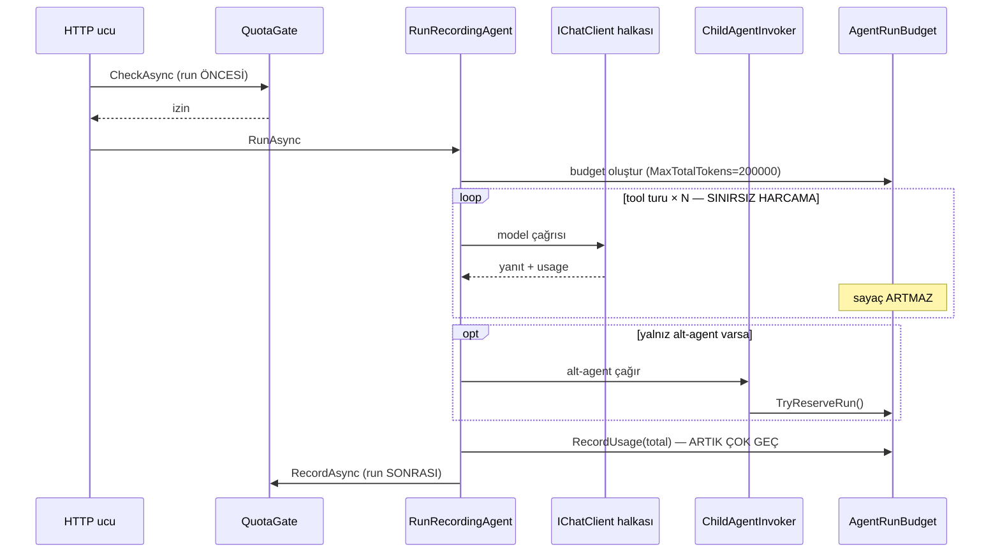
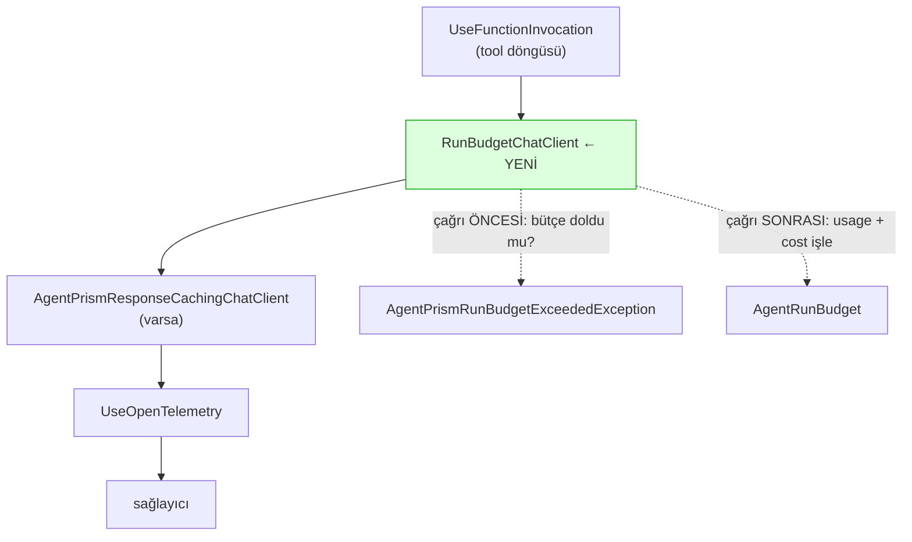

# Faz 114 — Çalıştırma-İçi Bütçe Tavanı

> **Durum:** 📋 Planlandı (2026-08-26)
> **Kaynak:** [ADAYLAR.md](ADAYLAR.md) · **F-166**
> **Önkoşul:** Faz 12 (agent çağrı grafiği, `AgentRunBudget`) ve Faz 21 (kota) — ikisi de arşivde; yalnız aşağıdaki grep'lerle okunur
> **Paketler:** `AgentPrism.Abstractions` (`Runs/AgentRunBudget.cs`), `AgentPrism.Core` (`Models/`, `Recording/`)
> **Yeni paket:** Yok · **Migration:** Yok — tavan yapılandırmadan gelir, veritabanına yazılmaz
> **Public API:** Büyüyor — mevcut bir tipe alanlar, bir dekoratör, bir exception tipi. Faz 7'den önce ucuz: `wc -l src/*/PublicAPI.Shipped.txt` toplamı **17** satır ve her dosya yalnız başlık taşıyor (K-603)
> **Tüketici yüzeyi:** `docs-site/src/content/docs/concepts/governance.md`, `guides/production.md`, `capabilities.md`
> · sevk edilen: `AgentRunBudget` ve `AgentPrismAgentGraphOptions` XML dokümanları — 🚨 ikisi de bugün **yanlış** şey ilan ediyor
> **Manuel test alanı:** `docs/manuel-test/23-SAKLAMA-ARSIV-KOTA.md`

---

## Bu Faza Başlarken

> `faz-baslangic` skill'ini uygula. Aşağıdaki liste o skill'in 2. adımıdır —
> **tamamını değil, yalnız işaret edilen bölümleri oku.**

1. Bu doküman
2. Kararlar — dosyanın tamamını **okuma**, yalnız bu kalemleri grep'le:
   ```bash
   grep -n "K-627\|K-603" docs/KARARLAR.md
   ```
   **K-627** (`RunErrorClass.BudgetExceeded` kaldırıldı, `9` kalıcı emekli;
   kaydın "Sonraki adım" sütunu bu fazın hata sınıfı kararını **açıkça
   devretmiştir**), **K-603** (`PublicAPI.Shipped.txt` boş).
3. Alan hafızası (bu faz üç alana dokunuyor):
   [`hafiza/cekirdek-calistirma.md`](hafiza/cekirdek-calistirma.md) (🚨 `AsyncLocal` tuzağı — bu fazın **ana riski**) ·
   [`hafiza/model-boru-hatti.md`](hafiza/model-boru-hatti.md) (`IChatClient` dekoratör halkaları ve sıraları) ·
   [`hafiza/olcum-kota-ve-secenekler.md`](hafiza/olcum-kota-ve-secenekler.md) (kota, maliyet, `Bind()`)
4. Gerektiğinde, tamamı değil ilgili bölümü: [`MIMARI.md`](MIMARI.md) — çalıştırma yolu

---

## Amaç

AgentPrism kurulumu bugün varsayılan olarak **200 000 token'lık bir ağaç
bütçesi** ilan eder ve bu varsayılanın *bilerek* var olduğunu yazar. Ölçüm o
tavanın **hiç zorlanmadığını** gösterdi: bütçe sayacı yalnız run **bitiminde**
işlenir ve yalnız **yeni bir alt-run başlarken** sorgulanır. Alt-agent'ı
olmayan tek bir run bütçeye hiç bakmaz; uzun bir tool döngüsü tavanı istediği
kadar aşabilir.

Bu faz o beyanı gerçek kılar: bütçe çalışma anında işlenir ve **tool turu
sınırında** uygulanır.

- **F-166** — mevcut `AgentRunBudget`'a maliyet boyutu ekler ve bütçeyi model
  çağrısı halkasının içinde zorlar.

### Bugün ne çalışmıyor — doğrulanmış kanıt

| Kanıt | Gözlem |
|---|---|
| [`AgentPrismOptions.cs:158`](../src/AgentPrism.Core/AgentPrismOptions.cs) | `MaxTotalTokens` varsayılanı **200 000** ve XML dokümanı diyor ki: *"The default intentionally exists. An unlimited installation learns about its first invalid definition from the bill."* |
| [`RunRecordingAgent.Completion.cs:102`](../src/AgentPrism.Core/Recording/RunRecordingAgent.Completion.cs) | `scope.Budget?.RecordUsage(usage?.TotalTokens ?? 0)` — sayaç **yalnız run bitiminde** artar. Run sürerken bütçe sıfır görünür |
| [`ChildAgentInvoker.cs:230`](../src/AgentPrism.Core/Graph/ChildAgentInvoker.cs) | Bütçeye bakılan **tek** yer: yeni bir alt-run başlarken. Tek agent'lı run bu koda hiç girmez |
| [`AgentRunBudget.cs:20-22`](../src/AgentPrism.Abstractions/Runs/AgentRunBudget.cs) | Tipin kendi XML dokümanı sınırı ilan ediyor: *"The budget blocks **new** child runs; it does not interrupt a run in progress."* |
| [`QuotaGate.cs:18-20`](../src/AgentPrism.AspNetCore/RateLimiting/QuotaGate.cs) | Kota tarafı da aynısını ilan ediyor: *"An ongoing run is **not cut off** when the quota is exceeded. This gate only stops a *new* run."* |
| [`QuotaEnforcer.cs`](../src/AgentPrism.Core/Quotas/QuotaEnforcer.cs) | Tipin yalnız **iki** public metodu var: `CheckAsync` (run öncesi) ve `RecordAsync` (run sonrası). Çalışma anı yüzeyi yok |
| `grep -rn "MaxCost\|MaxTokens" src/AgentPrism.Core/Recording src/AgentPrism.Core/Compilation` | **Sıfır isabet** |
| [`HarnessSettings.cs:21`](../src/AgentPrism.Abstractions/Agents/HarnessSettings.cs) | `MaximumIterationsPerRequest` **vardır** — `int?`, opt-in, varsayılanı yok |

> Kanıtlar 2026-08-26 tarihinde doğrulandı.

### 🚨 Aday metnindeki iddia ölçümle hem daraldı hem güçlendi

`ADAYLAR.md` şunu yazıyordu: *"hiçbir kod yolu onu çalışırken durdurmaz"* ve
karşı görüşünde *"tek bir run'ın dönem tavanını anlamlı biçimde aştığı ölçülmüş
bir vaka yoktur"* diyordu. Ölçüm ikisini de düzeltti:

| Aday metni | Ölçüm |
|---|---|
| "Kaçak agent döngüsü" gerekçesi | **Daraldı.** Tool döngüsü sınırsız değil: `MaximumIterationsPerRequest` bir iterasyon tavanı verir. Fakat o sayı **maliyeti** ölçmez — bağlamı büyük üç iterasyon, küçük otuzdan pahalıdır. Gerçek boşluk *"döngü sınırsız"* değil, ***"maliyet sayılmıyor"*** |
| "Ölçülmüş bir vaka yok" karşı görüşü | **Güçlendi ve karşı görüş düştü.** Bu bir FinOps konforu değil, bir **beyan hatasıdır**: varsayılan kurulum 200 000 token'lık bir tavan ilan eder ve o tavan tek agent'lı bir run'da hiçbir şey yapmaz. Sınıf olarak K-627 ile aynıdır — beyan edilmiş, üretilmemiş davranış |

Bu fazın gerekçesi budur: yeni bir yetenek eklemek değil, **var olan bir sözün
karşılığını üretmek**.

---

## 114.1 — Bugünkü akış ve deliğin yeri



Döngünün içinde bütçeye bakan hiçbir şey yoktur.

## 114.2 — Kesme noktası: tool turu halkası

**Karar (2026-08-26, kullanıcı):** Tavan mevcut `AgentRunBudget` üzerinde
yaşar; zorlama `UseFunctionInvocation` halkasının **içine** konan bir
`DelegatingChatClient` ile yapılır.

Emsal koddadır: yanıt önbelleği ringi tam olarak bu konumdadır
([`ModelProviderRegistry.cs:434-452`](../src/AgentPrism.Core/Models/ModelProviderRegistry.cs)) —
tool döngüsünün **içinde**, telemetrinin **dışında**. Aynı slot kullanılır.



**Neden bu konum:** kesme her zaman iki model çağrısının **arasında** olur.
Yarım bir model yanıtı asla kesilmez — aday metnindeki temel riski konum
tasarımı çözer, ayrı bir mekanizma gerekmez.

**Bloklanan tur `chat` span'i üretmez**, çünkü hiçbir model çağrısı yapılmaz.
Bu, önbellek isabetinin bugünkü davranışıyla aynıdır ve tutarlıdır.

## 114.3 — Bütçe run'a nasıl ulaşır

Derlenmiş agent **cache'lenir** (`CompiledAgentCache`), bütçe ise run'a
özeldir. Bu yüzden bütçe boru hattına derleme anında **gömülemez**.

Mekanizma zaten vardır:
[`AgentPrismRunContext.Current?.Budget`](../src/AgentPrism.Core/Recording/AgentPrismRunContext.cs)
— `AsyncLocal` ile taşınan run `scope`'u. Dekoratör her çağrıda **kendi
gövdesinde** onu **okur**.

🚨 **Bu repo'nun en pahalı tuzağı burada.** Kural
([`hafiza/cekirdek-calistirma.md`](hafiza/cekirdek-calistirma.md)):
`AsyncLocal` **yazımı** çağırana geri akmaz ve async yardımcı metotta
açılmamalıdır. Bu faz yalnız **okur** — yazmaz. Okuma güvenlidir ve
`AgentPrismRunContext`'in XML dokümanı akışın aşağı doğru çalıştığını yazar:
*"The value flows downward … a sub-agent running on a different thread also
sees the same scope."* Dekoratörde `AsyncLocal` **yazan** bir satır çıkarsa
bu bir denetim bulgusudur.

## 114.4 — 🚨 Çifte sayım: fazın en sinsi hatası

Dekoratör her turda `RecordUsage` çağırırsa ve
[`Completion.cs:102`](../src/AgentPrism.Core/Recording/RunRecordingAgent.Completion.cs)
run sonunda toplamı **yine** eklerse, her token **iki kez** sayılır. Bütçe
yarı yarıya küçülür ve kimse fark etmez — testler yeşil kalır, çünkü hiçbiri
toplamı iddia etmiyor.

Çözüm yönü ve ölçülmesi gereken sınır **Açık Soru 1**'dedir. Hangi yön
seçilirse seçilsin, **toplamı iddia eden bir test koddan önce yazılır**.

## 114.5 — Maliyet mi token mı

İkisi de. Fakat maliyet fiyatlandırma ister ve fiyat her zaman bilinmez.

Emsal zaten kurulmuştur ([`QuotaTypes.cs:60-66`](../src/AgentPrism.Abstractions/Quotas/QuotaTypes.cs)):
*"This limit **cannot be enforced** on a model with undefined pricing: since
the cost is unknown, the quota falls back to tokens."* Aynı kural burada da
uygulanır — **yeni bir felsefe icat edilmez.**

| Durum | Davranış |
|---|---|
| `PricingSource.Catalog` / `Configuration` | Maliyet tavanı zorlanır |
| `PricingSource.Unknown` | Maliyet tavanı **zorlanamaz**; token tavanına düşülür |
| Model bağlı değil (kod agent'ı) | Yalnız token tavanı |

`IRunPricingResolver.Resolve` **senkrondur** ([`IRunPricingResolver.cs:26`](../src/AgentPrism.Abstractions/Runs/IRunPricingResolver.cs)),
yani sıcak yolda `await` eklemez. Tavan tanımlı değilse çözümleyici hiç
çağrılmaz.

## 114.6 — Hata sınıfı: `QuotaExceeded` yeniden kullanılır

**Karar (2026-08-26, kullanıcı):** Kesme `RunErrorClass.QuotaExceeded` (4) ile
raporlanır. Yeni üye **açılmaz**; `9` kalıcı olarak emeklidir (K-627).

Gerekçe: kullanıcının gördüğü olgu aynıdır — bir harcama tavanı doldu. Mevcut
istemciler, `RunErrorStatistics` panelleri ve arıza kümeleme kodu değişmeden
çalışır; OpenAPI/TS/NSwag/`dist` zinciri hiç koşmaz.

**Eşleme regex ile yapılmaz.** Bugünkü `QuotaPattern()` mesajda `quota`
kelimesi arar; kesme mesajının o kelimeyi taşımasına güvenmek tam olarak
Faz 113'ün düzelttiği kırılganlıktır. Bunun yerine `StableIdentities`
sözlüğüne ([`DefaultRunErrorClassifier.cs:30-39`](../src/AgentPrism.Core/Runs/DefaultRunErrorClassifier.cs))
tipli bir kimlik eklenir — `ToolTimeout` ve `ContentFiltered` ile **aynı**
desen.

## 114.7 — Kapsam dışı

Bunlar bu fazda **yapılmaz** ve gerekirse ayrı aday olur:

| Kapsam dışı | Neden |
|---|---|
| Agent başına tavan (`AgentDefinition` alanı) | Üç SQL migration ve bir arayüz alanı ister. Kurulum düzeyi tavan önce kanıtlanır |
| `QuotaDefinition`'ın dönem tavanının run içinde uygulanması | Farklı bir sözleşme (kiracı × dönem); bu faz **ağaç** bütçesidir |
| Kesme sonrası kısmi yanıtın modele özetletilmesi | Yeni bir model çağrısı demektir — tavanı aşan bir tavan uygulaması olur |
| Arayüzde bütçe göstergesi | Bundle payı ve iki dil dosyası ister; önce sunucu davranışı |

---

## Planlanan Public API

> Taslak imzalardır. Gerçekleşen imzalar kapanışta ayrı bir bölüme yazılır.

```csharp
// AgentPrism.Abstractions — Runs/AgentRunBudget.cs (mevcut tip genişler)
public sealed class AgentRunBudget
{
    // mevcut: MaxTotalTokens, MaxTotalRuns, MaxDepth,
    //         ConsumedTokens, StartedRuns, IsTokenBudgetExhausted,
    //         TryReserveRun(), RecordUsage(long), DescribeExhaustion()

    /// <summary>The maximum amount spendable across the tree. No limit if null.</summary>
    /// <remarks>Cannot be enforced when pricing is undefined; the token limit applies instead.</remarks>
    public decimal? MaxTotalCost { get; init; }

    /// <summary>The amount spent across the tree so far.</summary>
    public decimal ConsumedCost { get; }

    /// <summary>Whether the cost limit has been reached.</summary>
    public bool IsCostBudgetExhausted { get; }

    /// <summary>Whether any limit has been reached.</summary>
    public bool IsExhausted { get; }

    /// <summary>Records tokens and cost spent in one model turn.</summary>
    public void RecordUsage(long tokens, decimal? cost);
}
```

```csharp
// AgentPrism.Abstractions — Runs/
/// <summary>The run tree's budget was exhausted mid-run.</summary>
public sealed class AgentPrismRunBudgetExceededException : AgentPrismException
{
    public const string RunBudgetExceededErrorType = "run_budget_exceeded";
    public override string ErrorType => RunBudgetExceededErrorType;
}
```

```csharp
// AgentPrism.Core — AgentPrismOptions.cs (AgentPrismAgentGraphOptions genişler)
/// <summary>The largest amount a tree may spend. Zero or negative removes the limit.</summary>
public decimal MaxTotalCost { get; set; }   // varsayılan 0 = sınırsız
```

`ModelProviderRegistry` kurucusuna sona iki isteğe bağlı parametre eklenir
(`IRunPricingResolver?`, `TimeProvider?` gerekiyorsa) — tipin bugünkü on iki
isteğe bağlı parametreli deseni korunur.

**`MaxTotalCost` varsayılanı `0`'dır (sınırsız).** `MaxTotalTokens`'ın 200 000
varsayılanı **değişmez** — bu faz onu ilk kez gerçekten uygular; sayıyı da
değiştirmek iki değişkeni aynı anda oynatmak olurdu.

### HTTP `endpoint`'leri

**Yeni uç yok.** Kesilen run mevcut hata yolundan raporlanır:
`runs.error_class = QuotaExceeded`, `runs.error_message` hangi tavanın dolduğunu
yazar. `202 Accepted` ile arka planda koşan run için de aynıdır.

### Arayüz payı

**Yok.** Sunucu yanıtı çevrilmez (K-232); `runs.error_message` olduğu gibi
gösterilir. `locales/en.ts` ve `tr.ts` değişmez. Bugünkü taban çizgisi
ölçüldü: `index-DESnx11L.js.br` = 148 928 B.

---

## Planlanan Dosya Listesi

```
src/AgentPrism.Abstractions/Runs/
├── AgentRunBudget.cs                       (değişir: maliyet boyutu)
└── AgentPrismRunBudgetExceededException.cs (yeni)

src/AgentPrism.Core/Models/
├── RunBudgetChatClient.cs                  (yeni: tool turu halkası)
└── ModelProviderRegistry.cs                (değişir: halkaya ekleme)

src/AgentPrism.Core/Runs/
└── DefaultRunErrorClassifier.cs            (değişir: StableIdentities satırı)

src/AgentPrism.Core/
├── AgentPrismOptions.cs                    (değişir: MaxTotalCost + CreateBudget)
└── AgentPrismServiceCollectionExtensions.Binding.Models.cs   (değişir: Bind)

src/AgentPrism.Core/Recording/
└── RunRecordingAgent.Completion.cs         (değişir: çifte sayım — Açık Soru 1)

tests/AgentPrism.Core.UnitTests/Runs/
├── AgentRunBudgetCostTests.cs              (yeni)
└── RunBudgetAccountingTests.cs             (yeni: toplamı iddia eder)

tests/AgentPrism.Core.FunctionalTests/
└── RunBudgetCutoffTests.cs                 (yeni: gerçek tool döngüsü)
```

---

## Hata Modları ve Testler

> Mutlu yoldan değil, **ne bozulabilir**den türetilir. Seviyeyi plan seçer.
> Sınır geçen davranış (DI · HTTP · kiracı · akış · depo · paket) birim
> testiyle kanıtlanamaz — [`.agents/ortak/test-seviyeleri.md`](../.agents/ortak/test-seviyeleri.md).

| Ne bozulabilir | Seviye | Test sınıfı |
|---|---|---|
| Token'lar **iki kez** sayılır (dekoratör + `Completion.cs:102`) | Birim | `RunBudgetAccountingTests` — N turluk run sonunda `ConsumedTokens` toplamı **tam** iddia edilir |
| Kesme bir model yanıtının **ortasında** olur | Fonksiyonel (akış sınırı) | `RunBudgetCutoffTests` — akışlı yolda kesmenin tur sınırında olduğu iddia edilir |
| Alt-agent farklı bir thread'de koşar ve bütçeyi **görmez** | Fonksiyonel | `RunBudgetCutoffTests` — ağaçlı senaryo |
| Eşzamanlı tool çağrıları sayacı kaydırır | Birim | `AgentRunBudgetCostTests` — `Interlocked` deseni `decimal` için **çalışmaz**; 🚨 `decimal` atomik değildir, kilit veya `long` mikro-birim gerekir |
| Fiyat bilinmiyorken maliyet tavanı sessizce sıfır sayılır ve run hemen kesilir | Birim | `AgentRunBudgetCostTests` — `PricingSource.Unknown` → token'a düşer, **kesmez** |
| Kesme `RunErrorClass.Unknown` olarak sınıflanır | Birim | `RunErrorClassContractTests` genişletilir (mevcut sınıf) |
| Kesme exception'ı `UseFunctionInvocation` tarafından yutulur ve modele metin olarak döner | Fonksiyonel | `RunBudgetCutoffTests` — 🚨 **ölçülmeli**: MAF'ın tool döngüsü exception'ı yukarı bırakıyor mu? |
| Tavan tanımsızken sıcak yolda fiyat çözümleme maliyeti doğar | Birim | `AgentRunBudgetCostTests` — çözümleyici **hiç çağrılmamalı** |
| Başka kiracının run'ı aynı bütçe nesnesini paylaşır | Fonksiyonel | `RunBudgetCutoffTests` — bütçe run başına oluşur; `ChildAgentInvoker.cs:216` kiracı kontrolü zaten var |
| Kesilen run `store`'a yazılamaz ve run düşer | Fonksiyonel | mevcut `RunStoreFailure` deseni — gözlemlenebilirlik işlevselliği bozmaz |

Beş sorunun cevabı: **iptal** → `OperationCanceledException` bütçe kontrolünün
**önünde** kalır, iptal bütçe hatasına dönüşmez · **eşzamanlılık** →
`decimal` sayaç için atomiklik ölçülmeli (yukarıda 🚨) · **boş/aşırı girdi** →
`usage == null` dönen sağlayıcı için ayrı case; sayaç artmaz, run kesilmez ·
**başka kiracı** → bütçe run başına oluşturulur, paylaşım yalnız ağaç içidir ·
**alt sistem hatası** → fiyat çözümleyici atarsa token tavanına düşülür ve
hata loglanır; run **durmaz**.

---

## Manuel Kabul Case'leri

> Kapanışta `docs/manuel-test/23-SAKLAMA-ARSIV-KOTA.md` içine eklenecek taslak.

| # | Ön koşul | Adımlar | Beklenen sonuç |
|---|---|---|---|
| 1 | `MaxTotalTokens` düşük (örn. 2000), tool döngüsü uzun bir agent | Agent'ı çalıştır | Run `Failed` biter; `error_class` = `QuotaExceeded`; mesaj hangi tavanın dolduğunu yazar |
| 2 | Aynı kurulum | Kesme anındaki son olayı incele | Son olay bir **tool sonucu** veya **tam bir model yanıtı**; yarım mesaj yok |
| 3 | `MaxTotalCost` tanımlı, fiyatı bilinen model | Tavanı aşacak bir run yap | Maliyet tavanından kesilir |
| 4 | `MaxTotalCost` tanımlı, fiyatı **bilinmeyen** model | Aynı run | Maliyet tavanı **uygulanmaz**; token tavanı geçerlidir; run maliyet yüzünden kesilmez |
| 5 | Hiçbir tavan tanımlı değil (`0`) | Uzun bir run yap | Kesme yok — gerileme yok |
| 6 | Alt-agent çağıran bir ağaç, tavan ortada dolar | Kök agent'ı çalıştır | Ağaçtaki **tüm** dallar aynı tavanı görür; toplam tavanı aşmaz |
| 7 | `202 Accepted` ile arka plan run'ı | Tavanı aşacak run başlat | Run kaydı `Failed`/`QuotaExceeded`; arayüzde hata görünür 👤 insan gerekir |

---

## Açık Sorular

> Planı bloklamayan, faz uygulanırken karara bağlanacak sorular.

| # | Soru | Seçenekler | Öneri |
|---|---|---|---|
| 1 | Çifte sayım nasıl önlenir? | A: `Completion.cs:102` kaldırılır, dekoratör tek kaydeden olur · B: Dekoratör kaydeder, `Completion` yalnız dekoratörün **görmediğini** (sıkıştırma yan kanalı) ekler | **B.** A, `CompactionUsageTrackingChatClient`'ın ürettiği ve `Completion`'ın `MergeUsage` ile eklediği token'ları **kaybeder**. B toplamı korur. 🚨 Sıkıştırma yan kanalının dekoratörden geçip geçmediği **ölçülmeli** |
| 2 | `decimal ConsumedCost` eşzamanlı olarak nasıl artırılır? | A: `lock` · B: maliyeti `long` mikro-birimde tut, `Interlocked.Add` | **B.** Tip bugün tamamen kilitsiz (`Interlocked`) ve XML dokümanı bunu bir tasarım kararı olarak yazıyor; tek bir alan için kilit koymak o kararı bozar |
| 3 | `RecordUsage(long)` mevcut imzası korunsun mu? | A: Aşırı yükleme ekle · B: İsteğe bağlı parametreye çevir | **A.** İsteğe bağlı parametre kaynak uyumlu ama **ikili uyumsuzdur**; aşırı yükleme ikisini de korur ve maliyeti yoktur |
| 4 | Kesme mesajı ne kadar ayrıntı versin? | A: Hangi tavan, ne kadar harcandı, hangi ayar yükseltilir · B: Yalnız "bütçe doldu" | **A.** `DescribeExhaustion()` zaten bu felsefeyi taşıyor: *"unless the exceeded limit is named, the user cannot see which setting to raise"* |
| 5 | MAF'ın tool döngüsü dekoratörün exception'ını yukarı bırakıyor mu? | — | **Ölçülmeli.** Yutuluyorsa kesme modele metin olarak döner ve run **başarılı** biter — yani fazın tamamı sessizce çalışmaz. Kod yazmadan önce `maf-api-kesfi` ile `UseFunctionInvocation` davranışı doğrulanır |

---

## Bitiş Ölçütleri (DoD)

- [ ] `MaxTotalTokens` düşük ayarlıyken uzun tool döngülü bir run **kesilir**; `runs.error_class` = `QuotaExceeded`
- [ ] Kesme her zaman tool turu sınırındadır — kesilen run'ın son olayı yarım bir model mesajı **değildir**
- [ ] N turluk bir run sonunda `AgentRunBudget.ConsumedTokens` gerçek toplama **eşittir** (çifte sayım yok)
- [ ] `PricingSource.Unknown` modelde maliyet tavanı **uygulanmaz**; token tavanına düşülür
- [ ] Hiçbir tavan tanımlı değilken (`0`) davranış bugünküyle **aynıdır** — gerileme yok
- [ ] Tavan tanımsızken `IRunPricingResolver` sıcak yolda **hiç çağrılmaz**
- [ ] Ağaçtaki tüm dallar aynı bütçeyi görür; toplam tavanı aşmaz
- [ ] `RunBudgetChatClient` içinde `AsyncLocal`'a **yazan** hiçbir satır yok (yalnız okur)
- [ ] `RunErrorClass` üye kümesi **değişmedi**; `9` tanımsız kaldı (`RunErrorClassContractTests` yeşil)
- [ ] `AgentRunBudget` ve `AgentPrismAgentGraphOptions` XML dokümanları gerçeğe uydu (ikisi de bugün "kesmez" diyor)
- [ ] Dört doğrulama kapısı sıfır uyarı verir
- [ ] `samples/AgentPrism.Api` ile gerçek `run` yapıldı, çıktı belgeye yazıldı
- [ ] `secret` taraması boş döndü
- [ ] Manuel kabul case'leri `docs/manuel-test/23-SAKLAMA-ARSIV-KOTA.md` içine eklendi; otomatikleştirilebilenler koşuldu
- [ ] `faz-denetim` koşuldu; 🔴 bulgu kalmadı
- [ ] `docs-site/` güncellendi (`concepts/governance.md` run-içi tavanı anlatır); `npm run build` + `check-links.mjs` temiz

### Doğrulama komutları

```bash
# Tavanı düşür, uzun bir run yap
export AgentPrism__AgentGraph__MaxTotalTokens=2000
curl -s -X POST http://localhost:5081/agentprism/api/agents/$AGENT/run \
  -H 'Content-Type: application/json' -d '{"messages":[{"role":"user","text":"..."}]}'

# Kesme sınıfını doğrula
curl -s http://localhost:5081/agentprism/api/runs/$RUN_ID | jq '.status, .errorClass, .errorMessage'
# beklenen: "Failed", "QuotaExceeded", tavanı ADIYLA yazan bir metin
```

---

## Riskler

| Risk | Önlem |
|------|-------|
| 🚨 Çifte sayım sessizce bütçeyi yarıya indirir | Toplamı iddia eden test **koddan önce** yazılır; Açık Soru 1 ölçümle kapatılır |
| 🚨 MAF'ın tool döngüsü exception'ı yutar ve faz hiç çalışmaz | Açık Soru 5 `maf-api-kesfi` ile **kod yazmadan önce** ölçülür |
| 🚨 `AsyncLocal` yazımı async yardımcıda açılır ve bütçe akmaz | Dekoratör yalnız **okur**; DoD'de ayrı satır; `hafiza/cekirdek-calistirma.md` bu sınıfın dört vakasını taşıyor |
| `decimal` sayaç eşzamanlı turlarda kayar | Açık Soru 2; `long` mikro-birim önerisi kilitsiz deseni korur |
| Mevcut kurulumlar aniden kesilmeye başlar | `MaxTotalTokens` varsayılanı (200 000) **değiştirilmez**; yalnız ilk kez uygulanır. Bu bir davranış değişikliğidir ve site sayfasında **açıkça** yazılır |
| Sıcak yola fiyat çözümleme maliyeti girer | Tavan tanımsızken çözümleyici hiç çağrılmaz; DoD'de ayrı satır |
| Kesme kısmi çıktıyı kullanıcıya açıklamaz | Mesaj hangi tavanın dolduğunu ve hangi ayarın yükseltileceğini yazar (Açık Soru 4) |

---

<!-- ============================================================
     AŞAĞISI KAPANIŞTA DOLDURULUR — `faz-tamamlama` skill'i.
     Plan anında boş kalır. Başlıkları SİLME.
     ============================================================ -->

## Plandan Sapmalar

> Kapanışta doldurulur.

## Bu Fazda Verilen Kararlar

> Kapanışta doldurulur. K-NNN numaraları burada alınır; plan numara rezerve etmez.

## Gerçekleşen Public API

> Kapanışta doldurulur.

## Dosya Listesi (gerçekleşen)

> Kapanışta doldurulur.

## Denetim Bulguları

> Kapanışta doldurulur — `faz-denetim` çıktısı.

## Sonraki Faza Devir Notu

> Kapanışta doldurulur.
