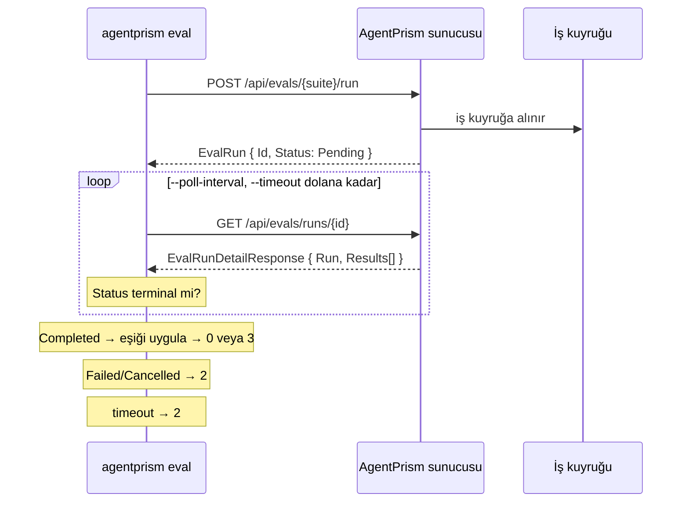

# Faz 115 — Eval'in Başsız Koşucusu

> **Durum:** 📋 Planlandı (2026-08-26)
> **Kaynak:** [ADAYLAR.md](ADAYLAR.md) · **F-168**
> **Önkoşul:** Faz 18 (eval altyapısı) ve Faz 83 (tipli istemci ve CLI) — ikisi de arşivde; yalnız aşağıdaki grep'lerle okunur
> **Paketler:** `AgentPrism.Cli` (tek paket)
> **Yeni paket:** Yok — `AgentPrism.Client` referansı **zaten var** · **Migration:** Yok
> **Public API:** `PublicAPI.*.txt` **değişmiyor** (`AgentPrismPublicApiTrackingEnabled=false`, [Cli.csproj:18](../src/AgentPrism.Cli/AgentPrism.Cli.csproj)). Fakat komut adı, bayraklar ve **exit code'lar sevk edilen bir sözleşmedir** ve sonradan ucuz değişmez
> **Tüketici yüzeyi:** `docs-site/src/content/docs/guides/cli.md`, `capabilities.md`
> · sevk edilen: `src/AgentPrism.Cli/README.md`, `Program.cs`'in `PrintHelp()` metni, `Cli.csproj` `<Description>`
> **Manuel test alanı:** `docs/manuel-test/34-ISTEMCI-VE-CLI.md` · `docs/manuel-test/17-EVAL-VE-DENEYLER.md`

---

## Bu Faza Başlarken

> `faz-baslangic` skill'ini uygula. Aşağıdaki liste o skill'in 2. adımıdır —
> **tamamını değil, yalnız işaret edilen bölümleri oku.**

1. Bu doküman
2. Kararlar — dosyanın tamamını **okuma**, yalnız bu kalemleri grep'le:
   ```bash
   grep -n "K-059\|K-232" docs/KARARLAR.md
   grep -n "K-263" docs/arsiv/KARARLAR-INDEKS-ARSIV.md
   ```
   **K-059** (`secret` yalnız argüman veya ortam değişkeninden okunur — CLI bunu
   zaten uyguluyor ve yeni komut da uyacak), **K-232** (sunucu yanıtı çevrilmez),
   **K-263** (`PackAsTool` tek TFM ister — yeni komut bunu değiştirmez).
3. Alan hafızası (bu faz bir alana dokunuyor):
   [`hafiza/paketleme-ve-dagitim.md`](hafiza/paketleme-ve-dagitim.md) (global tool paketleme, `dotnet tool` yüzeyi)
4. Gerektiğinde, tamamı değil ilgili bölümü: [`MIMARI.md`](MIMARI.md) — iş kuyruğu bölümü (eval kuyrukla koşar)

---

## Amaç

AgentPrism'in eval çekirdeği tamdır ve HTTP'den tetiklenebilir, fakat onu
koşup **exit code üreten** bir yol yoktur. Kalite ölçümü arayüzden elle
tetiklenmeye bağlıdır. Bu faz `agentprism eval` komutunu ekler: suite'i tetikler,
bitene kadar yoklar, tüketicinin verdiği eşiğe göre exit code üretir.

- **F-168** — agent kalitesi, kod kalitesiyle aynı CI adımından geçebilir.

### Bugün ne çalışmıyor — doğrulanmış kanıt

| Kanıt | Gözlem |
|---|---|
| [`Program.cs:24-32`](../src/AgentPrism.Cli/Program.cs) | CLI **üç** komut tanır: `migrate`, `migrate status`, `health`. Eval yok |
| `ls src/AgentPrism.Core/Evaluation/` | On beş dosya — `EvalJobHandler`, `RunToCasePromoter`, `ModelRunJudge`, `RunJudgeSet` tam |
| [`EvalEndpoints.cs:123`](../src/AgentPrism.AspNetCore/Endpoints/EvalEndpoints.cs) | `POST /api/evals/{name}/run` vardır; `Operator` rolü ve `ApiKeyScope.RunsWrite` ister |
| [`EvalEndpoints.cs:147`](../src/AgentPrism.AspNetCore/Endpoints/EvalEndpoints.cs) | `GET /api/evals/runs/{id}` vardır; `Reader` rolü ve `ApiKeyScope.EvalsRead` ister |

> Kanıtlar 2026-08-26 tarihinde doğrulandı.

### Ölçüm fazı adaydan **küçük** gösterdi

`ADAYLAR.md` maliyeti *"Orta"* yazmıştı. Doğrulama üç şeyin zaten hazır
olduğunu buldu:

| Hazır olan | Kanıt |
|---|---|
| İki HTTP çağrısı da **üretilmiş istemcide var** | `AgentPrismTriggerEvalRunAsync` ([AgentPrismApiClient.g.cs:5813](../src/AgentPrism.Client/Generated/AgentPrismApiClient.g.cs)) · `AgentPrismGetEvalRunAsync` ([:5991](../src/AgentPrism.Client/Generated/AgentPrismApiClient.g.cs)) |
| Eşik için gereken **üç sayı** sözleşmede var | [`EvalRun.cs:39-46`](../src/AgentPrism.Abstractions/Evaluation/EvalRun.cs) — `Total`, `Passed`, `Failed` |
| Test koşum altyapısı var | [`tests/AgentPrism.Cli.FunctionalTests/Infrastructure/`](../tests/AgentPrism.Cli.FunctionalTests/Infrastructure/) — `RealHttpHost` (gerçek Kestrel portu) ve `CliRunner` |

∴ **Sunucu değişmez.** Yeni HTTP ucu yok, OpenAPI belgesi yeniden üretilmez,
TypeScript şeması ve NSwag zinciri koşmaz, `AgentPrism.Client` `dist`'i
derlenmez. Faz tek pakete ve tek komuta iner. Eşik hesabı istemci tarafındadır.

---

## 115.1 — Eval kuyrukludur: komut yoklamak zorundadır

Bu, komutun şeklini belirleyen tek gerçektir.
[`EvalEndpoints.cs:154-156`](../src/AgentPrism.AspNetCore/Endpoints/EvalEndpoints.cs)
şunu yazar: *"the eval run is queued and processed in the background, and its
results fill in as cases complete."*



"Tetikle ve çık" bir kapı değildir: exit code hiçbir şey ölçmemiş olur. Bu
yüzden yoklama isteğe bağlı bir konfor değil, komutun **tanımıdır**.

## 115.2 — Komut sözleşmesi

```
agentprism eval --url <base-url> --suite <name>
                [--token <token>]
                [--agent-version <n>]
                [--min-pass-rate <0..1>]
                [--max-failures <n>]
                [--timeout <seconds>]
                [--poll-interval <seconds>]
                [--json]
```

`--url` ve `--token` `health` komutuyla **birebir aynı** anlamı taşır; `--token`
`AGENTPRISM_TOKEN` ortam değişkeninden de okunur (K-059). Ayrıştırma
[`CliArgs`](../src/AgentPrism.Cli/CliArgs.cs) ile yapılır — üç komut için tam
bir parser kütüphanesi getirilmedi, dördüncüsü için de getirilmez.

## 115.3 — Eşik: iki bağımsız bayrak

**Karar (2026-08-26, kullanıcı):** `--min-pass-rate` ve `--max-failures` ayrı
ayrı verilebilir. **İkisi de verilirse ikisi birden sağlanmalıdır.**

| Verilen | Davranış |
|---|---|
| Hiçbiri | Kapı yok. Sonuç yazılır, exit code `0` |
| Yalnız `--min-pass-rate 0.9` | `Passed / Total >= 0.9` olmalı |
| Yalnız `--max-failures 2` | `Failed <= 2` olmalı |
| İkisi | **İkisi de** sağlanmalı |

Gerekçe: büyüyen bir suite'te oran, küçük bir suite'te mutlak sayı doğru aracı
verir. AgentPrism **varsayılan bir kalite barı dayatmaz** — eşik yoksa kapı da
yoktur.

🚨 **`Total == 0` bir tuzaktır.** Boş bir suite'te `Passed / Total` sıfıra
bölmedir ve "hiç case yok" sessizce "%100 geçti" olarak okunabilir. Boş suite
`--min-pass-rate` verildiğinde **başarısız** sayılır (Açık Soru 3).

## 115.4 — Exit code sözleşmesi

**Karar (2026-08-26, kullanıcı):** "eşik tutmadı" için **yeni kod `3`** alınır.

| Kod | Anlam | Bugünkü kaynağı |
|---:|---|---|
| `0` | Koştu ve eşiği geçti (ya da eşik verilmedi) | mevcut |
| `1` | Argüman hatası | [`Program.cs:37`](../src/AgentPrism.Cli/Program.cs) — `CliArgumentException` |
| `2` | Koşamadı: taşıma, sunucu, timeout, `Failed`/`Cancelled` eval | [`HealthCommand.cs:56`](../src/AgentPrism.Cli/Commands/HealthCommand.cs) |
| **`3`** | **Koştu, kalite eşiğin altında** | **yeni** |

Ayrımın değeri işletimseldir: `2` bir altyapı sorunudur ve **yeniden denenir**;
`3` gerçek bir kalite sinyalidir ve yeniden denemek yanlıştır. Tek koda
sıkıştırılırsa CI'ın yeniden deneme mantığı yanlış karar verir.

Üç mevcut komutun `0`/`1`/`2` anlamı **değişmez**.

## 115.5 — Çıktı

Varsayılan çıktı insan içindir: suite adı, `Passed/Total`, süre ve
**başarısız case adları**. `EvalRunDetailResponse` per-case sonuçları zaten
taşır ([`EvaluationContracts.cs:72-79`](../src/AgentPrism.AspNetCore/Contracts/EvaluationContracts.cs)),
yani ikinci bir çağrı gerekmez.

`--json` makine içindir ve `health --json` emsalini izler. Sunucu metni
çevrilmez (K-232).

🚨 CLI çıktısı hiçbir sunucu `secret`'ı taşımaz. `HealthCommand` bunu
`AgentPrismApiException`'ın gövdesini **yazmayarak** çözdü
([`HealthCommand.cs:53-57`](../src/AgentPrism.Cli/Commands/HealthCommand.cs));
eval komutu aynısını yapar ve `CliSecretRedactionTests` bunu kapsayacak biçimde
genişletilir.

## 115.6 — Kapsam dışı

| Kapsam dışı | Neden |
|---|---|
| Yeni HTTP ucu veya sunucu değişikliği | Eşik hesabı için gereken üç sayı sözleşmede var |
| Eval suite'i CLI'dan **oluşturmak/düzenlemek** | Kapı koşmak ile içerik yönetmek ayrı işler; `agentprism eval` yalnız koşar |
| İki eval koşumunu karşılaştıran `diff` komutu | Ayrı bir aday olur; kapı için gerekli değil |
| Varsayılan bir kalite eşiği | AgentPrism kalite barı dayatmaz |
| Performans kapısı | [Faz 116](116-PERFORMANS-TAHSIS-KAPISI.md) — **ayrı** faz, ayrı eşik felsefesi |

---

## Planlanan Public API

> Taslak imzalardır. Gerçekleşen imzalar kapanışta ayrı bir bölüme yazılır.

`PublicAPI.*.txt` dosyaları **değişmez** — CLI'da takip kapalıdır. Sevk edilen
sözleşme komutun kendisidir:

```csharp
// src/AgentPrism.Cli/Commands/EvalCommand.cs
internal static class EvalCommand
{
    public static Task<int> RunAsync(IReadOnlyList<string> args, CancellationToken cancellationToken);
}
```

`Program.cs`'in `switch`'ine bir kol ve `PrintHelp()`'e bir kullanım satırı
eklenir.

### HTTP `endpoint`'leri

**Yeni uç yok.** Kullanılan iki mevcut uç:

| Metot | Yol | Rol / scope | Ne yapar |
|---|---|---|---|
| `POST` | `/api/evals/{name}/run` | Operator · `RunsWrite` | Suite'i kuyruğa alır |
| `GET` | `/api/evals/runs/{id}` | Reader · `EvalsRead` | Durumu ve per-case sonuçları verir |

🚨 Komut **iki farklı scope** ister. Yalnız `EvalsRead` taşıyan bir API
anahtarı tetikleyemez ve `403` alır. Hata metni eksik olan scope'u **adıyla**
söylemelidir; yoksa CI'da teşhis edilemez.

### Arayüz payı

**Yok.** Arayüze dokunulmaz.

---

## Planlanan Dosya Listesi

```
src/AgentPrism.Cli/
├── Commands/
│   └── EvalCommand.cs                  (yeni)
├── Program.cs                          (değişir: switch kolu + PrintHelp)
├── README.md                           (değişir: komut belgesi)
└── AgentPrism.Cli.csproj               (değişir: <Description>)

tests/AgentPrism.Cli.FunctionalTests/
├── EvalCommandTests.cs                 (yeni)
└── CliSecretRedactionTests.cs          (değişir: eval komutu kapsama girer)
```

---

## Hata Modları ve Testler

> Mutlu yoldan değil, **ne bozulabilir**den türetilir. Seviyeyi plan seçer.
> Sınır geçen davranış (DI · HTTP · kiracı · akış · depo · paket) birim
> testiyle kanıtlanamaz — [`.agents/ortak/test-seviyeleri.md`](../.agents/ortak/test-seviyeleri.md).

Bu fazın **tamamı** HTTP sınırını geçer; birim testi hiçbirini kanıtlamaz.
Koşum `RealHttpHost` (gerçek Kestrel portu) üzerinde yapılır.

| Ne bozulabilir | Seviye | Test sınıfı |
|---|---|---|
| Eşik altındaki suite `0` döner (kapı hiç kapanmaz) | Fonksiyonel | `EvalCommandTests` |
| Eşiği geçen suite `3` döner (yanlış kırmızı) | Fonksiyonel | `EvalCommandTests` |
| Eval `Failed`/`Cancelled` bitti ama komut `3` döndü — altyapı hatası kalite hatası sanıldı | Fonksiyonel | `EvalCommandTests` |
| `--timeout` dolduğunda komut asılı kalır | Fonksiyonel | `EvalCommandTests` — sahte uzun koşum |
| Boş suite (`Total == 0`) `--min-pass-rate` ile `0` döner | Fonksiyonel | `EvalCommandTests` |
| İki eşik birlikte verildiğinde biri sağlanınca `0` dönülür (VE yerine VEYA) | Fonksiyonel | `EvalCommandTests` |
| `Ctrl+C` yoklama döngüsünü kırmaz | Fonksiyonel | `EvalCommandTests` — `Program.cs:15-20` token'ı zaten kurar |
| Yalnız `EvalsRead` scope'lu anahtar `403` alır ve mesaj eksik scope'u söylemez | Fonksiyonel | `EvalCommandTests` |
| Başka kiracının suite'i çalıştırılır | Fonksiyonel (kiracı sınırı) | `EvalCommandTests` — iki token, iki kiracı |
| Sunucu hata gövdesi çıktıya sızar | Fonksiyonel | `CliSecretRedactionTests` |
| Yoklama sunucuyu döver (interval yok sayılır) | Fonksiyonel | `EvalCommandTests` — istek sayısı iddia edilir |
| `--json` ayrıştırılabilir JSON üretmez | Fonksiyonel | `EvalCommandTests` — `health --json` emsali |

Beş sorunun cevabı: **iptal** → `Program.cs`'in `CancelKeyPress` token'ı yoklama
döngüsüne geçer, komut `2` ile çıkar · **eşzamanlılık** → iki eş zamanlı
`agentprism eval` iki ayrı eval run'ı açar; paylaşılan istemci durumu yok ·
**boş/aşırı girdi** → `Total == 0`, negatif `--max-failures`, `>1`
`--min-pass-rate` için ayrı case'ler · **başka kiracı** → token kiracıyı
belirler; sunucu `404` verir, komut `2` döner · **alt sistem hatası** → sunucu
`5xx` verirse komut `2` döner ve gövdeyi yazmaz.

---

## Manuel Kabul Case'leri

> Kapanışta `docs/manuel-test/34-ISTEMCI-VE-CLI.md` içine eklenecek taslak;
> eval tarafı case'leri `17-EVAL-VE-DENEYLER.md`'ye referansla bağlanır.

| # | Ön koşul | Adımlar | Beklenen sonuç |
|---|---|---|---|
| 1 | Çalışan sunucu, hepsi geçen bir suite | `agentprism eval --url … --suite ok --min-pass-rate 1.0` | Exit `0`; çıktı `Passed/Total` yazar |
| 2 | Bir case'i düşen suite | Aynı komut | Exit **`3`**; çıktı **düşen case'in adını** yazar |
| 3 | Aynı suite | `--max-failures 1` | Exit `0` — bir başarısızlığa tolerans var |
| 4 | Aynı suite | `--min-pass-rate 1.0 --max-failures 5` | Exit `3` — ikisi birden sağlanmalı |
| 5 | Olmayan suite adı | `--suite yok` | Exit `2`; mesaj suite adını söyler, sunucu gövdesini yazmaz |
| 6 | Sunucu kapalı | Herhangi bir eval komutu | Exit `2`; mesaj bağlantı hatasını söyler |
| 7 | Uzun koşan suite | `--timeout 5` | Exit `2`; mesaj timeout süresini söyler |
| 8 | Yalnız `EvalsRead` scope'lu API anahtarı | Herhangi bir eval komutu | Exit `2`; mesaj **`RunsWrite`** scope'unu adıyla söyler |
| 9 | Herhangi bir suite | `--json` | Ayrıştırılabilir JSON; exit code eşikten bağımsız doğru |
| 10 | Uzun koşan suite | Koşum sırasında `Ctrl+C` | Komut hemen çıkar, `2` döner; asılı kalmaz 👤 insan gerekir |

---

## Açık Sorular

> Planı bloklamayan, faz uygulanırken karara bağlanacak sorular.

| # | Soru | Seçenekler | Öneri |
|---|---|---|---|
| 1 | `--timeout` varsayılanı ne olsun? | A: 30 dakika · B: varsayılan yok, zorunlu bayrak · C: sonsuz | **A.** `health`'in 10 sn'si burada anlamsız; eval dakikalar sürer. Sonsuz varsayılan CI işini asar. Zorunlu bayrak en basit kullanımı ağırlaştırır |
| 2 | `--poll-interval` varsayılanı? | A: 5 sn · B: artan aralık (2→30 sn) | **A.** Sabit aralık öngörülebilir ve test edilebilir; artan aralık ölçülmüş bir sorunu çözmüyor |
| 3 | Boş suite (`Total == 0`) ne dönsün? | A: `--min-pass-rate` verilmişse `3` · B: her zaman `0` | **A.** Boş bir suite kalite kanıtı **değildir**; sessizce yeşil dönmek kapının amacını bozar |
| 4 | `--agent-version` verilmezse hangi sürüm ölçülür? | — | **Ölçülmeli.** `TriggerRunAsync` `request?.AgentVersion` okuyor ([EvalEndpoints.cs:455](../src/AgentPrism.AspNetCore/Endpoints/EvalEndpoints.cs)); `null` davranışı doğrulanmadan yardım metnine yazılmaz |
| 5 | Komut adı `eval` mi `evals` mi? | A: `eval` · B: `evals` | **A.** HTTP yolu `/api/evals` çoğul, fakat komut tek bir suite koşar. `migrate`/`health` de tekil |

---

## Bitiş Ölçütleri (DoD)

- [ ] Eşiği geçen bir suite için `agentprism eval … --min-pass-rate 1.0` → exit `0`
- [ ] Bir case'i düşen suite için aynı komut → exit **`3`**, çıktıda düşen case adı var
- [ ] İki eşik birlikte verildiğinde **ikisi birden** sağlanmadıkça `3` döner
- [ ] `Failed`/`Cancelled` biten eval → exit `2` (asla `3` değil)
- [ ] `--timeout` dolduğunda komut çıkar → exit `2`; asılı kalmaz
- [ ] Boş suite `--min-pass-rate` ile `3` döner
- [ ] Yalnız `EvalsRead` scope'lu anahtarda hata metni **`RunsWrite`**'ı adıyla söyler
- [ ] Sunucu hata gövdesi hiçbir çıktıya sızmaz (`CliSecretRedactionTests` eval komutunu kapsar)
- [ ] Üç mevcut komutun `0`/`1`/`2` anlamı **değişmedi**
- [ ] Dört doğrulama kapısı sıfır uyarı verir
- [ ] `samples/AgentPrism.Api` ile gerçek `run` yapıldı, çıktı belgeye yazıldı
- [ ] `secret` taraması boş döndü
- [ ] Manuel kabul case'leri `docs/manuel-test/34-ISTEMCI-VE-CLI.md` içine eklendi; otomatikleştirilebilenler koşuldu
- [ ] `faz-denetim` koşuldu; 🔴 bulgu kalmadı
- [ ] `docs-site/guides/cli.md` yeni komutu ve **exit code tablosunu** yazar; `npm run build` + `check-links.mjs` temiz
- [ ] `src/AgentPrism.Cli/README.md`, `PrintHelp()` ve `<Description>` üçü de tutarlı

### Doğrulama komutları

```bash
# Kapı kapanıyor mu
agentprism eval --url http://localhost:5081/agentprism --suite checkout --min-pass-rate 1.0
echo "exit=$?"   # beklenen: 3 (bir case düşükse)

# Kapı yokken hiçbir şey kırmıyor
agentprism eval --url http://localhost:5081/agentprism --suite checkout
echo "exit=$?"   # beklenen: 0
```

---

## Riskler

| Risk | Önlem |
|------|-------|
| "Koşamadı" ile "kalite düşük" tek koda düşer ve CI yanlış yeniden dener | Exit `3` ayrı; iki test bunu ayrı ayrı iddia eder |
| Boş suite sessizce yeşil döner | Açık Soru 3; DoD'de ayrı satır |
| `Total == 0`'da sıfıra bölme | Eşik hesabı önce `Total`'ı kontrol eder; test var |
| Yoklama döngüsü sunucuyu döver | `--poll-interval` varsayılanı ve istek sayısını iddia eden test |
| Sunucu hata gövdesi CI loguna `secret` sızdırır | `HealthCommand`'in deseni birebir izlenir; `CliSecretRedactionTests` genişletilir |
| Komut adı/bayrak sonradan değişir ve tüketicinin CI adımı kırılır | Sözleşme bu fazda kararlaştırılır; site sayfası exit code tablosunu yayımlar |

---

<!-- ============================================================
     AŞAĞISI KAPANIŞTA DOLDURULUR — `faz-tamamlama` skill'i.
     Plan anında boş kalır. Başlıkları SİLME.
     ============================================================ -->

## Plandan Sapmalar

> Kapanışta doldurulur.

## Bu Fazda Verilen Kararlar

> Kapanışta doldurulur. K-NNN numaraları burada alınır; plan numara rezerve etmez.

## Gerçekleşen Public API

> Kapanışta doldurulur.

## Dosya Listesi (gerçekleşen)

> Kapanışta doldurulur.

## Denetim Bulguları

> Kapanışta doldurulur — `faz-denetim` çıktısı.

## Sonraki Faza Devir Notu

> Kapanışta doldurulur.
