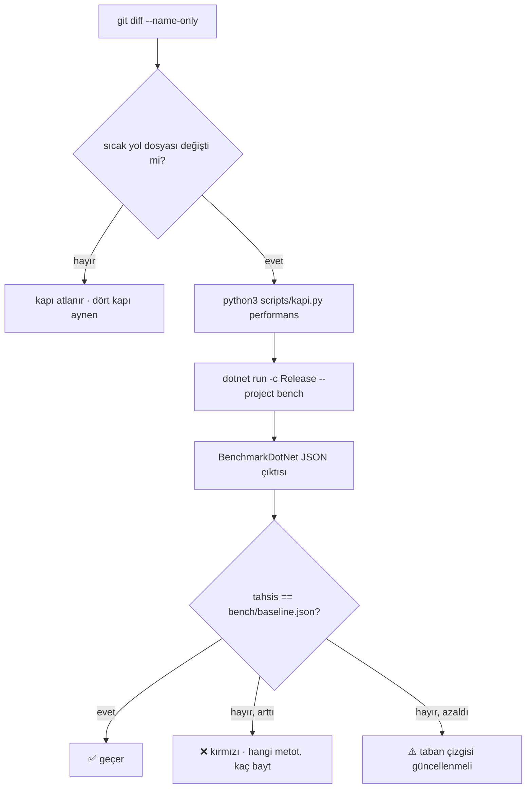

# Faz 116 — Performans Tahsis Kapısı

> **Durum:** 📋 Planlandı (2026-08-26)
> **Kaynak:** [ADAYLAR.md](ADAYLAR.md) · **F-67** (F-163 bu fazın ölçümüne kapanır)
> **Önkoşul:** 🚨 [Faz 114](114-CALISTIRMA-ICI-BUTCE-TAVANI.md) — **taban çizgisi 114'ten sonra alınır**; gerekçe § 116.7
> **Paketler:** Yeni bir **ölçüm projesi** (`bench/`); sevk edilen hiçbir pakete dokunulmaz
> **Yeni paket:** **BenchmarkDotNet 0.15.8** — K-007 gerekçesi ve geçişli ağırlık § 116.5'te **rakamla** · **Migration:** Yok
> **Public API:** Büyümüyor. Ölçüm projesi `IsPackable=false`'tır ve hiçbir sevk edilen paket ona referans vermez
> **Tüketici yüzeyi:** **Yok** — bu bir depo disiplinidir, sevk edilen bir yetenek değil. `docs-site/` değişmez
> **Manuel test alanı:** `docs/manuel-test/36-GELISTIRME-KAPILARI.md`

---

## Bu Faza Başlarken

> `faz-baslangic` skill'ini uygula. Aşağıdaki liste o skill'in 2. adımıdır —
> **tamamını değil, yalnız işaret edilen bölümleri oku.**

1. Bu doküman
2. Kararlar — dosyanın tamamını **okuma**, yalnız bu kalemleri grep'le:
   ```bash
   grep -n "K-007\|K-212" docs/arsiv/KARARLAR-INDEKS-ARSIV.md
   ```
   **K-007** (yeni NuGet paketi gerekçe ister), **K-212** (Faz 27'de 37 paketlik
   geçişli ağırlık kalemi erteletti — bu fazın karşılaştırma noktası).
3. Ortak sözleşme: [`.agents/ortak/kapilar.md`](../.agents/ortak/kapilar.md)
   — **tamamı**. Bu faz kapı yüzeyine dokunuyor; dört kapının neden dört
   olduğunu bilmeden beşincisi tartışılamaz.
4. Alan hafızası (bu faz iki alana dokunuyor):
   [`hafiza/build-ve-analyzer.md`](hafiza/build-ve-analyzer.md) (proje düzeni, analyzer, AOT kaçış merdiveni) ·
   [`hafiza/test-kosum-olcumleri.md`](hafiza/test-kosum-olcumleri.md) (koşum süreleri — beşinci kapının maliyeti buraya yazılır)

---

## Amaç

Mevcut dört doğrulama kapısı **doğruluğu** korur. Depoda benchmark projesi ve
performans taban çizgisi yoktur; sıcak yolda bir tahsis veya gecikme
gerilemesi, davranış doğruyken **görünmez** kalır.

Bu faz gürültüsüz bir kapı kurar: CI **yalnız tahsis edilen baytı** karşılaştırır,
süre ölçülür ve raporlanır ama kapı değildir.

- **F-67** — üç sıcak yolun tahsis taban çizgisi alınır ve gerileme kapıya
  takılır.
- **F-163** ayrı bir test ailesi olarak **açılmaz**; bu ölçümün sonucu onu ya
  kapsar ya kapatır.

### Bugün ne çalışmıyor — doğrulanmış kanıt

| Kanıt | Gözlem |
|---|---|
| `find . -iname "*bench*"` (repo ağacı, `node_modules` hariç) | **Sıfır .NET projesi.** Tüm isabetler `node_modules` gürültüsü |
| `grep -in benchmark Directory.Packages.props` | **Sıfır isabet** — ölçüm aracı kayıtlı değil |
| [`scripts/kapi.py:366-380`](../scripts/kapi.py) `closing_commands` | Dokuz komut: tarama, doküman, script testleri, agent haritası, denetim paketi, build, test, pack, format. **Performans yok** |
| [`.github/workflows/ci.yml`](../.github/workflows/ci.yml) | Derleme, biçim, doküman, test adımları var. **Performans adımı yok** |

> Kanıtlar 2026-08-26 tarihinde doğrulandı.

---

## 116.1 — Neden yalnız tahsis kapı olur

**Karar (2026-08-26, kullanıcı):** CI kapısı **tahsis edilen bayt**tır. Süre
ölçülür ve rapora yazılır, fakat hiçbir şeyi kırmaz.

Adayın kendi karşı görüşü bunu istiyordu: *"kararlı ölçüm ortamı yoksa elle
koşulan taban çizgisi daha doğru olabilir."* Ayrım şudur:

| Metrik | Paylaşılan CI makinesinde | Kapı olabilir mi |
|---|---|---|
| **Tahsis edilen bayt** | Deterministik. Aynı kod aynı sayıyı verir; makine yüküne, çekirdek sayısına ve işletim sistemine bağlı değil | ✅ Evet — tolerans **sıfır** olabilir |
| **Duvar saati** | Paylaşılan runner'da komşu işlere göre oynar | ❌ Hayır — dar tolerans yanlış kırmızı, geniş tolerans gerçek gerilemeyi kaçırır |

Sıfır toleranslı bir tahsis kapısı, geniş toleranslı bir süre kapısından **daha
çok** gerileme yakalar: sıcak yola giren bir `ToList()`, bir `string.Format`
veya bir closure tahsisi anında görünür.

🚨 **CI'ın işletim sistemi matrisi tahsis kapısını etkilemez**, fakat kapı
**tek** bir işletim sisteminde koşar. Matrisin üç kolunda da koşturmak aynı
sayıyı üç kez doğrular ve koşum süresini üçe katlar.

## 116.2 — Ölçülecek üç sıcak yol

Adayın adlandırdığı üç yol korunur. Her biri için ölçüm hedefi **tahsis/işlem**tir:

| # | Yol | Giriş noktası | Neden sıcak |
|---:|---|---|---|
| 1 | `run` olayı yazımı | [`RunEventWriter.cs`](../src/AgentPrism.Core/Recording/RunEventWriter.cs) | Her `run`'da onlarca olay; akışlı yolda her delta bir olay |
| 2 | Tanım derleyici cache'i | [`CompiledAgentCache.cs`](../src/AgentPrism.Core/Compilation/CompiledAgentCache.cs) | Her `run` başında; cache **isabetinin** tahsis etmemesi gerekir |
| 3 | Seçilmiş `store` sorgusu | [`SqlRunStore.cs`](../src/AgentPrism.Sql.Shared/Stores/SqlRunStore.cs) | Liste uçları ve uzlaştırma taraması bunu döner |

🚨 **Üçüncü yol Docker istemez.** SQLite `AgentPrism.no-docker.slnf` içindedir
(ölçüldü), yani `store` tahsisi SQLite üzerinde ölçülür. Tahsis çoğunlukla
komut kurma ve satır okuma tarafındadır ve diyalektten bağımsızdır; Docker'lı
bir sağlayıcı ölçüme belirsizlik katar, doğruluk katmaz.

## 116.3 — Ölçüm projesi nerede yaşar

**`bench/AgentPrism.Benchmarks/` — `tests/` altında DEĞİL.**

Bu bir tercih değil, ölçülmüş bir kısıttır:

| Ölçüm | Sonuç |
|---|---|
| [`tests/Directory.Build.props:11`](../tests/Directory.Build.props) `IsTestProject=true` | `tests/` altındaki her proje `dotnet test` tarafından **koşturulmaya çalışılır**. BenchmarkDotNet projesi bir test projesi değildir |
| [`tests/Directory.Build.props:31-36`](../tests/Directory.Build.props) | Her projeye `xunit.v3`, `NSubstitute`, `Shouldly` ve `Using` girdileri **zorla** eklenir |
| [`scripts/kapi.py:398`](../scripts/kapi.py) `packable_project_ids` | Paketlenebilir kimlikler `src/*/*.csproj`'ten türer. `bench/` yayın provasına **girmez** |

Proje kendi `bench/Directory.Build.props`'unu taşır ve şunları ilan eder:
`IsPackable=false`, `WarnOnPackingNonPackableProject=false`, `IsTestProject`
**yok**, `OutputType=Exe`.

🚨 `closing_commands` tüm `slnx`'i **Release derler ve pack'ler**
([`kapi.py:373-375`](../scripts/kapi.py)). `slnx`'e girecek bir proje her faz
kapanışında derlenir; `WarnOnPackingNonPackableProject` kapatılmazsa `pack`
uyarı verir ve **dört kapının biri kırmızı olur**.

## 116.4 — Kapı nereye takılır

Beşinci bir doğrulama kapısı açmak `AGENTS.md`'nin *"Dördü de sıfır uyarı
vermelidir"* cümlesini değiştirir. Bu bir karardır ve **Açık Soru 1**'dedir.

Önerilen biçim, deponun kendi desenini izler: `kapi.py` zaten değişen yollara
göre iş seçiyor ([`changed_paths`](../scripts/kapi.py) ·
[`affected_test_projects`](../scripts/kapi.py)). Performans kapısı da **yol
tetiklemeli** olur:



Tahsisin **azalması** kırmızı değildir ama sessiz de kalmamalıdır: taban çizgisi
güncellenmezse bir sonraki gerileme eski, gevşek sayıya karşı ölçülür.

## 116.5 — Yeni paketin geçişli ağırlığı — ölçüldü

**Gerçek restore ile ölçüldü (2026-08-26, `net10.0`, temiz proje, yalnız
nuget.org):**

| Ölçüm | Sonuç |
|---|---|
| Paket | `BenchmarkDotNet` **0.15.8** (en son yayımlanan; hat 1.0'a **hiç çıkmadı**) |
| Geçişli paket sayısı | **22** (üst düzey dahil 23) |
| Dikkat çekenler | `Microsoft.CodeAnalysis.CSharp 4.14.0` + `.Common` (Roslyn) · `Gee.External.Capstone 2.3.0` · `Iced 1.21.0` · `Microsoft.Diagnostics.Runtime` · `Microsoft.Diagnostics.Tracing.TraceEvent` · `System.Management` |
| Sürüm çakışması adayı | `Microsoft.Extensions.{DependencyInjection,Logging,Options,Primitives} 6.0.0` çekiliyor; repo **10.0.11**'de ([`Directory.Packages.props:25`](../Directory.Packages.props)) ve `CentralPackageTransitivePinningEnabled=false` ([`Directory.Build.props:49`](../Directory.Build.props)) |

**K-007 gerekçesi:** 22 paket, K-212'nin kalemi erteleten 37 paketinden azdır,
fakat asıl fark sayı değil **yön**dür: K-212'nin kaygısı **tüketicinin
bağımlılık grafiğinin kirlenmesiydi**. Ölçüm projesi `IsPackable=false`'tır ve
hiçbir sevk edilen paket ona referans vermez, yani bu 22 paket **tüketiciye
hiç ulaşmaz**. Yük yalnız geliştirme ve CI tarafındadır.

🚨 **Yük yine de bedava değil.** 22 paket restore süresine, önbellek boyutuna
ve **güvenlik açığı yüzeyine** eklenir. Deponun bu konuda kayıtlı bir vakası
var: `Testcontainers` geçişli `SSH.NET`'i bir CVE ile getirdi ve `NU1903`
restore'u kırdı ([`Directory.Packages.props:255-266`](../Directory.Packages.props)).
Aynı denetim bu paket için de koşulur.

## 116.6 — Süre nasıl raporlanır

BenchmarkDotNet süre istatistiğini zaten üretir. Kapı olmadığı için süre
sayıları `bench/baseline.json`'a **bilgi olarak** yazılır ve karşılaştırma
insan gözüyle yapılır. Bu, adayın karşı görüşünün istediği şeydir: sayı
kaybolmaz, fakat kırmızı üretmez.

## 116.7 — 🚨 Taban çizgisi Faz 114'ten **sonra** alınır

[Faz 114](114-CALISTIRMA-ICI-BUTCE-TAVANI.md) model çağrısı halkasına yeni bir
`DelegatingChatClient` (`RunBudgetChatClient`) ekler ve
`RunRecordingAgent.Completion.cs`'i değiştirir.

Ölçüm (2026-08-26): Faz 112, 113 ve 114'ün planlanan dosya listeleri bu fazın
**üç sıcak yol dosyasının hiçbirini** içermiyor. Yani üç taban çizgisi
teknik olarak önce de alınabilir.

Yine de sıra şudur, ve gerekçesi tersine bakmaktır: taban çizgisi 114'ten
**önce** alınırsa, 114'ün eklediği halkanın maliyeti kapıya girmeden
**affedilmiş** olur. Sonra alınırsa aynı halka ilk günden koruma altına girer.
Bu, kapının varlık nedeniyle aynı yöndedir.

## 116.8 — Kapsam dışı

| Kapsam dışı | Neden |
|---|---|
| Süre için CI kapısı | Paylaşılan runner'da yanlış kırmızı üretir (§ 116.1) |
| Üç yoldan fazlasını ölçmek | Her benchmark bakım maliyetidir; üçü kanıtlanmadan dördüncüsü eklenmez |
| PostgreSQL/SQL Server üzerinde `store` ölçümü | Docker belirsizlik katar; tahsis diyalektten bağımsızdır |
| Sevk edilen bir performans yeteneği | Bu bir depo disiplinidir; `docs-site/` değişmez |
| F-163'ün ayrı bir test ailesi olması | Bu ölçüm onu ya kapsar ya kapatır — aday metninin kendi kuralı |

---

## Planlanan Public API

**Yok.** Bu faz hiçbir public tip, arayüz, HTTP ucu veya CLI komutu eklemez.
`PublicAPI.*.txt` dosyaları **değişmez**.

### Planlanan yapıt yüzeyi

```
bench/
├── Directory.Build.props               (yeni: IsPackable=false, IsTestProject YOK)
├── baseline.json                       (yeni: taban çizgisi — repo'da tutulur)
└── AgentPrism.Benchmarks/
    ├── AgentPrism.Benchmarks.csproj    (yeni)
    ├── Program.cs                      (yeni)
    ├── RunEventWriterBenchmarks.cs     (yeni)
    ├── CompiledAgentCacheBenchmarks.cs (yeni)
    └── RunStoreQueryBenchmarks.cs      (yeni: SQLite)

scripts/
├── kapi.py                             (değişir: "performans" alt komutu)
└── kapi_test.py                        (değişir: karşılaştırma mantığı testi)

Directory.Packages.props                (değişir: BenchmarkDotNet 0.15.8)
AgentPrism.slnx                         (değişir: bench projesi kaydı)
.github/workflows/ci.yml                (değişir: yol tetiklemeli adım)
```

### Arayüz payı

**Yok.**

---

## Hata Modları ve Testler

> Mutlu yoldan değil, **ne bozulabilir**den türetilir. Seviyeyi plan seçer.

Bu fazın "testi" iki katmanlıdır: karşılaştırma mantığının **kendi** testi
(`scripts/kapi_test.py`, mevcut desen) ve kapının gerçekten kırmızı olduğunu
gösteren bir **kasıtlı gerileme** koşumu.

| Ne bozulabilir | Seviye | Test |
|---|---|---|
| Kapı hiç kırmızı olmaz (karşılaştırma her zaman geçer) | Script birimi | `kapi_test.py` — sahte JSON ile artmış tahsis kırmızı olmalı |
| Kapı her zaman kırmızı olur (taban çizgisi okunamıyor) | Script birimi | `kapi_test.py` — eksik/bozuk `baseline.json` **anlaşılır** hata verir, sessizce geçmez |
| Tahsis **azalınca** kapı kırmızı olur | Script birimi | `kapi_test.py` |
| Benchmark'ın kendisi tahsis eder ve ölçümü kirletir | Manuel | Kasıtlı gerileme koşumu — 👤 insan gerekir |
| `bench` projesi `tests/` altına konur ve `dotnet test` onu koşmaya çalışır | Fonksiyonel | `dotnet test AgentPrism.slnx` yeşil kalmalı |
| `dotnet pack` bench projesi için uyarı verir ve dört kapının biri kırılır | Fonksiyonel | `closing_commands` koşumu sıfır uyarı |
| `NU1903` yeni geçişli paketlerden biri yüzünden restore'u kırar | Fonksiyonel | `dotnet restore AgentPrism.slnx` temiz |
| `Microsoft.Extensions 6.0.0` çözümlemesi repo'nun 10.0.11'ini aşağı çeker | Fonksiyonel | `dotnet list package --include-transitive` ile sürüm iddiası |
| Kapı her fazda koşar ve kapanış süresini şişirir | Manuel + ölçüm | Yol tetikleme; süre `hafiza/test-kosum-olcumleri.md`'ye yazılır |
| Farklı işletim sisteminde tahsis farklı çıkar (varsayım yanlışsa fazın temeli düşer) | Manuel | 🚨 **Ölçülmeli** — kapı yazılmadan önce iki işletim sisteminde aynı sayı doğrulanır |

---

## Manuel Kabul Case'leri

> Kapanışta `docs/manuel-test/36-GELISTIRME-KAPILARI.md` içine eklenecek taslak.

| # | Ön koşul | Adımlar | Beklenen sonuç |
|---|---|---|---|
| 1 | Temiz ağaç | `python3 scripts/kapi.py performans` | Geçer; çıktı üç yolun tahsis sayısını yazar |
| 2 | Sıcak yola kasıtlı bir `ToList()` eklendi | Aynı komut | **Kırmızı**; çıktı hangi metot ve **kaç bayt** arttığını yazar |
| 3 | Tahsis kasıtlı azaltıldı | Aynı komut | Kırmızı değil, fakat "taban çizgisi güncellenmeli" uyarısı |
| 4 | `bench/baseline.json` silindi | Aynı komut | Anlaşılır hata; sessizce geçmez |
| 5 | Sıcak yol dosyası değişmedi | `kapi.py kapanis` | Performans adımı **atlanır**; kapanış süresi artmaz |
| 6 | Aynı commit, iki farklı işletim sistemi | Her ikisinde `kapi.py performans` | Tahsis sayıları **birebir aynı** 👤 insan gerekir |
| 7 | Temiz ağaç | `dotnet pack AgentPrism.slnx -c Release` | Bench projesi için **uyarı yok** |

---

## Açık Sorular

> Planı bloklamayan, faz uygulanırken karara bağlanacak sorular.

| # | Soru | Seçenekler | Öneri |
|---|---|---|---|
| 1 | Bu **beşinci** bir kapı mı, yoksa `kapanis`'in koşullu bir adımı mı? | A: `kapi.py performans` ayrı alt komut, `kapanis` **yol tetiklemeli** çağırır · B: Gerçekten beşinci bağımsız kapı, `AGENTS.md`'nin "dördü de" cümlesi değişir | **A.** Beşinci kapı ilan etmek her faz kapanışına BenchmarkDotNet koşumu ekler. Yol tetikleme deponun kendi deseni (`affected_test_projects`) ve maliyeti yalnız sıcak yola dokunan faza yükler |
| 2 | Tolerans gerçekten **sıfır** mı? | A: Sıfır · B: Küçük bir mutlak pay (örn. 16 B) | **A**, fakat **ölçülmeli**: aynı kodun iki koşumu birebir aynı baytı veriyor mu? Vermiyorsa kaynağı bulunmadan pay verilmez — pay, kapıyı köreltmenin en kolay yoludur |
| 3 | `baseline.json` nasıl güncellenir? | A: Elle · B: `kapi.py performans --guncelle` | **B.** Elle güncelleme kopyalama hatası üretir; komut ayrıca `git diff`'te tek satırlık, gözden geçirilebilir bir değişiklik bırakır |
| 4 | Süre sayıları `baseline.json`'a yazılsın mı? | A: Evet, bilgi olarak · B: Hayır, yalnız tahsis | **A.** Yazılmazsa "yavaşladı mı" sorusuna hiçbir kayıt cevap veremez. `git diff` gürültüsü küçüktür |
| 5 | BenchmarkDotNet gerçekten gerekli mi, yoksa `GC.GetAllocatedBytesForCurrentThread()` yeter mi? | — | **Kullanıcı BenchmarkDotNet'i seçti (2026-08-26).** Karar veri; bu satır yalnız gerekçeyi taşır: BDN `MemoryDiagnoser` ile tahsisi, aynı koşumda istatistiksel süreyi de verir ve § 116.6'nın rapor tarafını bedavaya getirir |
| 6 | `Microsoft.CodeAnalysis.CSharp` geçişli olarak geldi — analyzer hattıyla çakışıyor mu? | — | **Ölçülmeli.** Repo'nun kendi `AgentPrism.Generators` projesi Roslyn kullanıyor; iki farklı sürümün aynı çözümde olması derleme uyarısı üretebilir |

---

## Bitiş Ölçütleri (DoD)

- [ ] Üç sıcak yol için tahsis taban çizgisi `bench/baseline.json`'da; sayılar **Faz 114 indikten sonra** alındı
- [ ] Sıcak yola kasıtlı eklenen bir tahsis kapıyı **kırmızı** yapar; çıktı metot adını ve bayt farkını yazar
- [ ] Eksik veya bozuk `baseline.json` **anlaşılır hata** verir; sessizce geçmez
- [ ] Sıcak yol dosyası değişmediğinde kapı **atlanır**; kapanış süresi ölçüldü ve `hafiza/test-kosum-olcumleri.md`'ye yazıldı
- [ ] Aynı commit iki işletim sisteminde **aynı** tahsis sayısını verir (fazın temel varsayımı doğrulandı)
- [ ] `dotnet pack AgentPrism.slnx -c Release` bench projesi için **uyarı vermez**
- [ ] `dotnet restore AgentPrism.slnx` temiz — 22 geçişli paketin hiçbiri `NU1903` üretmiyor
- [ ] `Microsoft.Extensions` çözümlenen sürümü **10.0.11** kaldı (6.0.0'a düşmedi)
- [ ] Hiçbir sevk edilen paket `bench/` projesine referans vermiyor
- [ ] `PublicAPI.*.txt` dosyaları değişmedi
- [ ] Dört doğrulama kapısı sıfır uyarı verir
- [ ] `samples/AgentPrism.Api` ile gerçek `run` yapıldı, çıktı belgeye yazıldı
- [ ] `secret` taraması boş döndü
- [ ] Manuel kabul case'leri `docs/manuel-test/36-GELISTIRME-KAPILARI.md` içine eklendi; otomatikleştirilebilenler koşuldu
- [ ] `faz-denetim` koşuldu; 🔴 bulgu kalmadı
- [ ] F-163'ün bu ölçümle **kapandığı** veya **kapsandığı** yazıldı

### Doğrulama komutları

```bash
# Kapı geçer
python3 scripts/kapi.py performans

# Geçişli ağırlık ve sürüm çözümlemesi
dotnet list package --include-transitive --project bench/AgentPrism.Benchmarks

# Pack uyarı vermiyor
dotnet pack AgentPrism.slnx -c Release --no-build 2>&1 | grep -i "warn" || echo "uyarı yok"
```

---

## Riskler

| Risk | Önlem |
|------|-------|
| 🚨 Tahsisin makineden bağımsız olduğu varsayımı yanlışsa fazın **temeli** düşer | İki işletim sisteminde aynı sayı, kapı yazılmadan **önce** doğrulanır; DoD'de ayrı satır |
| Tolerans verilir ve kapı körelir | Açık Soru 2: sapma varsa pay verilmeden **kaynağı** bulunur |
| Kapı her kapanışta koşar ve döngüyü yavaşlatır | Yol tetikleme (Açık Soru 1); süre ölçülüp hafızaya yazılır |
| 22 geçişli paket bir CVE getirir ve restore'u kırar | `NU1903` denetimi DoD'de; `SSH.NET` vakasının deseni ([`Directory.Packages.props:255`](../Directory.Packages.props)) hazır |
| Geçişli `Microsoft.Extensions 6.0.0` repo sürümünü aşağı çeker | Sürüm iddiası DoD'de |
| Geçişli Roslyn `AgentPrism.Generators`'ın Roslyn hattıyla çakışır | Açık Soru 6 kod yazmadan ölçülür |
| Bench projesi `slnx`'e girer ve `pack` uyarısı dört kapıdan birini kırar | `WarnOnPackingNonPackableProject=false`; DoD'de ayrı satır |
| Taban çizgisi bayatlar ve kapı gevşek sayıya karşı ölçer | Azalan tahsis uyarı üretir; `--guncelle` komutu (Açık Soru 3) |

---

<!-- ============================================================
     AŞAĞISI KAPANIŞTA DOLDURULUR — `faz-tamamlama` skill'i.
     Plan anında boş kalır. Başlıkları SİLME.
     ============================================================ -->

## Plandan Sapmalar

> Kapanışta doldurulur.

## Bu Fazda Verilen Kararlar

> Kapanışta doldurulur. K-NNN numaraları burada alınır; plan numara rezerve etmez.

## Gerçekleşen Public API

> Kapanışta doldurulur.

## Dosya Listesi (gerçekleşen)

> Kapanışta doldurulur.

## Denetim Bulguları

> Kapanışta doldurulur — `faz-denetim` çıktısı.

## Sonraki Faza Devir Notu

> Kapanışta doldurulur.
