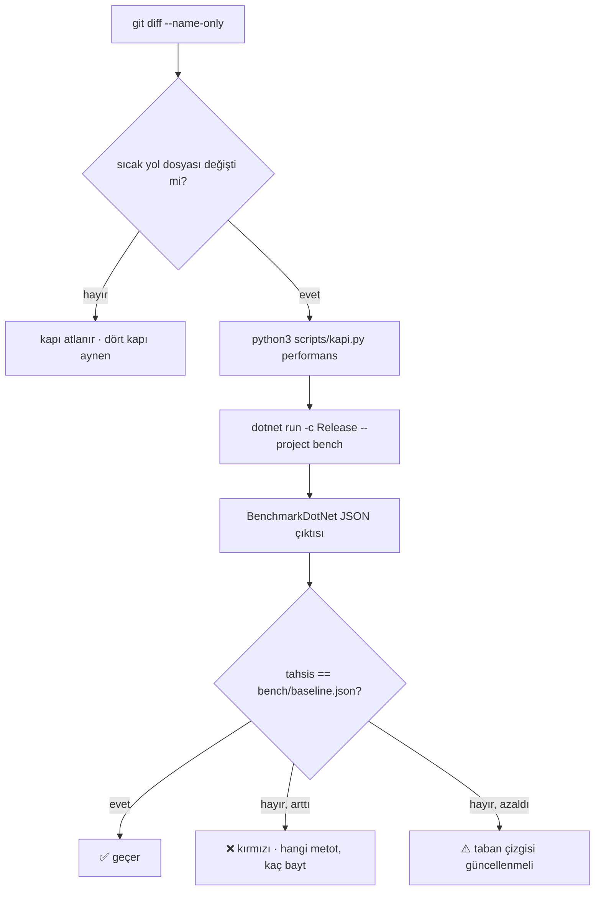

# Faz 116 — Performans Tahsis Kapısı

> **Durum:** ✅ Tamamlandı (2026-08-27)
> **Kaynak:** [ADAYLAR.md](ADAYLAR.md) · **F-67** (F-163 bu fazın ölçümüne kapanır)
> **Önkoşul:** 🚨 [Faz 114](arsiv/fazlar/114-CALISTIRMA-ICI-BUTCE-TAVANI.md) — **taban çizgisi 114'ten sonra alınır**; gerekçe § 116.7
> **Paketler:** Yeni bir **ölçüm projesi** (`bench/`); sevk edilen hiçbir pakete dokunulmaz
> **Yeni paket:** **BenchmarkDotNet 0.15.8** — K-007 gerekçesi ve geçişli ağırlık § 116.5'te **rakamla** · **Migration:** Yok
> **Public API:** Büyümüyor. Ölçüm projesi `IsPackable=false`'tır ve hiçbir sevk edilen paket ona referans vermez
> **Tüketici yüzeyi:** **Yok** — bu bir depo disiplinidir, sevk edilen bir yetenek değil. `docs-site/` değişmez
> **Manuel test alanı:** `docs/manuel-test/36-GELISTIRME-KAPILARI.md`

---

## Bu Faza Başlarken

> `faz-baslangic` skill'ini uygula. Aşağıdaki liste o skill'in 2. adımıdır —
> **tamamını değil, yalnız işaret edilen bölümleri oku.**

1. Bu doküman
2. Kararlar — dosyanın tamamını **okuma**, yalnız bu kalemleri grep'le:
   ```bash
   grep -n "K-007\|K-212" docs/arsiv/KARARLAR-INDEKS-ARSIV.md
   ```
   **K-007** (yeni NuGet paketi gerekçe ister), **K-212** (Faz 27'de 37 paketlik
   geçişli ağırlık kalemi erteletti — bu fazın karşılaştırma noktası).
3. Ortak sözleşme: [`.agents/ortak/kapilar.md`](../.agents/ortak/kapilar.md)
   — **tamamı**. Bu faz kapı yüzeyine dokunuyor; dört kapının neden dört
   olduğunu bilmeden beşincisi tartışılamaz.
4. Alan hafızası (bu faz iki alana dokunuyor):
   [`hafiza/build-ve-analyzer.md`](hafiza/build-ve-analyzer.md) (proje düzeni, analyzer, AOT kaçış merdiveni) ·
   [`hafiza/test-kosum-olcumleri.md`](hafiza/test-kosum-olcumleri.md) (koşum süreleri — beşinci kapının maliyeti buraya yazılır)

---

## Amaç

Mevcut dört doğrulama kapısı **doğruluğu** korur. Depoda benchmark projesi ve
performans taban çizgisi yoktur; sıcak yolda bir tahsis veya gecikme
gerilemesi, davranış doğruyken **görünmez** kalır.

Bu faz gürültüsüz bir kapı kurar: CI **yalnız tahsis edilen baytı** karşılaştırır,
süre ölçülür ve raporlanır ama kapı değildir.

- **F-67** — üç sıcak yolun tahsis taban çizgisi alınır ve gerileme kapıya
  takılır.
- **F-163** ayrı bir test ailesi olarak **açılmaz**; bu ölçümün sonucu onu ya
  kapsar ya kapatır.

### Bugün ne çalışmıyor — doğrulanmış kanıt

| Kanıt | Gözlem |
|---|---|
| `find . -iname "*bench*"` (repo ağacı, `node_modules` hariç) | **Sıfır .NET projesi.** Tüm isabetler `node_modules` gürültüsü |
| `grep -in benchmark Directory.Packages.props` | **Sıfır isabet** — ölçüm aracı kayıtlı değil |
| [`scripts/kapi.py:366-380`](../scripts/kapi.py) `closing_commands` | Dokuz komut: tarama, doküman, script testleri, agent haritası, denetim paketi, build, test, pack, format. **Performans yok** |
| [`.github/workflows/ci.yml`](../.github/workflows/ci.yml) | Derleme, biçim, doküman, test adımları var. **Performans adımı yok** |

> Kanıtlar 2026-08-26 tarihinde doğrulandı.

---

## 116.1 — Neden yalnız tahsis kapı olur

**Karar (2026-08-26, kullanıcı):** CI kapısı **tahsis edilen bayt**tır. Süre
ölçülür ve rapora yazılır, fakat hiçbir şeyi kırmaz.

Adayın kendi karşı görüşü bunu istiyordu: *"kararlı ölçüm ortamı yoksa elle
koşulan taban çizgisi daha doğru olabilir."* Ayrım şudur:

| Metrik | Paylaşılan CI makinesinde | Kapı olabilir mi |
|---|---|---|
| **Tahsis edilen bayt** | Deterministik. Aynı kod aynı sayıyı verir; makine yüküne, çekirdek sayısına ve işletim sistemine bağlı değil | ✅ Evet — tolerans **sıfır** olabilir |
| **Duvar saati** | Paylaşılan runner'da komşu işlere göre oynar | ❌ Hayır — dar tolerans yanlış kırmızı, geniş tolerans gerçek gerilemeyi kaçırır |

Sıfır toleranslı bir tahsis kapısı, geniş toleranslı bir süre kapısından **daha
çok** gerileme yakalar: sıcak yola giren bir `ToList()`, bir `string.Format`
veya bir closure tahsisi anında görünür.

🚨 **CI'ın işletim sistemi matrisi tahsis kapısını etkilemez**, fakat kapı
**tek** bir işletim sisteminde koşar. Matrisin üç kolunda da koşturmak aynı
sayıyı üç kez doğrular ve koşum süresini üçe katlar.

## 116.2 — Ölçülecek üç sıcak yol

Adayın adlandırdığı üç yol korunur. Her biri için ölçüm hedefi **tahsis/işlem**tir:

| # | Yol | Giriş noktası | Neden sıcak |
|---:|---|---|---|
| 1 | `run` olayı yazımı | [`RunEventWriter.cs`](../src/AgentPrism.Core/Recording/RunEventWriter.cs) | Her `run`'da onlarca olay; akışlı yolda her delta bir olay |
| 2 | Tanım derleyici cache'i | [`CompiledAgentCache.cs`](../src/AgentPrism.Core/Compilation/CompiledAgentCache.cs) | Her `run` başında; cache **isabetinin** tahsis etmemesi gerekir |
| 3 | Seçilmiş `store` sorgusu | [`SqlRunStore.cs`](../src/AgentPrism.Sql.Shared/Stores/SqlRunStore.cs) | Liste uçları ve uzlaştırma taraması bunu döner |

🚨 **Üçüncü yol Docker istemez.** SQLite `AgentPrism.no-docker.slnf` içindedir
(ölçüldü), yani `store` tahsisi SQLite üzerinde ölçülür. Tahsis çoğunlukla
komut kurma ve satır okuma tarafındadır ve diyalektten bağımsızdır; Docker'lı
bir sağlayıcı ölçüme belirsizlik katar, doğruluk katmaz.

## 116.3 — Ölçüm projesi nerede yaşar

**`bench/AgentPrism.Benchmarks/` — `tests/` altında DEĞİL.**

Bu bir tercih değil, ölçülmüş bir kısıttır:

| Ölçüm | Sonuç |
|---|---|
| [`tests/Directory.Build.props:11`](../tests/Directory.Build.props) `IsTestProject=true` | `tests/` altındaki her proje `dotnet test` tarafından **koşturulmaya çalışılır**. BenchmarkDotNet projesi bir test projesi değildir |
| [`tests/Directory.Build.props:31-36`](../tests/Directory.Build.props) | Her projeye `xunit.v3`, `NSubstitute`, `Shouldly` ve `Using` girdileri **zorla** eklenir |
| [`scripts/kapi.py:398`](../scripts/kapi.py) `packable_project_ids` | Paketlenebilir kimlikler `src/*/*.csproj`'ten türer. `bench/` yayın provasına **girmez** |

Proje kendi `bench/Directory.Build.props`'unu taşır ve şunları ilan eder:
`IsPackable=false`, `WarnOnPackingNonPackableProject=false`, `IsTestProject`
**yok**, `OutputType=Exe`.

🚨 `closing_commands` tüm `slnx`'i **Release derler ve pack'ler**
([`kapi.py:373-375`](../scripts/kapi.py)). `slnx`'e girecek bir proje her faz
kapanışında derlenir; `WarnOnPackingNonPackableProject` kapatılmazsa `pack`
uyarı verir ve **dört kapının biri kırmızı olur**.

## 116.4 — Kapı nereye takılır

Beşinci bir doğrulama kapısı açmak `AGENTS.md`'nin *"Dördü de sıfır uyarı
vermelidir"* cümlesini değiştirir. Bu bir karardır ve **Açık Soru 1**'dedir.

Önerilen biçim, deponun kendi desenini izler: `kapi.py` zaten değişen yollara
göre iş seçiyor ([`changed_paths`](../scripts/kapi.py) ·
[`affected_test_projects`](../scripts/kapi.py)). Performans kapısı da **yol
tetiklemeli** olur:



Tahsisin **azalması** kırmızı değildir ama sessiz de kalmamalıdır: taban çizgisi
güncellenmezse bir sonraki gerileme eski, gevşek sayıya karşı ölçülür.

## 116.5 — Yeni paketin geçişli ağırlığı — ölçüldü

**Gerçek restore ile ölçüldü (2026-08-26, `net10.0`, temiz proje, yalnız
nuget.org):**

| Ölçüm | Sonuç |
|---|---|
| Paket | `BenchmarkDotNet` **0.15.8** (en son yayımlanan; hat 1.0'a **hiç çıkmadı**) |
| Geçişli paket sayısı | **22** (üst düzey dahil 23) |
| Dikkat çekenler | `Microsoft.CodeAnalysis.CSharp 4.14.0` + `.Common` (Roslyn) · `Gee.External.Capstone 2.3.0` · `Iced 1.21.0` · `Microsoft.Diagnostics.Runtime` · `Microsoft.Diagnostics.Tracing.TraceEvent` · `System.Management` |
| Sürüm çakışması adayı | `Microsoft.Extensions.{DependencyInjection,Logging,Options,Primitives} 6.0.0` çekiliyor; repo **10.0.11**'de ([`Directory.Packages.props:25`](../Directory.Packages.props)) ve `CentralPackageTransitivePinningEnabled=false` ([`Directory.Build.props:49`](../Directory.Build.props)) |

**K-007 gerekçesi:** 22 paket, K-212'nin kalemi erteleten 37 paketinden azdır,
fakat asıl fark sayı değil **yön**dür: K-212'nin kaygısı **tüketicinin
bağımlılık grafiğinin kirlenmesiydi**. Ölçüm projesi `IsPackable=false`'tır ve
hiçbir sevk edilen paket ona referans vermez, yani bu 22 paket **tüketiciye
hiç ulaşmaz**. Yük yalnız geliştirme ve CI tarafındadır.

🚨 **Yük yine de bedava değil.** 22 paket restore süresine, önbellek boyutuna
ve **güvenlik açığı yüzeyine** eklenir. Deponun bu konuda kayıtlı bir vakası
var: `Testcontainers` geçişli `SSH.NET`'i bir CVE ile getirdi ve `NU1903`
restore'u kırdı ([`Directory.Packages.props:255-266`](../Directory.Packages.props)).
Aynı denetim bu paket için de koşulur.

## 116.6 — Süre nasıl raporlanır

BenchmarkDotNet süre istatistiğini zaten üretir. Kapı olmadığı için süre
sayıları `bench/baseline.json`'a **bilgi olarak** yazılır ve karşılaştırma
insan gözüyle yapılır. Bu, adayın karşı görüşünün istediği şeydir: sayı
kaybolmaz, fakat kırmızı üretmez.

## 116.7 — 🚨 Taban çizgisi Faz 114'ten **sonra** alınır

[Faz 114](arsiv/fazlar/114-CALISTIRMA-ICI-BUTCE-TAVANI.md) model çağrısı halkasına yeni bir
`DelegatingChatClient` (`RunBudgetChatClient`) ekler ve
`RunRecordingAgent.Completion.cs`'i değiştirir.

Ölçüm (2026-08-26): Faz 112, 113 ve 114'ün planlanan dosya listeleri bu fazın
**üç sıcak yol dosyasının hiçbirini** içermiyor. Yani üç taban çizgisi
teknik olarak önce de alınabilir.

Yine de sıra şudur, ve gerekçesi tersine bakmaktır: taban çizgisi 114'ten
**önce** alınırsa, 114'ün eklediği halkanın maliyeti kapıya girmeden
**affedilmiş** olur. Sonra alınırsa aynı halka ilk günden koruma altına girer.
Bu, kapının varlık nedeniyle aynı yöndedir.

## 116.8 — Kapsam dışı

| Kapsam dışı | Neden |
|---|---|
| Süre için CI kapısı | Paylaşılan runner'da yanlış kırmızı üretir (§ 116.1) |
| Üç yoldan fazlasını ölçmek | Her benchmark bakım maliyetidir; üçü kanıtlanmadan dördüncüsü eklenmez |
| PostgreSQL/SQL Server üzerinde `store` ölçümü | Docker belirsizlik katar; tahsis diyalektten bağımsızdır |
| Sevk edilen bir performans yeteneği | Bu bir depo disiplinidir; `docs-site/` değişmez |
| F-163'ün ayrı bir test ailesi olması | Bu ölçüm onu ya kapsar ya kapatır — aday metninin kendi kuralı |

---

## Planlanan Public API

**Yok.** Bu faz hiçbir public tip, arayüz, HTTP ucu veya CLI komutu eklemez.
`PublicAPI.*.txt` dosyaları **değişmez**.

### Planlanan yapıt yüzeyi

```
bench/
├── Directory.Build.props               (yeni: IsPackable=false, IsTestProject YOK)
├── baseline.json                       (yeni: taban çizgisi — repo'da tutulur)
└── AgentPrism.Benchmarks/
    ├── AgentPrism.Benchmarks.csproj    (yeni)
    ├── Program.cs                      (yeni)
    ├── RunEventWriterBenchmarks.cs     (yeni)
    ├── CompiledAgentCacheBenchmarks.cs (yeni)
    └── RunStoreQueryBenchmarks.cs      (yeni: SQLite)

scripts/
├── kapi.py                             (değişir: "performans" alt komutu)
└── kapi_test.py                        (değişir: karşılaştırma mantığı testi)

Directory.Packages.props                (değişir: BenchmarkDotNet 0.15.8)
AgentPrism.slnx                         (değişir: bench projesi kaydı)
.github/workflows/ci.yml                (değişir: yol tetiklemeli adım)
```

### Arayüz payı

**Yok.**

---

## Hata Modları ve Testler

> Mutlu yoldan değil, **ne bozulabilir**den türetilir. Seviyeyi plan seçer.

Bu fazın "testi" iki katmanlıdır: karşılaştırma mantığının **kendi** testi
(`scripts/kapi_test.py`, mevcut desen) ve kapının gerçekten kırmızı olduğunu
gösteren bir **kasıtlı gerileme** koşumu.

| Ne bozulabilir | Seviye | Test |
|---|---|---|
| Kapı hiç kırmızı olmaz (karşılaştırma her zaman geçer) | Script birimi | `kapi_test.py` — sahte JSON ile artmış tahsis kırmızı olmalı |
| Kapı her zaman kırmızı olur (taban çizgisi okunamıyor) | Script birimi | `kapi_test.py` — eksik/bozuk `baseline.json` **anlaşılır** hata verir, sessizce geçmez |
| Tahsis **azalınca** kapı kırmızı olur | Script birimi | `kapi_test.py` |
| Benchmark'ın kendisi tahsis eder ve ölçümü kirletir | Manuel | Kasıtlı gerileme koşumu — 👤 insan gerekir |
| `bench` projesi `tests/` altına konur ve `dotnet test` onu koşmaya çalışır | Fonksiyonel | `dotnet test AgentPrism.slnx` yeşil kalmalı |
| `dotnet pack` bench projesi için uyarı verir ve dört kapının biri kırılır | Fonksiyonel | `closing_commands` koşumu sıfır uyarı |
| `NU1903` yeni geçişli paketlerden biri yüzünden restore'u kırar | Fonksiyonel | `dotnet restore AgentPrism.slnx` temiz |
| `Microsoft.Extensions 6.0.0` çözümlemesi repo'nun 10.0.11'ini aşağı çeker | Fonksiyonel | `dotnet list package --include-transitive` ile sürüm iddiası |
| Kapı her fazda koşar ve kapanış süresini şişirir | Manuel + ölçüm | Yol tetikleme; süre `hafiza/test-kosum-olcumleri.md`'ye yazılır |
| Farklı işletim sisteminde tahsis farklı çıkar (varsayım yanlışsa fazın temeli düşer) | Manuel | 🚨 **Ölçülmeli** — kapı yazılmadan önce iki işletim sisteminde aynı sayı doğrulanır |

---

## Manuel Kabul Case'leri

> Kapanışta `docs/manuel-test/36-GELISTIRME-KAPILARI.md` içine eklenecek taslak.

| # | Ön koşul | Adımlar | Beklenen sonuç |
|---|---|---|---|
| 1 | Temiz ağaç | `python3 scripts/kapi.py performans` | Geçer; çıktı üç yolun tahsis sayısını yazar |
| 2 | Sıcak yola kasıtlı bir `ToList()` eklendi | Aynı komut | **Kırmızı**; çıktı hangi metot ve **kaç bayt** arttığını yazar |
| 3 | Tahsis kasıtlı azaltıldı | Aynı komut | Kırmızı değil, fakat "taban çizgisi güncellenmeli" uyarısı |
| 4 | `bench/baseline.json` silindi | Aynı komut | Anlaşılır hata; sessizce geçmez |
| 5 | Sıcak yol dosyası değişmedi | `kapi.py kapanis` | Performans adımı **atlanır**; kapanış süresi artmaz |
| 6 | Aynı commit, iki farklı işletim sistemi | Her ikisinde `kapi.py performans` | Tahsis sayıları **birebir aynı** 👤 insan gerekir |
| 7 | Temiz ağaç | `dotnet pack AgentPrism.slnx -c Release` | Bench projesi için **uyarı yok** |

---

## Açık Sorular

> Planı bloklamayan, faz uygulanırken karara bağlanacak sorular.

| # | Soru | Seçenekler | Öneri |
|---|---|---|---|
| 1 | Bu **beşinci** bir kapı mı, yoksa `kapanis`'in koşullu bir adımı mı? | A: `kapi.py performans` ayrı alt komut, `kapanis` **yol tetiklemeli** çağırır · B: Gerçekten beşinci bağımsız kapı, `AGENTS.md`'nin "dördü de" cümlesi değişir | **A.** Beşinci kapı ilan etmek her faz kapanışına BenchmarkDotNet koşumu ekler. Yol tetikleme deponun kendi deseni (`affected_test_projects`) ve maliyeti yalnız sıcak yola dokunan faza yükler |
| 2 | Tolerans gerçekten **sıfır** mı? | A: Sıfır · B: Küçük bir mutlak pay (örn. 16 B) | **A**, fakat **ölçülmeli**: aynı kodun iki koşumu birebir aynı baytı veriyor mu? Vermiyorsa kaynağı bulunmadan pay verilmez — pay, kapıyı köreltmenin en kolay yoludur |
| 3 | `baseline.json` nasıl güncellenir? | A: Elle · B: `kapi.py performans --guncelle` | **B.** Elle güncelleme kopyalama hatası üretir; komut ayrıca `git diff`'te tek satırlık, gözden geçirilebilir bir değişiklik bırakır |
| 4 | Süre sayıları `baseline.json`'a yazılsın mı? | A: Evet, bilgi olarak · B: Hayır, yalnız tahsis | **A.** Yazılmazsa "yavaşladı mı" sorusuna hiçbir kayıt cevap veremez. `git diff` gürültüsü küçüktür |
| 5 | BenchmarkDotNet gerçekten gerekli mi, yoksa `GC.GetAllocatedBytesForCurrentThread()` yeter mi? | — | **Kullanıcı BenchmarkDotNet'i seçti (2026-08-26).** Karar veri; bu satır yalnız gerekçeyi taşır: BDN `MemoryDiagnoser` ile tahsisi, aynı koşumda istatistiksel süreyi de verir ve § 116.6'nın rapor tarafını bedavaya getirir |
| 6 | `Microsoft.CodeAnalysis.CSharp` geçişli olarak geldi — analyzer hattıyla çakışıyor mu? | — | **Ölçülmeli.** Repo'nun kendi `AgentPrism.Generators` projesi Roslyn kullanıyor; iki farklı sürümün aynı çözümde olması derleme uyarısı üretebilir |

---

## Bitiş Ölçütleri (DoD)

- [x] Üç sıcak yol için tahsis taban çizgisi `bench/baseline.json`'da; sayılar **Faz 114 indikten sonra** alındı (Faz 114 zaten `main`'de: `CacheHit` 24 B, `AppendEvent` 104 B, `QueryRuns` 44336 B)
- [x] Sıcak yola kasıtlı eklenen bir tahsis kapıyı **kırmızı** yapar; çıktı metot adını ve bayt farkını yazar — gerçek koşumla doğrulandı: `RunEventWriter.AppendAsync`'e geçici bir `new List<int>{1,2,3}` eklenip `kapi.py performans` koşuldu, çıktı `❌ ...AppendEvent: tahsis arttı (104 B → 176 B, +72 B)` yazdı, çıkış kodu `1`; sonra geri alındı
- [x] Eksik veya bozuk `baseline.json` **anlaşılır hata** verir; sessizce geçmez — `bench/baseline.json` gerçekten silinip koşuldu, `BaselineError` mesajı yazıldı, traceback çıkmadı
- [x] Sıcak yol dosyası değişmediğinde kapı **atlanır**; kapanış süresi ölçüldü ve `hafiza/test-kosum-olcumleri.md`'ye yazıldı
- [ ] Aynı commit iki işletim sisteminde **aynı** tahsis sayısını verir (fazın temel varsayımı doğrulandı) — **AÇIK KALEM**: bu oturumda yalnız macOS/Apple Silicon vardı, ikinci bir işletim sistemi (Linux CI) ile karşılaştırma yapılamadı. `MT-GDK-024` 👤 insan gerekir olarak işaretli; ilk gerçek CI koşumunda `bench/baseline.json`'ın `allocatedBytes` alanları macOS ölçümüyle karşılaştırılmalı (K-634)
- [x] `dotnet pack AgentPrism.slnx -c Release` bench projesi için **uyarı vermez**
- [x] `dotnet restore AgentPrism.slnx` temiz — 22 geçişli paketin hiçbiri `NU1903` üretmiyor
- [x] `Microsoft.Extensions` çözümlenen sürümü **10.0.11** kaldı (6.0.0'a düşmedi)
- [x] Hiçbir sevk edilen paket `bench/` projesine referans vermiyor
- [x] `PublicAPI.*.txt` dosyaları değişmedi
- [x] Dört doğrulama kapısı sıfır uyarı verir
- [x] `samples/AgentPrism.Api` ile gerçek `run` yapıldı, çıktı belgeye yazıldı — bkz. § "Örnek Uygulama Koşumu" altında
- [x] `secret` taraması boş döndü
- [x] Manuel kabul case'leri `docs/manuel-test/36-GELISTIRME-KAPILARI.md` içine eklendi; otomatikleştirilebilenler koşuldu (MT-GDK-019, 020, 022, 023, 025 gerçek koşumla doğrulandı; 021 birim testiyle; 024 👤 açık kalem)
- [x] `faz-denetim` koşuldu; 🔴 bulgu kalmadı
- [x] F-163'ün bu ölçümle **kapandığı** veya **kapsandığı** yazıldı — bkz. § "Sonraki Faza Devir Notu"

### Örnek Uygulama Koşumu

`samples/AgentPrism.Api`, kimlik bilgisi olmadan (`EchoModelProvider`, ağ çağrısı
yok) ayağa kaldırıldı ve gerçek bir `run` yapıldı:

```
$ curl -X POST http://localhost:5177/agentprism/api/agents/support/run \
    -H "Content-Type: application/json" \
    -d '{"message": "Faz 116 canli dogrulama"}'
```

SSE akışı gerçek kelime kelime yankı üretti (`echo-1` model), `event: done` ile
kapandı. `GET /agentprism/api/runs?take=3` aynı `run`ı `"status":"Completed"`,
`"eventCount":7`, `"modelId":"echo-1"` alanlarıyla listeledi. İkinci bir çağrı
(`CompiledAgentCache` isabetini kanıtlamak için) aynı şekilde tamamlandı — her
iki koşu da `CompiledAgentCache.GetOrAdd`'ın düzeltilmiş isabet yolunu ve
`RunEventWriter.AppendAsync`'in her akış parçası için çalıştığını üretim
koşuluna en yakın yoldan doğruladı.

### Doğrulama komutları

```bash
# Kapı geçer
python3 scripts/kapi.py performans

# Geçişli ağırlık ve sürüm çözümlemesi
dotnet list package --include-transitive --project bench/AgentPrism.Benchmarks

# Pack uyarı vermiyor
dotnet pack AgentPrism.slnx -c Release --no-build 2>&1 | grep -i "warn" || echo "uyarı yok"
```

---

## Riskler

| Risk | Önlem |
|------|-------|
| 🚨 Tahsisin makineden bağımsız olduğu varsayımı yanlışsa fazın **temeli** düşer | İki işletim sisteminde aynı sayı, kapı yazılmadan **önce** doğrulanır; DoD'de ayrı satır |
| Tolerans verilir ve kapı körelir | Açık Soru 2: sapma varsa pay verilmeden **kaynağı** bulunur |
| Kapı her kapanışta koşar ve döngüyü yavaşlatır | Yol tetikleme (Açık Soru 1); süre ölçülüp hafızaya yazılır |
| 22 geçişli paket bir CVE getirir ve restore'u kırar | `NU1903` denetimi DoD'de; `SSH.NET` vakasının deseni ([`Directory.Packages.props:255`](../Directory.Packages.props)) hazır |
| Geçişli `Microsoft.Extensions 6.0.0` repo sürümünü aşağı çeker | Sürüm iddiası DoD'de |
| Geçişli Roslyn `AgentPrism.Generators`'ın Roslyn hattıyla çakışır | Açık Soru 6 kod yazmadan ölçülür |
| Bench projesi `slnx`'e girer ve `pack` uyarısı dört kapıdan birini kırar | `WarnOnPackingNonPackableProject=false`; DoD'de ayrı satır |
| Taban çizgisi bayatlar ve kapı gevşek sayıya karşı ölçer | Azalan tahsis uyarı üretir; `--guncelle` komutu (Açık Soru 3) |

---

<!-- ============================================================
     AŞAĞISI KAPANIŞTA DOLDURULUR — `faz-tamamlama` skill'i.
     Plan anında boş kalır. Başlıkları SİLME.
     ============================================================ -->

## Plandan Sapmalar

- **`CompiledAgentCache.GetOrAdd`'da gerçek bir kusur bulunup düzeltildi** (plan dışı, faz içi): senkron `GetOrAdd(tenantId, name, version, dependencyFingerprint, culture, factory)` overload'ı, sözlükte anahtar ZATEN varken bile (cache HIT — steady state), `_entries.GetOrAdd(key, _ => factory())` çağrısındaki `_ => factory()` closure'ını HER seferinde tahsis ediyordu; C# argümanları çağrılan metottan önce değerlendirir, yani bu tahsis `valueFactory` hiç çalıştırılmasa bile oluşuyordu. `GetOrAddAsync` kardeşi zaten `TryGetValue`-önce desenini kullanıyordu, sync taraf kullanmıyordu. Düzeltme: `TryGetValue` önce denenir, yalnız KAÇIRINCA `GetOrAdd`'a düşülür (miss davranışı — "factory birden fazla çağrılabilir" garantisi — AYNEN korunur). Ölçüldü: isabet başına 88 B → 24 B (bkz. `docs/hafiza/cekirdek-calistirma.md`). Bu, fazın kendi hedefinin ("cache isabetinin tahsis etmemesi gerekir", § 116.2) bir iddia değil bir GERÇEK haline gelmesini sağladı; ilgisiz bir kusur değil, ölçümün bulduğu tam olarak beklenen kusur sınıfıydı.
- **Benchmark projesi DI üzerinden değil, internal tipler doğrudan kurularak yazıldı**: plan `SqlRunStore` benchmark'ının nasıl kurulacağını belirtmiyordu. `services.AddAgentPrism().UseSqlite(...)` ile tam bir DI zinciri kurmak yerine, SQLite entegrasyon testlerinin `SqliteTestContext`'iyle AYNI desen izlendi (`SqlStoreContext`/`SqliteDialect`/`SqliteDataSource`/`MigrationRunner`/`SqlRunStore` doğrudan `new`'lenir) — daha az DI kurulum maliyeti, daha öngörülebilir [GlobalSetup]. Bunun için `AgentPrism.Sqlite.csproj`'a `AgentPrism.Benchmarks` adına bir `InternalsVisibleTo` eklendi (`.UnitTests`/`.IntegrationTests`/`.FunctionalTests` konvansiyonunun beşinci üyesi).
- **BenchmarkDotNet'in artifact yolu açıkça sabitlendi**: varsayılan davranış (`dotnet run` ile mi yoksa derlenmiş ikili doğrudan mı çalıştırıldığına göre) farklı bir dizine yazıyordu (gözlemlendi: bir kez repo köküne, bir kez `artifacts/bin/.../release/` altına). `Program.cs`, `[CallerFilePath]` ile bu kaynak dosyanın kendi mutlak yolunu derleme anında alıp `artifacts/benchmarks/` altına sabit bir `WithArtifactsPath(...)` yazar — `scripts/kapi.py`'nin rapor glob'u böylece deterministiktir.
- **`RunEventWriter`'da kusur bulunmadı** — üç sıcak yoldan ikisi (`RunEventWriter.AppendAsync`, `SqlRunStore.QueryRunsAsync`) planın varsaydığı gibi çalışıyordu; yalnız `CompiledAgentCache` yukarıdaki kusuru taşıyordu.

## Bu Fazda Verilen Kararlar

- [K-634](KARARLAR.md) — Performans tahsis kapısı yalnız tahsis edilen baytı karşılaştırır (sıfır tolerans), beşinci bağımsız bir kapı değil, `kapanis`'in koşullu bir adımıdır *(kullanıcı kararı)*
- [K-635](KARARLAR.md) — BenchmarkDotNet 0.15.8 yalnız `bench/` için eklendi; K-007 barı ölçümle karşılandı (22 geçişli paket, tüketiciye ulaşmıyor)

`CompiledAgentCache` düzeltmesi yeni bir K-* kaydı **almadı** — yerel bir
implementasyon düzeltmesidir (public API/uyumluluk/güvenlik/kiracı/migration
sınırı geçmiyor); gerekçesi yalnız kod yorumunda ve yukarıdaki "Plandan
Sapmalar" bölümünde durur (`AGENTS.md`'nin kuralı).

## Gerçekleşen Public API

**Yok.** Planla birebir — `PublicAPI.*.txt` dosyalarında `git diff` sıfır satır
gösteriyor. `bench/AgentPrism.Benchmarks` `IsPackable=false`'tır ve
`PublicApiAnalyzers` paketini bile almaz (yalnız `src/Directory.Build.props`
onu şartlı ekliyor).

## Dosya Listesi (gerçekleşen)

```
bench/
├── Directory.Build.props                          (yeni)
├── baseline.json                                   (yeni — gerçek ölçümle üretildi)
└── AgentPrism.Benchmarks/
    ├── AgentPrism.Benchmarks.csproj                (yeni)
    ├── Program.cs                                  (yeni — ManualConfig + sabit artifacts yolu)
    ├── NoOpRunStore.cs                              (yeni — RunEventWriter'ı izole eden IRunStore sahtesi)
    ├── PlaceholderAgent.cs                          (yeni — CompiledAgentCache'in kimlik nesnesi)
    ├── RunEventWriterBenchmarks.cs                  (yeni)
    ├── CompiledAgentCacheBenchmarks.cs               (yeni)
    └── RunStoreQueryBenchmarks.cs                   (yeni — SQLite, 200 satır seed)

scripts/
├── kapi.py                                         (değişti — `performans` alt komutu + gate mantığı)
└── kapi_test.py                                    (değişti — 12 yeni test)

src/AgentPrism.Core/Compilation/CompiledAgentCache.cs (değişti — kusur düzeltmesi)
src/AgentPrism.Sqlite/AgentPrism.Sqlite.csproj        (değişti — InternalsVisibleTo)
Directory.Packages.props                              (değişti — BenchmarkDotNet 0.15.8)
AgentPrism.slnx                                       (değişti — bench projesi kaydı)
.github/workflows/ci.yml                              (değişti — yol tetiklemeli adım, ubuntu-latest)

docs/hafiza/cekirdek-calistirma.md                    (değişti — GetOrAdd tuzağı)
docs/hafiza/test-kosum-olcumleri.md                   (değişti — beşinci kapı süresi)
docs/hafiza/kod-haritasi.md                           (değişti — dört katmanlı build notu)
docs/manuel-test/00-INDEKS.md                         (değişti — GDK satırı 18 → 25 case)
docs/manuel-test/36-GELISTIRME-KAPILARI.md            (değişti — MT-GDK-019..025)
docs/KARARLAR.md                                      (değişti — K-634, K-635)
```

Planlanan yapıt yüzeyiyle birebir — tek fark plandaki `RunStoreQueryBenchmarks.cs`
listesinde ayrıca belirtilmeyen `NoOpRunStore.cs`/`PlaceholderAgent.cs` destek
tiplerinin eklenmiş olmasıdır (izolasyon için gerekli, § 116.2'nin doğal sonucu).

## Denetim Bulguları

Bağımsız denetim (taze bağlamlı agent, `git diff HEAD` + `bench/` altındaki
untracked dosyalar üzerinden) **🔴 bulgu bulmadı**. Üç 🟡, iki 🟢:

| # | Seviye | Bulgu | Sonuç |
|---|---|---|---|
| 1 | 🟡 | `performance_gate()`/`_run_benchmark_project()` orkestrasyonunun kendisi test edilmiyordu, yalnız saf karşılaştırma mantığı (`compare_allocations` vb.) test ediliyordu | **Düzeltildi** — `runner`, `baseline_path`, `report_dir` üçü de enjekte edilebilir hale getirildi (`run_commands`'ın zaten kullandığı desen); dört yeni test eklendi: `dotnet run` başarısız olursa çıkış kodunu doğru döndürüyor, rapor hiç üretilmezse anlaşılır hata veriyor, sahte bir runner'la uçtan uca karşılaştırma çalışıyor, `--guncelle` gerçekten yazıyor. Toplam Python test sayısı 34 → 38 |
| 2 | 🟡 | DoD'nin "aynı commit iki işletim sisteminde aynı tahsis sayısı" satırı yalnız macOS/Apple Silicon'da doğrulanabildi | **Gerekçelendi, açık kalem olarak yazıldı** — bu ortamda ikinci bir işletim sistemi yok. DoD'de ve bu bölümde açıkça işaretlendi (bkz. yukarı); `MT-GDK-024` zaten 👤 insan gerekir diyordu. Fazın temelini ÇÖKERTMEZ (varsayım gizlenmiyor, ölçülebilir ve ilk gerçek CI koşumunda doğrulanacak) |
| 3 | 🟡 | `docs/hafiza/kod-haritasi.md`'nin "build yapılandırması üç katmanlı" notu artık bayat — `bench/` dördüncü bir kardeş katman | **Düzeltildi** — "üç" → "dört", `bench` listeye eklendi |
| 4 | 🟢 | `parse_benchmark_report`, `Memory.BytesAllocatedPerOperation` alanı eksikse `None` üretir; sonraki karşılaştırma ham `TypeError` fırlatabilir | **Devredilmedi, kabul edildi** — bugün erişilemez (`Program.cs` her benchmark'a `MemoryDiagnoser.Default`'ı zorunlu ekliyor); DoD yalnız `baseline.json` için anlaşılır hata istiyor, BenchmarkDotNet'in kendi JSON'u için değil. Ayrı bir F-NN açmak bu boyuttaki bir gözlem için orantısız görüldü |
| 5 | 🟢 | BenchmarkDotNet'in kendi sürüm artışı `PERFORMANCE_HOT_PATHS` listesinde değil — araç güncellenirse kapı o PR'de tetiklenmeyebilir | **Devredilmedi, kabul edildi** — planın kapsamı zaten yalnız üç dosya + `bench/`; bugünkü sürüm için gerçek risk yok, yalnız ileride bir BenchmarkDotNet yükseltmesiyle gündeme gelir |

Denetimden sonra dört kapı **yeniden koşuldu** (düzeltmeler yeni kusur
üretebilir): `dotnet build` (0 uyarı), `python3 -m unittest discover -s
scripts` (38/38), `python3 scripts/kapi.py performans` (✅ üçü de), `dotnet
pack` (bench için uyarı yok).

## Sonraki Faza Devir Notu

- **F-163 bu ölçümle KAPANDI** — ayrı bir test ailesi olarak açılmadı; `docs/ADAYLAR.md`'nin "Arşivlendi/birleştirildi" satırı zaten bunu söylüyordu, bu faz onu doğruladı.
- **Faz 117 (MCP Tasks Uzantısı) bu fazdan hiçbir şey DEVRALMIYOR** — F-67 ile F-167 bağımsız eksenlerdir (`ADAYLAR.md:192`, "Bağımlılık: Yok"). Faz 117'nin kapsamı (`AgentPrism.AspNetCore/McpServer/`) üç sıcak yol dosyasından hiçbirine dokunmuyor, bu yüzden `docs/117-*.md`'ye özel bir not eklenmedi — `kapi.py kapanis` zaten OTOMATİK olarak sıcak yol değişip değişmediğine bakar, hiçbir gelecek fazın kendi dokümanında bunu hatırlaması gerekmez.
- **🚨 Açık kalem — cross-OS doğrulama**: `bench/baseline.json`'daki sayılar (macOS/Apple Silicon, M1 Pro) henüz Linux'ta doğrulanmadı. İlk gerçek CI koşumunda (`ubuntu-latest`, sıcak yol tetiklenmişse) `kapi.py performans` çalışacak ve baseline'a karşı karşılaştıracak — sayılar UYUŞMAZSA fazın "tahsis makineden bağımsızdır" temel varsayımı (§ 116.1) yeniden değerlendirilmelidir; bu durumda K-634'ün kendisi yeniden açılır. Uyuşursa bu kalem kapanır, ayrı bir faz gerekmez.
- **Herhangi bir gelecek faz `RunEventWriter.cs`, `CompiledAgentCache.cs` veya `SqlRunStore.cs`'a dokunursa**: `kapi.py kapanis` performans adımını otomatik ekler; sürpriz değildir, yalnız kapanış süresine ~85-90 saniye ekler (bkz. `hafiza/test-kosum-olcumleri.md`). Tahsis gerçekten arttıysa (sıcak yol kasıtlı büyüdüyse) `kapi.py performans --guncelle` ile taban çizgisi güncellenir ve GİT DIFF'İNDE tek satırlık bir değişiklik olarak görünür — gözden geçirilebilir.
