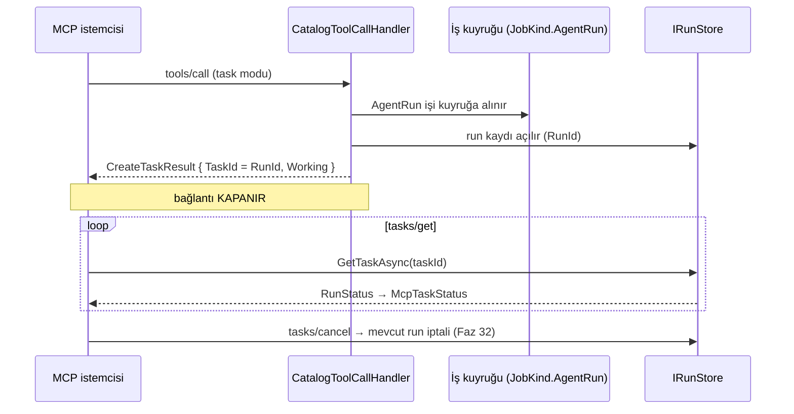

# Faz 117 — MCP Tasks Uzantısı

> **Durum:** 📋 Planlandı (2026-08-26)
> **Kaynak:** [ADAYLAR.md](ADAYLAR.md) · **F-167** (yalnız **Tasks dilimi**; MRTR ve elicitation bu fazda **değil** — § 117.7)
> **Önkoşul:** Faz 50 (dışa açılan agent yüzeyi) ve Faz 46 (dayanıklı çalıştırma, `JobKind.AgentRun`) — ikisi de arşivde
> **Paketler:** `AgentPrism.AspNetCore` (yalnız `McpServer/`)
> **Yeni paket:** `ModelContextProtocol.Extensions.Tasks` 2.2.0 — **net yeni geçişli paket: 0** (ölçüldü, § 117.5) · **Migration:** **Yok** (§ 117.3)
> **Public API:** Büyüyor — `AgentPrismMcpServerOptions` üzerinde bir opt-in alanı. Faz 7'den önce ucuz: `wc -l src/*/PublicAPI.Shipped.txt` toplamı **17** satır, hepsi başlık (K-603)
> **Tüketici yüzeyi:** `docs-site/src/content/docs/guides/external-agents.md`, `capabilities.md`
> · sevk edilen: `AgentPrismMcpServerOptions` XML dokümanı, `src/AgentPrism.AspNetCore/README.md`
> **Manuel test alanı:** `docs/manuel-test/18-MCP-VE-A2A.md`

---

## Bu Faza Başlarken

> `faz-baslangic` skill'ini uygula. Aşağıdaki liste o skill'in 2. adımıdır —
> **tamamını değil, yalnız işaret edilen bölümleri oku.**

1. Bu doküman
2. Kararlar — dosyanın tamamını **okuma**, yalnız bu kalemleri grep'le:
   ```bash
   grep -n "K-603" docs/KARARLAR.md
   grep -n "K-057\|K-103\|K-178\|K-212" docs/arsiv/KARARLAR-INDEKS-ARSIV.md
   ```
   **K-057** (MCP paketi `.Core` mi tam paket mi — bu fazın paket kararı onun
   üstüne oturur), **K-103** (dışa açılan agent onay isteyen tool taşıyamaz —
   🚨 bu fazın **en büyük riski**, § 117.4), **K-178** (yeni tablo üç migration
   demektir — bu faz tabloyu **almıyor**), **K-212** (geçişli ağırlık sayılır).
3. Alan hafızası (bu faz iki alana dokunuyor):
   [`hafiza/mcp-a2a-sunucu.md`](hafiza/mcp-a2a-sunucu.md) (bu fazın ana alanı) ·
   [`hafiza/cekirdek-calistirma.md`](hafiza/cekirdek-calistirma.md) (run durumları, kuyruklu run)
4. Gerektiğinde, tamamı değil ilgili bölümü:
   [`MIMARI-GUVENLIK.md`](MIMARI-GUVENLIK.md) — dışa açılan yüzey bölümü

---

## Amaç

AgentPrism'i MCP sunucusu olarak tüketen bir ekip, uzun süren bir agent
çağrısı boyunca **bağlantıyı açık tutmak** zorundadır: bugünkü handler agent'ı
satır içinde `await` eder ve `tools/call` yanıtı run bitene kadar gelmez.

MCP 2026-07-28 bunun için resmî bir uzantı tanımladı ve C# SDK'sı onu ayrı bir
pakette gönderdi. Bu faz o uzantıyı **AgentPrism'in var olan kuyruklu run
modeline** oturtur: MCP task kimliği, AgentPrism'in run kimliğidir.

- **F-167 (Tasks dilimi)** — uzun run, bağlantı kapalıyken poll ve cancel
  edilebilir hâle gelir.

### Bugün ne çalışmıyor — doğrulanmış kanıt

| Kanıt | Gözlem |
|---|---|
| [`CatalogToolCallHandler.cs:79-84`](../src/AgentPrism.AspNetCore/McpServer/CatalogToolCallHandler.cs) | `await agent.RunAsync(...)` — run **satır içi ve senkron**; MCP bağlantısı run boyunca açık kalır |
| `grep -rn "Stateless\|MRTR\|Tasks\|Elicit" src/AgentPrism.AspNetCore/McpServer src/AgentPrism.Mcp` | **Sıfır isabet** — 2026-07-28'in hiçbir yeni yüzeyi yok |
| [`AgentPrismMcpServerBuilderExtensions.cs:59-62`](../src/AgentPrism.AspNetCore/McpServer/AgentPrismMcpServerBuilderExtensions.cs) | `AddMcpServer().WithHttpTransport().WithListToolsHandler(...).WithCallToolHandler(...)` — `.WithTasks(...)` yok |
| [`Directory.Packages.props:173,183`](../Directory.Packages.props) | SDK **2.2.0**'a sabit — uzantı paketi **aynı sürüm hattında** |

> Kanıtlar 2026-08-26 tarihinde doğrulandı.

---

## 117.1 — Ölçülen API yüzeyi (tahmin edilmedi)

Paket `reflection` ile okundu (2026-08-26, kurulu 2.2.0):

```csharp
// Kayıt
IMcpServerBuilder WithTasks(this IMcpServerBuilder, IMcpTaskStore);
IMcpServerBuilder WithTasks(this IMcpServerBuilder, IMcpTaskStore, Action<McpTasksOptions>);

// Seam — AgentPrism bunu uygular
public interface IMcpTaskStore
{
    Task<McpTaskInfo> CreateTaskAsync(CancellationToken);
    Task<McpTaskInfo> GetTaskAsync(string taskId, CancellationToken);
    Task SetCompletedAsync(string taskId, JsonElement result, CancellationToken);
    Task SetFailedAsync(string taskId, JsonElement error, CancellationToken);
    Task<bool> SetCancelledAsync(string taskId, CancellationToken);
    Task SetInputRequestsAsync(string, IDictionary<string, InputRequest>, CancellationToken);
    Task ResolveInputRequestsAsync(string, IDictionary<string, InputResponse>, CancellationToken);
}

public enum McpTaskStatus { Working, InputRequired, Completed, Cancelled, Failed }
public enum McpTaskExecutionMode { Synchronous, Optional, Required }
public sealed class McpTasksOptions { Func<…, McpTaskExecutionMode> ExecutionModeSelector { get; set; } }
```

`McpTaskInfo`: `TaskId`, `Status`, `CreatedAt`, `LastUpdatedAt`, `TimeToLive`,
`PollIntervalMs`, `StatusMessage`, `Result`, `Error`, `InputRequests`.

🚨 **Sözleşmede kiracı parametresi yoktur.** `GetTaskAsync(string taskId, …)`
yalnız kimliğe bakar. **Kiracı sınırını AgentPrism'in uygulaması zorlamak
zorundadır** — SDK hiçbir kanca vermez. Bu, adayın işaret ettiği çapraz kiracı
sızıntısı riskinin tam yeridir.

## 117.2 — SDK'nın `InMemoryMcpTaskStore`'u neden kullanılmıyor

Paket hazır bir uygulama veriyor ve kayıt tek satır. İki ölçülmüş sebeple
kullanılmıyor:

| Sebep | Sonuç |
|---|---|
| Bellek içidir | Task yalnız onu oluşturan **örnekte** yaşar. AgentPrism çok örnekli çalışabilir (Faz 42, tek yürütücü seçimi); istemci başka örneğe poll ederse task yok sayılır |
| Kiracı süzgeci yoktur | Task kimliğini bilen herkes okur — K-041'in kiracı yalıtımı sınırının dışına düşer |

## 117.3 — Seçilen tasarım: task id **=** run id

**Karar (2026-08-26, kullanıcı):** `IMcpTaskStore`, AgentPrism'in var olan
`IRunStore`'u üzerine uygulanır. MCP task kimliği, AgentPrism'in run
kimliğidir.



**Bu tasarımın bedavaya getirdikleri:**

| Kazanç | Neden bedava |
|---|---|
| **Yeni tablo yok, migration yok** | Run zaten kalıcı; K-178'in üç migration maliyeti hiç doğmaz |
| Çok örneklilik | Run kaydı paylaşılan veritabanındadır |
| Kiracı yalıtımı | `IRunStore` sorguları zaten kiracı süzer; SDK'nın eksik kancası AgentPrism tarafında **zaten** kapalıdır |
| İptal | `tasks/cancel` mevcut run iptaline (Faz 32) bağlanır; ikinci bir iptal modeli doğmaz |
| Gözlemlenebilirlik | Task, arayüzde ve maliyet raporunda **zaten** görünen bir run'dır |

### Durum eşlemesi

| `RunStatus` | `McpTaskStatus` | Not |
|---|---|---|
| `Queued` (5) · `Running` (0) | `Working` | |
| `Completed` (1) | `Completed` | `Result` = run çıktısından üretilen `CallToolResult` |
| `Failed` (2) | `Failed` | |
| `Canceled` (3) | `Cancelled` | |
| `AwaitingApproval` (6) · `AwaitingInput` (4) | **`Failed`** | 🚨 § 117.4 — `InputRequired` **değil** |

## 117.4 — 🚨 K-103 sınırı yer değiştiriyor — fazın en büyük riski

Bugün onay sınırı **iki** yerde zorlanıyor:

1. Başlangıçta: `ExternalSurfaceGuard` onay isteyen tool taşıyan agent'ı
   yüzeye çıkarmaz.
2. Çalışma anında: [`CatalogToolCallHandler.cs:96-103`](../src/AgentPrism.AspNetCore/McpServer/CatalogToolCallHandler.cs)
   run bittikten **sonra** `ChildRunApproval.Describe(response.Messages)`
   ile bakar ve hata döner. Kodun kendi yorumu bunu *"defense layer"* diye
   adlandırıyor: tanım run'dan **sonra** güncellenip onaylı bir tool
   ekleyebilir (dinamik katalog).

Run kuyruğa taşındığında **ikinci kontrol handler'dan düşer** — çünkü handler
artık `response`'u görmez. Sessizce düşerse dinamik katalog deliği yeniden
açılır.

**Bu yüzden eşleme tablosunda `AwaitingApproval` → `Failed`'dir**, ve hata
metni bugünkü inline metnin **aynısı** olur. `InputRequired`'a eşlemek, dışa
açılan bir agent'a onay sorusu sordurmak demektir; K-103 tam olarak bunu
yasaklar.

🚨 `faz-uygulama` Adım 4'ün imza–gövde kuralı burada geçerlidir: kontrolün
**gövdesi** yeni yola elle taşınmalıdır; imzayı değiştirmek onu taşımaz.

## 117.5 — Yeni paketin geçişli ağırlığı — ölçüldü

**Gerçek restore ile ölçüldü (2026-08-26, `net10.0`, temiz proje, yalnız
nuget.org):**

| Ölçüm | Sonuç |
|---|---|
| Yalnız `ModelContextProtocol.AspNetCore` 2.2.0 | **13** paket |
| `+ ModelContextProtocol.Extensions.Tasks` 2.2.0 | **14** paket |
| **Net yeni** | **1 — paketin kendisi. Geçişli ağırlık sıfır** |

Uzantının çektiği on iki geçişli paketin **tamamı** (`ModelContextProtocol`,
`.Core`, `Microsoft.Extensions.*` ailesi, `Microsoft.Extensions.AI.Abstractions`)
`.AspNetCore` üzerinden **zaten** grafikte.

**K-007 gerekçesi:** K-212'nin 37 paketlik vakasıyla kıyaslanacak bir ağırlık
yoktur. K-057'nin `.Core`-değil-tam-paket ayrımı da **bozulmuyor**: uzantı
yalnız `AgentPrism.AspNetCore` içine girer; `AgentPrism.Mcp` (istemci)
`.Core`'da kalır ve bu paketi hiç görmez.

## 117.6 — Varsayılan kapalı

**Karar (2026-08-26, kullanıcı):** `ExecutionModeSelector` varsayılan olarak
`Synchronous` döner — yani **bugünkü davranış birebir korunur**. Tasks yalnız
tüketici `AgentPrismMcpServerOptions` üzerinden açtığında devreye girer.

Gerekçe K1'dir: her yeni genişleme noktası varsayılan kapalı gelir. `Optional`
varsayılanı, task'ı bilen istemciler için davranışı **kendiliğinden**
değiştirirdi.

## 117.7 — Kapsam dışı

| Kapsam dışı | Neden |
|---|---|
| **MRTR ve elicitation** | Ayrı bir karardır. `IMcpTaskStore` `SetInputRequestsAsync`/`ResolveInputRequestsAsync` taşıyor, yani ileride **aynı** deponun üstüne biner — fakat bu faz onları **uygulamaz**, boş bırakır. Adayın kendi sınırı: mevcut onay/input modeliyle üçüncü bir state modeli üretilmemelidir |
| `ModelContextProtocol.Extensions.Apps` | Ayrı paket, ayrı yüzey, ölçülmüş tüketici yok |
| Cache'lenebilir `list` sonuçları | Ayrı ve bağımsız iş; Tasks ile ortak kodu yok |
| A2A tarafına task/push | F-167 MCP kalemidir; A2A'nın `Streaming`/`PushNotifications` boşluğu keşif kaydında ayrı kalem (§ 4) |
| Yeni `mcp_tasks` tablosu | § 117.3 — run kaydı yeterli |

---

## Planlanan Public API

> Taslak imzalardır. Gerçekleşen imzalar kapanışta ayrı bir bölüme yazılır.

```csharp
// AgentPrism.AspNetCore — McpServer/AgentPrismMcpServerOptions.cs
public sealed class AgentPrismMcpServerOptions
{
    // mevcut: ExposedAgents, ExposeAllAgents, ToolNamePrefix, Budget

    /// <summary>
    /// Serves long-running agent calls as MCP tasks instead of holding the
    /// connection open. Default <see langword="false"/>: enabling it is an
    /// explicit choice, and today's synchronous behavior is unchanged.
    /// </summary>
    public bool EnableTasks { get; set; }

    /// <summary>How long a finished task stays readable. Default 1 hour.</summary>
    public TimeSpan TaskTimeToLive { get; set; } = TimeSpan.FromHours(1);

    /// <summary>Poll interval advertised to the client. Default 2 seconds.</summary>
    public TimeSpan TaskPollInterval { get; set; } = TimeSpan.FromSeconds(2);
}
```

`IMcpTaskStore` uygulaması **internal**'dır (`RunBackedMcpTaskStore`); tüketici
onu değiştirmez, çünkü task kimliği AgentPrism'in run kimliğidir ve başka bir
depo o sözü tutamaz.

### HTTP `endpoint`'leri

**Yeni AgentPrism ucu yok.** Uzantı MCP protokol metotlarını (`tasks/get`,
`tasks/cancel`, `tasks/update`) mevcut MCP transport'u üzerinden ekler; bunlar
`/agentprism` yolunun MCP ucunun içindedir ve OpenAPI belgesine girmez.

### Arayüz payı

**Yok.**

---

## Planlanan Dosya Listesi

```
src/AgentPrism.AspNetCore/McpServer/
├── RunBackedMcpTaskStore.cs                (yeni: IMcpTaskStore → IRunStore)
├── McpTaskStatusMapping.cs                 (yeni: RunStatus → McpTaskStatus)
├── CatalogToolCallHandler.cs               (değişir: task modu + K-103 kontrolünün taşınması)
├── AgentPrismMcpServerBuilderExtensions.cs (değişir: .WithTasks(...))
└── AgentPrismMcpServerOptions.cs           (değişir: üç alan)

Directory.Packages.props                    (değişir: ModelContextProtocol.Extensions.Tasks 2.2.0)

tests/AgentPrism.AspNetCore.FunctionalTests/
├── McpTasksEndpointTests.cs                (yeni)
└── McpTaskTenantIsolationTests.cs          (yeni)
```

---

## Hata Modları ve Testler

> Mutlu yoldan değil, **ne bozulabilir**den türetilir. Seviyeyi plan seçer.
> Sınır geçen davranış (DI · HTTP · kiracı · akış · depo · paket) birim
> testiyle kanıtlanamaz — [`.agents/ortak/test-seviyeleri.md`](../.agents/ortak/test-seviyeleri.md).

| Ne bozulabilir | Seviye | Test sınıfı |
|---|---|---|
| 🚨 **Başka kiracı task id'yi bilerek okur** | Sözleşme (`TenantIsolationContract`) | dört koşumda birden |
| 🚨 K-103 kontrolü yeni yola taşınmaz; onay isteyen tool dışa açılan run'da çalışır | Fonksiyonel | `McpTasksEndpointTests` — dinamik katalog senaryosu |
| `AwaitingApproval` `InputRequired`'a eşlenir ve dışa agent'a onay sorusu sorulur | Fonksiyonel | `McpTasksEndpointTests` |
| `EnableTasks=false` iken davranış değişir (gerileme) | Fonksiyonel | `McpTasksEndpointTests` — bugünkü senkron yol bit-bit aynı |
| `tasks/cancel` run'ı gerçekten iptal etmez | Fonksiyonel | `McpTasksEndpointTests` |
| İptal edilen run `Cancelled` yerine `Failed` görünür | Fonksiyonel | `McpTasksEndpointTests` |
| Olmayan task id `500` üretir (`404` yerine) | Fonksiyonel | `McpTasksEndpointTests` |
| Task `TimeToLive` sonrası hâlâ okunur / erken kaybolur | Fonksiyonel | `McpTasksEndpointTests` |
| Kuyruğa alma başarısızsa istemci `Working` bir task alır ve sonsuza kadar poll eder | Fonksiyonel | `McpTasksEndpointTests` — alt sistem hatası |
| İki örnekli kurulumda task ikinci örnekten okunamaz | Fonksiyonel | `McpTasksEndpointTests` — iki host, tek veritabanı |
| Uzantı paketi geçişli ağırlık getirir | Fonksiyonel | `DependencyDirectionTests` + `dotnet list package --include-transitive` iddiası |
| `AgentPrism.Mcp` (istemci) uzantı paketini görür — K-057 bozulur | Fonksiyonel | `DependencyDirectionTests` |

Beş sorunun cevabı: **iptal** → `tasks/cancel` mevcut run iptaline bağlanır,
ikinci model yok · **eşzamanlılık** → aynı task'a eş zamanlı `tasks/get`
salt okumadır; `SetCompleted`/`SetFailed` run kaydının kendi yazımıdır ·
**boş/aşırı girdi** → olmayan/bozuk task id için ayrı case · **başka kiracı**
→ sözleşme testi, dört koşumda · **alt sistem hatası** → kuyruk veya `store`
yazamazsa istemci `Working` bir task ile asılı **kalmamalı**; task `Failed`
olur.

---

## Manuel Kabul Case'leri

> Kapanışta `docs/manuel-test/18-MCP-VE-A2A.md` içine eklenecek taslak.

| # | Ön koşul | Adımlar | Beklenen sonuç |
|---|---|---|---|
| 1 | `EnableTasks=false` (varsayılan) | MCP istemcisiyle `tools/call` | Bugünkü senkron yanıt — **gerileme yok** |
| 2 | `EnableTasks=true`, uzun koşan agent | `CallToolAsTaskAsync` | `CreateTaskResult` döner; bağlantı kapanır; `TaskId` run kimliğine eşit |
| 3 | Aynı task | `tasks/get` birkaç kez | `Working` → `Completed`; sonuç run çıktısını taşır |
| 4 | Aynı task | Arayüzde run listesine bak | **Aynı kimlikle** run görünür; maliyet raporunda sayılır 👤 insan gerekir |
| 5 | Koşan bir task | `tasks/cancel` | Run `Canceled` olur; `tasks/get` `Cancelled` döner |
| 6 | Başka kiracının token'ı | Kiracı A'nın task id'siyle `tasks/get` | **Bulunamadı** — sızıntı yok |
| 7 | Onay isteyen tool'u sonradan eklenmiş agent | Task modunda çağır | Task `Failed`; mesaj bugünkü inline metnin aynısı (K-103) |
| 8 | İki AgentPrism örneği, tek veritabanı | Task'ı A'da aç, B'ye poll et | Okunur — bellek içi depo olmadığı kanıtlanır 👤 insan gerekir |
| 9 | `TaskTimeToLive` kısa ayarlı | Bitmiş task'a süre sonrası `tasks/get` | Tanımlı davranış (Açık Soru 2) |

---

## Açık Sorular

> Planı bloklamayan, faz uygulanırken karara bağlanacak sorular.

| # | Soru | Seçenekler | Öneri |
|---|---|---|---|
| 1 | `CallToolResult` run çıktısından nasıl üretilir? | A: Bugünkü `TextContentBlock { Text = response.Text }` birebir · B: Zenginleştirilmiş içerik | **A.** Senkron ve task yolları **aynı** sonucu vermelidir; yoksa mod seçimi çıktıyı değiştirir |
| 2 | `TimeToLive` dolunca `tasks/get` ne dönsün? | A: Run kaydı durdukça okunur; TTL yalnız istemciye **tavsiye** · B: TTL sonrası `404` | **A.** Run kaydının ömrünü saklama politikası (Faz 25) yönetir; MCP'ye ikinci bir silme takvimi eklemek iki otorite üretir |
| 3 | `EnableTasks=true` iken `Optional` mı `Required` mı dönülsün? | A: `Optional` · B: `Required` | **A.** `Required` task'ı bilmeyen istemciyi kırar; `Optional` down-level uyumu korur. (Kapalıyken `Synchronous` kararı verildi; bu soru yalnız **açıkken** geçerlidir) |
| 4 | Kuyruğa alınamayan iş için task hemen `Failed` mi olsun, yoksa hiç task açılmasın mı? | A: Task açılmaz, `tools/call` hata döner · B: Task `Failed` açılır | **A.** İstemciye asla poll edilmeyecek bir kimlik vermemek daha dürüsttür |
| 5 | `McpTasksOptions.ExecutionModeSelector`'ın imzası tam olarak nedir? | — | **Ölçülmeli.** `reflection` `Func\`2` gösterdi; parametre tipi doğrulanmadan kod yazılmaz (`maf-api-kesfi` deseni) |

---

## Bitiş Ölçütleri (DoD)

- [ ] `EnableTasks=false` (varsayılan) iken MCP davranışı **bit-bit bugünküyle aynı**
- [ ] `EnableTasks=true` iken uzun run `CreateTaskResult` döner, bağlantı kapanır, `TaskId` **run kimliğine eşittir**
- [ ] `tasks/get` `RunStatus`'u doğru `McpTaskStatus`'a eşler (altı durumun hepsi test edilir)
- [ ] `tasks/cancel` mevcut run iptalini tetikler; ikinci bir iptal modeli **yoktur**
- [ ] Başka kiracının task id'si okunamaz — sözleşme testi dört koşumda yeşil
- [ ] 🚨 K-103 kontrolü yeni yola **taşındı**: onay isteyen tool taşıyan agent task modunda `Failed` döner, mesaj bugünkü inline metinle aynı
- [ ] `AwaitingApproval`/`AwaitingInput` **hiçbir koşulda** `InputRequired`'a eşlenmiyor
- [ ] Yeni tablo **yok**, migration **yok** (`ls src/AgentPrism.*/Migrations/` değişmedi)
- [ ] `dotnet list package --include-transitive` net yeni geçişli paket **0** gösteriyor
- [ ] `AgentPrism.Mcp` uzantı paketini **görmüyor** (K-057 korunuyor); `DependencyDirectionTests` yeşil
- [ ] İki örnekli kurulumda task ikinci örnekten okunuyor
- [ ] Dört doğrulama kapısı sıfır uyarı verir
- [ ] `samples/AgentPrism.Api` ile gerçek `run` yapıldı, çıktı belgeye yazıldı
- [ ] `secret` taraması boş döndü
- [ ] Manuel kabul case'leri `docs/manuel-test/18-MCP-VE-A2A.md` içine eklendi; otomatikleştirilebilenler koşuldu
- [ ] `faz-denetim` koşuldu; 🔴 bulgu kalmadı
- [ ] `docs-site/guides/external-agents.md` task yüzeyini ve **varsayılanın kapalı olduğunu** yazar; `npm run build` + `check-links.mjs` temiz

### Doğrulama komutları

```bash
# Net yeni geçişli paket sıfır mı
dotnet list package --include-transitive --project src/AgentPrism.AspNetCore | wc -l

# İstemci paketi uzantıyı görmüyor
dotnet list package --include-transitive --project src/AgentPrism.Mcp | grep -c "Extensions.Tasks" || echo "0 — doğru"

# Migration alınmadı
ls src/AgentPrism.PostgreSql/Migrations/ | tail -3
```

---

## Riskler

| Risk | Önlem |
|------|-------|
| 🚨 K-103 kontrolü taşınmaz; dinamik katalog deliği yeniden açılır | Eşleme tablosu `AwaitingApproval` → `Failed`; ayrı fonksiyonel test; DoD'de ayrı satır |
| 🚨 SDK sözleşmesinde kiracı yok; çapraz kiracı sızıntısı | `RunBackedMcpTaskStore` her okumada `IRunStore`'un kiracı süzgecini kullanır; sözleşme testi dört koşumda |
| Task ile run iki ayrı durum modeline ayrışır | Task id **=** run id; ikinci kalıcı model kurulmuyor |
| `EnableTasks=false` yolunda sessiz gerileme | Bugünkü senkron davranışı sabitleyen test; DoD'de ilk satır |
| Uzantı paketi `AgentPrism.Mcp`'ye sızar ve K-057 bozulur | `DependencyDirectionTests`; DoD'de ayrı satır |
| İstemci asla bitmeyecek bir task'ı sonsuza kadar poll eder | Kuyruğa alınamayan iş için task **açılmaz** (Açık Soru 4) |
| MRTR/elicitation kapsam kayması | § 117.7 açık; `InputRequests` bu fazda **boş** bırakılır |

---

<!-- ============================================================
     AŞAĞISI KAPANIŞTA DOLDURULUR — `faz-tamamlama` skill'i.
     Plan anında boş kalır. Başlıkları SİLME.
     ============================================================ -->

## Plandan Sapmalar

> Kapanışta doldurulur.

## Bu Fazda Verilen Kararlar

> Kapanışta doldurulur. K-NNN numaraları burada alınır; plan numara rezerve etmez.

## Gerçekleşen Public API

> Kapanışta doldurulur.

## Dosya Listesi (gerçekleşen)

> Kapanışta doldurulur.

## Denetim Bulguları

> Kapanışta doldurulur — `faz-denetim` çıktısı.

## Sonraki Faza Devir Notu

> Kapanışta doldurulur.
