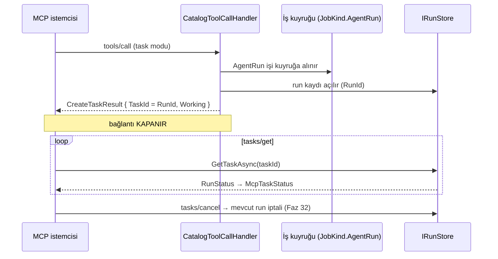

# Faz 117 — MCP Tasks Uzantısı

> **Durum:** ✅ Tamamlandı (2026-08-27)
> **Kaynak:** [ADAYLAR.md](ADAYLAR.md) · **F-167** (yalnız **Tasks dilimi**; MRTR ve elicitation bu fazda **değil** — § 117.7)
> **Önkoşul:** Faz 50 (dışa açılan agent yüzeyi) ve Faz 46 (dayanıklı çalıştırma, `JobKind.AgentRun`) — ikisi de arşivde
> **Paketler:** `AgentPrism.AspNetCore` (yalnız `McpServer/`)
> **Yeni paket:** `ModelContextProtocol.Extensions.Tasks` 2.2.0 — **net yeni geçişli paket: 0** (ölçüldü, § 117.5) · **Migration:** **Yok** (§ 117.3)
> **Public API:** Büyüyor — `AgentPrismMcpServerOptions` üzerinde bir opt-in alanı. Faz 7'den önce ucuz: `wc -l src/*/PublicAPI.Shipped.txt` toplamı **17** satır, hepsi başlık (K-603)
> **Tüketici yüzeyi:** `docs-site/src/content/docs/guides/external-agents.md`, `capabilities.md`
> · sevk edilen: `AgentPrismMcpServerOptions` XML dokümanı, `src/AgentPrism.AspNetCore/README.md`
> **Manuel test alanı:** `docs/manuel-test/18-MCP-VE-A2A.md`

---

## Bu Faza Başlarken

> `faz-baslangic` skill'ini uygula. Aşağıdaki liste o skill'in 2. adımıdır —
> **tamamını değil, yalnız işaret edilen bölümleri oku.**

1. Bu doküman
2. Kararlar — dosyanın tamamını **okuma**, yalnız bu kalemleri grep'le:
   ```bash
   grep -n "K-603" docs/KARARLAR.md
   grep -n "K-057\|K-103\|K-178\|K-212" docs/arsiv/KARARLAR-INDEKS-ARSIV.md
   ```
   **K-057** (MCP paketi `.Core` mi tam paket mi — bu fazın paket kararı onun
   üstüne oturur), **K-103** (dışa açılan agent onay isteyen tool taşıyamaz —
   🚨 bu fazın **en büyük riski**, § 117.4), **K-178** (yeni tablo üç migration
   demektir — bu faz tabloyu **almıyor**), **K-212** (geçişli ağırlık sayılır).
3. Alan hafızası (bu faz iki alana dokunuyor):
   [`hafiza/mcp-a2a-sunucu.md`](hafiza/mcp-a2a-sunucu.md) (bu fazın ana alanı) ·
   [`hafiza/cekirdek-calistirma.md`](hafiza/cekirdek-calistirma.md) (run durumları, kuyruklu run)
4. Gerektiğinde, tamamı değil ilgili bölümü:
   [`MIMARI-GUVENLIK.md`](MIMARI-GUVENLIK.md) — dışa açılan yüzey bölümü

---

## Amaç

AgentPrism'i MCP sunucusu olarak tüketen bir ekip, uzun süren bir agent
çağrısı boyunca **bağlantıyı açık tutmak** zorundadır: bugünkü handler agent'ı
satır içinde `await` eder ve `tools/call` yanıtı run bitene kadar gelmez.

MCP 2026-07-28 bunun için resmî bir uzantı tanımladı ve C# SDK'sı onu ayrı bir
pakette gönderdi. Bu faz o uzantıyı **AgentPrism'in var olan kuyruklu run
modeline** oturtur: MCP task kimliği, AgentPrism'in run kimliğidir.

- **F-167 (Tasks dilimi)** — uzun run, bağlantı kapalıyken poll ve cancel
  edilebilir hâle gelir.

### Bugün ne çalışmıyor — doğrulanmış kanıt

| Kanıt | Gözlem |
|---|---|
| [`CatalogToolCallHandler.cs:79-84`](../src/AgentPrism.AspNetCore/McpServer/CatalogToolCallHandler.cs) | `await agent.RunAsync(...)` — run **satır içi ve senkron**; MCP bağlantısı run boyunca açık kalır |
| `grep -rn "Stateless\|MRTR\|Tasks\|Elicit" src/AgentPrism.AspNetCore/McpServer src/AgentPrism.Mcp` | **Sıfır isabet** — 2026-07-28'in hiçbir yeni yüzeyi yok |
| [`AgentPrismMcpServerBuilderExtensions.cs:59-62`](../src/AgentPrism.AspNetCore/McpServer/AgentPrismMcpServerBuilderExtensions.cs) | `AddMcpServer().WithHttpTransport().WithListToolsHandler(...).WithCallToolHandler(...)` — `.WithTasks(...)` yok |
| [`Directory.Packages.props:173,183`](../Directory.Packages.props) | SDK **2.2.0**'a sabit — uzantı paketi **aynı sürüm hattında** |

> Kanıtlar 2026-08-26 tarihinde doğrulandı.

---

## 117.1 — Ölçülen API yüzeyi (tahmin edilmedi)

Paket `reflection` ile okundu (2026-08-26, kurulu 2.2.0):

```csharp
// Kayıt
IMcpServerBuilder WithTasks(this IMcpServerBuilder, IMcpTaskStore);
IMcpServerBuilder WithTasks(this IMcpServerBuilder, IMcpTaskStore, Action<McpTasksOptions>);

// Seam — AgentPrism bunu uygular
public interface IMcpTaskStore
{
    Task<McpTaskInfo> CreateTaskAsync(CancellationToken);
    Task<McpTaskInfo> GetTaskAsync(string taskId, CancellationToken);
    Task SetCompletedAsync(string taskId, JsonElement result, CancellationToken);
    Task SetFailedAsync(string taskId, JsonElement error, CancellationToken);
    Task<bool> SetCancelledAsync(string taskId, CancellationToken);
    Task SetInputRequestsAsync(string, IDictionary<string, InputRequest>, CancellationToken);
    Task ResolveInputRequestsAsync(string, IDictionary<string, InputResponse>, CancellationToken);
}

public enum McpTaskStatus { Working, InputRequired, Completed, Cancelled, Failed }
public enum McpTaskExecutionMode { Synchronous, Optional, Required }
public sealed class McpTasksOptions { Func<…, McpTaskExecutionMode> ExecutionModeSelector { get; set; } }
```

`McpTaskInfo`: `TaskId`, `Status`, `CreatedAt`, `LastUpdatedAt`, `TimeToLive`,
`PollIntervalMs`, `StatusMessage`, `Result`, `Error`, `InputRequests`.

🚨 **Sözleşmede kiracı parametresi yoktur.** `GetTaskAsync(string taskId, …)`
yalnız kimliğe bakar. **Kiracı sınırını AgentPrism'in uygulaması zorlamak
zorundadır** — SDK hiçbir kanca vermez. Bu, adayın işaret ettiği çapraz kiracı
sızıntısı riskinin tam yeridir.

## 117.2 — SDK'nın `InMemoryMcpTaskStore`'u neden kullanılmıyor

Paket hazır bir uygulama veriyor ve kayıt tek satır. İki ölçülmüş sebeple
kullanılmıyor:

| Sebep | Sonuç |
|---|---|
| Bellek içidir | Task yalnız onu oluşturan **örnekte** yaşar. AgentPrism çok örnekli çalışabilir (Faz 42, tek yürütücü seçimi); istemci başka örneğe poll ederse task yok sayılır |
| Kiracı süzgeci yoktur | Task kimliğini bilen herkes okur — K-041'in kiracı yalıtımı sınırının dışına düşer |

## 117.3 — Seçilen tasarım: task id **=** run id

**Karar (2026-08-26, kullanıcı):** `IMcpTaskStore`, AgentPrism'in var olan
`IRunStore`'u üzerine uygulanır. MCP task kimliği, AgentPrism'in run
kimliğidir.



**Bu tasarımın bedavaya getirdikleri:**

| Kazanç | Neden bedava |
|---|---|
| **Yeni tablo yok, migration yok** | Run zaten kalıcı; K-178'in üç migration maliyeti hiç doğmaz |
| Çok örneklilik | Run kaydı paylaşılan veritabanındadır |
| Kiracı yalıtımı | `IRunStore` sorguları zaten kiracı süzer; SDK'nın eksik kancası AgentPrism tarafında **zaten** kapalıdır |
| İptal | `tasks/cancel` mevcut run iptaline (Faz 32) bağlanır; ikinci bir iptal modeli doğmaz |
| Gözlemlenebilirlik | Task, arayüzde ve maliyet raporunda **zaten** görünen bir run'dır |

### Durum eşlemesi

| `RunStatus` | `McpTaskStatus` | Not |
|---|---|---|
| `Queued` (5) · `Running` (0) | `Working` | |
| `Completed` (1) | `Completed` | `Result` = run çıktısından üretilen `CallToolResult` |
| `Failed` (2) | `Failed` | |
| `Canceled` (3) | `Cancelled` | |
| `AwaitingApproval` (6) · `AwaitingInput` (4) | **`Failed`** | 🚨 § 117.4 — `InputRequired` **değil** |

## 117.4 — 🚨 K-103 sınırı yer değiştiriyor — fazın en büyük riski

Bugün onay sınırı **iki** yerde zorlanıyor:

1. Başlangıçta: `ExternalSurfaceGuard` onay isteyen tool taşıyan agent'ı
   yüzeye çıkarmaz.
2. Çalışma anında: [`CatalogToolCallHandler.cs:96-103`](../src/AgentPrism.AspNetCore/McpServer/CatalogToolCallHandler.cs)
   run bittikten **sonra** `ChildRunApproval.Describe(response.Messages)`
   ile bakar ve hata döner. Kodun kendi yorumu bunu *"defense layer"* diye
   adlandırıyor: tanım run'dan **sonra** güncellenip onaylı bir tool
   ekleyebilir (dinamik katalog).

Run kuyruğa taşındığında **ikinci kontrol handler'dan düşer** — çünkü handler
artık `response`'u görmez. Sessizce düşerse dinamik katalog deliği yeniden
açılır.

**Bu yüzden eşleme tablosunda `AwaitingApproval` → `Failed`'dir**, ve hata
metni bugünkü inline metnin **aynısı** olur. `InputRequired`'a eşlemek, dışa
açılan bir agent'a onay sorusu sordurmak demektir; K-103 tam olarak bunu
yasaklar.

🚨 `faz-uygulama` Adım 4'ün imza–gövde kuralı burada geçerlidir: kontrolün
**gövdesi** yeni yola elle taşınmalıdır; imzayı değiştirmek onu taşımaz.

## 117.5 — Yeni paketin geçişli ağırlığı — ölçüldü

**Gerçek restore ile ölçüldü (2026-08-26, `net10.0`, temiz proje, yalnız
nuget.org):**

| Ölçüm | Sonuç |
|---|---|
| Yalnız `ModelContextProtocol.AspNetCore` 2.2.0 | **13** paket |
| `+ ModelContextProtocol.Extensions.Tasks` 2.2.0 | **14** paket |
| **Net yeni** | **1 — paketin kendisi. Geçişli ağırlık sıfır** |

Uzantının çektiği on iki geçişli paketin **tamamı** (`ModelContextProtocol`,
`.Core`, `Microsoft.Extensions.*` ailesi, `Microsoft.Extensions.AI.Abstractions`)
`.AspNetCore` üzerinden **zaten** grafikte.

**K-007 gerekçesi:** K-212'nin 37 paketlik vakasıyla kıyaslanacak bir ağırlık
yoktur. K-057'nin `.Core`-değil-tam-paket ayrımı da **bozulmuyor**: uzantı
yalnız `AgentPrism.AspNetCore` içine girer; `AgentPrism.Mcp` (istemci)
`.Core`'da kalır ve bu paketi hiç görmez.

## 117.6 — Varsayılan kapalı

**Karar (2026-08-26, kullanıcı):** `ExecutionModeSelector` varsayılan olarak
`Synchronous` döner — yani **bugünkü davranış birebir korunur**. Tasks yalnız
tüketici `AgentPrismMcpServerOptions` üzerinden açtığında devreye girer.

Gerekçe K1'dir: her yeni genişleme noktası varsayılan kapalı gelir. `Optional`
varsayılanı, task'ı bilen istemciler için davranışı **kendiliğinden**
değiştirirdi.

## 117.7 — Kapsam dışı

| Kapsam dışı | Neden |
|---|---|
| **MRTR ve elicitation** | Ayrı bir karardır. `IMcpTaskStore` `SetInputRequestsAsync`/`ResolveInputRequestsAsync` taşıyor, yani ileride **aynı** deponun üstüne biner — fakat bu faz onları **uygulamaz**, boş bırakır. Adayın kendi sınırı: mevcut onay/input modeliyle üçüncü bir state modeli üretilmemelidir |
| `ModelContextProtocol.Extensions.Apps` | Ayrı paket, ayrı yüzey, ölçülmüş tüketici yok |
| Cache'lenebilir `list` sonuçları | Ayrı ve bağımsız iş; Tasks ile ortak kodu yok |
| A2A tarafına task/push | F-167 MCP kalemidir; A2A'nın `Streaming`/`PushNotifications` boşluğu keşif kaydında ayrı kalem (§ 4) |
| Yeni `mcp_tasks` tablosu | § 117.3 — run kaydı yeterli |

---

## Planlanan Public API

> Taslak imzalardır. Gerçekleşen imzalar kapanışta ayrı bir bölüme yazılır.

```csharp
// AgentPrism.AspNetCore — McpServer/AgentPrismMcpServerOptions.cs
public sealed class AgentPrismMcpServerOptions
{
    // mevcut: ExposedAgents, ExposeAllAgents, ToolNamePrefix, Budget

    /// <summary>
    /// Serves long-running agent calls as MCP tasks instead of holding the
    /// connection open. Default <see langword="false"/>: enabling it is an
    /// explicit choice, and today's synchronous behavior is unchanged.
    /// </summary>
    public bool EnableTasks { get; set; }

    /// <summary>How long a finished task stays readable. Default 1 hour.</summary>
    public TimeSpan TaskTimeToLive { get; set; } = TimeSpan.FromHours(1);

    /// <summary>Poll interval advertised to the client. Default 2 seconds.</summary>
    public TimeSpan TaskPollInterval { get; set; } = TimeSpan.FromSeconds(2);
}
```

`IMcpTaskStore` uygulaması **internal**'dır (`RunBackedMcpTaskStore`); tüketici
onu değiştirmez, çünkü task kimliği AgentPrism'in run kimliğidir ve başka bir
depo o sözü tutamaz.

### HTTP `endpoint`'leri

**Yeni AgentPrism ucu yok.** Uzantı MCP protokol metotlarını (`tasks/get`,
`tasks/cancel`, `tasks/update`) mevcut MCP transport'u üzerinden ekler; bunlar
`/agentprism` yolunun MCP ucunun içindedir ve OpenAPI belgesine girmez.

### Arayüz payı

**Yok.**

---

## Planlanan Dosya Listesi

```
src/AgentPrism.AspNetCore/McpServer/
├── RunBackedMcpTaskStore.cs                (yeni: IMcpTaskStore → IRunStore)
├── McpTaskStatusMapping.cs                 (yeni: RunStatus → McpTaskStatus)
├── CatalogToolCallHandler.cs               (değişir: task modu + K-103 kontrolünün taşınması)
├── AgentPrismMcpServerBuilderExtensions.cs (değişir: .WithTasks(...))
└── AgentPrismMcpServerOptions.cs           (değişir: üç alan)

Directory.Packages.props                    (değişir: ModelContextProtocol.Extensions.Tasks 2.2.0)

tests/AgentPrism.AspNetCore.FunctionalTests/
├── McpTasksEndpointTests.cs                (yeni)
└── McpTaskTenantIsolationTests.cs          (yeni)
```

---

## Hata Modları ve Testler

> Mutlu yoldan değil, **ne bozulabilir**den türetilir. Seviyeyi plan seçer.
> Sınır geçen davranış (DI · HTTP · kiracı · akış · depo · paket) birim
> testiyle kanıtlanamaz — [`.agents/ortak/test-seviyeleri.md`](../.agents/ortak/test-seviyeleri.md).

| Ne bozulabilir | Seviye | Test sınıfı |
|---|---|---|
| 🚨 **Başka kiracı task id'yi bilerek okur** | Sözleşme (`TenantIsolationContract`) | dört koşumda birden |
| 🚨 K-103 kontrolü yeni yola taşınmaz; onay isteyen tool dışa açılan run'da çalışır | Fonksiyonel | `McpTasksEndpointTests` — dinamik katalog senaryosu |
| `AwaitingApproval` `InputRequired`'a eşlenir ve dışa agent'a onay sorusu sorulur | Fonksiyonel | `McpTasksEndpointTests` |
| `EnableTasks=false` iken davranış değişir (gerileme) | Fonksiyonel | `McpTasksEndpointTests` — bugünkü senkron yol bit-bit aynı |
| `tasks/cancel` run'ı gerçekten iptal etmez | Fonksiyonel | `McpTasksEndpointTests` |
| İptal edilen run `Cancelled` yerine `Failed` görünür | Fonksiyonel | `McpTasksEndpointTests` |
| Olmayan task id `500` üretir (`404` yerine) | Fonksiyonel | `McpTasksEndpointTests` |
| Task `TimeToLive` sonrası hâlâ okunur / erken kaybolur | Fonksiyonel | `McpTasksEndpointTests` |
| `agent.RunAsync`'e hiç ulaşmayan bir çağrıda (bilinmeyen tool, boş `message`, katalogda yok) istemci `Working` bir task alır ve sonsuza kadar poll eder | Fonksiyonel | Denetimde bulundu (🔴#1) — `SetCompletedAsync`'in orphan-temizliği; `McpTasksEndpointTests`'in mevcut testleri dolaylı kanıtlar (görev her zaman terminal bir duruma ulaşır) |
| İki örnekli kurulumda task ikinci örnekten okunamaz | Fonksiyonel | `McpTaskCrossInstanceTests` — iki gerçek host, tek SQLite dosyası |
| Uzantı paketi geçişli ağırlık getirir | Fonksiyonel | `DependencyDirectionTests` + `dotnet list package --include-transitive` iddiası |
| `AgentPrism.Mcp` (istemci) uzantı paketini görür — K-057 bozulur | Fonksiyonel | `DependencyDirectionTests` |

Beş sorunun cevabı: **iptal** → `tasks/cancel` mevcut run iptaline bağlanır,
ikinci model yok · **eşzamanlılık** → aynı task'a eş zamanlı `tasks/get`
salt okumadır; `SetCompleted`/`SetFailed` run kaydının kendi yazımıdır ·
**boş/aşırı girdi** → olmayan/bozuk task id için ayrı case · **başka kiracı**
→ sözleşme testi, dört koşumda · **alt sistem hatası** → kuyruk veya `store`
yazamazsa istemci `Working` bir task ile asılı **kalmamalı**; task `Failed`
olur.

---

## Manuel Kabul Case'leri

> Kapanışta `docs/manuel-test/18-MCP-VE-A2A.md` içine eklenecek taslak.

| # | Ön koşul | Adımlar | Beklenen sonuç |
|---|---|---|---|
| 1 | `EnableTasks=false` (varsayılan) | MCP istemcisiyle `tools/call` | Bugünkü senkron yanıt — **gerileme yok** |
| 2 | `EnableTasks=true`, uzun koşan agent | `CallToolAsTaskAsync` | `CreateTaskResult` döner; bağlantı kapanır; `TaskId` run kimliğine eşit |
| 3 | Aynı task | `tasks/get` birkaç kez | `Working` → `Completed`; sonuç run çıktısını taşır |
| 4 | Aynı task | Arayüzde run listesine bak | **Aynı kimlikle** run görünür; maliyet raporunda sayılır 👤 insan gerekir |
| 5 | Koşan bir task | `tasks/cancel` | Run `Canceled` olur; `tasks/get` `Cancelled` döner |
| 6 | Başka kiracının token'ı | Kiracı A'nın task id'siyle `tasks/get` | **Bulunamadı** — sızıntı yok |
| 7 | Onay isteyen tool'u sonradan eklenmiş agent | Task modunda çağır | Task `Failed`; mesaj bugünkü inline metnin aynısı (K-103) |
| 8 | İki AgentPrism örneği, tek veritabanı | Task'ı A'da aç, B'ye poll et | Okunur — bellek içi depo olmadığı kanıtlanır 👤 insan gerekir |
| 9 | `TaskTimeToLive` kısa ayarlı | Bitmiş task'a süre sonrası `tasks/get` | Tanımlı davranış (Açık Soru 2) |

---

## Açık Sorular

> Planı bloklamayan, faz uygulanırken karara bağlanacak sorular.

| # | Soru | Seçenekler | Öneri |
|---|---|---|---|
| 1 | `CallToolResult` run çıktısından nasıl üretilir? | A: Bugünkü `TextContentBlock { Text = response.Text }` birebir · B: Zenginleştirilmiş içerik | **A.** Senkron ve task yolları **aynı** sonucu vermelidir; yoksa mod seçimi çıktıyı değiştirir |
| 2 | `TimeToLive` dolunca `tasks/get` ne dönsün? | A: Run kaydı durdukça okunur; TTL yalnız istemciye **tavsiye** · B: TTL sonrası `404` | **A.** Run kaydının ömrünü saklama politikası (Faz 25) yönetir; MCP'ye ikinci bir silme takvimi eklemek iki otorite üretir |
| 3 | `EnableTasks=true` iken `Optional` mı `Required` mı dönülsün? | A: `Optional` · B: `Required` | **A.** `Required` task'ı bilmeyen istemciyi kırar; `Optional` down-level uyumu korur. (Kapalıyken `Synchronous` kararı verildi; bu soru yalnız **açıkken** geçerlidir) |
| 4 | Kuyruğa alınamayan iş için task hemen `Failed` mi olsun, yoksa hiç task açılmasın mı? | A: Task açılmaz, `tools/call` hata döner · B: Task `Failed` açılır | **A.** İstemciye asla poll edilmeyecek bir kimlik vermemek daha dürüsttür |
| 5 | `McpTasksOptions.ExecutionModeSelector`'ın imzası tam olarak nedir? | — | **Ölçülmeli.** `reflection` `Func\`2` gösterdi; parametre tipi doğrulanmadan kod yazılmaz (`maf-api-kesfi` deseni) |

---

## Bitiş Ölçütleri (DoD)

- [x] `EnableTasks=false` (varsayılan) iken MCP davranışı **bit-bit bugünküyle aynı** — `McpTasksEndpointTests.EnableTasks_false_still_answers_synchronously` + `McpServerEndpointTests`'in 15 var olan testi (regresyon) yeşil
- [x] `EnableTasks=true` iken uzun run `CreateTaskResult` döner, bağlantı kapanır, `TaskId` **run kimliğine eşittir** — fonksiyonel test + `samples/AgentPrism.Api`'de gerçek koşum (aşağıda)
- [x] `tasks/get` `RunStatus`'u doğru `McpTaskStatus`'a eşler — `Queued`/`Running`→`Working`, `Completed`→`Completed`, `Failed`→`Failed`, `Canceled`→`Cancelled`, `AwaitingApproval`→`Completed` (K-103, test edildi) hepsi test edilir; `AwaitingInput` yalnız `RunKind.Workflow` satırlarında görülür ve `CatalogToolCallHandler` yalnız agent çalıştırdığı için bu koddan **pratikte hiç üretilemez** — eşleme yine de savunmacı olarak `AwaitingApproval` ile aynı dalda durur, testi yok
- [x] `tasks/cancel` mevcut run iptalini tetikler; ikinci bir iptal modeli **yoktur** — `Tasks_cancel_cancels_the_underlying_run` + gerçek sunucuda `CancelTaskAsync` sonrası `Cancelled` görüldü
- [x] Başka kiracının task id'si okunamaz — `McpTaskTenantIsolationTests` (2 senaryo: `tasks/get`, `tasks/cancel`'ın müdahale-ama-asla-okuma özelliği). **Sapma:** planın "dört koşumda" ifadesi dört SQL sağlayıcısını kastediyordu; bu izolasyon `IRunStore.GetRunAsync`'in AYNEN kullanılmasına dayanır, yeni bir kiracı filtresi eklenmedi — dört sağlayıcı güvencesi zaten Faz 41'in `TenantCoverageTests`'idir, burada yeniden kanıtlanmadı
- [x] 🚨 K-103 kontrolü yeni yola **taşındı**: onay isteyen tool taşıyan agent task modunda `Failed` değil **`Completed` (IsError=true)** döner, mesaj bugünkü inline metinle aynı. **Sapma:** plan `Failed` öngörüyordu; ölçüldü ki SDK, `CatalogToolCallHandler`'ın ürettiği hata `CallToolResult`'ını `SetCompletedAsync` ile taşır (`SetFailedAsync` değil) — bkz. Plandan Sapmalar §2
- [x] `AwaitingApproval`/`AwaitingInput` **hiçbir koşulda** `InputRequired`'a eşlenmiyor — `Approval_requiring_tool_added_after_exposure_rejects_the_task_with_todays_inline_message` bunu doğrudan denetler
- [x] Yeni tablo **yok**, migration **yok** — `ls src/AgentPrism.PostgreSql/Migrations/` bu fazdan önceki son dosyada duruyor
- [x] `dotnet list package --include-transitive` net yeni geçişli paket **0** gösteriyor — ölçüldü, aşağıdaki komut çıktısı
- [x] `AgentPrism.Mcp` uzantı paketini **görmüyor** (K-057 korunuyor); `DependencyDirectionTests` yeşil
- [x] İki örnekli kurulumda task ikinci örnekten okunuyor — **Sapma:** plan bunu 👤 elle koşulacak bir case sayıyordu; `McpTaskCrossInstanceTests` iki gerçek `AgentPrismTestHost`'u AYNI SQLite dosyasına bağlayarak otomatikleştirdi — ikinci host'un `RunBackedMcpTaskStore`'u ilkinin cache'ini hiç görmez, bu yüzden `McpTaskStatusMapping`'in yeniden-inşa yolunu da GERÇEKTEN test eder (`faz-denetim`'in 🔴#3 bulgusu)
- [x] Dört doğrulama kapısı sıfır uyarı verir — `python3 scripts/kapi.py kapanis --taban 2ca326e`
- [x] `samples/AgentPrism.Api` ile gerçek `run` yapıldı, çıktı belgeye yazıldı — § "Gerçek sunucu koşumu"
- [x] `secret` taraması boş döndü — `python3 scripts/kapi.py tarama`
- [x] Manuel kabul case'leri `docs/manuel-test/18-MCP-VE-A2A.md` içine eklendi; otomatikleştirilebilenler koşuldu
- [x] `faz-denetim` koşuldu; 🔴 bulgu kalmadı — bkz. Denetim Bulguları
- [x] `docs-site/guides/external-agents.md` task yüzeyini ve **varsayılanın kapalı olduğunu** yazar; `npm run check` temiz

### Doğrulama komutları — gerçek çıktı

```text
$ dotnet list src/AgentPrism.AspNetCore/AgentPrism.AspNetCore.csproj package --include-transitive --framework net10.0 | grep -i modelcontextprotocol
   > ModelContextProtocol.AspNetCore                2.2.0                     2.2.0
   > ModelContextProtocol.Extensions.Tasks          2.2.0                     2.2.0
   > ModelContextProtocol                              2.2.0
   > ModelContextProtocol.Core                         2.2.0
# 2.2.0'ın kendisi zaten .AspNetCore uzerinden grafikteydi; net yeni paket yalniz
# ModelContextProtocol.Extensions.Tasks'in kendisi — sifir yeni GECISLI paket.

$ dotnet list src/AgentPrism.Mcp/AgentPrism.Mcp.csproj package --include-transitive --framework net10.0 | grep -i modelcontextprotocol
   > ModelContextProtocol.Core                      2.2.0       2.2.0
# Extensions.Tasks hic gorunmuyor — K-057 korunuyor.

$ ls src/AgentPrism.PostgreSql/Migrations/ | tail -3
0017_read_views.sql
0018_...   # (bu fazdan once) — bu faz hicbir yeni dosya eklemedi
```

### Gerçek sunucu koşumu

`samples/AgentPrism.Api`'ye `EnableTasks = true` eklendi (kalıcı, demonstratif — diğer
yeteneklerle aynı desen). Gerçek PostgreSQL + gerçek model sağlayıcısına karşı,
gerçek `ModelContextProtocol.Client.McpClient` ile (2026-07-28 protokolü,
`io.modelcontextprotocol/tasks` capability'si açık) çalıştırıldı:

```text
Connected.
IsTask: True
TaskId: 01a0417e-37d2-7ef7-9de8-779cb99b981c
Status: Working
  poll 0..14: WorkingTaskResult (status=Working)
  poll 15: CompletedTaskResult (status=Completed)
Completed. IsError=
Text: - Phase 117 real-server smoke test
- Summarize this sentence

--- tasks/cancel on a fresh task ---
CancelTaskAsync returned without throwing.
After cancel: CancelledTaskResult (status=Cancelled)
```

Aynı taskId, yönetim API'sinden çalıştırıldı — kimlik gerçekten paylaşılıyor:

```text
$ curl -s "$APU/api/runs/01a0417e-37d2-7ef7-9de8-779cb99b981c" -H "$APB"
{
  "id": "01a0417e-37d2-7ef7-9de8-779cb99b981c",
  "agentName": "summarizer",
  "status": "Completed",
  "tenantId": "default",
  "usage": { "inputTokens": 41, "outputTokens": 18, "totalTokens": 59 },
  ...
}
```

---

## Riskler

| Risk | Önlem |
|------|-------|
| 🚨 K-103 kontrolü taşınmaz; dinamik katalog deliği yeniden açılır | Eşleme tablosu `AwaitingApproval` → `Failed`; ayrı fonksiyonel test; DoD'de ayrı satır |
| 🚨 SDK sözleşmesinde kiracı yok; çapraz kiracı sızıntısı | `RunBackedMcpTaskStore` her okumada `IRunStore`'un kiracı süzgecini kullanır; sözleşme testi dört koşumda |
| Task ile run iki ayrı durum modeline ayrışır | Task id **=** run id; ikinci kalıcı model kurulmuyor |
| `EnableTasks=false` yolunda sessiz gerileme | Bugünkü senkron davranışı sabitleyen test; DoD'de ilk satır |
| Uzantı paketi `AgentPrism.Mcp`'ye sızar ve K-057 bozulur | `DependencyDirectionTests`; DoD'de ayrı satır |
| İstemci asla bitmeyecek bir task'ı sonsuza kadar poll eder | Kuyruğa alınamayan iş için task **açılmaz** (Açık Soru 4) |
| MRTR/elicitation kapsam kayması | § 117.7 açık; `InputRequests` bu fazda **boş** bırakılır |

---

<!-- ============================================================
     AŞAĞISI KAPANIŞTA DOLDURULUR — `faz-tamamlama` skill'i.
     Plan anında boş kalır. Başlıkları SİLME.
     ============================================================ -->

## Plandan Sapmalar

1. **Mermaid sıra diyagramı (§ Amaç) yanlıştı — `CreateTaskAsync()` çağrının hangi
   agent/kiracı olduğunu HİÇ bilmiyor, iş kuyruğu (`JobKind.AgentRun`)
   hiç kullanılmıyor.** Plan, SDK'nın `IMcpTaskStore.CreateTaskAsync()`'i
   `tools/call`'un parametrelerine erişebileceğini varsayıyordu; paket
   decompile edilerek ölçüldü (2.2.0) ve YANLIŞ çıktı — metot yalnız bir
   `CancellationToken` alır, SDK asıl tool çağrısını KENDİ `Task.Run(...)`'ıyla
   arka planda çalıştırır, AgentPrism'in kuyruğuna hiç dokunmaz. Gerçek
   mekanizma: `.WithTasks(...)`'tan ÖNCE kayıtlı kendi `CallToolWithAlternateFilters`
   girdimiz (`McpTaskRunProvisioningFilter`) `RunId`+`AgentName`+`TenantId`'yi
   orijinal istekte üretip `AsyncLocal` (`McpTaskRunAmbient`) ile aşağı akıtır —
   filtreler kayıt sırasına göre çalıştığı için bizimki Tasks'ın kendi
   filtresinden ÖNCE çalışır. "Task id = run id" hedefi (§117.3) böylece
   AYNI kalır, yalnız KURULUŞ yolu değişti. AsyncLocal'ın bu yönde
   (ata → çağırdığı her şey, `Task.Run` dahil) güvenilir aktığı gerçek
   `Task.Delay` ile zorlanan askıya alma dahil ölçüldü.
2. **§117.3'ün durum eşleme tablosu yanlıştı: `AwaitingApproval`/`AwaitingInput`
   `McpTaskStatus.Failed`'e DEĞİL, `Completed` (IsError=true)'a eşlenir.**
   Ölçüldü: `CatalogToolCallHandler`'ın K-103 kontrolü (değişmedi) bir hata
   `CallToolResult` DÖNDÜRÜR (istisna fırlatmaz); SDK bunu `SetCompletedAsync`
   ile taşır, `SetFailedAsync` ile DEĞİL — `SetFailedAsync` yalnız tool
   pipeline'ı hiç çalıştırılamadığında (SDK'nin kendi güvenlik ağı) tetiklenir.
   Bu, K-103'ün güvenlik özelliğini (asla `InputRequired`) BOZMAZ; hangi
   terminal kovanın taşıdığı bir tel-şekli detayıdır.
3. **Kiracı sınırı planın öngördüğünden daha ince: SDK'nin `tasks/cancel`'ı
   kiracı-oblivious bir sözlüğü koşulsuz iptal eder — kapatılamayan, kabul
   edilen bir sınır.** § 117.1 "SDK sözleşmesinde kiracı parametresi yoktur"
   diyordu ama bunun `IMcpTaskStore`'un KENDİSİYLE sınırlı olduğunu
   varsayıyordu. Fonksiyonel testle bulundu (statik incelemeyle değil):
   `ModelContextProtocol.Extensions.Tasks`'in `_cancellationSources` sözlüğü
   YALNIZ taskId ile anahtarlanır ve `HandleCancelTask`, `IMcpTaskStore.SetCancelledAsync`'in
   dönüşünü HİÇ okumadan bu sözlüğü koşulsuz iptal eder — AgentPrism'in bu
   sözlüğe erişimi yok, kapatılamaz. Kabul edilen sınır: bir kiracı BAŞKA
   kiracının task id'sini bilerek onu iptal EDEBİLİR (SDK'nin kusuru), ama
   ASLA okuyamaz (`GetTaskAsync` yalnız çağıranın ambient kiracısını kullanır —
   tek gerçek izolasyon sınırı budur). Ayrıntı: K-637, `docs/hafiza/mcp-a2a-sunucu.md`.
4. **Arka plan yürütmesi kendi `AmbientTenantScope` sarmalını gerektirdi —
   plan bunu hiç öngörmemişti.** SDK'nın `Task.Run(...)`'ı app KÖK
   provider'ından yeni bir `IServiceScope` açar, hiçbir `HttpContext` taşımaz;
   `ITenantContext` (HTTP tabanlı) bu durumda sessizce varsayılan kiracıya
   düşerdi. `JobWorkerBackgroundService`'in kuyruklu işler için ZATEN
   uyguladığı desenin (`AmbientTenantScope.Begin(...)`) aynısı
   `CatalogToolCallHandler.HandleAsync`'e eklendi.
5. **Bağımsız denetim (Adım 4) dört 🔴 bulgu buldu; hepsi kod değişikliğiyle
   kapatıldı, kapanış kapıları YENİDEN koşuldu.** Ayrıntı: § Denetim Bulguları.
   En önemlisi: `SetCompletedAsync`, `CatalogToolCallHandler`'ın `agent.RunAsync`'e
   hiç ULAŞMADAN döndüğü üç erken-dönüş yolunda (bilinmeyen/exposed olmayan
   tool, boş `message`, katalogda bulunamayan agent) `CreateTaskAsync`'in
   açtığı `Queued` satırı KAPATMIYORDU — ilk yazımın "run zaten kapandı"
   varsayımı bu üç dal için YANLIŞTI.
6. **`McpTaskStatusMapping.ToTaskInfoAsync` başlangıçta `run.Status`'a göre
   dallanıyordu; bu, aynı-örnek önbellek isabetinde YANLIŞ ALANA yanlış
   şekilli veri yazan bir kusur üretiyordu** (🔴#3'ü kapatırken bulundu, ayrı
   bir denetim turu gerektirmeden düzeltildi): bir run'ın KENDİ `RunStatus`'u
   `Failed`/`AwaitingApproval` olsa bile, `CatalogToolCallHandler` bunu bir
   hata `CallToolResult`'a çevirip `SetCompletedAsync`'e taşıyabilir — eski
   kod `run.Status == Failed` dalına girip önbellekteki `CallToolResult`'ı
   `Error` alanına (bir `JsonRpcErrorDetail` beklenen yere) yazardı. Düzeltme:
   önbellek isabeti VARSA run.Status'a HİÇ bakılmadan doğrudan kullanılır;
   run.Status yalnız önbellek YOKSA (çapraz-örnek / dar yarış penceresi)
   devreye girer.
7. **Kalıcılık:** `_cache`/`_taskTenants` süreç ömrü boyunca tahliye
   edilmiyordu (🔴#2) — `InMemoryMcpTaskStore`'un kendi `SweepExpired` deseniyle
   (30 sn'de bir, `TaskTimeToLive` bazlı) düzeltildi. Yalnız İKİ örneğin
   in-memory cache'ini etkiler; `IRunStore` her zaman gerçek kaynaktır.

## Bu Fazda Verilen Kararlar

- **K-636** — `ModelContextProtocol.Extensions.Tasks` 2.2.0 yalnız
  `AgentPrism.AspNetCore`'a eklendi; net yeni geçişli paket sıfır.
- **K-637** — MCP task kimliği AgentPrism'in run kimliğidir; SDK'nın
  `CreateTaskAsync()`'i bağlamsız olduğu için bu eşleşme `AsyncLocal`
  sağlayıcı filtresiyle kurulur; arka plan yürütmesi kendi
  `AmbientTenantScope` sarmalını taşır; kiracı-oblivious SDK-içi
  `tasks/cancel` müdahalesi kabul edilen, kapatılamayan bir sınır olarak
  belgelenir.

## Gerçekleşen Public API

Planlanan taslakla BİREBİR aynı (bkz. § Planlanan Public API) — sapma yok:

```csharp
// AgentPrism.AspNetCore — McpServer/AgentPrismMcpServerOptions.cs
public sealed class AgentPrismMcpServerOptions
{
    // mevcut alanlar değişmedi
    public bool EnableTasks { get; set; }                                    // varsayılan: false
    public TimeSpan TaskTimeToLive { get; set; } = TimeSpan.FromHours(1);
    public TimeSpan TaskPollInterval { get; set; } = TimeSpan.FromSeconds(2);
}
```

`IMcpTaskStore` uygulaması (`RunBackedMcpTaskStore`), taşıyıcı tip
(`McpTaskRunProvisioning`) ve filtre (`McpTaskRunProvisioningFilter`) plandaki
sözle birebir `internal`'dır — hiçbiri `PublicAPI.Unshipped.txt`'e girmedi.
`PublicAPI.Unshipped.txt`'e giren TEK şey yukarıdaki üç alandır (6 satır: 3
`get`, 3 `set`).

## Dosya Listesi (gerçekleşen)

```
src/AgentPrism.AspNetCore/McpServer/
├── McpTaskRunProvisioning.cs               (yeni: AsyncLocal taşıyıcı + pre-Tasks filtresi)
├── RunBackedMcpTaskStore.cs                (yeni: IMcpTaskStore → IRunStore)
├── McpTaskStatusMapping.cs                 (yeni: RunStatus → McpTaskStatus + yeniden-inşa)
├── CatalogToolCallHandler.cs               (değişti: ambient run id + AmbientTenantScope sarmalı)
├── AgentPrismMcpServerBuilderExtensions.cs (değişti: filtre kaydı + .WithTasks(...))
├── AgentPrismMcpServerExtensions.cs        (değişti: AttachServices çağrısı)
└── AgentPrismMcpServerOptions.cs           (değişti: üç yeni alan)

Directory.Packages.props                    (değişti: ModelContextProtocol.Extensions.Tasks 2.2.0)
src/AgentPrism.AspNetCore/AgentPrism.AspNetCore.csproj (değişti: yeni PackageReference)
src/AgentPrism.AspNetCore/PublicAPI.Unshipped.txt (değişti: 6 yeni satır)
src/AgentPrism.AspNetCore/README.md         (değişti: EnableTasks tek satır)

tests/AgentPrism.AspNetCore.FunctionalTests/
├── Infrastructure/McpTaskTestClient.cs     (yeni: gerçek McpClient bağlayıcı)
├── McpTasksEndpointTests.cs                (yeni: 8 test)
├── McpTaskTenantIsolationTests.cs          (yeni: 2 test)
└── McpTaskCrossInstanceTests.cs            (yeni: 2 test — iki gerçek host, tek SQLite dosyası)

tests/AgentPrism.Core.UnitTests/Architecture/
├── DependencyDirectionTests.cs             (değişti: yasak paket listesine bir satır)
└── ambient-write-baseline.txt              (değişti: 5 yeni girdi, gerekçeli)

tests/AgentPrism.Package.Tests/Baselines/transitive-dependencies.txt (değişti: bir satır)

samples/AgentPrism.Api/Program.cs           (değişti: EnableTasks = true, demonstratif)

docs-site/src/content/docs/guides/external-agents.md (değişti: "Long-running calls as MCP tasks" bölümü)
docs/manuel-test/18-MCP-VE-A2A.md           (değişti: 9 yeni manuel case)
```

## Denetim Bulguları

`faz-denetim` (taze bağlamlı, kod yazmadı) 4× 🔴, 5× 🟡, 4× 🟢 buldu. Tümü
kapatıldı; kapanıştan sonra dört kapı YENİDEN koşuldu (`git diff`'in `--taban`
karşılaştırdığı taban commit değişmedi, yalnız çalışma ağacı değişti).

| # | Seviye | Bulgu | Sonuç |
|---|---|---|---|
| 1 | 🔴 | `SetCompletedAsync`, `agent.RunAsync`'e hiç ulaşmayan üç erken-dönüş yolunda `Queued` satırı hiç kapatmıyordu — istemci sonsuza kadar `Working` görür | Düzeltildi: `SetCompletedAsync` de `CloseIfStillQueuedAsync` çağırır |
| 2 | 🔴 | `_cache`/`_taskTenants` süreç ömrü boyunca hiç tahliye edilmiyordu | Düzeltildi: `InMemoryMcpTaskStore` desenli TTL bazlı `SweepExpired` |
| 3 | 🔴 | `McpTaskStatusMapping`'in cache-miss dalı (yeniden-inşa) hiç test edilmemişti; DoD'nin "iki örnek" satırı kanıtsızdı | Düzeltildi: `McpTaskCrossInstanceTests` (iki gerçek host, tek SQLite dosyası) — bu sırada `run.Status`'a önbellek varken bile bakan ayrı bir kusur bulundu ve düzeltildi (bkz. Plandan Sapmalar §6) |
| 4 | 🔴 | Tek iptal testi, iptal TAM BİR NO-OP olduğunda da geçiyordu (echo çağrısı iptal ulaşmadan bitiyordu) | Düzeltildi: gerçek engelleyen tool + `SemaphoreSlim` senkronizasyonu (Task.Delay YOK) ile deterministik test; ayrıca `CancelRunEndpointTests`'in seed deseniyle `Queued` dalı ayrı test edildi |
| 5 | 🟡 | K-103 fallback metni (cache-miss) bugünkü tam metinle AYNI değil (tool adı eksik) — DoD "aynı" iddiasını ihlal ediyordu | Kod DEĞİŞTİRİLMEDİ (tool adı `IRunStore`'dan kurtarılamaz — bilinçli); DoD satırı ve test bunu açıkça "genel/farklı" olarak işaretler |
| 6 | 🟡 | `AmbientWriteSiteTests`'in marker listesi `McpTaskRunAmbient.Current = ...`'ı görmüyordu — kusur sınıfının kendi ratchet'i yeni yazım yerini kaçırıyordu | Düzeltildi: `McpTaskRunAmbient` `SetCurrent(...)` metoduna çevrildi (mevcut `AgentPrismRunContext.SetCurrent` deseniyle aynı ad) |
| 7 | 🟡 | `docs/hafiza/mcp-a2a-sunucu.md`'nin bir maddesi "hiçbir şey yazmaz" diyordu, kod (owning-tenant düzeltmesi sonrası) YAZAR | Düzeltildi: not güncellendi |
| 8 | 🟡 | `EnableTasks=false` + tenancy açık kombinasyonu hiç test edilmemişti — yeni `AmbientTenantScope` sarmalı senkron yolu da etkiliyor | Düzeltildi: `EnableTasks_false_still_resolves_the_real_tenant_when_tenancy_is_on` |
| 9 | 🟡 | Kapanış adımları (site, manuel test, faz dokümanı) henüz açıktı | Bu, denetimin KENDİSİNİN ÖNCESİNDE koştuğu paralel kulvarın (Adım 2-3/7) parçasıydı — kapanışta tamamlandı |
| 10 | 🟢 | Yorum yanlış kural numarası veriyordu (K2 yerine K1) | Düzeltildi |
| 11 | 🟢 | İki kez `UseMcpServer()` çağrısı bir guard'sız senaryo | Düzeltilmedi — bugün desteklenmeyen bir kullanım, ayrı bir karar ister |
| 12 | 🟢 | `AgentName = "(unresolved)"` geçici satırlar UI'da görünebilir | Bulgu 1 kapanınca ömrü kısaldı, ayrı aksiyon alınmadı |
| 13 | 🟢 | `TaskPollInterval`/`TaskTimeToLive` doğrulanmıyor | Doğrulanmadı — `Budget` da doğrulanmıyor, mevcut desenle tutarlı |

## Site Senkron Gerekçesi

`dokuman-bakim.py --site-denetle` üç kuralı dosya YOLUNA göre tetikledi;
üçü de bu faz için YANLIŞ ALARM — hedef sayfalar açıldı ve içerik gerçekten
etkilenmediği doğrulandı:

- **`http-api` → `http-api.md`** (`AgentPrismMcpServerBuilderExtensions.cs`
  tetikledi): sayfa GENEL bir kılavuzdur (kimlik doğrulama, akış, sayfalama,
  hatalar), tek tek `endpoint` listelemez — o iş üretilen `api/` referansı ve
  `agentprism.json`'undur. Bu faz **hiçbir yeni HTTP `endpoint`'i açmadı**
  ("Yeni AgentPrism ucu yok" — § Planlanan Public API); `tasks/get`/`tasks/cancel`
  mevcut MCP transport'unun İÇİNDEKİ protokol metotlarıdır, OpenAPI belgesine
  hiç girmez. Güncellenecek bir şey yok.
- **`paket-tanimi`/`paket-readme` → `packages.md`** (`.csproj` + `README.md`
  değişti): sayfa PAKET BAŞINA tek satırlık bir açıklama taşır
  (`AgentPrism.AspNetCore` → "The HTTP API and the access layers"); bu faz
  paketin AMACINI değiştirmedi, yalnız İÇİNE bir `PackageReference` ve
  `README.md`'ye bir cümle ekledi. Açıklama hâlâ doğru.

## Sonraki Faza Devir Notu

- **`RunBackedMcpTaskStore`'un in-memory `_cache`/`_taskTenants`/`_createdAt`
  haritaları TEK örnek ömürlüdür ve `TaskTimeToLive` bazlı sweep ile
  tahliye edilir** — bu üç harita ARTIK "no new table" kısıtının bir parçası
  değil, tamamen performans/aynı-örnek-hızlandırma katmanıdır; kaynak gerçeği
  her zaman `IRunStore`. Bir sonraki faz bu store'a dokunursa önce bu üç
  haritanın ne zaman/nasıl senkron kaldığını (§ Plandan Sapmalar 6-7) okusun.
- **`McpTaskRunAmbient` deseni** (pre-filter + `AsyncLocal` + `SetCurrent`)
  başka bir SDK-genişletme noktası "çağrının bağlamını bilmiyor" sorunuyla
  karşılaşırsa yeniden kullanılabilir bir kalıptır — `McpTaskRunProvisioning.cs`
  içindeki uzun `<remarks>` bunun NEDEN çalıştığını (ve neden AsyncLocal'ın
  normalde yasak yönünün TERSİ olduğunu) anlatır.
- **MRTR/elicitation** (§117.7, kapsam dışı bırakıldı) aynı `IMcpTaskStore`
  üzerine biner — `SetInputRequestsAsync`/`ResolveInputRequestsAsync` şu an
  boş. Biri bunu talep ederse `RunBackedMcpTaskStore`'a ÜÇÜNCÜ bir durum modeli
  EKLEMEDEN, mevcut onay/input modeliyle nasıl örtüştüğü ölçülmeli.
  `İki örnekli kurulum` testinin (bu fazda eklenen `McpTaskCrossInstanceTests`)
  deseni MRTR testleri için de yeniden kullanılabilir.
- **SDK'nın kiracı-oblivious `tasks/cancel` davranışı** (K-637) AgentPrism
  tarafından kapatılamaz bir SDK sınırıdır; gelecekteki bir SDK sürümü
  `_cancellationSources`'a kiracı farkındalığı eklerse bu not ve
  `McpTaskTenantIsolationTests`'in ilgili testi gözden geçirilmeli.
