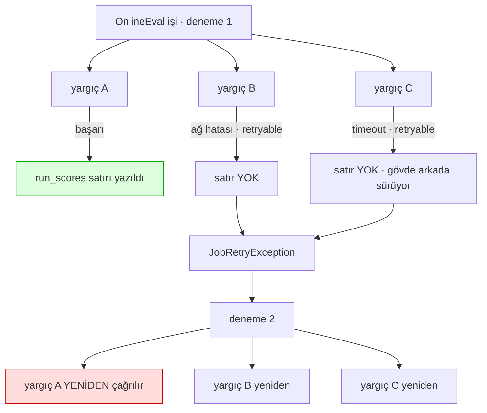

# Faz 118 — Yargıç Başına Checkpoint

> **Durum:** 📋 Planlandı (2026-08-26)
> **Kaynak:** [ADAYLAR.md](ADAYLAR.md) · **F-152**
> **Önkoşul:** Faz 49 (çevrimiçi değerlendirme) ve Faz 103 (`JudgeTimeout` wait cutoff, K-621) — ikisi de arşivde
> **Paketler:** `AgentPrism.Core` (yalnız `Evaluation/`)
> **Yeni paket:** Yok · **Migration:** **Yok** — checkpoint bugünkü `run_scores` satırlarından okunur (§ 118.2)
> **Public API:** **Büyümüyor.** Değişen tek şey `internal` bir handler'ın davranışı
> **Tüketici yüzeyi:** `docs-site/src/content/docs/guides/write-your-own-judge.md` (retry davranışının bir cümlelik düzeltmesi)
> · sevk edilen: `IRunJudge` XML dokümanına retry notu
> **Manuel test alanı:** `docs/manuel-test/17-EVAL-VE-DENEYLER.md`

---

## Bu Faza Başlarken

> `faz-baslangic` skill'ini uygula. Aşağıdaki liste o skill'in 2. adımıdır —
> **tamamını değil, yalnız işaret edilen bölümleri oku.**

1. Bu doküman
2. Kararlar — dosyanın tamamını **okuma**, yalnız bu kalemi grep'le:
   ```bash
   grep -n "K-621" docs/KARARLAR.md
   ```
   **K-621** (`JudgeTimeout` gerçek wait cutoff'tur; timeout'a düşen yargıcın
   gövdesi arkada devam eder ve geç sonucu **sessizce atılır**). 🚨 Bu kararın
   "Sonraki adım" sütunu tam olarak bu fazı işaret ediyor ve fazın en ince
   etkileşimi orada — § 118.4.
3. Alan hafızası (bu faz bir alana dokunuyor):
   [`hafiza/olcum-kota-ve-secenekler.md`](hafiza/olcum-kota-ve-secenekler.md) (eval, skor, iş kuyruğu ayarları)
4. Gerektiğinde, tamamı değil ilgili bölümü: [`MIMARI.md`](MIMARI.md) — iş kuyruğu bölümü

---

## Amaç

Bir `OnlineEval` işi yeniden denendiğinde **başarılı yargıçlar da yeniden
çalışır**. `run_scores` tablosunun benzersizlik kısıtı görünür sonucu birleştirir,
yani kullanıcı ikinci bir satır görmez — fakat pahalı veya yan etkili üçüncü
taraf yargıç çağrısı **gerçekten ikinci kez yapılır** ve ikinci kez faturalanır.

Bu faz o tekrarı keser: yeniden denemede, skorunu zaten yazmış bir yargıç
tekrar çağrılmaz.

- **F-152** — pahalı yargıçlar yeniden denenirken doğru maliyet ve yan etki
  sınırı korunur.

### Bugün ne çalışmıyor — doğrulanmış kanıt

| Kanıt | Gözlem |
|---|---|
| [`OnlineEvalJobHandler.cs:148-151`](../src/AgentPrism.Core/Evaluation/OnlineEvalJobHandler.cs) | `foreach (var judge in judgeList)` — **koşulsuz**. Her çağrışta tüm yargıçlar döner |
| [`OnlineEvalJobHandler.cs:66-81`](../src/AgentPrism.Core/Evaluation/OnlineEvalJobHandler.cs) | Tek bir retryable failure **tüm işi** `JobRetryException` ile yeniden denetir |
| [`OnlineEvalJobHandler.cs:227-241`](../src/AgentPrism.Core/Evaluation/OnlineEvalJobHandler.cs) | `scoreStore.UpsertAsync` **yargıç başına** ve o yargıç başarılı olur olmaz çağrılır; satır `Author = "judge:{ad}"` taşır |
| [`OnlineEvalJobHandler.cs:17-22`](../src/AgentPrism.Core/Evaluation/OnlineEvalJobHandler.cs) (XML) | Benzersizlik kısıtının **görünür** tekrarı engellediği açıkça yazılı; çağrının kendisi için bir söz yok |

> Kanıtlar 2026-08-26 tarihinde doğrulandı.

### 🚨 Aday metnindeki maliyet iddiası ölçümle çürüdü

`ADAYLAR.md` şunu yazıyordu: *"Maliyet: Orta–yüksek; **kalıcı model ve üç SQL
sağlayıcı migration'ı gerekir**."* Ölçüm bunun gereksiz olduğunu gösterdi:

| Ölçüm | Sonuç |
|---|---|
| `UpsertAsync` nerede çağrılıyor | Yargıç **başına**, döngünün içinde — toplu değil |
| Satır kimliği | `Author = "judge:{ad}"`, benzersizlik `(tenant_id, run_id, message_id, author)` |
| Okuma yüzeyi | [`IRunScoreStore.ListAsync(tenantId, runId)`](../src/AgentPrism.Abstractions/Runs/IRunScoreStore.cs) **zaten var** |
| Deneme sayacı | [`JobRecord.Attempt`](../src/AgentPrism.Abstractions/Scheduling/JobRecord.cs) **zaten var**, `context.Job.Attempt` ile erişilir |

∴ **Checkpoint bugün zaten veride duruyor.** Başarılı bir yargıç, adıyla
etiketlenmiş kalıcı bir satır bırakıyor. Eksik olan tek şey, döngünün o satırı
**okuması**.

**Karar (2026-08-26, kullanıcı):** Yeni tablo açılmaz. Checkpoint mevcut
`run_scores` satırlarından okunur.

---

## 118.1 — Bugünkü akış ve tekrarın yeri



Kırmızı kutu bu fazın tek hedefidir: **A'nın ikinci çağrısı gereksizdir ve
kanıtı yeşil kutuda durur.**

## 118.2 — Seçilen tasarım: mevcut satırlardan okuma

Yargıç döngüsünden **önce** bir okuma; döngüde bir atlama:

```csharp
// JudgeRunAsync — döngüden ÖNCE
var completed = skipAlreadyScored
    ? (await scoreStore.ListAsync(tenantContext.TenantId, run.Id, cancellationToken).ConfigureAwait(false))
        .Where(static score => score.Author is { } author && author.StartsWith("judge:", StringComparison.Ordinal))
        .Select(static score => score.Author!["judge:".Length..])
        .ToHashSet(StringComparer.Ordinal)
    : [];

foreach (var judge in judgeList)
{
    if (completed.Contains(judge.Name))
    {
        continue;   // ← pahalı çağrı yapılmadı
    }

    await JudgeOneAsync(judge, judgeContext, run, now, scores, failures, cancellationToken).ConfigureAwait(false);
}
```

**Getirdikleri ve getirmedikleri:**

| Kazanç | Bedel |
|---|---|
| Yeni tablo yok, migration yok, yeni public tip yok | Fazladan **bir** `store` okuması (yalnız yeniden denemede) |
| Kiracı sınırı zaten `ListAsync`'in içinde | "Satır yok" ≠ "hiç koşmadı" — § 118.3 |
| `Author` etiketi zaten üretimde yazılıyor; geriye dönük veri **hazır** | `Author` biçimi (`judge:` öneki) örtük bir sözleşmeye dönüşür |

🚨 **`judge:` öneki artık davranış taşıyor.** Bugün yalnız bir etikettir;
bu fazdan sonra "bu yargıç koştu" anlamına gelir. Önek tek bir sabitten
üretilmelidir — iki yerde elle yazılırsa biri değişince atlama sessizce durur.

## 118.3 — Neyin checkpoint'lenmediği — açıkça

Bu fazın sınırı budur ve gizlenmez:

| Durum | Satır bırakır mı | Yeniden denemede |
|---|---|---|
| Yargıç skor üretti | ✅ Evet | **Atlanır** — fazın kazancı |
| Yargıç hata verdi (`judge_failed`) | ❌ Hayır | Yeniden koşar — **doğru** |
| Yargıç timeout'a düştü (`judge_timeout`) | ❌ Hayır | Yeniden koşar — § 118.4 |
| Yargıç **çekimser kaldı** (`Score is null`) | ❌ Hayır | Yeniden koşar — 🚨 kabul edilen boşluk |
| Yargıç aralık dışı skor verdi (`judge_contract`) | ❌ Hayır | Yeniden koşar (iş başka bir yargıç yüzünden denenirse) |

Dördüncü satır bilinçli bir kabuldür. [`OnlineEvalJobHandler.cs:212-216`](../src/AgentPrism.Core/Evaluation/OnlineEvalJobHandler.cs)
şunu yazıyor: *"a silent 0 is NOT written. A zero is a measurement, not the
absence of one."* Çekimser yargıcı checkpoint'lemek, tam da o kararın
gerektirmediği yeni bir kalıcı durum ister. Ölçülmüş bir vaka doğarsa ayrı
aday olur.

## 118.4 — 🚨 K-621 ile etkileşim

K-621 şunu kaydetti: timeout'a düşen yargıcın gövdesi **öldürülmez**, arkada
tamamlanır ve **geç sonucu sessizce atılır** — skor, summary ve metrik yazmaz.

Bu fazla iki yerden kesişir:

| Etkileşim | Sonuç |
|---|---|
| Timeout'a düşen yargıç satır bırakmaz | Yeniden denemede **tekrar** koşar. Bu fazın kazancı onu kapsamaz — ve kapsayamaz, çünkü ilk çağrının sonucu bilerek atılmıştır |
| Geç biten gövde ile yeniden deneme **aynı anda** koşabilir | Yarış yoktur: geç gövde hiçbir şey yazmaz (K-621). Yeniden deneme tek yazandır |

🚨 K-621'in "Sonraki adım" sütunu şunu diyordu: *"F-152'nin per-judge durable
checkpoint'i bu timeout modeline **yeni bir katman eklerse**"*. Bu tasarım yeni
bir katman **eklemiyor** — var olan satırları okuyor. Bu, o uyarının istediği
cevaptır ve kapanışta bu şekilde kaydedilir.

## 118.5 — Atlama yalnız yeniden denemede

**Karar (2026-08-26, kullanıcı):** Atlama yalnız `context.Job.Attempt > 1`
iken devreye girer.

| Yol | Davranış |
|---|---|
| Kuyruklu iş, **ilk** deneme | Bugünkü gibi — tüm yargıçlar koşar |
| Kuyruklu iş, **yeniden** deneme | Skoru olan yargıçlar atlanır |
| Elle `POST /api/runs/{id}/judge` | **Hiç etkilenmez** — "yeniden yargıla" diyen kullanıcı gerçekten yeniden yargılatır |

Bu, adayın tarif ettiği sorunu tam hedefleyen **en dar** değişikliktir. Başka
hiçbir yol davranış değiştirmez; sessiz bir gerileme yüzeyi açılmaz.

`JudgeRunAsync` iki çağrışın ortak çekirdeğidir
([`OnlineEvalJobHandler.cs:25-29`](../src/AgentPrism.Core/Evaluation/OnlineEvalJobHandler.cs) XML),
bu yüzden atlama bir **parametre** olur; çekirdeğin içine gömülmez.

## 118.6 — Kapsam dışı

| Kapsam dışı | Neden |
|---|---|
| Yeni `judge_attempts` tablosu | § 118.2 — mevcut satırlar yeterli |
| Çekimser yargıcın checkpoint'lenmesi | § 118.3 — ölçülmüş vaka yok |
| Timeout'a düşen yargıcın geç sonucunun kurtarılması | K-621'in bilinçli kararı; tersine çevirmek ayrı bir karardır |
| Elle yargılama ucunda davranış değişikliği | § 118.5 |
| Yargıç başına **bağımsız** retry takvimi | İş kuyruğu iş düzeyinde denenir; yargıç düzeyinde takvim ikinci bir zamanlayıcı modeli olur |

---

## Planlanan Public API

**Yok.** Bu faz hiçbir public tip, arayüz, HTTP ucu veya ayar eklemez.
`PublicAPI.*.txt` dosyaları **değişmez**.

Değişen tek imza `internal`'dır:

```csharp
// AgentPrism.Core — Evaluation/OnlineEvalJobHandler.cs (internal)
public async ValueTask<(IReadOnlyList<RunScore> Scores, IReadOnlyList<JudgeFailure> Failures)> JudgeRunAsync(
    RunRecord run,
    CancellationToken cancellationToken,
    bool skipAlreadyScored = false);   // ← yeni, varsayılan bugünkü davranış
```

Varsayılanın `false` olması bilinçlidir: parametreyi görmeyen her çağrış
bugünkü davranışı korur (K1).

### HTTP `endpoint`'leri

**Yok.** `POST /api/runs/{id}/judge` sözleşmesi ve davranışı **değişmez**.

### Arayüz payı

**Yok.**

---

## Planlanan Dosya Listesi

```
src/AgentPrism.Core/Evaluation/
└── OnlineEvalJobHandler.cs             (değişir: okuma + atlama + parametre + judge: sabiti)

tests/AgentPrism.Core.UnitTests/Evaluation/
└── OnlineEvalCheckpointTests.cs        (yeni)

tests/AgentPrism.AspNetCore.FunctionalTests/
└── OnlineEvalRetryTests.cs             (yeni: gerçek job kuyruğu üzerinde retry)
```

---

## Hata Modları ve Testler

> Mutlu yoldan değil, **ne bozulabilir**den türetilir. Seviyeyi plan seçer.
> Sınır geçen davranış (DI · HTTP · kiracı · akış · depo · paket) birim
> testiyle kanıtlanamaz — [`.agents/ortak/test-seviyeleri.md`](../.agents/ortak/test-seviyeleri.md).

| Ne bozulabilir | Seviye | Test sınıfı |
|---|---|---|
| Başarılı yargıç yeniden denemede **yine çağrılır** (fazın hiç çalışmaması) | Fonksiyonel (depo + kuyruk sınırı) | `OnlineEvalRetryTests` — yargıç çağrı **sayısı** iddia edilir |
| Başarısız yargıç yanlışlıkla atlanır ve run eksik skorla kapanır | Fonksiyonel | `OnlineEvalRetryTests` |
| İlk denemede de atlanır (sessiz davranış değişikliği) | Birim | `OnlineEvalCheckpointTests` |
| Elle `POST /api/runs/{id}/judge` atlamaya başlar — kullanıcı "yeniden yargıla" der, hiçbir şey olmaz | Fonksiyonel (HTTP sınırı) | `OnlineEvalRetryTests` |
| **Başka kiracının** skor satırı checkpoint sanılır | Sözleşme (`TenantIsolationContract`) | dört koşumda birden |
| `judge:` öneki iki yerde ayrı yazılır; biri değişince atlama sessizce durur | Birim | `OnlineEvalCheckpointTests` — sabit üzerinden iddia |
| Adında `:` geçen bir yargıç adı öneki bozar | Birim | `OnlineEvalCheckpointTests` — `judge:a:b` ayrıştırması |
| İnsan yazdığı skor (`Author` `judge:` ile başlamayan) checkpoint sanılır | Birim | `OnlineEvalCheckpointTests` |
| `ListAsync` hata verirse iş düşer (gözlemlenebilirlik işlevselliği bozar) | Birim | `OnlineEvalCheckpointTests` — okuma hatasında **atlama yapılmaz**, tüm yargıçlar koşar |
| Timeout'a düşen yargıcın geç gövdesi ile yeniden deneme aynı satıra yazar | Birim | `OnlineEvalCheckpointTests` — K-621 gereği geç gövde yazmaz |
| Hiç yargıç kalmayınca iş sonsuz yeniden denenir | Fonksiyonel | `OnlineEvalRetryTests` — tüm yargıçlar atlanınca iş **tamamlanır** |

Beş sorunun cevabı: **iptal** → okuma `cancellationToken` alır, iptal
`OperationCanceledException` olarak yukarı gider · **eşzamanlılık** → aynı
run'a iki eş zamanlı iş kuyruk kirası (lease) ile engellenir; ayrıca
`UpsertAsync` idempotenttir · **boş/aşırı girdi** → sıfır skorlu run, yalnız
insan skoru olan run, çok sayıda skor için ayrı case'ler · **başka kiracı** →
`ListAsync` kiracı alır; sözleşme testi bunu sabitler · **alt sistem hatası**
→ `ListAsync` düşerse **atlama yapılmaz** ve iş bugünkü gibi tüm yargıçları
koşar; hata loglanır, iş durmaz.

---

## Manuel Kabul Case'leri

> Kapanışta `docs/manuel-test/17-EVAL-VE-DENEYLER.md` içine eklenecek taslak.

| # | Ön koşul | Adımlar | Beklenen sonuç |
|---|---|---|---|
| 1 | İki yargıç: A başarılı, B ilk çağrıda hata verip ikincide başarılı | Örneklenen bir run için `OnlineEval` işi koş | İş ikinci denemede tamamlanır; **A yalnız bir kez** çağrılmıştır 👤 insan gerekir (yargıç sayacı) |
| 2 | Aynı kurulum | `run_scores` satırlarına bak | A ve B için birer satır; ikinci satır **yok** |
| 3 | Tek yargıç, her zaman başarılı | İş koş | İlk denemede tamamlanır; davranış bugünküyle aynı — gerileme yok |
| 4 | Skoru zaten yazılmış bir run | `POST /api/runs/{id}/judge` | Yargıç **gerçekten yeniden** koşar; skor güncellenir |
| 5 | Kiracı A'nın run'ı, kiracı B'nin skorları | İş koş | B'nin satırları checkpoint sayılmaz |
| 6 | Tüm yargıçların skoru zaten var | Yeniden deneme tetikle | İş **tamamlanır**; sonsuz döngü yok |
| 7 | Skor deposu okunamaz durumda | İş koş | İş düşmez; tüm yargıçlar koşar; hata loglanır 👤 insan gerekir (log gözü) |

---

## Açık Sorular

> Planı bloklamayan, faz uygulanırken karara bağlanacak sorular.

| # | Soru | Seçenekler | Öneri |
|---|---|---|---|
| 1 | `judge:` öneki nerede sabitlenmeli? | A: `OnlineEvalJobHandler` içinde `private const` · B: `RunScore` yanında public sabit | **A.** Public sabit, biçimi tüketiciye karşı bir söz hâline getirir; bugün öyle bir söz yok ve vermeye gerek yok |
| 2 | Yargıç adında `:` varsa ne olur? | — | **Ölçülmeli.** `Author = $"judge:{judge.Name}"` ayrıştırması ilk `:`'ten sonrasını almalı; `IRunJudge.Name` üzerinde bir kısıt olup olmadığı doğrulanmadan yazılmaz |
| 3 | Atlanan yargıç loglanmalı mı? | A: `Debug` seviyesinde · B: Hiç | **A.** "Neden bu yargıç koşmadı" sorusu üretimde mutlaka sorulur; `Debug` seviyesi sıcak yolu kirletmez |
| 4 | Atlanan yargıcın skoru `scores` listesine eklenmeli mi? | A: Evet, mevcut satır okunup eklenir · B: Hayır, liste yalnız bu çağrışta üretilenleri taşır | **A.** `JudgeRunAsync` çağrışının dönüşü "bu run'ın skorları" diye okunuyor; eksik dönmek çağıranı sessizce değiştirir. 🚨 Çağıranların bu listeyi nasıl kullandığı **ölçülmeli** |
| 5 | Metrik ve summary atlanan yargıç için tekrar yazılmalı mı? | A: Hayır | **A.** Skor zaten ilk denemede sayıldı; ikinci kez yazmak `OnlineEvalSummaryService` ortalamasını bozar. 🚨 Açık Soru 4'te A seçilirse bu ayrım **kodda açıkça** ayrılmalıdır |

---

## Bitiş Ölçütleri (DoD)

- [ ] İki yargıçlı bir işte biri ilk denemede başarılı olursa, yeniden denemede **çağrılmaz** (çağrı sayacı ile kanıtlanır)
- [ ] Başarısız, timeout'a düşen ve çekimser yargıçlar yeniden denemede **koşar**
- [ ] İlk denemede hiçbir yargıç atlanmaz — bugünkü davranış bit-bit aynı
- [ ] `POST /api/runs/{id}/judge` davranışı **değişmedi**; elle yeniden yargılama gerçekten yeniden koşuyor
- [ ] Başka kiracının skor satırı checkpoint sayılmıyor — sözleşme testi dört koşumda yeşil
- [ ] `ListAsync` hata verirse iş **durmuyor**; atlama yapılmıyor, tüm yargıçlar koşuyor
- [ ] Tüm yargıçlar atlanınca iş **tamamlanıyor**, sonsuz yeniden deneme yok
- [ ] `judge:` öneki **tek bir sabitten** üretiliyor
- [ ] Yeni tablo **yok**, migration **yok** (`ls src/AgentPrism.*/Migrations/` değişmedi)
- [ ] `PublicAPI.*.txt` dosyaları **değişmedi**
- [ ] Dört doğrulama kapısı sıfır uyarı verir
- [ ] `samples/AgentPrism.Api` ile gerçek `run` yapıldı, çıktı belgeye yazıldı
- [ ] `secret` taraması boş döndü
- [ ] Manuel kabul case'leri `docs/manuel-test/17-EVAL-VE-DENEYLER.md` içine eklendi; otomatikleştirilebilenler koşuldu
- [ ] `faz-denetim` koşuldu; 🔴 bulgu kalmadı
- [ ] `docs-site/guides/write-your-own-judge.md` retry davranışını doğru anlatıyor; `npm run build` + `check-links.mjs` temiz
- [ ] K-621'in "yeni katman eklenmedi" cevabı karar defterine kaydedildi

### Doğrulama komutları

```bash
# Migration alınmadı
ls src/AgentPrism.PostgreSql/Migrations/ | tail -3

# Public yüzey büyümedi
git diff --stat src/*/PublicAPI.Unshipped.txt
```

---

## Riskler

| Risk | Önlem |
|------|-------|
| Fazın hiç çalışmaması (atlama tetiklenmez) sessizce geçer | Test yargıç **çağrı sayısını** iddia eder, sonucu değil; DoD'de ilk satır |
| Başarısız yargıç yanlışlıkla atlanır ve run eksik skorla kapanır | § 118.3 tablosu; ayrı fonksiyonel test |
| Elle yargılama ucu sessizce atlamaya başlar | Atlama **parametre**dir ve yalnız `Attempt > 1` yolunda `true` geçilir; DoD'de ayrı satır |
| `judge:` öneki örtük sözleşmeye dönüşür ve bir gün sessizce kırılır | Tek sabit; sabit üzerinden iddia eden birim testi |
| Atlanan yargıcın skoru summary/metrik'e **ikinci kez** yazılır ve ortalama bozulur | Açık Soru 4 ve 5 birlikte karara bağlanır; kodda açık ayrım |
| Checkpoint okuması iş yolunu kırılgan yapar | Okuma hatası atlamayı kapatır, işi düşürmez — "gözlemlenebilirlik işlevselliği bozmaz" |
| Yargıç adında `:` ayrıştırmayı bozar | Açık Soru 2 kod yazmadan ölçülür |

---

<!-- ============================================================
     AŞAĞISI KAPANIŞTA DOLDURULUR — `faz-tamamlama` skill'i.
     Plan anında boş kalır. Başlıkları SİLME.
     ============================================================ -->

## Plandan Sapmalar

> Kapanışta doldurulur.

## Bu Fazda Verilen Kararlar

> Kapanışta doldurulur. K-NNN numaraları burada alınır; plan numara rezerve etmez.

## Gerçekleşen Public API

> Kapanışta doldurulur.

## Dosya Listesi (gerçekleşen)

> Kapanışta doldurulur.

## Denetim Bulguları

> Kapanışta doldurulur — `faz-denetim` çıktısı.

## Sonraki Faza Devir Notu

> Kapanışta doldurulur.
