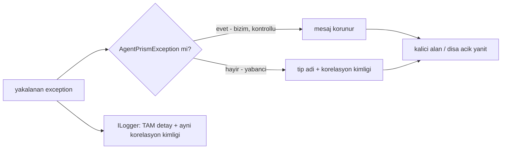

# Faz 119 — Hata Metni Sızıntısının Kapatılması

> **Durum:** 📋 Planlandı (2026-08-27)
> **Kaynak:** [YAYIN-HAZIRLIK.md](YAYIN-HAZIRLIK.md) §16 — BL-027 · BL-037 (yayın denetimi bulgusu, aday listesinden değil)
> **Önkoşul:** Yok
> **Paketler:** `AgentPrism.Abstractions`, `.Core`, `.Workflows`, `.AspNetCore`, `.Mcp`
> **Yeni paket:** Yok · **Migration:** **Yok** — korelasyon kimliği mevcut metin alanına gömülür (bkz. 119.3)
> **Public API:** Büyüyor — `PublicAPI.Shipped.txt` boş (`wc -l src/*/PublicAPI.Shipped.txt` = 0), yüzey bugün ucuz
> **Tüketici yüzeyi:** `docs-site/` — hata sözleşmesini anlatan sayfa (`concepts/runs.md` ve HTTP hata bölümü) · sevk edilen: `RunError.Message`'ın XML dokümanı, `IJobHandler`/`IWebhookStore` hata alanlarının XML'i
> **Manuel test alanı:** `docs/manuel-test/` — mevcut hata/gözlemlenebilirlik ailesine eklenir

---

## Bu Faza Başlarken

> `faz-baslangic` skill'ini uygula. Aşağıdaki liste o skill'in 2. adımıdır —
> **tamamını değil, yalnız işaret edilen bölümleri oku.**

1. Bu doküman
2. Kararlar — dosyanın tamamını **okuma**, yalnız bu kalemleri grep'le:
   ```bash
   grep -n "K-059\|K-639" docs/KARARLAR.md
   ```
   **K-059** (`secret` veritabanına da yazılmaz — bu fazın gerekçesinin kökü),
   **K-639** (aynı yayın denetiminin ilk kapatılan kusuru; sessiz güvenlik
   düşüşünün nasıl ele alındığına dair taze emsal)
3. [`YAYIN-HAZIRLIK.md`](YAYIN-HAZIRLIK.md) — yalnız §16:
   ```bash
   awk '/## 16. Sınıf taraması/,0' docs/YAYIN-HAZIRLIK.md
   ```
   21 vakanın tamamı, `dosya:satır` ile orada. Bu fazın iş listesi odur.
4. Alan hafızası (bu faz iki alana dokunuyor):
   [`hafiza/cekirdek-calistirma.md`](hafiza/cekirdek-calistirma.md) (`RunRecording`
   zinciri, olay yazımı) ·
   [`hafiza/http-uc-tuzaklari.md`](hafiza/http-uc-tuzaklari.md) (SSE ve hata gövdesi)
5. Gerektiğinde, tamamı değil ilgili bölümü:
   [`MIMARI-GUVENLIK.md`](MIMARI-GUVENLIK.md) — denetim izi ve `secret` bölümü

---

## Amaç

Ham `exception.Message` metni bugün **21 ayrı yoldan** kalıcı duruma veya dışa
açık bir yanıta yazılıyor. Provider SDK'sının, uzak bir webhook hedefinin ya da
bir OAuth sağlayıcısının ürettiği mesaj; istek ayrıntısı, iç URL, `host:port`
veya kısmi kimlik bilgisi taşıyabilir. Bu faz o metnin sızmasını kapatır ve
teşhis yeteneğini korur.

- **BL-027 · BL-037** — çalışma anı hata metni, kalıcı alana veya dışa açık
  yanıta yazılmadan önce güvenli biçime indirgenir; tam detay yalnız sunucu
  log'unda kalır ve bir korelasyon kimliğiyle bulunabilir.

Bu bir "yeni yetenek" fazı değildir. **Kapatılmamış bir kusur sınıfıdır** ve
sınıf bu repoda daha önce bir kez (`HATA-S3-006`, `IRunInputStore` yolu)
kapatılmış, ama yalnız o tek yolda kapatılmıştır.

### Bugün ne çalışmıyor — doğrulanmış kanıt

Aşağıdaki satırlar **2026-08-27'de bu oturumda tek tek okunarak** doğrulandı;
tamamı ve kalan 15 vaka [`YAYIN-HAZIRLIK.md`](YAYIN-HAZIRLIK.md) §16'dadır.

| Kanıt | Gözlem |
|---|---|
| [`Scheduling/JobWorkerBackgroundService.cs:269`](../src/AgentPrism.Core/Scheduling/JobWorkerBackgroundService.cs) | `ErrorMessage = exception.Message` → `jobs.error_message`. **Her** job türünün (AgentRun · Eval · Webhook · Workflow) tek hunisi |
| [`Scheduling/JobWorkerBackgroundService.cs:280`](../src/AgentPrism.Core/Scheduling/JobWorkerBackgroundService.cs) | `ReleaseForRetryAsync(job.Id, exception.Message, …)` — aynı metin retry yolunda da yazılıyor |
| [`Recording/RunRecordingAgent.Notifications.cs:138`](../src/AgentPrism.Core/Recording/RunRecordingAgent.Notifications.cs) | `Error = error?.Message` → webhook payload'ı → **kiracının tanımladığı dış URL'ye POST edilir.** Ham provider metninin kutudan çıktığı tek yol |
| [`Webhooks/WebhookDeliveryJobHandler.cs:327`](../src/AgentPrism.Core/Webhooks/WebhookDeliveryJobHandler.cs) | `$"HTTP {statusCode}: {body}"` — **uzak hedefin ham gövdesi** kalıcılaşıyor; tamamen üçüncü taraf kontrolünde |
| [`Webhooks/WebhookDeliveryJobHandler.cs:335`](../src/AgentPrism.Core/Webhooks/WebhookDeliveryJobHandler.cs) | `HttpRequestException.Message` — `host:port` taşır |
| [`Endpoints/GovernanceEndpoints.cs:84`](../src/AgentPrism.AspNetCore/Endpoints/GovernanceEndpoints.cs) | `DescribeOAuthFailure` → `result.Error` aynen HTML sayfasına. Uç **bearer token'dan muaf** (satır 40'ın XML dokümanı bunu açıkça söylüyor; loopback+policy ile sınırlı) |
| [`McpOAuthAuthorizationCoordinator.cs:253`](../src/AgentPrism.Mcp/McpOAuthAuthorizationCoordinator.cs) | O `Error`'ın kaynağı: `TrySetResult((false, ex.Message))` — OAuth token-exchange bacağının ham exception'ı |

**Kapsamın kanıtı:** `ContentGuardPipeline`'ın `src/` içinde yalnız iki çağrı
yeri var — `ContentGuardingChatClient` ve `HATA-S3-006` düzeltmesi
(`RunRecordingAgent.Persistence.cs:36-46`). Kalıcılaştıran veya dışa gönderen
başka hiçbir yol bir redaksiyon adımından geçmiyor.

> Kanıtlar 2026-08-27 tarihinde doğrulandı.

---

## 119.1 — Kural zaten var; eksik olan uygulanması

🚨 **Bu faz yeni bir redaksiyon mekanizması icat etmez.** Repo doğru deseni iki
yerde zaten taşıyor ve ikisi de bu fazın temelidir:

| Var olan | Kuralı |
|---|---|
| [`ToolFailureText.cs:6-11`](../src/AgentPrism.Core/Tools/ToolFailureText.cs) | `AgentPrismException` → mesaj korunur (bizim, kontrollü); yabancı exception → `$"Tool failed with {Type.Name}."` |
| [`ProviderFailureNormalizer.cs`](../src/AgentPrism.Core/Models/ProviderFailureNormalizer.cs) | Model çağrısı sınırında yabancı hatayı sabit `UpstreamMessage`'a indirger, tam detayı `Log(...)`'a verir |

**Neden `ContentGuardPipeline` DEĞİL:** content guard'lar **opt-in** ve
varsayılan kayıtlı guard sayısı **sıfırdır**
(`Registration.Operations.cs:96-99`, denetimde BL-018 olarak kayıtlı). Ham
metni o boru hattından geçirmek varsayılan kurulumda **hiçbir şey redakte
etmez** — sızıntı açık kalır. Bu, `HATA-S3-006` düzeltmesinin de taşıdığı ve bu
fazın tekrarlamayacağı sınırdır.

Bu fazın işi: `ToolFailureText`'in kuralını **tek bir paylaşılan yardımcıya**
yükseltmek ve 21 çağrı yerine uygulamak.

## 119.2 — Güvenli metnin şekli



Kural üç cümledir:

1. `AgentPrismException` **bizimdir**; mesajı zaten sözleşmenin parçasıdır ve
   korunur (`ErrorType` stabil bir koddur).
2. Yabancı exception'ın mesajı **hiçbir zaman** kalıcı alana veya dışa açık
   yanıta yazılmaz. Yerine tip adı yazılır.
3. Tam detay (`exception.ToString()`, inner zinciri dahil) **yalnız**
   `ILogger`'a gider — bugün de öyle yapılıyor, bu faz onu bozmaz.

## 119.3 — Korelasyon kimliği metne gömülür, sütuna değil

Operatörün teşhis yeteneğini kaybetmemesi için güvenli metin bir korelasyon
kimliği taşır; aynı kimlik log kaydına da yazılır.

**Kimlik ayrı bir sütuna DEĞİL, metnin içine gömülür.** Gerekçe ölçüldü: bu 21
sink'in çoğu düz `string` alandır (`jobs.error_message`,
`job_items.error`, `webhook_deliveries.error`,
`eval_case_results.failure_reason`, HTTP `detail`, SSE gövdesi, MCP hata
metni). Yapısal bir alan eklemek her biri için ayrı tip değişikliği ve
**üç sağlayıcıda migration** demektir; metne gömmek tek biçimi her sink'te
çalıştırır ve **migration gerektirmez**.

Beklenen biçim (kesin metin uygulama anında sabitlenir):

```
Tool failed with HttpRequestException. (ref: 7f3a9c21)
```

`RunError` özel durumdur: `Type` alanı **zaten var**
(`RunSupportTypes.cs:67`), bu yüzden orada tip adı tekrarlanmaz — yalnız
`Message` güvenli biçime iner.

## 119.4 — 22. vakayı kapı durdurur

Yazı tek başına yetmez; bu sınıf zaten bir kez yazıyla kapatılıp tekrarladı.
Repo'da üç emsali olan **cırcır (ratchet) kapısı** deseni uygulanır:
[`AmbientWriteSiteTests`](../tests/AgentPrism.Core.UnitTests/Architecture/AmbientWriteSiteTests.cs) ·
[`PlaywrightLocatorTests`](../tests/AgentPrism.Core.UnitTests/Architecture/PlaywrightLocatorTests.cs) ·
`SourceLanguageTests`.

Kapı `src/` içinde ham exception metninin kalıcı/dışa açık bir sink'e aktığı
her yeri tarar, taban çizgisiyle karşılaştırır: **yeni giriş testi kırar,
kaybolan giriş de kırar** (taban çizgisi bayatlayamaz). Taban çizgisi yalnız
küçülür.

🚨 Tarama `ILogger` çağrılarını **hedeflemez** — repo bilinçli olarak sunucu
tarafında tam detay loglar; onları da yakalayan bir kapı gürültü üretir ve
gerçek bulguyu gizler.

---

## Planlanan Public API

> Taslak imzalardır. Gerçekleşen imzalar kapanışta ayrı bir bölüme yazılır.

```csharp
// AgentPrism.Abstractions — paylaşılan kural, üçüncü tarafın da uygulaması için
public static class SafeErrorText
{
    /// <summary>Kalıcı alana veya dışa açık yanıta yazılabilir metni üretir.</summary>
    public static string ForPersistence(Exception exception, string correlationId);

    /// <summary>Korelasyon kimliği üretir; aynı değer log kaydına da yazılır.</summary>
    public static string NewCorrelationId();
}
```

Tip adı ve yerleşimi **açık sorudur** (bkz. Açık Sorular #1) — `internal`
kalıp yalnız `InternalsVisibleTo` ile paylaşılması da mümkündür ve public
yüzeyi büyütmez.

### HTTP `endpoint`'leri

Yeni uç yok. **Davranış değişikliği var:** `AgentEndpoints` (502 `detail`, SSE
`error` frame), `OpenAICompat/*` (502 gövde, SSE hata), `RunEndpoints:603`,
`ImageEndpoints:169`, MCP `CallToolResult` hata metni ve OAuth callback
sayfası artık yabancı exception metni yerine güvenli özet döndürür.

🚨 Bu, tüketicinin **gözlemlediği** bir değişikliktir. `docs-site`'ın hata
sözleşmesi bölümü aynı turda güncellenir.

### Arayüz payı

Yok — arayüz kodu değişmiyor. Arayüz bu metinleri yalnız gösterir.

---

## Planlanan Dosya Listesi

```
src/AgentPrism.Abstractions/
└── Diagnostics/
    └── SafeErrorText.cs                     (yeni — 119.2 kuralı)

src/AgentPrism.Core/
├── Scheduling/JobWorkerBackgroundService.cs (269, 280)
├── Scheduling/AgentRunJobHandler.cs         (265)
├── Scheduling/RunContinuationJobHandler.cs  (200)
├── Scheduling/AgentBatchJobHandler.cs       (84)
├── Scheduling/WorkflowJobHandler.cs         (70, 87)
├── Approvals/ApprovalResumeJobHandler.cs    (174)
├── Webhooks/WebhookDeliveryJobHandler.cs    (327, 335)
├── Recording/RunRecordingAgent.Completion.cs(282)
├── Recording/RunRecordingAgent.Notifications.cs (138)
├── Recording/RunReconciliationService.cs    (328)
└── Evaluation/EvalJobHandler.cs             (351)

src/AgentPrism.Workflows/
└── Internal/WorkflowRunner.cs               (1179-1198 ToRunError)

src/AgentPrism.AspNetCore/
├── Endpoints/AgentEndpoints.cs              (1135, 1233)
├── Endpoints/RunEndpoints.cs                (603)
├── Endpoints/ImageEndpoints.cs              (169)
├── Endpoints/GovernanceEndpoints.cs         (84)
├── OpenAICompat/OpenAIChatCompletionsEndpoints.cs (163, 318)
├── OpenAICompat/OpenAIResponsesEndpoints.cs (237, 397)
└── McpServer/CatalogToolCallHandler.cs      (106)

src/AgentPrism.Mcp/
└── McpOAuthAuthorizationCoordinator.cs      (253)

tests/AgentPrism.Core.UnitTests/Architecture/
├── RawExceptionTextSiteTests.cs             (yeni — cırcır kapısı)
└── raw-exception-text-baseline.txt          (yeni — taban çizgisi)
```

---

## Hata Modları ve Testler

> Mutlu yoldan değil, **ne bozulabilir**den türetilir. Seviyeyi plan seçer.
> Sınır geçen davranış (DI · HTTP · kiracı · akış · depo · paket) birim
> testiyle kanıtlanamaz — [`.agents/ortak/test-seviyeleri.md`](../.agents/ortak/test-seviyeleri.md).

| Ne bozulabilir | Seviye | Test sınıfı |
|---|---|---|
| Provider SDK exception'ının metni `runs.error_message`'a yazılıyor | Fonksiyonel (fırlatan sahte provider + gerçek depo) | `RunErrorRedactionTests` |
| Aynı metin webhook payload'ıyla **dışarı** çıkıyor | Fonksiyonel (yakalayıcı HTTP dinleyici) | `WebhookErrorRedactionTests` |
| Uzak webhook hedefinin ham gövdesi `webhook_deliveries.error`'a yazılıyor | Fonksiyonel (hata gövdesi döndüren sahte hedef) | `WebhookErrorRedactionTests` |
| Her job türünde ayrı ayrı sızıntı (AgentRun · Eval · Webhook · Workflow) | Fonksiyonel, **tür başına** | `JobErrorRedactionTests` |
| SSE `error` frame'i ham metin taşıyor | Fonksiyonel (akış sınırı) | `SseErrorRedactionTests` |
| OpenAI-uyumlu uçlar ham metin taşıyor | Fonksiyonel (HTTP sınırı) | `OpenAICompatErrorRedactionTests` |
| MCP `CallToolResult` ham metin taşıyor | Fonksiyonel (wire sınırı) | `McpErrorRedactionTests` |
| Auth'suz OAuth callback sayfası ham metin basıyor | Fonksiyonel (HTTP, auth'suz grup) | `McpOAuthCallbackRedactionTests` |
| `AgentPrismException`'ın kendi mesajı **yanlışlıkla** redakte ediliyor (aşırı düzeltme) | Birim | `SafeErrorTextTests` |
| Korelasyon kimliği metinde var ama log'da yok (veya tersi) | Fonksiyonel (log yakalayıcı) | `SafeErrorTextCorrelationTests` |
| İptal (`OperationCanceledException`) hata sanılıp redakte ediliyor | Birim | `SafeErrorTextTests` |
| Başka kiracının hata kaydı görünür hale geliyor | Sözleşme (`TenantIsolationContract`) | mevcut suite — regresyon |
| 22. sızıntı yeri eklenmesi | Mimari cırcır | `RawExceptionTextSiteTests` |

Beş soru — cevapları yukarıdaki tabloya girdi: **iptal** (`OperationCanceledException`
redaksiyon dışıdır, `ProviderFailureNormalizer.ShouldNormalize` bunu zaten
ayırıyor) · **eşzamanlılık** (korelasyon kimliği üretimi thread-safe olmalı) ·
**boş/aşırı girdi** (`null` exception, çok uzun tip adı) · **başka kiracı**
(hata kaydı kiracıya bağlı kalır, regresyon) · **alt sistem hatası** (log
yazımı düşerse redaksiyon yine de uygulanır — güvenlik log'a bağlanmaz).

---

## Manuel Kabul Case'leri

> Kapanışta `docs/manuel-test/` ilgili aile dosyasına eklenecek case taslakları.

| # | Ön koşul | Adımlar | Beklenen sonuç |
|---|---|---|---|
| 1 | Geçersiz API anahtarıyla yapılandırılmış provider | `samples/AgentPrism.Api` üzerinde bir agent çalıştır | `runs.error_message` sağlayıcının ham metnini **taşımaz**; tip adı + `ref:` kimliği taşır. Sunucu log'unda aynı kimlikle tam detay bulunur |
| 2 | Kayıtlı webhook + hata döndüren dış uç | Aynı run'ı çalıştır, webhook payload'ını yakala | Payload'ın `Error` alanı güvenli metindir; ham provider metni **kutudan çıkmaz** |
| 3 | Gövdesinde iç ayrıntı döndüren sahte webhook hedefi | Teslimatı tetikle, `webhook_deliveries.error`'ı oku | Uzak gövde kalıcılaşmaz |
| 4 | OpenAI-uyumlu uç + bozuk provider | `POST /v1/chat/completions` | 502 gövdesi güvenli metindir |
| 5 | Bilinen bir `AgentPrismException` (örn. kota aşımı) | Kotayı doldur, run başlat | Mesaj **aynen korunur** — aşırı düzeltme yok |

---

## Açık Sorular

> Planı bloklamayan, faz uygulanırken karara bağlanacak sorular.

| # | Soru | Seçenekler | Öneri |
|---|---|---|---|
| 1 | `SafeErrorText` public mi `internal` mi? | A: `public` (üçüncü taraf `IJobHandler`/`IRunEventSink` yazarı aynı kuralı uygulayabilir) · B: `internal` + `InternalsVisibleTo` (yüzey büyümez) | **A** — üçüncü tarafın kendi handler'ında aynı sızıntıyı üretmesi bu fazın kapatmak istediği sınıfın ta kendisi; kuralı gizlemek onu tekrar ettirir. `PublicAPI.Shipped.txt` boşken maliyeti sıfır |
| 2 | Korelasyon kimliği biçimi | A: kısa hex (8 karakter) · B: tam `Guid` | **A** — hata metnine gömülüyor, okunabilirliği önemli; çakışma riski log araması için kabul edilebilir, kimlik zaman+run bağlamıyla birlikte aranır |
| 3 | `WebhookDeliveryJobHandler`'ın uzak gövdesi tamamen mi atılsın, HTTP durum kodu korunsun mu? | A: yalnız `$"HTTP {statusCode}"` · B: durum kodu + gövdenin uzunluğu | **A** — durum kodu teşhis için yeterli, gövde tamamen üçüncü taraf kontrolünde |
| 4 | Mevcut kalıcı satırlardaki ham metinler ne olacak? | A: dokunulmaz (geçmiş kayıt) · B: temizlik migration'ı | **A** — paket hiç yayınlanmadı, üretim verisi yok; temizlik migration'ı 119.3'ün "migration yok" kazancını harcar |

---

## Bitiş Ölçütleri (DoD)

- [ ] §16'daki **21 vakanın tamamı** kapatıldı; her biri için `dosya:satır` ile kapanış kaydı yazıldı
- [ ] Yargı gerektiren 5 kalem (§16 sonu) ölçüldü; her biri "düzeltildi" veya "gerekçeyle kapsam dışı" olarak kaydedildi
- [ ] `RawExceptionTextSiteTests` cırcır kapısı yeşil; taban çizgisi dosyası repo'da
- [ ] Fırlatan sahte provider ile: `runs.error_message` ham metin taşımıyor, log tam detayı **aynı korelasyon kimliğiyle** taşıyor
- [ ] Webhook payload'ı dış uçta yakalandı; ham provider metni içermediği doğrulandı
- [ ] `AgentPrismException` mesajlarının korunduğu doğrulandı (aşırı düzeltme yok)
- [ ] Dört doğrulama kapısı sıfır uyarı verir
- [ ] `samples/AgentPrism.Api` ile gerçek `run` yapıldı, çıktı belgeye yazıldı
- [ ] `secret` taraması boş döndü
- [ ] Manuel kabul case'leri `docs/manuel-test/` içine eklendi; otomatikleştirilebilenler koşuldu
- [ ] `faz-denetim` koşuldu; 🔴 bulgu kalmadı
- [ ] `docs-site/` hata sözleşmesi bölümü güncellendi; `npm run build` + `check-links.mjs` temiz
- [ ] [`YAYIN-HAZIRLIK.md`](YAYIN-HAZIRLIK.md) §4 ve §16 güncellendi (BL-027/BL-037 kapandı)

### Doğrulama komutları

```bash
# Ham exception metni kalan var mı — cırcır kapısı
./artifacts/bin/AgentPrism.Core.UnitTests/release/AgentPrism.Core.UnitTests \
  --filter-method "*RawExceptionTextSite*"

# Kalıcı hata alanında ham metin var mı
curl -s http://localhost:5081/agentprism/api/runs/<id> | jq '.error'
```

---

## Riskler

| Risk | Önlem |
|------|-------|
| **Aşırı düzeltme** — `AgentPrismException`'ın kendi mesajları da redakte edilir, hata mesajları anlamsızlaşır | `SafeErrorTextTests` bunu birim seviyesinde kilitler; DoD'de ayrı satır |
| Cırcır kapısının regex'i gürültü üretir (`ILogger` çağrılarını yakalar) | Kapı yalnız kalıcı/dışa açık sink'leri hedefler; `ILogger` açıkça kapsam dışı (119.4) |
| 21 vaka tek turda kapatılırken bir sink gözden kaçar | Kapı taban çizgisi bunu yakalar: kapatılmayan yer taban çizgisinde kalır ve görünür olur |
| Tüketici teşhis yeteneği kaybeder | Korelasyon kimliği + log'da tam detay (119.3); manuel case #1 bunu doğrular |
| OpenAI-uyumlu istemciler hata metnine bağımlıysa kırılır | Bu yüzey preview öncesi değiştiriliyor; `PublicAPI.Shipped.txt` boş, sonradan değiştirmek kırıcı olurdu |

---

<!-- ============================================================
     AŞAĞISI KAPANIŞTA DOLDURULUR — `faz-tamamlama` skill'i.
     Plan anında boş kalır. Başlıkları SİLME.
     ============================================================ -->

## Plandan Sapmalar

> Kapanışta doldurulur.

## Bu Fazda Verilen Kararlar

> Kapanışta doldurulur. K-NNN numaraları burada alınır; plan numara rezerve etmez.

## Gerçekleşen Public API

> Kapanışta doldurulur.

## Dosya Listesi (gerçekleşen)

> Kapanışta doldurulur.

## Denetim Bulguları

> Kapanışta doldurulur — `faz-denetim` çıktısı.

## Sonraki Faza Devir Notu

> Kapanışta doldurulur.
