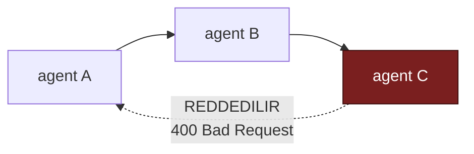
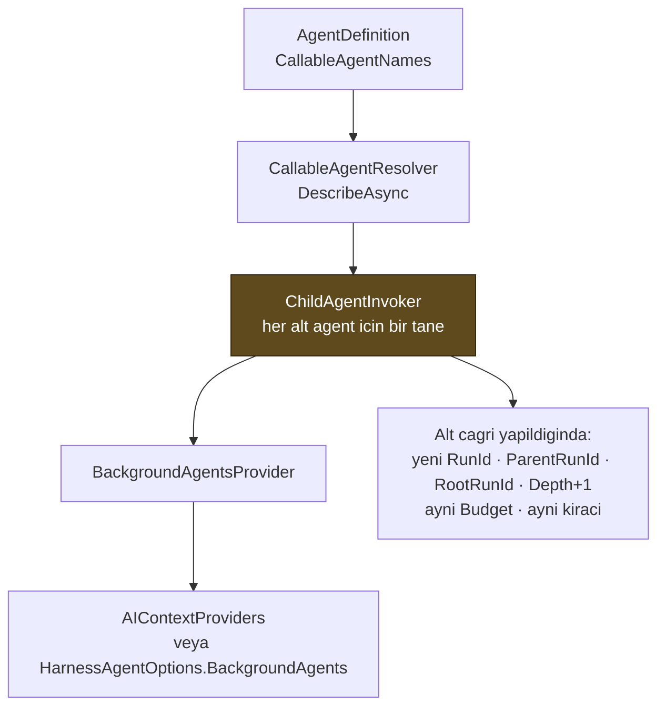

# Faz 12 — Agent'ın Agent'ı Çağırması

> **Durum:** ✅ Tamamlandı (2026-08-02)
> **Kaynak:** [BEYIN-FIRTINASI.md](BEYIN-FIRTINASI.md) · **F-10**
> **Paketler:** `AgentPrism.Abstractions`, `.Core`, `.PostgreSql`, `.AspNetCore`, `.UI`
> **Yeni paket:** Yok · **Migration:** 0005

---

## Bu Faza Başlarken

1. [`MIMARI.md`](MIMARI.md) — bölüm 6 (çalıştırma yolu), bölüm 5 (`runs` tablosu)
2. [`KARARLAR.md`](KARARLAR.md) — **K-093 … K-103** (bu fazın kararları), **K-053** (harness kusuru), **K-062** (`BackgroundAgents` neden kapalıydı)
3. [`06-GOZLEMLENEBILIRLIK.md`](06-GOZLEMLENEBILIRLIK.md) — dekoratör sırası, span ağacı
4. Bu doküman

---

## Amaç

Bir agent, kataloğdaki başka bir agent'ı çağırabilsin. MAF'ta hazırdır ve Faz
6'da **bilerek kapalı bırakılmıştı** (K-062): kaynak sınırı, denetim izi ve
özyineleme koruması tasarlanmadan açılması doğru olmazdı. Bu faz o tasarımı
yaptı ve özelliği açtı.

---

## Doğrulanmış MAF API'si

Reflection ile 2026-08-02'de MAF 1.16.0 üzerinde ölçüldü:

```csharp
sealed class BackgroundAgentsProvider : AIContextProvider {
    BackgroundAgentsProvider(IEnumerable<AIAgent> agents, BackgroundAgentsProviderOptions options);
    IReadOnlyList<BackgroundTaskInfo> GetIncompleteTasks(AgentSession session);
    IReadOnlyList<string> StateKeys { get; }   // ["BackgroundAgentsProvider", "BackgroundAgentsProvider_Runtime"]
}

sealed class BackgroundAgentsProviderOptions {
    Func<IReadOnlyDictionary<string, AIAgent>, string>? AgentListBuilder { get; set; }
    string? Instructions { get; set; }
}

HarnessAgentOptions.BackgroundAgents               // IEnumerable<AIAgent>
ChatClientAgentOptions.AIContextProviders          // duz agent bu yoldan alir
```

### Ölçülen davranış — plandan farklı olan kısımlar

Sağlayıcı çalıştırıldığında modele **altı tool** açıyor:

| Tool | Ne yapar |
|------|----------|
| `background_agents_start_task` | Görevi başlatır, **bloke etmez**, görev kimliği döner |
| `background_agents_wait_for_first_completion` | Verilen görevlerden ilki bitene kadar bekler |
| `background_agents_get_task_results` | Bitmiş görevin metnini döner |
| `background_agents_get_all_tasks` | Tüm görevleri durumlarıyla listeler |
| `background_agents_continue_task` | Biten göreve devam girdisi gönderir (oturum korunur) |
| `background_agents_clear_completed_task` | Görevi düşürür, oturumunu serbest bırakır |

Üç ölçüm doğrudan tasarımı belirledi:

1. **🚨 Alt agent `options = null` ile çağrılır.** Ağaç bilgisi gelen ayarlardan
   okunamaz; sarmalayıcı onu ambient kapsamdan okuyup `AgentPrismRunOptions`
   nesnesini kendisi kurmak zorundadır.
2. **`Activity.Current` ve `AsyncLocal` alt çağrıya akar.** Görev ayrı bir iş
   parçacığında koşsa da `ExecutionContext` yakalanır. Span ağacı ve bütçe
   taşıması bu yüzden ambient bağlamla çözülebildi.
3. **Çağrı eşzamansızdır.** Model önce başlatır, sonra bekler, sonra sonucu alır.
   Tek turda tamamlanan bir sahte istemci gerçek yolu atlar — testlerin sahte
   sağlayıcıları bu üç adımı gerçekten yürütür.

---

## Cevaplanmış Tasarım Soruları

| Soru | Cevap | Karar |
|------|-------|-------|
| Özyineleme nasıl kesilir? | **İki katman**: kaydetme anında statik döngü denetimi + çalışma anında derinlik sayacı | — |
| Alt çalıştırma ayrı `runs` satırı mı? | **Evet** | K-093 |
| Kiracı? | **Aynı kiracı, istisnasız** | — |
| Token bütçesi? | **Ağaç boyunca paylaşılan tek nesne** | K-096 |
| Onay kime sorulur? | **v1: alt agent onay isteyemez**; isteyen alt çalıştırma `Failed` olur | K-103 |
| Varsayılan `MaxDepth`? | **3** *(kullanıcı kararı)* | K-101 |
| Varsayılan token bütçesi? | **200.000 / ağaç** *(kullanıcı kararı)* | K-101 |
| Alt çalıştırma SSE'de görünsün mü? | **Özet olay** *(kullanıcı kararı)* | K-102 |
| `OnlyRootRuns` varsayılanı? | **`true`** *(kullanıcı kararı)* | K-100 |

---

## 12.1 — Tanım ve Statik Döngü Denetimi

```csharp
public sealed record AgentDefinition
{
    // ...mevcut uyeler
    public IReadOnlyList<string> CallableAgentNames { get; init; } = [];
}
```

Kaydetme anında (`POST` ve `PUT /api/agents/{name}`) çağrı grafiği denetlenir:



- Kendi kendini çağırma (`A → A`) reddedilir
- Dolaylı döngü (`A → B → C → A`) reddedilir — hata mesajı **yolu yazar**
- Bilinmeyen agent adı reddedilir
- Elmas biçimli grafik (`A → B → D`, `A → C → D`) **kabul edilir**: aynı düğüme
  iki yoldan ulaşmak döngü değildir

Denetim `AgentCallGraph.Validate(...)` içindedir ve **açık yığın** kullanır;
özyinelemeli bir gezinti, yeterince uzun bir zincirde süreci öldürürdü. Regresyon
testi 20.000 düğümlük bir zincirle bunu doğrular.

Grafik, denetlenen tanımın **yeni** hâliyle kurulur; kataloğun eski hâli
kullanılsaydı yeni eklenen kenar hiç görülmez ve döngü kaçardı.

> Statik denetim **yeterli değildir**: kod tarafındaki bir fabrika agent'ı
> (`AddAgent(name, factory)`) grafiği taşımaz. Bu yüzden çalışma anındaki
> derinlik sayacı da zorunludur.

---

## 12.2 — Çalışma Anı: Derinlik, Bütçe ve Kimlik

```csharp
public sealed class AgentPrismRunOptions : AgentRunOptions
{
    public Guid? RunId { get; init; }
    public Guid? ParentRunId { get; init; }          // YENI
    public Guid? RootRunId { get; init; }            // YENI
    public int Depth { get; init; }                  // YENI · kok = 0
    public AgentRunBudget? Budget { get; init; }     // YENI · agac boyunca PAYLASILIR
    public override AgentRunOptions Clone();         // BESINI DE KORUR
}

public sealed class AgentRunBudget          // sinif, record DEGIL: paylasilan degisken durum
{
    public long? MaxTotalTokens { get; init; }
    public int? MaxTotalRuns { get; init; }          // ALT calistirma sayisi; kok sayilmaz
    public int MaxDepth { get; init; } = 3;
    public long ConsumedTokens { get; }              // Interlocked ile artar
    public int StartedRuns { get; }
    public bool IsTokenBudgetExhausted { get; }
    public bool TryReserveRun();                     // sinir asilirsa false
    public void RecordUsage(long tokens);
    public string DescribeExhaustion();              // kullaniciya gosterilebilir metin
}
```

Ağaç bilgisi çalışma yolunda **ambient kapsam** ile taşınır:

```csharp
public static class AgentPrismRunContext
{
    public static AgentRunScope? Current { get; }
    public static Guid? CurrentRunId { get; }
    public static void SetCurrent(AgentRunScope? scope);
}

public sealed record AgentRunScope
{
    public required Guid RunId { get; init; }
    public required Guid RootRunId { get; init; }
    public int Depth { get; init; }
    public string? AgentName { get; init; }
    public string? TenantId { get; init; }
    public AgentRunBudget? Budget { get; init; }
    public RunEventWriter? Writer { get; init; }
}
```

Kurallar:

- **`Clone()` beş alanı da korur.** K-044'te öğrenildi; ağaç alanları için tuzak
  daha sinsidir: düşen bir `Depth` değeri özyineleme korumasını sessizce devre
  dışı bırakır.
- **Bütçe nesnesi ağaç boyunca aynı örnektir.** Test `ShouldBeSameAs` ile
  doğrular.
- **Derinlik aşılırsa** alt çağrı yapılmaz; çağıran tool sonucu olarak
  "çağrı derinliği sınırı aşıldı" alır ve **satır oluşmaz**.
- **Bütçe biterse** yeni alt çalıştırma başlatılmaz; devam eden kesilmez.
- **Kiracı değişmişse** çağrı reddedilir ve `LogError` yazılır.

### 🚨 Akışlı yolda `AsyncLocal` tuzağı

Faz 6'nın `Activity.Current` dersinin ikinci hâli, bu fazda ölçüldü:

> Bir `async IAsyncEnumerable` gövdesinde yapılan `AsyncLocal` ataması
> **`yield return` sınırını aşmaz**. Çağrı driver'a döndüğünde `ExecutionContext`
> geri alınır ve sonraki `MoveNextAsync` temiz bir bağlamla başlar.

Ölçülen belirti: akışsız çalıştırmada alt agent çağrısı çalışıyor, akışlı
çalıştırmada `'arastirmaci' agent'i cagirilamadi: calistirma kaydi kapali`
diyerek reddediliyordu. Çözüm: kapsam **her `MoveNextAsync`'ten hemen önce**
yeniden yazılır. Döngünün dışında bir kez yazmak yetmez.

> Bu düzeltme Faz 11'in skill script `CurrentRunId` özelliğini de akışlı
> çalıştırmalarda onardı — aynı kapsamı okuyor ve aynı sebeple boş görüyordu.

---

## 12.3 — Veri Modeli (Migration 0005)

```sql
ALTER TABLE {schema}.runs ADD COLUMN IF NOT EXISTS parent_run_id uuid;
ALTER TABLE {schema}.runs ADD COLUMN IF NOT EXISTS root_run_id   uuid;
ALTER TABLE {schema}.runs ADD COLUMN IF NOT EXISTS depth         smallint NOT NULL DEFAULT 0;

CREATE INDEX IF NOT EXISTS runs_parent_idx
    ON {schema}.runs (parent_run_id) WHERE parent_run_id IS NOT NULL;

CREATE INDEX IF NOT EXISTS runs_root_idx
    ON {schema}.runs (tenant_id, root_run_id, started_at) WHERE root_run_id IS NOT NULL;

CREATE INDEX IF NOT EXISTS runs_roots_only_idx
    ON {schema}.runs (tenant_id, started_at DESC) WHERE parent_run_id IS NULL;
```

Migration **yeni tablo eklemez**; tablo sayısı 20'de kalır.

`RunRecord` üç alanla değil **beş** alanla genişledi — ikisi okumada hesaplanır:

| Alan | Kaynak |
|------|--------|
| `ParentRunId`, `RootRunId`, `Depth` | Sütun |
| `ChildRunCount` | `LATERAL` alt sorgu: `parent_run_id = r.id` sayımı (**doğrudan** çocuklar) |
| `TreeUsage` | `LATERAL` alt sorgu: `root_run_id = r.id` toplamı **+ kaydın kendi kullanımı** |

Değerler saklanmaz. Saklansaydı her alt çalıştırmanın tamamlanması üstündeki her
kaydı güncellemek zorunda kalır ve kayıt yolu derinlikle birlikte pahalılaşırdı.

> `TreeUsage` ile `Usage` **toplanmaz**: birincisi ikincisini zaten içerir. Alt
> çalıştırması olmayan bir kayıtta ikisi eşittir. Ne kayıtta ne ağaçta kullanım
> varsa değer `null` kalır — sıfır yazmak "sağlayıcı token bildirmedi" ile "hiç
> token harcanmadı" durumlarını ayırt edilemez hâle getirirdi.

`RunQuery` dört alanla genişledi: `OnlyRootRuns` (varsayılan **`true`**),
`ParentRunId`, `RootRunId` ve mevcut filtreler. `ParentRunId` verildiğinde
`OnlyRootRuns` **bilerek** yok sayılır.

---

## 12.4 — Derleyici ve Sarmalayıcı



`ChildAgentInvoker` bir `AIAgent`'tır (`DelegatingAIAgent` **değil**: iç agent
geç çözülür) ve her çağrıda:

1. Ambient kapsamı okur; kapsam yoksa reddeder
2. Derinliği denetler
3. Kiracının değişmediğini doğrular
4. Bütçeden yer ayırır (`TryReserveRun`)
5. Yeni `AgentPrismRunOptions` üretir
6. Kök akışa `ChildRunStarted` yazar
7. İç agent'ı çözer ve çağırır — iç agent zaten `RunRecordingAgent` ile sarılıdır,
   dolayısıyla **alt `runs` satırı kendiliğinden oluşur**
8. Kök akışa `ChildRunCompleted` yazar (`finally`)

Ret bir istisna değil, **tool sonucu** olarak döner: "bu alt çağrıyı yapamadım"
modelin değerlendirip başka bir yol denemesi gereken normal bir sonuçtur.

> Dekoratör sırasına dokunulmadı. `ChildAgentInvoker` bir dekoratör değildir;
> çağrılan agent'ın **etrafına** derleme anında konur.

Önbellek anahtarı `CompiledAgentCache.CombineFingerprints(skillFingerprint,
callableFingerprint)` ile kurulur: alt agent'ın **açıklaması** modele gönderilen
metne gömülür, dolayısıyla alt agent güncellendiğinde çağıran yeniden derlenmelidir.

---

## 12.5 — Arayüz

- **Runs listesi**: varsayılan yalnız kök çalıştırmalar; satırda "1 child run"
  rozeti, alt çalıştırma satırlarında "depth 1" rozeti. Açılır menüden
  "Include child runs" seçilebilir.
- **Run detay**: "Call tree" paneli tüm ağacı `parentRunId` üzerinden iç içe
  çizer; her satır kendi detayına bağlantılıdır. Başlıkta alt çalıştırma için
  "called by" bağlantısı görünür.
- **İstatistik**: "Tokens" ve "Tree tokens" **ayrı** sütunlardır; ipucu metni
  toplanmamaları gerektiğini yazar.
- **Waterfall**: alt çalıştırmanın span'leri kök span'in altında iç içe görünür.

### 🚨 Trace sahipliği (K-099)

Ağaçtaki her çalıştırma **aynı** W3C trace kimliğini paylaşır. `RunTraceCollector`
tamponu bu kimlikle anahtarlar ve `CompleteRunAsync` tamponu **kaldırır**. Alt
çalıştırma önce bittiği için tamponu o kapatıyor, tüm ağacın span'leri alt
çalıştırmaya bağlanıyor ve kökün `/trace` ucu `404` dönüyordu. Gerçek bir
çağrıda ölçüldü.

Çözüm: toplayıcı yalnız `Depth == 0` iken çağrılır. Arayüz alt çalıştırmanın
trace panelinde köke bağlantı gösterir ve isteği hiç yapmaz.

---

## Gerçekleşen Public API

### `AgentPrism.Abstractions`

```csharp
// Runs/AgentRunBudget.cs — YENI
public sealed class AgentRunBudget
{
    public long? MaxTotalTokens { get; init; }
    public int? MaxTotalRuns { get; init; }
    public int MaxDepth { get; init; }
    public long ConsumedTokens { get; }
    public int StartedRuns { get; }
    public bool IsTokenBudgetExhausted { get; }
    public bool TryReserveRun();
    public void RecordUsage(long tokens);
    public string DescribeExhaustion();
}

// Runs/AgentPrismRunOptions.cs — GENISLEDI
public Guid? ParentRunId { get; init; }
public Guid? RootRunId { get; init; }
public int Depth { get; init; }
public AgentRunBudget? Budget { get; init; }

// Runs/RunRecord.cs — GENISLEDI
public Guid? ParentRunId { get; init; }
public Guid? RootRunId { get; init; }
public int Depth { get; init; }
public int ChildRunCount { get; init; }
public RunUsage? TreeUsage { get; init; }

// Runs/RunSupportTypes.cs — GENISLEDI
// RunStartInfo: ParentRunId, RootRunId, Depth
// RunQuery:     OnlyRootRuns (varsayilan true), ParentRunId, RootRunId

// Runs/RunEventType.cs — GENISLEDI
ChildRunStarted = 8,
ChildRunCompleted = 9,

// Agents/AgentDefinition.cs · Agents/AgentDescriptor.cs — GENISLEDI
public IReadOnlyList<string> CallableAgentNames { get; init; }
```

### `AgentPrism.Core`

```csharp
// Graph/AgentCallGraph.cs — YENI
public static class AgentCallGraph
{
    public static string? Validate(
        string agentName,
        IReadOnlyList<string> callableAgentNames,
        IReadOnlyList<AgentDescriptor> descriptors);
}

// Graph/CallableAgentResolver.cs — YENI
public sealed class CallableAgentResolver
{
    public CallableAgentResolver(IServiceProvider services);
    public ValueTask<AIAgent?> ResolveAsync(string agentName, CancellationToken ct = default);
    public ValueTask<IReadOnlyList<AgentDescriptor>> ListAsync(CancellationToken ct = default);
    public ValueTask<IReadOnlyList<CallableAgentInfo>> DescribeAsync(
        IReadOnlyList<string> callableAgentNames, CancellationToken ct = default);
}

public readonly record struct CallableAgentInfo(string Name, string? Description, int Version);

// Graph/ChildAgentInvoker.cs — YENI
public sealed class ChildAgentInvoker : AIAgent
{
    public ChildAgentInvoker(
        CallableAgentResolver resolver,
        ITenantContext tenantContext,
        ILogger logger,
        string callerName,
        CallableAgentInfo child);
}

// Recording/AgentPrismRunContext.cs — DEGISTI
// SetCurrentRunId(Guid?) KALDIRILDI, yerine:
public static AgentRunScope? Current { get; }
public static void SetCurrent(AgentRunScope? scope);
public sealed record AgentRunScope { /* RunId, RootRunId, Depth, AgentName, TenantId, Budget, Writer */ }

// AgentPrismOptions.cs — GENISLEDI
public AgentPrismAgentGraphOptions AgentGraph { get; set; }

public sealed class AgentPrismAgentGraphOptions
{
    public int MaxDepth { get; set; } = 3;
    public long MaxTotalTokens { get; set; } = 200_000;
    public int MaxTotalRuns { get; set; } = 25;
    public AgentRunBudget CreateBudget();
}

// Compilation/AgentDefinitionCompiler.cs — GENISLEDI
public AIAgent Compile(AgentDefinition definition, ResolvedCallableAgents callableAgents);
public readonly record struct ResolvedCallableAgents(
    IReadOnlyList<CallableAgentInfo> Agents, string Fingerprint);

// Compilation/CompiledAgentCache.cs — GENISLEDI
public static string CombineFingerprints(string first, string second);

// Recording/RunRecordingAgent.cs — kurucuya eklendi
AgentPrismAgentGraphOptions? graphOptions = null

// Diagnostics/AgentPrismDiagnostics.Tags — GENISLEDI
public const string ParentRunId = "agentprism.run.parent_id";
public const string Depth = "agentprism.run.depth";
```

### `AgentPrism.AspNetCore`

```csharp
// Contracts/AgentContracts.cs — GENISLEDI
public IReadOnlyList<string> CallableAgentNames { get; init; }   // AgentDefinitionRequest

// Yeni sorgu parametreleri: GET /api/runs
//   ?includeChildren=true   -> OnlyRootRuns = false
//   ?parentRunId={guid}     -> yalniz dogrudan cocuklar (kok filtresini gecersiz kilar)
//   ?rootRunId={guid}       -> yalniz o agacin satirlari

// Yeni uc
// GET /api/runs/{runId:guid}/tree   -> IReadOnlyList<RunRecord>  (agacin TAMAMI, kokunden)
```

---

## Oluşturulan / Değişen Dosyalar

```
src/AgentPrism.Abstractions/
├── Runs/AgentRunBudget.cs                     YENI
├── Runs/AgentPrismRunOptions.cs               genisledi
├── Runs/RunRecord.cs                          genisledi
├── Runs/RunSupportTypes.cs                    genisledi
├── Runs/RunEventType.cs                       genisledi
├── Agents/AgentDefinition.cs                  genisledi
└── Agents/AgentDescriptor.cs                  genisledi

src/AgentPrism.Core/
├── Graph/AgentCallGraph.cs                    YENI
├── Graph/CallableAgentResolver.cs             YENI
├── Graph/ChildAgentInvoker.cs                 YENI  (+ internal ChildRunApproval)
├── Recording/AgentPrismRunContext.cs          yeniden yazildi (+ AgentRunScope)
├── Recording/RunRecordingAgent.cs             genisledi
├── Recording/RunRecordingAgentDecorator.cs    genisledi
├── Compilation/AgentDefinitionCompiler.cs     genisledi
├── Compilation/CompiledAgentCache.cs          genisledi
├── Catalog/CodeAgentSource.cs                 genisledi
├── Catalog/DefinitionStoreAgentSource.cs      genisledi
├── Storage/InMemoryRunStore.cs                genisledi
├── Diagnostics/AgentPrismDiagnostics.cs       genisledi
├── AgentPrismOptions.cs                       genisledi
└── AgentPrismServiceCollectionExtensions.cs   genisledi

src/AgentPrism.PostgreSql/
├── Migrations/0005_agent_call_graph.sql       YENI
├── Internal/SqlQueries.cs                     genisledi
└── Stores/PostgresRunStore.cs                 genisledi

src/AgentPrism.AspNetCore/
├── Contracts/AgentContracts.cs                genisledi
├── Endpoints/AgentEndpoints.cs                genisledi (ValidateCallGraphAsync)
└── Endpoints/RunEndpoints.cs                  genisledi (/tree, includeChildren)

src/AgentPrism.UI/frontend/src/
├── lib/types.ts                               genisledi
├── lib/api.ts                                 genisledi (runTree)
├── screens/runs.tsx                           genisledi (rozet, filtre, tree tokens)
├── screens/run-detail.tsx                     genisledi (RunTree, trace paneli)
└── screens/agent-editor.tsx                   genisledi (Callable agents paneli)

samples/AgentPrism.Api/Program.cs              "yonlendirici" agent'i eklendi
```

---

## Testler

**Toplam: 583 test** (Faz 11 sonunda 536).

| Proje | Sınıf | Ne doğrular |
|-------|-------|-------------|
| `Core.UnitTests` | `AgentCallGraphTests` (8) | Kendi kendine/dolaylı döngü, bilinmeyen ad, elmas grafik, kataloğun eski hâli değil yeni liste, 20.000 düğümde yığın taşması yok |
| `Core.UnitTests` | `AgentRunBudgetTests` (7) | Sayı ve token sınırı, başarısız denemenin sayacı artırmaması, 200 eşzamanlı denemede sınırın tutması, ayar varsayılanları |
| `Core.UnitTests` | `ChildAgentInvokerTests` (8) | Kapsamsız/derinlik/bütçe/kiracı reddi, ağaca bağlanma, ikinci katmanda kökün korunması, bütçenin tek örnek olması, onay isteyen alt çalıştırmanın `Failed` olması |
| `Core.UnitTests` | `AgentPrismRunOptionsTests` (2) | `Clone()` beş alanı korur; bütçe **aynı örnek** kalır |
| `PostgreSql.IntegrationTests` | `RunStoreContract` (+6) | Ağaç alanlarının gidip gelmesi, `OnlyRootRuns` varsayılanı, ebeveyn filtresinin kök filtresini geçersiz kılması, ağaç sorgusu, ağaç toplamı, token bildirilmediğinde `null` |
| `AspNetCore.FunctionalTests` | `AgentCallGraphTests` (7) | Kaydetmede `400`, geçerli grafiğin katalogda görünmesi, `/api/runs` varsayılanı, `/tree` ucu, `404`, kök kaydın rozet ve ağaç toplamı |
| `AspNetCore.FunctionalTests` | `AgentDelegationTests` (4) | Gerçek MAF arka plan tool'larıyla akışsız **ve akışlı** devir, kök akıştaki özet olaylar, derinlik 0'da reddedilme |
| `Ui.E2ETests` | `UiTests` (+2) | Ağaç panelinin ve `child.started` olayının tarayıcıda görünmesi, Runs ekranının varsayılan kök filtresi |

Testler için `RoutingModelProvider` (FunctionalTests) ve genişletilmiş
`ScriptedModelProvider` (E2E) MAF'ın **gerçek** arka plan tool'larını üç adımda
çağırır; tek turda tamamlayan bir kısayol kullanılmadı.

---

## Gerçek Model Kanıtı

`samples/AgentPrism.Api`, `gpt-5.4-mini`, `yonlendirici → support`:

```
$ curl -sN -X POST .../api/agents/yonlendirici/run \
       -d '{"message":"ORD-7 durumunu ogren ve ozetle"}'

=== KOK LISTESI (varsayilan) ===
yonlendirici   depth=0 children=1 tokens=904 tree=1502

=== TUM (includeChildren=true) ===
support        depth=1 parent=019fc370 root=019fc370 tokens=598 status=Completed
yonlendirici   depth=0 parent=None     root=None     tokens=904 status=Completed

=== KOK OLAY OZETI ===
   1 child.completed      1 child.started       40 message.delta
   1 run.completed        1 run.started          4 tool.invoked / 4 tool.invoking

=== SPAN AGACI (kok calistirmanin /trace ucu, 16 span) ===
agentprism.run
  invoke_agent yonlendirici(yonlendirici)
    chat gpt-5.4-mini
    execute_tool background_agents_start_task
      agentprism.run                          <-- ALT CALISTIRMA, IC ICE
        invoke_agent support(support)
          chat gpt-5.4-mini
          execute_tool get_order_status
          chat gpt-5.4-mini
    chat gpt-5.4-mini
    execute_tool background_agents_wait_for_first_completion
    chat gpt-5.4-mini
    execute_tool background_agents_get_task_results
    chat gpt-5.4-mini
    execute_tool background_agents_clear_completed_task
    chat gpt-5.4-mini

=== ALT CALISTIRMANIN /trace UCU ===
HTTP 404   (beklenen: trace'in sahibi koktur — K-099)
```

Derinlik sınırı gerçek yapılandırmayla da doğrulandı:

```
$ AgentPrism__AgentGraph__MaxDepth=0 dotnet run ...
"'support' agent'i cagirilamadi: cagri derinligi siniri asildi
 (izin verilen en fazla derinlik 0). Isi kendin tamamla veya
 daha az katmanli bir cagri zinciri kur."

calistirma sayisi: 1  [('yonlendirici', 0)]   # alt satir HIC olusmadi
```

---

## Plandan Sapmalar

| # | Sapma | Gerekçe |
|---|-------|---------|
| S1 | `RunRecord`'a planda olmayan `ChildRunCount` ve `TreeUsage` eklendi | §12.5 "3 alt çalıştırma rozeti" ve "ağaç maliyeti ayrı sütun" gereksinimleri bu iki alan olmadan karşılanamıyordu. İkisi de okumada `LATERAL` alt sorguyla hesaplanır, saklanmaz. |
| S2 | `AgentPrismRunOptions`'a planda olmayan `RootRunId` eklendi | Plan `root_run_id` sütununu öngörüyordu ama değerin ağaç boyunca **nasıl taşınacağını** yazmamıştı. Ayarlarda taşınmasa her alt çalıştırma kökü kendisi sanardı. |
| S3 | Alt agent **geç** çözülür; derleme anında değil | Plan "her ad için `IAgentCatalog.ResolveAsync`" diyordu. Derleme anında çözmek DI dairesi kurardı ve alt agent güncellendiğinde çağıranın önbelleği bayatlardı (K-098). |
| S4 | `AgentPrismRunContext.SetCurrentRunId` **kaldırıldı** | Kimlik tek başına yetmiyordu; kapsam derinlik, bütçe, kiracı ve olay yazıcısını da taşımak zorunda. Faz 11'in tek çağıranı (`SandboxedSkillScriptRunner`) `CurrentRunId` özelliğini okumaya devam ediyor, değişiklik gerekmedi. |
| S5 | Trace sahipliği kısıtı (K-099) planda yoktu | Gerçek çağrıda ortaya çıktı: kökün `/trace` ucu 404 dönüyordu. Yalnız birim testleriyle yakalanamazdı. |
| S6 | Akışlı yolda `AsyncLocal` yeniden yazımı planda yoktu | Ölçüldü; §12.2'de belgelendi. Faz 11'in skill script kimliğini de onardı. |
| S7 | Örnek uygulamada yönlendirici `arastirmaci`'yı değil `support`'u çağırıyor | `arastirmaci` harness kullanır ve K-053'te belgelenen harness kusuru alt çalıştırmayı da vururdu. Örneğin çalışır olması, mimariyi anlatmasından önce gelir. |
| S8 | Faz 11'den kalan 276 `IDE0055` biçim hatası düzeltildi | `main` üzerinde `dotnet build` kırmızıydı; iki dosya (`ISkillScriptGrantStore.cs`, `SkillScriptGrant.cs` ve türevleri) üç boşluk girinti taşıyordu. Bu fazın kapıları yeşile ancak düzeltildikten sonra dönebildi. |

---

## Bitiş Ölçütleri (DoD)

| Ölçüt | Durum |
|-------|-------|
| Bir agent başka bir agent'ı çağırıyor; iki ayrı `runs` satırı oluşuyor | ✅ Gerçek modelle doğrulandı: `yonlendirici` 904 token, `support` 598 token, ayrı satırlar |
| Waterfall'da alt çalıştırma iç içe görünüyor | ✅ 16 span, `agentprism.run` → `execute_tool background_agents_start_task` → `agentprism.run` |
| Döngülü tanım kaydedilemiyor | ✅ `400 Bad Request`, hata mesajı yolu yazıyor (`a -> b -> c -> a`) |
| Derinlik sınırı çalışma anında da tutuyor | ✅ `MaxDepth=0` ile gerçek çalıştırmada alt satır hiç oluşmadı |
| Bütçe aşımında yeni alt çağrı başlamıyor, hata anlaşılır | ✅ `DescribeExhaustion()` hangi sınırın dolduğunu sayıyla yazıyor |
| Alt agent kiracı değiştiremiyor | ✅ `Kiraci_degistiyse_cagri_reddedilir` |
| Runs ekranı varsayılan olarak yalnız kök çalıştırmaları gösteriyor | ✅ E2E'de doğrulandı; `includeChildren=true` ile eski davranış |
| Dört doğrulama kapısı sıfır uyarı | ✅ build / test (583) / pack / format |

---

## Sonraki Faza Devir Notu

**Sıradaki faz: 13** — [`13-BAGLAM-SIKISTIRMA-VE-BELLEK.md`](13-BAGLAM-SIKISTIRMA-VE-BELLEK.md)

Faz 13'ü etkileyen noktalar:

- **`AIContextProviders` artık iki sağlayıcı taşıyabiliyor.**
  `AgentDefinitionCompiler.CompileChatAgent` bir `List<AIContextProvider>` kurar
  (skill sağlayıcısı + arka plan agent sağlayıcısı). Faz 13'ün
  `CompactionProvider`'ı aynı listeye eklenecektir; kurulum yeri hazırdır.
- **🚨 Akışlı yolda `AsyncLocal` kuralı.** Faz 13 bağlam sıkıştırmasını çalıştırma
  yolunun içinde tetikleyecekse, kapsamı `MoveNextAsync`'ten hemen önce yazma
  kuralı (§12.2) aynen geçerlidir.
- **Önbellek anahtarı artık iki parmak izi taşıyor.**
  `CompiledAgentCache.CombineFingerprints` ile birleştirilir. Faz 13 üçüncü bir
  bağımlılık (sıkıştırma ayarı) eklerse aynı yardımcıyı zincirlemelidir.
- **`AgentRunScope.Writer` kök akışa olay yazmanın tek yoludur.** Faz 13
  sıkıştırma olayı yazmak isterse aynı kanalı kullanmalıdır; ikinci bir
  `RunEventWriter` sıra numaralarını çakıştırır (K-014).

Diğer fazlar:

- **Faz 15 (workflows)** benzer bir çok-agent modeli getirir ama **farklı bir
  yürütme motorudur**. İkisi karıştırılmamalıdır: burada agent bir tool gibi
  çağrılır; orada bir graf yürütülür.
- **Faz 20 (maliyet)** `root_run_id` üzerinden ağaç maliyetini raporlayacaktır;
  `RunRecord.TreeUsage` zaten bu şekli veriyor, fiyat çarpanı eksiktir.
- **Faz 21 (kota)** `AgentRunBudget` ile aynı sayaçları kullanabilir; kiracı
  kotası ile çalıştırma bütçesi **ayrı** kavramlardır, birleştirilmemelidir (K-101).
- **Faz 25 (saklama)** `runs` tablosunun ağaç başına birden çok satır aldığını
  hesaba katmalıdır. `parent_run_id` yabancı anahtar **taşımaz** (K-095), bu
  yüzden toplu silme sıralama kısıtı üretmez.

---

## Riskler — Gerçekleşen Durum

| Risk | Sonuç |
|------|-------|
| Maliyet çarpan etkisi | Paylaşılan bütçe + derinlik sınırı + varsayılan token sınırı ile kapatıldı (K-101) |
| `run_events` hacmi katlanır | Alt çalıştırmalar kendi satırlarına yazar; kök akışa yalnız iki özet olay eklenir (K-102) |
| Span ağacı düzleşir | **Gerçekleşmedi** ama farklı bir sorun çıktı: trace sahipliği çakışması (K-099). Span ağacı gerçek çağrıda iç içe doğrulandı |
| Onay akışı beklenmedik yerde biter | v1'de alt agent onay isteyemez; alt çalıştırma `Failed` olur ve mesaj sebebi yazar (K-103) |
| Kod tarafı fabrika agent'ları statik denetimden kaçar | Çalışma anı derinlik sayacı ikinci savunma hattı olarak çalışıyor |
