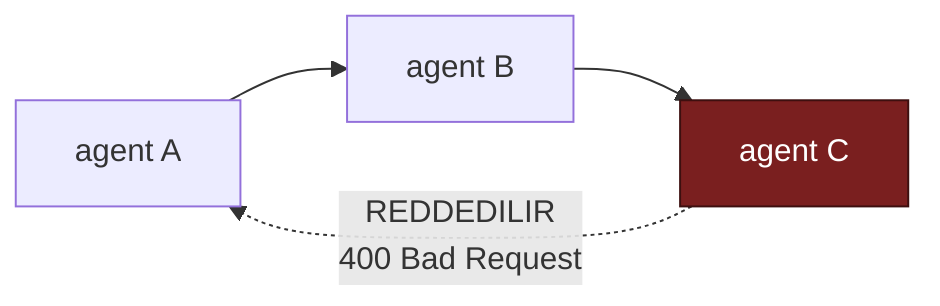
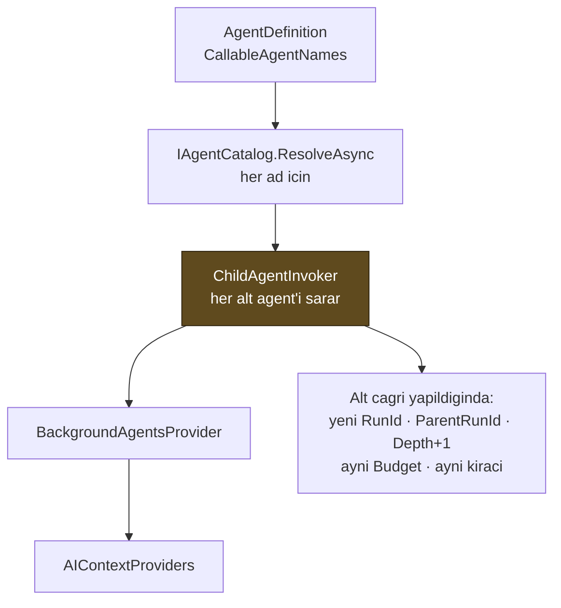

# Faz 12 — Agent'ın Agent'ı Çağırması

> **Durum:** 📋 Planlandı
> **Kaynak:** [BEYIN-FIRTINASI.md](BEYIN-FIRTINASI.md) · **F-10**
> **Önkoşul:** Yok (Faz 9 önerilir — çağrı grafiği değişikliği denetim izine yazılır)
> **Paketler:** `AgentPrism.Abstractions`, `.Core`, `.PostgreSql`, `.AspNetCore`, `.UI`
> **Yeni paket:** Yok · **Migration:** 0005 (planlanan sırada)

---

## Bu Faza Başlarken

1. [`MIMARI.md`](MIMARI.md) — bölüm 6 (çalıştırma yolu), bölüm 5 (`runs` tablosu)
2. [`KARARLAR.md`](KARARLAR.md) — **K-062** (`BackgroundAgents` bilerek kapalı bırakıldı), **K-044** (çalıştırma kimliğini çağıran üretir), **K-053** (harness kusuru), **K-067** (alt çalıştırma ayrı satırdır)
3. [`06-GOZLEMLENEBILIRLIK.md`](06-GOZLEMLENEBILIRLIK.md) — dekoratör sırası, span ağacı
4. Bu doküman

---

## Amaç

Bir agent, kataloğdaki başka bir agent'ı çağırabilsin. MAF'ta hazırdır ve Faz
6'da **bilerek kapalı bırakılmıştı** (K-062): kaynak sınırı, denetim izi ve
özyineleme koruması tasarlanmadan açılması doğru olmazdı. Bu faz o tasarımı
yapar.

---

## Doğrulanmış MAF API'si

```csharp
sealed class BackgroundAgentsProvider : AIContextProvider {
    BackgroundAgentsProvider(IEnumerable<AIAgent> agents, BackgroundAgentsProviderOptions? options);
    IReadOnlyList<BackgroundTaskInfo> GetIncompleteTasks(AgentSession session);
    IReadOnlyList<string> StateKeys { get; }
}

sealed class BackgroundAgentsProviderOptions {
    Func<IReadOnlyDictionary<string, AIAgent>, string>? AgentListBuilder { get; set; }
    string? Instructions { get; set; }
}

HarnessAgentOptions.BackgroundAgents               // IEnumerable<AIAgent>
HarnessAgentOptions.BackgroundAgentsProviderOptions
ChatClientAgentOptions.AIContextProviders          // duz agent bu yoldan alir

sealed class BackgroundTaskCompletionLoopEvaluator : LoopEvaluator;   // tamamlanmayi bekletmek icin
```

**Bulgu:** `BackgroundAgentsProvider` bir `AIContextProvider`'dır, dolayısıyla
harness zorunlu değildir. K-053'ün harness kusuru göz önüne alındığında
**öncelikli yol düz `ChatClientAgent` + `AIContextProviders`** olmalıdır.

---

## Cevaplanmış Tasarım Soruları

Beyin fırtınası belgesi beş soru sormuştu. Cevaplar:

| Soru | Cevap | Gerekçe |
|------|-------|---------|
| Özyineleme nasıl kesilir? | **İki katman**: tanım kaydedilirken statik döngü denetimi + çalışma anında derinlik sayacı | Statik denetim hatayı erken yakalar; derinlik sayacı dinamik yolları (aynı agent iki dalda) korur |
| Alt çalıştırma ayrı `runs` satırı mı? | **Evet** (K-067, kullanıcı: "olabilir") | Alt agent'ın maliyeti, süresi ve hatası ayrı görülmezse kök çalıştırma "3 dakika sürdü, sebebi bilinmiyor" olur |
| Kiracı? | **Aynı kiracı, istisnasız** | Kiracı sızıntısı buradan olur; alt agent kiracı geçişi yapamaz |
| Token bütçesi? | **Ağaç boyunca paylaşılan bütçe**, `AgentPrismRunOptions` ile taşınır | Alt çağrılar bütçesizse maliyet çarpan etkisiyle patlar |
| Onay kime sorulur? | **v1: alt agent onay isteyemez** (aşağıya bakın) | Onay bir sonraki turun girdisidir; ağacın ortasında turu askıya almak MAF modeline aykırıdır |

### Onay konusu — açıkça

Faz 6'da ölçüldü: onay gereken çağrıda çalıştırma **biter** ve karar bir sonraki
turun girdisidir (sapma S4). Bir alt agent ağacın ortasında onay isterse, tüm
ağacın durdurulup daha sonra tam olarak aynı noktadan sürdürülmesi gerekir.
MAF bunun için bir mekanizma sunmuyor.

**v1 davranışı:** alt agent yalnız (a) onay istemeyen veya (b) `tool_approval_rules`
ile otomatik onaylanmış tool'ları kullanabilir. Onay gerektiren bir çağrı
denenirse alt çalıştırma `Failed` olur, hata mesajı nedeni **açıkça** söyler ve
kök çalıştırma bunu bir tool sonucu olarak görür. Sessizce atlanmaz.

---

## 12.1 — Tanım ve Statik Döngü Denetimi

```csharp
public sealed record AgentDefinition
{
    // ...mevcut uyeler
    public IReadOnlyList<string> CallableAgentNames { get; init; } = [];
}
```

Kaydetme anında (`PUT /api/agents/{name}`) çağrı grafiği denetlenir:



- Kendi kendini çağırma (`A → A`) reddedilir
- Dolaylı döngü (`A → B → C → A`) reddedilir
- Bilinmeyen agent adı reddedilir
- Denetim: derinlik öncelikli arama; katalog kod + veritabanı kaynaklarının
  birleşimidir (`IAgentCatalog`)

> Statik denetim **yeterli değildir**: kod tarafındaki bir fabrika agent'ı
> (`AddAgent(name, factory)`) grafiği taşımaz. Bu yüzden çalışma anındaki
> derinlik sayacı da zorunludur.

---

## 12.2 — Çalışma Anı: Derinlik, Bütçe ve Kimlik

`AgentPrismRunOptions` genişler (K-044'ün öngördüğü genişleme):

```csharp
public sealed class AgentPrismRunOptions : AgentRunOptions
{
    public Guid? RunId { get; init; }
    public Guid? ParentRunId { get; init; }          // YENI
    public int Depth { get; init; }                  // YENI · kok = 0
    public AgentRunBudget? Budget { get; init; }     // YENI · agac boyunca PAYLASILIR
    public override AgentRunOptions Clone();         // UCUNU DE KORUR
}

public sealed class AgentRunBudget          // sinif, record DEGIL: paylasilan degisken durum
{
    public long? MaxTotalTokens { get; init; }
    public int? MaxTotalRuns { get; init; }
    public int MaxDepth { get; init; } = 3;
    public long ConsumedTokens { get; }              // Interlocked ile artar
    public int StartedRuns { get; }
    public bool TryReserveRun();                     // sinir asilirsa false
    public void RecordUsage(long tokens);
}
```

Kurallar:

- **`Clone()` üç alanı da korur.** K-044'te öğrenildi: ayarları kopyalayan bir
  ara katman kimliği düşürürse kayıtla akış arasındaki bağ kopar.
- **Bütçe nesnesi ağaç boyunca aynı örnektir.** Kopyalanırsa her dal kendi
  bütçesini alır ve sınır anlamını yitirir.
- **Derinlik aşılırsa** alt çağrı yapılmaz; çağıran tool sonucu olarak
  "derinlik sınırı aşıldı" alır.
- **Bütçe biterse** yeni alt çalıştırma başlatılmaz; devam eden kesilmez.

---

## 12.3 — Veri Modeli (Migration 0005)

```sql
ALTER TABLE {schema}.runs ADD COLUMN parent_run_id uuid;
ALTER TABLE {schema}.runs ADD COLUMN depth         smallint NOT NULL DEFAULT 0;
ALTER TABLE {schema}.runs ADD COLUMN root_run_id   uuid;

CREATE INDEX IF NOT EXISTS runs_parent_idx
    ON {schema}.runs (parent_run_id) WHERE parent_run_id IS NOT NULL;

CREATE INDEX IF NOT EXISTS runs_root_idx
    ON {schema}.runs (tenant_id, root_run_id, started_at) WHERE root_run_id IS NOT NULL;
```

`root_run_id` neden var: bir ağacın tamamını çekmek için `parent_run_id` üzerinden
özyinelemeli CTE gerekir. `root_run_id` ile tek indeksli sorgu yeter. Ek maliyet
bir `uuid` sütundur; kazanç, arayüzün ağaç görünümünde her açılışta özyinelemeli
sorgu çalıştırmamasıdır.

**Yabancı anahtar konmaz** — `parent_run_id` aynı tabloya işaret eder ve silme
sırası kısıtı üretir. Faz 25'in temizleme işi bundan zarar görmemelidir.

`RunRecord`, `RunStartInfo` ve `RunQuery` bu üç alanla genişler.
`RunQuery.OnlyRootRuns` (varsayılan **true**) eklenir: Runs ekranı varsayılan
olarak yalnız kök çalıştırmaları listeler, aksi hâlde liste alt çağrılarla
dolar.

---

## 12.4 — Derleyici ve Sarmalayıcı



`ChildAgentInvoker` bir `DelegatingAIAgent`'tır ve:

1. Bütçeden yer ayırır (`TryReserveRun`)
2. Derinliği denetler
3. Yeni `AgentPrismRunOptions` üretir
4. İç agent'ı çağırır — iç agent zaten `RunRecordingAgent` ile sarılıdır,
   dolayısıyla **alt `runs` satırı kendiliğinden oluşur**
5. Kullanımı bütçeye işler

> Dekoratör sırasına dokunulmaz. `ChildAgentInvoker` bir dekoratör değildir;
> çağrılan agent'ın **etrafına** derleme anında konur.

---

## 12.5 — Arayüz

- **Runs listesi**: varsayılan yalnız kök çalıştırmalar; satırda "3 alt
  çalıştırma" rozeti
- **Run detay**: alt çalıştırmalar ağaç olarak; her biri kendi detayına
  bağlantılı
- **Waterfall**: alt çalıştırmanın span'leri kök span'in altında iç içe görünür.
  Faz 6'nın `waterfall.tsx` bileşeni zaten hiyerarşi çiziyor; span'lerin doğru
  ebeveynle yazılması yeterlidir
- **İstatistik**: kök çalıştırmanın maliyeti **ağacın toplamıdır**; tekil satır
  kendi maliyetini gösterir. İkisi ayrı sütunda gösterilir, toplanmaz

> 🚨 Span ebeveynliği için Faz 6'nın dersi geçerlidir: `Activity.Current` bir
> `AsyncLocal`'dir ve async yardımcı metottan geri akmaz. Alt çalıştırmanın kök
> span'i, çağıran metodun **kendi gövdesinde** açılmalıdır.

---

## Testler

| Proje | Yeni test |
|-------|-----------|
| `AgentPrism.Core.UnitTests` | Statik döngü denetimi (kendi kendine, dolaylı, bilinmeyen ad); derinlik sınırı; bütçe paylaşımı (**tek örnek**); `Clone()` üç alanı korur; bütçe bitince yeni çağrı yok; alt çağrının kiracı değiştirememesi |
| `AgentPrism.PostgreSql.IntegrationTests` | `parent_run_id`/`root_run_id` yazımı; `OnlyRootRuns` filtresi; ağaç sorgusu |
| `AgentPrism.AspNetCore.FunctionalTests` | Döngülü tanım `400`; run detayında alt çalıştırma listesi; onay gerektiren tool ile alt çağrının **anlaşılır** hata vermesi |
| `AgentPrism.Ui.E2ETests` | Ağaç görünümü ve iç içe waterfall |

**Gerçek model kanıtı:** iki agent'lı bir senaryo (yönlendirici → araştırmacı)
çalıştırılır; iki `runs` satırı, doğru `parent_run_id` ve iç içe span ağacı
çıktısı dokümana yazılır.

---

## Bu Fazda Verilecek Kararlar

1. **Alt çalıştırma ayrı `runs` satırıdır** (K-067'nin uygulaması) — maliyet ve
   süre görünürlüğü.
2. **`root_run_id` denormalize edilir** — özyinelemeli sorgudan kaçınmak için.
3. **Bütçe ağaç boyunca tek nesnedir.**
4. **Alt agent onay isteyemez (v1)** — MAF'ın tur modeli buna izin vermiyor.
5. **Öncelikli yol `AIContextProviders`**, harness değil — K-053.

---

## Açık Sorular

1. **Varsayılan `MaxDepth` kaç olsun?** 3 çoğu senaryoya yeter; 2 daha
   güvenlidir. Öneri: **3**.
2. **Varsayılan token bütçesi olsun mu?** Olmazsa ilk yanlış tanım pahalıya mal
   olur. Öneri: **kök çalıştırma başına 200.000 token**, ayarlanabilir.
3. **Alt çalıştırmalar SSE akışında görünsün mü?** Görünürse Playground zengin
   olur ama olay hacmi artar. Öneri: **özet olay** (`ChildRunStarted`,
   `ChildRunCompleted`), tam akış değil.
4. **`RunQuery.OnlyRootRuns` varsayılanı `true` olsun mu?** Mevcut istemciler
   için davranış değişikliğidir. Öneri: **true**, `/api/runs?includeChildren=true`
   ile eski davranış.

---

## Bitiş Ölçütleri (DoD)

- [ ] Bir agent başka bir agent'ı çağırıyor; iki ayrı `runs` satırı oluşuyor
- [ ] Waterfall'da alt çalıştırma iç içe görünüyor
- [ ] Döngülü tanım kaydedilemiyor; derinlik sınırı çalışma anında da tutuyor
- [ ] Bütçe aşımında yeni alt çağrı başlamıyor, hata anlaşılır
- [ ] Alt agent kiracı değiştiremiyor (test)
- [ ] Runs ekranı varsayılan olarak yalnız kök çalıştırmaları gösteriyor
- [ ] Dört doğrulama kapısı sıfır uyarı

---

## Riskler

| Risk | Önlem |
|------|-------|
| Maliyet çarpan etkisi | Paylaşılan bütçe + derinlik sınırı + varsayılan token sınırı |
| `run_events` hacmi katlanır | Alt çalıştırmalar kendi satırlarına yazar; Faz 25 saklama politikası bunu ele alır |
| Span ağacı düzleşir | Faz 6 dersi: span çağıran metodun gövdesinde açılır; regresyon testi yazılır |
| Onay akışı beklenmedik yerde biter | v1'de alt agent onay istemez; davranış belgelenir ve test edilir |
| Kod tarafı fabrika agent'ları statik denetimden kaçar | Çalışma anı derinlik sayacı ikinci savunma hattıdır |

---

## Sonraki Faza Devir Notu

- Faz 15 (workflows) benzer bir çok-agent modeli getirir ama **farklı bir
  yürütme motorudur**. İkisi karıştırılmamalıdır: burada agent bir tool gibi
  çağrılır; orada bir graf yürütülür.
- Faz 20 (maliyet) `root_run_id` üzerinden ağaç maliyetini raporlayacaktır.
- Faz 21 (kota) `AgentRunBudget` ile aynı sayaçları kullanabilir; kiracı kotası
  ile çalıştırma bütçesi **ayrı** kavramlardır, birleştirilmemelidir.
