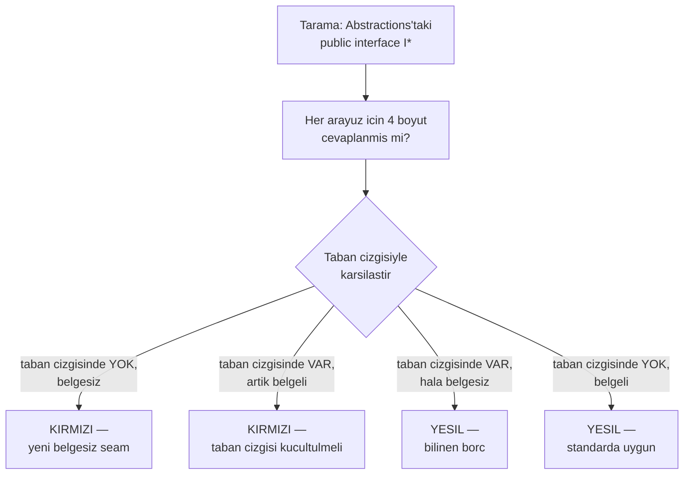

# Faz 121 — Seam Sözleşme Dokümanı ve Küçülen Taban Çizgisi

> **Durum:** 📋 Planlandı (2026-08-27)
> **Kaynak:** [YAYIN-HAZIRLIK.md](YAYIN-HAZIRLIK.md) §13 kulvar 3 — BL-024 · BL-026 · BL-028 · BL-029 · BL-035 · BL-038 · BL-042 · BL-043 · BL-046 · BL-048 · BL-050
> **Önkoşul:** Yok. [Faz 120](arsiv/fazlar/120-JOB-SOZLESMESI-AT-LEAST-ONCE.md) aynı işin tek arayüzde yapılmış hâlidir; deseni oradan al
> **Paketler:** `AgentPrism.Abstractions` (birincil), `AgentPrism.Workflows`, `AgentPrism.Core` (yalnız yorum/karşılaştırma)
> **Yeni paket:** Yok · **Migration:** Yok
> **Public API:** Büyümüyor — bu faz yalnız XML dokümanı yazar. `PublicAPI.Unshipped.txt` dosyaları **değişmemelidir**; değişirse imza kaymıştır ve bu bir hatadır
> **Tüketici yüzeyi:** `docs-site/src/content/docs/api/*` **üretilir** (DocFX, XML'den) — bu fazın çıktısı doğrudan oraya basılır. El yazısı sayfa: `docs-site/src/content/docs/extend/` altındaki seam rehberleri gözden geçirilir · sevk edilen: `AgentPrism.Abstractions` paket XML dokümanı
> **Manuel test alanı:** Yok — bu faz çalışma anı davranışı değiştirmez. Kapı testtir, manuel case üretmez

---

## Bu Faza Başlarken

> `faz-baslangic` skill'ini uygula. Aşağıdaki liste o skill'in 2. adımıdır —
> **tamamını değil, yalnız işaret edilen bölümleri oku.**

1. Bu doküman
2. Kararlar — dosyanın tamamını **okuma**, yalnız bu kalemleri grep'le:
   ```bash
   grep -n "K-642\|K-641\|K-640\|K-059\|K-228" docs/KARARLAR.md
   ```
   **K-642** (sıralama sözleşmesinin yönü sözcükle yazılır; metin kapısı deseni ve
   test tiyatrosu tuzağı), **K-641** (`IJobHandler` at-least-once sözleşmesi — bu
   fazın **referans örneği**), **K-640** (`SafeErrorText`; mimari cırcır kapısı
   deseni), **K-059** (`secret` veritabanına da yazılmaz), **K-228** (dil sınırı)
3. [`arsiv/fazlar/120-JOB-SOZLESMESI-AT-LEAST-ONCE.md`](arsiv/fazlar/120-JOB-SOZLESMESI-AT-LEAST-ONCE.md)
   — yalnız devir notu:
   ```bash
   awk '/## Sonraki Faza Devir Notu/,0' docs/arsiv/fazlar/120-JOB-SOZLESMESI-AT-LEAST-ONCE.md
   ```
   Faz 120 tek bir arayüzde (`IJobHandler`) tam olarak bu işi yaptı: sözleşmeyi
   XML'e yazdı, contract ile kilitledi, davranışı ayrı bir testle ölçtü. Bu faz
   o deseni 76 arayüze yayar.
4. Alan hafızası (bu faz iki alana dokunuyor):
   [`hafiza/dokumantasyon.md`](hafiza/dokumantasyon.md) — **sondaki "Sayısal
   sıralama knob'unun YÖNÜ" notu zorunludur**; metin kapısının test tiyatrosuna
   dönüşme tuzağını anlatır ·
   [`hafiza/cekirdek-calistirma.md`](hafiza/cekirdek-calistirma.md) (yalnız
   `IRunStore`/`RunRecording` sözleşmesine dokunurken)
5. Gerektiğinde, tamamı değil ilgili bölümü:
   [`MIMARI-GUVENLIK.md`](MIMARI-GUVENLIK.md) — kiracı modu ve denetim izi bölümü
   (tenant-mode boyutu oradan türetilir)

---

## Amaç

AgentPrism'in extension seam'lerinin **tek bir sözleşme standardı yoktur.**
Üçüncü taraf bir implementasyon yazan geliştirici, arayüzün DI lifetime'ını,
kiracı modunu, teslim garantisini ve iptal semantiğini bugün **kaynağı okuyarak**
öğrenmek zorundadır — paketlenmiş tüketicinin ise kaynağı yoktur.

Bu faz standardı tanımlar, bugünkü durumu bir **taban çizgisine** yazar ve
yüksek riskli alt kümeyi doldurur. Taban çizgisi **yalnız küçülür**
(`SourceLanguageTests` deseni): yeni bir belgesiz arayüz eklemek derlemeyi
kırar, mevcut bir arayüzü belgelemek taban çizgisini küçültür.

Kısmi standardın kendisi bu kusuru üretmiştir ve bu ölçülmüştür: `IRunStore`
kiracı modu tablosunu taşıyordu, kardeşleri taşımıyordu; `IRunJudge` lifetime'ı
belgeliyordu, kümesindeki diğer on arayüz belgelemiyordu. Bir seam'den öğrenilen
kural diğerine taşınamıyor.

### Bugün ne çalışmıyor — doğrulanmış kanıt

| Kanıt | Gözlem |
|---|---|
| `grep -c "^public interface I" src/AgentPrism.Abstractions` | **76 public extension arayüzü**, 69 dosyada |
| Aynı küme, `singleton\|thread-safe` taraması | Yalnız **12** dosya DI lifetime veya thread-safety belgeliyor |
| Aynı küme, `AMBIENT\|EXPECTED` taraması | Yalnız **5** dosya kiracı modu tablosu taşıyor |
| [`Abstractions/Runs/IRunCancellationRegistry.cs`](../src/AgentPrism.Abstractions/Runs/IRunCancellationRegistry.cs) | `cooperative` / `best-effort` geçmiyor (0 eşleşme). `TryCancel` yalnız `CancellationTokenSource.Cancel()` çağırır; tüketici işin gerçekten durduğunu varsayabilir |
| [`Abstractions/Coordination/ISingletonLeaseStore.cs`](../src/AgentPrism.Abstractions/Coordination/ISingletonLeaseStore.cs) | `split-brain` / `exclusive` / `eventually` geçmiyor (0 eşleşme) |
| `IWebhookStore` · `IWebhookPublisher` | İkisinde de `at-least-once` geçmiyor (0 eşleşme); garanti yalnız `WebhookDeliveryJobHandler.cs:299`'da görülüyor |
| [`Workflows/AgentPrismWorkflowFunctionExtensions.cs:74-76`](../src/AgentPrism.Workflows/AgentPrismWorkflowFunctionExtensions.cs) | Tekrar çalıştırma uyarısı ("must therefore tolerate being called more than once") **kayıt uzantısında** duruyor; `IWorkflowRunner`/`IWorkflowCheckpointStore` sözleşme yüzeyinde yok |
| [`Abstractions/Audit/AuditQuery.cs:6`](../src/AgentPrism.Abstractions/Audit/AuditQuery.cs) | `TenantId == null` → "çağıranın kiracısı" semantiği yalnız **DTO yorumunda**; `IAuditLog` arayüzü bunu sözleşme olarak dayatmıyor |
| [`Abstractions/Audit/IAuditActorResolver.cs`](../src/AgentPrism.Abstractions/Audit/IAuditActorResolver.cs) | 8 satır XML dokümanı var, `asynclocal`/`ambient`/`singleton` **hiç** geçmiyor |
| `IAgentDefinitionStore` vs `IAgentSkillStore` · `ISkillScriptGrantStore` | Birincide açık `tenantId` parametresi **0**, diğer ikisinde **3'er** — aynı kümede iki farklı kiracı şekli, gerekçesi yazılı değil |
| `Abstractions/Mcp/` — 6 arayüz | Hiçbiri DI lifetime belirtmiyor. `IMcpOAuthCoordinator`'daki tek `lifetime` eşleşmesi `bounded by the process lifetime` ifadesidir, DI lifetime değil |

> Kanıtlar 2026-08-27 tarihinde doğrulandı.
>
> 🚨 **İki yol kayması düzeltildi.** Blocker kayıtları `IMcpServerStore`'u ayrı
> bir dosyada, `InMemoryAuditLog`'u `Core/Audit/` altında gösteriyordu. Gerçek
> yerleri: `IMcpServerStore` → `Abstractions/Mcp/McpServerDefinition.cs` içinde;
> `InMemoryAuditLog` → `Core/Storage/InMemoryAuditLog.cs`. Kayıttaki yolu
> doğrulamadan kullanma.

---

## 121.1 — Sözleşme standardı: dört boyut

Her public extension arayüzü dört soruyu cevaplar. Cevap **arayüzün kendi XML
dokümanındadır** — kayıt uzantısında, implementasyonda veya site sayfasında
değil. Paketlenmiş tüketicinin gördüğü tek yer orasıdır.

| # | Boyut | Cevap kümesi | Neden sözleşme |
|---|---|---|---|
| 1 | **DI lifetime** | `singleton` · `scoped` · `transient` | Yanlış varsayım paylaşılan duruma yol açar; `singleton` bir implementasyona thread-safety yükümlülüğü **bindirir** |
| 2 | **Kiracı modu** | `EXPECTED` (açık `tenantId` parametresi) · `AMBIENT` (`ITenantContext`'ten) · `TENANT-INDEPENDENT` | Yanlış varsayım kiracı sızıntısıdır — güvenlik sınırı |
| 3 | **Teslim garantisi** | `at-least-once` · `exactly-once` · `best-effort` · `yok` | Yanlış varsayım side effect'i iki kez çalıştırır |
| 4 | **Garanti seviyesi sınırı** | Neyin garanti **edilmediği**: cooperative-only iptal, strictly-exclusive olmayan lease, yedek mekanizmaya dayanan drain | Sözleşmenin en pahalı yarısı; doküman runtime'dan **güçlü** garanti verirse tüketici yanılır |

Boyut bir arayüz için anlamsızsa (örn. teslim garantisi taşımayan salt-okunur
bir reader) cevap **`yok`** yazılır ve taban çizgisinde öyle işaretlenir.
Sessizce atlamak ile "bu boyut geçerli değil" demek ayrı şeylerdir; ikincisi
bir cevaptır, birincisi bir boşluktur.

### Referans örnek

`IRunStore` (kiracı modu tablosu) ve `IJobHandler` (teslim garantisi, K-641) bu
standardın bugün doğru yazılmış iki örneğidir. Yeni metin bunları **kopyalar**,
yeniden icat etmez.

---

## 121.2 — Kapı: küçülen taban çizgisi



Taban çizgisi iki yönde de kilitlidir. Bir arayüz belgelendiğinde taban
çizgisinden **düşmek zorundadır** — yoksa dosya bayatlar ve borç görünmez olur.
Bu, `RawExceptionTextSiteTests`'in yürüttüğü sözleşmenin aynısıdır.

### 🚨 Metin kapısı yazarken tek tuzak

K-642'de ölçüldü: aranan ifade **parçalara bölünürse kapı yalan söyler.**
`"lower"` ve `"value wins"` ayrı ayrı arandığında, kasıtlı bir bozma aynı
özetin ilerisindeki ikinci bir `"lower"` sayesinde YEŞİL geçti. Kural: **bağlı
tek ifade ara**, ve kapıyı yazdıktan sonra **her vakayı ayrı ayrı boz**, üçünün
de kırmızı verdiğini ölç. Yeşil bir kapı, koşan bir kapı değildir.

---

## 121.3 — Bu fazda doldurulacak alt küme

Taban çizgisi 76 arayüzün tamamını kaydeder. Bu faz, blocker kayıtlarının
adını verdiği **yüksek riskli** alt kümeyi doldurur ve taban çizgisinden düşürür:

| Kayıt | Arayüz(ler) | Doldurulacak boyut |
|---|---|---|
| BL-024 | `Abstractions/Mcp/` altındaki 6 arayüz (`IMcpServerStore` dahil, `McpServerDefinition.cs` içinde) | 1 |
| BL-029 | `IRunScoreStore`, `IRunInputStore`, `ITraceStore` + Küme A'nın kalan 6 arayüzü | 2 |
| BL-035 | `IAgentDefinitionStore`, `IAgentSkillStore`, `ISkillScriptGrantStore` | 2 (+ şekil farkının **gerekçesi**) |
| BL-046 | `IAuditLog` | 2 — `null` tenant **sözleşme** hâline gelir |
| BL-048 | `IAuditActorResolver` + 4 voice arayüzü | 1, 2 |
| BL-050 | Küme I'nın 11 arayüzü | 1 (+ `Stream` sahipliği) |
| BL-038 | `IWorkflowRunner`, `IWorkflowCheckpointStore` | 3 |
| BL-043 | `IWebhookStore`, `IWebhookPublisher` | 3 |
| BL-028 | `IRunCancellationRegistry` | 4 — cooperative-only |
| BL-042 | `ISingletonLeaseStore` | 4 — strictly-exclusive **değil** |
| BL-026 | `IAgentPrismDrainState` | 4 — drain'in iki yedek mekanizmaya dayandığı |

Kalan arayüzler taban çizgisinde **bilinen borç** olarak kalır ve dokunuldukları
fazda dolar.

---

## Planlanan Public API

**Public API yüzeyi büyümez.** Bu faz yalnız XML dokümanı yazar ve bir test
sınıfı ekler. Kapanışta şu doğrulanır:

```bash
git diff --stat -- 'src/*/PublicAPI.Unshipped.txt'   # BOŞ olmalı
```

Bir satır bile değiştiyse imza kaymıştır — bu faz imza değiştirmez.

### HTTP `endpoint`'leri

Yok.

### Arayüz payı

Yok — arayüze dokunulmaz.

---

## Planlanan Dosya Listesi

```
tests/AgentPrism.Core.UnitTests/Architecture/
├── SeamContractDocumentationTests.cs        (yeni — tarama + taban çizgisi)
└── seam-contract-baseline.txt               (yeni — üretilen, gözden geçirilen)

src/AgentPrism.Abstractions/
├── Mcp/                    (6 arayüz — boyut 1)
├── Runs/                   (Küme A — boyut 2, 4)
├── Agents/                 (BL-035 — boyut 2)
├── Audit/                  (BL-046, BL-048 — boyut 1, 2)
├── Coordination/           (BL-042 — boyut 4)
├── Webhooks/               (BL-043 — boyut 3)
├── Workflows/              (BL-038 — boyut 3)
└── Voice/                  (BL-048 — boyut 1, 2)
```

Yalnız XML doküman blokları değişir; hiçbir imza satırına dokunulmaz.

---

## Hata Modları ve Testler

| Ne bozulabilir | Seviye | Test sınıfı |
|---|---|---|
| Kapı yeşil görünür ama hiçbir şey ölçmez (parçalı ifade — K-642 tuzağı) | Birim + **kasıtlı bozma koşumu** | `SeamContractDocumentationTests` — her boyutta ayrı ayrı bozulup kırmızı verdiği ölçülür |
| Taban çizgisi bayatlar: arayüz belgelendi, dosya küçülmedi | Birim | Aynı sınıf — **kayıp giriş de kırmızı verir** |
| Yeni bir belgesiz seam eklenir ve fark edilmez | Birim | Aynı sınıf — taban çizgisinde olmayan belgesiz arayüz kırmızı |
| Doküman runtime'dan **güçlü** garanti verir (en tehlikelisi) | Fonksiyonel | `IRunCancellationRegistry` için: iptal edilen bir `run`'ın gerçekten cooperative kaldığını, gövde token'ı yok sayarsa **durmadığını** ölçen test |
| `IAuditLog` `null` tenant sözleşmesi yazılır ama hiçbir implementasyon uygulamaz | Sözleşme | `AuditLogContract` — `null` tenant çağıranın kiracısına düşer; dört koşumda birden |
| XML değişirken imza kayar | Birim | `PublicAPI.Unshipped.txt` diff'i boş olmalı (DoD komutu) |
| Üretilen `docs-site/api/*` bayat kalır | Kapı | `docs-site` derlemesi; `--skip-docfx` **kullanılmaz** (bayat önbellek okur) |

Beş soru: **iptal** → BL-028 boyut 4 fonksiyonel testiyle; **eşzamanlılık** →
bu faz çalışma anı yolu eklemez, uygulanmaz; **boş/aşırı girdi** → taban
çizgisi dosyası yoksa kapı açık talimatla kırmızı verir; **başka kiracı** →
`AuditLogContract` `null` tenant vakası; **alt sistem hatası** → uygulanmaz.

---

## Manuel Kabul Case'leri

Yok. Bu faz çalışma anı davranışı değiştirmez; iddiası testlerle ve üretilen
API sayfalarıyla doğrulanır. `faz-tamamlama` Adım 3'te bu gerekçe yazılır.

---

## Açık Sorular

| # | Soru | Seçenekler | Öneri |
|---|---|---|---|
| 1 | Taban çizgisi arayüz başına tek satır mı, boyut başına satır mı tutsun? | A: `<arayüz>` tek satır, eksik boyutlar yanında listelenir · B: `<arayüz>:<boyut>` her eksik boyut ayrı satır | **B.** Bir arayüz iki boyutu doldurup ikisini bırakırsa A'da taban çizgisi hiç küçülmez ve ilerleme görünmez |
| 2 | `IAuditLog`'un `null` tenant'ı sözleşme olunca, `AuditLogContract` bu fazda mı yazılsın yoksa kulvar 1'e mi bıraksın? | A: bu fazda · B: kulvar 1 | **A.** Sözleşmeyi yazıp uygulamasını ölçmemek tam olarak bu fazın kapatmak istediği kusur — doküman runtime'dan güçlü garanti verir |
| 3 | `Abstractions` dışındaki paketlerin public arayüzleri (`AgentPrism.Workflows`, `.Mcp`) taramaya girsin mi? | A: yalnız `Abstractions` · B: tüm packable paketler | **B**, ama taban çizgisi ilk koşumda büyür. `Abstractions` sözleşme yüzeyinin çoğunu taşır; kalanı borç olarak görünür kalsın |
| 4 | BL-026'nın drain notu `IAgentPrismDrainState`'e mi yoksa `AgentPrismDrainOptions`'a mı yazılsın? | A: arayüze · B: options'a · C: ikisine | **C.** Garanti seviyesi arayüzün sözleşmesidir; `Enabled` varsayılanının `false` olduğu options'ın |

---

## Bitiş Ölçütleri (DoD)

- [ ] `SeamContractDocumentationTests` var; taban çizgisi üretildi ve **gözden geçirildi** (üretip bakmadan kabul etmek borç değil, kör nokta üretir)
- [ ] Kapının her boyutta kasıtlı bozmayla kırmızı verdiği **ölçüldü ve çıktısı belgeye yazıldı** (K-642 tuzağı)
- [ ] Taban çizgisi ters yönde de kilitli: belgelenen bir arayüz düşmezse test kırmızı verir — bu da bozma koşumuyla ölçüldü
- [ ] 121.3 tablosundaki her kayıt için ilgili boyut dolduruldu ve arayüz taban çizgisinden düştü
- [ ] `git diff --stat -- 'src/*/PublicAPI.Unshipped.txt'` **boş** — imza değişmedi
- [ ] `IRunCancellationRegistry`'nin cooperative-only sınırı fonksiyonel testle ölçüldü — doküman runtime'dan güçlü garanti vermiyor
- [ ] `AuditLogContract` `null` tenant vakasını dört koşumda birden ölçüyor
- [ ] Dört doğrulama kapısı sıfır uyarı verir
- [ ] `samples/AgentPrism.Api` ile gerçek `run` yapıldı, çıktı belgeye yazıldı
- [ ] `secret` taraması boş döndü
- [ ] Manuel kabul case'i **üretilmedi**; gerekçesi `faz-tamamlama` Adım 3'e yazıldı
- [ ] `faz-denetim` koşuldu; 🔴 bulgu kalmadı
- [ ] `docs-site/` yeniden derlendi (**`--skip-docfx` KULLANILMADAN**); üretilen `api/` sayfaları yeni XML metnini taşıyor; `check-links.mjs` temiz
- [ ] `YAYIN-HAZIRLIK.md`'de kapanan blocker kayıtları güncellendi

### Doğrulama komutları

```bash
# Kapinin gercekten olctugu: taban cizgisi disindan bir arayuzu boz, kirmizi bekle
./artifacts/bin/AgentPrism.Core.UnitTests/release/AgentPrism.Core.UnitTests \
  --filter-class "*SeamContractDocumentationTests*"

# Imza kaymadi mi
git diff --stat -- 'src/*/PublicAPI.Unshipped.txt'

# Uretilen API sayfasi yeni metni tasiyor mu (ornek)
grep -n "singleton" docs-site/src/content/docs/api/AgentPrism.IMcpPromptClient.md
```

---

## Riskler

| Risk | Önlem |
|------|-------|
| **Kapı test tiyatrosuna dönüşür** — K-642'de bu bir kez ölçüldü ve ilk sürüm yeşil yalan söyledi | DoD'de kasıtlı bozma koşumu **zorunlu**; bağlı tek ifade aranır, parçalı değil |
| 76 arayüzlük taban çizgisi gözden geçirilmeden kabul edilir | DoD ayrı bir madde olarak gözden geçirmeyi ister; taban çizgisi bir borç kaydıdır, bir onay değil |
| Doküman runtime'dan güçlü garanti verir (yanlış dokümanın en pahalı biçimi) | Boyut 4 (garanti **sınırı**) standardın parçası; `IRunCancellationRegistry` için fonksiyonel test DoD'de |
| XML yazarken imza kayar | DoD'de `PublicAPI.Unshipped.txt` diff kontrolü |
| Üretilen `api/` sayfaları bayat önbellekten gelir | `--skip-docfx` yasağı DoD'de yazılı (`hafiza/dokumantasyon.md`) |
| Faz büyür ve 46 borç arayüzü de doldurulmaya başlanır | Kapsam 121.3 tablosuyla sınırlı; tablo dışı arayüz **taban çizgisinde kalır** |

---

<!-- ============================================================
     AŞAĞISI KAPANIŞTA DOLDURULUR — `faz-tamamlama` skill'i.
     Plan anında boş kalır. Başlıkları SİLME.
     ============================================================ -->

## Plandan Sapmalar

> Kapanışta doldurulur. Plan ile gerçek arasındaki fark **gizlenmez** — sonraki
> oturumun en değerli bilgisidir.

## Bu Fazda Verilen Kararlar

> Kapanışta doldurulur. K-NNN numaraları burada alınır; plan numara rezerve etmez.

## Gerçekleşen Public API

> Kapanışta doldurulur. Koddaki **gerçek** imzalar.

## Dosya Listesi (gerçekleşen)

> Kapanışta doldurulur.

## Denetim Bulguları

> Kapanışta doldurulur — `faz-denetim` çıktısı. Her satır: bulgu · seviye
> (🔴/🟡/🟢) · sonuç (düzeltildi / gerekçelendi / F-NN olarak devredildi).
> Bulgu yoksa "🔴 ve 🟡 yok" yazılır; boş bırakılmaz.

## Sonraki Faza Devir Notu

> Kapanışta doldurulur: devralınan sözleşmeler, bilinen tuzaklar (🚨), yarım
> kalan işler, sıradaki faz.
