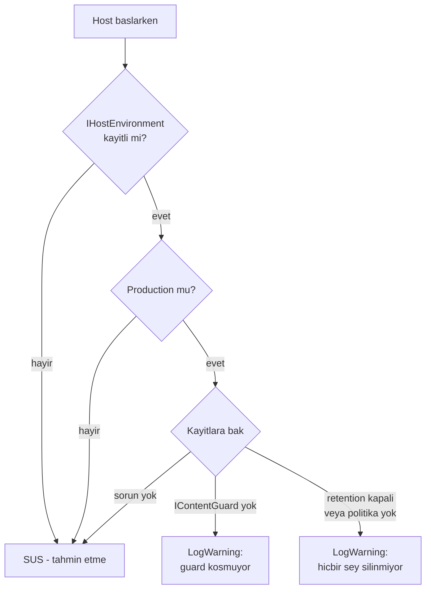

# Faz 122 — Kayıt API'si ve Sessiz Boşluklar

> **Durum:** ✅ Tamamlandı (2026-08-28)
> **Kaynak:** [YAYIN-HAZIRLIK.md](YAYIN-HAZIRLIK.md) §13 — **kulvar 2** (BL-008 · BL-019 · BL-034 · BL-050 · 🟢 BL-016) + **kulvar 6** (BL-018 · BL-033 · BL-039 · BL-051)
> **Önkoşul:** [Faz 121](arsiv/fazlar/121-SEAM-SOZLESME-DOKUMANI.md) — seam sözleşme standardını ve metin kapısı desenini kurdu; bu faz aynı kapıyı bir boyut daha ile genişletir
> **Paketler:** `AgentPrism.Core` (birincil), `AgentPrism.Workflows`, `AgentPrism.Abstractions` (yalnız XML)
> **Yeni paket:** Yok · **Migration:** Yok
> **Public API:** **Büyüdü** — 5 yeni kayıt overload'ı (`AddAgentDecorator` üçlüsü, `AddContentGuard` instance/factory, `AddModelProvider<T>()`). Ölçüldü: `PublicAPI.Shipped.txt` **0 satır** (17 dosya), yani bugün eklemek ucuz, GA'dan sonra kırıcı
> **Tüketici yüzeyi:** `docs-site/src/content/docs/guides/write-your-own-agent-decorator.md` (yeni — plan `extend/` diyordu, gerçek konvansiyon `guides/write-your-own-*` idi, bkz. Plandan Sapmalar) · `api/*` **üretildi** · sevk edilen: `IAgentPrismBuilder`'ın XML `<example>`'ı **düzeltildi**
> **Manuel test alanı:** [`docs/manuel-test/`](manuel-test/00-INDEKS.md) — başlangıç uyarısı case'leri (MT-DIAG-055..057) gerçek `samples/AgentPrism.Api`'ye karşı koşuldu

---

## Bu Faza Başlarken

> `faz-baslangic` skill'ini uygula. Aşağıdaki liste o skill'in 2. adımıdır —
> **tamamını değil, yalnız işaret edilen bölümleri oku.**

1. Bu doküman
2. Kararlar — dosyanın tamamını **okuma**, yalnız bu kalemleri grep'le:
   ```bash
   grep -n "K-642\|K-643\|K-644\|K-320\|K-218" docs/KARARLAR.md
   ```
   **K-642** (yön sözcükle yazılır; metin kapısının test tiyatrosuna dönüşme
   tuzağı), **K-643** (Faz 121'in iki mekanizmalı kapısı — bu faz onu genişletir),
   **K-320** (planın YAPISAL iddiasını kabul etme, grep'le ölç),
   **K-218** (tool'un gördüğü servis sağlayıcı boştur — kayıt zamanı bağımlılık)
3. [`arsiv/fazlar/121-SEAM-SOZLESME-DOKUMANI.md`](arsiv/fazlar/121-SEAM-SOZLESME-DOKUMANI.md)
   — yalnız devir notu:
   ```bash
   awk '/## Sonraki Faza Devir Notu/,0' docs/arsiv/fazlar/121-SEAM-SOZLESME-DOKUMANI.md
   ```
   `seam-contract-baseline.txt` 174 satır bilinen borç taşıyor; bu faz o dosyaya
   **dokunmaz** ama aynı kapı sınıfını kullanır.
4. Alan hafızası (bu faz üç alana dokunuyor):
   [`hafiza/aspnetcore-di.md`](hafiza/aspnetcore-di.md) (kayıt sırası ve
   `TryAdd` semantiği) · [`hafiza/dokumantasyon.md`](hafiza/dokumantasyon.md)
   (**metin kapısı tuzağı zorunlu**) ·
   [`hafiza/cekirdek-calistirma.md`](hafiza/cekirdek-calistirma.md)
   (yalnız `CompositeAgentCatalog`/decorator yoluna dokunurken)
5. Gerektiğinde, tamamı değil ilgili bölümü:
   [`MAF-GENISLEME-NOKTALARI.md`](MAF-GENISLEME-NOKTALARI.md) — decorator seam'i

---

## Amaç

Bu faz iki soruyu birlikte cevaplar, çünkü ikisi de **kayıt anına** bakar:

1. Üçüncü taraf bir tüketici, AgentPrism'in bir servisini nasıl **değiştirir**?
   Bugün bu desteklenen yol vardır ve çalışır, ama keşfedilemez — ve dokümanın
   kendi örneği kuralıyla çelişir.
2. Bir tüketici bir genişleme noktasını **kaydetmediğinde** ne olur? Bugün
   birkaç yerde sessizce hiçbir şey olmaz: guard koşmaz, retention silmez,
   decorator hatası sınıflandırılmaz.

İkisinin ortak yanı **sessizliktir**: yanlış veya eksik kayıt derlenir, testten
geçer ve yalnız üretimde fark edilir.

### Bugün ne çalışmıyor — doğrulanmış kanıt

| Kanıt | Gözlem |
|---|---|
| `Abstractions` public arayüzleri × dedicated `Add*`/`Use*` adı taraması | **8 / 76** arayüzün kayıt API'si var (`IAgentSource`, `IContentGuard`, `IContentProtector`, `IJobHandler`, `IMcpServerStore`, `IModelProvider`, `IRunJudge`, `ITenantContext`) |
| `TryAddEnumerable` taraması | Tüketiciye dönük **çoklu** seam yalnız 5: `IJobHandler`, `IContentGuard`, `IAgentSource`, `IAgentDecorator`, `IRunJudge`. Dördünde kayıt API'si var, **`IAgentDecorator`'da yok** |
| `grep -E "^\s*services\.Add(Singleton\|Scoped\|Transient)<\s*I[A-Z]"` (TryAdd hariç) | **0 eşleşme** — AgentPrism'in her servisi `TryAdd*` ile kayıtlı, yani "önce kaydet kazanır" sözleşmesi 60 tekil seam'in **hepsinde** tutuyor |
| Çalışma anı probu (`IAuditActorResolver`, 2026-08-28) | `AddAgentPrism()` **sonra** `AddSingleton` → `GetService` tüketiciyi verir ama `GetServices` **2 kayıt** döner. `AddSingleton` **önce** → 1 kayıt. Çoklu seam'lerde bu fark davranıştır, tekil seam'lerde artıktır |
| [`IAgentPrismBuilder.cs:19-28`](../src/AgentPrism.Core/IAgentPrismBuilder.cs) | 🚨 Cümle *"a registration made **before** `AddAgentPrism()` wins"* diyor; hemen altındaki `<example>` **sonra** kaydediyor. Doküman kendi kuralıyla çelişiyor — K-642'nin sınıfı, en çok okunan extension yüzeyinde |
| `grep -rn "services.Replace\|ServiceDescriptor" docs-site/src/content/docs` | **0 eşleşme** — override deseni sevk edilen dokümanda hiç anlatılmıyor |
| [`WorkflowCatalog.cs:43-45`](../src/AgentPrism.Workflows/Internal/WorkflowCatalog.cs) | `codeWorkflows.ToDictionary(r => r.Name, StringComparer.Ordinal)` — aynı adlı iki kod-tanımlı workflow ham `System.ArgumentException` fırlatır. Kardeşi [`WorkflowFunctionRegistry.cs:48`](../src/AgentPrism.Workflows/Internal/WorkflowFunctionRegistry.cs) aynı durumda temiz `AgentPrismException` fırlatıyor |
| [`CompositeAgentCatalog.cs`](../src/AgentPrism.Core/Catalog/CompositeAgentCatalog.cs) — `decorator.Decorate(...)` | `try/catch` yok; iki satır üstteki `source` çağrısı `HandleSourceFailure` ile sarılı. **Ölçüldü (2026-08-27): HTTP sızıntısı YOK** — AgentPrism global handler kaydetmiyor (`grep` yalnız `JsonBindingProblemMiddleware.cs:16` yorumunu buluyor), Production'da ASP.NET Core varsayılanı gövdesiz `500` döner. Kalan kusur **tutarlılık**: üçüncü taraf decorator hatası sınıflandırılmış hata yerine çıplak `500` verir |
| [`...Registration.Operations.cs:96-99`](../src/AgentPrism.Core/AgentPrismServiceCollectionExtensions.Registration.Operations.cs) | Kod yorumu fail-open'ı açıkça yazıyor ("when no `IContentGuard` is registered they are never read at all"). Başlangıç uyarısı **yok** |
| `src/AgentPrism.Core/Retention/` | Başlangıç uyarısı servisi **yok** (yalnız `RetentionExecutor`'da çalışma anı `LogWarning`). "Politika yok = sonsuza kadar sakla" kasıtlı varsayılan, ama sessiz |
| [`NonPersistentStorageWarningService.cs`](../src/AgentPrism.Core/Storage/NonPersistentStorageWarningService.cs) | **Emsal mevcut:** yalnız Production'da uyarır · asla fırlatmaz · yalnız container kayıtlarına bakar, veritabanı açmaz · `IHostEnvironment` yoksa susar |

> Kanıtlar 2026-08-28 tarihinde doğrulandı.
>
> 🚨 **Üç yol kayması düzeltildi.** Blocker kayıtları `Registration.Operations.cs`,
> `WorkflowCatalog.cs:41-44` ve `CompositeAgentCatalog.cs:142-145` diyordu. Gerçek:
> dosya adı `AgentPrismServiceCollectionExtensions.Registration.Operations.cs`,
> `ToDictionary` satırı 43-45, decorator döngüsü `ResolveAsync` içinde. Faz 121 de
> iki yol kayması bulmuştu — **kayıttaki yolu doğrulamadan kullanma.**

---

## 122.1 — Kayıt API'si: 68 metot DEĞİL, bir sözleşme

Ölçüm, ilk bakışta "68 arayüzün kayıt API'si yok" diyor. Bu **yanlış iş
tanımıdır** ve bilinçli olarak reddedilir:

- `nuget-danismani` Adım 4.1'in yasağı: *public API'yi simetri olsun diye
  büyütme; her problemi yeni bir arayüzle çözme.*
- Desteklenen sözleşme **zaten vardır ve ölçülmüştür**: her AgentPrism servisi
  `TryAdd*` ile kayıtlıdır, dolayısıyla `AddAgentPrism()`'den **önce** yapılan
  kayıt kazanır. 60 tekil seam'in hiçbiri istisna değildir.

Gerçek kusur **keşfedilebilirliktir**. İş üç parçadır:

### (a) Sözleşmeyi düzelt ve anlat

`IAgentPrismBuilder.Services`'in `<example>`'ı kuralıyla çelişiyor. Örnek
**önce** kaydeden hâle çevrilir ve iki sıranın farkı açıkça yazılır:

| Sıra | Tekil seam | Çoklu seam |
|---|---|---|
| `AddAgentPrism()`'den **önce** | Tüketicinin kaydı kazanır, tek kayıt kalır | Tüketicinin kaydı listeye girer |
| `AddAgentPrism()`'den **sonra** | `GetService` tüketiciyi verir ama **artık bir kayıt** kalır | Yerleşik uygulama da listede kalır — **davranış farkı** |

`docs-site/src/content/docs/extend/` altına bu tabloyu taşıyan bir override
bölümü eklenir.

### (b) Yalnız çoklu seam'e kayıt API'si

Çoklu seam'de yanlış kayıt **sessizce bozar** — yerleşik uygulama listede kalır
ve iki decorator birden koşar. Bu yüzden yalnız orada dedicated API gerekir:

| Seam | Bugün | Eklenecek |
|---|---|---|
| `IAgentDecorator` | **hiçbir şey** | `AddAgentDecorator<T>()` · instance · factory (üçlü) |
| `IContentGuard` | yalnız `AddContentGuard<T>()` | instance · factory |
| `IModelProvider` | instance · factory | `AddModelProvider<T>()` (🟢 BL-016) |

`IAgentSource`, `IRunJudge`, `IJobHandler` zaten tamdır — dokunulmaz.

### (c) 60 tekil seam: yeni API yok, kapı var

Karar planda değil kapanışta K-NNN olarak yazılır, ama planın duruşu nettir:
**tekil seam'e dedicated `AddX()` eklenmez.** Bunun yerine Faz 121'in metin
kapısına bir boyut eklenir — `IAgentPrismBuilder.Services`'in dokümanı ile
örneğinin **aynı sırayı** göstermesi zorunlu kılınır.

---

## 122.2 — Sessiz boşluklar: uyar, kırma



Üç kural `NonPersistentStorageWarningService`'ten **kopyalanır**, yeniden
icat edilmez: yalnız Production · asla fırlatma · yalnız container kayıtlarına
bak. `IHostEnvironment` yoksa sus.

🚨 **K1 (sıfır sürpriz) burada ters okunmamalıdır.** Uyarı bir genişleme noktası
değil, bir teşhistir; varsayılan **açık** gelir. Fırlatmak K1 ihlali olurdu,
uyarmak değil — kasıtlı bir demo kurulumunu kırmaz.

### Kulvar 6'nın diğer iki kalemi

| Kayıt | İş |
|---|---|
| BL-033 | `CompositeAgentCatalog`'un `decorator.Decorate(...)` çağrısı, iki satır üstündeki `source` çağrısıyla **aynı** biçimde sarılır. `AgentDecoratorPipeline.Apply` ve `RunReplayService`/`RunContinuationJobHandler`'ın kendi döngüleri de taranır — 🚨 sınıf taraması, tek çağrı yeri değil |
| BL-039 | `WorkflowCatalog`'un `ToDictionary` çağrısı, duplicate adda `WorkflowFunctionRegistry.cs:48` deseniyle `AgentPrismException` fırlatacak hâle getirilir |

---

## Planlanan Public API

> Taslak imzalardır. Gerçekleşen imzalar kapanışta ayrı bir bölüme yazılır.

```csharp
// AgentPrism.Core — IAgentPrismBuilder
public interface IAgentPrismBuilder
{
    IAgentPrismBuilder AddAgentDecorator<
        [DynamicallyAccessedMembers(DynamicallyAccessedMemberTypes.PublicConstructors)] TDecorator>()
        where TDecorator : class, IAgentDecorator;

    IAgentPrismBuilder AddAgentDecorator(IAgentDecorator decorator);
    IAgentPrismBuilder AddAgentDecorator(Func<IServiceProvider, IAgentDecorator> factory);

    IAgentPrismBuilder AddModelProvider<
        [DynamicallyAccessedMembers(DynamicallyAccessedMemberTypes.PublicConstructors)] TProvider>()
        where TProvider : class, IModelProvider;
}

// AgentPrism.Core — AgentPrismContentGuardBuilderExtensions
public static IAgentPrismBuilder AddContentGuard(this IAgentPrismBuilder builder, IContentGuard guard);
public static IAgentPrismBuilder AddContentGuard(
    this IAgentPrismBuilder builder, Func<IServiceProvider, IContentGuard> factory);
```

Hepsi `TryAddEnumerable` kullanır (K4). Yeni arayüz **eklenmez**.

### HTTP `endpoint`'leri

Yok.

### Arayüz payı

Yok — arayüze dokunulmaz.

---

## Planlanan Dosya Listesi

```
src/AgentPrism.Core/
├── IAgentPrismBuilder.cs                    (XML örneği DÜZELTİLİR + 4 imza)
├── AgentPrismBuilder.cs                     (uygulama)
├── Guards/AgentPrismContentGuardBuilderExtensions.cs   (2 overload)
├── Catalog/CompositeAgentCatalog.cs         (BL-033 — decorator normalizasyonu)
├── Catalog/AgentDecoratorPipeline.cs        (BL-033 sınıf taraması)
└── Diagnostics/SilentGapWarningService.cs   (yeni — BL-018 + BL-051)

src/AgentPrism.Workflows/Internal/
└── WorkflowCatalog.cs                       (BL-039 — duplicate ad)

tests/AgentPrism.Core.UnitTests/
├── Architecture/OrderingContractDocumentationTests.cs  (yeni TheoryData satırı)
├── Catalog/AgentDecoratorRegistrationTests.cs          (yeni)
└── Diagnostics/SilentGapWarningTests.cs                (yeni)
```

---

## Hata Modları ve Testler

| Ne bozulabilir | Seviye | Test sınıfı |
|---|---|---|
| `AddAgentDecorator` `TryAddEnumerable` yerine `TryAddSingleton` kullanır → yalnız bir decorator koşar | **Fonksiyonel** (DI sınırı) | `AgentDecoratorRegistrationTests` — üç decorator kaydedip üçünün de zincirde olduğu ölçülür |
| Kayıt API'si eklenir ama sıralama (`Order`) bozulur | Fonksiyonel | Aynı sınıf — K-642'nin `AgentDecoratorOrderingTests`'i yeniden koşar |
| Tüketici `AddAgentPrism()`'den **sonra** kaydeder ve yerleşik decorator da listede kalır | **Fonksiyonel** | `AgentDecoratorRegistrationTests` — iki sıra da ölçülür, `GetServices` sayısı iddia edilir |
| Doküman ile örnek yine ayrışır | Birim (metin kapısı) | `OrderingContractDocumentationTests` — yeni satır; **kasıtlı bozmayla kırmızı verdiği ölçülür** (K-642) |
| Başlangıç uyarısı Production dışında da öter → gürültü | Birim | `SilentGapWarningTests` — Development ve ortam-yok durumları sessiz |
| Başlangıç uyarısı host'u durdurur | Birim | Aynı sınıf — store çözümlemesi fırlatsa bile `StartAsync` tamamlanır |
| Decorator normalizasyonu `OperationCanceledException`'ı da yutar | **Fonksiyonel** | `AgentSourceFaultIsolationTests`'e case — iptal `throw;` ile geçmeli |
| BL-033 yalnız bir çağrı yerinde düzeltilir, diğer üçü açık kalır | Birim | 🚨 Sınıf taraması; `AgentDecoratorPipeline` ve iki job yolu da test edilir |
| Duplicate workflow adı hâlâ ham `ArgumentException` verir | Birim | `WorkflowCatalogTests` — `AgentPrismException` ve stable mesaj iddiası |

Beş soru: **iptal** → decorator normalizasyonunda `OperationCanceledException`
testi; **eşzamanlılık** → bu faz paylaşılan çalışma anı durumu eklemez,
uygulanmaz; **boş/aşırı girdi** → `null` decorator/guard için
`ArgumentNullException` testi; **başka kiracı** → uygulanmaz (kayıt kiracı-üstü);
**alt sistem hatası** → uyarı servisi store çözümlemesi fırlattığında susar.

---

## Manuel Kabul Case'leri

| # | Ön koşul | Adımlar | Beklenen sonuç |
|---|---|---|---|
| 1 | `samples/AgentPrism.Api`, `ASPNETCORE_ENVIRONMENT=Production`, hiç `IContentGuard` yok | Uygulamayı başlat, başlangıç loglarına bak | Bir kez `Warning` seviyesinde "no content guard is registered" satırı; host **başlar** |
| 2 | Aynı, `ASPNETCORE_ENVIRONMENT=Development` | Aynı | Uyarı **yok** |
| 3 | Retention `Enabled=false` ve hiç politika yok, Production | Aynı | Bir kez `Warning`: hiçbir şey silinmiyor |
| 4 | Kod-tanımlı iki workflow aynı adı paylaşır | Uygulamayı başlat | `AgentPrismException`, mesajda **her iki** kayıt adı; ham `ArgumentException` **değil** |

---

## Açık Sorular

| # | Soru | Seçenekler | Öneri |
|---|---|---|---|
| 1 | BL-018 ve BL-051 uyarıları tek serviste mi toplansın, ayrı iki serviste mi? | A: tek `SilentGapWarningService` · B: iki ayrı servis · C: `NonPersistentStorageWarningService`'e ek | **A.** Üçü de aynı üç kuralı paylaşıyor; ayrı servis üç kez kopyalanan ortam kontrolü demek. C reddedilir — o servisin adı ve `<summary>`'si depolamaya özgü |
| 2 | Uyarılar kapatılabilir olmalı mı? | A: hayır · B: `AgentPrismOptions` bayrağı | **A** başlangıç için. Emsal (`NonPersistentStorageWarningService`) bayrak taşımıyor; ihtiyaç ölçülmeden seçenek eklemek YAGNI ihlali. Ölçülmüş bir gürültü şikâyeti çıkarsa ayrı kalem |
| 3 | BL-033'te decorator hatası `HandleSourceFailure` ile **aynı** mesajı mı üretsin? | A: aynı yardımcı, "decorate" fiiliyle · B: ayrı mesaj | **A.** Tüketici için ikisi de "katalog bir uzantı yüzünden çözemedi"; iki farklı sözleşme öğretmek gereksiz |
| 4 | `AddAgentDecorator` `IAgentPrismBuilder`'ın kendi üyesi mi, extension mı? | A: arayüz üyesi (`AddAgentSource`/`AddRunJudge` gibi) · B: extension | **A.** Kardeş çoklu seam'lerin ikisi de arayüz üyesi; extension'a koymak aynı kavramı iki yere böler |

---

## Bitiş Ölçütleri (DoD)

- [x] `AddAgentDecorator` üçlüsü var; üç decorator kaydedildiğinde **üçü de** zincirde ve `Order` sırasına uyuyor (fonksiyonel testle ölçüldü — `AgentDecoratorRegistrationTests.Three_registered_decorators_all_run_in_order_order`)
- [x] `AddContentGuard` instance/factory ve `AddModelProvider<T>()` var; hepsi `TryAddEnumerable`/`TryAdd*` kullanıyor
- [x] [`IAgentPrismBuilder.cs`](../src/AgentPrism.Core/IAgentPrismBuilder.cs)'ın `<example>`'ı **önce** kaydeden hâle geldi; iki sıranın farkı XML'de yazılı
- [x] Metin kapısına yeni satır eklendi ve **kasıtlı bozmayla kırmızı verdiği ölçüldü**; çıktı belgeye yazıldı (K-642 tuzağı) — `OrderingContractDocumentationTests`
- [x] Override sözleşmesi bölümü var; tekil/çoklu seam farkı tablo olarak anlatılıyor — `docs-site/guides/write-your-own-agent-decorator.md` (plan `extend/` diyordu, bkz. Plandan Sapmalar)
- [x] Production'da `IContentGuard` kayıtsızken **bir kez** uyarı; Development'ta ve ortam yokken **sessiz** — üçü de testle ölçüldü (`SilentGapWarningTests` x2 + `SilentGapWarningRegistrationTests`) + gerçek `samples/AgentPrism.Api`'de doğrulandı (MT-DIAG-055/056)
- [x] Retention kapalı/politikasızken Production uyarısı var — gerçek `samples/AgentPrism.Api`'de doğrulandı (MT-DIAG-057)
- [x] Uyarı servisi hiçbir koşulda host'u durdurmuyor (store çözümlemesi fırlatsa bile) — `A_throwing_content_guard_enumeration_does_not_stop_the_host`, `A_throwing_retention_options_read_does_not_stop_the_host`
- [x] BL-033 **sınıf taramasıyla** kapandı: `CompositeAgentCatalog` (iki decorate döngüsü), `AgentDecoratorPipeline` ve DÖRT tüketicisi (`RunReplayService`, `RunContinuationJobHandler`, `EvalJobHandler`, `AgentEndpoints.cs`'in parametreli-run yolu — denetimin bulduğu 4.'sü) ayrı ayrı tarandı; bulunan her yer aynı düzeltmeyi ve testi aldı
- [x] Duplicate workflow adı `AgentPrismException` veriyor; ham `ArgumentException` yolu kapandı — `WorkflowCatalogTests`
- [x] Dört doğrulama kapısı sıfır uyarı verir — build/test/format/secret taraması ayrı ayrı koşuldu, bağımsız denetim kendi izole worktree'sinde build+test'i tekrar doğruladı
- [x] `samples/AgentPrism.Api` ile gerçek `run` yapıldı, çıktı belgeye yazıldı — `AddAgentDecorator` geçici bir decorator ile gerçek bir `run`a karşı doğrulandı (`MT-BL008-VERIFY: decorated 'support'` log satırı), üç uyarı case'i (MT-DIAG-055/056/057) gerçek host'a karşı koşuldu
- [x] `secret` taraması boş döndü
- [x] Manuel kabul case'leri `docs/manuel-test/` içine eklendi; MT-DIAG-055/056/057 ve MT-WF-119 gerçek/otomatik koşuldu
- [x] `faz-denetim` koşuldu; 🔴 bulgu kalmadı (2 🟡 bulundu, ikisi de düzeltildi; 1 🟢 düzeltildi)
- [x] `docs-site/` yeniden derlendi (**`--skip-docfx` KULLANILMADAN**); `check-links.mjs` temiz (151.308 referans, hiç kırık yok)
- [x] `YAYIN-HAZIRLIK.md`'de BL-008/016/018/019/033/034/039/051 güncellendi

### Doğrulama komutları

```bash
# Uc decorator da zincirde mi
./artifacts/bin/AgentPrism.Core.UnitTests/release/AgentPrism.Core.UnitTests \
  --filter-class "*AgentDecoratorRegistrationTests*"

# Production uyarisi (manuel case 1)
ASPNETCORE_ENVIRONMENT=Production dotnet run --project samples/AgentPrism.Api 2>&1 | grep -i "content guard"

# Public API buyumesi BEKLENEN kadar mi
git diff -- 'src/*/PublicAPI.Unshipped.txt' | grep -c '^+[^+]'
```

---

## Riskler

| Risk | Önlem |
|------|-------|
| **Kapsam 68 `AddX()` metoduna kayar** — ölçüm bunu davet ediyor | 122.1 bunu açıkça reddediyor; kapsam çoklu seam + bir sözleşme dokümanıyla sınırlı. Kapanışta K-NNN olarak gerekçelendirilir |
| **Metin kapısı yine test tiyatrosu olur** (K-642'de bir kez oldu) | DoD kasıtlı bozma koşumunu **zorunlu** kılıyor; bağlı tek ifade aranır |
| BL-033 tek çağrı yerinde düzeltilir, sınıf açık kalır | DoD sınıf taramasını ayrı madde yapıyor; dört yol da adlandırıldı |
| Başlangıç uyarısı gürültü üretir ve tüketici logu kapatır | Yalnız Production; bir kez; `Warning` seviyesi — emsalin aynısı |
| Uyarı servisi host'u durdurur | Emsal "asla fırlatma" kuralı kopyalanır; DoD ayrı madde |
| Public API büyürken imza kayar | DoD'de beklenen büyüme sayısı doğrulanır (`git diff` sayımı) |
| `AddAgentDecorator` `Order` semantiğini yanlış öğretir | K-642'nin düzeltilmiş dokümanı referans; yeni XML aynı ifadeleri kullanır ve metin kapısı ikisini birden tutar |

---

<!-- ============================================================
     AŞAĞISI KAPANIŞTA DOLDURULUR — `faz-tamamlama` skill'i.
     Plan anında boş kalır. Başlıkları SİLME.
     ============================================================ -->

## Plandan Sapmalar

- **`docs-site/src/content/docs/extend/`** planın önerdiği yol yoktu — site
  konvansiyonu her genişleme noktası için `docs-site/src/content/docs/guides/
  write-your-own-*.md` (bkz. `write-your-own-agent-source.md`,
  `write-your-own-job-handler.md`, vb., hepsi `sidebar.mjs`'nin "Operate in
  production" bölümünde). Yeni `extend/` dizini açmak bu yerleşik deseni
  ikiye bölerdi. Override sözleşmesi tablosu (tekil/çoklu seam farkı) yeni
  `guides/write-your-own-agent-decorator.md` sayfasına yazıldı — `IAgentDecorator`
  zaten planın kendi çoklu-seam örneğiydi, sayfanın konusuyla birebir örtüşüyor.
- **BL-033'ün sınıf taraması planın öngördüğünden bir yer daha buldu.** Plan
  `CompositeAgentCatalog`, `AgentDecoratorPipeline` ve "iki job yolu" diyordu;
  gerçek tarama `AgentEndpoints.cs:748`'deki parametreli-run yolunu da
  `AgentDecoratorPipeline.Apply` kullanırken buldu (4. tüketici). Bu yol için
  ayrı bir gözlemlenebilirlik boşluğu (bağımsız denetimin 🟡 #2'si — aşağıda)
  ayrıca kapatıldı.
- **`RunReplayService.Decorate` ve `RunContinuationJobHandler.Decorate`
  kendi ham döngülerini elle yazıyordu; plan bunu değiştirmeyi istemiyordu**
  ama BL-033'ü DRY biçimde kapatmanın tek yolu ikisini de paylaşılan
  `AgentDecoratorPipeline.Apply`'a devretmekti (aksi hâlde aynı normalizasyon
  mantığı üç yerde ayrı ayrı yazılırdı). Davranış değişmedi, yalnız kod paylaşıldı.
- **`WorkflowCatalog`'un kurucusu `_codeWorkflows` alanını artık `ToDictionary`
  yerine elle bir döngüyle dolduruyor** (plan yalnız "duplicate ad
  `AgentPrismException` versin" diyordu, mekanizmayı belirtmiyordu) —
  `WorkflowFunctionRegistry.cs:48`'in zaten kanıtlanmış deseni birebir kopyalandı.
- **Bağımsız denetim iki 🟡 buldu, ikisi de bu fazda kapandı** (aşağıya bkz.);
  plan bunları öngörmüyordu çünkü ikisi de uygulama sırasında ortaya çıkan
  ölçülmüş bulgulardı, plan-zamanı tahmin değildi.

## Bu Fazda Verilen Kararlar

- **K-645** — 60 tekil-registrasyon seam'ine dedicated `Add*()`/`Use*()`
  metodu eklenmez; `IAgentPrismBuilder.Services`'in XML dokümanına bağlı bir
  metin kapısı sözleşmesi yeterli sayıldı (122.1(c)'nin planda "kapanışta
  K-NNN olarak yazılır" dediği karar).

## Gerçekleşen Public API

```csharp
// AgentPrism.Core — IAgentPrismBuilder (arayüz üyesi, extension DEĞİL — Açık Soru 4, seçenek A)
IAgentPrismBuilder AddAgentDecorator<[DynamicallyAccessedMembers(PublicConstructors)] TDecorator>()
    where TDecorator : class, IAgentDecorator;
IAgentPrismBuilder AddAgentDecorator(IAgentDecorator decorator);
IAgentPrismBuilder AddAgentDecorator(Func<IServiceProvider, IAgentDecorator> factory);
IAgentPrismBuilder AddModelProvider<[DynamicallyAccessedMembers(PublicConstructors)] TProvider>()
    where TProvider : class, IModelProvider;

// AgentPrism.Core — AgentPrismContentGuardBuilderExtensions (extension — kardeş AddPatternContentGuard/AddContentGuard<T> ile aynı dosyada)
static IAgentPrismBuilder AddContentGuard(this IAgentPrismBuilder builder, IContentGuard guard);
static IAgentPrismBuilder AddContentGuard(this IAgentPrismBuilder builder, Func<IServiceProvider, IContentGuard> factory);
```

Plandaki taslakla birebir eşleşiyor — 6 yeni üye (plan başlığındaki "5" bir
sayım hatasıydı, bağımsız denetimin 🟢 bulgusu; burada düzeltildi).
`PublicAPI.Unshipped.txt`'e 6 satır eklendi, `Shipped.txt` hâlâ 0 satır.

### HTTP `endpoint`'leri

Yok — plandaki gibi.

## Dosya Listesi (gerçekleşen)

```
src/AgentPrism.Core/
├── IAgentPrismBuilder.cs                                        (XML örneği + tablo + 4 imza)
├── AgentPrismBuilder.cs                                         (uygulama)
├── Guards/AgentPrismContentGuardBuilderExtensions.cs            (2 overload)
├── Catalog/CompositeAgentCatalog.cs                             (BL-033 — iki decorate döngüsü)
├── Catalog/AgentDecoratorPipeline.cs                            (BL-033 normalizasyonu + XML <exception>)
├── Replay/RunReplayService.cs                                   (Decorate → AgentDecoratorPipeline.Apply'a devir)
├── Scheduling/RunContinuationJobHandler.cs                      (aynı devir)
├── AgentPrismServiceCollectionExtensions.Registration.Core.cs   (SilentGapWarningService kaydı)
└── Diagnostics/SilentGapWarningService.cs                       (yeni)

src/AgentPrism.AspNetCore/Endpoints/AgentEndpoints.cs             (denetim 🟡 #2 — parametreli-run yolunda log)

src/AgentPrism.Workflows/Internal/WorkflowCatalog.cs              (BL-039 — duplicate ad)

tests/AgentPrism.Core.UnitTests/
├── Architecture/OrderingContractDocumentationTests.cs           (yeni TheoryData satırı)
├── Catalog/AgentDecoratorRegistrationTests.cs                   (yeni)
├── Catalog/AgentSourceFaultIsolationTests.cs                    (4 yeni case — normal + versiyonlu overload)
├── Guards/ContentGuardRegistrationTests.cs                      (3 yeni case)
├── Models/ModelProviderRegistrationTests.cs                     (yeni)
├── Diagnostics/SilentGapWarningTests.cs                         (yeni)
├── Diagnostics/SilentGapWarningRegistrationTests.cs             (yeni)
└── Configuration/ServiceRegistrationSnapshotTests.cs            (yeni satır — SilentGapWarningService)

tests/AgentPrism.Workflows.UnitTests/WorkflowCatalogTests.cs      (yeni)
tests/AgentPrism.AspNetCore.FunctionalTests/SilentGapWarningTests.cs (yeni)

docs-site/src/content/docs/
├── guides/write-your-own-agent-decorator.md                    (yeni — bkz. Plandan Sapmalar)
├── capabilities.md                                              (yeni satır)
├── guides/coding-agents.md                                      (description kısaltıldı — llms.txt bütçesi için yer açtı)
└── sidebar.mjs

docs/manuel-test/
├── 25-SAGLIK-TESHIS-OPENAPI.md                                  (MT-DIAG-055/056/057, gerçek koşuldu)
├── 15-WORKFLOWS.md                                              (MT-WF-119)
└── 00-INDEKS.md                                                 (durum tablosu)

docs/KARARLAR.md, docs/KARARLAR-INDEKS.md                        (K-645)
docs/YAYIN-HAZIRLIK.md                                           (BL-008/016/018/019/033/034/039/051)
```

## Denetim Bulguları

Bağımsız denetim (`faz-denetim`, taze bağlamlı ayrı agent, izole `git
worktree`'de kendi derleme+test koşumuyla doğruladı): **🔴 yok.**

| # | Seviye | Bulgu | Sonuç |
|---|---|---|---|
| 1 | 🟡 | BL-033'ün sınıf taraması `CompositeAgentCatalog`'un versiyonlu `ResolveAsync(name, version, culture, token)` overload'ındaki ikinci decorate döngüsünü de düzeltti, ama yeni testler yalnız versiyonsuz overload'ı kanıtlıyordu | **Düzeltildi** — `AgentSourceFaultIsolationTests`'e `HealthyVersionedSource` + 2 yeni case eklendi (normalize + iptal geçirimi), versiyonlu overload'a karşı |
| 2 | 🟡 | `AgentDecoratorPipeline.Wrap`, kardeşi `CompositeAgentCatalog.HandleSourceFailure`'ın aksine hiç log/metrik yazmıyor; `AgentEndpoints.cs:748`'deki parametreli-run yolu (4. tüketici, `IAgentCatalog`'u tamamen atlar) bir decorator hatasını artık temiz bir `400`'e çeviriyor ama sunucu tarafında hiç iz bırakmadan | **Düzeltildi** — `AgentEndpoints.cs`'in `catch (AgentPrismException ex)` bloğu, istisna `AgentPrismAgentSourceException` ise `ILoggerFactory` üzerinden bir `LogError` yazıyor. `RunReplayService`/`RunContinuationJobHandler`/`EvalJobHandler` yolları zaten kendi dış `catch`'leri üzerinden logluyordu (davranış öncesinden bu yana değişmedi) — yalnız bu tek yol boştu |
| 3 | 🟢 | Faz dokümanının başlık satırı "5 yeni kayıt overload'ı" diyordu, gerçek sayı 6 (`AddAgentDecorator` üçlüsü + `AddContentGuard` ikilisi + `AddModelProvider<T>()`) | **Düzeltildi** — başlık satırı ve "Gerçekleşen Public API" bölümü düzeltildi |

Düzeltmelerden sonra dört kapı yeniden koşuldu: `dotnet build` (0 uyarı),
`dotnet test` (Core 2116/2116, Workflows 2/2 yeni, AspNetCore.FunctionalTests
697/697), `dotnet format --verify-no-changes` (temiz), secret taraması (temiz).

**Temiz çıkan başlıklar** (denetimin kendi ifadesiyle): 3.2 (test tiyatrosu
yok), 3.3 (test seviyeleri doğru), 3.5 (imza-gövde kayması yok), 3.6 (plan
dışı public API yok), 3.7 (repo kuralları), 3.8 (ürün yüzeyi).

## Sonraki Faza Devir Notu

- **`docs/KARARLAR.md` bütçesi bu fazın K-645 kaydıyla aşıldı** (391.720 B /
  390.000 B bütçe) — zaten `%0 boş` durumdaydı, herhangi bir yeni kayıt taşırırdı.
  Kapanış commit'inden HEMEN SONRA, çalışma ağacı temizken,
  `python3 scripts/dokuman-bakim.py karar-damit` ayrı bir commit olarak
  koşulmalı (araç `docs/KARARLAR.md`/`docs/arsiv/KARARLAR-GECMISI.md` kirliyse
  çalışmayı reddediyor — ölçüldü). `ARSIV_ESIK` (`docs/KARARLAR-INDEKS.md`
  bütçesi) bu fazda 115'ten 114'e indirildi; aynı 0-boşluk durumu tekrar
  oluşursa bir sonraki fazın kaydı yine taşırabilir.
- **`IAgentDecorator` artık kayıt API'sine sahip 5/5 çoklu seam'in
  tamamlandığı anlamına geliyor** — `IJobHandler`, `IContentGuard`,
  `IAgentSource`, `IAgentDecorator`, `IRunJudge` hepsi generic/instance/factory
  üçlüsüne sahip. Kulvar 2 kapandı; kalan tek açık kalem BL-008'in 6 tenant/store
  arayüzü (tekil seam, bilinçli olarak kapsam dışı — K-645).
- **🚨 `AgentDecoratorPipeline.Apply`'ın DÖRT tüketicisi var**, üçü değil:
  `RunReplayService`, `RunContinuationJobHandler`, `EvalJobHandler`,
  `AgentEndpoints.cs:748` (parametreli run). Decorator zincirine dokunan bir
  sonraki değişiklik bu dördünü de taramalı — `grep -rn
  "AgentDecoratorPipeline.Apply" src/` ile bulunur.
- **BL-039'un kalanı** (contract test taban sınıfı, dış sample, DI
  lifetime/thread-safety dokümanı — `IWorkflowRunner`/`IWorkflowFunctionCatalog`
  için) bu fazın kapsamı dışında bırakıldı; ayrı bir tur gerekir.
- **BL-008'in kalanı** (6 tenant/store arayüzü için dedicated `Add*`/`Use*`)
  K-645 ile bilinçli olarak kapsam dışı bırakıldı — yeniden açılma koşulu
  ölçülmüş bir tüketici şikâyetidir.
- Bu fazdan sonra `YOL-HARITASI.md`'de planlanmış bir sonraki faz **yok**.
  Sıradaki iş kullanıcı kararına bağlı: yeni bir `aday-kesfi`/`faz-planlama`
  turu, ya da `nuget-danismani`'nin yayın kararı turu (`YAYIN-HAZIRLIK.md`'nin
  kulvar 2/6'sı artık kapalı; kalan açık kulvarlar 1, 4, 5 ve BL-007/deki
  reusable contract test boşluğu).
