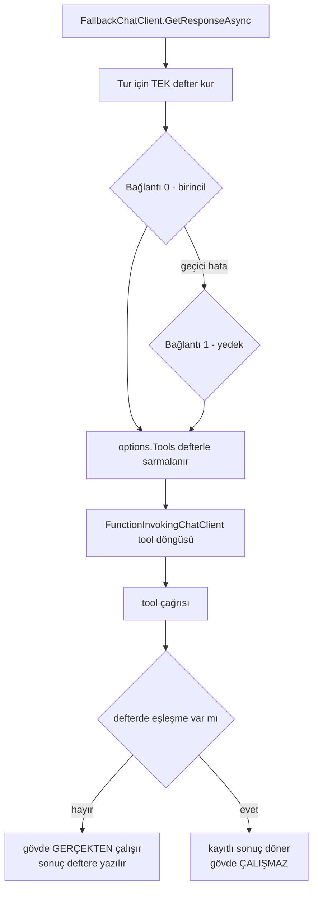

# Faz 124 — Yedeklemenin Tool Defteri

> **Durum:** 📋 Planlandı (2026-08-31)
> **Kaynak:** [kesif/2026-08-31-tuketici-raporu-faz-adaylari.md](kesif/2026-08-31-tuketici-raporu-faz-adaylari.md) · **K-1** (kusur kanalından faz kanalına geçti)
> **Önkoşul:** [Faz 62](arsiv/fazlar/62-MODEL-YEDEK-ZINCIRI-VE-ON-UCUS-DENETIMI.md) (yedek zinciri) ve [Faz 87](arsiv/fazlar/87-KESILEN-ISIN-DEVAMI.md) (kesinti devamı, `RecordedToolPlayback`) — ikisi de arşivde; yalnız aşağıdaki grep'lerle okunur
> **Paketler:** `AgentPrism.Core` (`Models/FallbackChatClient.cs`, `Replay/RecordedToolPlayback.cs`)
> **Yeni paket:** Yok · **Migration:** Yok — defter turun ömrü kadar yaşar, hiçbir yere yazılmaz
> **Public API:** Büyümüyor. Dokunulan iki tip de `internal`. Bu, fazın en ucuz tarafıdır: `wc -l src/*/PublicAPI.Shipped.txt` toplamı **17** satır (K-603) ve bu faz o sayıya bir satır bile eklemez
> **Tüketici yüzeyi:** `docs-site/src/content/docs/guides/reliability.md` (yedekleme bölümü), `concepts/tools.md` · sevk edilen: `FallbackChatClient` XML `<remarks>`'ı — 🚨 bugün **yanlış** bir davranışı doğru diye ilan ediyor
> **Manuel test alanı:** `docs/manuel-test/27-MODEL-YEDEK-VE-ON-UCUS.md`

---

## Bu Faza Başlarken

> `faz-baslangic` skill'ini uygula. Aşağıdaki liste o skill'in 2. adımıdır —
> **tamamını değil, yalnız işaret edilen bölümleri oku.**

1. Bu doküman
2. Kararlar — dosyanın tamamını **okuma**, yalnız bu kalemleri grep'le:
   ```bash
   grep -n "K-583\|K-315\|K-320\|K-483" docs/KARARLAR.md
   ```
   **K-583** (kesinti devamı `Replay` ve `ApprovalResume` ile karıştırılmaz — bu faz o üçüne **dördüncü** bir işlem eklemez, var olan mekanizmayı ödünç alır) · **K-315** (replay sözleşmesi) · **K-320** (model boru hattının tamamını `ModelProviderRegistry` kurar) · **K-483** (elle tekrarlanan ifade sessiz kusur sınıfı üretir — bu fazın kaçınması gereken tam desen)
3. Alan hafızası (bu faz iki alana dokunuyor):
   [`hafiza/model-boru-hatti.md`](hafiza/model-boru-hatti.md) (halka sırası — yanlış halka konumu derlenir, testten geçer, yalnız gerçek senaryoda çöker) ·
   [`hafiza/cekirdek-calistirma.md`](hafiza/cekirdek-calistirma.md) (tool döngüsü ve `AgentPrismRunContext`)
4. Gerektiğinde, tamamı değil ilgili bölümü:
   [`MIMARI.md`](MIMARI.md) — çalıştırma yolu bölümü

---

## Amaç

Bir sağlayıcı yedeklemesi, birincil sağlayıcıda **zaten çalışmış** bir tool'u
yedek sağlayıcıda ikinci kez çalıştırabilir. Ödeme alan, kayıt silen veya
webhook atan bir tool bu yolda iki kez çalışır ve bunu kimse görmez.

Aynı ürün aynı riske **iki farklı cevap** veriyor: kesinti devamı yolunda
tamamlanmış her tool çağrısı kendi kayıtlı sonucundan cevaplanır
(`RecordedToolPlayback`), yedekleme yolunda hiçbir kapı yok. Bu bir yetenek
eksikliği değil, bir tutarsızlıktır. Bu faz kardeş yolun mekanizmasını
yedeklemeye taşır.

- **K-1** — Yedeğe geçilirken tamamlanmış tool çağrıları tur-içi bir defterden cevaplanır; yalnız kesinti noktasının ötesindeki çağrılar gerçekten çalışır.

### Bugün ne çalışmıyor — doğrulanmış kanıt

| Kanıt | Gözlem |
|---|---|
| [`FallbackChatClient.cs:31-35`](../src/AgentPrism.Core/Models/FallbackChatClient.cs) | Kendi dokümanı sonucu yazıyor: *"a fallback **restarts the agent's tool-call turn from scratch**"* |
| [`FallbackChatClient.cs:115-171`](../src/AgentPrism.Core/Models/FallbackChatClient.cs) | Akışsız döngüde `SafeToRepeat`, `ToolEffect` veya herhangi bir tool defteri **yok**; `client.GetResponseAsync` bütün turu baştan koşar |
| [`ModelProviderRegistry.cs:448-452`, `:536`](../src/AgentPrism.Core/Models/ModelProviderRegistry.cs) | `UseFunctionInvocation()` boru hattının **içinde**, `FallbackChatClient` onun **dışında** — yani tool döngüsü gerçekten bu istemcinin altındadır |
| [`FallbackChatClient.cs:200-206`, `:234`](../src/AgentPrism.Core/Models/FallbackChatClient.cs) | 🚨 **Akışlı yol bugün zaten kapalı:** `sawUpdate` ilk kareden sonra yedeğe geçişi engelliyor. Tool döngüsü akışta çağrı içeriğini kareye çevirdiği için tool koştuysa `sawUpdate` çoktan `true`'dur |
| [`RecordedToolPlayback.cs:24-62`, `:160-200`](../src/AgentPrism.Core/Replay/RecordedToolPlayback.cs) | Kardeş mekanizma hazır: `(ad, argüman)` ile eşleştirir, `RunLive` politikasında eşleşmeyeni canlı koşar |
| [`RunReconciliationService.cs:232`](../src/AgentPrism.Core/Recording/RunReconciliationService.cs) | Kesinti devamı ayrıca yıkıcı/dış etkili tool taşıyan run'ı **hiç** devam ettirmez |

> Kanıtlar 2026-08-31 tarihinde `8105c00` üzerinde doğrulandı.

### Kapsam sınırı — ölçümün getirdiği daralma

Kusur **yalnız akışsız `GetResponseAsync` yolundadır.** Akışlı yolda yedeğe
geçiş ancak ilk kare gelmeden önce olur; o noktada hiçbir tool çalışmamıştır.
Bu yüzden akışlı yola defter takmak **saf ek yüktür** ve bu faz onu takmaz.
Bu daralma plan anında ölçüldü; uygulayan oturum aksini varsaymasın.

---

## 124.1 — Tur-içi tool defteri

Fikir tek cümledir: **yedeklemenin denediği her bağlantı aynı deftere bakar.**



Defter turun yerel değişkenidir. `FallbackChatClient` onu kendi metot
gövdesinde kurar ve sarmalayıcılara **closure ile** verir. `AsyncLocal`
kullanılmaz — bu repo'da `AsyncLocal` yazımının çağırana akmaması dört kez
bedel ödetti ve burada ona hiç ihtiyaç yoktur.

### Neden tek sarmalayıcı, iki mod değil

Sarmalayıcı **hem yazar hem okur**: eşleşme varsa kayıtlı sonucu döner,
yoksa gövdeyi çalıştırır ve sonucu deftere yazar. Bu tek davranış her
bağlantı için aynıdır — bağlantı 0'da defter boştur, bağlantı 2'de hem
birincinin hem ikincinin çağrıları defterdedir. İki ayrı mod (kaydeden ve
oynatan) yazılsaydı üçüncü bağlantı ikincinin tool'larını tekrar
çalıştırırdı.

### `RecordedToolPlayback` genişletilir, kopyalanmaz

Yeni bir defter tipi yazmak **K-483'ün sınıfıdır**: argüman biçimlendirme
ifadesi iki yerde yaşar ve biri değişince diğeri sessizce eşleşmez.
`RecordedToolPlayback` zaten `(ad, argüman)` anahtarını, tüketim sırasını ve
hata oynatmasını taşıyor. Bu faz ona yalnız bir yetenek ekler: `RunLive`
politikasında canlı koşan çağrının sonucunu deftere **yazma**.

🚨 **Bu, tipin bugünkü değişmezini bozar.** Kendi yorumu şunu yazıyor:
*"Once the ledger is built, the set of KEYS does not change; only the queues
are consumed."* Canlı çağrıyı yazmak yeni anahtar üretir. `Dictionary`
`ConcurrentDictionary`'ye döner ve o yorum düzeltilir —
`AllowConcurrentToolCalls` açıkken aynı turda iki tool paralel yazabilir.

### Sonuç eşleştirme sözleşmesi

| Durum | Davranış | Gerekçe |
|---|---|---|
| Aynı ad, aynı argüman | Kayıtlı sonuç döner, gövde çalışmaz | Kullanıcı kararı (2026-08-31): kesinti devamının deseninin **birebir** aynısı |
| Aynı ad, farklı argüman | Gövde çalışır, sonuç deftere yazılır | Yedek model başka bir soru soruyor; o soru hiç sorulmadı |
| Aynı ad ve argüman, ikinci kez | Kayıt sırasına göre **ikinci** kayıt tüketilir | `RecordedToolPlayback`'in bugünkü kuralı; "aynı soruyu iki kez sor, iki farklı cevap al" senaryosu korunur |
| Kayıtlı çağrı **hata** verdiyse | Hata oynatılır | Bugünkü kural: başarısız bir tool'u başarılı göstermek sadakatsizliktir |
| Defterde olmayan çağrı | Gövde çalışır | Kesinti noktasının ötesi |

**Salt okunur tool da defterden cevaplanır.** Bu bilinçli: tek bir eşleştirme
kuralı olması, `FallbackChatClient`'ın `IToolRegistry`'ye bağımlı olmasından
ve aynı riske iki farklı kuralın yaşamasından daha değerlidir. Aynı tur içinde
saniyeler geçtiği için bayat sonuç riski ölçülebilir değildir.

## 124.2 — `ChatOptions` sarmalaması — 🚨 çağıranın listesi değiştirilmez

Sarmalama `options.Tools` üzerinde yapılır. İki tuzak vardır:

1. **Yerinde değiştirme yasak.** `options` çağırana aittir ve derlenmiş agent
   önbelleklidir (`CompiledAgentCache`). `options.Tools`'u yerinde sarmalamak
   sonraki her run'ı da sarmalar. Yeni bir liste kurulur.
2. **`ChatOptions.Clone()`'un `Tools` listesini nasıl kopyaladığı
   doğrulanmadı — `maf-api-kesfi` ile ölçülmeli.** Sığ kopya aynı liste
   nesnesini paylaşıyorsa `linkOptions.Tools = new List<AITool>(...)` zorunludur.
   Bugün `OptionsForLink` yalnız bağlantı > 0 için `Clone()` çağırıyor;
   bağlantı 0 çağıranın nesnesini **doğrudan** geçiyor
   (`FallbackChatClient.cs:121`). Bu faz bağlantı 0'ı da klonlamak zorundadır.

Yalnız `AIFunction` olan tool'lar sarmalanır. İstemci tarafı tool'lar
(`AIFunctionDeclaration`, gövdesiz) sunucuda hiç çalışmaz; sarmalanacak bir
gövdeleri yoktur.

## 124.3 — 🚨 Sınıf taraması: bir turu baştan çalıştıran diğer yollar

`kusur-giderme` Adım 5 bu fazın içindedir ve atlanamaz. Kusur sınıfı şudur:
**"bir tool turunu baştan çalıştıran her yol."** Plan anında dört aday tarandı;
uygulayan oturum her birini kod üzerinde tekrar ölçer ve sonucu yazar.

| Yol | Plan anındaki ölçüm | Uygulayan oturumun işi |
|---|---|---|
| Sağlayıcı yedeklemesi (akışsız) | 🔴 **Açık** — bu fazın konusu | Düzelt |
| Sağlayıcı yedeklemesi (akışlı) | 🟢 Kapalı — `sawUpdate` (`FallbackChatClient.cs:234`) | Kapalı olduğunu **bir testle** sabitle |
| Kesinti devamı | 🟢 Kapalı — iki kapı: `RunReconciliationService.cs:232` reddi + `RecordedToolPlayback` | Değiştirme |
| Workflow düğüm retry'ı (`WorkflowNodeRetryPolicy`) | 🟡 **Ölçülmedi.** `MaxAttempts` varsayılanı `1` (retry kapalı, K1). Açıldığında düğümün tamamı — içindeki agent run'ı dahil — baştan koşar | Ölç ve **yaz**: düzeltilecekse bu faza girer, girmeyecekse gerekçesi bu dokümana yazılır |
| Job retry (`IJobHandler`, at-least-once) | 🟢 Sözleşme **yazılı** (Faz 120): handler'ın idempotent olması gerektiği ilan edilmiş | Değiştirme; yalnız yazılı olduğunu doğrula |
| Replay (`ToolPlaybackMismatchPolicy.Stop`) | 🟢 Kapalı — replay hiçbir gövdeyi çalıştırmaz | Değiştirme |

Workflow düğüm retry'ı bu tabloda **açık uçlu** bırakıldı. Sebep dürüst:
plan anında o yolun içinde bir agent run'ının tool döngüsünü taşıyıp
taşımadığı ölçülmedi. Tahmin edilip plana yazılsaydı yanlış koda dönerdi.

---

## Planlanan Public API

**Public API büyümüyor.** Dokunulan her tip `internal`:

```csharp
// AgentPrism.Core — internal, PublicAPI.Unshipped.txt'ye satır EKLEMEZ
internal sealed class RecordedToolPlayback
{
    public RecordedToolPlayback(
        IReadOnlyList<ToolInvocationRecord> invocations,
        ToolPlaybackMismatchPolicy mismatchPolicy = ToolPlaybackMismatchPolicy.Stop,
        bool recordLiveCalls = false);   // YENİ — varsayılan kapalı (K1)

    public AIFunction Wrap(AIFunction function);
}
```

`recordLiveCalls` varsayılanı `false`'tur: replay ve kesinti devamı yolları
bugünkü davranışlarını **birebir** korur.

### HTTP `endpoint`'leri

Yok. Bu faz hiçbir uç eklemez veya değiştirmez.

### Arayüz payı

Yok.

---

## Planlanan Dosya Listesi

```
src/AgentPrism.Core/
├── Models/
│   └── FallbackChatClient.cs          (değişir — defter kurulumu, tool sarmalama, XML remarks düzeltmesi)
└── Replay/
    └── RecordedToolPlayback.cs        (değişir — recordLiveCalls, ConcurrentDictionary)

tests/AgentPrism.Core.UnitTests/
└── Models/
    └── FallbackToolLedgerTests.cs     (yeni)

tests/AgentPrism.AspNetCore.FunctionalTests/
└── FallbackToolSideEffectTests.cs     (yeni — sınırı geçen davranış)

docs-site/src/content/docs/guides/reliability.md   (değişir)
docs/manuel-test/27-MODEL-YEDEK-VE-ON-UCUS.md      (case eklenir)
```

---

## Hata Modları ve Testler

> Mutlu yoldan değil, **ne bozulabilir**den türetilir. Seviyeyi plan seçer.

| Ne bozulabilir | Seviye | Test sınıfı |
|---|---|---|
| Yan etkili tool yedekte **ikinci kez** çalışır (kusurun kendisi) | Fonksiyonel | `FallbackToolSideEffectTests` — gövde bir sayaç artırır; yedeğe geçtikten sonra sayaç **1** olmalıdır |
| Yedek modelin **yeni** tool çağrısı defterde yok diye engellenir | Birim | `FallbackToolLedgerTests` |
| Aynı ad + aynı argüman iki kez çağrıldı; ikinci kayıt tüketilmiyor | Birim | `FallbackToolLedgerTests` |
| Kayıtlı **hata** başarı gibi oynatılıyor | Birim | `FallbackToolLedgerTests` |
| Üçüncü bağlantı, ikinci bağlantının tool'unu tekrar çalıştırıyor | Birim | `FallbackToolLedgerTests` — üç bağlantılı zincir |
| `AllowConcurrentToolCalls` açıkken defter yazımı yarışıyor | Fonksiyonel | `FallbackToolSideEffectTests` — eşzamanlı iki tool |
| Çağıranın `options.Tools` listesi kalıcı olarak sarmalanıyor (önbellekli agent kirlenir) | Fonksiyonel | `FallbackToolSideEffectTests` — aynı agent'ı yedeklemesiz ikinci kez koştur |
| Akışlı yolda defter yanlışlıkla devreye girip ek yük getiriyor | Birim | `FallbackToolLedgerTests` — akışlı yolda sarmalama yapılmadığı sabitlenir |
| Yedekleme **hiç** yapılandırılmamışken davranış değişiyor | Birim | `FallbackToolLedgerTests` — `Fallbacks` boşken `FallbackChatClient` zaten kurulmuyor |
| Replay ve kesinti devamı yollarında davranış kayıyor | Sözleşme | `RepeatableToolContract` (mevcut) — `recordLiveCalls: false` varsayılanı korunmalı |
| İptal, yedeğe geçiş sırasında yutuluyor | Birim | `FallbackToolLedgerTests` — `OperationCanceledException` bugün de yeniden fırlatılıyor (`FallbackChatClient.cs:140`) |

Beş soru ve cevapları: **iptal** → yukarıdaki son satır · **eşzamanlılık** →
`ConcurrentDictionary` + eşzamanlı tool testi · **boş/aşırı girdi** → argümansız
tool çağrısı (`FormatArguments` `null` döner) birim testinde · **başka kiracı** →
defter tur-yerel, kiracı sınırı geçmez, bu yüzden kiracı testi **gereksizdir**
ve bu gerekçe yazıldı · **alt sistem hatası** → defter hiçbir `store`'a yazmaz,
alt sistem yoktur.

---

## Manuel Kabul Case'leri

| # | Ön koşul | Adımlar | Beklenen sonuç |
|---|---|---|---|
| 1 | `ToolEffect.External`, `SafeToRepeat=false` bir tool ve iki bağlantılı `Fallbacks` taşıyan agent; birincil sağlayıcı ikinci turda 503 verecek şekilde ayarlı | Akışsız `POST /api/agents/{ad}/run` | Tool gövdesi **bir kez** çalışır; yanıt yedek sağlayıcıdan gelir; `ModelFallbackUsed` olayı `reason` taşır |
| 2 | Aynı kurulum, akışlı uç | `POST /api/agents/{ad}/run/stream` | İlk kare geldikten sonra yedeğe **geçilmez**; hata olduğu gibi akar (bugünkü davranış korunur) |
| 3 | Yedeklemesiz agent | Normal `run` | Davranış Faz 123 ile birebir aynı; ek olay veya ek gecikme yok |

---

## Açık Sorular

| # | Soru | Seçenekler | Öneri |
|---|---|---|---|
| 1 | Workflow düğüm retry'ı bu fazın kapsamına girer mi? | A: Ölç, açıksa bu fazda kapat · B: Ölç, ayrı kalem olarak devret | **A** — sınıf taraması aynı turda kapanmazsa üçüncü kez tekrarlar. Ancak ölçüm "o yol agent run'ı taşımıyor" derse B'ye düşer ve gerekçesi buraya yazılır |
| 2 | Defterden cevaplanan bir çağrı `run_events`'e görünür bir iz bırakmalı mı? | A: Hayır, sessiz · B: `ToolReplayedFromLedger` benzeri bir olay | **A** — olay hacmi artar ve tüketicinin bugün ölçülmüş bir ihtiyacı yok. B istenirse `RecordReasoningDeltas` deseniyle varsayılan kapalı gelir |
| 3 | `FallbackChatClient`'ın XML `<remarks>`'ındaki "restarts from scratch" cümlesi silinmeli mi, düzeltilmeli mi? | A: Düzelt — "tool turu baştan başlar ama tamamlanmış çağrılar defterden cevaplanır" · B: Sil | **A** — cümlenin ilk yarısı hâlâ doğrudur; konuşma durumu gerçekten baştan kurulur |

---

## Bitiş Ölçütleri (DoD)

- [ ] `ToolEffect.External` + `SafeToRepeat=false` bir tool, yedeğe geçen akışsız bir run'da **bir kez** çalışır — `FallbackToolSideEffectTests` sayacı `1` gösterir
- [ ] Yedek modelin defterde olmayan çağrısı gerçekten çalışır — aynı testte ikinci sayaç artar
- [ ] Üç bağlantılı zincirde ikinci bağlantının tool'u üçüncüde tekrar çalışmaz
- [ ] Yedeklemesiz run'da hiçbir davranış değişmez; `RepeatableToolContract` ve replay testleri değişmeden geçer
- [ ] Sınıf taraması yapıldı; altı yolun her biri için sonuç bu dokümana yazıldı (kapalı / düzeltildi / gerekçeyle devredildi)
- [ ] `FallbackChatClient` XML `<remarks>`'ı gerçek davranışı anlatıyor
- [ ] Dört doğrulama kapısı sıfır uyarı verir
- [ ] `samples/AgentPrism.Api` ile gerçek `run` yapıldı, çıktı belgeye yazıldı
- [ ] `secret` taraması boş döndü
- [ ] Manuel kabul case'leri `docs/manuel-test/27-MODEL-YEDEK-VE-ON-UCUS.md` içine eklendi; otomatikleştirilebilenler koşuldu
- [ ] `faz-denetim` koşuldu; 🔴 bulgu kalmadı
- [ ] `docs-site/` güncellendi; `npm run build` + `check-links.mjs` temiz

### Doğrulama komutları

```bash
# Defterin gerçekten devrede olduğu
./artifacts/bin/AgentPrism.Core.UnitTests/release/AgentPrism.Core.UnitTests --filter-method "*FallbackToolLedger*"

# Sınırı geçen davranış
./artifacts/bin/AgentPrism.AspNetCore.FunctionalTests/release/AgentPrism.AspNetCore.FunctionalTests --filter-method "*FallbackToolSideEffect*"

# Kapılar
python3 scripts/kapi.py kapanis --taban <faz öncesi commit>
```

---

## Riskler

| Risk | Önlem |
|------|-------|
| `ChatOptions.Clone()` `Tools` listesini paylaşırsa çağıranın nesnesi kirlenir ve önbellekli agent kalıcı olarak sarmalanır | `maf-api-kesfi` ile imzayı ölç; her koşulda **yeni liste** kur; fonksiyonel testte aynı agent'ı ikinci kez koş |
| `Dictionary` → `ConcurrentDictionary` dönüşümü replay yolunun tüketim sırasını bozar | `ConcurrentQueue` zaten kullanılıyor; sıra kuyruktadır, sözlükte değil. Mevcut replay testleri regresyon oracle'ıdır |
| Defterin kendisi bellek büyütür | Defter turun ömrü kadar yaşar ve yalnız `Fallbacks` yapılandırılmış agent'larda kurulur; ölçülmeli, tahmin yazılmadı |
| Salt okunur tool'un defterden cevaplanması bir tüketiciyi şaşırtır | Davranış `guides/reliability.md`'de **açıkça** yazılır; sessiz bırakılmaz |
| Sınıf taraması yine tek vakada kapanır | DoD'de ayrı satır; `faz-denetim` tabloyu boş bulursa 🔴 bulgudur |

---

<!-- ============================================================
     AŞAĞISI KAPANIŞTA DOLDURULUR — `faz-tamamlama` skill'i.
     Plan anında boş kalır. Başlıkları SİLME.
     ============================================================ -->

## Plandan Sapmalar

> Kapanışta doldurulur.

## Bu Fazda Verilen Kararlar

> Kapanışta doldurulur. K-NNN numaraları burada alınır; plan numara rezerve etmez.

## Gerçekleşen Public API

> Kapanışta doldurulur.

## Dosya Listesi (gerçekleşen)

> Kapanışta doldurulur.

## Denetim Bulguları

> Kapanışta doldurulur.

## Sonraki Faza Devir Notu

> Kapanışta doldurulur.
