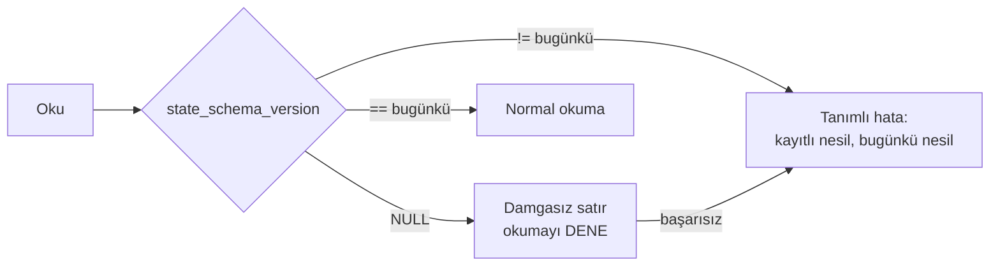

# Faz 126 — Kalıcı Payload Sürüm Sözleşmesi

> **Durum:** 📋 Planlandı (2026-08-31)
> **Kaynak:** [kesif/2026-08-31-tuketici-raporu-faz-adaylari.md](kesif/2026-08-31-tuketici-raporu-faz-adaylari.md) · **T-5**
> **Önkoşul:** [Faz 97](arsiv/fazlar/97-SURUM-POLITIKASI-VE-YAYIN-PROVASI.md) (sürüm politikası ve yayın provası) — arşivde; yalnız grep'le okunur
> **Paketler:** `AgentPrism.Abstractions` (`Sessions/`, `Workflows/`), `AgentPrism.Core`, `AgentPrism.PostgreSql`, `.SqlServer`, `.Sqlite`, `AgentPrism.Sql.Shared`
> **Yeni paket:** Yok · **Migration:** **Gerekli — üç set** (PostgreSQL + SqlServer + Sqlite). Numaralar uygulama anında alınır (K-178)
> **Public API:** Büyüyor — iki kayıt tipine birer alan. Faz 7'den önce ucuz: `wc -l src/*/PublicAPI.Shipped.txt` toplamı **17** satır ve her dosya yalnız başlık taşıyor (K-603). Aynı alanı `1.0.0` sonrası eklemek **kırıcıdır**
> **Tüketici yüzeyi:** `docs-site/src/content/docs/reference/versioning.md` (yeni bölüm), `reference/compatibility.md`, `concepts/sessions.md`, `concepts/workflows.md` · sevk edilen: `SessionRecord.State` ve `WorkflowCheckpointRecord.State` XML dokümanları
> **Manuel test alanı:** `docs/manuel-test/21-DAYANIKLILIK-VE-IPTAL.md`

---

## Bu Faza Başlarken

> `faz-baslangic` skill'ini uygula.

1. Bu doküman
2. Kararlar — dosyanın tamamını **okuma**:
   ```bash
   grep -n "K-178\|K-603\|K-648" docs/KARARLAR.md
   ```
   **K-178** (migration numaraları sağlayıcı başına bağımsızdır) · **K-603** (`PublicAPI.Shipped.txt` preview boyunca boş kalır) · **K-648** (`sessions.version` ile eşzamanlılık — bu fazın ekleyeceği sütun **o değildir**, ayrı bir sütundur)
3. Alan hafızası (bu faz üç alana dokunuyor):
   [`hafiza/maf-oturum.md`](hafiza/maf-oturum.md) (oturum durumunun MAF tarafı) ·
   [`hafiza/sql-saglayicilari.md`](hafiza/sql-saglayicilari.md) (üç sağlayıcı, üç migration) ·
   [`hafiza/workflows.md`](hafiza/workflows.md) (checkpoint payload'ının `$type` kısıtı)
4. Gerektiğinde: [`MIMARI.md`](MIMARI.md) — veri modeli bölümü

---

## Amaç

Bir tüketici üretimde oturum ve workflow checkpoint'i biriktirdikten sonra
AgentPrism sürümünü yükseltirse, bugün elimizde ona verilecek **hiçbir söz
yok**. Bugünkü hata mesajı bunu zaten itiraf ediyor: *"If the Microsoft Agent
Framework version changed, older sessions may have become unreadable."*
`reference/versioning.md` yükseltme adımı olarak *"read the source diff"*
diyor; kalıcı payload'a dair tek cümle yok.

Bu, `1.0.0` sonrası **her** yükseltmenin önünde duran kapıdır ve kurumsal
satın alma bunu sorar. Bu faz üç şey sevk eder: bir **söz**, bir **damga** ve
bir **prova**.

- **T-5** — Kalıcı oturum ve checkpoint payload'ı için yazılı uyumluluk politikası, sürüm damgası ve yükseltme provası.

### Bugün ne çalışmıyor — doğrulanmış kanıt

| Kanıt | Gözlem |
|---|---|
| [`AgentSessionManager.cs:136-146`](../src/AgentPrism.Core/Sessions/AgentSessionManager.cs) | Okunamayan durum `AgentPrismException` fırlatıyor ve sebebi **tahmin ediyor**: *"older sessions may have become unreadable"* |
| [`ISessionStore.cs:187-191`](../src/AgentPrism.Abstractions/Sessions/ISessionStore.cs) | `SessionRecord.State` *"treated as opaque"* — sürüm damgası yok |
| [`WorkflowCheckpointRecord.cs:8-16`](../src/AgentPrism.Abstractions/Workflows/WorkflowCheckpointRecord.cs) | `State` opak ve **`$type` ayırıcısı ilk özellik olmak zorunda**; bu yüzden `json` sütununda saklanıyor, `jsonb` değil |
| [`WorkflowCheckpointState.cs:17-27`](../src/AgentPrism.Abstractions/Workflows/WorkflowCheckpointState.cs) | Tipin tamamı iki üye: `Omitted` ve `IsOmitted`. Sürüm kavramı yok |
| [`reference/versioning.md:93`](../docs-site/src/content/docs/reference/versioning.md) | Yükseltme adımı: *"Read the source diff for public API, configuration, and migration changes."* Kalıcı payload geçmiyor |

> Kanıtlar 2026-08-31 tarihinde `8105c00` üzerinde doğrulandı.

---

## 126.1 — Söz: ne garanti edilir, ne edilmez

Yazılacak politika **dürüst** olmalıdır. Payload'ın önemli kısmı **MAF'ın**
serileştirmesidir ve onun sürümler arası uyumuna söz veremeyiz. Sözü
veremiyorsak **onu yazmak** zorundayız; bugünkü sessizlik en kötü seçenektir.

| Katman | Sahibi | Söz |
|---|---|---|
| Kayıt zarfı (kimlik, kiracı, zaman damgaları, nesil, **şema sürümü**) | AgentPrism | Bir minör sürüm zarfın alanlarını **kaldırmaz**; yalnız ekler. Eski zarf yeni sürümde okunur |
| Oturum durumu gövdesi | Microsoft Agent Framework | **Söz verilmez.** MAF minör sürümü değişince gövde okunamayabilir. Bu durumda davranış tanımlıdır (aşağıda) |
| Checkpoint durumu gövdesi | Microsoft Agent Framework | Aynı |

**Okunamayan payload'ta davranış** — bugün belirsiz olan tam da budur:

1. Hata mesajı tahmin etmez, **ölçer**: kayıtlı şema sürümü ile bugünkü şema
   sürümünü ve kayıtlı MAF sürüm damgasını adıyla söyler.
2. Oturum **silinmez ve sessizce sıfırlanmaz.** Sessiz sıfırlama kullanıcının
   konuşma geçmişini kaybettirir ve bunu kimse görmez.
3. Tüketicinin elinde iki yol vardır ve ikisi de rehberde yazılıdır: oturumu
   yeni kimlikle açmak, veya yükseltme öncesi oturumları boşaltmak.

## 126.2 — Damga: zarfa, gövdeye değil

🚨 **Damga payload'ın İÇİNE yazılmaz.** İki sebep:

1. Checkpoint gövdesinde `$type` ayırıcısı **ilk özellik olmak zorunda**
   (`WorkflowCheckpointRecord` bunu ölçmüş: 7,5 KB'lık gerçek bir checkpoint'te
   `{"$type":0,...}` gerçekten ilk sırada). Gövdeyi bir zarfa sarmak o kısıtı
   üst seviyede bozar ve `json`/`jsonb` tercihinin gerekçesini geçersizleştirir.
2. Gövde MAF'ındır. İçine yazmak, sahibi olmadığımız bir belgeyi
   değiştirmektir.

Damga **kardeş sütun** olur — K-648'in `sessions.version` sütununu eklerken
kullandığı desenin aynısı, ama **ayrı bir sütun**:

| Tablo | Yeni sütun | Anlamı |
|---|---|---|
| `sessions` | `state_schema_version integer NULL` | Bu satırın gövdesini yazan AgentPrism şema nesli |
| `workflow_checkpoints` | `state_schema_version integer NULL` | Aynı |

**`NULL` bilinçlidir ve `DEFAULT` verilmez.** `NULL`, "bu satır damgalama var
olmadan önce yazıldı" demektir ve teşhis mesajının söyleyeceği ilk şey budur.
`DEFAULT 1` verilseydi damgalanmamış eski satırlar damgalı görünürdü — yani
kolon tam da cevaplaması gereken soruyu gizlerdi. (K-648'in `version`
sütununda `DEFAULT 1` **doğruydu**, çünkü orada soru "kaçıncı nesil" idi,
"damgalı mı" değil. İki sütun aynı tabloda yaşayacak; uygulayan oturum bu
farkı migration yorumuna yazsın.)



Şema sürümü bir **sabittir** ve yalnız AgentPrism gövdenin şeklini
değiştirdiğinde artar. MAF sürümü değişti diye artmaz — o ayrı bir eksendir ve
`126.3`'ün provası onu kapsar.

## 126.3 — Prova: yükseltme fixture'ı

Söz ve damga, yükseltmenin gerçekten çalıştığını **kanıtlamaz**. Prova bir
kapı testidir:

- `tests/.../Fixtures/` altında, bugünkü MAF sürümünde **gerçekten yazılmış**
  bir oturum durumu ve bir workflow checkpoint'i durur. Elle yazılmaz;
  koşumdan alınır ve nereden alındığı dosyanın yanına yazılır.
- Test bu fixture'ları bugünkü kodla **okur**. Okuyamazsa kırmızıdır.
- MAF sürümü `Directory.Packages.props` içinde değiştiğinde bu test yükseltmeyi
  ilk fark eden yerdir.

🚨 Bu testin değeri, **yeşil kalmasında değil, kırmızı olduğunda ne
söylediğindedir.** Kırıldığında verdiği mesaj "bir fixture bozuldu" değil,
"MAF `X` → `Y` yükseltmesi üretimdeki oturumları okunamaz yapar" olmalıdır.

Fixture'ların **yenilenme kuralı** da yazılır: bir fixture, kırıldığı için
yeniden üretilmez. Yeniden üretmek kapının kendisini iptal eder. Kırıldığında
alınacak karar bir sürüm kararıdır ve `nuget-danismani` kanalına gider.

---

## Planlanan Public API

```csharp
// AgentPrism.Abstractions
public sealed record SessionRecord
{
    // … mevcut alanlar …

    /// <summary>The AgentPrism schema generation that wrote <see cref="State"/>.</summary>
    /// <remarks><see langword="null"/> means the row was written before stamping existed.</remarks>
    public int? StateSchemaVersion { get; init; }
}

public sealed record WorkflowCheckpointRecord
{
    // … mevcut alanlar …

    /// <summary>The AgentPrism schema generation that wrote <see cref="State"/>.</summary>
    public int? StateSchemaVersion { get; init; }
}
```

🚨 **İmza değiştirmek ile gövdeyi kullanmak iki ayrı adımdır.** Bu iki alan
üç SQL sağlayıcısının `INSERT`/`UPDATE`/`SELECT` ifadelerinde ve bellek içi
depoda **elle** taşınır. Faz 20'de 1068 test tam olarak bu adımı kaçırdı.
`grep -rn "state" src/AgentPrism.Sql.Shared/Internal/` ile her ifadeyi tek tek izle.

### HTTP `endpoint`'leri

Yok. Uçların şekli değişmez; damga yönetim yüzeyinde gösterilmez.

### Arayüz payı

Yok.

---

## Planlanan Dosya Listesi

```
src/AgentPrism.Abstractions/
├── Sessions/ISessionStore.cs                  (değişir — SessionRecord alanı)
└── Workflows/WorkflowCheckpointRecord.cs      (değişir)

src/AgentPrism.Core/
├── Sessions/AgentSessionManager.cs            (değişir — damga yazımı + tanımlı hata metni)
└── Storage/InMemorySessionStore.cs            (değişir)

src/AgentPrism.Sql.Shared/
├── Internal/SqlQueriesBase.cs                 (değişir)
└── Stores/SqlSessionStore.cs                  (değişir)

src/AgentPrism.PostgreSql/Internal/PostgresQueries.cs   (değişir)
src/AgentPrism.SqlServer/Internal/SqlServerQueries.cs   (değişir)
src/AgentPrism.Sqlite/Internal/SqliteQueries.cs         (değişir)

src/AgentPrism.PostgreSql/Migrations/NNNN_state_schema_version.sql   (yeni)
src/AgentPrism.SqlServer/Migrations/NNNN_state_schema_version.sql    (yeni)
src/AgentPrism.Sqlite/Migrations/NNNN_state_schema_version.sql       (yeni)

src/AgentPrism.Testing.Contracts.Xunit/Contracts/SessionStoreContract.cs   (değişir)

tests/AgentPrism.Core.UnitTests/Sessions/PersistedPayloadUpgradeTests.cs   (yeni)
tests/.../Fixtures/session-state-<maf-surumu>.json                        (yeni)
tests/.../Fixtures/workflow-checkpoint-<maf-surumu>.json                  (yeni)

docs-site/src/content/docs/reference/versioning.md    (değişir — yeni bölüm)
docs-site/src/content/docs/reference/compatibility.md (değişir)
```

---

## Hata Modları ve Testler

| Ne bozulabilir | Seviye | Test sınıfı |
|---|---|---|
| Damga yazılıyor ama okuma yolunda taşınmıyor (imza değişti, gövde değişmedi) | **Sözleşme** (`SessionStoreContract`) | dört depoda birden: PostgreSQL, SQL Server, SQLite, bellek içi |
| Damgasız (`NULL`) eski satır okunamaz hâle geliyor | Sözleşme | `SessionStoreContract` — `NULL` damgalı satır okunabilmelidir |
| Migration `DEFAULT 1` koyup damgasız satırları damgalı gösteriyor | Fonksiyonel | `PersistedPayloadUpgradeTests` — migration sonrası eski satır `NULL` kalmalı |
| Eski MAF sürümünde yazılmış payload bugünkü kodla okunamıyor | Fonksiyonel (fixture kapısı) | `PersistedPayloadUpgradeTests` |
| Okunamayan payload'ta hata mesajı hâlâ tahmin ediyor | Birim | `PersistedPayloadUpgradeTests` — mesaj kayıtlı ve bugünkü nesli **içermelidir** |
| Checkpoint gövdesinde `$type` ilk sıradan düşüyor | Fonksiyonel | mevcut workflow checkpoint testleri regresyon oracle'ı; damga gövdeye **dokunmadığı** için değişmemeli |
| Başka kiracının oturumu damga üzerinden görünüyor | Sözleşme | `TenantIsolationContract` (mevcut) |
| Depo yazamazsa oturum kayboluyor | Fonksiyonel | mevcut oturum testleri |
| Üç migration'dan biri unutuluyor | Kapı | `faz-tamamlama` migration kontrolü + `SessionStoreContract` üç sağlayıcıda koşar |

Beş soru: **iptal** → damga yazımı ek bir I/O turu açmaz, mevcut `UPDATE`
içindedir · **eşzamanlılık** → damga `sessions.version` ile aynı ifadede
taşınır, ayrı bir yazma turu yoktur · **boş/aşırı girdi** → `NULL` damga ve
tanınmayan (gelecekten gelen) damga ayrı test · **başka kiracı** →
`TenantIsolationContract` · **alt sistem hatası** → depo hatası bugünkü
davranışı korur.

---

## Manuel Kabul Case'leri

| # | Ön koşul | Adımlar | Beklenen sonuç |
|---|---|---|---|
| 1 | Faz öncesi yazılmış oturumlar taşıyan bir veritabanı | Migration'ı koş, sonra o oturumu kullan | Oturum okunur; `state_schema_version` `NULL` kalır |
| 2 | Faz sonrası yazılmış oturum | Satırı sorgula | `state_schema_version` bugünkü nesli taşır |
| 3 | `state_schema_version` elle gelecekteki bir değere ayarlanmış satır | Oturumu aç | Tanımlı hata; mesaj kayıtlı ve bugünkü nesli **adıyla** söyler; satır silinmez |
| 4 | 👤 Yükseltme provası | MAF sürümünü `Directory.Packages.props`'ta yükselt, fixture testini koş | Test ya yeşildir ya da yükseltmenin oturumları okunamaz yaptığını **açıkça** söyler |

---

## Açık Sorular

| # | Soru | Seçenekler | Öneri |
|---|---|---|---|
| 1 | Kayıtlı **MAF sürümü** de damgalansın mı, yoksa yalnız AgentPrism şema nesli mi? | A: Yalnız AgentPrism nesli · B: İkisi de (`state_maf_version text NULL`) | **B** — teşhis mesajının cevaplaması gereken soru "hangi MAF yazdı" idi; onsuz mesaj hâlâ tahmin eder. Bedeli bir `text` sütunudur |
| 2 | Damgasız satırla karşılaşınca damga **yazılmalı** mı (tembel yükseltme)? | A: Hayır, `NULL` kalır ve bir sonraki normal yazımda dolar · B: Okurken yaz | **A** — okuma yolunda yazma, okuma uçlarını yazma uçlarına çevirir ve salt okunur replikada çöker |
| 3 | Fixture'lar hangi test projesinde yaşar? | A: `AgentPrism.Core.UnitTests` · B: Ayrı bir yükseltme test projesi | **A** — yeni proje maliyeti bugünkü değerini aşıyor; ayrılması gerekirse sonra ayrılır |

---

## Bitiş Ölçütleri (DoD)

- [ ] `reference/versioning.md` kalıcı payload uyumluluk politikasını taşır: ne garanti edilir, ne edilmez, okunamayan payload'ta davranış ne
- [ ] `sessions` ve `workflow_checkpoints` tablolarında `state_schema_version` sütunu var; üç sağlayıcıda migration koşuyor
- [ ] Damgasız (`NULL`) eski satır okunabiliyor — `SessionStoreContract` dört depoda geçiyor
- [ ] Tanınmayan damgada hata mesajı kayıtlı ve bugünkü nesli **adıyla** söylüyor; oturum silinmiyor
- [ ] Fixture kapısı kuruldu; bugünkü MAF sürümünde yazılmış payload bugünkü kodla okunuyor
- [ ] Fixture'ın **yenilenme kuralı** yazıldı: kırıldığı için yeniden üretilmez
- [ ] Dört doğrulama kapısı sıfır uyarı verir
- [ ] `samples/AgentPrism.Api` ile gerçek `run` yapıldı, çıktı belgeye yazıldı
- [ ] `secret` taraması boş döndü
- [ ] Manuel kabul case'leri `docs/manuel-test/21-DAYANIKLILIK-VE-IPTAL.md` içine eklendi
- [ ] `faz-denetim` koşuldu; 🔴 bulgu kalmadı
- [ ] `docs-site/` güncellendi; `npm run build` + `check-links.mjs` temiz

### Doğrulama komutları

```bash
# Damga gerçekten yazılıyor mu
psql -c "SELECT id, state_schema_version FROM agentprism.sessions LIMIT 5;"

# Sözleşme dört depoda
./artifacts/bin/AgentPrism.Sqlite.IntegrationTests/release/AgentPrism.Sqlite.IntegrationTests --filter-method "*SessionStore*"

# Fixture kapısı
./artifacts/bin/AgentPrism.Core.UnitTests/release/AgentPrism.Core.UnitTests --filter-method "*PersistedPayloadUpgrade*"
```

---

## Riskler

| Risk | Önlem |
|------|-------|
| Alan eklendi, üç sağlayıcının SQL ifadelerinden birinde taşınmadı | Sözleşme testi dört depoda birden koşar; `grep` ile her ifade elle izlenir (Faz 20 dersi) |
| Damga gövdeye yazılır ve checkpoint'in `$type` kısıtı bozulur | Tasarım kararı 126.2'de yazılı; mevcut checkpoint testleri regresyon oracle'ı |
| Fixture kırılınca yeniden üretilip kapı sessizce iptal edilir | Yenilenme kuralı yazılır ve DoD'de ayrı satır; `faz-denetim` bunu arar |
| Verilen söz gerçekte tutulamaz | Söz **katman katman** yazılır; MAF gövdesine söz verilmediği açıkça yazılır |
| İki `version` sütunu (`version`, `state_schema_version`) karıştırılır | İkisinin farkı migration yorumunda ve XML dokümanında yazılır |

---

<!-- ============================================================
     AŞAĞISI KAPANIŞTA DOLDURULUR — `faz-tamamlama` skill'i.
     Plan anında boş kalır. Başlıkları SİLME.
     ============================================================ -->

## Plandan Sapmalar

> Kapanışta doldurulur.

## Bu Fazda Verilen Kararlar

> Kapanışta doldurulur.

## Gerçekleşen Public API

> Kapanışta doldurulur.

## Dosya Listesi (gerçekleşen)

> Kapanışta doldurulur.

## Denetim Bulguları

> Kapanışta doldurulur.

## Sonraki Faza Devir Notu

> Kapanışta doldurulur.
