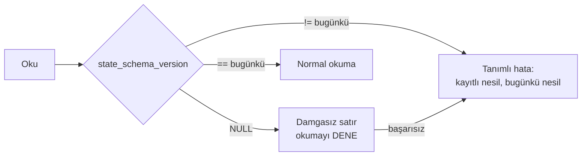

# Faz 126 — Kalıcı Payload Sürüm Sözleşmesi

> **Durum:** ✅ Tamamlandı (2026-09-01)
> **Kaynak:** [kesif/2026-08-31-tuketici-raporu-faz-adaylari.md](kesif/2026-08-31-tuketici-raporu-faz-adaylari.md) · **T-5**
> **Önkoşul:** [Faz 97](arsiv/fazlar/97-SURUM-POLITIKASI-VE-YAYIN-PROVASI.md) (sürüm politikası ve yayın provası) — arşivde; yalnız grep'le okunur
> **Paketler:** `AgentPrism.Abstractions` (`Sessions/`, `Workflows/`), `AgentPrism.Core`, `AgentPrism.PostgreSql`, `.SqlServer`, `.Sqlite`, `AgentPrism.Sql.Shared`
> **Yeni paket:** Yok · **Migration:** **Gerekli — üç set** (PostgreSQL + SqlServer + Sqlite). Numaralar uygulama anında alınır (K-178)
> **Public API:** Büyüyor — iki kayıt tipine birer alan. Faz 7'den önce ucuz: `wc -l src/*/PublicAPI.Shipped.txt` toplamı **17** satır ve her dosya yalnız başlık taşıyor (K-603). Aynı alanı `1.0.0` sonrası eklemek **kırıcıdır**
> **Tüketici yüzeyi:** `docs-site/src/content/docs/reference/versioning.md` (yeni bölüm), `reference/compatibility.md`, `concepts/sessions.md`, `concepts/workflows.md` · sevk edilen: `SessionRecord.State` ve `WorkflowCheckpointRecord.State` XML dokümanları
> **Manuel test alanı:** `docs/manuel-test/21-DAYANIKLILIK-VE-IPTAL.md`

---

## Bu Faza Başlarken

> `faz-baslangic` skill'ini uygula.

1. Bu doküman
2. Kararlar — dosyanın tamamını **okuma**:
   ```bash
   grep -n "K-178\|K-603\|K-648" docs/KARARLAR.md
   ```
   **K-178** (migration numaraları sağlayıcı başına bağımsızdır) · **K-603** (`PublicAPI.Shipped.txt` preview boyunca boş kalır) · **K-648** (`sessions.version` ile eşzamanlılık — bu fazın ekleyeceği sütun **o değildir**, ayrı bir sütundur)
3. Alan hafızası (bu faz üç alana dokunuyor):
   [`hafiza/maf-oturum.md`](hafiza/maf-oturum.md) (oturum durumunun MAF tarafı) ·
   [`hafiza/sql-saglayicilari.md`](hafiza/sql-saglayicilari.md) (üç sağlayıcı, üç migration) ·
   [`hafiza/workflows.md`](hafiza/workflows.md) (checkpoint payload'ının `$type` kısıtı)
4. Gerektiğinde: [`MIMARI.md`](MIMARI.md) — veri modeli bölümü

---

## Amaç

Bir tüketici üretimde oturum ve workflow checkpoint'i biriktirdikten sonra
AgentPrism sürümünü yükseltirse, bugün elimizde ona verilecek **hiçbir söz
yok**. Bugünkü hata mesajı bunu zaten itiraf ediyor: *"If the Microsoft Agent
Framework version changed, older sessions may have become unreadable."*
`reference/versioning.md` yükseltme adımı olarak *"read the source diff"*
diyor; kalıcı payload'a dair tek cümle yok.

Bu, `1.0.0` sonrası **her** yükseltmenin önünde duran kapıdır ve kurumsal
satın alma bunu sorar. Bu faz üç şey sevk eder: bir **söz**, bir **damga** ve
bir **prova**.

- **T-5** — Kalıcı oturum ve checkpoint payload'ı için yazılı uyumluluk politikası, sürüm damgası ve yükseltme provası.

### Bugün ne çalışmıyor — doğrulanmış kanıt

| Kanıt | Gözlem |
|---|---|
| [`AgentSessionManager.cs:136-146`](../src/AgentPrism.Core/Sessions/AgentSessionManager.cs) | Okunamayan durum `AgentPrismException` fırlatıyor ve sebebi **tahmin ediyor**: *"older sessions may have become unreadable"* |
| [`ISessionStore.cs:187-191`](../src/AgentPrism.Abstractions/Sessions/ISessionStore.cs) | `SessionRecord.State` *"treated as opaque"* — sürüm damgası yok |
| [`WorkflowCheckpointRecord.cs:8-16`](../src/AgentPrism.Abstractions/Workflows/WorkflowCheckpointRecord.cs) | `State` opak ve **`$type` ayırıcısı ilk özellik olmak zorunda**; bu yüzden `json` sütununda saklanıyor, `jsonb` değil |
| [`WorkflowCheckpointState.cs:17-27`](../src/AgentPrism.Abstractions/Workflows/WorkflowCheckpointState.cs) | Tipin tamamı iki üye: `Omitted` ve `IsOmitted`. Sürüm kavramı yok |
| [`reference/versioning.md:93`](../docs-site/src/content/docs/reference/versioning.md) | Yükseltme adımı: *"Read the source diff for public API, configuration, and migration changes."* Kalıcı payload geçmiyor |

> Kanıtlar 2026-08-31 tarihinde `8105c00` üzerinde doğrulandı.

---

## 126.1 — Söz: ne garanti edilir, ne edilmez

Yazılacak politika **dürüst** olmalıdır. Payload'ın önemli kısmı **MAF'ın**
serileştirmesidir ve onun sürümler arası uyumuna söz veremeyiz. Sözü
veremiyorsak **onu yazmak** zorundayız; bugünkü sessizlik en kötü seçenektir.

| Katman | Sahibi | Söz |
|---|---|---|
| Kayıt zarfı (kimlik, kiracı, zaman damgaları, nesil, **şema sürümü**) | AgentPrism | Bir minör sürüm zarfın alanlarını **kaldırmaz**; yalnız ekler. Eski zarf yeni sürümde okunur |
| Oturum durumu gövdesi | Microsoft Agent Framework | **Söz verilmez.** MAF minör sürümü değişince gövde okunamayabilir. Bu durumda davranış tanımlıdır (aşağıda) |
| Checkpoint durumu gövdesi | Microsoft Agent Framework | Aynı |

**Okunamayan payload'ta davranış** — bugün belirsiz olan tam da budur:

1. Hata mesajı tahmin etmez, **ölçer**: kayıtlı şema sürümü ile bugünkü şema
   sürümünü ve kayıtlı MAF sürüm damgasını adıyla söyler.
2. Oturum **silinmez ve sessizce sıfırlanmaz.** Sessiz sıfırlama kullanıcının
   konuşma geçmişini kaybettirir ve bunu kimse görmez.
3. Tüketicinin elinde iki yol vardır ve ikisi de rehberde yazılıdır: oturumu
   yeni kimlikle açmak, veya yükseltme öncesi oturumları boşaltmak.

## 126.2 — Damga: zarfa, gövdeye değil

🚨 **Damga payload'ın İÇİNE yazılmaz.** İki sebep:

1. Checkpoint gövdesinde `$type` ayırıcısı **ilk özellik olmak zorunda**
   (`WorkflowCheckpointRecord` bunu ölçmüş: 7,5 KB'lık gerçek bir checkpoint'te
   `{"$type":0,...}` gerçekten ilk sırada). Gövdeyi bir zarfa sarmak o kısıtı
   üst seviyede bozar ve `json`/`jsonb` tercihinin gerekçesini geçersizleştirir.
2. Gövde MAF'ındır. İçine yazmak, sahibi olmadığımız bir belgeyi
   değiştirmektir.

Damga **kardeş sütun** olur — K-648'in `sessions.version` sütununu eklerken
kullandığı desenin aynısı, ama **ayrı bir sütun**:

| Tablo | Yeni sütun | Anlamı |
|---|---|---|
| `sessions` | `state_schema_version integer NULL` | Bu satırın gövdesini yazan AgentPrism şema nesli |
| `workflow_checkpoints` | `state_schema_version integer NULL` | Aynı |

**`NULL` bilinçlidir ve `DEFAULT` verilmez.** `NULL`, "bu satır damgalama var
olmadan önce yazıldı" demektir ve teşhis mesajının söyleyeceği ilk şey budur.
`DEFAULT 1` verilseydi damgalanmamış eski satırlar damgalı görünürdü — yani
kolon tam da cevaplaması gereken soruyu gizlerdi. (K-648'in `version`
sütununda `DEFAULT 1` **doğruydu**, çünkü orada soru "kaçıncı nesil" idi,
"damgalı mı" değil. İki sütun aynı tabloda yaşayacak; uygulayan oturum bu
farkı migration yorumuna yazsın.)



Şema sürümü bir **sabittir** ve yalnız AgentPrism gövdenin şeklini
değiştirdiğinde artar. MAF sürümü değişti diye artmaz — o ayrı bir eksendir ve
`126.3`'ün provası onu kapsar.

## 126.3 — Prova: yükseltme fixture'ı

Söz ve damga, yükseltmenin gerçekten çalıştığını **kanıtlamaz**. Prova bir
kapı testidir:

- `tests/.../Fixtures/` altında, bugünkü MAF sürümünde **gerçekten yazılmış**
  bir oturum durumu ve bir workflow checkpoint'i durur. Elle yazılmaz;
  koşumdan alınır ve nereden alındığı dosyanın yanına yazılır.
- Test bu fixture'ları bugünkü kodla **okur**. Okuyamazsa kırmızıdır.
- MAF sürümü `Directory.Packages.props` içinde değiştiğinde bu test yükseltmeyi
  ilk fark eden yerdir.

🚨 Bu testin değeri, **yeşil kalmasında değil, kırmızı olduğunda ne
söylediğindedir.** Kırıldığında verdiği mesaj "bir fixture bozuldu" değil,
"MAF `X` → `Y` yükseltmesi üretimdeki oturumları okunamaz yapar" olmalıdır.

Fixture'ların **yenilenme kuralı** da yazılır: bir fixture, kırıldığı için
yeniden üretilmez. Yeniden üretmek kapının kendisini iptal eder. Kırıldığında
alınacak karar bir sürüm kararıdır ve `nuget-danismani` kanalına gider.

---

## Planlanan Public API

```csharp
// AgentPrism.Abstractions
public sealed record SessionRecord
{
    // … mevcut alanlar …

    /// <summary>The AgentPrism schema generation that wrote <see cref="State"/>.</summary>
    /// <remarks><see langword="null"/> means the row was written before stamping existed.</remarks>
    public int? StateSchemaVersion { get; init; }
}

public sealed record WorkflowCheckpointRecord
{
    // … mevcut alanlar …

    /// <summary>The AgentPrism schema generation that wrote <see cref="State"/>.</summary>
    public int? StateSchemaVersion { get; init; }
}
```

🚨 **İmza değiştirmek ile gövdeyi kullanmak iki ayrı adımdır.** Bu iki alan
üç SQL sağlayıcısının `INSERT`/`UPDATE`/`SELECT` ifadelerinde ve bellek içi
depoda **elle** taşınır. Faz 20'de 1068 test tam olarak bu adımı kaçırdı.
`grep -rn "state" src/AgentPrism.Sql.Shared/Internal/` ile her ifadeyi tek tek izle.

### HTTP `endpoint`'leri

Yok. Uçların şekli değişmez; damga yönetim yüzeyinde gösterilmez.

### Arayüz payı

Yok.

---

## Planlanan Dosya Listesi

```
src/AgentPrism.Abstractions/
├── Sessions/ISessionStore.cs                  (değişir — SessionRecord alanı)
└── Workflows/WorkflowCheckpointRecord.cs      (değişir)

src/AgentPrism.Core/
├── Sessions/AgentSessionManager.cs            (değişir — damga yazımı + tanımlı hata metni)
└── Storage/InMemorySessionStore.cs            (değişir)

src/AgentPrism.Sql.Shared/
├── Internal/SqlQueriesBase.cs                 (değişir)
└── Stores/SqlSessionStore.cs                  (değişir)

src/AgentPrism.PostgreSql/Internal/PostgresQueries.cs   (değişir)
src/AgentPrism.SqlServer/Internal/SqlServerQueries.cs   (değişir)
src/AgentPrism.Sqlite/Internal/SqliteQueries.cs         (değişir)

src/AgentPrism.PostgreSql/Migrations/NNNN_state_schema_version.sql   (yeni)
src/AgentPrism.SqlServer/Migrations/NNNN_state_schema_version.sql    (yeni)
src/AgentPrism.Sqlite/Migrations/NNNN_state_schema_version.sql       (yeni)

src/AgentPrism.Testing.Contracts.Xunit/Contracts/SessionStoreContract.cs   (değişir)

tests/AgentPrism.Core.UnitTests/Sessions/PersistedPayloadUpgradeTests.cs   (yeni)
tests/.../Fixtures/session-state-<maf-surumu>.json                        (yeni)
tests/.../Fixtures/workflow-checkpoint-<maf-surumu>.json                  (yeni)

docs-site/src/content/docs/reference/versioning.md    (değişir — yeni bölüm)
docs-site/src/content/docs/reference/compatibility.md (değişir)
```

---

## Hata Modları ve Testler

| Ne bozulabilir | Seviye | Test sınıfı |
|---|---|---|
| Damga yazılıyor ama okuma yolunda taşınmıyor (imza değişti, gövde değişmedi) | **Sözleşme** (`SessionStoreContract`) | dört depoda birden: PostgreSQL, SQL Server, SQLite, bellek içi |
| Damgasız (`NULL`) eski satır okunamaz hâle geliyor | Sözleşme | `SessionStoreContract` — `NULL` damgalı satır okunabilmelidir |
| Migration `DEFAULT 1` koyup damgasız satırları damgalı gösteriyor | Fonksiyonel | `PersistedPayloadUpgradeTests` — migration sonrası eski satır `NULL` kalmalı |
| Eski MAF sürümünde yazılmış payload bugünkü kodla okunamıyor | Fonksiyonel (fixture kapısı) | `PersistedPayloadUpgradeTests` |
| Okunamayan payload'ta hata mesajı hâlâ tahmin ediyor | Birim | `PersistedPayloadUpgradeTests` — mesaj kayıtlı ve bugünkü nesli **içermelidir** |
| Checkpoint gövdesinde `$type` ilk sıradan düşüyor | Fonksiyonel | mevcut workflow checkpoint testleri regresyon oracle'ı; damga gövdeye **dokunmadığı** için değişmemeli |
| Başka kiracının oturumu damga üzerinden görünüyor | Sözleşme | `TenantIsolationContract` (mevcut) |
| Depo yazamazsa oturum kayboluyor | Fonksiyonel | mevcut oturum testleri |
| Üç migration'dan biri unutuluyor | Kapı | `faz-tamamlama` migration kontrolü + `SessionStoreContract` üç sağlayıcıda koşar |

Beş soru: **iptal** → damga yazımı ek bir I/O turu açmaz, mevcut `UPDATE`
içindedir · **eşzamanlılık** → damga `sessions.version` ile aynı ifadede
taşınır, ayrı bir yazma turu yoktur · **boş/aşırı girdi** → `NULL` damga ve
tanınmayan (gelecekten gelen) damga ayrı test · **başka kiracı** →
`TenantIsolationContract` · **alt sistem hatası** → depo hatası bugünkü
davranışı korur.

---

## Manuel Kabul Case'leri

| # | Ön koşul | Adımlar | Beklenen sonuç |
|---|---|---|---|
| 1 | Faz öncesi yazılmış oturumlar taşıyan bir veritabanı | Migration'ı koş, sonra o oturumu kullan | Oturum okunur; `state_schema_version` `NULL` kalır |
| 2 | Faz sonrası yazılmış oturum | Satırı sorgula | `state_schema_version` bugünkü nesli taşır |
| 3 | `state_schema_version` elle gelecekteki bir değere ayarlanmış satır | Oturumu aç | Tanımlı hata; mesaj kayıtlı ve bugünkü nesli **adıyla** söyler; satır silinmez |
| 4 | 👤 Yükseltme provası | MAF sürümünü `Directory.Packages.props`'ta yükselt, fixture testini koş | Test ya yeşildir ya da yükseltmenin oturumları okunamaz yaptığını **açıkça** söyler |

---

## Açık Sorular

| # | Soru | Seçenekler | Öneri |
|---|---|---|---|
| 1 | Kayıtlı **MAF sürümü** de damgalansın mı, yoksa yalnız AgentPrism şema nesli mi? | A: Yalnız AgentPrism nesli · B: İkisi de (`state_maf_version text NULL`) | **B** — teşhis mesajının cevaplaması gereken soru "hangi MAF yazdı" idi; onsuz mesaj hâlâ tahmin eder. Bedeli bir `text` sütunudur |
| 2 | Damgasız satırla karşılaşınca damga **yazılmalı** mı (tembel yükseltme)? | A: Hayır, `NULL` kalır ve bir sonraki normal yazımda dolar · B: Okurken yaz | **A** — okuma yolunda yazma, okuma uçlarını yazma uçlarına çevirir ve salt okunur replikada çöker |
| 3 | Fixture'lar hangi test projesinde yaşar? | A: `AgentPrism.Core.UnitTests` · B: Ayrı bir yükseltme test projesi | **A** — yeni proje maliyeti bugünkü değerini aşıyor; ayrılması gerekirse sonra ayrılır |

---

## Bitiş Ölçütleri (DoD)

- [x] `reference/versioning.md` kalıcı payload uyumluluk politikasını taşır: ne garanti edilir, ne edilmez, okunamayan payload'ta davranış ne
- [x] `sessions` ve `workflow_checkpoints` tablolarında `state_schema_version` sütunu var; üç sağlayıcıda migration koşuyor — **sapma:** `sessions.schema_version` zaten vardı (hep dolu), YENİDEN ADLANDIRILDI; bkz. Plandan Sapmalar
- [x] Damgasız (`NULL`) eski satır okunabiliyor — `SessionStoreContract`/`WorkflowCheckpointStoreContract` dört depoda geçiyor (sessions'ta yalnız `StateMafVersion` gerçekten NULL olabilir, `StateSchemaVersion` hiçbir zaman değildi — bkz. sapma)
- [x] Tanınmayan damgada hata mesajı kayıtlı ve bugünkü nesli **adıyla** söylüyor; oturum silinmiyor — gerçek `samples/AgentPrism.Api` + SQLite'a karşı doğrulandı
- [x] Fixture kapısı kuruldu; bugünkü MAF sürümünde yazılmış payload bugünkü kodla okunuyor — **sapma:** checkpoint tarafı TAM `ResumeStreamingAsync` kanıtlayamıyor (MAF executor kimliği süreç başına rastgele); round-trip + `$type` sırası kanıtlanıyor, bkz. sapma
- [x] Fixture'ın **yenilenme kuralı** yazıldı: kırıldığı için yeniden üretilmez — her iki `Fixtures/README.md`'de
- [ ] Dört doğrulama kapısı sıfır uyarı verir — `kapi.py kapanis` (denetim kapandıktan sonra son kez koşulacak)
- [x] `samples/AgentPrism.Api` ile gerçek `run` yapıldı, çıktı belgeye yazıldı — bkz. "Gerçek Koşum Kanıtı"
- [x] `secret` taraması boş döndü — `kapi.py tarama`
- [x] Manuel kabul case'leri `docs/manuel-test/21-DAYANIKLILIK-VE-IPTAL.md` içine eklendi — MT-RES-069..072, ilk üçü gerçek koşuldu
- [ ] `faz-denetim` koşuldu; 🔴 bulgu kalmadı — bağımsız denetçi çalışıyor, sonuç bekleniyor
- [x] `docs-site/` güncellendi; `npm run check` (content+build+links+weight) temiz

### Doğrulama komutları

```bash
# Damga gerçekten yazılıyor mu
psql -c "SELECT id, state_schema_version FROM agentprism.sessions LIMIT 5;"

# Sözleşme dört depoda
./artifacts/bin/AgentPrism.Sqlite.IntegrationTests/release/AgentPrism.Sqlite.IntegrationTests --filter-method "*SessionStore*"

# Fixture kapısı
./artifacts/bin/AgentPrism.Core.UnitTests/release/AgentPrism.Core.UnitTests --filter-method "*PersistedPayloadUpgrade*"
```

### Gerçek Koşum Kanıtı (2026-09-01, `samples/AgentPrism.Api`, SQLite, echo sağlayıcı)

`ASPNETCORE_ENVIRONMENT` `Production`; `AgentPrism:Sqlite:ConnectionString`
ortam değişkeniyle geçici bir dosyaya (`/tmp/agentprism-phase126-demo.db`)
verildi, üç gerçek model sağlayıcı anahtarı boşaltılarak `EchoModelProvider`
zorlandı (ağ çağrısı yok, gerçek para harcanmadı). Başlangıç günlüğü:

```
info: AgentPrism.MigrationRunner[0]
      AgentPrism applied 27 migration(s). Schema: agentprism_.
```

**Yeni oturum, gerçek tur:**
```
$ curl -X POST .../api/agents/support/run -d '{"message":"hello, what is my order status?","sessionId":"phase126-demo-..."}'
event: run
data: {"runId":"01a05a53-...","sessionId":"phase126-demo-..."}
event: update … "text": "Echo: hello, what is my order status?" (parça parça akış)
```

**Ham satır (`sqlite3`):**
```
$ sqlite3 agentprism-phase126-demo.db "SELECT id, state_schema_version, state_maf_version FROM agentprism_sessions ..."
phase126-demo-...|1|1.18.0
```
— `state_maf_version` `Directory.Packages.props`'taki `MicrosoftAgentsAIVersion`
(`1.18.0`) ile birebir eşleşiyor.

**`GET /api/sessions` üzerinden HTTP (MT-RES-070):**
```json
{
  "id": "phase126-demo-...", "stateSchemaVersion": 1, "stateMafVersion": "1.18.0", "version": 1
}
```

**Tanımlı hata senaryosu (MT-RES-071) — `state_schema_version`'ı elle 999999 yap, yeni tur dene:**
```
event: error
data: {"type":"AgentPrismException","message":"Session 'phase126-demo-...' was written with AgentPrism schema generation 999999; this AgentPrism version can read up to generation 1. Update the AgentPrism packages."}
```
Satır sorgulandı: hâlâ `999999` — silinmedi, sıfırlanmadı. Değer `1`'e geri
alındıktan sonra aynı oturumla üçüncü bir tur normal çalıştı (kurtarma
kanıtlandı).

---

## Riskler

| Risk | Önlem |
|------|-------|
| Alan eklendi, üç sağlayıcının SQL ifadelerinden birinde taşınmadı | Sözleşme testi dört depoda birden koşar; `grep` ile her ifade elle izlenir (Faz 20 dersi) |
| Damga gövdeye yazılır ve checkpoint'in `$type` kısıtı bozulur | Tasarım kararı 126.2'de yazılı; mevcut checkpoint testleri regresyon oracle'ı |
| Fixture kırılınca yeniden üretilip kapı sessizce iptal edilir | Yenilenme kuralı yazılır ve DoD'de ayrı satır; `faz-denetim` bunu arar |
| Verilen söz gerçekte tutulamaz | Söz **katman katman** yazılır; MAF gövdesine söz verilmediği açıkça yazılır |
| İki `version` sütunu (`version`, `state_schema_version`) karıştırılır | İkisinin farkı migration yorumunda ve XML dokümanında yazılır |

---

<!-- ============================================================
     AŞAĞISI KAPANIŞTA DOLDURULUR — `faz-tamamlama` skill'i.
     Plan anında boş kalır. Başlıkları SİLME.
     ============================================================ -->

## Plandan Sapmalar

**🚨 En büyük sapma: `sessions.schema_version` zaten vardı.** Plan, "Bugün ne
çalışmıyor" kanıt tablosunu `ISessionStore.cs`, `AgentSessionManager.cs`,
`WorkflowCheckpointRecord.cs` üzerinden çıkarmıştı ama `SqlSessionStore.cs`'i
hiç grep'lememişti. Uygulama başlamadan önce (`faz-uygulama` Adım 1) bu
dosya okunduğunda `schema_version integer NOT NULL` sütununun **`0001_initial.sql`'den
beri** var olduğu, her satırın hep damgalandığı ve `SqlSessionStore.CurrentSchemaVersion`
sabitine göre okuma anında zaten doğrulandığı ölçüldü. Plan bunu bilmeden
"NULL = damgalama yok" tasarımı öneriyordu — sessions için bu öncül
**yanlıştı**: sessions'ta hiç damgasız dönem olmadı.

Kullanıcıya iki seçenek sunuldu (bkz. `AskUserQuestion`) ve önerilen seçenek
onaylandı:

1. **`sessions.schema_version` → `state_schema_version` yeniden adlandırıldı**
   (veri/`NOT NULL` değişmedi, yalnız isim — `workflow_checkpoints`'teki yeni
   sütunla adlandırma tutarlılığı için). Sessions için migration bu yüzden bir
   **rename**, `workflow_checkpoints` için bir **add**.
2. **Yeni bir eksen eklendi: `state_maf_version` (text, NULL).** Bu, planın
   Açık Soru 1'inin cevabıydı (öneri B kabul edildi) ve gerçekte eksik olan
   tek şeydi: "hangi MAF sürümü yazdı" sorusuna cevap. İki tabloya da eklendi.
3. **`SessionRecord.StateSchemaVersion` sonuçta `int` (nullable DEĞİL),**
   `WorkflowCheckpointRecord.StateSchemaVersion` ise `int?` — çünkü ölçülen
   gerçek buydu: sessions hiç damgasız olmadı, checkpoints hep damgasızdı.
   Plandaki kod örneği ikisini de `int?` gösteriyordu; bu, ölçümle düzeltildi.

**Doğrulama/damgalama sorumluluğu STORE'dan MANAGER'a taşındı.**
`SqlSessionStore` artık `CurrentSchemaVersion` sabiti taşımıyor; hem yazımda
hem okumada `SessionRecord.StateSchemaVersion`/`StateMafVersion`'ı olduğu gibi
taşır (`AgentName`/`TenantId` gibi düz bir alan). Damgalamayı ve "kayıtlı ≠
bugünkü" karşılaştırmasını `AgentSessionManager` yapıyor — çünkü yalnız o,
MAF'a en yakın katman olarak hem "şimdi çalışan MAF sürümü" bilgisine hem
"kayıtlı sürüm" bilgisine aynı anda sahip. Bu sayede `InMemorySessionStore`'a
**hiç dokunmak gerekmedi** — record zaten `with {...}` ile her alanı olduğu
gibi taşıyordu (plan bu dosyayı "değişir" listesine almıştı, ölçüldü: gerekmedi).

**Checkpoint tarafında fixture kapısı planın istediği "tam resume" kanıtını
VEREMEZ — ölçülmüş bir yapısal kısıt.** MAF'ın executor kimliği
(`{ad}_{AIAgent.Id}`) süreç başına RASTGELE üretilir (`docs/hafiza/workflows.md`);
bir checkpoint başka bir süreçte (fixture'ı üreten throwaway test farklı bir
`dotnet test` çalıştırmasıydı) asla aynı kimlikle eşleşmez — `InvalidDataException`
("not compatible with the workflow") HER ZAMAN atar, gerçek MAF-sürüm uyumsuzluğundan
BAĞIMSIZ olarak. Bu yüzden `AgentPrism.Workflows.UnitTests/PersistedPayloadUpgradeTests.cs`
tam resume DENEMEZ; bunun yerine fixture'ın gerçekten ayrıştığını, `$type`
ayracının hâlâ ilk sırada olduğunu ve `InMemoryWorkflowCheckpointStore` üzerinden
bayt-bayt round-trip ettiğini kanıtlar. Sınırlama testin kendi XML yorumunda
yazılıdır. Sessions tarafı bu kısıtı TAŞIMAZ (`DeserializeSessionAsync` yalnız
ajan ADINA bakar, süreç-yerel bir kimliğe değil) ve tam bir "todays MAF payload
readable by todays code" kanıtı verir.

**Fixture'lar iki AYRI test projesinde yaşıyor**, plan Açık Soru 3'ün "A: tek
proje (`AgentPrism.Core.UnitTests`)" cevabının aksine. Ölçüm: `AgentPrism.Core.UnitTests`
`AgentPrism.Workflows`'a referans VERMİYOR (yapısal — Core, Workflows'a bağımlı
değil), dolayısıyla bir workflow checkpoint'ini gerçekten OKUYAN bir test oradan
yazılamaz. Session fixture'ı `AgentPrism.Core.UnitTests/Fixtures/`'ta,
checkpoint fixture'ı `AgentPrism.Workflows.UnitTests/Fixtures/`'ta.

**`AgentSessionManager`'daki "gelecekteki şema nesli" ön-denetimi ek bir I/O
turu açmadı** — `record` zaten `GetAsync`'ten elde tutuluyordu, yalnız
`DeserializeSessionAsync` çağrılmadan önce bir karşılaştırma eklendi. Checkpoint
tarafında ise metadata sorgusu (`ListAsync`) yalnız BAŞARISIZLIK yolunda
(catch bloğunda) çalışır — başarılı resume hiçbir ek sorgu ödemez.

## Bu Fazda Verilen Kararlar

- **Kalıcı payload uyumluluk politikası** (`reference/versioning.md`): zarf
  AgentPrism'in, gövde MAF'ın sözüdür; MAF'a hiçbir uyumluluk sözü verilmez.
  Okunamayan payload'ta davranış tanımlıdır — tahmin etmez, ölçer; satır
  silinmez/sıfırlanmaz.
- **`sessions.schema_version` → `state_schema_version` yeniden adlandırıldı**
  (veri korunarak); yeni `state_maf_version` (text, NULL) sütunu hem
  `sessions` hem `workflow_checkpoints`'e eklendi. `workflow_checkpoints`'e
  ayrıca `state_schema_version` (integer, NULL) eklendi.
- **Damgalama ve doğrulama sorumluluğu SQL store'dan `AgentSessionManager`'a
  taşındı**; store'lar artık bu iki alanı düz veri gibi taşır, kendi başına
  hesaplamaz/doğrulamaz.
- **Fixture'ların yenilenme kuralı**: bir fixture kırıldığı için yeniden
  üretilmez; kırılma gerçek bir uyumluluk sorusudur ve `nuget-danismani`
  kanalına gider (`Fixtures/README.md`, iki projede).

## Gerçekleşen Public API

```csharp
// AgentPrism.Abstractions — Sessions/ISessionStore.cs
public sealed record SessionRecord
{
    // … mevcut alanlar …
    public int StateSchemaVersion { get; init; } = 1;   // plan: int? — ölçümle int'e düzeltildi (hiç NULL olmadı)
    public string? StateMafVersion { get; init; }         // plandaki gibi
}

// AgentPrism.Abstractions — Workflows/WorkflowCheckpointRecord.cs
public sealed record WorkflowCheckpointRecord
{
    // … mevcut alanlar …
    public int? StateSchemaVersion { get; init; }         // plandaki gibi
    public string? StateMafVersion { get; init; }          // plan kod örneğinde yoktu; Açık Soru 1 (B) gereği eklendi
}
```

`AgentSessionManager.CurrentStateSchemaVersion` (`internal const int = 1`) ve
`AgentPrismCheckpointStore.CurrentStateSchemaVersion`/`CurrentMafVersion`
(`internal`) plan dışı eklendi ama **public DEĞİL** — bir tüketicinin bu
sabitlere doğrudan ihtiyacı yok, `SessionRecord.StateSchemaVersion` zaten
kendi neslini taşıyor.

`AgentPrism.Testing.Contracts.Xunit` paketine dört yeni public test metodu
eklendi (`SessionStoreContract`/`WorkflowCheckpointStoreContract`'a birer
round-trip + birer NULL-tolerans testi) — plan bunu öngörmüyordu ama
`AgentPrism.Testing.Contracts.Xunit` zaten sözleşme testi taşıyan bir paket
olduğu için gerekçesi açık: yeni alanların dört depoda (Postgres/SqlServer/
Sqlite/bellek içi) tutarlı davrandığını kanıtlamanın tek yolu bu.

### HTTP `endpoint`'leri

Plandaki gibi: yok. Uçların şekli değişmedi; `SessionRecord`/
`WorkflowCheckpointRecord` DTO'ları zaten HTTP'ye çıkıyordu, iki alan
otomatik olarak `GET /api/sessions` ve checkpoint listesine eklendi
(OpenAPI şeması `docs/openapi/agentprism.json`'da güncellendi, istemciler
yeniden üretildi).

## Dosya Listesi (gerçekleşen)

```
src/AgentPrism.Abstractions/
├── Sessions/ISessionStore.cs                          (değişir — SessionRecord alanları)
└── Workflows/WorkflowCheckpointRecord.cs               (değişir)

src/AgentPrism.Core/
└── Sessions/AgentSessionManager.cs                     (değişir — damga yazımı + tanımlı hata + MAF sürüm okuma)
    ↳ Storage/InMemorySessionStore.cs DEĞİŞMEDİ (plan öngörmüştü; record with {} zaten yeterliydi)

src/AgentPrism.Sql.Shared/
├── Internal/SqlQueriesBase.cs                          (değişir — session + checkpoint sorguları)
└── Stores/
    ├── SqlSessionStore.cs                               (değişir — CurrentSchemaVersion kaldırıldı, pass-through)
    └── SqlWorkflowCheckpointStore.cs                     (değişir — iki yeni sütun)

src/AgentPrism.PostgreSql/
├── Internal/PostgresQueries.cs                          (değişir)
└── Migrations/0040_persisted_payload_version.sql         (yeni)

src/AgentPrism.SqlServer/
├── Internal/SqlServerQueries.cs                         (değişir)
└── Migrations/0027_persisted_payload_version.sql          (yeni)

src/AgentPrism.Sqlite/
├── Internal/SqliteQueries.cs                            (değişir)
└── Migrations/0027_persisted_payload_version.sql          (yeni)

src/AgentPrism.Workflows/Internal/
├── AgentPrismCheckpointStore.cs                          (değişir — damga yazımı + MAF sürüm okuma)
└── WorkflowRunner.cs                                     (değişir — resume catch'ine tanımlı hata eklendi)

src/AgentPrism.Testing.Contracts.Xunit/Contracts/
├── SessionStoreContract.cs                               (değişir — 2 yeni test)
└── WorkflowCheckpointStoreContract.cs                    (değişir — 2 yeni test)

tests/AgentPrism.Core.UnitTests/
├── Sessions/PersistedPayloadUpgradeTests.cs              (yeni — 3 test)
└── Fixtures/session-state-1.18.0.json + README.md         (yeni)

tests/AgentPrism.Workflows.UnitTests/
├── PersistedPayloadUpgradeTests.cs                       (yeni — plan "tek proje" diyordu; ayrı proje gerekti, bkz. sapma)
├── WorkflowRunnerTests.cs                                 (değişir — denetim bulgusu 1/2 için 2 yeni test)
└── Fixtures/workflow-checkpoint-1.18.0.json + README.md   (yeni)

tests/AgentPrism.PostgreSql.IntegrationTests/DataSubjectStoreTests.cs      (değişir — INSERT sütun adı)
tests/AgentPrism.SqlServer.IntegrationTests/DataSubjectStoreTests.cs       (değişir — aynı)
tests/AgentPrism.Sqlite.IntegrationTests/DataSubjectStoreTests.cs         (değişir — aynı)
tests/AgentPrism.Sqlite.IntegrationTests/RetentionMaxRowsDataPlaneTests.cs (değişir — aynı)
tests/AgentPrism.Sql.Shared.UnitTests/Baselines/sql-text-baseline.*.txt   (değişir — üç dialekt, snapshot yenilendi)

docs-site/src/content/docs/reference/versioning.md      (değişir — yeni bölüm + mermaid)
docs-site/src/content/docs/reference/compatibility.md   (değişir — yeni tablo)
docs-site/src/content/docs/concepts/sessions.md          (değişir — kısa bölüm)
docs-site/src/content/docs/concepts/workflows.md         (değişir — kısa paragraf)
docs-site/public/llms-full.txt                            (değişir — Faz 122'den beri bayatlamıştı, bu fazda YAKALANDI ve düzeltildi; ilgisiz kusur)

docs/openapi/agentprism.json                              (değişir — üretilen, iki alan)
packages/agentprism-client/src/schema.ts                   (değişir — üretilen)
src/AgentPrism.Client/Generated/AgentPrismApiClient.g.cs    (değişir — üretilen)

docs/manuel-test/21-DAYANIKLILIK-VE-IPTAL.md              (değişir — MT-RES-069..072)
docs/manuel-test/00-INDEKS.md                              (değişir — satır 21 güncellendi)

scripts/applied-migrations.json                            (değişir — kapanışta commit SHA'sı ile)
```

## Denetim Bulguları

Bağımsız denetçi (taze bağlamlı ayrı agent), `git diff 9bbafe4...HEAD`'in
tamamını ve ilgili testleri okudu; kendi ölçümü için 2278 test (Core +
Workflows + SQL Server + SQLite) koştu. **🔴 bulgu yok.**

| # | Seviye | Bulgu | Sonuç |
|---|---|---|---|
| 1 | 🟡 | `WorkflowRunner.StartAsync`'in checkpoint-gövdesi-okunamadı catch'i hiçbir testte tetiklenmiyordu; session tarafının eşdeğeri testliydi, checkpoint tarafı değildi. | **Düzeltildi.** İki yeni test (`WorkflowRunnerTests.Resuming_with_a_future_schema_generation_...` ve `Resuming_a_checkpoint_with_unreadable_state_...`) aynı süreçte gerçek bir checkpoint yazıp metadata/gövdesini bozarak her iki catch dalını da tetikliyor. **Ek kusur ortaya çıktı:** bozuk gövde MAF'tan `ArgumentNullException` fırlatıyordu — yakalanan tip listesinde (`JsonException, InvalidOperationException, NotSupportedException`) yoktu, genel `catch (Exception)`'a düşüp "ArgumentNullException failed. (ref: ...)" gibi tahmin eden bir mesaj üretiyordu. Session tarafının `ArgumentException` zaten kapsadığı bu tipi (`ArgumentNullException` ondan türer) checkpoint tarafına da eklendi. |
| 2 | 🟡 | Checkpoint tarafında `StateSchemaVersion` yalnız YAZILIYORDU, hiç OKUNUP bugünkü nesille proaktif karşılaştırılmıyordu (session tarafı bunu yapıyordu). | **Düzeltildi.** `StartAsync` artık resume denemeden ÖNCE checkpoint metadata'sını bir kez okuyor (`FindCheckpointMetadataAsync`) ve `StateSchemaVersion` gelecekteki bir nesli işaret ediyorsa session'dakiyle simetrik bir tanımlı hata fırlatıyor — reaktif catch'in ihtiyaç duyduğu aynı kayıt yeniden kullanılıyor, ikinci bir sorgu açılmıyor. Testi: `Resuming_with_a_future_schema_generation_is_a_defined_error_and_the_checkpoint_survives`. |
| 3 | 🟢 | `Fixtures/README.md`'nin (Workflows) "Renewal rule" cümlesi kırmızı testi "resume edemiyor" diye yorumluyordu; test aslında `ResumeStreamingAsync`'i hiç çağırmıyor. | **Düzeltildi** (kozmetik): cümle round-trip/`$type` iddiasını doğru yansıtacak şekilde yeniden yazıldı. |

Düzeltmelerden sonra dört kapı yeniden koşuldu (aşağıda).

## Sonraki Faza Devir Notu

**Devraldığın sözleşmeler:**
- `SessionRecord.StateSchemaVersion` (`int`, hep dolu) ve `StateMafVersion`
  (`string?`, `null` = Faz 126 öncesi satır) — SQL store'lar bunları
  HESAPLAMAZ, yalnız taşır. Damgalama `AgentSessionManager.SaveSessionAsync`'te.
- `WorkflowCheckpointRecord.StateSchemaVersion`/`StateMafVersion` — ikisi de
  `?`, ikisi de `AgentPrismCheckpointStore.CreateCheckpointAsync`'te damgalanır.
- Okunamayan bir payload artık HER ZAMAN tanımlı bir `AgentPrismException`
  fırlatır (`AgentSessionManager.GetOrCreateSessionAsync`,
  `WorkflowRunner.StartAsync`'in resume dalı) — kayıt asla silinmez/sıfırlanmaz.

**🚨 Bilinen tuzaklar:**
- SQL store'lara yeni bir "damga" alanı eklerken store'un kendisi
  DOĞRULAMAZ — doğrulama/hesaplama her zaman `AgentSessionManager` (ya da
  checkpoint'in eşdeğeri `AgentPrismCheckpointStore`) seviyesinde olmalı.
  Store'a "akıllı" mantık koymak, in-memory store ile SQL store arasında
  davranış farkı açar (bu faz bunu tam tersinden kapattı).
- MAF'ın executor kimliği süreç-yerel ve rastgele — checkpoint'i içeren
  HERHANGİ bir fixture/kayıt farklı bir süreçte "tam resume" ile test
  edilemez; yalnız round-trip/yapısal doğrulama mümkündür.
- `scripts/applied-migrations.json`'a yeni migration eklerken `sourceCommits`
  girdisi migration dosyasını GERÇEKTEN içeren commit'in SHA'sını ister —
  commit ATILMADAN önce bilinmez, bu yüzden manifest güncellemesi ayrı,
  SONRAKİ bir commit'te yapılır (bu fazda da öyle yapıldı).

**Dosya listesi önerisi:** yok — bu faz kapanış fazıydı, hemen ardından
gelen iş için özel bir dosya iskeleti gerekmiyor.
