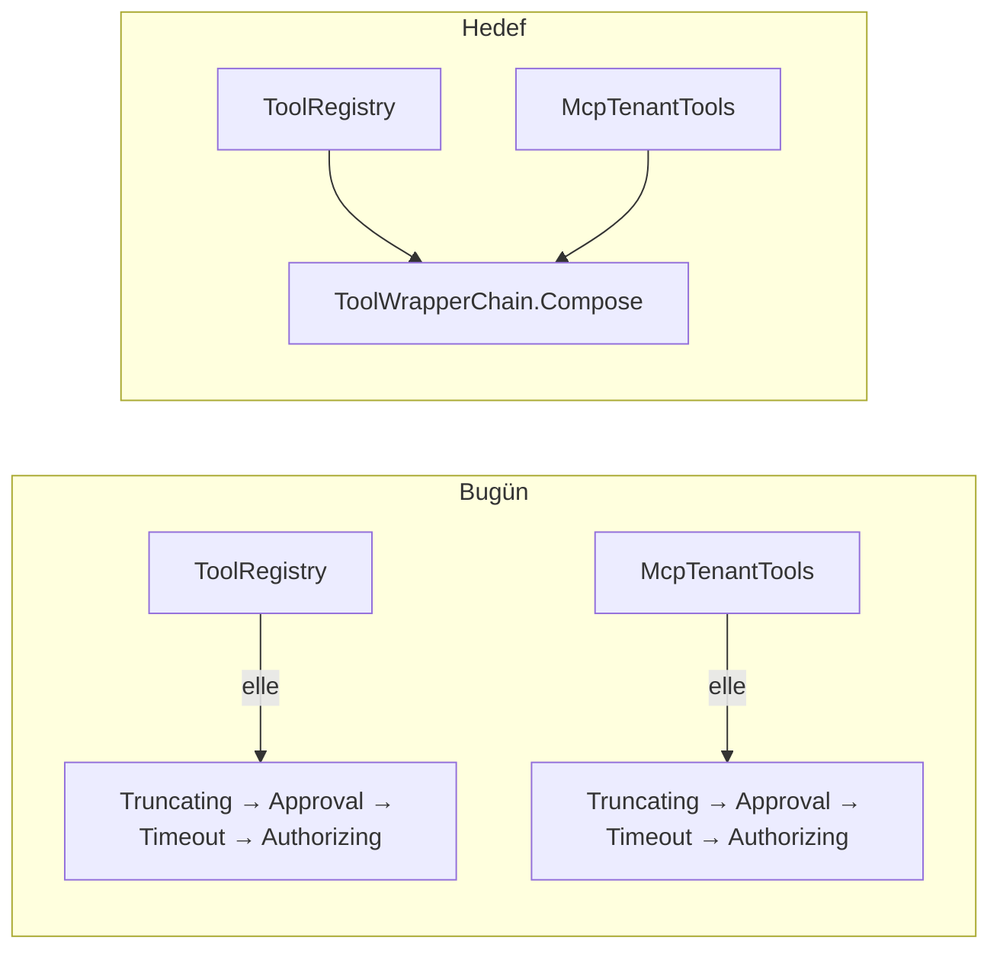

# Faz 127 — Tool Kayıt Yüzeyi: Tek Kompozisyon, Argüman Kapısı ve Kapsamlı Tool

> **Durum:** 📋 Planlandı (2026-08-31)
> **Kaynak:** [kesif/2026-08-31-tuketici-raporu-faz-adaylari.md](kesif/2026-08-31-tuketici-raporu-faz-adaylari.md) · **T-4**, **T-3**
> **Önkoşul:** [Faz 69](arsiv/fazlar/69-TOOL-YETKILENDIRMESI-VE-TIMEOUT.md) (sarmalayıcı zinciri ve sırası) ve [Faz 89](arsiv/fazlar/89-TOOL-CIKTISI-BOYUT-SINIRI.md) (`TruncatingAIFunction`) — ikisi de arşivde
> **Paketler:** `AgentPrism.Abstractions` (yeni arayüz), `AgentPrism.Core` (`Tools/`), `AgentPrism.Mcp` (`Internal/McpTenantTools.cs`)
> **Yeni paket:** Yok · **Migration:** Yok
> **Public API:** Büyüyor — bir arayüz, bir sonuç tipi, bir builder metodu. Faz 7'den önce ucuz: `wc -l src/*/PublicAPI.Shipped.txt` toplamı **17** satır (K-603)
> **Tüketici yüzeyi:** `docs-site/src/content/docs/guides/write-your-own-tool.md`, `concepts/tools.md`, `reference/extension-points.md` · sevk edilen: yeni arayüzün XML `<example>`'ı, `AgentPrism.AgentMap.md` yetenek satırı
> **Manuel test alanı:** `docs/manuel-test/18-MCP-VE-A2A.md` (MCP tarafı) ve `docs/manuel-test/22-GUARDRAIL-VE-YAPISAL-CIKTI.md` (argüman kapısı)

---

## Bu Faza Başlarken

> `faz-baslangic` skill'ini uygula.

1. Bu doküman
2. Kararlar — dosyanın tamamını **okuma**:
   ```bash
   grep -n "K-218\|K-347\|K-368\|K-483" docs/KARARLAR.md
   ```
   **K-218** (tool bağımlılıkları kurulum anında alınır; `AIFunctionArguments.Services` boştur — bu fazın kapatacağı tuzak) · **K-347** (`ToolMethodScanner` örnek metotları tarama anında reddeder — 🚨 bu faz o kararı **açmaz**) · **K-368** (onay kararı YENİ bir run'dır) · **K-483** (elle tekrarlanan ifade sessiz kusur sınıfı üretir — bu fazın birinci işi)
3. Alan hafızası (bu faz iki alana dokunuyor):
   [`hafiza/cekirdek-calistirma.md`](hafiza/cekirdek-calistirma.md) (K-218'in dört vakası) ·
   [`hafiza/mcp-a2a-sunucu.md`](hafiza/mcp-a2a-sunucu.md) (MCP tool kataloğu ve kiracı yalıtımı)
4. Gerektiğinde: [`MAF-GENISLEME-NOKTALARI.md`](MAF-GENISLEME-NOKTALARI.md) — `AIFunction` sarmalama

---

## Amaç

Bu faz tool kayıt yüzeyindeki üç şeyi birlikte ele alır, çünkü üçü de **aynı
altyapıya** — sarmalayıcı zincirine ve `AgentPrismBuilder`'a — dokunur.

Birincisi bir yapısal borçtur ve ölçümde çıktı: sarmalayıcı zinciri **iki
yerde elle yazılı** ve kodun kendi yorumu bunu itiraf ediyor. İkincisi
tüketicinin istediği argüman doğrulama halkasıdır; o halka, tek kompozisyon
noktası olmadan **iki yere birden** eklenmek zorunda kalır — yani K-483'ün
sınıfını üçüncü kez üretir. Üçüncüsü, K-218'in dört kez bedel ödettiği tuzağı
API ile kapatan `AddScopedTool`'dur.

- **T-3** — Tool argümanları için değiştirilebilir bir yerel doğrulama halkası.
- **T-4** — Çağrı başına DI kapsamı açan tool kaydı.

### Bugün ne çalışmıyor — doğrulanmış kanıt

| Kanıt | Gözlem |
|---|---|
| [`ToolRegistry.cs:110-135`](../src/AgentPrism.Core/Tools/ToolRegistry.cs) | Sarmalayıcı zinciri burada elle kuruluyor: `Truncating → Approval → Timeout → Authorizing` |
| [`McpTenantTools.cs:70-90`](../src/AgentPrism.Mcp/Internal/McpTenantTools.cs) | 🚨 **Aynı zincir ikinci kez elle kuruluyor.** Kodun kendi yorumu: *"MCP tools do not go through that registry, so the wrapping is repeated on this path"* |
| [`ToolRegistry.cs:110-135`](../src/AgentPrism.Core/Tools/ToolRegistry.cs) · [`McpTenantTools.cs:70-90`](../src/AgentPrism.Mcp/Internal/McpTenantTools.cs) | Zincirde bir **doğrulama halkası yok**; argüman kontrolü yalnız bağlamanın yan etkisidir |
| [`AgentPrismGeneratedToolArguments.cs:33-60`](../src/AgentPrism.Abstractions/Tools/AgentPrismGeneratedToolArguments.cs) | `GetRequired`/`GetOptional` **ada göre** okur; şemada olmayan fazladan alanları görmez (`additionalProperties:false` şemada yazar, yerel uygulanmaz) |
| [`AgentPrismBuilder.cs:28-83`](../src/AgentPrism.Core/AgentPrismBuilder.cs) | Her tool kaydı `Services.AddSingleton` — kapsamlı bağımlılık için hiçbir yol yok |
| [`ToolMethodScanner.cs:95-103`](../src/AgentPrism.Core/Tools/ToolMethodScanner.cs) | Örnek metot **tarama anında** reddediliyor; reddin metni MAF'ın boş sağlayıcısını gerekçe gösteriyor (K-347) |
| [`guides/write-your-own-tool.md:44-67`](../docs-site/src/content/docs/guides/write-your-own-tool.md) | Kapsamlı iş için reçete **var**, ergonomi yok: sekiz satırlık `IServiceScopeFactory` kalıbı |
| [`McpToolRegistry.cs:24-77`](../src/AgentPrism.Mcp/McpToolRegistry.cs) | MCP kayıt defteri kod defterini **sarmalıyor**; MCP tool'ları `ToolRegistry`'nin gövdesinden hiç geçmiyor |

> Kanıtlar 2026-08-31 tarihinde `8105c00` üzerinde doğrulandı.

---

## 127.1 — Önce tek kompozisyon noktası

Bu, fazın **ilk** işidir ve diğer ikisinin ön koşuludur.

Zincir bugün iki yerde yaşıyor. Bir halka eklemek iki yeri değiştirmek
demektir; birini unutmak MCP tool'larının o halkayı görmemesi demektir ve
bunu hiçbir test yakalamaz — çünkü iki yol ayrı test edilir.

**MEMORY.md'nin dersi tam olarak budur:** elle tekrarlanan bir ifadeye terim
eklemek sessiz bir kusur **sınıfı** üretir; Faz 68'de yedi yerde yazılı bir
toplama ifadesine üçüncü terim eklenince yalnız SQL düzeltildi ve 4241 test
kaçırdı.



`ToolWrapperChain.Compose` `internal`'dır ve `AgentPrism.Core` içinde yaşar;
`AgentPrism.Mcp` ona zaten `InternalsVisibleTo` ile erişiyor
(`AssemblyInfo.cs:8` bu erişimi adıyla anlatıyor).

**Kapı:** iki çağrı yerinin aynı zinciri kurduğunu bir test sabitler. Sarmalayıcı
tiplerinin sırasını dışarıdan okuyan bir test yazılır; halka eklendiğinde her
iki yolda da görünmezse kırmızıdır.

🚨 Tek fark korunur: MCP tarafı `ToolEffect.Read`'i `External`'a yükseltiyor
(uzak sunucu kendi etkisini beyan etmez). Bu **kompozisyonun** değil, çağrı
yerinin kararıdır ve orada kalır.

## 127.2 — `IToolArgumentsValidator` — argüman kapısı

Bugün argüman kontrolü bir **kapı değil, bağlamanın yan etkisidir**. Tip
uyuşmazlığı, eksik `required` ve geçersiz `enum` bağlama sırasında fırlar; ama
fazladan alanlar sessizce yok sayılır, ve elle yazılmış `AIFunction`'lar ile
MCP'den gelen tool'lar bu davranışı **hiç paylaşmaz**.

```csharp
// AgentPrism.Abstractions
public interface IToolArgumentsValidator
{
    ValueTask<ToolArgumentsValidationResult> ValidateAsync(
        ToolDescriptor tool,
        AIFunctionArguments arguments,
        CancellationToken cancellationToken = default);
}

public sealed record ToolArgumentsValidationResult
{
    public static ToolArgumentsValidationResult Valid { get; }
    public static ToolArgumentsValidationResult Invalid(string reason);

    public bool IsValid { get; }
    /// <summary>The reason shown to the model. Never carries argument values.</summary>
    public string? Reason { get; }
}
```

**Varsayılan no-op'tur** (K1 — sıfır sürpriz) ve `TryAddSingleton` ile
kaydedilir (K4 — tüketicinin kaydı kazanır). AgentPrism yerleşik bir JSON
Schema doğrulayıcısı **sevk etmez**: bu, `guides/structured-output.md`'nin
yanıt tarafındaki duruşuyla tutarlıdır — doğrulama tüketicinin güven
sınırındadır.

### Halkanın yeri

```
Authorizing (en dış) → Validating → Timeout → ApprovalRequired → Truncating → gerçek fonksiyon
```

Gerekçe, Faz 69'un kendi gerekçesinin devamıdır: yetkilendirme her şeyden
önce koşar — çağıranın hiç yapamayacağı bir çağrıyı doğrulamak ters olurdu.
Doğrulama, timeout ve onaydan **önce** koşar: bozuk bir çağrı için ne zaman
bütçesi harcanmalı, ne de bir insandan onay istenmelidir.

### Reddedilen çağrının sonucu

Reddedilen çağrı modele **güvenli** bir sonuç döner ve `ToolFailed` olayına
yazılır. Metin `ToolFailureText`'in bugünkü kuralına uyar: argüman **değerleri**
asla metne girmez — bir run olayı kalıcıdır ve argüman bir `secret` taşıyabilir.

### Karşı görüş, ölçüldü

Aday metni "tüketici kendi `AIFunction`'ını `AddTool`'dan önce sarmalayabilir,
yani seam kompozisyonla zaten var" diyordu. Ölçüm bunu **yarı doğru** buldu:
kod tool'ları için doğru, **MCP tool'ları için yanlış** — onlar
`McpToolCatalog`'tan gelir ve tüketicinin sarmalayacağı bir yer yoktur.
Fazın kazancı budur ve 127.1 olmadan bu kazanç elde edilemez.

## 127.3 — `AddScopedTool` — çağrı başına kapsam

Kurumsal tüketicinin **standart** hâli budur: repository, `DbContext`, current
user. Rapor 23 handler'ın hepsinin bu kalıba ihtiyaç duyduğunu ölçtü. Bugün
her biri sekiz satırlık bir `IServiceScopeFactory` kalıbı ister ve yanlış
yazımı **çalışma anında** patlar.

### Tasarım: boş sağlayıcıyı doldurmak

K-218'in tuzağı şudur: MAF, `AIFunctionArguments.Services` olarak boş bir
sağlayıcı geçirir. `AddScopedTool` o boşluğu doldurur:

```csharp
// AgentPrism.Core — internal
internal sealed class ScopedAIFunction(AIFunction inner, IServiceScopeFactory scopes)
    : DelegatingAIFunction(inner)
{
    protected override async ValueTask<object?> InvokeCoreAsync(
        AIFunctionArguments arguments,
        CancellationToken cancellationToken)
    {
        await using var scope = scopes.CreateAsyncScope();
        arguments.Services = scope.ServiceProvider;
        return await base.InvokeCoreAsync(arguments, cancellationToken).ConfigureAwait(false);
    }
}
```

Böylece K-218'in *"çözme"* yasağı, bu yolla kaydedilmiş tool'lar için bir
**garantiye** döner: `AIFunctionArguments.Services` artık gerçek ve kapsamlıdır,
ve tool tamamlanınca kapsam kapanır.

🚨 **`AIFunctionArguments.Services`'in yazılabilir olduğu doğrulanmadı —
`maf-api-kesfi` ile ölçülmeli.** Yazılamıyorsa tasarım değişir: o durumda
kapsam sağlayıcısı `AdditionalProperties` üzerinden veya sarmalanan
delegate'e parametre olarak taşınır. Bu fazın **ilk** işi bu ölçümdür.

### Public imza

```csharp
// AgentPrism.Abstractions — IAgentPrismBuilder
IAgentPrismBuilder AddScopedTool(AIFunction tool);
IAgentPrismBuilder AddScopedTool(AIFunction tool, Action<ToolRegistrationOptions> configure);
```

Şekli `AddTool` ile **birebir** aynıdır; tek fark bir kelimedir ve o kelimenin
anlamı yazılıdır: *her çağrı kendi DI kapsamında koşar.*

### Aday metnindeki `AddScopedTool<THandler>()` neden reddedildi

Aday `AddScopedTool<THandler>()` diyordu: handler tipini çöz, tek
`[AgentPrismTool]` örnek metodunu bul, çağır. Bu **yansıma** gerektirir ve
`AgentPrism.Core` AOT uyumlu kalmak zorundadır. Ayrıca K-347'yi
(`ToolMethodScanner` örnek metotları reddeder) yeniden açardı.

**K-347 açılmıyor.** Tarayıcı örnek metotları reddetmeye devam eder; reddin
metni yalnız yeni API'yi **adıyla** gösterecek şekilde genişletilir — bugün
tüketiciye "yapamazsın" diyor, yarın "şunu kullan" diyecek.

---

## Planlanan Public API

```csharp
// AgentPrism.Abstractions
public interface IToolArgumentsValidator { /* 127.2 */ }
public sealed record ToolArgumentsValidationResult { /* 127.2 */ }

public partial interface IAgentPrismBuilder
{
    IAgentPrismBuilder AddScopedTool(AIFunction tool);
    IAgentPrismBuilder AddScopedTool(AIFunction tool, Action<ToolRegistrationOptions> configure);
}
```

**Sözleşme değişikliği:** `IAgentPrismBuilder`'a metot eklemek Faz 7'den sonra
kırıcıdır (arayüzü uygulayan tüketici kırılır). Bugün eklemek **bedavadır**;
`PublicAPI.Shipped.txt` boştur (K-603).

### HTTP `endpoint`'leri

Yok. Doğrulama sunucu içi bir halkadır; uç yüzeyi değişmez.

### Arayüz payı

Yok.

---

## Planlanan Dosya Listesi

```
src/AgentPrism.Abstractions/Tools/
├── IToolArgumentsValidator.cs           (yeni)
└── ToolArgumentsValidationResult.cs     (yeni)

src/AgentPrism.Core/Tools/
├── ToolWrapperChain.cs                  (yeni — TEK kompozisyon noktası)
├── ValidatingAIFunction.cs              (yeni)
├── ScopedAIFunction.cs                  (yeni)
├── NoOpToolArgumentsValidator.cs        (yeni — varsayılan)
├── ToolRegistry.cs                      (değişir — zincir Compose'a taşınır)
└── ToolMethodScanner.cs                 (değişir — ret metni AddScopedTool'u anar)

src/AgentPrism.Core/AgentPrismBuilder.cs (değişir — AddScopedTool)
src/AgentPrism.Mcp/Internal/McpTenantTools.cs   (değişir — zincir Compose'a taşınır)

tests/AgentPrism.Core.UnitTests/Tools/
├── ToolWrapperChainTests.cs             (yeni — iki yolun aynı zinciri kurduğu)
├── ToolArgumentsValidatorTests.cs       (yeni)
└── ScopedToolTests.cs                   (yeni)

tests/AgentPrism.AspNetCore.FunctionalTests/ScopedToolLifetimeTests.cs   (yeni)

docs-site/src/content/docs/guides/write-your-own-tool.md    (değişir)
docs-site/src/content/docs/reference/extension-points.md    (değişir)
```

---

## Hata Modları ve Testler

| Ne bozulabilir | Seviye | Test sınıfı |
|---|---|---|
| Doğrulama halkası kod tool'una eklenip MCP tool'una eklenmiyor | Birim | `ToolWrapperChainTests` — iki yol aynı sarmalayıcı sırasını üretmeli |
| Halka sırası kayıyor (doğrulama onaydan sonra koşuyor) | Birim | `ToolWrapperChainTests` |
| Reddedilen çağrının metni **argüman değeri** sızdırıyor | Birim | `ToolArgumentsValidatorTests` — 🚨 güvenlik ekseni |
| Reddedilen çağrı `ToolFailed` olayına yazılmıyor | Fonksiyonel | `ToolArgumentsValidatorTests` |
| Doğrulayıcı **fırlatırsa** run çöküyor (kapalı kalması gerekirken) | Birim | `ToolArgumentsValidatorTests` — fırlatan doğrulayıcı çağrıyı **reddetmeli**, run'ı düşürmemeli |
| Varsayılan no-op olmadığı için var olan kurulum kırılıyor | Sözleşme | mevcut tool sözleşme testleri regresyon oracle'ı |
| Kapsam tool tamamlanmadan kapanıyor (kullanım sonrası dispose) | **Fonksiyonel** | `ScopedToolLifetimeTests` — sınır: DI |
| Kapsam hiç kapanmıyor (sızıntı) | Fonksiyonel | `ScopedToolLifetimeTests` — `IDisposable` sayacı |
| İki eşzamanlı tool çağrısı **aynı** kapsamı paylaşıyor | Fonksiyonel | `ScopedToolLifetimeTests` — `AllowConcurrentToolCalls` açık |
| Kapsamlı tool başka kiracının kapsamını görüyor | **Sözleşme** (`TenantIsolationContract`) | dört koşumda birden |
| İptal kapsam kapanmadan yayılıyor | Fonksiyonel | `ScopedToolLifetimeTests` |
| AOT'ta `ScopedAIFunction` yansımaya düşüyor | Kapı | mevcut AOT kapısı |
| Boş/aşırı argüman (`{}`, 1 MB JSON) doğrulayıcıyı çökertiyor | Birim | `ToolArgumentsValidatorTests` |

Beş soru ve cevapları tablonun içindedir: **iptal**, **eşzamanlılık**,
**boş/aşırı girdi**, **başka kiracı**, **alt sistem hatası** (doğrulayıcının
fırlatması) — beşi de ayrı satırdır.

---

## Manuel Kabul Case'leri

| # | Ön koşul | Adımlar | Beklenen sonuç |
|---|---|---|---|
| 1 | Fazladan alan reddeden bir `IToolArgumentsValidator` kayıtlı | Modele şemada olmayan bir alan gönderten bir tool çağrısı yaptır | Çağrı reddedilir; model güvenli metin görür; `ToolFailed` olayı yazılır; argüman değeri hiçbir yere yazılmaz |
| 2 | Aynı doğrulayıcı, bir **MCP** tool'u | Aynı senaryo | Aynı davranış — kapının MCP tool'unu da gördüğü budur |
| 3 | Hiçbir doğrulayıcı kayıtlı değil | Normal tool çağrısı | Davranış Faz 126 ile birebir aynı |
| 4 | `AddScopedTool` ile kaydedilmiş, `DbContext` çözen bir tool | İki tool çağrısı içeren bir run | Her çağrı kendi kapsamını alır; ikisi de tamamlanınca kapsamlar kapanır |
| 5 | Örnek metoda `[AgentPrismTool]` konmuş bir tip | `AddToolsFrom<T>()` | Ret mesajı `AddScopedTool`'u **adıyla** gösterir |

---

## Açık Sorular

| # | Soru | Seçenekler | Öneri |
|---|---|---|---|
| 1 | `AIFunctionArguments.Services` yazılabilir mi? | Ölçüm sorusu | `maf-api-kesfi` ile **ilk iş** ölç. Yazılamıyorsa 127.3'ün tasarımı değişir; kapsam yaşam döngüsü kararı değişmez |
| 2 | Doğrulayıcı **fırlatırsa** ne olur? | A: Çağrı reddedilir (fail-closed) · B: Run düşer | **A** — `IToolAuthorizationHandler`'ın bugünkü deseniyle tutarlı: fırlatan handler çağrıyı reddeder, run'ı düşürmez |
| 3 | Doğrulayıcı tool başına devre dışı bırakılabilmeli mi (`ToolRegistrationOptions.SkipArgumentValidation`)? | A: Hayır · B: Evet | **A** — kapının delinebilir olması kapıyı bitirir. İhtiyaç ölçülürse ayrı kalem |
| 4 | `ToolWrapperChain` `AgentPrism.Core` içinde mi, `Abstractions` içinde mi? | A: Core (`internal`) · B: Abstractions | **A** — sarmalayıcı tipleri Core'da; `Abstractions`'a taşımak paket yönünü ters çevirir (`DependencyDirectionTests`) |

---

## Bitiş Ölçütleri (DoD)

- [ ] Sarmalayıcı zinciri **tek** yerde kuruluyor; `ToolRegistry` ve `McpTenantTools` aynı fonksiyonu çağırıyor — `ToolWrapperChainTests` iki yolun aynı sırayı ürettiğini kanıtlıyor
- [ ] Kayıtlı bir `IToolArgumentsValidator` hem kod tool'unu hem **MCP tool'unu** görüyor — manuel case 1 ve 2
- [ ] Doğrulayıcı kayıtlı değilken davranış değişmiyor; mevcut tool testleri değişmeden geçiyor
- [ ] Reddedilen çağrının metni argüman **değeri** taşımıyor
- [ ] Fırlatan doğrulayıcı çağrıyı reddediyor, run'ı düşürmüyor
- [ ] `AddScopedTool` ile kaydedilmiş tool her çağrıda taze kapsam alıyor; kapsam tool tamamlanınca kapanıyor — `ScopedToolLifetimeTests`
- [ ] Eşzamanlı iki tool çağrısı ayrı kapsamlar alıyor
- [ ] `ToolMethodScanner` ret metni `AddScopedTool`'u adıyla gösteriyor; K-347 **açılmadı** (örnek metot hâlâ reddediliyor)
- [ ] Dört doğrulama kapısı sıfır uyarı verir
- [ ] `samples/AgentPrism.Api` ile gerçek `run` yapıldı, çıktı belgeye yazıldı
- [ ] `secret` taraması boş döndü
- [ ] Manuel kabul case'leri `docs/manuel-test/18-MCP-VE-A2A.md` ve `docs/manuel-test/22-GUARDRAIL-VE-YAPISAL-CIKTI.md` içine eklendi
- [ ] `faz-denetim` koşuldu; 🔴 bulgu kalmadı
- [ ] `docs-site/` güncellendi; `npm run build` + `check-links.mjs` temiz

### Doğrulama komutları

```bash
# İki yolun aynı zinciri kurduğu
./artifacts/bin/AgentPrism.Core.UnitTests/release/AgentPrism.Core.UnitTests --filter-method "*ToolWrapperChain*"

# Kapsam yaşam döngüsü (sınır: DI)
./artifacts/bin/AgentPrism.AspNetCore.FunctionalTests/release/AgentPrism.AspNetCore.FunctionalTests --filter-method "*ScopedToolLifetime*"
```

---

## Riskler

| Risk | Önlem |
|------|-------|
| `AIFunctionArguments.Services` yazılamaz; tasarımın yarısı düşer | Açık Soru 1 fazın **ilk** işidir; alternatif tasarım orada yazılı |
| Kompozisyon birleştirilirken MCP'nin `Read → External` yükseltmesi kaybolur | Farkın çağrı yerinde kaldığı 127.1'de yazılı; `ToolWrapperChainTests` ikisini ayrı doğrular |
| Yeni halka her tool çağrısına ek gecikme koyar | Varsayılan no-op'tur ve kayıt yoksa halka **hiç eklenmez** — `ContentGuard`'ın bugünkü deseni |
| Kapsamlı tool'un kapsamı akışlı yolda erken kapanır | `ScopedToolLifetimeTests` akışlı uçta da koşar |
| `IAgentPrismBuilder`'a metot eklemek tüketici uygulamalarını kırar | Bugün ucuz (K-603); plan bunu yazıyor. Faz 7'den sonra aynı ekleme bir sürüm kararıdır |

---

<!-- ============================================================
     AŞAĞISI KAPANIŞTA DOLDURULUR — `faz-tamamlama` skill'i.
     Plan anında boş kalır. Başlıkları SİLME.
     ============================================================ -->

## Plandan Sapmalar

> Kapanışta doldurulur.

## Bu Fazda Verilen Kararlar

> Kapanışta doldurulur.

## Gerçekleşen Public API

> Kapanışta doldurulur.

## Dosya Listesi (gerçekleşen)

> Kapanışta doldurulur.

## Denetim Bulguları

> Kapanışta doldurulur.

## Sonraki Faza Devir Notu

> Kapanışta doldurulur.
