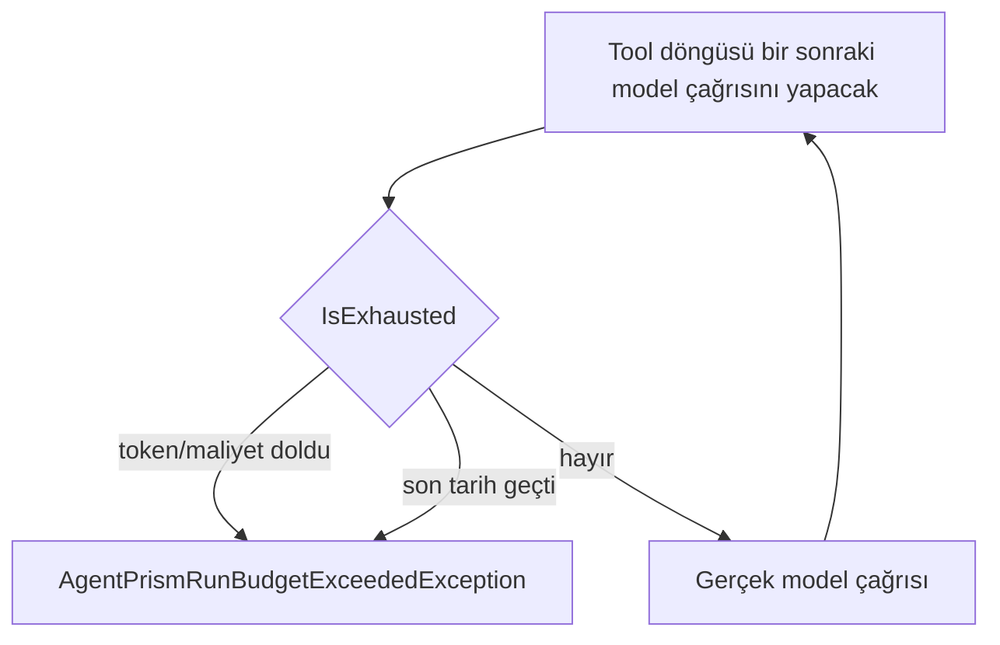

# Faz 128 — Run Ağacı Süre Bütçesi

> **Durum:** ✅ Tamamlandı (2026-09-01)
> **Kaynak:** [kesif/2026-08-31-tuketici-raporu-faz-adaylari.md](kesif/2026-08-31-tuketici-raporu-faz-adaylari.md) · **T-7**
> **Önkoşul:** [Faz 114](arsiv/fazlar/114-CALISTIRMA-ICI-BUTCE-TAVANI.md) (çalıştırma-içi bütçe tavanı, `RunBudgetChatClient`) — arşivde; **damıtılmış**, tam metin `git show 3fbdc7d:docs/arsiv/fazlar/114-CALISTIRMA-ICI-BUTCE-TAVANI.md`
> **Paketler:** `AgentPrism.Abstractions` (`Runs/AgentRunBudget.cs`), `AgentPrism.Core` (`Models/RunBudgetChatClient.cs`, `AgentPrismOptions.cs`)
> **Yeni paket:** Yok · **Migration:** Yok — tavan yapılandırmadan gelir
> **Public API:** Büyüyor — mevcut iki tipe birer alan. Faz 7'den önce ucuz: `wc -l src/*/PublicAPI.Shipped.txt` toplamı **17** satır (K-603)
> **Tüketici yüzeyi:** `docs-site/src/content/docs/concepts/governance.md`, `guides/production.md`, `capabilities.md` · sevk edilen: `AgentRunBudget` ve `AgentPrismAgentGraphOptions` XML dokümanları
> **Manuel test alanı:** `docs/manuel-test/23-SAKLAMA-ARSIV-KOTA.md`

---

## Bu Faza Başlarken

> `faz-baslangic` skill'ini uygula.

1. Bu doküman
2. Kararlar — dosyanın tamamını **okuma**:
   ```bash
   grep -n "K-627\|K-630\|K-603" docs/KARARLAR.md
   ```
   **K-630** (çalıştırma-içi bütçe kesmesi yeni bir `RunErrorClass` üyesi **açmadan** `QuotaExceeded`'a eşlenir — 🚨 bu faz de aynı eşlemeyi kullanır) · **K-627** (`RunErrorClass` değeri `9` kalıcı olarak emekli) · **K-603**
3. Alan hafızası:
   [`hafiza/olcum-kota-ve-secenekler.md`](hafiza/olcum-kota-ve-secenekler.md) (bütçe ve kota tuzakları; K-483'ün vakası burada) ·
   [`hafiza/model-boru-hatti.md`](hafiza/model-boru-hatti.md) (halka konumu)
4. Gerektiğinde: [`MIMARI-GUVENLIK.md`](MIMARI-GUVENLIK.md) — kota ve bütçe bölümü

---

## Amaç

`AgentRunBudget` token, maliyet, çocuk run sayısı ve derinlik taşır; **süre
taşımaz.** İterasyon tavanı bir iterasyonun ne kadar süreceğini sınırlamaz ve
tool timeout'u yalnız **tek bir çağrıyı** sınırlar. Uzun tool zinciri olan bir
run saatlerce sürebilir.

- **T-7** — Run ağacına bir süre boyutu; kesme noktası mevcut desene uyar.

### Karşı görüş ölçüldü — kalem ayakta

Aday metni dürüst bir itiraz taşıyordu: *"Faz 114 zaten çalıştırma-içi tavanı
koydu ve gerekçesi 'maliyet sayılmıyordu' idi. Süre, maliyetin dolaylı bir
vekilidir — ayrı bir boyut mu, yoksa gürültü mü?"*

Ölçüm itirazı **çürüttü**. Süre, maliyetin vekili değildir; ikisinin ayrıldığı
somut bir yol var:

| Senaryo | Token/maliyet tavanı ne yapar | Süre tavanı ne yapar |
|---|---|---|
| Her turda küçük bir model çağrısı, ama her tool 90 saniye bekliyor | **Hiçbir şey** — token az, maliyet düşük | Keser |
| Yavaş bir sağlayıcı, aynı token hacmi | Hiçbir şey | Keser |
| Kısa ama pahalı tek tur | Keser | Hiçbir şey |

Ve **kuyruğa alınmış run'da hiçbir dış zaman sınırı yoktur**:
`JobWorkerBackgroundService.cs:227` işi koşarken kirayı **sürekli yeniler**
(`StartLeaseRenewal`). HTTP isteğinin doğal zaman aşımı orada yoktur. Yani
dayanıklı çalıştırma yolunda bugün run'ı zamanla sınırlayan **hiçbir şey**
yoktur.

### Bugün ne çalışmıyor — doğrulanmış kanıt

| Kanıt | Gözlem |
|---|---|
| [`AgentRunBudget.cs:36-80`](../src/AgentPrism.Abstractions/Runs/AgentRunBudget.cs) | Dört boyut: `MaxTotalTokens`, `MaxTotalCost`, `MaxTotalRuns`, `MaxDepth`. Süre **yok** |
| [`AgentPrismOptions.cs:141-178`](../src/AgentPrism.Core/AgentPrismOptions.cs) | `AgentPrismAgentGraphOptions` aynı dört boyutu taşıyor |
| [`RunBudgetChatClient.cs:83-97`](../src/AgentPrism.Core/Models/RunBudgetChatClient.cs) | Kesme noktası **hazır**: `ThrowIfExhausted` her gerçek model çağrısından önce koşuyor |
| [`TimeoutAIFunction.cs:23-28`](../src/AgentPrism.Core/Tools/TimeoutAIFunction.cs) | Tool timeout yalnız **tek çağrıyı** sınırlar ve gövdeyi zorla durduramaz — dokümante edilmiş sınır |
| [`JobWorkerBackgroundService.cs:227`](../src/AgentPrism.Core/Scheduling/JobWorkerBackgroundService.cs) | Kuyruktaki iş koşarken kira **yenilenir**; süre üst sınırı yoktur |

> Kanıtlar 2026-08-31 tarihinde `8105c00` üzerinde doğrulandı.

---

## 128.1 — Beşinci boyut: `MaxDuration`

`AgentRunBudget` ağaç boyunca paylaşılan **tek** nesnedir (bilinçli olarak
`class`, `record` değil). Süre de o nesneye aittir: kök run başlar, bütün
çocuklar aynı son tarihi paylaşır.

```csharp
public sealed class AgentRunBudget
{
    /// <summary>The wall-clock time the whole tree may take. Null means no limit.</summary>
    public TimeSpan? MaxDuration { get; init; }

    /// <summary>The instant the tree's time runs out. Null when MaxDuration is null.</summary>
    public DateTimeOffset? Deadline { get; }
}
```

**`TimeSpan` yapılandırmadan gelir, `Deadline` ondan türetilir.** İkisi ayrı
alan olarak yapılandırılabilseydi tutarsız bir çift üretilebilirdi. Son tarih
bütçe nesnesi kurulurken **bir kez** hesaplanır; ağacın her dalı aynı anı görür.

🚨 **`TimeProvider` kullanılır, `DateTimeOffset.UtcNow` değil.** Süre bir
testin doğrulayabileceği tek şeydir ve gerçek saate bağlanan bir tavan ya
kırılgan bir testle ya da hiç testle sınanır. `RunReconciliationService` ve
`RunContinuationJobHandler` bu repo'da zaten `TimeProvider` alıyor.

## 128.2 — Kesme noktası: iki model turu arasında

Bu kural Faz 114'ün kararıdır ve değiştirilmez:

> *"The cutoff always lands between two model turns, never inside one — the
> decorator only ever refuses a call it has not yet made."*

Yani `MaxDuration`, `RunBudgetChatClient.ThrowIfExhausted`'ın içine **bir
kontrol daha** olarak girer. Akan bir yanıtın ortasında kesme yapılmaz; yarım
bir model mesajı bırakmak, bütçeyi zorlamaktan daha kötüdür.



Sonuç: **bir tool 90 dakika sürerse o tool kesilmez.** Kesme, o tool bittikten
sonra yapılacak ilk model çağrısında olur. Bu bir eksiklik değil, aynı
tasarımın devamıdır ve **dokümanda açıkça yazılır** — bir tüketici
`MaxDuration`'ı "sert bir zaman aşımı" sanmamalıdır.

`TryReserveRun` (çocuk run başlatma) da son tarihi kontrol eder: süresi dolmuş
bir ağaçta yeni çocuk run başlamaz.

## 128.3 — Hata sınıflandırması

K-630 aynen uygulanır: kesme **yeni bir `RunErrorClass` üyesi açmaz**, mevcut
`QuotaExceeded`'a eşlenir. `AgentPrismRunBudgetExceededException` yeniden
kullanılır; yalnız mesajı hangi boyutun dolduğunu söyler.

🚨 `AgentRunBudget.DescribeModelCallExhaustion()` bugün token ve maliyeti
anlatan **elle yazılmış** bir ifadedir. Ona üçüncü bir terim eklemek K-483'ün
tam sınıfıdır: mesajı üreten yer ile `IsExhausted`'ı hesaplayan yer aynı
listeyi görmelidir. Uygulayan oturum iki ifadeyi **tek** kaynaktan türetsin.

---

## Planlanan Public API

```csharp
// AgentPrism.Abstractions
public sealed class AgentRunBudget
{
    // … mevcut dört boyut …
    public TimeSpan? MaxDuration { get; init; }
    public DateTimeOffset? Deadline { get; }
}

// AgentPrism.Core
public sealed class AgentPrismAgentGraphOptions
{
    // … mevcut dört alan …
    /// <summary>Zero means no time limit. Default: zero (K1 — no surprise).</summary>
    public TimeSpan MaxDuration { get; set; }
}
```

**Varsayılan sıfırdır** — yani bugünkü davranış birebir korunur. Diğer dört
boyutun bir kısmı varsayılan bir tavan taşıyor (`MaxTotalTokens = 200_000`);
süre taşımaz, çünkü makul bir varsayılan süre yoktur: bir eval koşumu ile bir
sohbet turu aynı ölçekte değildir.

### HTTP `endpoint`'leri

Yok.

### Arayüz payı

Yok.

---

## Planlanan Dosya Listesi

```
src/AgentPrism.Abstractions/Runs/AgentRunBudget.cs   (değişir)
src/AgentPrism.Core/
├── AgentPrismOptions.cs                             (değişir — AgentGraph.MaxDuration + CreateBudget)
├── Models/RunBudgetChatClient.cs                    (değişir — son tarih kontrolü)
└── AgentPrismServiceCollectionExtensions.Binding.*.cs  (değişir — yapılandırma bağlama)

tests/AgentPrism.Core.UnitTests/Runs/RunDurationBudgetTests.cs   (yeni)
tests/AgentPrism.AspNetCore.FunctionalTests/RunDeadlineTests.cs  (yeni)

docs-site/src/content/docs/concepts/governance.md    (değişir)
docs-site/src/content/docs/guides/production.md      (değişir)
docs-site/src/content/docs/capabilities.md           (değişir)
```

---

## Hata Modları ve Testler

| Ne bozulabilir | Seviye | Test sınıfı |
|---|---|---|
| Son tarih geçti, bir sonraki model çağrısı yine de yapılıyor | Birim | `RunDurationBudgetTests` (sahte `TimeProvider`) |
| Kesme bir model turunun **ortasında** oluyor (yarım mesaj) | Fonksiyonel | `RunDeadlineTests` — son olay `RunFailed` olmalı, yarım mesaj değil |
| Çocuk run'lar kökten farklı bir son tarih görüyor | Birim | `RunDurationBudgetTests` |
| `MaxDuration` ayarlı değilken (sıfır) davranış değişiyor | Birim | `RunDurationBudgetTests` — regresyon |
| Hata `QuotaExceeded` yerine yeni bir sınıfa düşüyor | Birim | `RunDurationBudgetTests` — K-630 |
| Mesaj hangi boyutun dolduğunu söylemiyor | Birim | `RunDurationBudgetTests` |
| `DescribeModelCallExhaustion` ile `IsExhausted` farklı boyut listesi görüyor | Birim | `RunDurationBudgetTests` — 🚨 K-483 sınıfı |
| Kuyruktaki (dayanıklı) run'da son tarih uygulanmıyor | **Fonksiyonel** | `RunDeadlineTests` — sınır: kuyruk |
| Bağlam sıkıştırmanın özetleme çağrısı son tarihi görmüyor | Birim | `RunDurationBudgetTests` — aynı boru hattından geçer, görmelidir |
| İptal ile son tarih birbirine karışıyor (iptal `Canceled`, son tarih `QuotaExceeded` olmalı) | Fonksiyonel | `RunDeadlineTests` |
| Gerçek saate bağlanıp test kırılgan oluyor | — | `TimeProvider` zorunlu; DoD'de ayrı satır |
| Başka kiracının run'ı etkileniyor | — | Bütçe run ağacına özeldir, kiracı sınırı geçmez; gerekçe budur ve kiracı testi **gereksizdir** |

Beş soru: **iptal** → ayrı satır · **eşzamanlılık** → son tarih değişmez bir
değerdir, `Interlocked` gerekmez (diğer dört boyuttan farkı budur ve yazılır) ·
**boş/aşırı girdi** → sıfır ve negatif `TimeSpan` ile `TimeSpan.MaxValue` ·
**başka kiracı** → yukarıda gerekçelendi · **alt sistem hatası** → alt sistem yok.

---

## Manuel Kabul Case'leri

| # | Ön koşul | Adımlar | Beklenen sonuç |
|---|---|---|---|
| 1 | `AgentGraph.MaxDuration = 00:00:05`, her çağrısı 3 saniye süren bir tool | Çok turlu bir `run` | Run kesilir; `runs.error_class` = `QuotaExceeded`; kesme tool ortasında değil, tool bittikten sonraki model çağrısında |
| 2 | Aynı ayar, kuyruğa alınmış (`202 Accepted`) run | Aynı senaryo | Aynı davranış — kira yenilense de run kesilir |
| 3 | `MaxDuration` ayarlı değil | Uzun bir run | Davranış Faz 127 ile birebir aynı |
| 4 | `MaxDuration` dolmuşken kullanıcı ayrıca iptal eder | Cancel ucu | Hata sınıfı `Canceled`, `QuotaExceeded` değil |

---

## Açık Sorular

| # | Soru | Seçenekler | Öneri |
|---|---|---|---|
| 1 | `MaxDuration` çalışma isteğiyle (`AgentPrismRunOptions`) run başına geçilebilmeli mi? | A: Yalnız yapılandırma · B: İstek başına da | **A** — istek başına süre, çağıranın kendi son tarihini sunucuya dayatmasıdır; bugün ölçülmüş bir ihtiyaç yok. B istenirse ayrı kalem |
| 2 | Son tarih yaklaşırken bir uyarı olayı yazılmalı mı? | A: Hayır · B: Evet, varsayılan kapalı | **A** — olay hacmi artar; kesmenin kendisi zaten bir olaydır |
| 3 | Tool timeout'u kalan süreye göre kısaltılmalı mı? | A: Hayır · B: Evet | **A** — iki mekanizmayı birbirine bağlamak, birini değiştirmeyi diğerini bozmak hâline getirir. Ancak ölçülürse Açık Soru olarak kapanışta yazılır |

---

## Bitiş Ölçütleri (DoD)

- [x] `MaxDuration` dolduğunda bir sonraki model çağrısı **yapılmaz**; run `QuotaExceeded` ile kapanır — `AgentRunBudgetDurationTests`, `RunDeadlineTests`, gerçek koşum (aşağıda)
- [x] Kesme her zaman iki model turu arasındadır; kesilen run'ın son olayı yarım bir model mesajı **değildir** — gerçek koşumda ölçüldü ve çıktı belgeye yazıldı: `docs/manuel-test/23-SAKLAMA-ARSIV-KOTA.md` §6, MT-RET-060/061 (2026-09-01, `samples/AgentPrism.Api`, gerçek OpenAI çağrısı)
- [x] Çocuk run'lar kökle **aynı** son tarihi görür — `AgentRunBudget` paylaşılan TEK nesnedir (değişmedi); `ChildAgentInvokerTests.Budget_is_a_SINGLE_instance_across_the_tree` + `New_child_run_does_not_start_once_the_deadline_has_passed`
- [x] Kuyruğa alınmış run'da da son tarih uygulanır — `RunDeadlineTests.Deadline_is_enforced_on_the_queued_durable_run_path_too` + gerçek koşum (MT-RET-063, 2026-09-01, 1 saniyede tamamlandı)
- [x] `MaxDuration` ayarlı değilken (sıfır) davranış bugünküyle **aynıdır** — `RunDeadlineTests.No_MaxDuration_set_leaves_todays_behavior_unchanged` + gerçek koşum (MT-RET-062)
- [x] Kesme mesajı hangi boyutun dolduğunu söyler; mesaj ile `IsExhausted` **tek** kaynaktan türer (K-483) — `AgentRunBudget.DescribeExceededLimit()`/`IsExhausted` aynı `IsTokenBudgetExhausted`/`IsCostBudgetExhausted`/`IsDurationBudgetExhausted` üçlüsünü okur; `AgentRunBudgetDurationTests.DescribeModelCallExhaustion_and_IsExhausted_derive_from_the_SAME_deadline_check`
- [x] Süre `TimeProvider` üzerinden okunur; hiçbir test gerçek saate bağlı değildir — `AgentRunBudget`'ın kendi kurucusu (`TimeSpan? maxDuration, TimeProvider? timeProvider`) `Deadline`'ı `TimeProvider.GetUtcNow()` üzerinden kurar; birim testleri `ManualTimeProvider` kullanır (fonksiyonel `RunDeadlineTests` kuyruklu case'i hariç — bkz. Plandan Sapmalar)
- [x] Dört doğrulama kapısı sıfır uyarı verir — `python3 scripts/kapi.py kapanis --taban HEAD` (2026-09-01): tarama, `dokuman-bakim --denetle`, `dotnet build`, tam çözüm testi (517,85 sn), `dotnet pack`, `dotnet format --verify-no-changes`, `npm run check` — hepsi ✅
- [x] `samples/AgentPrism.Api` ile gerçek `run` yapıldı, çıktı belgeye yazıldı — `docs/manuel-test/23-SAKLAMA-ARSIV-KOTA.md` §6 (MT-RET-060..063)
- [x] `secret` taraması boş döndü — `python3 scripts/kapi.py tarama` temiz
- [x] Manuel kabul case'leri `docs/manuel-test/23-SAKLAMA-ARSIV-KOTA.md` içine eklendi — MT-RET-060..064
- [x] `faz-denetim` koşuldu; 🔴 bulgu kalmadı — bkz. "Denetim Bulguları"
- [x] `docs-site/` güncellendi; `npm run build` + `check-links.mjs` temiz — `reliability.md`, `governance.md`, `production.md`, `capabilities.md`

### Doğrulama komutları

```bash
# Süre tavanı gerçekten kesiyor mu
./artifacts/bin/AgentPrism.Core.UnitTests/release/AgentPrism.Core.UnitTests --filter-method "*AgentRunBudgetDuration*"

# Kuyruktaki run'da (sınır: kuyruk)
./artifacts/bin/AgentPrism.AspNetCore.FunctionalTests/release/AgentPrism.AspNetCore.FunctionalTests --filter-method "*RunDeadline*"
```

---

## Riskler

| Risk | Önlem |
|------|-------|
| Tüketici `MaxDuration`'ı sert zaman aşımı sanır ve uzun bir tool'un kesileceğini bekler | Sınır `concepts/governance.md`'de **açıkça** yazılır; tool timeout'u ile farkı aynı paragrafta anlatılır |
| Mesaj ifadesi ile `IsExhausted` ifadesi ayrışır | DoD'de ayrı satır; K-483'ün vakası hafızada yazılı |
| Testler gerçek saate bağlanıp kırılganlaşır | `TimeProvider` DoD'de ayrı satır |
| Varsayılan bir süre konulur ve var olan uzun run'lar sessizce kesilir | Varsayılan **sıfır**; K1'in gereği ve DoD'de regresyon satırı var |

---

<!-- ============================================================
     AŞAĞISI KAPANIŞTA DOLDURULUR — `faz-tamamlama` skill'i.
     Plan anında boş kalır. Başlıkları SİLME.
     ============================================================ -->

## Plandan Sapmalar

1. **`AgentRunBudget` bir kurucu kazandı; plan yalnız "iki alan" diyordu.**
   Plan `MaxDuration`/`Deadline`'ı `{ get; init; }`/`{ get; }` çifti olarak
   taslak çiziyordu ama "Deadline bir kez hesaplanır" gereksinimi bir
   `TimeProvider`'ın BİR YERDE tutulmasını zorunlu kıldı. `RunBudgetChatClient`
   veya `TryReserveRun`'a parametre eklemek yerine `TimeProvider`
   `AgentRunBudget`'ın kendi `private readonly` alanında tutuldu
   (kurucu: `AgentRunBudget(TimeSpan? maxDuration = null, TimeProvider? timeProvider = null)`).
   Sonuç: `IsExhausted` artık `IsTokenBudgetExhausted || IsCostBudgetExhausted
   || IsDurationBudgetExhausted` üçlüsünü okur ve `RunBudgetChatClient.
   ThrowIfExhausted()`/`TryReserveRun()` **HİÇ değişmeden** yeni boyutu otomatik
   kapsar — mermaid akışındaki tek `IsExhausted` kararı koda birebir yansıdı.
2. **`AgentPrismAgentGraphOptions.CreateBudget()` imzası kırıldı** →
   `CreateBudget(TimeProvider timeProvider)`. Plan bunu açıkça yazmamıştı;
   `Deadline`'ın `TimeProvider` üzerinden bir kez hesaplanması gereksinimi
   zorunlu kıldı. İki çağıran zaten kendi `_timeProvider` alanını taşıyordu
   (`RunRecordingAgent.Lifecycle.cs`, `WorkflowRunner.cs`) — çağıran tarafta
   ek bir bağımlılık gerekmedi. Pre-1.0/`Unshipped` olduğu için kırıcı
   değişiklik bir uyumluluk sorunu değildir (K-603).
3. **Birim testi dosyası `tests/AgentPrism.Core.UnitTests/Runs/
   RunDurationBudgetTests.cs` yerine `Graph/AgentRunBudgetDurationTests.cs`
   olarak açıldı.** `faz-uygulama`'nın "planın yapısal iddiasını kabul etmeden
   ölç" kuralı: kardeş dosyalar (`AgentRunBudgetTests.cs`,
   `AgentRunBudgetCostTests.cs`) zaten `Graph/` altındaydı — `AgentRunBudget`
   kaynağı `Abstractions/Runs/` altında olsa da testleri tarihsel olarak
   `Graph/` altında yaşıyor; tutarlılık planın tahmin ettiği yoldan ağır bastı.
4. **Kuyruklu (dayanıklı) fonksiyonel testte sahte `TimeProvider` KULLANILMADI.**
   İlk denemede `services.AddSingleton<TimeProvider>(fakeClock)` tüm host'a
   (`JobWorkerBackgroundService` dahil) uygulandı — kira yenileme/poll döngüsü
   AYNI sahte saati okuyor ve saat yalnız test kodunun elle `Advance()`
   çağırdığı anlarda ilerlediği için o döngü **sonsuza kadar donuyor** (ölçüldü:
   test 30 saniyede zaman aşımına uğradı, run hiç `Queued`'dan çıkmadı). Çözüm:
   `Deadline_is_enforced_on_the_queued_durable_run_path_too` testi GERÇEK saat +
   kısa gerçek `MaxDuration` (200ms) + kısa gerçek tool gecikmesi (`Task.Delay`
   500ms) kullanır; senkron testler sahte saatle kalmaya devam eder. Tuzak
   `docs/hafiza/test-kosum-tuzaklari.md`'ye eklendi.
5. **`docs/manuel-test/23-SAKLAMA-ARSIV-KOTA.md`'nin "gerçek koşum" bölümü
   pre-existing bir `secret` yapılandırma sürüklenmesini ortaya çıkardı ve
   düzeltti (kusur değil, kod dışı).** `samples/AgentPrism.Api`'nin yerel
   `dotnet user-secrets`'ı `AgentPrism:ContentProtection:RawKeys:sample2`
   taşıyordu, ama `appsettings.json`'ın `ActiveKeyId` alanı `"sample"` bekliyordu
   — muhtemelen eski bir oturumdan kalma adlandırma kayması. Etkisi: içerik
   koruması `AgentPrismException` fırlatınca `RunRecordingAgent` **kayıt
   yazmayı bu run için devre dışı bırakır** (tasarlanan davranış — bkz.
   `docs/hafiza/`'nın "gözlemlenebilirlik işlevselliği bozmaz" kuralı) ve run
   `Running`'de asılı kalır; asıl bütçe kesmesi doğru çalışır (HTTP yanıtı doğru
   gövdeyi taşır) ama `GET /api/runs/{id}` hiçbir zaman `Failed`'e ulaşmaz.
   Yerel `secret` düzeltildi (`dotnet user-secrets set
   "AgentPrism:ContentProtection:RawKeys:sample" ...`); repo koduna dokunulmadı
   çünkü kod TASARLANDIĞI gibi davrandı. MT-RET-060/061/063'ün ölçümleri
   düzeltmeden SONRA alındı.

## Bu Fazda Verilen Kararlar

Yok — kesme, K-627/K-630'un zaten karara bağladığı `QuotaExceeded`
sınıflandırmasını aynen yeniden kullanır; yeni bir public API/uyumluluk
sözleşmesi, güvenlik sınırı veya kalıcı veri kararı alınmadı. `AgentRunBudget`
kurucusu ve `CreateBudget` imza değişikliği yerel implementation tercihidir
(bkz. Plandan Sapmalar #1-2), `K-*` kaydı gerektirmez.

## Gerçekleşen Public API

```csharp
// AgentPrism.Abstractions
AgentPrism.AgentRunBudget.AgentRunBudget(System.TimeSpan? maxDuration = null, System.TimeProvider? timeProvider = null) -> void
AgentPrism.AgentRunBudget.Deadline.get -> System.DateTimeOffset?
AgentPrism.AgentRunBudget.IsDurationBudgetExhausted.get -> bool
AgentPrism.AgentRunBudget.MaxDuration.get -> System.TimeSpan?

// AgentPrism.Core
AgentPrism.AgentPrismAgentGraphOptions.CreateBudget(System.TimeProvider! timeProvider) -> AgentPrism.AgentRunBudget!   // imza değişti, bkz. Plandan Sapmalar #2
AgentPrism.AgentPrismAgentGraphOptions.MaxDuration.get -> System.TimeSpan
AgentPrism.AgentPrismAgentGraphOptions.MaxDuration.set -> void
```

`AgentRunBudget`'ın eski parametresiz kurucusu (`AgentRunBudget()`) kaldırıldı;
her iki yeni parametre de varsayılan taşıdığı için `new AgentRunBudget()` ve
`new AgentRunBudget { MaxTotalTokens = ... }` gibi mevcut çağrı biçimleri
kaynak-uyumlu kaldı (binary uyumluluk pre-1.0'da garanti edilmiyor, K-603).

## Dosya Listesi (gerçekleşen)

```
src/AgentPrism.Abstractions/Runs/AgentRunBudget.cs                (değişti)
src/AgentPrism.Abstractions/PublicAPI.Unshipped.txt                (değişti)
src/AgentPrism.Core/AgentPrismOptions.cs                            (değişti — AgentPrismAgentGraphOptions.MaxDuration + CreateBudget(TimeProvider))
src/AgentPrism.Core/AgentPrismServiceCollectionExtensions.Binding.Models.cs  (değişti — BindAgentGraph)
src/AgentPrism.Core/PublicAPI.Unshipped.txt                        (değişti)
src/AgentPrism.Core/Recording/RunRecordingAgent.Lifecycle.cs       (değişti — CreateBudget(_timeProvider))
src/AgentPrism.Workflows/Internal/WorkflowRunner.cs                (değişti — CreateBudget(_timeProvider))

tests/AgentPrism.Core.UnitTests/Graph/AgentRunBudgetDurationTests.cs   (yeni — plan Runs/RunDurationBudgetTests.cs öneriyordu, bkz. Plandan Sapmalar #3)
tests/AgentPrism.Core.UnitTests/Graph/ChildAgentInvokerTests.cs       (değişti — TryReserveRun × son tarih case'i eklendi)
tests/AgentPrism.Core.UnitTests/Graph/AgentRunBudgetTests.cs          (değişti — CreateBudget(TimeProvider.System) çağrıları güncellendi)
tests/AgentPrism.Core.UnitTests/Graph/AgentRunBudgetCostTests.cs      (değişti — aynı sebep)
tests/AgentPrism.AspNetCore.FunctionalTests/RunDeadlineTests.cs       (yeni)
tests/AgentPrism.AspNetCore.FunctionalTests/Infrastructure/ManualTimeProvider.cs  (yeni)

docs-site/src/content/docs/guides/reliability.md      (değişti — asıl `AgentGraph.*` tablosu burada yaşıyor, plan bunu listelemiyordu)
docs-site/src/content/docs/concepts/governance.md     (değişti)
docs-site/src/content/docs/guides/production.md       (değişti)
docs-site/src/content/docs/capabilities.md            (değişti)
docs-site/public/llms.txt, llms-full.txt              (yeniden üretildi — build-agent-map.mjs)

docs/manuel-test/23-SAKLAMA-ARSIV-KOTA.md   (değişti — §6, MT-RET-060..064)
docs/manuel-test/00-INDEKS.md               (değişti — satır 23 güncellendi)
```

## Denetim Bulguları

Bağımsız denetim (2026-09-01, taze bağlamlı ayrı agent): **🔴 yok.**

| # | Seviye | Bulgu | Sonuç |
|---|---|---|---|
| 1 | 🟡 | `RunErrorClass.QuotaExceeded`'ın XML doc'u yalnız "token/cost budget ran out" diyordu; süre bu fazdan sonra aynı sınıfa düşüyor ama enum üyesinin dokümanı güncellenmemişti (`src/AgentPrism.Abstractions/Runs/RunErrorClass.cs:38-42`). | **Düzeltildi** — "token, cost, or time budget" olarak güncellendi. |
| 2 | 🟢 | `samples/AgentPrism.Api`'de içerik koruması bir `AgentPrismException` fırlattığında `RunRecordingAgent` o run için kayıt yazmayı durduruyor (tasarlanan davranış) ve run `Running`'de asılı kalabiliyor — kapsam dışı, bu fazın `MaxDuration` işiyle ilgisi yok. | **Devredildi** — `docs/ADAYLAR.md`'ye taşınmadı (yerel `secret` yapılandırma sürüklenmesiydi, ürün kusuru değil; bkz. Plandan Sapmalar #5). |

Sekiz başlığın (3.1–3.8) tamamı temiz çıktı; denetçinin tam raporu bu oturumun
kayıtlarındadır, özetlendi.

## Sonraki Faza Devir Notu

- **Beşinci bir bütçe boyutu eklenecekse aynı deseni izle.** Token/maliyet
  gibi `Interlocked` sayaçlı bir boyut DEĞİLSE (yani "bir kez hesapla, sonra
  karşılaştır" türündeyse — `Deadline` gibi), yeni bir yardımcı parametre
  `RunBudgetChatClient`/`ChildAgentInvoker`'a EKLEMEYE gerek yok:
  `AgentRunBudget`'ın kendi `private readonly` alanına taşı ve `IsExhausted`'a
  bir OR dalı ekle — kesme noktası ve mesaj üretimi (`DescribeExceededLimit`)
  otomatik kapsar.
- **🚨 Fonksiyonel testte global bir sahte `TimeProvider` kaydetme.**
  `JobWorkerBackgroundService`'in kendi poll/kira-yenileme döngüsü DE aynı
  `TimeProvider`'ı okur; elle ilerleyen bir sahte saat o döngüyü SONSUZA KADAR
  dondurur (bkz. Plandan Sapmalar #4). Kuyruklu/arka-plan bir senaryoyu test
  ederken ya gerçek saat + kısa gerçek süre kullan, ya da yalnız SENKRON
  (job worker'sız) yolu sahte saatle test et.
- **`AgentGraph.MaxDuration` şu an yalnız yapılandırmadan gelir** (Açık Soru
  1, seçenek A). İstek başına (`AgentPrismRunOptions.MaxDuration`) bir ihtiyaç
  ölçülürse ayrı bir kalem olarak açılmalı — bu fazda AÇILMADI.
- Örnek uygulamanın (`samples/AgentPrism.Api`) yerel `dotnet user-secrets`
  deposu `AgentPrism:ContentProtection:RawKeys:sample` anahtarını artık
  taşıyor (bu oturumda düzeltildi, bkz. Plandan Sapmalar #5) — gelecekteki bir
  manuel test oturumu bu anahtarı tekrar eksik bulursa bu NOT'a bakabilir.
