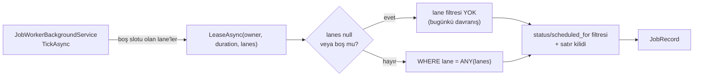

# Faz 129 — İş Kuyruğu `lane`'leri

> **Durum:** ✅ Tamamlandı (2026-09-01)
> **Kaynak:** [kesif/2026-09-01-tuketici-feature-talepleri.md](kesif/2026-09-01-tuketici-feature-talepleri.md) — **F-172**
> **Önkoşul:** Yok
> **Paketler:** `AgentPrism.Abstractions`, `.Core`, `.Sql.Shared`, `.PostgreSql`, `.SqlServer`, `.Sqlite`, `.AspNetCore`, `.UI`, `.Testing.Contracts.Xunit`
> **Yeni paket:** Yok · **Migration:** gerekli — üç set (PostgreSQL · SqlServer · Sqlite); numara uygulama anında alınır
> **Public API:** büyüyor **ve bir imza kırıyor** (`IJobStore.LeaseAsync`). `wc -l src/*/PublicAPI.Shipped.txt` → her dosya 1 satır; shipped giriş **sıfır**, yani bugün kırmak bedava, Faz 7'den sonra bir sürüm kararı
> **Tüketici yüzeyi:** `docs-site/`: `guides/background-work.md`, `guides/write-your-own-store.md`, `reference/configuration.md`, `ui.md` (+ jobs ekran görüntüsü); `http-api/` ve `api/` **üretilir** — oradaki iş XML dokümanı ve `.Produces` üstverisidir · sevk edilen: `IJobStore`/`JobRecord` XML dokümanı, `capabilities.md` satırı
> **Manuel test alanı:** [`docs/manuel-test/16-IS-KUYRUGU-VE-ZAMANLAMA.md`](manuel-test/16-IS-KUYRUGU-VE-ZAMANLAMA.md)

---

## Bu Faza Başlarken

> `faz-baslangic` skill'ini uygula. Aşağıdaki liste o skill'in 2. adımıdır —
> **tamamını değil, yalnız işaret edilen bölümleri oku.**

1. Bu doküman
2. Kararlar — dosyanın tamamını **okuma**, yalnız bu kalemleri grep'le:
   ```bash
   grep -n "K-178\|K-421\|K-413" docs/KARARLAR.md
   ```
   **K-178** (migration numaraları sağlayıcı başına bağımsızdır), **K-421**
   (`EnablePublicApiTracking` açıktır), **K-413** (`YOL-HARITASI.md` üretilir).
3. [Faz 120](arsiv/fazlar/120-JOB-SOZLESMESI-AT-LEAST-ONCE.md) — yalnız devir notu:
   ```bash
   awk '/## Sonraki Faza Devir Notu/,0' docs/arsiv/fazlar/120-JOB-SOZLESMESI-AT-LEAST-ONCE.md
   ```
   `IJobHandler`'ın at-least-once sözleşmesini ve `JobHandlerContract`'ı o faz
   yazdı. Bu faz aynı sözleşmeyi **bozmadan** lease sorgusunu daraltır.
4. Alan hafızası (bu faz üç alana dokunuyor):
   [`hafiza/sql-saglayicilari.md`](hafiza/sql-saglayicilari.md) (üç lehçede
   elle yazılmış sorgu), [`hafiza/postgresql.md`](hafiza/postgresql.md)
   (index ve `FOR UPDATE SKIP LOCKED`),
   [`hafiza/frontend.md`](hafiza/frontend.md) (jobs ekranı ve sözlük).
5. Gerektiğinde, tamamı değil ilgili bölümü:
   [`MIMARI.md`](MIMARI.md) — zamanlama ve iş kuyruğu bölümü.

---

## Amaç

AgentPrism'in iş kuyruğu bugün **tek havuzdur**. Dokuz `JobKind` aynı sırayı ve
aynı `MaxConcurrentJobs` bütçesini paylaşır. Kaynak profili çok farklı işler
birbirini bekletir: uzun süren bir toplu koşu, saniyeler süren bir
`ApprovalResume`'u slot boşalana kadar tutar. Bu bir throughput sorunu değil,
iş türleri arasında **head-of-line blocking**'dir.

Bu faz kuyruğa `lane` kavramını ekler. Bir job bir `lane` taşır. Worker yalnız
seçtiği `lane`'lere abone olur. Her `lane` kendi eşzamanlılık bütçesini alabilir.

- **F-172** — job kaydına `lane` kimliği, worker'a `lane` aboneliği, `lane`
  başına eşzamanlılık sınırı ve `lease` sorgusunda `lane` filtresi.

### Kapsam dışı — bilerek

| Kalem | Neden bu fazda değil |
|---|---|
| `lane` başına metrik (queued/leased/failed/duration) | `AgentPrismMetrics` bugün **hiç job metriği taşımıyor**. Bu, olmayan bir metrik ailesini sıfırdan kurmaktır; ayrı faz |
| Priority (öncelik) | Tüketici de "önce izolasyon" diyor. Öncelik `lane` içi sıralama sorunudur ve `lane` olmadan tanımsızdır |
| `lane` kayıt defteri (önceden tanımlı `lane` listesi) | `lane` bir etikettir, yaşam döngüsü yoktur. Tablo, yabancı anahtar ve yönetim ucu gerektirirdi |

### Bugün ne çalışmıyor — doğrulanmış kanıt

| Kanıt | Gözlem |
|---|---|
| [`JobRecord.cs`](../src/AgentPrism.Abstractions/Scheduling/JobRecord.cs) | `Lane` alanı yok; `grep -c Lane` → **0** |
| [`IJobStore.cs:44`](../src/AgentPrism.Abstractions/Scheduling/IJobStore.cs) | `LeaseAsync(owner, leaseDuration, ct)` — `lane` filtresi almaz. `lease`'e tek giriş budur |
| [`AgentPrismSchedulingOptions.cs`](../src/AgentPrism.Abstractions/Scheduling/AgentPrismSchedulingOptions.cs) | `MaxConcurrentJobs`, `PollInterval`, `LeaseDuration`, `MaxAttempts`, `MaxItemsPerJob` — hepsi **global** |
| [`JobWorkerBackgroundService.cs:64`](../src/AgentPrism.Core/Scheduling/JobWorkerBackgroundService.cs) | Tek `SemaphoreSlim(Math.Max(1, options.MaxConcurrentJobs))`; tüm iş türleri aynı slotları yarışır |
| [`JobWorkerBackgroundService.cs:118`](../src/AgentPrism.Core/Scheduling/JobWorkerBackgroundService.cs) | `jobStore.LeaseAsync(_ownerId, options.LeaseDuration, stoppingToken)` — hangi iş geldiyse alır |
| [`JobKind.cs`](../src/AgentPrism.Abstractions/Scheduling/JobKind.cs) | **Dokuz** değer: `AgentBatch`, `Workflow`, `Eval`, `WebhookDelivery`, `Retention`, `AgentRun`, `OnlineEval`, `ApprovalResume`, `RunContinuation` — hepsi aynı kuyrukta |
| [`0008_scheduling.sql:49`](../src/AgentPrism.PostgreSql/Migrations/0008_scheduling.sql) | `jobs_claim_idx ON jobs (status, scheduled_for) WHERE status IN (0,1)` — `lane` sütunu yok |
| `PostgresQueries.cs:1105` · `SqlServerQueries.cs:1268` · `SqliteQueries.cs:1120` | `LeaseJob` sorgusu **üç kez elle** yazılmış; her biri kendi kilitleme lehçesini kullanır |
| [`AgentPrismMetrics.cs`](../src/AgentPrism.Core/Diagnostics/AgentPrismMetrics.cs) | Sayaçlar: run, run duration, token, tool, tool duration, run cost, judge cost, judge score, model cache, agent source. **Job veya kuyruk metriği yok** |
| `Registration.Storage.cs:307` | Worker `TryAddEnumerable(Singleton<IHostedService, JobWorkerBackgroundService>)` ile kayıtlı. `TryAddEnumerable` **implementation tipine göre** tekilleştirir; "her `lane` için ayrı worker kaydı" bu şekille çalışmaz |
| `grep -rn "new JobRecord" src/` | **On** üretim çağrı yeri (+ `TestData.cs`). `lane` eklenirken her gövde tek tek izlenmelidir |

> Kanıtlar 2026-09-01 tarihinde doğrulandı.

---

## 129.1 — `lane` kimliği

`lane`, `jobs` tablosunda bir sütundur. Yeni tablo yoktur.

- `JobRecord.Lane` — `string`, varsayılanı `JobLanes.Default` (`"default"`).
  Alan `required` **değildir**; eski nesne başlatıcıları derlenmeye devam eder.
- Migration: `ALTER TABLE {schema}.jobs ADD COLUMN lane text NOT NULL DEFAULT 'default'`.
  Mevcut satırlar `default` `lane`'e düşer.
- `JobSchedule.Lane` — aynı varsayılan. Bir cron'un ürettiği job `lane`'i
  şablonundan devralır (`JobWorkerBackgroundService.cs:337` civarındaki
  `new JobRecord`). Aynı migration `job_schedules` tablosuna da sütunu ekler.

### `lane` adı biçimi — `enqueue` anında zorlanır

Ad `^[a-z0-9][a-z0-9._-]{0,63}$` kalıbına uymalıdır. Uymayan ad
`EnqueueAsync` çağrısında **reddedilir**; kuyruğa yazılmaz.

🚨 Küçük harf zorunluluğu bir tercih değil, ölçülmüş bir kusur sınıfının
kapatılmasıdır: sağlayıcı adının büyük/küçük harf farkı ayrı bir migration
gerektirdi (`0038_provider_name_case.sql`). `lane` adı `ordinal`
karşılaştırılır; büyük harfe izin verilirse `Media` ile `media` iki ayrı
`lane` olur ve iş sessizce beklemede kalır.

**Bilinmeyen `lane` `enqueue` anında hata vermez.** Hangi worker'ın hangi
`lane`'e abone olduğu dağıtık kurulumda `enqueue` anında bilinemez. Bunun
yerine `lane` `/api/jobs` filtresine ve jobs ekranına çıkar; kimsenin
dinlemediği bir `lane`'de biriken işler orada görünür. Kesin çözüm metrik
fazındadır (Risk tablosuna bakın).

## 129.2 — `lease` sorgusunun daralması

`IJobStore.LeaseAsync` bir `lane` listesi alır.



`lanes` `null` veya boşsa filtre uygulanmaz. Bu, **bugünkü davranışın
aynısıdır** ve `JobStoreContract`'ın mevcut case'leri değişmeden geçer.

Sorgu üç lehçede ayrı ayrı güncellenir. Her lehçe kendi kilitleme biçimini
korur; **yalnız `WHERE` yan tümcesi büyür**.

### Index

`jobs_claim_idx` `(lane, status, scheduled_for)` olarak yeniden oluşturulur;
kısmi koşul (`WHERE status IN (0,1)`) korunur. `lane` en soldadır: filtre önce
`lane`'i daraltır, sonra sıralama sütunu gelir.

## 129.3 — Worker aboneliği

```csharp
public sealed class AgentPrismSchedulingOptions
{
    // ... mevcut alanlar korunur ...

    /// <summary>Bu worker'ın abone olduğu lane'ler. null = hepsi (bugünkü davranış).</summary>
    public IReadOnlyList<string>? Lanes { get; set; }

    /// <summary>Lane başına eşzamanlılık. Listelenmeyen lane MaxConcurrentJobs'u paylaşır.</summary>
    public IDictionary<string, int> MaxConcurrentJobsPerLane { get; }

    /// <summary>JobKind → lane eşlemesi. Boş = her şey "default".</summary>
    public IDictionary<JobKind, string> LaneByKind { get; }
}
```

**K1 — sıfır sürpriz.** `Lanes` varsayılanı `null`'dır. Hiçbir ayar
yapılmayan bir kurulum bugünkü davranışı **birebir** korur: worker her
`lane`'den `lease` alır, tek semafor kullanır ve her job `default` `lane`'e
yazılır. `lane` izolasyonu tamamen opt-in'dir.

**Neden tek worker + `lane` başına options, çoklu worker kaydı değil?**
Worker `TryAddEnumerable(Singleton<IHostedService, JobWorkerBackgroundService>)`
ile kayıtlıdır ve `TryAddEnumerable` implementation tipine göre tekilleştirir.
`AddAgentPrismWorker("media", ...)` biçimi ikinci bir kaydı sessizce düşürürdü.
Ayrı süreçlerde ayrı kapasite isteyen tüketici, ayrı `host`'ları farklı `Lanes`
değeriyle çalıştırır — talebin asıl istediği evrim yolu budur.

## 129.4 — `lane` başına eşzamanlılık

Worker tek semafor yerine `lane` başına semafor tutar:

- `MaxConcurrentJobsPerLane` içinde adı geçen her `lane` kendi semaforunu alır.
- Adı geçmeyen `lane`'ler **ortak** `MaxConcurrentJobs` semaforunu paylaşır.
- Her `poll` turunda worker **yalnız boş slotu olan `lane`'leri** `LeaseAsync`'e
  geçirir. Slotu dolu bir `lane`'in işi hiç `lease` edilmez.

🚨 Job'u `lease` edip sonra geri bırakmak **yapılmaz**. `ReleaseForRetryAsync`
`attempt` sayacını etkilemez ama `lease` gürültüsü üretir ve `JobRecord.Attempt`
zaten `lease` anında artmıştır (`IJobStore` XML dokümanı). Filtre sorguda
uygulanır, kodda değil.

**Starvation.** Slotu boş `lane` listesi her turda yeniden hesaplanır ve sorgu
`scheduled_for` sırasını korur. Sürekli dolu bir `lane` diğerlerinin sorgusunu
etkilemez; bu, tek havuzda mümkün değildi.

## 129.5 — Görünürlük

| Yüzey | Değişiklik |
|---|---|
| `JobQuery.Lane` | `null` = filtre yok |
| `GET /api/jobs?lane=` | Yeni sorgu parametresi |
| `POST /api/agents/{name}/batch` ve schedule oluşturma | İstek gövdesi isteğe bağlı `lane` alır |
| Jobs ekranı | `lane` sütunu + filtre. Yeni metin `locales/en.ts` **ve** `tr.ts`'e girer (eksik anahtar derleme hatasıdır, K-228) |
| `JobRecord` yanıtı | `lane` alanı; OpenAPI → TypeScript istemci zinciri yeniden üretilir |

---

## Planlanan Public API

> Taslak imzalardır. Gerçekleşen imzalar kapanışta ayrı bölüme yazılır.

```csharp
// AgentPrism.Abstractions
public static class JobLanes
{
    public const string Default = "default";
    public static bool IsValidName(string? name);
}

public sealed record JobRecord
{
    public string Lane { get; init; } = JobLanes.Default;   // yeni
}

public sealed record JobSchedule
{
    public string Lane { get; init; } = JobLanes.Default;   // yeni
}

public sealed record JobQuery
{
    public string? Lane { get; init; }                      // yeni
}

public interface IJobStore
{
    // 🚨 KIRICI: lanes parametresi cancellationToken'dan ÖNCE gelir.
    // Eski konumsal çağrı (owner, duration, ct) artık DERLENMEZ.
    // Bu bilinçlidir: derleme hatası, her implementasyonun gözden
    // geçirilmesini zorlar. Shipped API boş olduğu için bedeli bugün sıfırdır.
    ValueTask<JobRecord?> LeaseAsync(
        string owner,
        TimeSpan leaseDuration,
        IReadOnlyList<string>? lanes,
        CancellationToken cancellationToken = default);
}

// AgentPrism.Abstractions — AgentPrismSchedulingOptions
public IReadOnlyList<string>? Lanes { get; set; }
public IDictionary<string, int> MaxConcurrentJobsPerLane { get; }
public IDictionary<JobKind, string> LaneByKind { get; }
```

### HTTP `endpoint`'leri

| Metot | Yol | Rol | Ne yapar |
|---|---|---|---|
| `GET` | `/api/jobs?lane=<ad>` | Reader | Job listesini `lane`'e göre süzer |
| `POST` | `/api/agents/{name}/batch` | Operator | İstek gövdesinde isteğe bağlı `lane` alır |
| `PUT` | `/api/schedules/{name}` | Operator | Şablona `lane` yazar |

Yeni uç yoktur. Sunucu yanıtları çevrilmez (K-232).

### Arayüz payı

Jobs ekranına bir sütun ve bir filtre girer. Bugünkü paket:
`index-*.js.br` 148 807 B, `index-*.css.br` 5 497 B (bütçe 250 KB gzip).
Kapanışta yeniden ölçülür ve yazılır.

---

## Planlanan Dosya Listesi

```
src/AgentPrism.Abstractions/Scheduling/
├── JobLanes.cs                 (yeni)
├── JobRecord.cs                (Lane)
├── JobSchedule.cs              (Lane)
├── JobSupportTypes.cs          (JobQuery.Lane)
├── IJobStore.cs                (LeaseAsync imzası)
└── AgentPrismSchedulingOptions.cs (Lanes, MaxConcurrentJobsPerLane, LaneByKind)

src/AgentPrism.Core/Scheduling/
├── JobWorkerBackgroundService.cs        (lane başına semafor, lease çağrısı, schedule→job)
├── InMemoryJobStore.cs                  (lane filtresi)
└── AgentPrismSchedulingOptionsValidator.cs (lane adı ve pozitif slot doğrulaması)

src/AgentPrism.Sql.Shared/Stores/SqlJobStore.cs      (lane parametresi)
src/AgentPrism.Sql.Shared/Internal/SqlQueriesBase.cs (gerekiyorsa ikinci sorgu alanı)
src/AgentPrism.PostgreSql/Internal/PostgresQueries.cs   (LeaseJob)
src/AgentPrism.SqlServer/Internal/SqlServerQueries.cs   (LeaseJob)
src/AgentPrism.Sqlite/Internal/SqliteQueries.cs         (LeaseJob)
src/AgentPrism.{PostgreSql,SqlServer,Sqlite}/Migrations/NNNN_job_lanes.sql (üç set)

src/AgentPrism.AspNetCore/Endpoints/
├── SchedulingEndpoints.cs   (lane filtresi + schedule lane)
├── AgentEndpoints.cs        (batch/async run lane)
├── EvalEndpoints.cs · RetentionEndpoints.cs · ApprovalEndpoints.cs (JobRecord gövdeleri)

src/AgentPrism.Core/{Triggers,Recording,Webhooks,Evaluation}/  (kalan JobRecord gövdeleri)
src/AgentPrism.UI/frontend/src/screens/jobs.tsx + locales/{en,tr}.ts
src/AgentPrism.Testing.Contracts.Xunit/Contracts/JobStoreContract.cs
```

🚨 **İmza değiştirmek ile gövdeyi kullanmak iki ayrı adımdır.** `new JobRecord`
on üretim yerinde çağrılır. `Lane` alanı varsayılan taşıdığı için hiçbiri
derleme hatası vermez — hepsi sessizce `default` `lane`'e yazar. Hangi çağrı
yerinin `LaneByKind`'ı okuması gerektiği tek tek izlenir. Faz 20'de 1068 test
tam bu sınıfı kaçırdı.

---

## Hata Modları ve Testler

| Ne bozulabilir | Seviye | Test sınıfı |
|---|---|---|
| İzin verilmeyen `lane`'den job `lease` edilir | Sözleşme (`JobStoreContract`) | dört koşumda birden (bellek içi + üç SQL) |
| Aynı job iki worker tarafından alınır (`lane` filtresi kilidi bozar) | Sözleşme (`JobStoreContract`, eşzamanlılık case'i) | dört koşumda birden |
| `lanes` `null` verilince davranış değişir | Sözleşme | mevcut case'ler değişmeden geçmeli |
| Migration sonrası eski satırlar `lease` edilemez | Fonksiyonel | `JobLaneMigrationTests` |
| `retry` `lane`'i kaybeder | Fonksiyonel | `JobLaneRetryTests` |
| Dolu `lane` diğerini aç bırakır (starvation) | Fonksiyonel | `JobLaneConcurrencyTests` — `media` doluyken `default` ilerler |
| Geçersiz `lane` adı kuyruğa yazılır | Birim + Fonksiyonel | `JobLaneNameTests` (kalıp) + `SchedulingEndpointsTests` (HTTP 400) |
| Büyük harfli `lane` ikinci bir kuyruk üretir | Birim | `JobLaneNameTests` |
| Başka kiracının job'u `lane` filtresiyle sızar | Sözleşme (`TenantIsolationContract`) | dört koşumda birden |
| Worker kapanırken `lane` semaforu sızdırır | Fonksiyonel | `JobWorkerShutdownTests` |
| `store` `lease` sırasında hata verir | Fonksiyonel | mevcut `JobWorkerFailureTests` genişletilir |
| `poll` sorgusu index kullanmaz | Manuel | `EXPLAIN ANALYZE` çıktısı belgeye yazılır 👤 |
| Jobs ekranında `lane` sütunu boş kalır | E2E | `jobs.spec.ts` |

Beş soru, her yeni kod yolu için: **iptal** — worker kapanırken `lease` edilmiş
job `lane`'inden bağımsız `RenewLease` döngüsünü bırakır; **eşzamanlılık** —
iki worker aynı `lane`'e abone, `JobStoreContract` eşzamanlılık case'i;
**boş/aşırı girdi** — boş `lanes` listesi filtre uygulamaz, 65 karakterlik ad
reddedilir; **başka kiracı** — `lease` kiracıdan bağımsızdır (`TenantAgnostic`),
filtre bunu değiştirmez; **alt sistem hatası** — `store` hata verirse worker
`poll` döngüsünü sürdürür.

---

## Manuel Kabul Case'leri

| # | Ön koşul | Adımlar | Beklenen sonuç |
|---|---|---|---|
| 1 | Ayar yok, eski veritabanı | Migration koş, `samples/AgentPrism.Api` başlat, batch job at | Job `default` `lane`'inde çalışır; davranış Faz 128 ile aynı |
| 2 | `Lanes: ["media"]` | `default` `lane`'ine job at | Job **çalışmaz**, `Pending` kalır; `GET /api/jobs?lane=default` onu gösterir |
| 3 | `MaxConcurrentJobsPerLane: { "media": 1 }` | `media`'ya iki uzun job, `default`'a bir kısa job at | Kısa job `media` işleri biterken tamamlanır |
| 4 | — | `POST /api/agents/x/batch` gövdesinde `lane: "Media"` | `400`; hata metni küçük harf kuralını söyler |
| 5 | Job `media` `lane`'inde başarısız | Yeniden denenmesini bekle | `retry` aynı `lane`'de kalır |
| 6 | PostgreSQL | `EXPLAIN ANALYZE` ile `lease` sorgusu | `jobs_claim_idx` kullanılır 👤 |
| 7 | Arayüz | Jobs ekranını aç, `lane` filtresini kullan | Sütun ve filtre iki dilde de doğru görünür 👤 |

---

## Açık Sorular

| # | Soru | Seçenekler | Öneri |
|---|---|---|---|
| 1 | `LaneByKind` eşlemesi bu faza girsin mi? | A: girsin — operatör kod yazmadan `Retention`'ı ayrı `lane`'e alır · B: girmesin — `lane` yalnız açık istekle seçilir | **A.** AgentPrism'in kendi dokuz `JobKind`'ı arasındaki head-of-line blocking bu fazın asıl gerekçesidir; eşleme olmadan yalnız dış tüketici fayda görür |
| 2 | `lane` başına `MaxAttempts` ve `LeaseDuration` da ayrılsın mı? | A: yalnız eşzamanlılık · B: üçü de | **A.** `MaxAttempts` zaten `JobRecord.MaxAttempts` ile job başına ayrılabiliyor (webhook merdiveni bunu kullanıyor). `LeaseDuration` için ölçülmüş bir talep yok |
| 3 | `JobStoreContract`'a `lane` case'leri eklenince taban çizgisi büyür mü? | A: mevcut sözleşmeye ekle · B: ayrı `JobLaneContract` | **A.** `lane` `IJobStore`'un davranışıdır, ayrı bir sözleşme değil |

---

## Bitiş Ölçütleri (DoD)

- [x] Hiçbir ayar yapılmayan kurulumda davranış Faz 128 ile **birebir** aynıdır (case 1) — `JobStoreContract.Lease_with_null_lanes_applies_no_filter`, `AsyncRunTests.Queued_run_without_a_lane_defaults_to_default`
- [x] `Lanes: ["media"]` olan worker `default` `lane`'inden `lease` **alamaz** (case 2) — `JobWorkerBackgroundServiceTests.A_worker_scoped_to_one_lane_never_leases_another_lane`
- [x] `media` doluyken `default` `lane` ilerler (case 3) — `JobWorkerBackgroundServiceTests.A_full_lane_does_not_block_the_default_lanes_job`
- [x] Geçersiz `lane` adı `enqueue` anında reddedilir; HTTP `400` döner (case 4) — gerçek uç `POST /api/agents/{name}/run` + `Prefer: respond-async` (plan taslağındaki `.../batch` **yok**, bkz. Plandan Sapmalar); `AsyncRunTests.Invalid_lane_is_rejected_with_400`, `SchedulingEndpointTests.Invalid_lane_is_rejected`, `samples/AgentPrism.Api` üzerinde elle doğrulandı (aşağıda)
- [x] `retry` `lane`'i korur (case 5) — `JobStoreContract.Retry_preserves_the_jobs_lane`
- [x] `JobStoreContract` dört koşumun dördünde de yeşil (bellek içi + PostgreSQL + SqlServer + Sqlite) — 2216/2216 (Core), 685/685 (PostgreSQL), 615/615 (SqlServer), 629/629 (Sqlite)
- [x] `EXPLAIN ANALYZE` çıktısı `jobs_claim_idx` kullanımını gösterir ve belgeye yazıldı (aşağıda) — bu doğrulama sırasında `jobs_claim_idx`'in ORİJİNAL kısmi koşulunun (`status IN (0,1)`) `LeaseJob`'ın OR'lu `WHERE`'ini hiç KARŞILAYAMADIĞI bulundu; bkz. Plandan Sapmalar
- [x] Dört doğrulama kapısı sıfır uyarı verir — `python3 scripts/kapi.py kapanis --taban 91f345b`; K-612 gereği `scripts/applied-migrations.json`'a bu fazın üç yeni migration'ı iki-commit deseniyle pin'lendi (bkz. Plandan Sapmalar)
- [x] `samples/AgentPrism.Api` ile gerçek `run` yapıldı, çıktı belgeye yazıldı (aşağıda)
- [x] `secret` taraması boş döndü — `kapi.py tarama` içinde koştu
- [x] Manuel kabul case'leri `docs/manuel-test/16-IS-KUYRUGU-VE-ZAMANLAMA.md` içine eklendi (MT-JOB-110..116); otomatikleştirilebilenler (110, 111, 113, 114, 115) fonksiyonel/birim testlerle zaten kapsandı
- [x] `faz-denetim` koşuldu; 🔴 bulgu kalmadı — bkz. Denetim Bulguları
- [x] `docs-site/` güncellendi (`guides/background-work.md`, `guides/write-your-own-store.md`, `reference/configuration.md`, `ui.md` + ekran görüntüsü); `npm run check` (içerik+derleme+bağlantı+ağırlık) temiz
- [x] `en.ts` ve `tr.ts` eksiksiz; bundle payı ölçüldü ve yazıldı — `176.2 KB` gzip (bütçe 250 KB), embedded `151.0 KB` brotli (önceki: 145.3 KB · `148 807 B`)

### Doğrulama komutları (gerçekleşen)

```bash
# Lane filtreli liste — gerçek run
curl -s "http://localhost:5080/agentprism/api/jobs?lane=media" -H "$APB"
# → 1 kayıt, lane: "media"

# Geçersiz lane adı reddi — gerçek uç (plandaki .../batch YOK, düzeltme aşağıda)
curl -s -o /dev/null -w '%{http_code}\n' -X PUT \
  http://localhost:5080/agentprism/api/schedules/invalid-lane-demo \
  -H 'content-type: application/json' \
  -d '{"kind":"AgentBatch","targetName":"summarizer","lane":"Media","timeZone":"UTC","payload":[]}'
# → 400, detail: "'Media' is not a valid lane name..."

# Index kullanımı (PostgreSQL, 10 010 satır, corrected status IN (0,1,2))
docker exec ap-pg psql -U postgres -d agentprism -c "
EXPLAIN (ANALYZE, BUFFERS)
SELECT id FROM agentprism.jobs
 WHERE ((status = 0 AND scheduled_for <= now())
    OR (status IN (1, 2) AND lease_until < now()))
   AND lane = ANY(ARRAY['other-lane-9']::text[])
 ORDER BY scheduled_for FOR UPDATE SKIP LOCKED LIMIT 1;"
# → BitmapOr üzerinde İKİ "Bitmap Index Scan using jobs_claim_idx" (biri her OR
#   dalı için), toplam 13 buffer hit, Execution Time: 0.092 ms — Seq Scan YOK.
```

**Gerçek çalıştırma (samples/AgentPrism.Api, PostgreSQL):**
```
PUT /api/schedules/lane-demo {"kind":"AgentBatch","targetName":"summarizer","lane":"media",...} → 200, lane: "media"
PUT /api/schedules/invalid-lane-demo {...,"lane":"Media",...}                                    → 400
POST /api/schedules/lane-demo/trigger {}                                                          → 200, job.lane: "media"
GET  /api/jobs/{id}  (birkaç saniye sonra)                                                        → status: "Completed", lane: "media"
GET  /api/jobs?lane=media                                                                         → 1 kayıt
```

---

## Riskler

| Risk | Önlem |
|------|-------|
| Kimsenin dinlemediği bir `lane`'de iş sessizce birikir | `lane` `/api/jobs` filtresine ve jobs ekranına çıkar. Kesin çözüm (kuyruk derinliği metriği) metrik fazına devredilir; devir notuna yazılır |
| Üç lehçede `LeaseJob` elle yazılmıştır; biri güncellenmez | `JobStoreContract`'ın `lane` case'leri dört koşumda birden çalışır — sessiz kalan lehçe orada düşer |
| `new JobRecord` gövdelerinden biri `LaneByKind`'ı okumaz ve `default`'a yazar | Faz uygulaması `grep -rn "new JobRecord" src/` çıktısını kontrol listesi olarak kullanır; `faz-denetim` bunu ayrıca tarar |
| `jobs_claim_idx` yeniden oluşturulurken üretim tablosunda kilit | Migration `CREATE INDEX CONCURRENTLY` kullanamaz (`MigrationRunner` işlem içinde koşar). Eski index düşürülmeden yenisi eklenir; sıralama migration yorumunda yazılır |
| `MaxConcurrentJobsPerLane` toplamı `MaxConcurrentJobs`'u aşar | **Karar: kabul edilir, reddedilmez.** Her `lane` kendi bütçesini alır (129.4); toplam bir sınır DEĞİLDİR. `AgentPrismSchedulingOptionsValidator` yalnız pozitiflik ve ad formatını doğrular — bu, `MaxConcurrentJobsPerLane` XML dokümanında ve `guides/background-work.md`'de açıkça yazılıdır |

---

<!-- ============================================================
     AŞAĞISI KAPANIŞTA DOLDURULUR — `faz-tamamlama` skill'i.
     Plan anında boş kalır. Başlıkları SİLME.
     ============================================================ -->

## Plandan Sapmalar

1. **🚨 Plan iki yerde var olmayan bir uca (`POST /api/agents/{name}/batch`) referans veriyordu — böyle bir uç yok ve hiç olmadı.** `grep -rni batch src/AgentPrism.AspNetCore/` sıfır sonuç döndü; `AgentBatch` job'ları yalnız `PUT /api/schedules/{name}` + `POST .../trigger` üzerinden yaratılabiliyor. Kuyruklu TEK çalıştırma gerçek ucu `POST /api/agents/{name}/run` + `Prefer: respond-async`'tir (`AgentEndpoints.RunQueuedAsync`). "Görünürlük" tablosu, "Planlanan Public API"nin HTTP `endpoint`'leri bölümü, manuel kabul case 4 ve DoD doğrulama komutu bu gerçek uca göre uygulandı; manuel test dosyasına (MT-JOB-110..116) bu düzeltme açıkça not edildi. Bu, `faz-uygulama`'nın "planın yapısal iddiasını grep'le ölç" kuralının tam bir örneğidir (K-320 sınıfı) — plan muhtemelen keşif raporunun (`kesif/2026-09-01-tuketici-feature-talepleri.md`) kavramsal "toplu iş" dilinden bu somut yolu doğrulamadan türetmişti.
2. **Aynı sınıftan ikinci ölçüm hatası: `Hata Modları` tablosundaki `SchedulingEndpointsTests` ve E2E `jobs.spec.ts` gerçek dosya adları değil.** Gerçek dosyalar `tests/AgentPrism.AspNetCore.FunctionalTests/SchedulingEndpointTests.cs` (tekil "Endpoint") ve `tests/AgentPrism.Ui.E2ETests/UiTests.cs` (E2E testleri TypeScript `.spec.ts` değil, C#/Playwright'tır — repoda hiç `.spec.ts` yok). Case'ler bu dosyalara eklendi.
3. **`LaneByKind` çözümü on çağrı yerine değil, `IJobStore.EnqueueAsync`'in TEK noktasına merkezileşti.** Plan dosya listesi on üretim çağrı yerinin (`EvalEndpoints`, `RetentionEndpoints`, `ApprovalEndpoints`, `InboundTriggerDispatcher` ×2, `RunReconciliationService`, `RunSampler`, `WebhookPublisher`, `JobWorkerBackgroundService`, `AgentEndpoints`, `SchedulingEndpoints`) tek tek gözden geçirilmesini ima ediyordu. Ölçüldü: sekiz çağrı yeri `Lane` alanını hiç ayarlamıyor (varsayılan `JobLanes.Default`'a düşüyor) — `JobLanes.Resolve(job.Lane, job.Kind, laneByKind)` her `EnqueueAsync` uygulamasının (bellek içi + SQL) İÇİNDE çağrılır ve `job.Lane == Default` olduğunda `LaneByKind`'ı okur. Sonuç aynı garantiyi verir (hiçbir çağıran unutulmaz, çünkü hiçbiri elle değiştirilmedi) ve gerçek dokunulan yer sayısını 10'dan 2'ye indirir. Yalnız açıkça bir `lane` kabul eden iki uç (`AgentEndpoints.RunQueuedAsync`, `SchedulingEndpoints.SaveScheduleAsync`) HTTP gövdesinden `lane` okuyup doğrular.
4. **`Lanes: null` + `MaxConcurrentJobsPerLane` dolu kombinasyonu planda tanımsızdı; `IJobStore.LeaseAsync(lanes)` yalnız bir İÇERME listesi (plan böyle tanımlıyor).** `MaxConcurrentJobsPerLane`'de adı geçen bir `lane`'i paylaşılan havuzdan HARİÇ tutmak bir DIŞLAMA listesi gerektirir ve arayüz bunu desteklemiyor. Çözüm: paylaşılan (shared) geçiş, `Lanes` `null` VE `MaxConcurrentJobsPerLane` doluyken kapsamını `{"default"} ∪ adlandırılmış lane'ler`'e daraltır, sonra adlandırılmışları çıkarır — geriye yalnız `["default"]` kalır (sonlu, ifade edilebilir bir liste). `Lanes` boşken ve `MaxConcurrentJobsPerLane` de boşken davranış TAMAMEN değişmeden kalır (K1). Etkisi: bir üçüncü, adlandırılmamış `lane` (`"default"` da değil, `MaxConcurrentJobsPerLane`'de de yok) `Lanes` `null`'ken artık YALNIZCA `MaxConcurrentJobsPerLane` boşsa işlenir — dolu olduğunda o `lane`'i işlemek için `Lanes`'in açıkça listelenmesi gerekir. Bu, planın kendi "bilinmeyen `lane`'in görünürlükle çözüldüğü" mitigasyon deseniyle (129.1) uyumludur ve `AgentPrismSchedulingOptions.MaxConcurrentJobsPerLane`'in XML dokümanında ve `guides/background-work.md`'de açıkça yazılıdır.
5. **`JobStoreConcurrencyTests`'in yeni `lane`-kapsamlı yarış case'i yalnız PostgreSQL'de eklendi, dört koşumda değil.** Bu sınıf zaten (lane'lerden ÖNCE de) yalnız PostgreSQL'de vardı — kendi XML dokümanı "gerçek kanıt yalnız gerçek PostgreSQL'den gelebilir" der (bellek içi tek `lock`, tek süreçte tartışmasızdır). Aynı emsal korundu.
6. **EXPLAIN ANALYZE doğrulaması sırasında, `jobs_claim_idx`'in kısmi koşulunda (`WHERE status IN (0, 1)`) FAZDAN BAĞIMSIZ, Faz 17'den kalma bir kusur bulundu ve düzeltildi.** `LeaseJob`'ın `WHERE` yan tümcesi `(status = 0 AND ...) OR (status IN (1, 2) AND lease_until < now())` — ikinci dal `status = 2` (Running, çöken bir worker'ın çalıştırması) içeriyor, ama index'in kısmi koşulu yalnız `status IN (0, 1)`'i kapsıyordu. Ölçüldü: PostgreSQL, index'in KENDİ koşulunun OR'un ikinci dalını kapsamadığını kanıtlayamadığı için index'i HİÇ kullanmıyor, tablo büyüklüğünden bağımsız her zaman Seq Scan yapıyordu (`enable_seqscan = off` ile bile). Bu, lane'lerden TAMAMEN bağımsız, ÖNCEDEN VAR olan bir sorun — yalnız bu fazın DoD'si "EXPLAIN ANALYZE index kullanımını göstersin" dediği için ortaya çıktı. Kullanıcının "konuyla alakasız bug'ları da çöz" talimatı gereği, üç migration'da da (`0041`/`0028`/`0028`) kısmi koşul `status IN (0, 1, 2)`'ye genişletildi — bu SADECE bir SÜPERSET (daha fazla satır indexlenir, davranış değişmez); ölçülmüş kanıt: `BitmapOr` + iki `Bitmap Index Scan using jobs_claim_idx`, 10 010 satırda 13 buffer hit, 0.092 ms (önceki: Seq Scan, 300+ buffer hit).
7. **Site senkronu: üç kural (`http-api`, `cekirdek-kavram`, `kalicilik`) tetiklendi ama içerik güncellemesi gerekmiyordu; `--site-gerekce-yazildi` ile geçildi.** Gerekçe, her biri somut ölçümle doğrulandı:
   - `http-api.md`'nin "162 operations across 125 paths" satırı DEĞİŞMEDİ — bu faz mevcut gövdelere/sorgu parametrelerine alan ekledi, yeni bir yol veya operasyon eklemedi (`docs/openapi/agentprism.json` üzerinde doğrulandı: 125 yol, 162 operasyon, fazdan önce ve sonra aynı).
   - `concepts/`'te "lane" için doğal bir yer yok — kavram sayfaları temel zihinsel modeller içindir (run, session, agent); lane bir arka-plan-işi rota/izolasyon aracıdır ve zaten doğru irtifada (`guides/background-work.md`, yeni "## Lanes" bölümü) belgelendi. Yeni bir `concepts/` sayfası açmak DoD'nin istemediği bir kapsam genişlemesi olurdu.
   - `getting-started/persistence.md` migration MEKANİZMASINI (otomatik/ayrı uygulama, kilitleme, şema izolasyonu) anlatır, migration SAYISINI değil — sayfada hiçbir migration sayısı iddiası yok, bu yüzden yeni bir migration eklemek sayfayı BAYATLATMAZ.

## Bu Fazda Verilen Kararlar

> Yeni bir `K-NNN` kaydı açılmadı. Yukarıdaki 7 sapmanın hiçbiri
> public API/uyumluluk sözleşmesi, güvenlik/kiracı sınırı veya kalıcı
> veri/migration biçimi kararı DEĞİL — hepsi yerel implementasyon tercihi
> (AGENTS.md: "Yerel implementation tercihi faz dokümanında veya kod
> yorumunda kalır"). `IJobStore.LeaseAsync`'in imza kırılması planın
> kendisinde zaten "bilinçli" olarak işaretliydi (bkz. Planlanan Public API);
> burada yalnız GERÇEKLEŞEN imza doğrulandı, yeni bir karar alınmadı.

## Gerçekleşen Public API

Plandaki taslaktan **iki** fark: (1) `LeaseAsync`'in `lanes` parametresi
planlandığı gibi `cancellationToken`'dan önce eklendi — taslakla birebir
aynı; (2) `AgentRunRequest.Lane` ve `JobScheduleSaveRequest.Lane` planda
YOKTU (madde 3'ün sonucu — HTTP yüzeyinden `lane` kabul eden iki somut nokta
plan yazılırken adlandırılmamıştı). Aşağı taşınan tam liste
`src/*/PublicAPI.Unshipped.txt` içindedir (K-421 gereği `Shipped.txt` boş
kalır — henüz `1.0.0` GA değil).

```csharp
// AgentPrism.Abstractions
public static partial class JobLanes
{
    public const string Default = "default";
    public static bool IsValidName(string? name);
    public static string Resolve(string lane, JobKind kind, IDictionary<JobKind, string>? laneByKind);
}

public sealed record JobRecord { public string Lane { get; init; } = JobLanes.Default; }
public sealed record JobSchedule { public string Lane { get; init; } = JobLanes.Default; }
public sealed record JobQuery { public string? Lane { get; init; } }

public interface IJobStore
{
    // KIRICI (plandaki gibi, bilinçli): cancellationToken'dan ÖNCE yeni parametre.
    ValueTask<JobRecord?> LeaseAsync(
        string owner, TimeSpan leaseDuration, IReadOnlyList<string>? lanes,
        CancellationToken cancellationToken = default);
}

public sealed class AgentPrismSchedulingOptions
{
    public IReadOnlyList<string>? Lanes { get; set; }
    public IDictionary<string, int> MaxConcurrentJobsPerLane { get; }
    public IDictionary<JobKind, string> LaneByKind { get; }
}

// AgentPrism.AspNetCore — planda adlandırılmamıştı (Sapma 3)
public sealed record AgentRunRequest { public string? Lane { get; init; } }
public sealed record JobScheduleSaveRequest { public string? Lane { get; init; } }
```

### HTTP `endpoint`'leri (gerçekleşen)

| Metot | Yol | Değişiklik |
|---|---|---|
| `GET` | `/api/jobs?lane=` | Yeni sorgu parametresi |
| `PUT` | `/api/schedules/{name}` | Gövdeye isteğe bağlı `lane` |
| `POST` | `/api/schedules/{name}/trigger` | Gövde değişmedi; üretilen job `schedule.Lane`'i devralır |
| `POST` | `/api/agents/{name}/run` (yalnız `Prefer: respond-async`) | Gövdeye isteğe bağlı `lane` — plandaki `.../batch` DEĞİL (Sapma 1) |

## Dosya Listesi (gerçekleşen)

Planla neredeyse birebir örtüşüyor; fark yalnız Sapma 3'ün merkezileşme
kararı (aşağıdaki "dokunulmadı" listesi) ve iki test/migration dosya adı
farkı (`SchedulingEndpointTests.cs`, `UiTests.cs` — Sapma 2).

```
src/AgentPrism.Abstractions/Scheduling/
├── JobLanes.cs                 (yeni)
├── JobRecord.cs · JobSchedule.cs · JobSupportTypes.cs (Lane)
├── IJobStore.cs                (LeaseAsync imzası)
└── AgentPrismSchedulingOptions.cs (Lanes, MaxConcurrentJobsPerLane, LaneByKind)

src/AgentPrism.Core/Scheduling/
├── JobWorkerBackgroundService.cs        (WorkerSlots, lane başına yarış, ComputeSharedLanes)
├── InMemoryJobStore.cs                  (lane filtresi, JobLanes.Resolve)
├── InMemoryJobScheduleStore.cs          (lane doğrulaması)
└── AgentPrismSchedulingOptionsValidator.cs (lane adı ve pozitiflik doğrulaması)

src/AgentPrism.Sql.Shared/Internal/SqlQueriesBase.cs (JobColumns, ScheduleColumns, InsertJob +lane)
src/AgentPrism.Sql.Shared/Stores/SqlJobStore.cs      (LeaseAsync, EnqueueAsync, ReadJob, QueryAsync)
src/AgentPrism.Sql.Shared/Stores/SqlJobScheduleStore.cs (SaveAsync, ReadSchedule)
src/AgentPrism.{PostgreSql,SqlServer,Sqlite}/Internal/*Queries.cs (LeaseJob, SelectJobs, UpsertJobSchedule)
src/AgentPrism.PostgreSql/Migrations/0041_job_lanes.sql (yeni)
src/AgentPrism.SqlServer/Migrations/0028_job_lanes.sql  (yeni)
src/AgentPrism.Sqlite/Migrations/0028_job_lanes.sql     (yeni)

src/AgentPrism.AspNetCore/Endpoints/SchedulingEndpoints.cs (lane filtresi + schedule lane + trigger devralma)
src/AgentPrism.AspNetCore/Endpoints/AgentEndpoints.cs      (RunQueuedAsync lane doğrulaması)
src/AgentPrism.AspNetCore/Contracts/{AgentContracts,SchedulingContracts}.cs (Lane alanları)

src/AgentPrism.UI/frontend/src/{screens/jobs.tsx,screens/job-detail.tsx,lib/server-types.ts,locales/{en,tr}/workflows.ts}
src/AgentPrism.Testing.Contracts.Xunit/Contracts/JobStoreContract.cs (7 yeni lane case'i)

tests/AgentPrism.Core.UnitTests/Scheduling/{JobLaneNameTests.cs (yeni),JobWorkerBackgroundServiceTests.cs,InMemoryJobStoreTests.cs,JobLeaseExpiryTests.cs}
tests/AgentPrism.Core.UnitTests/Recording/RunReconciliationTests.cs (fake IJobStore imza güncellemesi)
tests/AgentPrism.AspNetCore.FunctionalTests/{AsyncRunTests.cs,SchedulingEndpointTests.cs,OnlineEvalRetryTests.cs}
tests/AgentPrism.PostgreSql.IntegrationTests/JobStoreConcurrencyTests.cs (lane-kapsamlı yarış case'i)
tests/AgentPrism.Ui.E2ETests/UiTests.cs (Schedule_is_created_triggered_and_job_completes genişletildi)

docs-site/src/content/docs/{guides/background-work.md,guides/write-your-own-store.md,reference/configuration.md,ui.md}
docs-site/public/screenshots/jobs.png (+ 18 diğer ekran, aynı koşumda yeniden üretildi)
docs/manuel-test/16-IS-KUYRUGU-VE-ZAMANLAMA.md (MT-JOB-110..116)

docs/openapi/agentprism.json · packages/agentprism-client/src/schema.ts ·
src/AgentPrism.Client/Generated/AgentPrismApiClient.g.cs (üretilen istemci zinciri)
```

**Dokunulmadı (Sapma 3 gereği, planın aksine):** `EvalEndpoints.cs`,
`RetentionEndpoints.cs`, `ApprovalEndpoints.cs`,
`InboundTriggerDispatcher.cs`, `RunReconciliationService.cs`,
`RunSampler.cs`, `WebhookPublisher.cs` — sekizi de `Lane` alanını hiç
ayarlamıyor; `IJobStore.EnqueueAsync`'in merkezi `LaneByKind` çözümü
davranışlarını doğru şekilde kapsıyor (birim + fonksiyonel testlerle
doğrulandı, `grep -rn "new JobRecord" src/` ile tek tek denetlendi).

## Denetim Bulguları

Taze bağlamlı bir denetçi (Agent, `general-purpose`) 2026-09-01'de koştu;
tam rapor aşağıda özetlenir.

| # | Seviye | Bulgu | Sonuç |
|---|---|---|---|
| 1 | 🔴 | `kapi.py tarama` üç yeni migration için "git tabanı dosyayı içermiyor" hatası veriyordu — DoD'nin "dört kapı sıfır uyarı" iddiası, manifest pin'lenmeden önce yazılmıştı | **Düzeltildi.** İki-commit deseni tamamlandı: bu fazın commit'i sonrası `scripts/applied-migrations.json`'a üç `sourceCommits` girdisi eklendi (ayrı bir "docs: pin phase 129's migrations" commit'i, Faz 126'nın emsaliyle aynı desen), `kapi.py kapanis` yeniden koşuldu — temiz |
| 2 | 🟡 | Plan "Başka kiracının job'u lane filtresiyle sızar → TenantIsolationContract, dört koşumda birden" vaat ediyordu ama `Lane`+kiracı kombinasyonunu sınayan özel bir test yoktu | **Düzeltildi.** `JobStoreContract.QueryAsync_lane_filter_does_not_leak_another_tenants_job` eklendi; dört koşumun (bellek içi + PostgreSQL + SqlServer + Sqlite) dördünde de yeşil |

**🔴 ve 🟡 (yukarıdakiler dışında) yok.** Denetçinin "temiz" bulduğu
başlıklar: 3.2 (test tiyatrosu yok), 3.3 (test seviyeleri doğru), 3.5
(imza-gövde kayması yok — sekiz sessiz `new JobRecord` çağrı yeri
`JobLanes.Resolve` üzerinden doğru kapsanıyor, `grep`'le doğrulandı), 3.6
(plan dışı public API yok), 3.7 (repo kuralları — İngilizce, XML doküman,
`ConfigureAwait`, `TryAdd*`, K-059, K3 — ihlal yok), 3.8 (ürün yüzeyi —
`en.ts`/`tr.ts` eksiksiz, docs-site kendine yeterli, `.WithTags`/`.Produces`
üstverisi mevcut).

## Sonraki Faza Devir Notu

- **`lane` başına metrik (F-178) artık hazır önkoşula sahip.** Bu faz `lane`
  kimliğini sevk etti; `AgentPrismMetrics`'e job/kuyruk sayaçları eklerken
  etiket olarak kullanılabilir.
- **Kuyruk derinliği görünürlüğü hâlâ yalnız `/api/jobs?lane=` ve jobs
  ekranı üzerinden.** Kimsenin dinlemediği bir `lane`'de biriken iş
  otomatik ALARM üretmiyor — metrik fazı bunu kapatabilir.
- **`AgentPrismSchedulingOptions.MaxConcurrentJobsPerLane` ve `Lanes`'in
  birlikte etkileşimi (Sapma 4) davranışsal bir inceliktir**, sonraki bir
  okuyucunun `ComputeSharedLanes`'i değiştirirken gözden kaçırabileceği
  türden — XML dokümanı ve `guides/background-work.md` bunu açıkça
  anlatıyor, ama kod tarafında yalnız `JobWorkerBackgroundServiceTests`
  bunu iki uçtan (starvation + lane-scoping) sınıyor. Bir üçüncü test
  ("Lanes null + MaxConcurrentJobsPerLane dolu + gerçekten üçüncü,
  adlandırılmamış bir lane") bu fazda YAZILMADI — davranış koddan ve
  XML'den doğru okunabiliyor ama ayrı bir regresyon testi yok.
- **`jobs_claim_idx`'in kısmi koşulundaki düzeltme (Sapma 6) yalnız bu üç
  migration'da yapıldı.** Aynı sınıf bir sorun (bir OR dalının index'in
  kısmi koşulu dışında kalması) başka bir index'te de yaşıyor olabilir —
  taranmadı, bu fazın kapsamı dışında.
