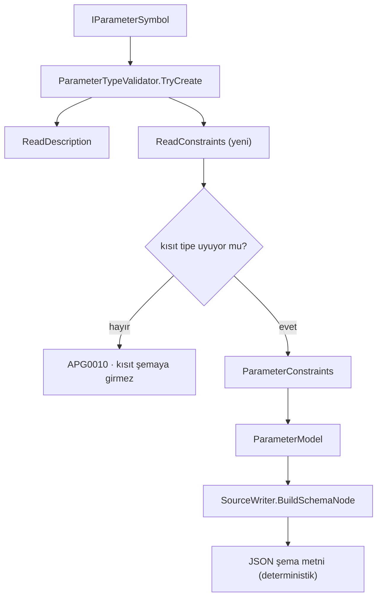

# Faz 130 — Üretilen Şemanın Kısıtları

> **Durum:** ✅ Tamamlandı (2026-09-01)
> **Kaynak:** [kesif/2026-09-01-tuketici-feature-talepleri.md](kesif/2026-09-01-tuketici-feature-talepleri.md) — **F-173**
> **Önkoşul:** Yok
> **Paketler:** `AgentPrism.Generators` (tek paket)
> **Yeni paket:** Yok · **Migration:** Yok
> **Public API:** büyümüyor — üretilen şema metni değişir, C# yüzeyi değişmez. Yeni bir analyzer diagnostic kodu eklenir (`APG0010`)
> **Tüketici yüzeyi:** `docs-site/`: `guides/write-your-own-tool.md`, `concepts/tools.md`, `capabilities.md` (diagnostic bağlantısının hedef bölümü) · sevk edilen: `APG0003` metni, yeni `APG0010` metni, `AnalyzerReleases.Unshipped.md`
> **Manuel test alanı:** [`docs/manuel-test/02-CEKIRDEK-VE-KATALOG.md`](manuel-test/02-CEKIRDEK-VE-KATALOG.md)

---

## Bu Faza Başlarken

> `faz-baslangic` skill'ini uygula. Aşağıdaki liste o skill'in 2. adımıdır.

1. Bu doküman
2. Kararlar — dosyanın tamamını **okuma**, yalnız bu kalemleri grep'le:
   ```bash
   grep -n "K-615" docs/KARARLAR.md
   sed -n '29p' docs/arsiv/KARARLAR-INDEKS-REDDEDILEN.md   # L27
   ```
   **K-615** (generator kendi `JsonSerializerContext`'ini kullanmaz; tool sahibi
   verir, vermezse `APG0008`), **L27** (`ValidateDataAnnotations()` kullanılmadı
   — `reflection` ve `IL2026` yüzünden).
3. [Faz 125](arsiv/fazlar/125-URETILEN-TOOL-SEMASININ-IFADE-GUCU.md) — yalnız devir notu:
   ```bash
   awk '/## Sonraki Faza Devir Notu/,0' docs/arsiv/fazlar/125-URETILEN-TOOL-SEMASININ-IFADE-GUCU.md
   ```
   Bugünkü şema yüzeyini o faz kurdu; bu faz onun bıraktığı sınırı genişletir.
4. Alan hafızası (bu faz bir alana dokunuyor):
   [`hafiza/analyzer-yazimi.md`](hafiza/analyzer-yazimi.md) (incremental
   generator, değer eşitliği ve diagnostic yazımı tuzakları).
5. Gerektiğinde: [`hafiza/build-ve-analyzer.md`](hafiza/build-ve-analyzer.md).

---

## Amaç

Generator bugün tipi ifade eder, **kısıtı** ifade etmez. Model `count`
parametresini `integer` olarak görür; "1 ile 100 arasında" bilgisini görmez.
Bu bilgi tool gövdesinde kalır. Model geçersiz argümanı gönderir, tool onu
reddeder, tur ve token boşa gider.

Bu faz, sık kullanılan JSON Schema kısıtlarını üretilen şemaya taşır.

- **F-173** — `minimum`, `maximum`, `minLength`, `maxLength`, `minItems`,
  `maxItems` ve `pattern` anahtarlarının standart .NET attribute'larından
  üretilmesi.

### Bu faz **runtime doğrulama eklemez**

Generator yalnız **şemayı** üretir. Üretilen bağlama kodu kısıtı kontrol
etmez. Kontrol `IToolArgumentsValidator`'ın işidir ve tüketicinin güven
sınırında kalır — bu, o arayüzün sevk edilmiş XML dokümanında yazılı
pozisyondur. Generator kısıtı runtime'da da zorlarsa tüketicinin şikâyet ettiği
**üç katmanlı drift**'i bu kez biz üretiriz.

Kazanç şudur: `IToolArgumentsValidator` `tool.JsonSchema`'yı okuyup **tek**
yerde uygular. Şema eksikse validator kuralı hiç göremez.

### 🚨 L27 bu fazı kapatmaz

`ValidateDataAnnotations()` reddedildi, çünkü `reflection` kullanır ve `IL2026`
üretir. Bu faz **aynı attribute'ları** okur ama **derleme anında**, Roslyn
sembol modelinden. Çalışma anında `reflection` yoktur, yeni bir çalışma anı
bağımlılığı yoktur, AOT metadata gereksinimi doğmaz. Reddedilen karar
runtime doğrulama hakkındaydı; bu faz şema üretimi hakkındadır.

### Kapsam dışı — bilerek

| Kalem | Neden bu fazda değil |
|---|---|
| Nested object ve object array | K-615 ile uzlaştırma gerektirir: generator kendi `JsonSerializerContext`'ini kullanmaz, tool sahibi verir. Nested şema + AOT metadata ayrı bir tasarımdır |
| `format: email` / `format: uri` | JSON Schema'da `format` çoğu doğrulayıcıda yalnız açıklamadır. Ölçülmüş talep yok |
| Runtime kısıt zorlaması | Yukarıdaki bölüm |
| AgentPrism'e özel kısıt attribute'u | 125.1 `[Description]` için BCL attribute'unu seçti; aynı gerekçe burada da geçerlidir — iki tool yazma yolu aynı kuralı öğretmelidir |

### Bugün ne çalışmıyor — doğrulanmış kanıt

| Kanıt | Gözlem |
|---|---|
| [`SourceWriter.cs:261-269`](../src/AgentPrism.Generators/SourceWriter.cs) | `BuildLeafSchemaNode` yalnız `type` (+ `uuid`/`date-time` `format`'ı ve `enum` listesi) üretir. Kısıt anahtarı hiç yok |
| [`SourceWriter.cs:242`](../src/AgentPrism.Generators/SourceWriter.cs) | Kök şema `{"type":"object","properties":…,"required":…,"additionalProperties":false}` — `properties` düğümü kısıt taşımaz |
| [`ToolDiagnostics.cs:38`](../src/AgentPrism.Generators/ToolDiagnostics.cs) | `APG0003` metni bu boşluğu tüketiciye **sevk edilmiş metinde** itiraf ediyor: "The generator also never expresses a nested object, or a minimum, maximum, length, or pattern constraint, on any parameter." |
| [`ParameterModel.cs`](../src/AgentPrism.Generators/ParameterModel.cs) | `ParameterModel(Name, Shape, Leaf, IsRequired, DefaultValueLiteral, IsConcreteArray, Description)` — kısıt alanı yok |
| [`ParameterTypeValidator.cs`](../src/AgentPrism.Generators/ParameterTypeValidator.cs) | `ReadDescription` yalnız `System.ComponentModel.DescriptionAttribute` okuyor; başka attribute okunmuyor |
| `grep -n "APG000" ToolDiagnostics.cs` | Kullanılan kodlar `APG0001`–`APG0009`. İlk boş kod **`APG0010`** |
| `grep -i "schema" Directory.Packages.props` | JSON Schema doğrulayıcı paketi **yok**; bu faz da eklemez |

> Kanıtlar 2026-09-01 tarihinde doğrulandı.

---

## 130.1 — Okunacak attribute'lar ve karşılıkları

Kaynak `System.ComponentModel.DataAnnotations` attribute'larıdır. Roslyn
sembol modelinden, tam nitelikli metadata adıyla okunur.

| Attribute | Uygulandığı `LeafTypeKind` | Üretilen anahtar |
|---|---|---|
| `RangeAttribute` | `Integer`, `Number` | `minimum`, `maximum` |
| `MinLengthAttribute` | `String` | `minLength` |
| `MinLengthAttribute` | `ParameterShape.Array` | `minItems` |
| `MaxLengthAttribute` | `String` | `maxLength` |
| `MaxLengthAttribute` | `ParameterShape.Array` | `maxItems` |
| `StringLengthAttribute` | `String` | `minLength` + `maxLength` |
| `RegularExpressionAttribute` | `String` | `pattern` |

Aynı anahtarı iki attribute üretirse (`[MinLength(2)]` + `[StringLength(10, MinimumLength = 3)]`)
**daha dar** olan kazanır: `minimum`/`minLength`/`minItems` için büyük değer,
`maximum`/`maxLength`/`maxItems` için küçük değer. Bu kural tek yerde,
birleştirme fonksiyonunda yaşar.

## 130.2 — Uyumsuz kısıt: yeni diagnostic `APG0010`

Attribute parametrenin tipine uymuyorsa şema **sessizce eksik üretilmez**;
derleme uyarı verir.

Örnekler: `string` parametrede `[Range(1, 10)]`; `int` parametrede
`[RegularExpression(...)]`; `bool` parametrede herhangi bir uzunluk kısıtı;
`[Range]`'in `Type` alan biçimi (`[Range(typeof(decimal), "0", "1")]`) —
bu biçim derleme anında sabit değer vermez ve desteklenmez.

`APG0010` metni, `APG0003` gibi, **desteklenen yolu** gösterir: kısıtı
kaldırın veya tool'u `AddTool(AIFunctionFactory.Create(...))` ile elle kaydedin.
Diagnostic bağlantısı `capabilities/#` sayfasına açılır — adres
`DocumentationLinks.cs` içindedir ve `DiagnosticIntegrityTests`
`docs-site/site.config.mjs` ile eşitliğini kapıya bağlar.

`APG0003`'ün metni de düzeltilir: artık kısıt üretiliyor, yalnız nested object
üretilmiyor.

## 130.3 — Şema üretimi

Kısıtlar `BuildLeafSchemaNode` ve `BuildSchemaNode` içinde, tip anahtarından
**sonra**, **sabit bir sırayla** yazılır: `minimum`, `maximum`, `minLength`,
`maxLength`, `pattern`, `minItems`, `maxItems`.



**Dizi parametresi.** Uzunluk kısıtı **diziye** uygulanır (`minItems`/`maxItems`),
elemana değil. `string[]` parametresinde `[MinLength(2)]` "en az iki eleman"
demektir, "her eleman en az iki karakter" değil. Bu, `MinLengthAttribute`'ın
.NET'teki anlamıyla aynıdır ve `APG0010` bunu ayrıca uyarmaz.

**Sayı biçimi.** `minimum`/`maximum` değerleri `CultureInfo.InvariantCulture`
ile yazılır. `RenderDefaultValueLiteral` aynı kuralı zaten uyguluyor; kısıt
yolu ondan sapamaz — ondalık ayırıcının yerelden gelmesi geçersiz JSON üretir.

**`pattern` aynen aktarılır.** .NET regex'i ile JSON Schema'nın beklediği
ECMA-262 söz dizimi tamamen aynı değildir. Generator **çeviri yapmaz**;
kalıbı olduğu gibi, JSON kaçışlarıyla yazar. Bu sınır `APG0010`'un metninde
ve `guides/write-your-own-tool.md` sayfasında yazılır.

## 130.4 — 🚨 Incremental generator değer eşitliği

`ParameterModel` bir `record`'dur ve incremental pipeline'ın önbelleği onun
**değer eşitliğine** dayanır. Yeni `ParameterConstraints` tipi de yalnız
ilkel alan taşıyan bir `record` olmalıdır. İçine dizi, koleksiyon veya Roslyn
sembolü konursa referans eşitliği devreye girer, önbellek her derlemede düşer
ve generator sessizce yavaşlar. Dizi gerekirse `EquatableArray<T>` kullanılır —
bu tip repoda zaten vardır.

---

## Planlanan Public API

> C# public yüzeyi **büyümez**. Aşağıdakiler `internal` generator modelidir.

```csharp
// AgentPrism.Generators (internal)
internal sealed record ParameterConstraints(
    string? Minimum,
    string? Maximum,
    int? MinLength,
    int? MaxLength,
    int? MinItems,
    int? MaxItems,
    string? Pattern)
{
    public static readonly ParameterConstraints None = new(null, null, null, null, null, null, null);
    public bool IsEmpty { get; }
}

internal sealed record ParameterModel(
    string Name,
    ParameterShape Shape,
    LeafType? Leaf,
    bool IsRequired,
    string? DefaultValueLiteral,
    bool IsConcreteArray = false,
    string? Description = null,
    ParameterConstraints? Constraints = null);   // yeni

// ToolDiagnostics
internal static readonly DiagnosticDescriptor UnsupportedConstraint = new("APG0010", …);
```

`Minimum`/`Maximum` `string` tutulur: `[Range]` hem tam sayı hem ondalık
alabilir ve değer JSON metnine **birebir** yazılacaktır. Ara bir sayı tipine
çevirmek yuvarlama riski taşır.

### HTTP `endpoint`'leri

Yok.

### Arayüz payı

Yok.

---

## Planlanan Dosya Listesi

```
src/AgentPrism.Generators/
├── ParameterModel.cs           (ParameterConstraints tipi + ParameterModel alanı)
├── ParameterTypeValidator.cs   (ReadConstraints + uyum denetimi)
├── SourceWriter.cs             (BuildSchemaNode / BuildLeafSchemaNode)
├── ToolDiagnostics.cs          (APG0010 + APG0003 metninin düzeltilmesi)
└── AnalyzerReleases.Unshipped.md (APG0010 satırı)

tests/AgentPrism.Generators.UnitTests/   (şema ve diagnostic testleri)
docs-site/src/content/docs/guides/write-your-own-tool.md
docs-site/src/content/docs/concepts/tools.md
docs-site/src/content/docs/capabilities.md
```

---

## Hata Modları ve Testler

> Generator paket sınırını geçer (tüketicinin derlemesinde çalışır). Şema
> **metni** birim testiyle kanıtlanabilir; şemanın gerçekten modele ulaşması
> paket sınırını geçer ve `AgentPrism.Package.Tests` işidir.

| Ne bozulabilir | Seviye | Test sınıfı |
|---|---|---|
| Kısıt şemaya hiç yazılmaz | Birim | `ToolSchemaConstraintTests` |
| Aynı girdi iki derlemede farklı şema üretir | Birim | `ToolSchemaDeterminismTests` — aynı kaynak iki kez üretilir, metinler eşit |
| Anahtar sırası değişir | Birim | `ToolSchemaConstraintTests` — tam metin karşılaştırması |
| Ondalık ayırıcı yerelden gelir | Birim | `ToolSchemaConstraintTests` — `tr-TR` `CultureInfo` altında koşulur |
| `[Range]` `string`'e uygulanır | Birim | `ToolDiagnosticTests` — `APG0010` |
| `[Range(typeof(decimal), "0", "1")]` sessizce yok sayılır | Birim | `ToolDiagnosticTests` — `APG0010` |
| İki attribute çelişir, geniş olan kazanır | Birim | `ToolSchemaConstraintTests` |
| Dizi kısıtı `minLength` olarak yazılır (`minItems` yerine) | Birim | `ToolSchemaConstraintTests` |
| `pattern` içindeki `\` ve `"` JSON'u bozar | Birim | `ToolSchemaConstraintTests` — üretilen metin `JsonDocument.Parse` ile ayrıştırılır |
| Önbellek düşer, generator her derlemede yeniden koşar | Birim | `IncrementalGeneratorCacheTests` — aynı `ParameterModel` iki kez eşit çıkmalı |
| `APG0010`'un yardım bağlantısı siteyle uyuşmaz | Birim | mevcut `DiagnosticIntegrityTests` |
| Kısıtlı tool gerçekten paketten çıkmaz | Paket | `AgentPrism.Package.Tests` — dış tüketici derlemesinde şema okunur |
| Trimming/AOT metadata uyarısı doğar | Fonksiyonel | mevcut AOT koşumu; yeni `reflection` yolu yok |

Beş soru: **iptal** — generator'da iptal yolu yoktur, `CancellationToken`
şemadan çıkarılmaya devam eder; **eşzamanlılık** — incremental pipeline
paraleldir, model değer eşitliği ile korunur; **boş/aşırı girdi** —
`[MaxLength(0)]`, `[Range(int.MinValue, int.MaxValue)]` ve boş `pattern`
case'leri yazılır; **başka kiracı** — bu faz kiracı sınırına dokunmaz;
**alt sistem hatası** — attribute argümanı sabit değilse `APG0010` verilir,
generator çökmez.

---

## Manuel Kabul Case'leri

| # | Ön koşul | Adımlar | Beklenen sonuç |
|---|---|---|---|
| 1 | `[AgentPrismTool]` metodunda `[Range(1,100)] int count` | Derle, üretilen şemayı oku | `"count"` düğümü `minimum:1, maximum:100` taşır |
| 2 | `[MinLength(3)] string name` | Derle | `minLength:3` |
| 3 | `[MinLength(2)] string[] tags` | Derle | `minItems:2` — `minLength` **değil** |
| 4 | `[Range(1,10)] string s` | Derle | `APG0010` uyarısı; şemada kısıt yok; derleme başarılı |
| 5 | Kısıtlı tool ile gerçek `run` | `samples/AgentPrism.Api` üzerinde tool çağırt | Model kısıtlı şemayı alır; `run` başarılı |
| 6 | Türkçe yerel | `LANG=tr_TR.UTF-8` ile derle | `[Range(1.5, 2.5)]` şemaya `1.5`/`2.5` yazar, `1,5` değil |

---

## Açık Sorular

| # | Soru | Seçenekler | Öneri |
|---|---|---|---|
| 1 | `[EmailAddress]`/`[Url]` → `format` üretilsin mi? | A: hayır · B: evet | **A.** JSON Schema'da `format` çoğu doğrulayıcıda yalnız açıklamadır; ölçülmüş talep yok. Faz dar kalsın |
| 2 | Çelişen iki attribute uyarı üretsin mi, sessizce daralsın mı? | A: sessizce daralt · B: `APG0010` ver | **A.** `[MinLength(2)]` + `[StringLength(10, MinimumLength=3)]` yazmak bir hata değildir; en dar kural doğrudur. Uyarı gürültü olur |
| 3 | `APG0010` uyarı mı hata mı? | A: uyarı (`Warning`) · B: hata | **A.** Kısıtın şemaya girmemesi derlemeyi durdurmaz; `APG0003` (desteklenmeyen tip) hata olmak zorundadır çünkü kod üretilemez, burada kod üretilebilir |

---

## Bitiş Ölçütleri (DoD)

- [x] `[Range]`, `[MinLength]`, `[MaxLength]`, `[StringLength]`, `[RegularExpression]` doğru JSON Schema anahtarlarına dönüşür (case 1–3)
- [x] Uyumsuz kısıt `APG0010` üretir, derleme başarılı kalır (case 4) — negatif değer ve argümansız `[MaxLength]` de dahil (denetim 🔴/🟡)
- [x] Aynı girdi iki derlemede **bit düzeyinde aynı** şema üretir
- [x] `tr-TR` yerelinde ondalık ayırıcı `.` kalır (case 6)
- [x] `APG0003` metni güncellendi; nested object sınırı korunur, kısıt sınırı kaldırılır
- [x] `AnalyzerReleases.Unshipped.md` `APG0010` satırını taşır
- [x] `DiagnosticIntegrityTests` yeşil (yardım bağlantısı siteyle uyumlu)
- [x] Dört doğrulama kapısı sıfır uyarı verir
- [x] Kısıtlı tool ile gerçek `run` yapıldı, çıktı belgeye yazıldı (case 5 — `AgentPrism.Package.Tests` üzerinden, bkz. Plandan Sapmalar #1)
- [x] `secret` taraması boş döndü
- [x] Manuel kabul case'leri `docs/manuel-test/02-CEKIRDEK-VE-KATALOG.md` içine eklendi; otomatikleştirilebilenler koşuldu
- [x] `faz-denetim` koşuldu; 🔴 bulgu kalmadı (1 🔴 + 2 🟡 bulundu ve kapatıldı, bkz. Denetim Bulguları)
- [x] `docs-site/` güncellendi (`guides/write-your-own-tool.md`, `concepts/tools.md`, `capabilities.md`); `npm run build` + `check-links.mjs` temiz

### Gerçek run kanıtı (case 5)

Paketlenmiş `AgentPrism`/`AgentPrism.Testing` (yerel NuGet feed, sürüm
`0.0.0-preview.0.508`) referans alan bağımsız bir `PackageReference`
tüketicisinde, `[Range(1, 10)] int priority` taşıyan bir tool ile gerçek
`run` yapıldı (`ConstrainedToolPackageTests`'in aynı adımlarının elle tekrarı):

```
OK run=01a05d4b-981b-734d-b862-023e2f1f62b8 events=5 tools=1
SCHEMA {"type":"object","properties":{"orderId":{"description":"The order number.","type":"string"},"priority":{"description":"The priority, 1 (lowest) to 10 (highest).","type":"integer","minimum":1,"maximum":10}},"required":["orderId","priority"],"additionalProperties":false}
```

Kısıt (`minimum`/`maximum`) paketlenmiş analyzer DLL'inden gerçekten geldi;
`run` `Completed` durumunda bitti, tool bir kez çağrıldı.

### Doğrulama komutları

```bash
# Üretilen şemayı gör
dotnet build samples/... -p:EmitCompilerGeneratedFiles=true
grep -r "minimum" obj/**/generated/

# Yerel bağımsızlığı
LANG=tr_TR.UTF-8 dotnet build tests/AgentPrism.Generators.UnitTests
```

---

## Riskler

| Risk | Önlem |
|------|-------|
| Yeni alan `ParameterModel`'in değer eşitliğini bozar ve önbellek düşer | `ParameterConstraints` yalnız ilkel alan taşır; `IncrementalGeneratorCacheTests` bunu ölçer |
| .NET regex'i JSON Schema doğrulayıcısında farklı davranır | Generator çeviri yapmaz; sınır `APG0010` metninde ve site sayfasında yazılır |
| `[Range]`'in `Type` biçimi sessizce yok sayılır | `APG0010` bu biçimi açıkça yakalar |
| `APG0003` metni güncellenmez ve tüketiciye yalan söyler | DoD'de ayrı satır; `faz-denetim` sevk edilen metni tarar |
| Şemanın büyümesi `SchemaDocument` string literal'ini bozar | Üretilen metin testte `JsonDocument.Parse` ile ayrıştırılır |

---

<!-- ============================================================
     AŞAĞISI KAPANIŞTA DOLDURULUR — `faz-tamamlama` skill'i.
     Plan anında boş kalır. Başlıkları SİLME.
     ============================================================ -->

## Plandan Sapmalar

1. **Manuel kabul case 5'in mekanizması `samples/AgentPrism.Api` yerine `AgentPrism.Package.Tests`'e taşındı.** Plan "samples/AgentPrism.Api üzerinde tool çağırt" diyordu, ama bu proje `AgentPrism`'e `ProjectReference` ile bağlıdır (`ConsumerRunTests`'in kendi belgesi) — paketlenmiş `analyzers/dotnet/cs/` DLL'inin gerçekten bir `PackageReference` tüketicisine ulaştığını KANITLAYAMAZ, ki DoD'nin kendi paket-seviyesi satırı tam olarak bunu istiyordu ("Kısıtlı tool gerçekten paketten çıkmaz | Paket | `AgentPrism.Package.Tests`"). `ConsumerRunTests`'in aynı deseni (yerel NuGet feed → dış tüketici projesi yaz → derle → çalıştır) tekrarlanarak `ConstrainedToolConsumerProject`/`ConstrainedToolPackageTests` eklendi; `samples/AgentPrism.Api`'nin paylaşılan `OrderTools.cs`'i (onlarca başka manuel test dokümanı ve fonksiyonel testin referans verdiği `list_recent_orders`/`get_order_status`/`cancel_order` imzaları) dokunulmadan bırakıldı. Manuel case MT-CORE-112 bu gerçek mekanizmayı anlatacak şekilde güncellendi.
2. **`ParameterTypeValidator.TryCreate`'e planın taslağında olmayan bir `out EquatableArray<string> unsupportedConstraintAttributes` parametresi eklendi.** Plan yalnız `ParameterModel`e `Constraints` alanı eklenmesini gösteriyordu; APG0010'u raporlamak için "hangi attribute uyumsuzdu" bilgisinin `ToolCandidate.Create`'e taşınması gerekti — `ParameterModel`in kendisine eklemek (incremental modelin bir PARÇASI hâline getirmek) kapsam dışıydı, çünkü bu bilgi yalnız tek seferlik bir tanı raporlamak için var, şemaya asla girmiyor. `out` parametresi bunu `ParameterModel`in değer eşitliğinin dışında tutar.
3. **Kapanış kapısını koşarken, bu fazla TAMAMEN ilgisiz iki bayat taban çizgisi bulundu ve düzeltildi** (kullanıcı talimatı: "konuyla alakasız bug/defect'lerle karşılaşırsan onları da çöz"):
   - `tests/AgentPrism.Core.UnitTests/Architecture/PlaywrightLocatorTests` — Faz 129 `tests/AgentPrism.Ui.E2ETests/UiTests.cs`'e `GetByPlaceholder("default")` (ne `Exact = true` ne `.First`/`.Nth`) ekledi ama `playwright-locator-baseline.txt`'i hiç yenilemedi (dosyanın son commit'i Faz 93'ten kalıyordu, `UiTests.cs`'inki Faz 129'dandı). `Exact = true` eklendi — placeholder metni `jobs.tsx`'te tam olarak `"default"` ve sayfada tek örnek, bu yüzden davranış değişmedi, yalnız riskli sayım düştü.
   - `tests/AgentPrism.Sql.Shared.UnitTests/SqlTextSnapshotTests` — Faz 129'un `lane` sütunu (job kuyruğu lane'leri) on bir sorgu metnini değiştirdi ama üç `sql-text-baseline.*.txt` dosyası hiç yenilenmedi (son commit'leri Faz 126'dan kalıyordu). `AGENTPRISM_SQL_SNAPSHOT_REFRESH=1` ile yenilendi; `git diff` yalnız `lane` sütunu/parametresi ekleyen satırları gösterdi, üç dialekt arasında tutarlı — beklenmedik hiçbir fark yok.
   - İkisi de Faz 129'un KENDİ kapanışında `dotnet test AgentPrism.slnx` tam koşumunun (ya da onun sonucunun) gözden kaçtığını gösteriyor; bu faz onları kapattı.
4. **Ek: kendi eklediğim bir XML doküman satırı `ShippedDocumentationSelfContainmentTests`'i kırdı** — `ParameterTypeValidator.ReadConstraints`'in doc yorumunda "(Open Question 3)" ifadesi vardı; bu, tüketicinin hiç görmediği plan dokümanına içsel bir referanstı ve `internal-history.pattern`'in `\bopen question\s+\d+\b` kuralına takıldı. Cümle referans olmadan yeniden yazıldı.
5. **`dotnet test AgentPrism.slnx -c Release --no-build -maxcpucount:1` koşumunda `AgentPrism.Ui.E2ETests.UiTests.Playground_voice_mode_opens_microphone_and_shows_transcript` bir kez zaman aşımına uğradı, izole koşumda hemen geçti.** Bu fazın değişikliği ses/mikrofon kodına hiç dokunmuyor; `docs/hafiza/test-altyapisi.md`'nin zaten belgelediği "tam koşum ara sıra flaky kırılır" sınıfının beşinci örneği olarak not edildi, kod değişikliği gerekmedi.

## Bu Fazda Verilen Kararlar

> Yeni bir `K-NNN` kaydı açılmadı. Plandaki üç açık soru (format üretilmesin,
> çelişen kısıt sessizce daraltılsın, `APG0010` uyarı olsun) planın kendi
> önerisiyle aynen uygulandı — bunlar yerel generator tasarım tercihleridir,
> public API/uyumluluk sözleşmesi, güvenlik/kiracı sınırı veya kalıcı
> veri/migration kararı değil (AGENTS.md). Yukarıdaki sapma #3'teki iki
> baseline yenilemesi de birer karar değil, önceki bir fazın kapanışında
> atlanan bir doğrulama adımının bu fazda tamamlanmasıdır.

## Gerçekleşen Public API

C# public yüzeyi **büyümedi** — plan bunu öngörmüştü. `ParameterConstraints`
ve `ParameterModel.Constraints` `internal` generator modelidir;
`AgentPrism.Generators`'ın `AgentPrismPublicApiTrackingEnabled=false` olması
nedeniyle zaten hiçbir `PublicAPI.*.txt`'ye girmez — `git status` bunu
doğruladı, hiçbir `PublicAPI.*.txt` bu fazda değişmedi.

Yeni analyzer tanısı **`APG0010`** (`AgentPrism.Tools`, `Warning`,
`isEnabledByDefault: true`) planlandığı gibi eklendi ve
`AnalyzerReleases.Unshipped.md`'ye kaydedildi. `APG0003`'ün metni planın
istediği gibi güncellendi: kısıt sınırı kaldırıldı, nested object sınırı
korundu.

Üretilen JSON Schema metni artık desteklenen kısıtları taşıyor — bu bir C#
API'si değil, tüketicinin derleme çıktısında gördüğü metindir; DoD'nin
istediği gibi belgelendi (`guides/write-your-own-tool.md`).

## Dosya Listesi (gerçekleşen)

```
src/AgentPrism.Generators/
├── ParameterModel.cs             (ParameterConstraints tipi + ParameterModel.Constraints alanı)
├── ParameterTypeValidator.cs     (ReadConstraints, TryReadRange, narrow-merge yardımcıları, out unsupportedConstraintAttributes)
├── SourceWriter.cs               (BuildLeafSchemaNode kısıt eki, AppendConstraintSuffix — minItems/maxItems)
├── ToolCandidate.cs              (APG0010 raporlama — unsupportedConstraintAttributes döngüsü)
├── ToolDiagnostics.cs            (APG0010 + APG0003 metin güncellemesi)
├── ToolRegistrationGenerator.cs  (DescriptorsById dispatch tablosuna APG0010)
└── AnalyzerReleases.Unshipped.md (APG0010 satırı)

tests/AgentPrism.Generators.UnitTests/
├── DiagnosticTests.cs                  (APG0003 testi güncellendi — "constraint" artık YOK)
├── ToolDiagnosticTests.cs              (yeni — APG0010)
├── ToolSchemaConstraintTests.cs        (yeni — 130.1/130.3, sabit anahtar sırası, tr-TR)
├── ToolSchemaDeterminismTests.cs       (yeni — bit-özdeş üretim)
└── IncrementalGeneratorCacheTests.cs   (yeni — 130.4 önbellek tazeliği)

tests/AgentPrism.Package.Tests/
├── Infrastructure/ConstrainedToolConsumerProject.cs  (yeni)
└── ConstrainedToolPackageTests.cs                    (yeni)

tests/AgentPrism.Ui.E2ETests/UiTests.cs                          (Faz 129'un bayat locator'ı — Exact = true)
tests/AgentPrism.Core.UnitTests/Architecture/playwright-locator-baseline.txt  (129 → 128'e döndü, gerçek sayımla eşleşti)
tests/AgentPrism.Sql.Shared.UnitTests/Baselines/sql-text-baseline.*.txt (üçü — Faz 129'un lane sütunu, refresh)

docs-site/src/content/docs/guides/write-your-own-tool.md
docs-site/src/content/docs/concepts/tools.md
docs-site/src/content/docs/capabilities.md
docs-site/src/content/docs/troubleshooting.md
docs-site/public/llms-full.txt (üretildi)

docs/manuel-test/02-CEKIRDEK-VE-KATALOG.md   (MT-CORE-109..114)
docs/hafiza/test-altyapisi.md                (flaky E2E notuna beşinci örnek)
```

## Denetim Bulguları

Taze bağlamlı bir denetçi (Agent, `general-purpose`) 2026-09-01'de koştu.

| # | Seviye | Bulgu | Sonuç |
|---|---|---|---|
| 1 | 🔴 | `[MinLength(-1)]`/`[MaxLength(-1)]` gibi negatif bir kısıt değeri, JSON Schema'nın `nonNegativeInteger` şartı taşıyan `minLength`/`maxLength`/`minItems`/`maxItems` anahtarlarına doğrulanmadan yazılıyordu — geçersiz bir şema sessizce üretiliyordu, `APG0010` hiç ötmedi | **Düzeltildi.** `ReadConstraints`'in `MinLength`/`MaxLength`/`StringLength` dallarına negatif-değer kontrolü eklendi; artık `APG0010` üretiyor, anahtar şemaya hiç girmiyor. Dört yeni test (`A_negative_MinLength_is_reported_and_omitted_from_the_schema` ve üç kardeşi) |
| 2 | 🟡 | `[MaxLength]` (argümansız kurucu, geçerli bir C# kullanımı) sessizce hiçbir etki üretmiyordu — ne şemaya yazılıyordu ne `APG0010` veriyordu; `Range(Type,...)`'ın aynı sınıftaki durumuyla (değer yok → uyarı) tutarsızdı | **Düzeltildi.** Aynı `TryReadSingleIntArgument` başarısızlık dalı artık `unsupported.Add("[MaxLength]")` çağırıyor; `A_parameterless_MaxLength_attribute_is_reported` testi ekli |
| 3 | 🟡 | Planın "Beş soru" bölümü `[MaxLength(0)]`, `[Range(int.MinValue, int.MaxValue)]` ve boş `pattern` case'lerinin yazılacağını taahhüt ediyordu; hiçbiri test dosyalarında yoktu | **Düzeltildi.** Üç sınır testi `ToolSchemaConstraintTests`'e eklendi (`A_MaxLength_of_zero_produces_maxLength_zero`, `A_Range_spanning_the_full_Int32_domain_produces_matching_minimum_and_maximum`, `An_empty_RegularExpression_pattern_produces_an_empty_pattern_string`) |

**🔴 ve 🟡 (yukarıdakiler dışında) yok.** Denetçinin bağımsızca doğruladığı
kalemler: DoD case 1-6'nın tümü gerçek assertion'larla kanıtlı; test
tiyatrosu yok; paket sınırı testi (`ConstrainedToolPackageTests`) gerçek bir
dış tüketici zinciri kuruyor; imza-gövde kayması yok
(`ParameterModel.Constraints` her üretim ve tüketim noktasında doğru
okunuyor/yazılıyor); plan dışı public API yok; repo kuralları (İngilizce,
`ParameterConstraints`'in yalnız ilkel alan taşıması, `isEnabledByDefault`)
ihlal edilmemiş; `write-your-own-tool.md`/`concepts/tools.md`/
`capabilities.md`/`troubleshooting.md` tutarlı; `AnalyzerReleases.Unshipped.md`
satırı ekli; SQL/Playwright baseline düzeltmelerinin GERÇEKTEN yalnız `lane`
sütunu ve tek bir riskli locator'la ilgili olduğu bağımsızca (satır satır
`git diff` incelemesiyle) doğrulandı.

Düzeltmelerden sonra dört kapı (`kapi.py kapanis --taban d5aef08`) yeniden
koşuldu — sıfır uyarı.

## Sonraki Faza Devir Notu

- Generator artık `minimum`/`maximum`/`minLength`/`maxLength`/`minItems`/
  `maxItems`/`pattern`'i, standart `DataAnnotations` attribute'larından
  okuyup deterministik sabit sırayla yazıyor; `ParameterConstraints` yalnız
  ilkel alan taşıyor (incremental önbellek güvenli).
- **Kapsam dışı bırakılan iki kalem hâlâ açık aday:** nested object/object
  array (K-615 ile uzlaşma gerektirir — generator kendi
  `JsonSerializerContext`'ini kullanmıyor) ve `format: email`/`format: uri`
  (ölçülmüş talep yok). İkisi de `docs/ADAYLAR.md`'ye taşınabilir bir sonraki
  keşif turunda.
- **`IToolArgumentsValidator` runtime'da kısıtı ZORLAMIYOR** — bu bilinçli bir
  sınırdı (bkz. "Bu faz runtime doğrulama eklemez"). Bir sonraki faz bunu
  değiştirmek isterse, `tool.JsonSchema`'yı okuyan hazır bir
  `IToolArgumentsValidator` örneği (`guides/write-your-own-tool.md`'de
  belgelenen desen) iyi bir başlangıç noktasıdır.
- **Faz 129'un kapanışı iki baseline'ı (Playwright locator, SQL text
  snapshot) yenilemeden bitmiş** — bu faz ikisini de düzeltti (Plandan
  Sapmalar #3). Sonraki fazın kapanışı `dotnet test AgentPrism.slnx`'in TAM
  ve KIRMIZI SATIR OLMADAN bittiğini `tail`'siz bir log dosyasından teyit
  etmeli; `| tail -200` bir önceki fazda erken proje sonuçlarını (alfabetik
  sırada `Core.UnitTests`, `Sql.Shared.UnitTests`) görünmez kılmıştı.
