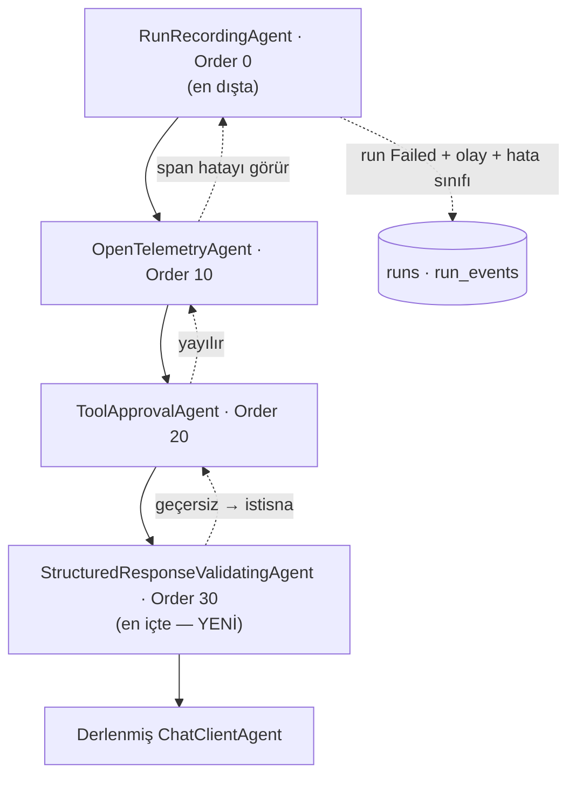

# Faz 131 — Yapısal Yanıt Doğrulama Seam'i

> **Durum:** ✅ Tamamlandı (2026-09-01)
> **Kaynak:** [kesif/2026-09-01-tuketici-feature-talepleri.md](kesif/2026-09-01-tuketici-feature-talepleri.md) — **F-174**
> **Önkoşul:** Yok
> **Paketler:** `AgentPrism.Abstractions`, `.Core`, `.AspNetCore` (yalnız `RunEventType` yüzeyi), `.UI` (olay etiketi)
> **Yeni paket:** Yok · **Migration:** Yok — yeni `RunEventType` ve `RunErrorClass` değerleri mevcut `smallint` sütunlarına yazılır
> **Public API:** büyüyor — yeni arayüz, options, olay ve hata sınıfı. `wc -l src/*/PublicAPI.Shipped.txt` → her dosya 1 satır; shipped giriş sıfır olduğu için bugün eklemek ucuz
> **Tüketici yüzeyi:** `docs-site/`: `guides/structured-output.md`, `concepts/runs.md` (olay listesi), `capabilities.md`, `reference/configuration.md` · sevk edilen: `IStructuredResponseValidator` XML `<example>`'ı, `en.ts`/`tr.ts` olay etiketi
> **Manuel test alanı:** [`docs/manuel-test/22-GUARDRAIL-VE-YAPISAL-CIKTI.md`](manuel-test/22-GUARDRAIL-VE-YAPISAL-CIKTI.md)

---

## Bu Faza Başlarken

> `faz-baslangic` skill'ini uygula. Aşağıdaki liste o skill'in 2. adımıdır.

1. Bu doküman
2. Kararlar — dosyanın tamamını **okuma**, yalnız bu kalemleri grep'le:
   ```bash
   grep -n "K-603\|K-232" docs/KARARLAR.md
   ```
   **K-603** (`RunErrorClass`'ın 9 numarası emekli bir boşluktur, yeniden
   kullanılamaz), **K-232** (sunucu yanıtları çevrilmez).
3. [Faz 127](arsiv/fazlar/127-TOOL-KAYIT-YUZEYI.md) — yalnız devir notu:
   ```bash
   awk '/## Sonraki Faza Devir Notu/,0' docs/arsiv/fazlar/127-TOOL-KAYIT-YUZEYI.md
   ```
   `IToolArgumentsValidator`'ı o faz sevk etti. Bu faz **aynı seam biçimini**
   yanıt tarafında tekrarlar; iki arayüz birbirine benzemek zorundadır.
4. Alan hafızası (bu faz iki alana dokunuyor):
   [`hafiza/cekirdek-calistirma.md`](hafiza/cekirdek-calistirma.md) (decorator
   sırası, `AsyncLocal` tuzağı, akışlı yol),
   [`hafiza/model-boru-hatti.md`](hafiza/model-boru-hatti.md) (`IChatClient`
   halkalarının sırası ve neden bu faz oraya girmiyor).
5. Gerektiğinde: [`MIMARI.md`](MIMARI.md) — çalıştırma yolu bölümü.

---

## Amaç

`AgentResponseFormat` bugün yalnız sağlayıcıya bir kısıt gönderir. Dönen
yanıtı **hiçbir şey doğrulamaz**. Model boş içerik döndürdüğünde, JSON kesik
geldiğinde veya şemaya uymayan bir alan geldiğinde `run` **başarılı** kapanır.
Tüketici parse hatasını sonra alır. Böylece AgentPrism'in `run` sonucu ile
gerçek kullanım sonucu ayrışır.

Bu faz, `run`'ın kapanmadan önce yanıtı doğrulamasını sağlayan genişleme
noktasını ekler.

- **F-174** — opt-in yapısal yanıt doğrulama seam'i, kararı taşıyan `run`
  olayı ve kararlı bir hata sınıfı.

### AgentPrism ne yapar, ne yapmaz

| AgentPrism | Tüketici |
|---|---|
| Doğrulayıcıyı **ne zaman** çağıracağına karar verir | **Neyin geçerli** olduğuna karar verir |
| Geçersizde `run`'ı ne yapacağına karar verir | Şema kurallarını yazar |
| Kararı `run` kanıtına yazar | Domain kurallarını (`score` aralığı, izin) kendi uygular |

**AgentPrism yerleşik bir JSON Schema doğrulayıcı sevk etmez.** Bu, uydurulmuş
bir sınır değil, `IToolArgumentsValidator`'ın sevk edilmiş XML dokümanında
yazılı pozisyondur: doğrulama tüketicinin güven sınırında kalır. Üç ölçülmüş
gerekçe: `Directory.Packages.props` içinde JSON Schema doğrulayıcı yoktur ve
BCL'de de yoktur (yerleşik doğrulayıcı = yeni geçişli paket); `Abstractions`
ve `Core` AOT uyumlu kalmak zorundadır, mevcut doğrulayıcılar `reflection`
kullanır; iki yerde iki farklı politika tutarsız bir ürün anlatısı olur.

### Kapsam dışı — bilerek

| Kalem | Neden bu fazda değil |
|---|---|
| Bounded repair (geçersiz yanıt için ikinci model çağrısı) | `run` içinde **yeni bir model çağrısı** açar; bütçe (`AgentRunBudget` token/cost/duration + `Deadline`), `FallbackChatClient`'ın tur içi tool defteri, cost attribution ve iptal ile kesişir. Ayrı faz |
| Yerleşik şema doğrulayıcı | Yukarıdaki bölüm |
| Akışta içeriği geri alma | Teknik olarak mümkün değil; 131.5'te açıkça yazılır |

### Bugün ne çalışmıyor — doğrulanmış kanıt

| Kanıt | Gözlem |
|---|---|
| [`AgentDefinitionCompiler.ChatOptions.cs:108`](../src/AgentPrism.Core/Compilation/AgentDefinitionCompiler.ChatOptions.cs) | `options.ResponseFormat = BuildResponseFormat(definition)` — kısıt sağlayıcıya gider |
| [`AgentDefinitionCompiler.ChatOptions.cs:138-191`](../src/AgentPrism.Core/Compilation/AgentDefinitionCompiler.ChatOptions.cs) | `BuildResponseFormat` yalnız `ChatResponseFormat` üretir; dönen yanıtla ilgili **hiçbir kod yok** |
| [`ResponseFormat.cs`](../src/AgentPrism.Abstractions/Agents/ResponseFormat.cs) | `AgentResponseFormat.Schema`'nın "içeriği doğrulanmaz" olduğu XML'de yazılı |
| [`AgentDescriptor.cs:32`](../src/AgentPrism.Abstractions/Agents/AgentDescriptor.cs) | `public ModelBinding? Model { get; init; }` — **decorator şemaya buradan ulaşır**; ayrı bir taşıma yolu gerekmez |
| [`AgentDecoratorPipeline.cs`](../src/AgentPrism.Core/Catalog/AgentDecoratorPipeline.cs) | `decorators.OrderByDescending(d => d.Order)` — **büyük `Order` önce uygulanır**, yani en içte kalır |
| `RunRecordingAgentDecorator.cs:114` · `OpenTelemetryAgentDecorator.cs:37` · `ToolApprovalAgentDecorator.cs:38` | `Order` değerleri sırasıyla **0 · 10 · 20**. En dıştaki kayıt (`0`) `run` kaydıdır |
| [`RunEventType.cs`](../src/AgentPrism.Abstractions/Runs/RunEventType.cs) | En büyük değer **26** (`ToolOutputTruncated`) |
| [`RunErrorClass.cs`](../src/AgentPrism.Abstractions/Runs/RunErrorClass.cs) | En büyük değer **13** (`ToolTimeout`). 🚨 **9 emekli bir boşluktur** ve yeniden kullanılamaz (K-603); `RunErrorClassContractTests` bunu sabitler |
| [`IToolArgumentsValidator.cs`](../src/AgentPrism.Abstractions/Tools/IToolArgumentsValidator.cs) | Sevk edilmiş pozisyon: *"AgentPrism does not ship a built-in JSON Schema validator — validation stays inside the consumer's own trust boundary."* Ayrıca fail-closed davranışı burada tanımlı |
| [`SafeErrorText.cs`](../src/AgentPrism.Abstractions/Diagnostics/SafeErrorText.cs) | Kalıcı hata metnini güvenli hâle getiren yardımcı **zaten var**; bu faz onu kullanır, yenisini yazmaz |

> Kanıtlar 2026-09-01 tarihinde doğrulandı.

---

## 131.1 — Doğrulama nerede çalışır

Doğrulama bir **`IAgentDecorator`**'dır, bir `IChatClient` halkası **değildir**.

🚨 Bu, planın yapısal iddiasıdır ve gerekçesi ölçülmüştür. `IChatClient`
katmanı tool çağrı turlarının **her birini** görür; yapısal çıktı yalnız
**son** turda gelir. O katmanda "bu son tur mu" sorusunu function-call
içeriğine bakarak tahmin etmek gerekirdi. `AIAgent` katmanı son yanıtı
doğrudan görür. Ayrıca sonraki fazın repair'i bir **yeni tur** açacaktır; tur
açmak agent seviyesinin işidir, `FallbackChatClient`'ın tur ortasına girmek
değil.



`Order = 30` seçimi zorunludur: doğrulama en içte durmalı ki attığı istisna
telemetri **ve** `run` kaydı tarafından görülsün. En dışta dursaydı `run`
başarılı yazıldıktan sonra hata atardı.

## 131.2 — Ne zaman çalışır

Üç koşulun **üçü** birden gerekir:

1. `AgentPrismStructuredResponseOptions.Enabled` `true`'dur — varsayılanı
   `false`'tur (K1).
2. `descriptor.Model?.ResponseFormat?.Kind` `Json` veya `JsonSchema`'dır.
3. `run` bir yanıt üretmiştir (hata veya iptal ile bitmemiştir).

Üçü sağlanmazsa decorator **hiçbir şey yapmaz** ve iç agent'ı doğrudan çağırır.
Ayar yapılmayan bir kurulumda davranış Faz 130 ile birebir aynıdır.

## 131.3 — Seam

```csharp
public interface IStructuredResponseValidator
{
    ValueTask<StructuredResponseValidationResult> ValidateAsync(
        StructuredResponseValidationContext context,
        CancellationToken cancellationToken = default);
}
```

Varsayılan kayıt `TryAddSingleton` ile eklenen bir **no-op**'tur ve her zaman
`Valid` döner — `IToolArgumentsValidator` ile birebir aynı şekil. Tüketici
kaydı değiştirerek kendi kuralını koyar (K4).

**Fail-closed.** Doğrulayıcı istisna atarsa yanıt **geçersiz** sayılır.
Hata veren bir kapı, kapı değildir. Bu da `IToolArgumentsValidator` ile aynı
kuraldır.

**`Reason` metni ham yanıt taşımaz.** Kalıcı hâle gelen metin
`SafeErrorText.ForPersistence` üzerinden geçer; ham model çıktısı yalnız
mevcut `run` içerik saklama politikası neye izin veriyorsa oraya yazılır, hata
metnine **yazılmaz**.

## 131.4 — `run` kanıtı

| Yüzey | Değişiklik |
|---|---|
| `RunEventType` | Yeni değer: `StructuredResponseRejected`. Listenin **sonuna** eklenir; bugünkü en büyük değer 26 |
| `RunErrorClass` | Yeni değer: `StructuredResponseInvalid`. Listenin **sonuna** eklenir; bugünkü en büyük değer 13. 🚨 **9 kullanılamaz** |
| `RunStatus` | Değişmez — `run` `Failed` olur |
| Yeni istisna | `AgentPrismStructuredResponseException : AgentPrismException` |
| Arayüz | Olay etiketi `en.ts` **ve** `tr.ts`'e girer (eksik anahtar derleme hatasıdır, K-228) |

Olay yükü: `kind` (`Json`/`JsonSchema`), `schemaName`, `reason` (güvenli metin),
`provider`, `model`. Ham yanıt **yükte yoktur**.

## 131.5 — Akış (streaming) davranışı — sınır açıkça yazılır

Akışlı `run`'da içerik istemciye **üretildikçe** gider. Doğrulama son güncelleme
yayınlandıktan sonra çalışır. Yani:

- `run` `Failed` kapanır, olay yazılır, hata sınıfı doğrudur.
- Ama **istemciye giden içerik geri alınamaz.**

Bu bir eksiklik değil, akışın doğasıdır ve `guides/structured-output.md`
sayfasında açıkça yazılır: yapısal çıktıyı **kapı** olarak kullanan bir agent
akış kullanmamalıdır.

🚨 Akışlı yolda decorator, son yanıtı toplamak için güncellemeleri biriktirir.
`Activity.Current` veya `AsyncLocal` bu birikim döngüsünde **açılmaz**; yazım
çağırana geri akmaz ve akışlı yolda her `MoveNextAsync` öncesi tekrarlanması
gerekir (`docs/hafiza/cekirdek-calistirma.md`).

---

## Planlanan Public API

> Taslak imzalardır. Gerçekleşen imzalar kapanışta ayrı bölüme yazılır.

```csharp
// AgentPrism.Abstractions
public interface IStructuredResponseValidator
{
    ValueTask<StructuredResponseValidationResult> ValidateAsync(
        StructuredResponseValidationContext context,
        CancellationToken cancellationToken = default);
}

public sealed record StructuredResponseValidationContext
{
    public required string AgentName { get; init; }
    public required Guid RunId { get; init; }
    public string? SessionId { get; init; }
    public string? Provider { get; init; }
    public string? Model { get; init; }
    public required AgentResponseFormatKind Kind { get; init; }
    public JsonElement? Schema { get; init; }
    public string? SchemaName { get; init; }
    public required string ResponseText { get; init; }
}

public sealed record StructuredResponseValidationResult
{
    public static StructuredResponseValidationResult Valid { get; }
    public static StructuredResponseValidationResult Invalid(string reason);
    public bool IsValid { get; }
    public string? Reason { get; }
}

public sealed class AgentPrismStructuredResponseOptions
{
    public const string SectionName = "AgentPrism:StructuredResponse";
    public bool Enabled { get; set; }          // varsayılan false (K1)
}

public sealed class AgentPrismStructuredResponseException : AgentPrismException { }

public enum RunEventType { /* … */ StructuredResponseRejected = <sonraki boş> }
public enum RunErrorClass { /* … */ StructuredResponseInvalid = <sonraki boş> }
```

`Schema` `JsonElement?` olarak geçer — `AgentResponseFormat.Schema` ile aynı
tip. Yeni bir şema temsili üretilmez.

### HTTP `endpoint`'leri

Yeni uç yoktur. `GET /api/runs/{id}/events` yeni olay türünü döndürür;
OpenAPI → TypeScript zinciri yeniden üretilir.

### Arayüz payı

Yalnız bir olay etiketi ve bir hata sınıfı adı. Bugünkü paket:
`index-*.js.br` 148 807 B (bütçe 250 KB gzip). Kapanışta yeniden ölçülür.

---

## Planlanan Dosya Listesi

```
src/AgentPrism.Abstractions/
├── Agents/IStructuredResponseValidator.cs          (yeni)
├── Agents/StructuredResponseValidationContext.cs   (yeni)
├── Agents/StructuredResponseValidationResult.cs    (yeni)
├── Exceptions/AgentPrismStructuredResponseException.cs (yeni)
├── Runs/RunEventType.cs                            (yeni değer)
└── Runs/RunErrorClass.cs                           (yeni değer)

src/AgentPrism.Core/
├── Compilation/StructuredResponseValidatingAgent.cs         (yeni · AIAgent decorator)
├── Compilation/StructuredResponseValidatingAgentDecorator.cs (yeni · IAgentDecorator, Order 30)
├── Compilation/NoOpStructuredResponseValidator.cs           (yeni · TryAddSingleton)
├── AgentPrismStructuredResponseOptions.cs + Validator       (yeni)
├── AgentPrismServiceCollectionExtensions.Registration.Core.cs (kayıt)
├── AgentPrismCoreJsonContext.cs                             (olay yükü)
└── Runs/DefaultRunErrorClassifier.cs                        (yeni sınıfın kuralı)

src/AgentPrism.UI/frontend/src/locales/{en,tr}.ts
tests/AgentPrism.Core.UnitTests/… · tests/AgentPrism.AspNetCore.FunctionalTests/…
docs-site/src/content/docs/guides/structured-output.md · concepts/runs.md · capabilities.md · reference/configuration.md
```

---

## Hata Modları ve Testler

> Doğrulama DI · akış · `run` kaydı sınırlarını geçer. Birim testi bunu
> kanıtlamaz — [`.agents/ortak/test-seviyeleri.md`](../.agents/ortak/test-seviyeleri.md).

| Ne bozulabilir | Seviye | Test sınıfı |
|---|---|---|
| Ayar kapalıyken davranış değişir | Fonksiyonel | `StructuredResponseDisabledTests` — Faz 130 çıktısıyla aynı |
| Geçersiz yanıt başarılı `run` olarak kapanır | Fonksiyonel | `StructuredResponseValidationTests` (fake sağlayıcı ile) |
| Decorator yanlış sırada yerleşir; `run` başarılı yazılır sonra hata atar | Fonksiyonel | `StructuredResponseOrderingTests` — `run` kaydında `Failed` **ve** olay birlikte olmalı |
| Doğrulayıcı istisna atar, yanıt geçerli sayılır | Fonksiyonel | `StructuredResponseFailClosedTests` |
| Akışta doğrulama hiç çalışmaz | Fonksiyonel | `StructuredResponseStreamingTests` |
| `ResponseFormat` `null` iken doğrulayıcı çağrılır | Birim | `StructuredResponseGatingTests` |
| Ham yanıt hata metnine sızar | Fonksiyonel | `StructuredResponseRedactionTests` |
| Yeni `RunErrorClass` değeri 9'u kullanır | Sözleşme | mevcut `RunErrorClassContractTests` |
| Yeni olay OpenAPI/TS istemcisine çıkmaz | E2E | mevcut OpenAPI tazelik kapısı |
| Olay etiketi bir dilde eksik | Birim | mevcut sözlük kapısı (`Messages` tipi, K-228) |
| İptal doğrulama sırasında yok sayılır | Fonksiyonel | `StructuredResponseCancellationTests` |
| Başka kiracının `run`'ında doğrulayıcı yanlış bağlam alır | Fonksiyonel | `StructuredResponseTenantTests` |
| Doğrulayıcı `run` kaydını yazamayınca `run` durur | Fonksiyonel | `StructuredResponseStoreFailureTests` — gözlemlenebilirlik işlevi bozmaz |

Beş soru: **iptal** — doğrulayıcıya `run`'ın `CancellationToken`'ı geçer,
iptal `Canceled` olarak kapanır, `StructuredResponseInvalid` **değil**;
**eşzamanlılık** — doğrulayıcı singleton'dır ve durum tutmamalıdır, XML bunu
yazar; **boş/aşırı girdi** — boş metin ve çok büyük yanıt case'leri;
**başka kiracı** — bağlam kiracıyı taşımaz, doğrulayıcı `ITenantContext`'i
kendisi okur (`IToolArgumentsValidator` ile aynı kural);
**alt sistem hatası** — olay yazımı hata verirse `run` devam eder, hata loglanır.

---

## Manuel Kabul Case'leri

| # | Ön koşul | Adımlar | Beklenen sonuç |
|---|---|---|---|
| 1 | Ayar yok | `JsonSchema` biçimli agent'ı çalıştır | Davranış Faz 130 ile aynı; yeni olay yok |
| 2 | `Enabled: true`, doğrulayıcı kayıtlı, model geçersiz JSON döndürür | `POST /api/agents/x/run` | `run` `Failed`; hata sınıfı `StructuredResponseInvalid`; `StructuredResponseRejected` olayı var |
| 3 | Aynı, model geçerli JSON döndürür | Aynı | `run` `Completed`; yeni olay yok |
| 4 | Doğrulayıcı istisna atar | Aynı | `run` `Failed` (fail-closed) |
| 5 | Akışlı `run`, geçersiz yanıt | `text/event-stream` ile çağır | İçerik akar; akış bitince `run` `Failed` kapanır; olay yazılır |
| 6 | Arayüz | `run` detayını aç | Olay ve hata sınıfı iki dilde doğru görünür 👤 |
| 7 | Geçersiz yanıt | `run` kaydını oku | Ham model çıktısı hata metninde **yok** |

---

## Açık Sorular

| # | Soru | Seçenekler | Öneri |
|---|---|---|---|
| 1 | AgentPrism yalnız seam mi sevk etsin, yoksa bir de **iyi biçimlilik** (boş değil + `JsonDocument.Parse` geçiyor) kontrolü mü? | A: yalnız seam · B: seam + iyi biçimlilik | **B.** `System.Text.Json` zaten bağımlılıkta, `reflection` yok, yeni paket yok. Tüketicinin saydığı iki hata modunu (boş içerik, kesik akış) doğrudan kapatır ve "şema doğrulaması" değildir. Kullanıcı 2026-09-01'de "yalnız seam" dedi; bu soru o kararın **bu dar kısmını** yeniden sorar, çünkü bedeli sıfır ölçüldü |
| 2 | `Json` (şemasız) biçiminde de doğrulayıcı çağrılsın mı? | A: evet · B: yalnız `JsonSchema` | **A.** Bağlamda `Kind` zaten var; doğrulayıcı isterse geçebilir. İki farklı kapı yazmak yerine tek kapı |
| 3 | Doğrulama sonucu `run` metadata'sına da yazılsın mı, yalnız olaya mı? | A: yalnız olay · B: olay + `run` alanı | **A.** Olay dizisi `IRunStore.ReadEventsAsync` ile okunabilir; `runs` tablosuna sütun eklemek migration açar ve bu fazın migration'ı yok |

---

## Bitiş Ölçütleri (DoD)

- [x] `Enabled: false` iken davranış Faz 130 ile **birebir** aynıdır (case 1) — `Disabled_by_default_a_malformed_response_does_not_fail_the_run` (fonksiyonel), `Disabled_option_lets_an_invalid_response_through_unchanged` (birim)
- [x] Geçersiz yanıt `run`'ı `Failed` kapatır; `StructuredResponseInvalid` sınıfı ve `StructuredResponseRejected` olayı yazılır (case 2) — `Enabled_a_malformed_response_fails_the_run_with_the_structured_response_error_class`
- [x] Geçerli yanıt hiçbir olay üretmez (case 3) — `Enabled_a_valid_response_completes_the_run_and_writes_no_event` **ve** gerçek `samples/AgentPrism.Api` koşumu (aşağıya bak)
- [x] Doğrulayıcı istisnası **geçersiz** sayılır (case 4) — `A_throwing_consumer_validator_rejects_fail_closed`, `A_throwing_validator_rejects_fail_closed_instead_of_propagating`
- [x] Akışta doğrulama son güncellemeden sonra çalışır ve `run` `Failed` kapanır (case 5) — `Streaming_branch_still_closes_the_run_as_failed_after_the_content_already_streamed`, `Streaming_forwards_every_update_before_validating` **ve** gerçek streaming koşumu (geçerli kol)
- [x] Ham model çıktısı hata metnine yazılmaz (case 7) — `The_raw_response_text_never_reaches_the_run_error_message_or_the_rejection_events_own_fields`, `Rejection_writes_a_StructuredResponseRejected_event_on_the_ambient_run_scope`
- [x] Yeni `RunErrorClass` değeri 9'u kullanmaz; `RunErrorClassContractTests` yeşil — değer 14, `Value_nine_stays_retired` yeşil
- [x] Dört doğrulama kapısı sıfır uyarı verir — `kapi.py ic-dongu`/`tarama` yeşil, tam `dotnet build` (arayüz dahil) 0 uyarı/0 hata
- [x] `samples/AgentPrism.Api` ile gerçek `run` yapıldı, çıktı belgeye yazıldı — aşağıya bak
- [x] `secret` taraması boş döndü — `kapi.py tarama` ✅ temiz
- [x] Manuel kabul case'leri `docs/manuel-test/22-GUARDRAIL-VE-YAPISAL-CIKTI.md` içine eklendi; otomatikleştirilebilenler koşuldu — §10, MT-GUARD-090..096 (geçersiz-yanıt kolu OpenAI'de teknik olarak üretilemez, bkz. Plandan Sapmalar)
- [x] `faz-denetim` koşuldu; 🔴 bulgu kalmadı — bkz. Denetim Bulguları
- [x] `docs-site/` güncellendi (`guides/structured-output.md`, `concepts/runs.md`, `capabilities.md`, `reference/configuration.md`); `npm run check` (content+build+links+weight) temiz
- [x] `en.ts` ve `tr.ts` eksiksiz (`dashboard.errorClass.StructuredResponseInvalid`); bundle payı ölçüldü ve yazıldı — aşağıya bak

### Doğrulama komutları — gerçek çıktı (2026-09-01, gerçek `gpt-5.4-mini`, `order-summary` demo agent'ı)

```bash
$ curl -s -X POST "$APU/api/agents/order-summary/run" -H "$APB" -H "content-type: application/json" \
  -H "Idempotency-Key: $(uuidgen)" -d '{"message":"Give me a summary for order ORD-1."}' | jq '.response.text'
"{\"orderId\":\"ORD-1\",\"summary\":\"Order ORD-1 has shipped and is estimated to be delivered in 2 days.\"}"

$ curl -s "$APU/api/runs/<id>" -H "$APB" | jq '{status, error}'
{"status": "Completed", "error": null}

$ curl -s "$APU/api/runs/<id>/events" -H "$APB" | grep -i "^event:"
event: run.started
event: tool.invoking
event: tool.invoked
event: message.delta
event: message.completed
event: run.completed
# StructuredResponseRejected yok — geçerli yanıt hiçbir olay üretmedi (case 3, DoD karşılandı)
```

Akışlı (SSE) kol da aynı agent'la gerçek OpenAI'ye karşı koşuldu:
`event: run` → bir dizi `event: update` → `event: done`; `event: error` **hiç
görünmedi**; kapanış `status: "Completed"`.

Geçersiz-yanıt kolu (case 2/4/5) gerçek OpenAI'de üretilemedi (OpenAI'nin
`response_format` modu söz dizimsel geçerliliği API sınırında garanti eder —
bkz. "Plandan Sapmalar"); bu kol `StructuredResponseEndpointTests.cs`'in 8
testiyle gerçek host + gerçek `RunRecordingAgent` zinciri üzerinden, scriptlenebilir
sahte bir sağlayıcıyla kanıtlandı.

### Bundle payı (2026-09-01, tam `dotnet build AgentPrism.slnx -c Release`)

```
javascript : 176.3 KB gzipped (budget 250 KB)
embedded   : 150.9 KB brotli, from 682.4 KB (widget bütçesi 30 KB, ayrı ölçülür)
```

`llms.txt` 20 477 B (bütçe 20 480 B), `AgentPrism.AgentMap.md` 9 902 B (bütçe 10 240 B) —
agent map değişmedi (yeni satır eklenmedi, mevcut "Structured output" satırının
yalnız haritaya girmeyen Boundary sütunu genişletildi, bkz. "Plandan Sapmalar").

---

## Riskler

| Risk | Önlem |
|------|-------|
| Decorator yanlış katmana konur ve tool turlarını doğrular | `Order = 30` ve `IAgentDecorator` seçimi 131.1'de gerekçesiyle yazılı; `StructuredResponseOrderingTests` konumu ölçer |
| Akışta biriktirme büyük yanıtta bellek şişirir | Yapısal çıktı tek belgedir; sınır `AgentPrismStructuredResponseOptions`'a bir üst sınır olarak eklenmelidir — uygulamada karara bağlanır ve kapanışta yazılır |
| Yerleşik doğrulayıcı beklentisi doğar | `guides/structured-output.md` sınırı açıkça yazar; `capabilities.md` satırı seam olduğunu söyler |
| Yeni `RunErrorClass` değeri arayüz ve TypeScript şemasına geçmez | K-603'ün vakası tam buydu; OpenAPI tazelik kapısı ve sözlük kapısı ikisini de yakalar |
| Doğrulayıcı `run` yolunu yavaşlatır | Doğrulayıcı yalnız `run` sonunda **bir kez** çağrılır; sıcak yolda değildir |

---

<!-- ============================================================
     AŞAĞISI KAPANIŞTA DOLDURULUR — `faz-tamamlama` skill'i.
     Plan anında boş kalır. Başlıkları SİLME.
     ============================================================ -->

## Plandan Sapmalar

- **"Planlanan Dosya Listesi" `Exceptions/AgentPrismStructuredResponseException.cs`
  dosyasını varsaymıştı — yanlıştı.** Bu repoda TÜM `AgentPrismException` alt
  sınıfları tek dosyada (`src/AgentPrism.Abstractions/AgentPrismException.cs`)
  yaşıyor, ayrı bir `Exceptions/` klasörü yok. Yeni istisna o dosyanın sonuna
  eklendi, mevcut konvansiyona uyularak.
- **§131.4'ün "Arayüz | Olay etiketi `en.ts` ve `tr.ts`'e girer" iddiası
  `RunEventType` etiketleri için yanlış ölçülmüş.** Kod okuması (Adım 1)
  gösterdi ki `run-detail.tsx`'teki `EVENT_STYLE` haritası (event türü →
  `{label, hue}`) ham bir TypeScript sabiti — `t(...)` üzerinden hiç geçmiyor,
  bu yüzden `ModelFallbackUsed`/`ContentBlocked` gibi mevcut etiketler de
  **her iki dilde aynı İngilizce dizgiyi** gösteriyor (bilinçli tasarım, teknik
  bir olay akışı etiketi). K-228'in "eksik anahtar derleme hatası" kuralı
  `RunErrorClass` için doğrudur (`dashboard.errorClass.*` anahtarları
  `en.ts`/`tr.ts`'te gerçekten var ve `Messages` tipiyle zorlanır) — o ikisi
  eklendi. `StructuredResponseRejected` etiketi `EVENT_STYLE`'a eklendi ama
  `en.ts`/`tr.ts`'e **eklenmedi**, çünkü hiçbir kardeş olay etiketi de orada değil.
- **Doğrulama kapsamı `IStructuredResponseValidator`'ı doğrulayan bir "kiracı"
  testi taşımıyor** (denetim 🟡 #1). Kardeş seam `IToolArgumentsValidator`/
  `ValidatingAIFunction`'ın da bu şekilde bir testi yok — bağlam kiracıyı hiç
  taşımıyor, doğrulayıcı `ITenantContext`'i (varsa) kendisi okur; bu, iki
  seam'in de paylaştığı bilinçli bir tasarım kısıtı, yeni bir gerileme değil.
  Emsal kararla tutarlı bırakıldı.
- **Akışta biriktirilen `List<AgentResponseUpdate>` için yeni bir üst sınır
  seçeneği EKLENMEDİ** (Riskler tablosunun istediği karar, denetim 🟡 #2).
  Gerekçe: bir turun toplam metni zaten `ModelBinding.MaxOutputTokens` ile
  sınırlıdır — bu decorator, `RunRecordingAgent`'ın akışsız yolda zaten
  bellekte tuttuğu `AgentResponse.Text` ile AYNI büyüklük mertebesini akışlı
  yolda bir kez daha tutuyor, yeni bir sınırsız yüzey açmıyor. Yapısal çıktı
  tanım gereği tek, sınırlı bir belgedir (bir liste veya akan bir transkript
  değil). Kanıt yetersiz görülürse ayrı bir aday (`MaxResponseLength` benzeri)
  açılabilir; bu faz bunu bilerek ertelemiştir.
- **`docs-site/ui.md` güncellenmedi** (site senkron denetiminin `arayuz`
  kuralı `--site-gerekce-yazildi` ile geçildi). Değişen tek ekran dosyası
  `run-detail.tsx`'teki `EVENT_STYLE` haritasına bir satır eklemekti — yeni
  bir ekran, yeni bir bileşen veya davranış değişikliği değil. `ui.md`'nin
  run detay ekranını anlatan cümlesi ("the full event stream in order:
  message deltas, tool calls with arguments and results, errors with their
  class") zaten doğru ve genel kalıyor; yeni olay türü bu cümleyle çelişmiyor.
- **Gerçek sağlayıcıyla "geçersiz yanıt" senaryosu canlı koşulamadı.**
  OpenAI'nin `response_format=json_object`/`JsonSchema` modu API sınırında
  **söz dizimsel olarak geçerli** JSON garanti eder — bu ortamda gerçek bir
  OpenAI anahtarı vardı ve `order-summary` demo agent'ı ile geçerli-yanıt kolu
  gerçek çağrıyla koşuldu, ama geçersiz-yanıt kolu teknik olarak üretilemedi.
  Bu, otomatik test paketinin (scriptlenebilir sahte sağlayıcı kullanan)
  neden hem gerekli hem yeterli olduğunun ölçülmüş kanıtıdır — bkz.
  `docs/manuel-test/22-GUARDRAIL-VE-YAPISAL-CIKTI.md` §10'un başlığındaki not.

## Bu Fazda Verilen Kararlar

Yok. Bu fazda alınan kararların hiçbiri public API/compatibility contract,
güvenlik/kiracı sınırı, kalıcı veri/migration veya geri dönüşü pahalı bir
sistem kararı seviyesine çıkmadı — hepsi yerel implementation tercihi (yukarıdaki
"Plandan Sapmalar"da gerekçeleriyle yazılı). Açık Sorular 1-3 zaten kullanıcı
kararıyla plan aşamasında kapanmıştı.

## Gerçekleşen Public API

Plandaki taslakla birebir aynı gerçekleşti; tek fark istisna dosyasının konumu
(yukarıya bakınız).

```csharp
// AgentPrism.Abstractions
public interface IStructuredResponseValidator
{
    ValueTask<StructuredResponseValidationResult> ValidateAsync(
        StructuredResponseValidationContext context,
        CancellationToken cancellationToken = default);
}

public sealed record StructuredResponseValidationContext
{
    public required string AgentName { get; init; }
    public required Guid RunId { get; init; }
    public string? SessionId { get; init; }
    public string? Provider { get; init; }
    public string? Model { get; init; }
    public required AgentResponseFormatKind Kind { get; init; }
    public JsonElement? Schema { get; init; }
    public string? SchemaName { get; init; }
    public required string ResponseText { get; init; }
}

public sealed record StructuredResponseValidationResult
{
    public static StructuredResponseValidationResult Valid { get; }
    public static StructuredResponseValidationResult Invalid(string reason);
    public bool IsValid { get; }
    public string? Reason { get; }
}

// src/AgentPrism.Core/AgentPrismStructuredResponseOptions.cs
public sealed class AgentPrismStructuredResponseOptions
{
    public const string SectionName = "AgentPrism:StructuredResponse";
    public bool Enabled { get; set; }          // default false (K1)
}

// AgentPrismException.cs (existing file, appended)
public sealed class AgentPrismStructuredResponseException : AgentPrismException
{
    public const string StructuredResponseInvalidErrorType = "structured_response_invalid";
    public override string ErrorType => StructuredResponseInvalidErrorType;
}

public enum RunEventType { /* … */ StructuredResponseRejected = 27 }
public enum RunErrorClass { /* … */ StructuredResponseInvalid = 14 }
```

Public surface baseline: `AgentPrism.Abstractions` 355 → 359 tip (+`IStructuredResponseValidator`,
`StructuredResponseValidationContext`, `StructuredResponseValidationResult`,
`AgentPrismStructuredResponseException`), `AgentPrism.Core` 154 → 155 tip
(+`AgentPrismStructuredResponseOptions`) — plandaki dört + bir taslakla birebir örtüşüyor.

## Dosya Listesi (gerçekleşen)

```
src/AgentPrism.Abstractions/
├── Agents/IStructuredResponseValidator.cs                    (yeni)
├── Agents/StructuredResponseValidationContext.cs             (yeni)
├── Agents/StructuredResponseValidationResult.cs              (yeni)
├── AgentPrismException.cs                                    (AgentPrismStructuredResponseException eklendi — Exceptions/ DEĞİL)
├── Runs/RunEventType.cs                                      (StructuredResponseRejected = 27)
├── Runs/RunErrorClass.cs                                     (StructuredResponseInvalid = 14)
└── PublicAPI.Unshipped.txt                                   (güncellendi)

src/AgentPrism.Core/
├── Compilation/StructuredResponseValidatingAgent.cs          (yeni · AIAgent decorator + StructuredResponseRejectedEventPayload)
├── Compilation/StructuredResponseValidatingAgentDecorator.cs (yeni · IAgentDecorator, Order 30)
├── Compilation/NoOpStructuredResponseValidator.cs            (yeni · TryAddSingleton)
├── AgentPrismStructuredResponseOptions.cs                    (yeni — Validator dosyası YOK, tek `bool` alanının geçersiz durumu yok)
├── AgentPrismServiceCollectionExtensions.Registration.Core.cs      (NoOp + decorator kaydı)
├── AgentPrismServiceCollectionExtensions.Registration.Operations.cs (AddOptions + Configure)
├── AgentPrismServiceCollectionExtensions.Binding.Operations.cs      (BindStructuredResponse)
├── AgentPrismCoreJsonContext.cs                              (StructuredResponseRejectedEventPayload)
├── Runs/DefaultRunErrorClassifier.cs                         (stable identity eşlemesi)
└── PublicAPI.Unshipped.txt                                   (güncellendi)

src/AgentPrism.UI/frontend/src/
├── lib/run-event.ts                                          (RunEventType birleşimine eklendi)
├── screens/run-detail.tsx                                    (EVENT_STYLE haritasına eklendi)
├── locales/en/runs.ts                                        (dashboard.errorClass.StructuredResponseInvalid)
└── locales/tr/runs.ts                                        (aynı anahtar, Türkçe)

tests/AgentPrism.Core.UnitTests/
├── Compilation/StructuredResponseValidatingAgentTests.cs     (yeni, 12 test)
├── Catalog/AgentDecoratorOrderingTests.cs                    (innermost artık StructuredResponseValidatingAgentDecorator)
├── Runs/RunErrorClassContractTests.cs                        (StructuredResponseInvalid=14 eklendi)
├── Architecture/run-event-payload-baseline.txt               (StructuredResponseRejected: covered)
└── Configuration/ServiceRegistrationSnapshotTests.cs         (3 yeni satır — NoOp validator, decorator, StartupValidatorOptions factory)

tests/AgentPrism.AspNetCore.FunctionalTests/
└── StructuredResponseEndpointTests.cs                        (yeni, 8 test)

docs/manuel-test/
├── 00-INDEKS.md                                              (satır 22 güncellendi: Faz 131, 46 case)
└── 22-GUARDRAIL-VE-YAPISAL-CIKTI.md                          (§10, MT-GUARD-090..096)

docs-site/src/content/docs/
├── guides/structured-output.md                               ("Validate the response" bölümü)
├── reference/configuration.md                                ("Structured response validation" alt bölümü)
├── concepts/runs.md                                           ("errors are classified" listesine bir madde)
└── capabilities.md                                            ("Structured output" satırının Boundary sütunu genişletildi)

samples/AgentPrism.Api/
├── Program.cs                                                 (order-summary demo agent'ı)
└── appsettings.json                                           (StructuredResponse:Enabled: true)

docs/openapi/agentprism.json                                   (yeni enum değerleri — üretilen)
```

## Denetim Bulguları

`faz-denetim` skill'i taze bağlamlı bir alt agent olarak koştu (2026-09-01).

| Seviye | Bulgu | Sonuç |
|---|---|---|
| 🔴 | Yok. | — |
| 🟡 #1 | Planın Hata Modları tablosunun öngördüğü kiracı testi yazılmadı. | **Gerekçelendirildi** — kardeş seam `IToolArgumentsValidator`'da da yok; "Plandan Sapmalar"a yazıldı |
| 🟡 #2 | Riskler tablosunun istediği "akış biriktirme üst sınırı" kararı belgelenmemişti. | **Gerekçelendirildi ve belgelendi** — `MaxOutputTokens` zaten sınırlıyor; "Plandan Sapmalar"a yazıldı |
| 🟢 | `StructuredResponseRejected`'in `Payload`'ının `RecordToolPayloads`'a bağımlı olduğu XML'de yazılı değildi. | **Düzeltildi** — `RunEventType.cs`'e tek cümle eklendi |

Denetim ayrıca 2229 (Core.UnitTests) + 725 (AspNetCore.FunctionalTests) testin
ve `kapi.py tarama`'nın (sync kopyası · `secret` · bayat doküman referansı)
yeşil olduğunu bağımsız olarak doğruladı.

## Sonraki Faza Devir Notu

- `IStructuredResponseValidator` artık `IToolArgumentsValidator`'ın **birebir
  ikizi**: aynı no-op varsayılan deseni (`TryAddSingleton` + paylaşılan
  `internal static readonly` örnek), aynı fail-closed kuralı, aynı "tüketici
  kendi `ITenantContext`'ini okur" tenant kuralı. Yeni bir "tüketici doğrulayıcı
  seam'i" eklenecekse bu ikiliyi şablon olarak kullan.
- Bounded repair (geçersiz yanıt için ikinci model çağrısı) bu fazın **bilerek
  kapsam dışı** bıraktığı bir sonraki adımdır (§"Kapsam dışı" tablosu). Açılırsa:
  `AgentRunBudget`'ın token/cost/duration sınırları, `FallbackChatClient`'ın tur
  içi tool defteri, cost attribution ve iptal ile kesişecek — ayrı bir tasarım
  turu gerekir, bu fazın decorator'ına küçük bir ek değil.
  - `RunRecordingAgent`'ın akışlı yolunda `AgentPrismRunContext.SetCurrent` HER
  `MoveNextAsync` öncesi yeniden yazılıyor (Faz 12'den beri) — bu sayede en
  içteki decorator (`StructuredResponseValidatingAgent`, Order 30) döngü
  bittikten SONRA çalışan kodunda bile doğru ambient scope'u görüyor. Yeni bir
  içteki decorator eklerken bu garantiye güvenebilirsin, ama ayrı bir konsol
  probuyla DOĞRULAMADAN varsayma (`docs/hafiza/cekirdek-calistirma.md`).
- `AgentPrism.Testing`'in `FakeModelProvider.EchoesUserMessage()` yanıtı
  **`"Echo: {mesaj}"` önekiyle döner**, ham mesajı değil — bu fazda geçerli
  JSON test etmek isteyen bir test bu yüzden `RespondsWith(sabitMetin)`
  kullanmak zorunda kaldı. Sonraki bir faz "echo" sağlayıcısıyla geçerli
  JSON/yapılandırılmış çıktı test etmeyi planlıyorsa bu öneki hesaba kat.
- Manuel kabul case'lerinin (MT-GUARD-090..096) geçersiz-yanıt kolu bu ortamda
  hâlâ elle koşulmadı (👤 gerekir değil, teknik olarak imkânsız — yukarıdaki
  "Plandan Sapmalar"). `manuel-test-kosumu` tam koşumu sırasında bu case'ler
  yalnızca otomatik karşılıklarıyla kanıtlanmaya devam edecek; bu bir eksiklik
  değil, kalıcı bir sınırdır.
