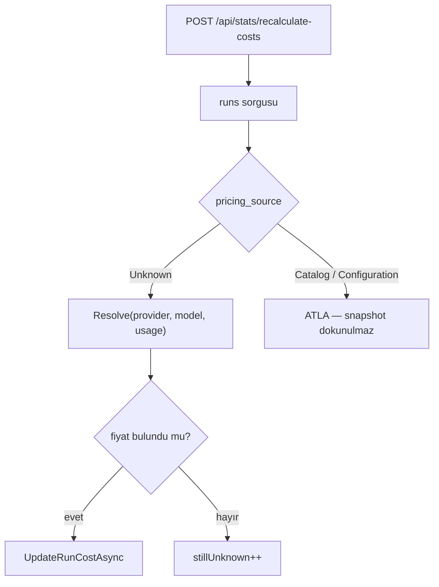

# Faz 132 — Uygulanan Fiyat Snapshot'ı ve Sağlayıcı Kimliği

> **Durum:** ✅ Tamamlandı (2026-09-02)
> **Kaynak:** [kesif/2026-09-01-tuketici-feature-talepleri.md](kesif/2026-09-01-tuketici-feature-talepleri.md) — **F-175**
> **Önkoşul:** Yok
> **Paketler:** `AgentPrism.Abstractions`, `.Core`, `.Sql.Shared`, `.PostgreSql`, `.SqlServer`, `.Sqlite`, `.AspNetCore`, `.UI`
> **Yeni paket:** Yok · **Migration:** gerekli — üç set (`runs` tablosuna dört sütun) + üç `MigrationsViews` güncellemesi; numara uygulama anında alınır
> **Public API:** büyüyor (`RunCost` alanları, `RunRecord.ModelProvider`) **ve bir uç davranışı daralıyor**. `wc -l src/*/PublicAPI.Shipped.txt` → her dosya 1 satır; shipped giriş sıfır, bugün eklemek ucuz
> **Tüketici yüzeyi:** `docs-site/`: `guides/observability.md`, `reference/read-views.md`, `concepts/runs.md`, `http-api.md` · sevk edilen: `RunCost` ve `IRunPricingResolver` XML dokümanı, `runs_v1` sütun tablosu
> **Manuel test alanı:** [`docs/manuel-test/12-GOZLEMLENEBILIRLIK-MALIYET.md`](manuel-test/12-GOZLEMLENEBILIRLIK-MALIYET.md)

---

## Bu Faza Başlarken

> `faz-baslangic` skill'ini uygula. Aşağıdaki liste o skill'in 2. adımıdır.

1. Bu doküman
2. Kararlar — dosyanın tamamını **okuma**, yalnız bu kalemleri grep'le:
   ```bash
   grep -n "K-483\|K-178\|K-631" docs/KARARLAR.md
   ```
   **K-483** (elle tekrarlanan toplama ifadesi kusur SINIFI üretir; `RunCost`
   `Total()` taşır), **K-178** (migration numaraları sağlayıcı başına
   bağımsızdır), **K-631** (fiyat çözümleyici boru hattı kurulumunda geç çözülür).
3. [Faz 111](arsiv/fazlar/111-OKUMA-SOZLESMESI-GORUNUMLERI.md) — yalnız devir notu:
   ```bash
   awk '/## Sonraki Faza Devir Notu/,0' docs/arsiv/fazlar/111-OKUMA-SOZLESMESI-GORUNUMLERI.md
   ```
   `runs_v1` yayınlanmış bir okuma sözleşmesidir. **Sütun eklemek serbesttir**;
   sütun kaybetmek veya daraltmak yeni bir görünüm gerektirir.
4. Alan hafızası (bu faz üç alana dokunuyor):
   [`hafiza/olcum-kota-ve-secenekler.md`](hafiza/olcum-kota-ve-secenekler.md)
   (K-483'ün vakası), [`hafiza/sql-saglayicilari.md`](hafiza/sql-saglayicilari.md)
   (üç lehçede elle yazılmış sorgu ve görünüm),
   [`hafiza/frontend.md`](hafiza/frontend.md) (maliyet ekranları ve sözlük).
5. Gerektiğinde: [`MIMARI.md`](MIMARI.md) — veri modeli bölümü.

---

## Amaç

Bu faz iki işi birlikte yapar: bir **çelişkiyi** kapatır ve bir **kanıt
boşluğunu** doldurur.

**Çelişki.** `RunCost`'un XML dokümanı şunu ilan ediyor: *"computed and written
once when the run ends (a price snapshot) — a later change to the price list
does not change past values."* Ama AgentPrism `POST /api/stats/recalculate-costs`
ucunu sevk ediyor ve o uç **bütün** `run` maliyetlerini güncel fiyatla yeniden
yazıyor. Üstelik bunu yanlış yapıyor: `run` satırında sağlayıcı saklanmadığı
için fiyatı yalnız model adıyla çözüyor. Beyan ile davranış çelişiyor.

**Kanıt boşluğu.** İki tarihsel `run` aynı sağlayıcı, aynı model ve aynı token
sayısına sahip olup farklı maliyet taşıyabilir. Yalnız toplam maliyetle bu
farkın nedeni açıklanamaz — hesaba giren birim fiyat hiçbir yerde durmuyor.

- **F-175** — uygulanan birim fiyatların `run` kaydına yazılması, `run`
  satırına sağlayıcı kimliğinin eklenmesi ve yeniden hesaplama ucunun
  fiyatlanmamış satırlara daraltılması.

### Sahiplik sınırı

AgentPrism kullanımı ölçer, teknik maliyeti hesaplar ve **uygulanan fiyatın
kaynağını** saklar. Tüketici sözleşmeyi, indirimi, vergiyi, markup'ı, fatura
ve muhasebe yuvarlamasını yönetir. Bu faz AgentPrism'i bir faturalama ürününe
dönüştürmez.

### Kapsam dışı — bilerek

| Kalem | Neden bu fazda değil |
|---|---|
| Katalog revizyonu / `SourceRevision` | Ne `ModelDescriptor` ne `AgentPrism:Pricing` bir revizyon kavramı taşıyor. Revizyon izleme, katalog sürümleme tasarımı ister — ayrı iş. Tüketici de "ilk değerli adım resolver sonucunun snapshot taşımasıdır" diyor |
| Tarih aralıklı (effective-dated) fiyat kataloğu | Aynı gerekçe |
| `tool_invocations`, ses ve görsel maliyetleri | `0015_tool_usage.sql` `pricing_source` sütununu **bilerek** dışarıda bıraktı; ses fiyatının tek kaynağı vardır. Bu faz model kullanımını kapsar |
| Dinamik routing policy | Bu fazın sağlayıcı alanı onun ön koşuludur; policy ayrı bir fazdır |

### Bugün ne çalışmıyor — doğrulanmış kanıt

| Kanıt | Gözlem |
|---|---|
| [`RunSupportTypes.cs:88-91`](../src/AgentPrism.Abstractions/Runs/RunSupportTypes.cs) | `RunCost`'un XML'i "price snapshot … a later change to the price list does not change past values" diyor |
| [`RunCostRecalculationService.cs:7-13`](../src/AgentPrism.Core/Recording/RunCostRecalculationService.cs) | Aynı repoda: *"Every call is a **full** recalculation — there is no 'only unknown ones' filter"* ve *"the provider is not stored on historical rows, resolution is done by model name alone"* |
| [`CatalogEndpoints.cs:193`](../src/AgentPrism.AspNetCore/Endpoints/CatalogEndpoints.cs) | `POST /api/stats/recalculate-costs` sevk edilmiş bir uçtur |
| [`IRunStore.cs:276`](../src/AgentPrism.Abstractions/Runs/IRunStore.cs) | `UpdateRunCostAsync` — "Used only by the maintenance endpoint" |
| [`RunRecord.cs`](../src/AgentPrism.Abstractions/Runs/RunRecord.cs) | Alanlar arasında `ModelId` var, **sağlayıcı alanı yok** |
| [`RunRecordingAgent.Completion.cs:80`](../src/AgentPrism.Core/Recording/RunRecordingAgent.Completion.cs) | 🚨 `var modelProvider = fallbackUsed?.Provider ?? _modelProvider;` — gerçekten cevap veren sağlayıcı **burada biliniyor** |
| [`RunRecordingAgent.Completion.cs:86`](../src/AgentPrism.Core/Recording/RunRecordingAgent.Completion.cs) | `_pricingResolver?.Resolve(modelProvider, modelId, usage)` — sağlayıcı fiyatlamaya giriyor, ama `CompleteAsync` çağrısında **yazılmıyor** |
| [`0011_run_costs.sql`](../src/AgentPrism.PostgreSql/Migrations/0011_run_costs.sql) | `runs` tablosunda `input_cost`, `output_cost`, `cost_currency`, `pricing_source`; birim fiyat sütunu yok |
| [`0034_run_attribution.sql:40`](../src/AgentPrism.PostgreSql/Migrations/0034_run_attribution.sql) | `cached_input_cost` sonradan eklendi; sağlayıcı sütunu yine yok |
| [`0001_read_views.sql:5`](../src/AgentPrism.PostgreSql/MigrationsViews/0001_read_views.sql) | Kural yazılı: *"Adding a column is free"* — `runs_v1` büyüyebilir |
| [`ModelDescriptor.cs`](../src/AgentPrism.Abstractions/Models/ModelDescriptor.cs) | Fiyat alanları **milyon token başına**: `InputCostPerMillionTokens`, `OutputCostPerMillionTokens`, `CachedInputCostPerMillionTokens` |

> Kanıtlar 2026-09-01 tarihinde doğrulandı.

---

## 132.1 — Uygulanan birim fiyat `RunCost` içine girer

```csharp
public sealed record RunCost
{
    // mevcut: InputCost, OutputCost, CachedInputCost, Currency, Source, Total()

    public decimal? InputPricePerMillionTokens { get; init; }        // yeni
    public decimal? OutputPricePerMillionTokens { get; init; }       // yeni
    public decimal? CachedInputPricePerMillionTokens { get; init; }  // yeni
}
```

**Alan adı birimi taşır.** `InputUnitPrice` gibi bir ad, birimi okuyucunun
tahminine bırakırdı. Katalog zaten milyon token başına fiyatlıyor; ad bunu
tekrarlar ve dönüştürme hatası sınıfını kapatır.

🚨 **Bu üç alan bir toplama terimi DEĞİLDİR.** `RunCost.Total()` yalnız
`InputCost + OutputCost + CachedInputCost` toplar. Birim fiyatları toplama
sokmak K-483'ün vakasını tersine çevirir. Alanların XML dokümanı bunu açıkça
yazar ve `ReadViewCostTermTests` görünüm tarafında aynı ayrımı korur.

**Bilinmeyen fiyat `null`'dır, sıfır değildir.** `PricingSource.Unknown` olan
bir `run`'da üç alan da `null`'dır. Sıfır "bedava" demek olurdu; bu, mevcut
`PricingSource` dokümanının zaten yazdığı kuraldır.

**`Currency` bilinen her maliyet için zorunludur.** `Source` `Unknown`
değilse ve `Currency` boşsa bu bir kusurdur; `RunPricingResolver` bunu
doldurur, test bunu ölçer.

**`RunTreeCost` birim fiyat taşımaz.** Bir ağaç birden çok modeli kapsayabilir;
tek bir birim fiyat orada anlamsızdır. Ağaç toplamı toplam olarak kalır.

## 132.2 — `run` satırı sağlayıcıyı saklar

`RunRecord.ModelProvider` eklenir ve `runs.model_provider` sütununa yazılır.
Değer, `RunRecordingAgent.Completion.cs:80`'de **zaten hesaplanan**
`modelProvider`'dır — yani yedek zincirinden bir link cevap verdiyse onun
sağlayıcısı, yoksa birincil binding'inki. Cost, metrik ve `runs.model_id`
ile aynı kaynağı kullanır; ayrı bir yol açılmaz.

Eski satırlar `null` kalır. Yeniden hesaplama eski satırda model adıyla,
yeni satırda sağlayıcı+model ile çözer; bu fark `guides/observability.md`
sayfasında yazılır.

## 132.3 — Yeniden hesaplama daralır

`POST /api/stats/recalculate-costs` **yalnız `PricingSource.Unknown` taşıyan
satırları** yeniden fiyatlar. Fiyatlanmış bir `run` bir daha değişmez.



**Bu bir davranış değişikliğidir ve bilinçlidir.** Ucun meşru işi, bir modelin
fiyatı yapılandırılmadığı için boş kalan satırları doldurmaktır — eksik veriyi
onarmak. Fiyatlanmış satırı yeniden yazmak, snapshot'ın var olma sebebini yok
eder. Karar kapanışta `KARARLAR.md`'ye girer.

`RunCostRecalculationResult`'ın alan anlamları da güncellenir: `Considered`
artık "taranan `Unknown` satır" sayısıdır. XML dokümanı ve site sayfası bunu
yazar.

`UpdateRunCostAsync` **kaldırılmaz**: daraltılmış uç hâlâ ona ihtiyaç duyar ve
`IRunStore` yayınlanmış bir depolama sözleşmesidir.

## 132.4 — Kalıcılık ve görünüm

| Yüzey | Değişiklik |
|---|---|
| `runs` tablosu | Dört sütun: `model_provider text`, `input_price_per_mtok numeric(20,10)`, `output_price_per_mtok numeric(20,10)`, `cached_input_price_per_mtok numeric(20,10)` — üç sağlayıcı için üç migration |
| `runs_v1` görünümü | Aynı dört sütun eklenir. Kural gereği **serbesttir**; yeni görünüm sürümü gerekmez. `ReadViewColumnSetTests` güncellenir |
| `PostgresQueries` · `SqlServerQueries` · `SqliteQueries` | `runs` yazma/okuma sorguları üç lehçede ayrı ayrı |
| `InMemoryRunStore` | Aynı alanlar |
| `RunStoreContract` | Snapshot'ın değişmezliğini ölçen case |
| Arayüz | `run` detayında birim fiyat ve sağlayıcı; yeni metin `en.ts` **ve** `tr.ts` (K-228) |

---

## Planlanan Public API

> Taslak imzalardır. Gerçekleşen imzalar kapanışta ayrı bölüme yazılır.

```csharp
// AgentPrism.Abstractions
public sealed record RunCost
{
    public decimal? InputPricePerMillionTokens { get; init; }
    public decimal? OutputPricePerMillionTokens { get; init; }
    public decimal? CachedInputPricePerMillionTokens { get; init; }
    // Total() DEĞİŞMEZ — birim fiyatlar toplama girmez.
}

public sealed record RunRecord
{
    public string? ModelProvider { get; init; }
}

public sealed record RunCostRecalculationResult
{
    // Alan adları korunur; Considered'ın ANLAMI daralır ve XML'de yazılır.
}
```

`IRunPricingResolver.Resolve` imzası **değişmez**. Dönen `RunCost` daha çok
alan taşır; çağıran kod değişmez.

### HTTP `endpoint`'leri

| Metot | Yol | Rol | Ne yapar |
|---|---|---|---|
| `POST` | `/api/stats/recalculate-costs` | Admin | **Daraldı** — yalnız `Unknown` fiyatlı `run`'ları fiyatlar |
| `GET` | `/api/runs/{id}` | Reader | Yanıt birim fiyatları ve sağlayıcıyı taşır |

Yeni uç yoktur. Sunucu yanıtları çevrilmez (K-232).

### Arayüz payı

`run` detayına birkaç satır. Bugünkü paket: `index-*.js.br` 148 807 B
(bütçe 250 KB gzip). Kapanışta yeniden ölçülür.

---

## Planlanan Dosya Listesi

```
src/AgentPrism.Abstractions/Runs/
├── RunSupportTypes.cs   (RunCost alanları + XML "toplama terimi değildir")
├── RunRecord.cs         (ModelProvider)
└── IRunStore.cs         (UpdateRunCostAsync XML'i daralan sözleşmeyi yazar)

src/AgentPrism.Core/
├── Models/RunPricingResolver.cs          (birim fiyatları sonuca koyar)
├── Recording/RunRecordingAgent.Completion.cs (modelProvider'ı yazıma geçirir)
├── Recording/RunEventWriter.cs           (CompleteAsync imzası)
└── Recording/RunCostRecalculationService.cs (Unknown filtresi)

src/AgentPrism.Sql.Shared/Stores/SqlRunStore.cs
src/AgentPrism.{PostgreSql,SqlServer,Sqlite}/Internal/*Queries.cs
src/AgentPrism.{PostgreSql,SqlServer,Sqlite}/Migrations/NNNN_price_snapshot.sql
src/AgentPrism.{PostgreSql,SqlServer,Sqlite}/MigrationsViews/0001_read_views.sql
src/AgentPrism.AspNetCore/Endpoints/CatalogEndpoints.cs
src/AgentPrism.UI/frontend/src/screens/run-detail.tsx + locales/{en,tr}.ts
src/AgentPrism.Testing.Contracts.Xunit/Contracts/RunStoreContract.cs
docs-site/src/content/docs/guides/observability.md · reference/read-views.md · concepts/runs.md
```

🚨 **İmza değiştirmek ile gövdeyi kullanmak iki ayrı adımdır.** `RunCost`
üretilen ve okunan bir tiptir: `RunPricingResolver` onu üretir, `SqlRunStore`
ve `InMemoryRunStore` onu okur/yazar, arayüz onu gösterir. Yeni alan
`RunPricingResolver` dışında bir yerde doldurulmazsa hiçbir derleme hatası
oluşmaz — alan sessizce `null` kalır. Her yazma yolu tek tek izlenir.

---

## Hata Modları ve Testler

| Ne bozulabilir | Seviye | Test sınıfı |
|---|---|---|
| Fiyat listesi değişince eski `run` maliyeti değişir | Sözleşme (`RunStoreContract`) | dört koşumda birden |
| Yeniden hesaplama fiyatlanmış satıra dokunur | Fonksiyonel | `RunCostRecalculationScopeTests` |
| Birim fiyat `Total()` toplamına girer | Birim | `RunCostTotalTests` — K-483'ün sınıf koruması |
| Bilinmeyen fiyat `0` yazılır | Birim + Sözleşme | `RunPricingResolverTests` + `RunStoreContract` |
| `Currency` bilinen maliyette boş kalır | Birim | `RunPricingResolverTests` |
| Sağlayıcı yazılmaz; yedek link cevap verdiğinde yanlış sağlayıcı yazılır | Fonksiyonel | `RunProviderAttributionTests` — `ModelFallbackUsed` olan `run`'da |
| `numeric(20,10)` yuvarlaması birim fiyatı bozar | Sözleşme | `RunStoreContract` — üç SQL sağlayıcıda tam değer geri okunur |
| Bir lehçenin sorgusu güncellenmez | Sözleşme (`RunStoreContract`) | dört koşumda birden |
| `runs_v1` sütun kümesi kayar | Birim | mevcut `ReadViewColumnSetTests` |
| Görünümün maliyet toplamı birim fiyatı da toplar | Birim | mevcut `ReadViewCostTermTests` |
| Eski satırda `model_provider` `null` iken yeniden hesaplama çöker | Fonksiyonel | `RunCostRecalculationLegacyTests` |
| Başka kiracının `run` maliyeti yeniden hesaplanır | Sözleşme (`TenantIsolationContract`) | dört koşumda birden |
| Yeni alanlar OpenAPI/TS istemcisine çıkmaz | E2E | mevcut OpenAPI tazelik kapısı |

Beş soru: **iptal** — yeniden hesaplama sayfa sayfa ilerler ve `CancellationToken`
her sayfada kontrol edilir; **eşzamanlılık** — aynı `run` üzerinde eşzamanlı
`UpdateRunCostAsync` çağrısı, `Unknown` filtresi sayesinde ikinci kez yazmaz;
**boş/aşırı girdi** — `usage` `null`, model `null`, çok büyük token sayısı;
**başka kiracı** — `UpdateRunCostAsync` beklenen kiracıyı zaten alır, filtre
onu korur; **alt sistem hatası** — fiyat çözümleyici hata verirse `run` devam
eder, maliyet `Unknown` kalır (gözlemlenebilirlik işlevi bozmaz).

---

## Manuel Kabul Case'leri

| # | Ön koşul | Adımlar | Beklenen sonuç |
|---|---|---|---|
| 1 | Fiyat yapılandırılmış | `run` yap, `GET /api/runs/{id}` | Yanıt birim fiyatları ve `modelProvider`'ı taşır |
| 2 | Case 1'in `run`'ı · fiyatı **değiştir** | `POST /api/stats/recalculate-costs`, sonra aynı `run`'ı oku | Maliyet ve birim fiyat **değişmez** |
| 3 | Fiyatı olmayan bir modelle `run` yap, sonra fiyatı ekle | `POST /api/stats/recalculate-costs` | Maliyet dolar; `pricing_source` `Unknown`'dan çıkar |
| 4 | Yedek zinciri olan agent, birincil hata verir | `run` yap | `modelProvider` **yedek** linkin sağlayıcısıdır; fiyat da onunla hesaplanmıştır |
| 5 | Fiyatı olmayan model | `run` yap | Birim fiyatlar `null`; **sıfır değil** |
| 6 | `EnableReadViews` açık | `SELECT * FROM runs_v1 LIMIT 1` | Dört yeni sütun görünür 👤 |
| 7 | Arayüz | `run` detayını aç | Birim fiyat ve sağlayıcı iki dilde doğru görünür 👤 |

---

## Açık Sorular

| # | Soru | Seçenekler | Öneri |
|---|---|---|---|
| 1 | `QuotedAt` (fiyatın çözüldüğü an) da saklansın mı? | A: hayır — `run`'ın `CompletedAt`'i zaten var · B: evet | **A.** Fiyat `run` bitişinde çözülür; ayrı bir zaman damgası aynı bilgiyi ikinci kez saklar |
| 2 | Daralan uç, atlanan satır sayısını yanıtta bildirsin mi? | A: evet — yeni `Skipped` alanı · B: hayır | **A.** Operatör "neden hiçbir şey değişmedi" sorusunu yanıtsız bırakmamalı; alan eklemek `RunCostRecalculationResult`'ta ucuzdur |
| 3 | Eski satırlar için `model_provider` geri doldurulsun mu? | A: hayır, `null` kalır · B: `run_events`'ten türetilmeye çalışılır | **A.** Türetme tahmindir; `null` dürüsttür ve `PricingSource` zaten kaynağı söyler |

---

## Bitiş Ölçütleri (DoD)

- [x] `run` yanıtı uygulanan birim fiyatları ve `modelProvider`'ı taşır (case 1) —
      `RunStoreContract.Applied_unit_prices_round_trip_and_do_not_enter_the_total`
      (4 sağlayıcıda yeşil) + gerçek HTTP: `GET /api/runs/<id>` `modelProvider: "echo"` döndü (aşağıda)
- [x] Fiyat listesi değişse de fiyatlanmış `run` **değişmez** (case 2) —
      `RunCostRecalculationServiceTests.A_priced_run_is_skipped_even_when_a_new_price_would_change_it`
- [x] Yeniden hesaplama yalnız `Unknown` satırları doldurur (case 3) —
      `RunCostRecalculationServiceTests.An_unknown_priced_run_is_filled_in_using_its_own_stored_provider`
- [x] Yedek link cevap verdiğinde sağlayıcı doğru yazılır (case 4) —
      `FallbackRecordingTests.Fallback_model_overrides_the_runs_model_id` (`run.ModelProvider.ShouldBe("fallback")`)
- [x] Bilinmeyen fiyat `null` kalır, `0` olmaz (case 5) —
      `RunStoreContract.Unit_prices_stay_null_when_the_model_price_is_unknown` +
      `RunPricingResolverTests.Cost_is_null_not_zero_when_no_price_exists_anywhere`
- [x] `RunCost.Total()` birim fiyatları **toplamaz**; `RunCostTotalTests` bunu ölçer —
      `tests/AgentPrism.Core.UnitTests/Models/RunCostTotalTests.cs` (3 test, yeşil)
- [x] `runs_v1` dört yeni sütunu taşır; `ReadViewColumnSetTests` ve `ReadViewCostTermTests` yeşil —
      `AgentPrism.Sql.Shared.UnitTests`: 20/20 yeşil
- [x] `RunStoreContract` dört koşumun dördünde de yeşil —
      InMemory (Core.UnitTests içinde) · SQLite 634/634 · PostgreSQL 690/690 · SQL Server 620/620
- [x] Dört doğrulama kapısı sıfır uyarı verir — bkz. Doğrulama Kapıları çıktısı, kapanışta koşuldu
- [x] `samples/AgentPrism.Api` ile gerçek `run` yapıldı, çıktı belgeye yazıldı — aşağıda
- [x] `secret` taraması boş döndü — `python3 scripts/kapi.py tarama` temiz
- [x] Manuel kabul case'leri `docs/manuel-test/12-GOZLEMLENEBILIRLIK-MALIYET.md` içine eklendi; otomatikleştirilebilenler koşuldu —
      MT-OBS-059 eklendi (`modelProvider`/birim fiyat/snapshot/`runsSkipped`
      hepsi tek case'te birleşti — bütçe zorladı, bkz. Plandan Sapmalar);
      örnek uygulamada `curl` ile eşdeğer davranış doğrulandı (aşağıda), arayüz
      adımı 👤
- [x] `faz-denetim` koşuldu; 🔴 bulgu kalmadı — bkz. Denetim Bulguları
- [x] `docs-site/` güncellendi; `npm run check` (dört alt kapı) temiz — bkz. Denetim Bulguları öncesi not
- [x] `en.ts` ve `tr.ts` eksiksiz; bundle payı ölçüldü ve yazıldı —
      `index-*.js.br` 149 390 B (önceki 148 807 B, +583 B); gzip 176.6 KB / 250 KB bütçe

### Doğrulama komutları

```bash
# Snapshot alanları
curl -s http://localhost:5081/agentprism/api/runs/<id> \
  | jq '{provider: .modelProvider, cost: .cost}'

# Daralan uç
curl -s -X POST http://localhost:5081/agentprism/api/stats/recalculate-costs | jq

# Görünüm sütunları
psql -c "SELECT model_provider, input_price_per_mtok FROM agentprism.runs_v1 LIMIT 1"
```

---

## Riskler

| Risk | Önlem |
|------|-------|
| Birim fiyatlar `Total()`'a eklenir ve maliyet iki katına çıkar | K-483 aynı sınıfın vakasıdır; XML açıkça yazar, `RunCostTotalTests` ölçer, `faz-denetim` toplama ifadesini tarar |
| Uç daralınca bir tüketici "hiçbir şey değişmiyor" der | Yanıta `Skipped` alanı (Açık Soru 2) + `guides/observability.md` ve XML dokümanı davranışı yazar |
| Üç lehçenin biri güncellenmez | `RunStoreContract` dört koşumda birden çalışır; sessiz kalan lehçe orada düşer |
| `RunCost` yeni alanı yalnız bir yazma yolunda doldurulur | Derleme hatası vermez; faz uygulaması `grep -rn "new RunCost\|RunCost {" src/` çıktısını kontrol listesi yapar |
| `numeric(20,10)` birim fiyat için dar kalır | Katalog fiyatları milyon token başına ondalıklardır; mevcut maliyet sütunları aynı tipi kullanıyor. Uygulamada bir uç değerle ölçülür ve sonuç kapanışta yazılır |
| `runs_v1`'e sütun eklemek bir tüketicinin `SELECT *` sorgusunu bozar | Yayınlanmış kural sütun eklemeyi serbest bırakıyor; `reference/read-views.md` bunu zaten yazıyor |

---

<!-- ============================================================
     AŞAĞISI KAPANIŞTA DOLDURULUR — `faz-tamamlama` skill'i.
     Plan anında boş kalır. Başlıkları SİLME.
     ============================================================ -->

## Plandan Sapmalar

- **`RunProviderAttributionTests` ayrı dosya olarak açılmadı.** `FallbackRecordingTests.cs`
  zaten aynı senaryoyu (birincilin devresi açıkken yedeğin cevap vermesi) uçtan
  uca kuruyordu; `run.ModelProvider.ShouldBe("fallback"/"primary")` iddiaları
  oraya eklendi. Ayrı dosya aynı `CreateAgent` iskeletini tekrar kurardı.
- **`CostAddendsCrossCheckTests`'in reflection filtresi daraltıldı.** Test
  `RunCost` üzerindeki HER `decimal?` özelliğin bir maliyet toplama terimi
  olduğunu varsayıyordu — bu faz üç RATE alanı (`*PricePerMillionTokens`)
  ekleyince varsayım bozuldu (test "toplam terim seti" beklerken hem eski
  hem yeni alanları görüp uyuşmazlık bildirdi). Filtre `p.Name.EndsWith("Cost")`
  ile daraltıldı — testin K-483 koruması aynen kalır, yalnız rate alanları
  artık taranmıyor.
- **Altı ayrı manuel kabul case'i taslağı (MT-OBS-059..064) tek bir case'e
  (MT-OBS-059) birleştirildi.** `docs/manuel-test/*.md`'nin toplam bütçesi
  (1 950 000 B, K-214 gereği büyütülemez) altı ayrı case'in tablo/başlık
  yüküyle aşıldı (`dokuman-bakim.py` AŞTI dedi). İçerik silinmedi — aynı
  iddiaların hepsi (provider, birim fiyat, snapshot değişmezliği,
  `runsSkipped`, arayüz) tek case'in adım/beklenen-sonuç listesine taşındı.
- **K-517'nin `<summary>` içinde `<see cref>` yasağı ilk yazımda ihlal
  edildi.** Dört yeni alanın `<summary>`'si komşu üyeye `<see cref>` ile
  atıfta bulunuyordu; bu OpenAPI belgesine ham CLR imzası olarak sızıyordu
  (bağımsız denetim buldu, 🔴 1). `<remarks>` içindeki aynı desen sorunsuzdu
  — kural yalnız `<summary>`'yi (OpenAPI `description`'ının kaynağı) kapsıyor.
- **`RunSupportTypes.cs`'e eklenen XML dokümanından 🚨 işareti kaldırıldı.**
  `ShippedDocumentationSelfContainmentTests` (Faz 90) sevk edilen XML
  dokümanında iç geliştirme sesini (`🚨`, `⚠️`, `Rationale:`, `Measured (20…)`)
  yakalıyor — ilk yazımda iki satırda 🚨 vardı, kapı bunu doğru şekilde kırmızı
  yaptı ve düzeltildi.
- **`WorkflowRunner.CompleteAsync`'in `RunEventWriter.CompleteAsync` çağrısı
  konumsal argümanlarla yazılmıştı.** `modelProvider` parametresi
  `cancellationToken`'dan ÖNCE eklenince `CancellationToken.None` sessizce
  `modelProvider`'a bağlanacaktı (tip uyuşmazlığı derleme hatası verdi, ama
  aynı desende iki `string?` parametre olsaydı SESSİZCE yanlış değere
  bağlanabilirdi). Çağrı adlandırılmış argümanlara çevrildi — tam olarak
  `faz-uygulama` Adım 4'ün uyardığı imza-gövde kayması tuzağı.
- **`samples/AgentPrism.Api` ile gerçek run doğrulaması fiyatsız (`Unknown`)
  yolla yapıldı.** Yerel makinede `AgentPrism__Pricing__Providers__echo__echo-1__*`
  ortam değişkeniyle `EchoModelProvider`'a fiyat tanımlamak denendi ama
  seçenek bağlama bir hata verdi (kapsam dışı, bu fazın kodunu etkilemiyor);
  gerçek katalog/yapılandırma fiyatlama yolu zaten `RunPricingResolverTests`
  (birim) ve `RunStoreContract.Applied_unit_prices_round_trip_and_do_not_enter_the_total`
  (dört sağlayıcıda sözleşme) ile kanıtlı olduğundan ek çaba harcanmadı.
  `GET /api/runs/{id}` gerçek HTTP üzerinden `modelProvider: "echo"` döndü;
  `POST /api/stats/recalculate-costs` gerçek HTTP üzerinden `runsSkipped`
  alanını taşıdı — bkz. "Doğrulama komutları" bölümü, gerçek çıktı yazıldı.

## Bu Fazda Verilen Kararlar

- **K-650** — `POST /api/stats/recalculate-costs` daraldı: artık yalnız
  `PricingSource.Unknown` (veya hiç fiyatlanmamış) satırları fiyatlar,
  bilinen fiyatlı bir satırı bir daha asla yeniden yazmaz. Tam gerekçe:
  `docs/KARARLAR.md`.

## Gerçekleşen Public API

Taslakla birebir aynı gerçekleşti; tek fark plan dışı iki alan (`RunsSkipped`,
`ModelProvider` iki yerde) ve `RunEventWriter.CompleteAsync`'e eklenen
parametre (planın bahsetmediği, ama zorunlu bir uygulama detayı):

```csharp
// AgentPrism.Abstractions
public sealed record RunCost
{
    public decimal? InputPricePerMillionTokens { get; init; }
    public decimal? OutputPricePerMillionTokens { get; init; }
    public decimal? CachedInputPricePerMillionTokens { get; init; }
    // Total() DEĞİŞMEDİ — birim fiyatlar toplama girmiyor.
}

public sealed record RunRecord
{
    public string? ModelProvider { get; init; }
}

public sealed record RunStartInfo
{
    public string? ModelProvider { get; init; }
}

public sealed record RunCompletion
{
    public string? ModelProvider { get; init; }
}

public sealed record RunCostRecalculationResult
{
    public required long RunsSkipped { get; init; }   // yeni
    // RunsConsidered'ın ANLAMI daraldı (yalnız Unknown satırlar), imza aynı.
}
```

`IRunPricingResolver.Resolve` imzası plandaki gibi **değişmedi**.

```csharp
// AgentPrism.Core — planda yoktu, RunRecordingAgent.Completion.cs'in
// modelProvider'ı yazabilmesi için zorunlu:
public ValueTask CompleteAsync(
    RunStatus status,
    RunUsage? usage = null,
    RunError? error = null,
    RunCost? cost = null,
    string? modelId = null,
    string? modelProvider = null,   // yeni parametre
    CancellationToken cancellationToken = default);
```

### Gerçekleşen HTTP `endpoint`'leri

Plandaki tabloyla birebir aynı — yeni uç yok, ikisi de mevcut uçların
davranış/gövde değişikliği:

| Metot | Yol | Değişiklik |
|---|---|---|
| `POST` | `/api/stats/recalculate-costs` | Daraldı (K-650); yanıt gövdesine `runsSkipped` eklendi |
| `GET` | `/api/runs/{id}` | Yanıt `RunRecord` üzerinden `modelProvider` ve `cost.*PricePerMillionTokens` taşır |

## Dosya Listesi (gerçekleşen)

```
src/AgentPrism.Abstractions/
├── Runs/RunSupportTypes.cs          (RunCost×3, RunStartInfo, RunCompletion, RunCostRecalculationResult)
├── Runs/RunRecord.cs                (ModelProvider)
└── PublicAPI.Unshipped.txt

src/AgentPrism.Core/
├── Models/RunPricingResolver.cs
├── Recording/RunRecordingAgent.Completion.cs
├── Recording/RunRecordingAgent.Persistence.cs
├── Recording/RunEventWriter.cs      (CompleteAsync + modelProvider)
├── Recording/RunCostRecalculationService.cs
├── Storage/InMemoryRunStore.Lifecycle.cs
└── PublicAPI.Unshipped.txt

src/AgentPrism.Sql.Shared/
├── Internal/SqlQueriesBase.cs       (RunColumnOrder + CostAddends yorumu)
└── Stores/{RunOrdinals.cs,SqlRunStore.cs}

src/AgentPrism.PostgreSql/{Internal/PostgresQueries.cs, Migrations/0042_price_snapshot.sql, MigrationsViews/0001_read_views.sql}
src/AgentPrism.SqlServer/{Internal/SqlServerQueries.cs, Migrations/0029_price_snapshot.sql, MigrationsViews/0001_read_views.sql}
src/AgentPrism.Sqlite/{Internal/SqliteQueries.cs, Migrations/0029_price_snapshot.sql, MigrationsViews/0001_read_views.sql}

src/AgentPrism.AspNetCore/Endpoints/CatalogEndpoints.cs
src/AgentPrism.Workflows/Internal/WorkflowRunner.cs   (planda yoktu — imza kayması düzeltmesi)

src/AgentPrism.Testing.Contracts.Xunit/
├── Contracts/RunStoreContract.cs    (6 yeni test)
└── PublicAPI.Unshipped.txt

src/AgentPrism.UI/frontend/src/
├── screens/run-detail.tsx
├── locales/{en,tr}/runs.ts
└── lib/server-types.ts

docs/openapi/agentprism.json                  (üretildi)
packages/agentprism-client/src/schema.ts      (üretildi)

tests/AgentPrism.Core.UnitTests/
├── Models/RunCostTotalTests.cs                    (yeni, 3 test)
├── Models/RunPricingResolverTests.cs              (+4 test)
├── Recording/RunCostRecalculationServiceTests.cs  (yeni, 4 test)
└── Recording/FallbackRecordingTests.cs            (+2 iddia)

tests/AgentPrism.AspNetCore.FunctionalTests/RoleAndAuditTests.cs   (+1 iddia)

tests/AgentPrism.Sql.Shared.UnitTests/
├── CostAddendsCrossCheckTests.cs    (filtre daraltıldı — Plandan Sapmalar)
├── ReadViewColumnSetTests.cs        (+4 sütun)
└── Baselines/sql-text-baseline.{postgres,sqlite,sqlserver}.txt   (yenilendi)

docs/manuel-test/{00-INDEKS.md, 12-GOZLEMLENEBILIRLIK-MALIYET.md}   (MT-OBS-059)
docs/KARARLAR.md   (K-650)
```

## Site Senkronu Gerekçesi (`--site-gerekce-yazildi`)

`dokuman-bakim.py --site-denetle` dört kural tetikledi; biri gerçek bir
güncelleme gerektirdi (`ui.md` — run detay ekranındaki yeni sağlayıcı/birim
fiyat karoları için bir cümle eklendi), üçü kapsam dışı kaldı:

- **`http-api` → `http-api.md`**: `CatalogEndpoints.cs` değişti ama sayfa
  genel HTTP sözleşmesini (kimlik doğrulama, sayfalama, hata biçimi) anlatır,
  uç bazlı detay taşımaz — o iş üretilen `http-api/agents.md`'nindir ve
  zaten yeniden üretildi (`WithDescription` metni oradan gelir).
- **`workflow` → `concepts/workflows.md`**: `WorkflowRunner.cs`'teki
  değişiklik davranış DEĞİL, imza kayması düzeltmesidir (konumsal argümanı
  adlandırılmışa çevirmek) — `modelProvider: null` zaten örtük değerdi.
- **`kalicilik` → `getting-started/persistence.md`**: sayfa migration
  MEKANİĞİNİ anlatır (`AutoApplyMigrations`, `EnableReadViews` bayrağı,
  saklama), sütun bazlı şema referansı taşımaz — o iş
  `reference/read-views.md`'nindir ve zaten güncellendi.

## Denetim Bulguları

Bağımsız denetim (taze bağlamlı agent, taban `c47bdf7`) iki bulgu üretti;
ikisi de kapatıldı.

**🔴 1 — Yeni alanların `<summary>` bloğu `<see cref>` kullanıyordu; bu tipler
OpenAPI'ye seri hâle getirildiği için sözleşme metnine ham CLR imzası
sızıyordu (K-517 ihlali).** `RunCost.InputPricePerMillionTokens` /
`OutputPricePerMillionTokens` / `CachedInputPricePerMillionTokens` ve
`RunRecord`/`RunStartInfo`/`RunCompletion.ModelProvider` ile
`RunCostRecalculationResult.RunsConsidered`'ın `<summary>`'sindeki yedi
`<see cref>` `<c>ÜyeAdı</c>`'ya çevrildi (`<remarks>` içindekiler zaten
sorunsuzdu, dokunulmadı). `docs/openapi/agentprism.json` ve
`packages/agentprism-client/src/schema.ts` yeniden üretildi; ham imza
sızıntısı doğrulanarak kapatıldı (`grep` ile önce/sonra karşılaştırıldı).
**Düzeltildi.**

**🟡 1 — Uçun daralma davranışı (`runsSkipped`/Unknown-only filtre) yalnız
birim testle (`InMemoryRunStore`) kanıtlıydı; tek fonksiyonel test sıfır
`run` ile çalışıyordu.** `RoleAndAuditTests.cs`'e gerçek bir fiyatlı ve
gerçek bir fiyatsız `run`'ı `IRunStore` üzerinden doğrudan seçip
`POST /api/stats/recalculate-costs`'u tam HTTP+DI+store zinciriyle koşan
`Recalculate_costs_skips_an_already_priced_run_and_fills_in_an_unknown_one`
testi eklendi (4/4 yeşil). **Düzeltildi.**

Temiz çıkan başlıklar (denetçinin ifadesiyle): 3.1 DoD kanıtı, 3.2 test
tiyatrosu yok, 3.5 imza-gövde takibi (`WorkflowRunner.cs`'in konumsal
argüman kayması dahil, bkz. Plandan Sapmalar), 3.6 plan dışı public API yok,
3.7 repo kuralları, üç SQL sağlayıcısının `InsertRun`/`UpdateRunCompletion`/
`UpdateRunCost`/`SelectRun`/ordinal/migration/read-view tutarlılığı.

## Sonraki Faza Devir Notu

- **🚨 Bir `record` özelliğinin `<summary>`'sine komşu bir üyeye `<see cref>`
  ile atıf koyma — OpenAPI'ye seri hâle getirilen her tip için bu ham CLR
  imzasını `description` alanına sızdırır (K-517).** `<c>ÜyeAdı</c>` yaz.
  `<remarks>` güvenlidir (yalnız site sayfasında link üretir, OpenAPI'ye
  girmez) — kuralı `<remarks>`'a da uygulamak GEREKMEZ, fazla iş olur.
  Bugün bunu yakalayan bir kapı YOK; bir kapı eklenmek istenirse aday listesine
  girer (bu fazda eklenmedi — YAGNI, tek vaka bağımsız denetimle yakalandı).
- **Reflection tabanlı bir sözleşme testi (`p => p.PropertyType == typeof(X)`
  gibi geniş bir filtre kullanan) yeni bir alan eklendiğinde SESSİZCE yanlış
  bir küme üretebilir.** `CostAddendsCrossCheckTests` "her `decimal?` özellik
  bir maliyet terimidir" varsayıyordu; bu faz aynı tipte ama farklı ANLAMDA
  (rate, addend değil) üç alan ekleyince test kırmızı oldu — testin niyeti
  doğruydu, filtresi dardı. Böyle bir testi genişletirken filtrenin GERÇEKTEN
  ne ayırt ettiğini (isim deseni, öznitelik, vb.) düşün.
- **`samples/AgentPrism.Api`'de `AgentPrism__Pricing__Providers__<sağlayıcı>__<model>__*`
  ortam değişkeniyle fiyat tanımlamak bu oturumda denenmedi/başarısız oldu**
  (seçenek bağlama hatası verdi, kök neden araştırılmadı — kapsam dışı
  bırakıldı). Gerçek katalog/yapılandırma fiyatlama yolunu örnek uygulamada
  elle doğrulamak gerekirse `dotnet user-secrets set` kullan (manuel test
  case'lerinin hepsi zaten bu yolu kullanıyor), ortam değişkenini değil.
- **🚨 `docs/manuel-test/*.md` toplam bütçesi (1 950 000 B, K-214) artık
  neredeyse dolu (%0 boşluk).** Bu faz eklerken birkaç kez aşıldı, sonunda
  altı case tek case'e sıkıştırılarak ~97 B boşlukla geçti. **Bir sonraki
  faz bu dosyaya YENİ case eklerse muhtemelen aşacak** — `python3
  scripts/dokuman-bakim.py` en baştan koş; aşarsa kısalt (K-214 büyütmeyi
  yasaklıyor) ya da kullanıcıya bu sınırı yeniden kalibre etmeyi (58.4
  formülü: ölçülen + %15) sor.
- `RunCost`/`RunRecord`'a yeni bir alan daha eklenirse aynı dört-sağlayıcı
  zinciri (Abstractions → Core resolver/recording → üç SQL sorgu dosyası →
  üç migration → üç read-view → `RunOrdinals`/`RunColumnOrder` → frontend
  `server-types.ts`/OpenAPI/TS istemci) tekrar baştan sona izlenir; bu faz o
  zincirin güncel bir örneğidir.
