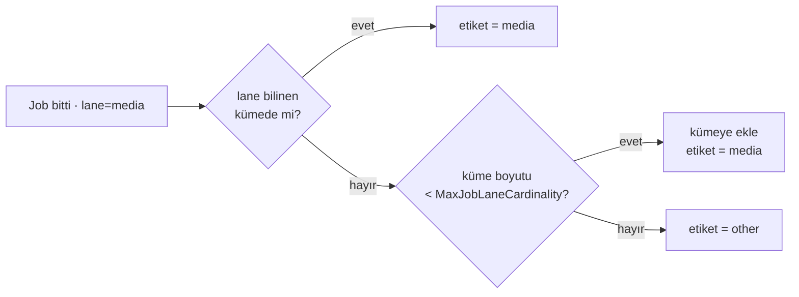
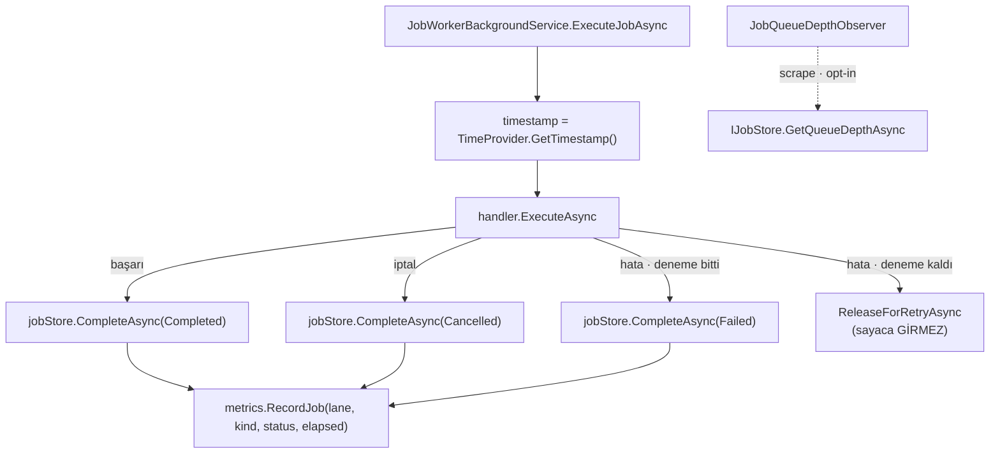

# Faz 133 — İş Kuyruğu Metrikleri

> **Durum:** ✅ Tamamlandı (2026-09-02)
> **Kaynak:** [ADAYLAR.md](ADAYLAR.md) — **F-178** (job/kuyruk metrikleri yarısı; model deneme telemetrisi yarısı adaylıkta kalır)
> **Önkoşul:** [Faz 129](arsiv/fazlar/129-IS-KUYRUGU-LANELERI.md) — `lane` kimliği olmadan metrik etiketlenemez
> **Paketler:** `AgentPrism.Abstractions`, `.Core`, `.Sql.Shared`, `.PostgreSql`, `.SqlServer`, `.Sqlite`, `.Testing.Contracts.Xunit`
> **Yeni paket:** Yok · **Migration:** **Yok** — ölçüldü: derinlik sorgusu Faz 129'un `jobs_claim_idx (lane, status, scheduled_for) WHERE status IN (0,1,2)` index'i tarafından zaten kapsanıyor
> **Public API:** büyüyor — `IJobStore`'a bir aggregate metot, iki options alanı, bir `record`. `wc -l src/*/PublicAPI.Shipped.txt` → her dosya 1 satır; shipped giriş **sıfır**, bugün eklemek hâlâ ucuz
> **Tüketici yüzeyi:** `docs-site/`: `guides/observability.md` (metrik **ve** etiket tabloları), `guides/background-work.md`, `reference/configuration.md`, `guides/write-your-own-store.md` (yeni store metodu) · sevk edilen: `IJobStore` XML dokümanı, `AgentPrismDiagnostics` sabitleri
> **Manuel test alanı:** [`docs/manuel-test/16-IS-KUYRUGU-VE-ZAMANLAMA.md`](manuel-test/16-IS-KUYRUGU-VE-ZAMANLAMA.md) — 🚨 **Önce 133.0'ı uygula**, bütçe 97 bayt boş

---

## Bu Faza Başlarken

> `faz-baslangic` skill'ini uygula. Aşağıdaki liste o skill'in 2. adımıdır —
> **tamamını değil, yalnız işaret edilen bölümleri oku.**

1. Bu doküman
2. Kararlar — dosyanın tamamını **okuma**, yalnız bu kalemleri grep'le:
   ```bash
   grep -n "K-151\|K-214\|K-178" docs/KARARLAR.md
   ```
   **K-151** (`agentprism.run.cost` ağaç toplamını içermez — sayaç kapsamı
   kuralı), **K-214** (manuel test bütçesi büyütülmez), **K-178** (migration
   numaraları sağlayıcı başına bağımsızdır).
3. [Faz 129](arsiv/fazlar/129-IS-KUYRUGU-LANELERI.md) — yalnız devir notu:
   ```bash
   awk '/## Sonraki Faza Devir Notu/,0' docs/arsiv/fazlar/129-IS-KUYRUGU-LANELERI.md
   ```
   `lane` sözleşmesini, `MaxConcurrentJobsPerLane` ile `Lanes`'in etkileşimini
   (Sapma 4) ve index'in kısmi koşulundaki düzeltmeyi (Sapma 6) o faz yazdı.
4. Alan hafızası (bu faz iki alana dokunuyor):
   [`hafiza/olcum-kota-ve-secenekler.md`](hafiza/olcum-kota-ve-secenekler.md)
   (`QuotaUsageObserver`'ın gauge deseni ve seçenek tuzakları),
   [`hafiza/sql-saglayicilari.md`](hafiza/sql-saglayicilari.md) (üç lehçede
   elle yazılan sorgu).
5. Gerektiğinde, tamamı değil ilgili bölümü:
   [`MIMARI.md`](MIMARI.md) — gözlemlenebilirlik bölümü.

---

## Amaç

Faz 129 `lane`'i sevk etti: iş artık ayrılabiliyor ve `lane` başına
eşzamanlılık alabiliyor. Ama **hiçbiri ölçülmüyor.** `AgentPrismMetrics` on
enstrüman taşıyor ve **hiçbiri job hakkında değil**. Operatör şu üç soruyu
bugün yanıtlayamaz:

- Hangi `lane`'de iş birikiyor?
- Bir `lane`'in eşzamanlılık bütçesi dar mı, geniş mi?
- Hangi `JobKind` başarısız oluyor ve ne kadar sürüyor?

Faz 129'un devir notu bunu açıkça bırakmıştı: *"Kimsenin dinlemediği bir
`lane`'de biriken iş otomatik ALARM üretmiyor — metrik fazı bunu kapatabilir."*

- **F-178 (birinci yarı)** — `lane` etiketli job sayaç ve süre histogramı,
  ve opt-in bir kuyruk derinliği gauge'ı.

### Kapsam dışı — bilerek

| Kalem | Neden bu fazda değil |
|---|---|
| Model deneme (attempt) süresi ve indeksi | Farklı alt sistem (`FallbackChatClient`), farklı hata modu, farklı aciliyet. Tüketici de bunu "gerçek bir üretim olayından sonra yeniden açacağız" diye erteledi. **F-178'in kalan yarısı olarak adaylıkta durur** |
| Kuyruk derinliği için alarm/eşik | AgentPrism ölçer, eşiği tüketicinin gözlemlenebilirlik yığını koyar |
| Job başına `run` maliyeti | `agentprism.run.cost` zaten `run` düzeyinde ölçüyor; job düzeyinde tekrarlamak K-151'in kapsam kuralını bulandırır |
| Yeni HTTP ucu veya ekran | Metrik yüzeyi OTel'dir. `/api/jobs?lane=` ve jobs ekranı Faz 129'da sevk edildi |

### Bugün ne çalışmıyor — doğrulanmış kanıt

| Kanıt | Gözlem |
|---|---|
| [`AgentPrismMetrics.cs:45-93`](../src/AgentPrism.Core/Diagnostics/AgentPrismMetrics.cs) | On enstrüman: `Runs`, `RunDuration`, `Tokens`, `ToolInvocations`, `ToolDuration`, `RunCost`, `JudgeCost`, `JudgeScore`, `ModelCacheLookups`, `AgentSourceFailures`. `grep -i job` → **sıfır eşleşme** |
| [`AgentPrismDiagnostics.cs:40-73`](../src/AgentPrism.Core/Diagnostics/AgentPrismDiagnostics.cs) | Ölçüm adı sabitleri arasında job veya kuyruk adı yok |
| [`IJobStore.cs`](../src/AgentPrism.Abstractions/Scheduling/IJobStore.cs) | On bir metot; **hiçbiri aggregate değil**. `QueryAsync` kayıt döndürür, `JobQuery.Take` varsayılanı 50'dir — derinlik sayımı için kullanılamaz |
| [`IRunStore.cs:179`](../src/AgentPrism.Abstractions/Runs/IRunStore.cs) · `:251` | **Precedent:** `GetStatisticsAsync` ve `GetTimeSeriesAsync` aggregate metotları `IRunStore`'un **üstünde** yaşıyor. Job tarafında karşılığı yok |
| [`AgentPrismOptions.cs:487`](../src/AgentPrism.Core/AgentPrismOptions.cs) | **Precedent:** `EnableQuotaUsageGauge` *varsayılan kapalıdır* — gerekçesi XML'de: *"the gauge reads the database … must be explicitly requested"* — ve `QuotaUsageRefreshInterval` ile önbelleklenir |
| [`QuotaUsageObserver.cs:103-112`](../src/AgentPrism.Core/Quotas/QuotaUsageObserver.cs) | **Precedent:** `CreateObservableGauge` + `IHostedService`'i yalnız *"container'ın nesneyi ERKEN kurması için"* uygulayan desen |
| [`JobWorkerBackgroundService.cs:26-34`](../src/AgentPrism.Core/Scheduling/JobWorkerBackgroundService.cs) | Primary constructor; `TimeProvider?` ve `ILogger?` **isteğe bağlı** parametreler. `AgentPrismMetrics?` aynı desenle eklenir |
| `Registration.Core.cs:311` | `services.TryAddSingleton(… new AgentPrismMetrics(…))` — metrikler **her zaman** kayıtlıdır, koşullu değil |
| [`0041_job_lanes.sql:44`](../src/AgentPrism.PostgreSql/Migrations/0041_job_lanes.sql) | `jobs_claim_idx ON jobs (lane, status, scheduled_for) WHERE status IN (0, 1, 2)` — 🚨 **derinlik sorgusunun tam olarak ihtiyaç duyduğu index budur**; yeni migration gerekmez |
| [`JobStatus.cs`](../src/AgentPrism.Abstractions/Scheduling/JobStatus.cs) | `Pending=0`, `Leased=1`, `Running=2`, `Completed=3`, `Failed=4`, `Cancelled=5` |
| [`JobLanes.cs`](../src/AgentPrism.Abstractions/Scheduling/JobLanes.cs) | `lane` adı **tüketicinin seçtiği** serbest bir dizedir; biçim sınırlı, **sayı sınırsızdır** — kardinalite riski buradan doğar |
| `observability.md:63-74` · `:84-94` | Site iki tablo taşıyor (metrik adları, etiketler); ikisi de büyüyecek |

> Kanıtlar 2026-09-02 tarihinde doğrulandı.

---

## 133.0 — Fazın ilk işi: manuel test bütçesinin kalibrasyonu

🚨 **Bu adım koddan öncedir.** `docs/manuel-test/*.md` bugün
**1 949 903 / 1 950 000 B** taşıyor — 97 bayt boş. Bu fazın case'leri (ve
sonraki her fazınki) o bütçeye sığmaz.

Kullanıcı 2026-09-02'de kararı verdi: **bütçe yeniden kalibre edilir.**
K-214'ün amacı sınırsız büyümeyi engellemekti, sabit bir sayıyı korumak değil;
sayı 1 746 526 B ölçümüne göre konmuştu ve set o günden beri meşru biçimde
büyüdü.

| Ne | Değer |
|---|---|
| Dosya | `scripts/dokuman-bakim.py:177` |
| Bugünkü satır | `("docs/manuel-test", False, True): 1_950_000,   # DEGISMEDI; olculen 1_746_526.` |
| Yeni değer | **`2_250_000`** — Faz 58'in formülü: ölçülen (1 949 903) + %15 = 2 242 388, yukarı yuvarlanır |
| Yorum biçimi | `# YENI; olculen 1_949_903` — dosyadaki mevcut konvansiyon |

Kalibrasyon **bir karardır** ve kapanışta `KARARLAR.md`'ye girer: K-214'ü
iptal etmez, yalnız sayısını bir kez yeniden ölçüme bağlar. Kapanışta yazılacak
cümle: *"bütçe büyütmek serbest değildir; yeniden kalibrasyon yalnız ölçülen
değere + %15 olarak, kullanıcı kararıyla yapılır."*

Kalibrasyondan sonra `python3 scripts/dokuman-bakim.py --denetle` koşulur ve
`docs/manuel-test` satırının `ok` döndüğü görülür. Ancak ondan sonra case yazılır.

---

## 133.1 — Üç enstrüman

| Ad | Tür | Birim | Etiketler |
|---|---|---|---|
| `agentprism.job.executions` | `Counter<long>` | `{job}` | `lane`, `kind`, `status`, `tenant` |
| `agentprism.job.duration` | `Histogram<double>` | `s` | `lane`, `kind`, `status` |
| `agentprism.job.queue.depth` | `ObservableGauge<long>` | `{job}` | `lane`, `status` |

`status` yalnız **terminal** değerleri taşır (`Completed`, `Failed`,
`Cancelled`) — sayaç bir işin bittiğini sayar. Bir `lease` yenilemesi veya
`retry` bırakması sayaca girmez; bunlar `agentprism.job.executions`'ın anlamını
"kaç iş bitti"den "kaç kez bir şey oldu"ya kaydırırdı.

`agentprism.job.duration` `TimeProvider.GetTimestamp()`/`GetElapsedTime()` ile
ölçülür — duvar saati değil, **monotonik** saat. `TimeProvider` zaten worker'a
enjekte edilmiştir; test onu sahteleyebilir.

🚨 **Derinlik gauge'ında `tenant` etiketi YOKTUR.** Kuyruk derinliği bir
operatör sinyalidir ve `LeaseAsync` zaten `[TenantAgnostic]`'tir. Kiracı
etiketi eklemek hem kardinaliteyi kiracı sayısıyla çarpar hem de var olmayan
bir kiracı sınırı ima eder.

## 133.2 — Kardinalite muhafızı

`lane` adı, AgentPrism'in **kontrol etmediği** tek etiket değeridir. Bir
tüketici kullanıcı başına `lane` üretirse metrik altyapısı boğulur.

Muhafaza basittir: süreç, gördüğü farklı `lane` adlarını sayar. Sayı
`AgentPrismObservabilityOptions.MaxJobLaneCardinality` değerini aşarsa, yeni
`lane`'ler `lane` etiketine **`"other"`** olarak yazılır. Var olan `lane`'ler
adlarını korur; sıra geliş sırasıdır ve süreç ömrü boyunca sabittir.



Küme yalnız **büyür** ve hiç küçülmez; bir `lane` bir kez ada kavuştuysa
metrik serisi kararlı kalır. Küçülen bir küme, aynı `lane`'i bir gün adıyla
bir gün `other` ile yazardı — bu, gösterge panelinde okunamayan bir seri
üretir.

## 133.3 — Kuyruk derinliği: yeni store metodu

Derinlik, kayıt listelemekle ölçülemez. `IJobStore` bir aggregate metot alır:

```csharp
ValueTask<IReadOnlyList<JobQueueDepth>> GetQueueDepthAsync(
    CancellationToken cancellationToken = default);
```

`IRunStore.GetStatisticsAsync`/`GetTimeSeriesAsync` ile aynı yerleşim: aggregate
sorgu store sözleşmesinin **üstünde** yaşar, ayrı bir arayüze bölünmez.

Sorgu yalnız **açık** durumları sayar (`Pending`, `Leased`, `Running`) ve
`lane` × `status` ile gruplar. Ölçüldü: bu tam olarak
`jobs_claim_idx (lane, status, scheduled_for) WHERE status IN (0,1,2)`
index'inin kapsadığı kümedir — **migration gerekmez.**

Terminal durumlar (`Completed`, `Failed`, `Cancelled`) sayılmaz: onlar
sayaçtan okunur, tabloyu taramaktan değil. Bu ayrım gauge'ın maliyetini
kuyruk büyüklüğüne değil **açık iş** sayısına bağlar.

## 133.4 — Gauge varsayılan kapalıdır

`AgentPrismObservabilityOptions`:

```csharp
public bool EnableJobQueueDepthGauge { get; set; }                       // varsayılan false
public TimeSpan JobQueueDepthRefreshInterval { get; set; } = TimeSpan.FromSeconds(30);
public int MaxJobLaneCardinality { get; set; } = 64;
```

Sayaç ve histogram **açıktır** (varsayılan davranış, olay başına sıfır ek
sorgu). Gauge **kapalıdır**, çünkü veritabanı okur — `EnableQuotaUsageGauge`
ile birebir aynı gerekçe ve aynı önbellek deseni. K1.

`JobQueueDepthObserver`, `QuotaUsageObserver`'ın şeklini kopyalar:
`CreateObservableGauge` kurucuda, `IHostedService` yalnız nesnenin erken
kurulması için, önbellek `RefreshInterval` ile.

🚨 **Gözlemlenebilirlik işlevselliği bozmaz.** Derinlik sorgusu hata verirse
gauge uyarı loglar; worker etkilenmez, `run` etkilenmez.
**Uygulamada plandan sapıldı:** boş ölçüm döndürmek yerine **önceki geçerli
snapshot korunur** — `QuotaUsageObserver`'ın birebir deseni. Sıfıra düşmek bir
gösterge panelinde "kuyruk boşaldı" diye okunurdu, oysa bilinen tek şey
sorgunun cevap vermediğidir. Bunun bedeli: kalıcı bir arızada derinlik son
bilinen değerde **donar** ve donduğu log'dan anlaşılır. Aynı kural sayaç için de geçerlidir: metrik yazımı bir job'un
tamamlanmasını hiçbir koşulda engellemez.

## 133.5 — Nereden ölçülür



`ReleaseForRetryAsync` yolu sayaca girmez: iş bitmemiştir, yeniden denenecektir.
Nihai `Failed` sayıldığında o işin **toplam** süresi değil, **son denemenin**
süresi yazılır — histogramın anlamı "bir denemenin ne kadar sürdüğü"dür ve
XML dokümanı bunu açıkça söyler.

---

## Planlanan Public API

> Taslak imzalardır. Gerçekleşen imzalar kapanışta ayrı bölüme yazılır.

```csharp
// AgentPrism.Abstractions
/// <summary>One lane/status pair's open job count.</summary>
public sealed record JobQueueDepth
{
    public required string Lane { get; init; }
    public required JobStatus Status { get; init; }
    public required long Count { get; init; }
}

public interface IJobStore
{
    // Yeni. Yalnız Pending/Leased/Running sayılır.
    ValueTask<IReadOnlyList<JobQueueDepth>> GetQueueDepthAsync(
        CancellationToken cancellationToken = default);
}

// AgentPrism.Core — AgentPrismObservabilityOptions
public bool EnableJobQueueDepthGauge { get; set; }
public TimeSpan JobQueueDepthRefreshInterval { get; set; } = TimeSpan.FromSeconds(30);
public int MaxJobLaneCardinality { get; set; } = 64;

// AgentPrism.Core — AgentPrismMetrics
public Counter<long> JobExecutions { get; }
public Histogram<double> JobDuration { get; }
public void RecordJob(string lane, JobKind kind, JobStatus status, string? tenantId, TimeSpan duration);

// AgentPrism.Core — AgentPrismDiagnostics
public const string JobCounterName = "agentprism.job.executions";
public const string JobDurationName = "agentprism.job.duration";
public const string JobQueueDepthGaugeName = "agentprism.job.queue.depth";
public static class Tags
{
    public const string Lane = "agentprism.job.lane";
    public const string JobKind = "agentprism.job.kind";
    public const string JobStatus = "agentprism.job.status";
}
```

`GetQueueDepthAsync` kiracı parametresi **almaz** ve implementasyonu
`[TenantAgnostic]` işaretlenir — 133.1'deki gerekçeyle.

### HTTP `endpoint`'leri

Yok. Metrik yüzeyi OTel'dir.

### Arayüz payı

Yok — bu faz arayüze dokunmaz.

---

## Planlanan Dosya Listesi

```
src/AgentPrism.Abstractions/Scheduling/
├── IJobStore.cs          (GetQueueDepthAsync)
└── JobSupportTypes.cs    (JobQueueDepth)

src/AgentPrism.Core/
├── Diagnostics/AgentPrismDiagnostics.cs   (üç ad + üç etiket sabiti)
├── Diagnostics/AgentPrismMetrics.cs       (iki enstrüman + RecordJob + kardinalite muhafızı)
├── Scheduling/JobQueueDepthObserver.cs    (yeni · QuotaUsageObserver deseni)
├── Scheduling/JobWorkerBackgroundService.cs (AgentPrismMetrics? + süre ölçümü)
├── Scheduling/InMemoryJobStore.cs         (GetQueueDepthAsync)
├── AgentPrismOptions.cs                   (üç options alanı)
└── AgentPrismServiceCollectionExtensions.Registration.Storage.cs (observer kaydı)

src/AgentPrism.Sql.Shared/Stores/SqlJobStore.cs
src/AgentPrism.{PostgreSql,SqlServer,Sqlite}/Internal/*Queries.cs   (JobQueueDepth sorgusu · üç lehçe)
src/AgentPrism.Testing.Contracts.Xunit/Contracts/JobStoreContract.cs
docs-site/src/content/docs/guides/observability.md · guides/background-work.md
docs-site/src/content/docs/reference/configuration.md · guides/write-your-own-store.md
```

🚨 **İmza değiştirmek ile gövdeyi kullanmak iki ayrı adımdır.** `IJobStore`'a
metot eklemek iki implementasyonu (`SqlJobStore`, `InMemoryJobStore`) **derleme
hatasıyla** zorlar — bu iyidir. Ama `JobWorkerBackgroundService`'e
`AgentPrismMetrics?` eklemek **hiçbir hata üretmez**: parametre isteğe bağlıdır
ve `null` kalırsa metrik sessizce hiç yazılmaz. Kayıt yolunun gerçekten
enjekte ettiği, fonksiyonel testle kanıtlanır.

---

## Hata Modları ve Testler

> Metrik DI · depo · paket sınırlarını geçer. Birim testi bunu kanıtlamaz —
> [`.agents/ortak/test-seviyeleri.md`](../.agents/ortak/test-seviyeleri.md).

| Ne bozulabilir | Seviye | Test sınıfı |
|---|---|---|
| Worker'a `AgentPrismMetrics` enjekte edilmez; sayaç sessizce boş kalır | Fonksiyonel | `JobMetricsRegistrationTests` — gerçek DI grafiğinden `MeterListener` ile ölçüm toplanır |
| Derinlik sorgusu bir lehçede yanlış gruplar | Sözleşme (`JobStoreContract`) | dört koşumda birden (bellek içi + üç SQL) |
| Derinlik terminal durumları da sayar | Sözleşme | dört koşumda birden |
| `retry` bırakması sayaca girer | Fonksiyonel | `JobMetricsTests` — bir kez `Failed`, `Attempt` sayısı kadar değil |
| Süre duvar saatiyle ölçülür ve saat geri alınınca negatif çıkar | Birim | `JobMetricsTests` — sahte `TimeProvider` ile |
| `lane` kardinalitesi patlar | Birim | `JobLaneCardinalityTests` — sınır aşılınca `other`, var olanlar adını korur |
| Kardinalite kümesi küçülür ve seri kayar | Birim | `JobLaneCardinalityTests` |
| Gauge varsayılan olarak veritabanı okur | Fonksiyonel | `JobQueueDepthGaugeTests` — kapalıyken store'a **hiç** çağrı gitmez |
| Gauge sorgusu hata verince worker durur | Fonksiyonel | `JobQueueDepthGaugeFailureTests` |
| Gauge önbelleği çalışmaz; her scrape veritabanına gider | Fonksiyonel | `JobQueueDepthGaugeTests` — `RefreshInterval` içinde ikinci scrape sorgu üretmez |
| Metrik yazımı bir job'un tamamlanmasını engeller | Fonksiyonel | `JobMetricsFailureTests` |
| Derinlik sorgusu index kullanmaz | Manuel | `EXPLAIN ANALYZE` çıktısı belgeye yazılır 👤 |
| Başka kiracının job'u derinlikte kiracı etiketiyle sızar | Sözleşme (`TenantIsolationContract`) | dört koşumda birden — gauge'da kiracı etiketi **olmamalı** |
| İptal sırasında süre ölçümü yazılmaz | Fonksiyonel | `JobMetricsTests` — `Cancelled` da sayılır |

Beş soru: **iptal** — dışarıdan `CancelAsync` ile iptal edilen job `Cancelled`
sayılır ve süresi yazılır. 🚨 **Worker KAPANIRKEN çalışan job sayılmaz**
(plandan sapma): o yol `OperationCanceledException` fırlatır, `catch` süzgeci
onu dışarıda bırakır ve job terminal duruma **hiç ulaşmaz** — lease'i dolar ve
başka bir tur onu yeniden kiralar. "Yalnız biten iş sayılır" kuralı bunu
gerektirir; sayılsaydı aynı iş iki kez sayılırdı; **eşzamanlılık** — kardinalite kümesi eşzamanlı yazılır,
`ConcurrentDictionary` veya kilit gerekir, `JobLaneCardinalityTests` paralel
koşar; **boş/aşırı girdi** — boş kuyrukta gauge sıfır satır döndürür, 65.
`lane` `other` olur; **başka kiracı** — derinlik kiracıdan bağımsızdır ve
etiketlenmez; **alt sistem hatası** — store hata verirse gauge boş döner,
worker etkilenmez.

---

## Manuel Kabul Case'leri

> Bu case'ler yazılmadan önce **133.0** (bütçe kalibrasyonu) uygulanır.

| # | Ön koşul | Adımlar | Beklenen sonuç |
|---|---|---|---|
| 1 | Ayar yok | İki job çalıştır, OTel çıktısına bak | `agentprism.job.executions` `lane`/`kind`/`status` etiketleriyle 2 sayar; `agentprism.job.queue.depth` **hiç yok** |
| 2 | `EnableJobQueueDepthGauge: true` | Üç job kuyruğa at, çalıştırma, scrape et | Gauge `default` `lane`'inde `Pending=3` gösterir |
| 3 | Case 2 · aynı 30 sn içinde ikinci scrape | Sorgu logunu izle | Veritabanına ikinci sorgu **gitmez** |
| 4 | `MaxAttempts: 3`, sürekli hata veren handler | Job'u bitmeye bırak | Sayaç **1** artar (3 değil); `status=Failed` |
| 5 | PostgreSQL | Derinlik sorgusunu `EXPLAIN ANALYZE` ile koş | `jobs_claim_idx` kullanılır 👤 |
| 6 | `MaxJobLaneCardinality: 2` | Üç farklı `lane`'e job at | Üçüncü `lane` `other` etiketiyle sayılır |

---

## Açık Sorular

| # | Soru | Seçenekler | Öneri |
|---|---|---|---|
| 1 | ~~Manuel test bütçesi~~ | — | **Karara bağlandı (2026-09-02):** bütçe yeniden kalibre edilir. Bkz. **133.0** |
| 2 | `MaxJobLaneCardinality` varsayılanı 64 mü? | A: 64 · B: 32 | **A.** Bir kurulumun 64'ten çok anlamlı `lane`'i olması operatör hatasıdır; sınır muhafaza içindir, tasarım kısıtı değil |
| 3 | Sayaca `tenant` etiketi girsin mi? | A: evet — `agentprism.runs` da taşıyor · B: hayır | **A.** Tutarlılık kazanır; `agentprism.runs`'ın kardinalite kabulü burada da geçerlidir. Gauge'da yine **yoktur** (133.1) |

---

## Bitiş Ölçütleri (DoD)

- [x] Ayar yapılmayan kurulumda `agentprism.job.executions` ve `agentprism.job.duration` yazılır; gauge **yazılmaz** (case 1)
- [x] `EnableJobQueueDepthGauge: true` iken derinlik `lane` × `status` ile raporlanır (case 2)
- [x] `RefreshInterval` içinde ikinci scrape veritabanına gitmez (case 3)
- [x] `retry` bırakması sayaca girmez; yalnız terminal durum sayılır (case 4)
- [x] Derinlik sorgusu `jobs_claim_idx` kullanır; `EXPLAIN ANALYZE` çıktısı belgeye yazıldı (case 5)
- [x] Kardinalite sınırı aşılınca `other` etiketi kullanılır, var olan `lane`'ler adını korur (case 6)
- [x] `JobStoreContract` dört koşumun dördünde de yeşil
- [x] Metrik yazımı hata verse bile job tamamlanır
- [x] Dört doğrulama kapısı sıfır uyarı verir
- [x] `samples/AgentPrism.Api` ile gerçek `run` yapıldı, çıktı belgeye yazıldı
- [x] `secret` taraması boş döndü
- [x] **133.0 uygulandı:** `dokuman-bakim.py:177` `2_250_000`'e kalibre edildi, `--denetle` `docs/manuel-test` için `ok` döndürüyor
- [x] Manuel kabul case'leri `docs/manuel-test/16-IS-KUYRUGU-VE-ZAMANLAMA.md` içine eklendi; otomatikleştirilebilenler koşuldu
- [x] `faz-denetim` koşuldu; 🔴 bulgu kalmadı
- [x] `docs-site/` güncellendi — `observability.md`'nin **hem** metrik **hem** etiket tablosu; `npm run build` + `check-links.mjs` temiz
- [x] 🚨 `dotnet test AgentPrism.slnx` TAM log dosyasından teyit edildi — `| tail` ile **değil** (Faz 130 devir notu)

### Doğrulama komutları

```bash
# Metrik çıktısı (samples/AgentPrism.Api OTel konsol exporter'ı ile)
grep -E "agentprism\.job\.(executions|duration|queue\.depth)" <otel-log>

# Derinlik sorgusunun index kullanımı
psql -c "EXPLAIN ANALYZE <GetQueueDepth sorgusu>"

# Bütçe (case eklemeden ÖNCE ve SONRA)
python3 scripts/dokuman-bakim.py --denetle | grep manuel-test
```

---

## Riskler

| Risk | Önlem |
|------|-------|
| Manuel test bütçesi aşılır ve kapanış tıkanır | **133.0 fazın ilk işidir**; `dokuman-bakim.py --denetle` case yazmadan önce koşulur ve `ok` görülmeden case yazılmaz |
| `lane` kardinalitesi metrik altyapısını boğar | 133.2'nin muhafızı; `JobLaneCardinalityTests` iki uçtan sınar |
| Gauge yanlışlıkla varsayılan açık gelir ve her scrape veritabanı okur | `EnableQuotaUsageGauge` deseni birebir kopyalanır; `JobQueueDepthGaugeTests` kapalıyken sıfır çağrı olduğunu ölçer |
| `IJobStore`'a metot eklemek dış implementasyonları kırar | Shipped API **boş** (ölçüldü); bugün kırmak bedavadır. `guides/write-your-own-store.md` yeni metodu anlatır |
| Üç lehçeden biri güncellenmez | `JobStoreContract` dört koşumda birden çalışır |
| Süre histogramının anlamı ("deneme mi, iş mi") sonradan karışır | 133.5 kararı XML dokümanına yazılır; `observability.md` tablosunda da geçer |

---

<!-- ============================================================
     AŞAĞISI KAPANIŞTA DOLDURULUR — `faz-tamamlama` skill'i.
     Plan anında boş kalır. Başlıkları SİLME.
     ============================================================ -->

## Plandan Sapmalar

**1. Manuel test bütçesi 2 250 000 değil, 2 300 000'e kalibre edildi (133.0).**
Planın formülü ("ölçülen + %15") `dokuman-bakim.py`'nin kendi eşiğiyle
çelişiyordu: `BOSLUK_ORANI = 0.15` bir bütçenin **en az %15'inin boş** kalmasını
ister, yani doğru formül `ölçülen / 0.85`'tir — dosyanın o satırdaki mevcut
yorumu da zaten bunu yazıyordu (`olculen/0.85 = 2.05M olurdu`). 2 250 000
yalnız %13,3 boşluk bırakır ve DoD'nin *"`--denetle` `ok` döndürüyor"*
satırını sağlayamazdı. 1 949 903 / 0,85 = 2 294 003 → **2 300 000**.

**2. `AgentPrismMetrics` kurucusu ikinci bir isteğe bağlı parametre aldı.**
Plan kardinalite muhafızını `AgentPrismMetrics`'in içine koyuyordu ama sınırın
(`MaxJobLaneCardinality`) oraya nasıl ulaşacağını söylemiyordu. `RecordJob`'a
parametre olarak taşımak her çağıranı sınırdan haberdar etmeyi gerektirirdi;
bunun yerine kurucu `IOptionsMonitor<AgentPrismOptions>?` alır —
`QuotaUsageObserver`'ın deseni, ve `new AgentPrismMetrics()` çağıran mevcut
testler bozulmadan çalışmaya devam eder. Kök tip enjekte edilir, iç içe tip
**değil** (`docs/hafiza/olcum-kota-ve-secenekler.md`'nin standalone-options
tuzağı).

**3. Sayaç iki ek terminal yolda da yazılıyor.** Plan diyagramı üç yol
gösteriyordu (`Completed` · `Failed` · `Cancelled`). Kod okununca iki yol daha
terminal çıktı ve ikisi de sayılmalıydı, yoksa sayaç işi sessizce kaybederdi:
- **`IJobHandler` bulunamadı** → `CompleteAsync(Failed)` ve erken `return`.
- **İş dışarıdan iptal edildi** → handler `IsCancelledAsync` ile görüp erken
  çıkar, `CompleteAsync` **çağrılmaz** (durum zaten `Cancelled`'dır).

**4. `InMemoryJobStore.GetQueueDepthAsync` `[TenantAgnostic]` işareti
ALMADI.** Öznitelik `AgentPrism.Sql.Shared` içinde `internal`'dır (K-176 linked
source) ve `AgentPrism.Core`'dan erişilemez — `CS0246`. Gerekçe XML yorumunda
duruyor; kapı olan `TenantCoverageTests` zaten yalnız SQL sağlayıcılarının
`Stores/` ağacını tarar ve `SqlJobStore` işareti taşır.

**5. Derinlik sorgusu `CAST(COUNT(*) AS bigint)` yazar, çıplak `COUNT(*)`
değil.** SQL Server'da `COUNT(*)` `int` döner (canlı sunucuda
`SQL_VARIANT_PROPERTY` ile ölçüldü); `GetInt64` `InvalidCastException` atardı.
`CAST` üç dialektte de geçerlidir, böylece sorgu `BuildSharedQueries()`'te tek
metin olarak kalabildi. **Aynı kusur var olan bir sorguda gerçekten yaşıyordu**
— aşağıya bakın.

**6. Fazın dışından bir kusur kapatıldı: `SelectConversationBranchPoint`.**
5'teki tuzağı `SqlQueriesBase`'de ararken, paylaşılan
`SELECT COALESCE(MAX(seq), -1), COUNT(*)` sorgusunun `reader.GetInt64(1)` ile
okunduğu görüldü. **Konuşma dallandırma (Faz 47) SQL Server'da hiç
çalışmıyordu** — özellik sevk edildiğinden beri. Görünmemesinin sebebi
`ConversationBranchTests`'in yalnız SQLite'ta var olmasıydı; gerekçe "sorgular
paylaşılan katmanda, dialektten bağımsız" idi ve o gerekçe sorgu **metni** için
doğru, **okuyucu** için yanlıştı. `kusur-giderme` uygulandı: beş case SQL
Server'a yazıldı, **kırmızı görüldü**
(`InvalidCastException: Unable to cast 'System.Int32' to 'System.Int64'`),
`CAST` eklendi, yeşile döndü. **Sınıf taraması:** 103 paylaşılan sorgunun
tamamı tarandı; kalan iki toplama (`MAX(seq)`) güvenlidir çünkü sütunun kendi
tipini döner ve `seq` üç dialektte de `bigint`. Başka vaka yok.

**7. `ManualTimeProvider` artık monotonik saati de sahteler.** Taban
`TimeProvider.GetTimestamp()` gerçek `Stopwatch`'a düşüyordu, bu yüzden
"süre duvar saatinden değil monotonik saatten gelir" iddiası test edilemezdi.
Fake'e `GetTimestamp`/`TimestampFrequency` eklendi: `Advance` ileri giderken
her iki saati, geri giderken **yalnız duvar saatini** oynatır.

**8. Bir alan hafızası dosyası bölündü.** 6'daki not `sql-saglayicilari.md`'yi
15 990/16 000 B'den taşırdı. K-214 merdiveni bu aşımda büyütmeyi değil bölmeyi
zorunlu kılar: migration konusu (`MigrationRunner`, `__migrations` defteri,
geçici çakışma) [`hafiza/sql-migration.md`](hafiza/sql-migration.md)'ye
taşındı — `sqlite.md`'nin Faz 36'daki emsali. İçerik silinmedi.

## Bu Fazda Verilen Kararlar

| Karar | Gerekçe |
|---|---|
| **K-651 — Manuel test bütçesi ölçüme yeniden bağlanabilir; formül `ölçülen / (1 − BOSLUK_ORANI)`** | K-214'ün amacı **sınırsız büyümeyi** engellemekti, sabit bir sayıyı korumak değil. Bütçe büyütmek serbest değildir; yeniden kalibrasyon yalnız ölçülen değere göre, **kullanıcı kararıyla** yapılır ve yorumda ölçüm tarihi/değeri yazılır. |
| **K-652 — Paylaşılan bir SQL sorgusunda toplama fonksiyonunun dönüş tipi `CAST` ile sabitlenir** | `COUNT(*)` SQL Server'da `int`, PostgreSQL/SQLite'ta `bigint`'tir. Paylaşılan katmanın tek bir okuyucusu vardır; tip dialekte göre değişirse o okuyucu bir sağlayıcıda çöker. Sorgu **metninin** paylaşılabilir olması **okuyucunun** taşınabilir olduğunu kanıtlamaz. |
| **K-653 — Kuyruk derinliği gauge'ında kiracı etiketi yoktur ve `GetQueueDepthAsync` kiracı parametresi almaz** | Kuyruk derinliği, her kiracıdan iş kiralayan **işçi havuzu** hakkında bir operatör sinyalidir. Kiracı etiketi hem kardinaliteyi kiracı sayısıyla çarpar hem de var olmayan bir kiracı sınırı ima eder. |

## Gerçekleşen Public API

```csharp
// AgentPrism.Abstractions
public sealed record JobQueueDepth
{
    public required string Lane { get; init; }
    public required JobStatus Status { get; init; }
    public required long Count { get; init; }
}

public interface IJobStore
{
    ValueTask<IReadOnlyList<JobQueueDepth>> GetQueueDepthAsync(
        CancellationToken cancellationToken = default);
}

// AgentPrism.Core — AgentPrismObservabilityOptions
public bool EnableJobQueueDepthGauge { get; set; }                       // false
public TimeSpan JobQueueDepthRefreshInterval { get; set; }               // 30 sn
public int MaxJobLaneCardinality { get; set; }                           // 64

// AgentPrism.Core — AgentPrismMetrics
// 🚨 Kurucu DEĞİŞTİ (Sapma 2). Shipped API boş olduğu için kırıcı değil.
public AgentPrismMetrics(
    IMeterFactory? meterFactory = null,
    IOptionsMonitor<AgentPrismOptions>? options = null);

public Counter<long> JobExecutions { get; }
public Histogram<double> JobDuration { get; }
public void RecordJob(string lane, JobKind kind, JobStatus status, string? tenantId, TimeSpan duration);

// AgentPrism.Core — AgentPrismDiagnostics
public const string JobCounterName = "agentprism.job.executions";
public const string JobDurationName = "agentprism.job.duration";
public const string JobQueueDepthGaugeName = "agentprism.job.queue.depth";
public static class Tags
{
    public const string Lane = "agentprism.job.lane";
    public const string JobKind = "agentprism.job.kind";
    public const string JobStatus = "agentprism.job.status";
}
```

Planla fark: yalnız `AgentPrismMetrics` kurucusu (Sapma 2). Public tip sayısı
`AgentPrism.Abstractions` için 359 → **360** (`public-surface-baseline.txt`).

## Dosya Listesi (gerçekleşen)

```
src/AgentPrism.Abstractions/Scheduling/
├── IJobStore.cs                                   (GetQueueDepthAsync)
└── JobSupportTypes.cs                             (JobQueueDepth)

src/AgentPrism.Core/
├── Diagnostics/AgentPrismDiagnostics.cs           (3 ad + 3 etiket sabiti)
├── Diagnostics/AgentPrismMetrics.cs               (2 enstrüman · RecordJob · kardinalite muhafızı)
├── Scheduling/JobQueueDepthObserver.cs            (YENİ)
├── Scheduling/JobWorkerBackgroundService.cs       (AgentPrismMetrics? · monotonik süre · 5 terminal yol)
├── Scheduling/InMemoryJobStore.cs                 (GetQueueDepthAsync)
├── AgentPrismOptions.cs                           (3 options alanı)
├── AgentPrismServiceCollectionExtensions.Binding.Core.cs        (3 alanın Bind'ı)
├── AgentPrismServiceCollectionExtensions.Registration.Core.cs   (metrics'e options)
└── AgentPrismServiceCollectionExtensions.Registration.Storage.cs (observer kaydı)

src/AgentPrism.Sql.Shared/
├── Internal/SqlQueriesBase.cs                     (SelectJobQueueDepth + K-652 düzeltmesi)
└── Stores/SqlJobStore.cs                          (GetQueueDepthAsync)

src/AgentPrism.Testing.Contracts.Xunit/Contracts/JobStoreContract.cs   (7 case)

tests/AgentPrism.Core.UnitTests/Diagnostics/JobMetricsTests.cs             (YENİ)
tests/AgentPrism.Core.UnitTests/Diagnostics/JobLaneCardinalityTests.cs     (YENİ)
tests/AgentPrism.Core.UnitTests/Diagnostics/JobQueueDepthGaugeTests.cs     (YENİ)
tests/AgentPrism.Core.UnitTests/Diagnostics/JobMetricsRegistrationTests.cs (YENİ)
tests/AgentPrism.AspNetCore.FunctionalTests/JobMetricEndToEndTests.cs      (YENİ)
tests/AgentPrism.SqlServer.IntegrationTests/ConversationBranchTests.cs     (YENİ · Sapma 6)
tests/AgentPrism.Core.UnitTests/Fakes/ManualTimeProvider.cs                (monotonik saat)

scripts/dokuman-bakim.py                           (133.0 · K-651)
docs/hafiza/sql-saglayicilari.md · sql-migration.md (YENİ) · 00-INDEKS.md
docs/manuel-test/16-IS-KUYRUGU-VE-ZAMANLAMA.md     (MT-JOB-117..121)
docs-site/: guides/observability.md · guides/background-work.md
            guides/write-your-own-store.md · reference/configuration.md
```

## Denetim Bulguları

`faz-denetim` bağımsız, taze bağlamlı bir denetçiyle koşuldu. **Bir 🔴, altı
🟡, üç 🟢** bulgu üretti. Hepsi kapatıldı; hiçbiri devredilmedi.

### 🔴 1 — Gauge kardinalite muhafızını atlıyordu · **DÜZELTİLDİ**

Sayaç `lane` etiketini `ResolveLaneTag`'ten geçiriyordu, gauge ham
`depth.Lane`'i yazıyordu. Sevk edilen XML (*"Once a process has seen
`MaxJobLaneCardinality` distinct lanes, every further lane is written as
`other`"*) ve site tablosu (`agentprism.job.lane` · **Every job signal**)
muhafızın her job sinyali için geçerli olduğunu söylüyordu — **yanlıştı**.
Kullanıcı başına `lane` üreten bir tüketicide gauge her scrape'te açık iş
sayısı kadar seri yayardı; muhafızın var olma sebebi tam olarak budur.

Düzeltme: `AgentPrismMetrics.ResolveLaneTag` `private` → `internal`,
`JobQueueDepthObserver` **aynı** `AgentPrismMetrics` örneğini alır (DI kaydı
`GetRequiredService<AgentPrismMetrics>()` geçirir). Ayrı bir muhafız örneği
**kasıtlı olarak reddedildi**: iki küme, aynı `lane`'i bir enstrümanda adıyla
diğerinde `other` ile yazardı — muhafızın önlemeye çalıştığı okunamaz serinin
ta kendisi. Kapı: `JobQueueDepthGaugeTests.The_gauge_applies_the_same_lane_cardinality_guard_as_the_counter`.

### 🟡 — altısı da kapatıldı

| # | Bulgu | Sonuç |
|---|---|---|
| 2 | `Tags.JobStatus` XML'i *"Only terminal statuses are written"* diyordu; gauge açık durum yazıyor | XML düzeltildi: sayaç/histogram terminal, gauge açık durum taşır — ikisi hiç kesişmez |
| 3 | *"Metrik yazımı hata verse bile job tamamlanır"* DoD satırının testi yoktu | `JobMetricsTests.A_throwing_metric_listener_does_not_stop_the_job_from_completing` yazıldı. **Ayırt ediciliği ölçüldü:** `RecordJobMetric`'in `try/catch`'i kaldırılınca test kırmızı oldu (job `Completed` yerine `Failed`'a düşüyor, çünkü metrik çağrısı `ExecuteJobAsync`'in `catch`'inin İÇİNDE) |
| 4 | Örnek uygulama çıktısı yoktu; ölçüm tablosu fonksiyonel test projesini listelemiyordu | İkisi de eklendi — aşağıdaki *Ölçümler* bölümü |
| 5 | İki plan iddiası kodla çelişiyordu (gauge hata yolunun "boş döner" iddiası; "worker kapanırken `Cancelled` sayılır") | Faz dokümanının **133.4** ve **Hata Modları** bölümleri koda göre düzeltildi. Doküman ile kod çelişirse doküman yanlıştır |
| 6 | `docs-site/capabilities.md` sevk edilen yetenek haritası job metriklerini bilmiyordu | `capabilities.md` ve `reference/glossary.md` güncellendi |
| 7 | Sapma 8 *"içerik silinmedi"* diyordu ama bölme sırasında K-247 maddesi düşmüştü | Madde geri kondu. Programatik doğrulama: özgün 31 madde, şimdi 31 madde, **kayıp 0** |

🚨 **7 numaralı bulgu bu fazın kendi dersini tekrarladı.** Dosya bölme işlemi
0-tabanlı liste indeksiyle 1-tabanlı satır numarasını karıştırdı ve komşu
maddeyi de sildi. Ders: **bir taşıma işleminin kayıpsızlığı göz kararıyla değil
sayarak doğrulanır.**

### 🟢 — üçü de bu fazda kapatıldı (aday listesine gitmedi)

| # | Bulgu | Sonuç |
|---|---|---|
| 1 | `MT-JOB-120`'nin ön koşulu "taze süreç" demiyordu; daha önce koşmuş bir `default` işi beklenen sırayı bozar | Ön koşul eklendi; case ayrıca gauge'ın aynı eşlemeyi kullandığını da doğruluyor |
| 2 | `JobQueueDepthObserver.RefreshAsync` store'a `CancellationToken` geçirmiyor | **Kapatılmadı, gerekçelendi:** `QuotaUsageObserver` ile birebir aynı; senkron gauge geri çağrımının sınıf sorunudur, tek bir gözlemciyi düzeltmek deseni ikiye böler |
| 3 | Sözleşme testinde anlamsız kalıntı `leased.ShouldNotBeNull()` | Silindi |

**Denetçinin temiz bulduğu başlıklar:** 3.2 (test tiyatrosu yok) · 3.3 (test
seviyeleri doğru) · 3.5 (imza-gövde kayması yok) · 3.6 (plan dışı public API
yok) · 3.7 (repo kuralları) · tüketici doküman sözleşmesi (hiçbir muafiyet
listesi veya taban çizgisi büyümedi).

## Ölçümler

**Derinlik sorgusunun index kullanımı (DoD case 5).** PostgreSQL, 60 007 satır
(3 000'i açık, geri kalanı terminal):

```
HashAggregate  (cost=1280.05..1280.25 rows=20) (actual time=1.168..1.169 rows=3)
  Group Key: lane, status
  ->  Bitmap Heap Scan on jobs  (actual time=0.199..0.824 rows=3000)
        Recheck Cond: (status = ANY ('{0,1,2}'::integer[]))
        ->  Bitmap Index Scan on jobs_claim_idx  (actual time=0.123..0.123 rows=3000)
              Buffers: shared hit=4
Execution Time: 1.180 ms
```

`Seq Scan` **yok**; `jobs_claim_idx` kullanılıyor ve taranan satır sayısı
**açık iş** sayısına eşit (3 000), tablonun tamamına değil. Migration
gerekmediği doğrulandı.

**Test koşumu (tam log dosyasından teyit edildi, `| tail` ile değil).**

| Paket | Sonuç |
|---|---|
| `AgentPrism.Core.UnitTests` | 2273/2273 ✅ |
| `AgentPrism.Sql.Shared.UnitTests` | 20/20 ✅ |
| `AgentPrism.Sqlite.IntegrationTests` | 641/641 ✅ |
| `AgentPrism.PostgreSql.IntegrationTests` | 697/697 ✅ |
| `AgentPrism.SqlServer.IntegrationTests` | 632/632 ✅ (627 → +5, Sapma 6) |
| `AgentPrism.AspNetCore.FunctionalTests` — `JobMetricEndToEndTests` | 2/2 ✅ |

**Örnek uygulama ile gerçek koşum.** `samples/AgentPrism.Api`,
`EnableJobQueueDepthGauge=true` ve `PollInterval=1s` ile başlatıldı; iş HTTP
üzerinden kuyruğa atıldı (`PUT /api/schedules/faz133-probe` →
`POST .../trigger`, `lane: "media"`, var olmayan bir agent hedefleniyor):

```
status=Failed  attempt=3  lane=media   (× 5 iş)
errorMessage: The agent named 'no-such-agent' was not found...
```

Her iş **üç deneme** harcadı ve **tek bir terminal `Failed`**'a düştü — DoD
case 4'ün gerçek uygulamadaki karşılığı. Gauge açıkken uygulama log'unda
`Could not record the job metric` veya `Could not refresh the job queue-depth
gauge cache` **hiç görülmedi**.

🚨 **Sayaç DEĞERLERİ örnek uygulamadan okunamadı.** Örnek uygulama bir OTel
exporter'ı taşımıyor ve `dotnet-counters` 9.0 net10.0 sürecinin metre'sini
yüzeye çıkarmadı (CSV yalnız başlık satırıyla döndü). Ölçüm değerlerinin kanıtı
bu yüzden `JobMetricEndToEndTests`'tedir: **gerçek DI + gerçek HTTP + gerçek
worker**, ölçüm aynı süreçteki `MeterListener` ile okunuyor. Örnek uygulama
koşumu davranışı (deneme sayısı, terminal durum, `lane`) kanıtlar; fonksiyonel
test yayılan ölçümü kanıtlar.

**Fonksiyonel testin ayırt ediciliği ölçüldü.** `RecordJobMetric` geçici olarak
erken dönecek şekilde değiştirildi; `JobMetricEndToEndTests` **kırmızı** oldu
(`TimeoutException: No 'agentprism.job.executions' measurement was published`),
düzeltme geri alınınca yeşile döndü. Planın *"`AgentPrismMetrics?` eklemek
hiçbir hata üretmez"* uyarısının gerçekten kapatıldığı böyle kanıtlandı.

## Sonraki Faza Devir Notu

- **`agentprism.job.duration` bir DENEMEYİ ölçer, işin ömrünü değil.** Bir işin
  toplam ömrü (ilk kiralamadan nihai duruma) hiçbir yerde ölçülmüyor. İkisi
  farklı sorulardır ve ikincisi bir gösterge panelinde daha sık istenir; ama
  onu yazmak `jobs` satırına yeni bir sütun ya da `StartedAt`'e dayanan bir
  hesap gerektirir — bu fazın "migration yok" kısıtının dışındaydı.
- **Kardinalite kümesi süreç ömürlüdür ve süreçler arasında paylaşılmaz.** Çok
  örnekli bir kurulumda iki işçi aynı 65. `lane`'i farklı etiketlerle
  yazabilir (biri adıyla, diğeri `other`). Sınır 64 iken bu pratikte
  görülmeyecek bir uçtur; gerçekten sorun olursa çözüm paylaşılan bir kayıt
  defteridir, daha büyük bir varsayılan değil.
- **🚨 Sapma 6'nın sınıfı yalnız `SqlQueriesBase`'de tarandı.** Sağlayıcıya
  özgü `*Queries.cs` dosyalarındaki okuyucular taranmadı — orada her dialekt
  kendi metnini yazdığı için tip uyuşmazlığı yapısal olarak daha az olası, ama
  **kanıtlanmadı**. Bir sonraki SQL fazı `reader.GetInt64`/`GetInt32`
  çağrılarını sorgu metinleriyle karşılaştıran bir tarama yapabilir.
- **Gauge yalnız `IJobStore`'u okur; `ITenantStore` gibi ikinci bir kaynağı
  yoktur.** `QuotaUsageObserver`'ın "yalnız KAYITLI kiracıları tarar" sınırının
  buradaki karşılığı yoktur — derinlik kiracıdan bağımsızdır (K-653).
