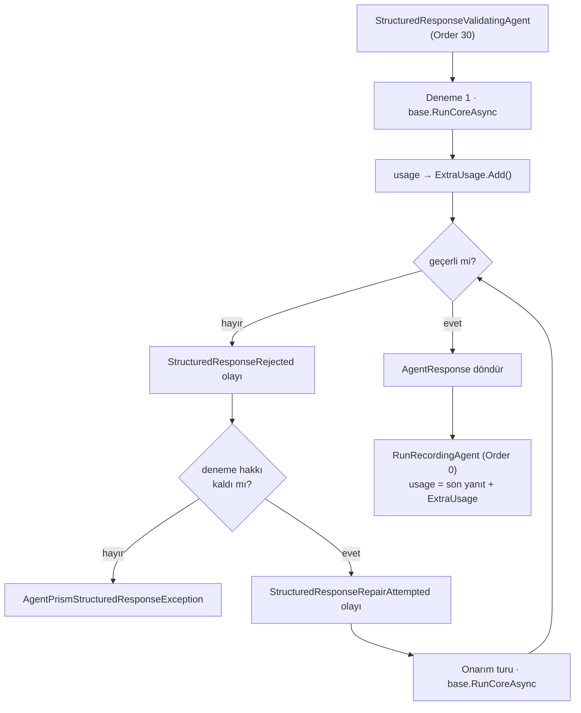

# Faz 134 — Sınırlı Yapısal Yanıt Onarımı

> **Durum:** 📋 Planlandı (2026-09-02)
> **Kaynak:** [ADAYLAR.md](ADAYLAR.md) — **F-177**
> **Önkoşul:** [Faz 131](arsiv/fazlar/131-YAPISAL-YANIT-DOGRULAMA-SEAMI.md) — onarım, doğrulama seam'i olmadan tanımsızdır
> **Paketler:** `AgentPrism.Abstractions`, `.Core`, `.UI` (olay etiketi)
> **Yeni paket:** Yok · **Migration:** Yok — yeni `RunEventType` değeri mevcut `smallint` sütuna yazılır
> **Public API:** büyüyor — bir options alanı, bir `RunEventType` değeri. `wc -l src/*/PublicAPI.Shipped.txt` → her dosya 1 satır; shipped giriş **sıfır**
> **Tüketici yüzeyi:** `docs-site/`: `guides/structured-output.md`, `concepts/runs.md` (olay listesi), `reference/configuration.md`, `capabilities.md` · sevk edilen: `AgentPrismStructuredResponseOptions` XML dokümanı, `en.ts`/`tr.ts` olay etiketi
> **Manuel test alanı:** [`docs/manuel-test/22-GUARDRAIL-VE-YAPISAL-CIKTI.md`](manuel-test/22-GUARDRAIL-VE-YAPISAL-CIKTI.md) — 🚨 Faz 133'ün **133.0** kalibrasyonu uygulanmamışsa case yazılamaz

---

## Bu Faza Başlarken

> `faz-baslangic` skill'ini uygula. Aşağıdaki liste o skill'in 2. adımıdır —
> **tamamını değil, yalnız işaret edilen bölümleri oku.**

1. Bu doküman
2. Kararlar — dosyanın tamamını **okuma**, yalnız bu kalemleri grep'le:
   ```bash
   grep -n "K-632\|K-631\|K-603" docs/KARARLAR.md
   ```
   **K-632** (bütçe muhasebesinin %100'ünü `RunBudgetChatClient` taşır),
   **K-631** (fiyat çözümleyici boru hattı kurulumunda geç çözülür),
   **K-603** (`RunErrorClass`'ın 9 numarası emekli boşluktur).
3. [Faz 131](arsiv/fazlar/131-YAPISAL-YANIT-DOGRULAMA-SEAMI.md) — yalnız devir notu:
   ```bash
   awk '/## Sonraki Faza Devir Notu/,0' docs/arsiv/fazlar/131-YAPISAL-YANIT-DOGRULAMA-SEAMI.md
   ```
   Bu faz o fazın **bilerek kapsam dışı** bıraktığı adımdır. Devir notu ayrıca
   `FakeModelProvider.EchoesUserMessage()`'ın `"Echo: "` öneki tuzağını yazar —
   bu fazın testleri o tuzağa doğrudan çarpar.
4. Alan hafızası (bu faz iki alana dokunuyor):
   [`hafiza/cekirdek-calistirma.md`](hafiza/cekirdek-calistirma.md) (ambient
   `AgentPrismRunContext`, akışlı yolda `SetCurrent` tekrarı),
   [`hafiza/model-boru-hatti.md`](hafiza/model-boru-hatti.md) (`RunBudgetChatClient`
   ve `FallbackChatClient`'ın halkadaki yerleri).
5. Gerektiğinde: [`MIMARI.md`](MIMARI.md) — çalıştırma yolu bölümü.

### Faz 133'ten devralınan iki şey (bu fazı doğrudan etkiler)

🚨 **`ManualTimeProvider` artık monotonik saati de sahteliyor.**
`tests/AgentPrism.Core.UnitTests/Fakes/ManualTimeProvider.cs` eskiden yalnız
`GetUtcNow()`'u eziyordu; `GetTimestamp()` gerçek `Stopwatch`'a düşüyordu.
Artık ikisini de sahteler: `Advance` ileri giderken iki saati birden, geri
giderken **yalnız duvar saatini** oynatır. Bir süre ölçen testin artık
`Advance` çağırması **gerekir** — çağırmazsa süre `0` çıkar (eskiden gerçek
geçen süre çıkardı). Onarım turunun süresini ölçeceksen bu seni etkiler.

🚨 **`AgentPrismMetrics` kurucusu ikinci bir isteğe bağlı parametre aldı:**
`AgentPrismMetrics(IMeterFactory?, IOptionsMonitor<AgentPrismOptions>?)`.
`new AgentPrismMetrics()` ve `new AgentPrismMetrics(factory)` hâlâ çalışır.
Yeni bir enstrümana tüketici tarafından ayarlanabilir bir sınır bağlayacaksan
seçenekler artık oradan okunabiliyor — ayrı bir parametre zinciri açma.

---

## Amaç

Faz 131 geçersiz yapısal yanıtı **yakalıyor** ama tek yapabildiği `run`'ı
başarısız kapatmak. Modelin ikinci bir denemede doğru JSON üretmesi çok
olağandır; bugün bu ikinci denemeyi yapmak isteyen her tüketici onu kendi
kodunda yazar. O zaman onarımın token'ı ve maliyeti ana `run` kanıtından
kopar, ve `run` ağacı bütçesi onu hiç görmez.

Bu faz, geçersiz yanıt için **sınırlı sayıda** onarım turunu runtime'a taşır.

- **F-177** — opt-in, üst sınırlı onarım turu; aynı `run`, aynı bütçe, aynı
  iptal kapsamı; her deneme bir `run` olayı.

### Karar: onarım **aynı `run` içinde** kalır

Kullanıcı 2026-09-02'de seçti. Onarım turu **yeni bir `run` satırı açmaz**;
`ParentRunId` taşıyan child `run` üretilmez. Her deneme bir `run` olayı olarak
kaydedilir, token ve maliyet ana `run`'a eklenir.

Gerekçe ve bedeli birlikte:

| Kazanç | Bedel |
|---|---|
| Yeni `RunKind` yok, `runs` tablosu büyümez, migration yok | Onarımın maliyeti ana `run`'ın toplamı içinde erir; "bu `run`'ın kaç token'ı onarıma gitti" ayrı bir sütundan okunamaz — yalnız olay dizisinden sayılır |
| `AgentRunBudget` zaten aynı `run`'ı sayıyor; ağaç derinliği ve `MaxTotalRuns` tavanı etkilenmiyor | Saklama politikası olayları `run` ile birlikte siler; onarım geçmişi `run`'dan uzun yaşamaz |
| `TreeCost`/`TreeUsage`'ın anlamı değişmiyor | — |

### Kapsam dışı — bilerek

| Kalem | Neden bu fazda değil |
|---|---|
| Onarımın ayrı maliyet sütunu | Yukarıdaki kararın kabul edilen bedelidir. Gerekirse ayrı bir faz `runs`'a `repair_cost` ekler |
| Akışta onarım | Akışta içerik istemciye zaten gitmiştir; ikinci bir tur ikinci bir akış üretir ve istemci sözleşmesini bozar. Bkz. 134.4 |
| Yerleşik şema doğrulayıcı | Faz 131'in kararı değişmez: AgentPrism seam sevk eder, doğrulayıcı sevk etmez |
| Onarım prompt'unun tüketici tarafından değiştirilmesi | Ölçülmüş talep yok. Sabit, dar bir sistem mesajı yeterlidir; genişletme noktası sonra açılabilir |

### Bugün ne çalışmıyor — doğrulanmış kanıt

| Kanıt | Gözlem |
|---|---|
| [`StructuredResponseValidatingAgent.cs`](../src/AgentPrism.Core/Compilation/StructuredResponseValidatingAgent.cs) | `RunCoreAsync` bir kez `base.RunCoreAsync` çağırıyor, `ValidateAsync` diyor ve sonucu döndürüyor. **Onarım yolu yok** |
| Aynı dosya | Tip `DelegatingAIAgent`; dönen tip **`AgentResponse`** — `AgentRunResponse` DEĞİL. MEMORY.md'nin uyardığı tam karışıklık; imzayı tahmin etme |
| [`AgentPrismStructuredResponseOptions.cs`](../src/AgentPrism.Core/AgentPrismStructuredResponseOptions.cs) | Tek alan: `Enabled`. `MaxRepairAttempts` **yok** |
| [`RunEventType.cs:218`](../src/AgentPrism.Abstractions/Runs/RunEventType.cs) | En büyük değer **27** (`StructuredResponseRejected`, Faz 131). İlk boş değer **28** |
| [`RunErrorClass.cs:120`](../src/AgentPrism.Abstractions/Runs/RunErrorClass.cs) | `StructuredResponseInvalid = 14` sevk edildi. Bu faz **yeni hata sınıfı eklemez** — tükenmiş onarım aynı sınıfla biter |
| [`RunRecordingAgent.Completion.cs:68`](../src/AgentPrism.Core/Recording/RunRecordingAgent.Completion.cs) | 🚨 `usage = MergeUsage(usage, scope.ExtraUsage?.ToRunUsage())` — `usage` parametresi **dönen tek `AgentResponse`'tan** gelir |
| [`CompactionUsageAccumulator.cs:5-14`](../src/AgentPrism.Core/Recording/CompactionUsageAccumulator.cs) | XML'i kuralı yazıyor: *"The summarization call is a side channel that is fully separate from the agent's `AgentResponse`, so its tokens never enter the normal flow"* |
| [`CompactionUsageTrackingChatClient.cs:32`](../src/AgentPrism.Core/Compilation/CompactionUsageTrackingChatClient.cs) | Yan kanala yazma deseni: `AgentPrismRunContext.Current?.ExtraUsage?.Add(response.Usage)` |
| `ModelProviderRegistry.cs:463` | `RunBudgetChatClient` **chat** boru hattındadır — yani derlenmiş agent'ın **içinde** |
| Faz 131 devir notu | *"`RunRecordingAgent`'ın akışlı yolunda `AgentPrismRunContext.SetCurrent` HER `MoveNextAsync` öncesi yeniden yazılıyor … en içteki decorator … doğru ambient scope'u görüyor"* |

> Kanıtlar 2026-09-02 tarihinde doğrulandı.

---

## 134.1 — 🚨 Onarımın token'ı yan kanaldan yazılır

**Bu, planın yapısal iddiasıdır ve kabul edilmeden ölçülmüştür.**

`RunRecordingAgent` (Order 0, en dışta) `run`'ın kullanımını, doğrulama
decorator'ının (Order 30, en içte) **döndürdüğü tek `AgentResponse`**'tan
okur. Onarım turu ikinci bir `AgentResponse` üretir ve decorator yalnız
**sonuncusunu** döndürür. Hiçbir şey yapılmazsa ilk (geçersiz) denemenin
token'ı **sessizce kaybolur**.

Doğru yol repoda zaten vardır: bağlam sıkıştırma da aynı sorunu yaşadı ve
`AgentPrismRunContext.Current.ExtraUsage` yan kanalıyla çözüldü.



Kural: **döndürülmeyen her `AgentResponse`'ın kullanımı `ExtraUsage`'a
eklenir.** Döndürülen son yanıtınki eklenmez — o zaten normal yoldan sayılır.
Çift sayım ile hiç saymamak arasındaki fark tek bir satırdır; test bunu iki
uçtan ölçer.

`CompactionUsageAccumulator` `internal`'dır ve adı artık kapsamını dar
gösteriyor. Bu faz onu **yeniden adlandırır** (`SideChannelUsageAccumulator`
gibi) ve XML'ini iki kaynağı da anlatacak biçimde günceller. Public yüzey
etkilenmez.

## 134.2 — Bütçe, deadline ve iptal bedava gelir

Onarım turu `base.RunCoreAsync` üzerinden **aynı derlenmiş agent'a** gider,
yani aynı chat boru hattından geçer. `RunBudgetChatClient` o boru hattının
içindedir ve K-632'den beri bütçe muhasebesinin tamamını taşır. Sonuç:

- Token, maliyet ve süre tavanları onarım turunda da **otomatik** uygulanır.
- `Deadline` aşılırsa onarım turu boru hattında durur; ayrı bir kontrol
  yazılmaz.
- `CancellationToken` doğrudan geçirilir.

🚨 Bu yüzden onarım turu **asla** yeni bir `IChatClient` veya yeni bir boru
hattı kurmamalıdır. Kısa yol denemesi (doğrudan model çağırmak) bütçeyi,
yedek zincirini ve kiracı kimlik bilgisini bir anda atlar.

## 134.3 — Onarım turunun içeriği

Onarım turu, ilk turun mesajlarına **iki** ek mesajla yapılır:

1. Modelin geçersiz yanıtı (assistant rolü).
2. Dar, sabit bir kullanıcı mesajı: hangi kısıtın ihlal edildiğini
   `StructuredResponseValidationResult.Reason`'dan **güvenli metin** olarak
   taşır, ve şema adını verir.

`Reason` `SafeErrorText` üzerinden geçmiş hâliyle kullanılır. Ham model
çıktısı prompt'a **geri konur** (model kendi çıktısını görmelidir) ama
`run` olayına **konmaz**.

🚨 **Onarım mesajları oturuma yazılmamalıdır.** `RunCoreAsync(messages,
session, options, ct)` imzasında `session` doluyken MAF'ın kendi kalıcılık
davranışı devreye girer; onarım gürültüsü kalıcı konuşma geçmişine karışırsa
sonraki turlar bozulur. **Doğrulanmadı — `maf-api-kesfi` ile ölçülmeli:**
`AgentSession` verilen bir turda ek mesajların kalıcı hâle gelip gelmediği,
ve gelmiyorsa hangi `AgentRunOptions` alanının bunu kontrol ettiği. Ölçüm
sonucu Açık Soru 2'yi kapatır.

## 134.4 — Akışta onarım yapılmaz

Akışlı `run`'da içerik istemciye üretildikçe gitmiştir. İkinci bir tur ikinci
bir içerik akışı üretirdi ve istemci aynı `run` içinde iki farklı yanıt
görürdü.

Karar: **akışlı yolda onarım devre dışıdır.** Doğrulama Faz 131'deki gibi
çalışır, geçersizlik `run`'ı `Failed` kapatır, ama onarım turu açılmaz.
Bu, `guides/structured-output.md`'de zaten yazılı olan "yapısal çıktıyı kapı
olarak kullanan agent akış kullanmamalıdır" cümlesinin devamıdır ve aynı
sayfada açıkça yazılır.

## 134.5 — Olaylar ve sınır

| Yüzey | Değişiklik |
|---|---|
| `RunEventType` | Yeni değer: `StructuredResponseRepairAttempted`. Listenin **sonuna**; bugünkü en büyük değer 27. 🚨 9 emekli boşluğu `RunErrorClass`'a aittir, bu enum'a değil — karıştırma |
| `StructuredResponseRejected` | Değişmez; her geçersiz deneme için yazılmaya devam eder. Yükü `attempt` alanı kazanır |
| `RunErrorClass` | **Yeni değer yok.** Onarım hakkı tükenince `run` yine `StructuredResponseInvalid` ile biter — tüketicinin gösterge paneli yeni bir kova öğrenmek zorunda kalmaz |
| `AgentPrismStructuredResponseOptions` | `MaxRepairAttempts` (varsayılan **0** = onarım kapalı) |
| Arayüz | Yeni olay etiketi `en.ts` **ve** `tr.ts` (K-228) |

**K1 — sıfır sürpriz.** `MaxRepairAttempts` varsayılanı `0`'dır. `Enabled`
`true` yapılmış bir kurulum bile, bu sayı verilmedikçe **ek model çağrısı
yapmaz**. Faz 131'in davranışı birebir korunur.

Üst sınır **denemedir, tur değildir**: `MaxRepairAttempts = 2`, en fazla
**üç** model çağrısı demektir (ilk tur + iki onarım). XML dokümanı bunu
sayıyla yazar; "attempt" kelimesi tek başına iki farklı okunur.

---

## Planlanan Public API

> Taslak imzalardır. Gerçekleşen imzalar kapanışta ayrı bölüme yazılır.

```csharp
// AgentPrism.Core — AgentPrismStructuredResponseOptions
/// <summary>
/// How many REPAIR turns may follow an invalid response. 0 (the default)
/// disables repair entirely: an invalid response fails the run exactly as it
/// does today. A value of 2 permits at most THREE model calls in total —
/// the original turn plus two repairs.
/// </summary>
public int MaxRepairAttempts { get; set; }

// AgentPrism.Abstractions — RunEventType
StructuredResponseRepairAttempted = 28,   // sonraki boş değer

// AgentPrism.Core (internal) — Faz 131'in olay yükü genişler
internal sealed record StructuredResponseRejectedEventPayload
{
    public required int Attempt { get; init; }        // yeni · 1 tabanlı
    public required int MaxAttempts { get; init; }    // yeni
    // mevcut: Kind, SchemaName, Reason, Provider, Model
}
```

`IStructuredResponseValidator` **değişmez.** Onarım bir runtime politikasıdır;
doğrulayıcının sözleşmesi aynı kalır ve Faz 131'in tüketicisi hiçbir şey
değiştirmez.

### HTTP `endpoint`'leri

Yeni uç yoktur. `GET /api/runs/{id}/events` yeni olay türünü döndürür;
OpenAPI → TypeScript zinciri yeniden üretilir.

### Arayüz payı

Bir olay etiketi. Bugünkü paket kapanışta yeniden ölçülür.

---

## Planlanan Dosya Listesi

```
src/AgentPrism.Abstractions/Runs/RunEventType.cs        (yeni değer)

src/AgentPrism.Core/
├── AgentPrismStructuredResponseOptions.cs              (MaxRepairAttempts)
├── AgentPrismStructuredResponseOptionsValidator.cs     (negatif sayı reddi)
├── Compilation/StructuredResponseValidatingAgent.cs    (onarım döngüsü · asıl iş)
├── Recording/CompactionUsageAccumulator.cs             (yeniden adlandırma + XML)
├── Recording/AgentPrismRunContext.cs                   (alan adı)
├── Recording/RunRecordingAgent.Completion.cs · .Lifecycle.cs (alan adı)
├── Compilation/CompactionUsageTrackingChatClient.cs    (alan adı)
└── AgentPrismCoreJsonContext.cs                        (genişleyen olay yükü)

src/AgentPrism.UI/frontend/src/locales/{en,tr}.ts
tests/AgentPrism.Core.UnitTests/… · tests/AgentPrism.AspNetCore.FunctionalTests/…
docs-site/src/content/docs/guides/structured-output.md · concepts/runs.md
docs-site/src/content/docs/reference/configuration.md · capabilities.md
```

🚨 **İmza değiştirmek ile gövdeyi kullanmak iki ayrı adımdır.**
`CompactionUsageAccumulator`'ın yeniden adlandırılması altı dosyaya dokunur ve
hepsi derleme hatası verir — bu iyidir. Ama `ExtraUsage.Add(...)` çağrısını
onarım döngüsüne **eklemeyi unutmak** hiçbir hata üretmez: kod derlenir,
testlerin çoğu geçer, yalnız token toplamı sessizce eksik kalır. Bu, K-483'ün
kusur sınıfının aynısıdır.

---

## Hata Modları ve Testler

> Onarım DI · akış · bütçe · `run` kaydı sınırlarını geçer. Birim testi bunu
> kanıtlamaz — [`.agents/ortak/test-seviyeleri.md`](../.agents/ortak/test-seviyeleri.md).

| Ne bozulabilir | Seviye | Test sınıfı |
|---|---|---|
| `MaxRepairAttempts = 0` iken ek model çağrısı yapılır | Fonksiyonel | `StructuredResponseRepairDisabledTests` — sahte sağlayıcı çağrı sayar |
| Geçersiz denemenin token'ı kaybolur | Fonksiyonel | `StructuredResponseRepairUsageTests` — `run.Usage` iki turun **toplamı** olmalı |
| Aynı token iki kez sayılır | Fonksiyonel | `StructuredResponseRepairUsageTests` — tek turda toplam değişmemeli |
| Onarım hakkı tükenince `run` başarılı kapanır | Fonksiyonel | `StructuredResponseRepairExhaustedTests` |
| Onarım sonsuz döner | Fonksiyonel | `StructuredResponseRepairExhaustedTests` — sağlayıcı hep geçersiz döndürür, çağrı sayısı `1 + Max` olmalı |
| Bütçe onarım turunda uygulanmaz | Fonksiyonel | `StructuredResponseRepairBudgetTests` — dar `MaxTotalTokens` ile onarım turu bütçeye çarpar |
| `Deadline` onarım turunda yok sayılır | Fonksiyonel | `StructuredResponseRepairBudgetTests` |
| İptal onarım turunda yok sayılır | Fonksiyonel | `StructuredResponseRepairCancellationTests` — `run` `Canceled`, `StructuredResponseInvalid` **değil** |
| Akışta onarım turu açılır | Fonksiyonel | `StructuredResponseRepairStreamingTests` — çağrı sayısı 1 olmalı |
| Onarım mesajları oturuma yazılır | Fonksiyonel | `StructuredResponseRepairSessionTests` — `session`'ın mesaj sayısı onarımla artmamalı |
| Ham yanıt `run` olayına sızar | Fonksiyonel | mevcut `StructuredResponseRedactionTests` genişletilir |
| Olay `attempt` alanı yanlış sayar | Birim | `StructuredResponseRepairEventTests` — 1 tabanlı, monoton |
| Yeni olay OpenAPI/TS istemcisine çıkmaz | E2E | mevcut OpenAPI tazelik kapısı |
| Olay etiketi bir dilde eksik | Birim | mevcut sözlük kapısı (K-228) |
| Yedek zinciri onarım turunda atlanır | Fonksiyonel | `StructuredResponseRepairFallbackTests` — onarım da `FallbackChatClient`'tan geçmeli |

Beş soru: **iptal** — yukarıdaki satır; **eşzamanlılık** — decorator singleton
değil, agent başına kurulur; onarım sayacı **yerel değişkendir**, alan
**değildir** (alan olsaydı eşzamanlı `run`'lar birbirinin sayacını bozardı);
**boş/aşırı girdi** — `MaxRepairAttempts` negatif reddedilir, çok büyük değer
bütçeye çarparak durur; **başka kiracı** — onarım aynı `run` kapsamındadır,
kiracı sınırı değişmez; **alt sistem hatası** — olay yazımı hata verirse
onarım devam eder, hata loglanır (gözlemlenebilirlik işlevi bozmaz).

---

## Manuel Kabul Case'leri

> Bu case'ler yazılmadan önce Faz 133'ün **133.0** bütçe kalibrasyonu
> uygulanmış olmalıdır.

| # | Ön koşul | Adımlar | Beklenen sonuç |
|---|---|---|---|
| 1 | `Enabled: true`, `MaxRepairAttempts` verilmemiş | Geçersiz JSON döndüren sahte sağlayıcı ile `run` | Davranış Faz 131 ile aynı: tek çağrı, `run` `Failed` |
| 2 | `MaxRepairAttempts: 2`, sağlayıcı önce geçersiz sonra geçerli döndürür | `run` yap | `run` `Completed`; bir `StructuredResponseRejected` + bir `StructuredResponseRepairAttempted` olayı |
| 3 | `MaxRepairAttempts: 2`, sağlayıcı hep geçersiz | `run` yap | Toplam **üç** model çağrısı; `run` `Failed`; sınıf `StructuredResponseInvalid` |
| 4 | Case 2 | `GET /api/runs/{id}` | `usage` **iki turun toplamı**; maliyet buna göre |
| 5 | Dar `MaxTotalTokens` | Case 3'ü tekrarla | `run` bütçe hatasıyla biter, onarım sonsuz dönmez |
| 6 | Akışlı `run`, geçersiz yanıt | `text/event-stream` ile çağır | Tek çağrı; onarım yok; `run` `Failed` |
| 7 | Arayüz | `run` detayını aç | Onarım olayı iki dilde doğru görünür 👤 |

---

## Açık Sorular

| # | Soru | Seçenekler | Öneri |
|---|---|---|---|
| 1 | `CompactionUsageAccumulator` yeniden adlandırılsın mı? | A: evet, `SideChannelUsageAccumulator` · B: adı kalsın, XML genişlesin | **A.** Tip `internal`, bedel sıfır; iki kaynağı olan bir sayacı "compaction" diye adlandırmak sonraki okuyucuyu yanıltır |
| 2 | Onarım mesajları `AgentSession`'a yazılmamalı — hangi mekanizmayla? | A: `session: null` ile ikinci tur · B: `AgentRunOptions` üzerinden kalıcılık kapatılır | **Ölçülmeden karar verilmez.** `maf-api-kesfi` koşulur (134.3). A basit görünür ama oturum bağlamını kaybettirebilir; B'nin böyle bir alanı olup olmadığı doğrulanmamıştır |
| 3 | Onarım prompt'unun metni sevk edilen bir sabit mi olsun? | A: sabit, İngilizce · B: tüketici değiştirebilsin | **A.** Ölçülmüş talep yok; genişletme noktası sonra açılır. Sabit metin `SourceLanguageTests` kapsamındadır ve İngilizce olmak zorundadır |

---

## Bitiş Ölçütleri (DoD)

- [ ] `MaxRepairAttempts` verilmemişken davranış Faz 131 ile **birebir** aynıdır; ek model çağrısı **yok** (case 1)
- [ ] Bir onarım turu geçersiz yanıtı kurtarır ve `run` `Completed` kapanır (case 2)
- [ ] `MaxRepairAttempts: 2` → toplam **üç** model çağrısı, ne bir eksik ne bir fazla (case 3)
- [ ] `run.Usage` bütün turların **toplamıdır**; hiçbir turun token'ı ne kaybolur ne iki kez sayılır (case 4)
- [ ] Bütçe, `Deadline` ve iptal onarım turunda da uygulanır (case 5)
- [ ] Akışlı yolda onarım açılmaz (case 6)
- [ ] Onarım mesajları oturuma yazılmaz
- [ ] Onarım hakkı tükenince `run` `StructuredResponseInvalid` ile biter — **yeni hata sınıfı eklenmedi**
- [ ] Dört doğrulama kapısı sıfır uyarı verir
- [ ] `samples/AgentPrism.Api` ile gerçek `run` yapıldı, çıktı belgeye yazıldı
- [ ] `secret` taraması boş döndü
- [ ] Manuel kabul case'leri `docs/manuel-test/22-GUARDRAIL-VE-YAPISAL-CIKTI.md` içine eklendi; otomatikleştirilebilenler koşuldu
- [ ] `faz-denetim` koşuldu; 🔴 bulgu kalmadı
- [ ] `docs-site/` güncellendi (`structured-output.md`, `concepts/runs.md`, `reference/configuration.md`, `capabilities.md`); `npm run build` + `check-links.mjs` temiz
- [ ] `en.ts` ve `tr.ts` eksiksiz
- [ ] 🚨 `dotnet test AgentPrism.slnx` TAM log dosyasından teyit edildi — `| tail` ile **değil** (Faz 130 devir notu)

### Doğrulama komutları

```bash
# Onarım olayları
curl -s http://localhost:5081/agentprism/api/runs/<id>/events \
  | jq '[.[] | select(.type | startswith("StructuredResponse"))]'

# Token toplamı iki turu da içeriyor mu
curl -s http://localhost:5081/agentprism/api/runs/<id> | jq '.usage'
```

---

## Riskler

| Risk | Önlem |
|------|-------|
| Onarım turunun token'ı sessizce kaybolur | 134.1 yan kanal kuralı; `StructuredResponseRepairUsageTests` iki uçtan (kayıp **ve** çift sayım) ölçer |
| Onarım döngüsü kısa yoldan model çağırır ve bütçeyi/yedeği atlar | 134.2 yasağı; `StructuredResponseRepairFallbackTests` ve `…BudgetTests` bunu ölçer |
| Onarım sayacı alan olarak tutulur, eşzamanlı `run`'lar birbirini bozar | Sayaç yerel değişkendir; hata modu tablosunda ayrı satır |
| MAF'ın oturum kalıcılık davranışı tahmin edilir | Açık Soru 2 `maf-api-kesfi` ile ölçülmeden kod yazılmaz |
| Manuel test bütçesi Faz 133 kalibre etmeden aşılır | Bu fazın manuel bölümü 133.0'a bağlıdır; `dokuman-bakim.py --denetle` case yazmadan önce koşulur |
| Sahte sağlayıcının `"Echo: "` öneki testleri yanıltır | Faz 131 devir notu bunu yazıyor; testler `RespondsWith(sabitMetin)` kullanır |

---

<!-- ============================================================
     AŞAĞISI KAPANIŞTA DOLDURULUR — `faz-tamamlama` skill'i.
     Plan anında boş kalır. Başlıkları SİLME.
     ============================================================ -->

## Plandan Sapmalar

> Kapanışta doldurulur.

## Bu Fazda Verilen Kararlar

> Kapanışta doldurulur. K-NNN numaraları burada alınır — onarımın aynı `run`
> içinde kalması bir karardır ve buraya yazılır.

## Gerçekleşen Public API

> Kapanışta doldurulur.

## Dosya Listesi (gerçekleşen)

> Kapanışta doldurulur.

## Denetim Bulguları

> Kapanışta doldurulur.

## Sonraki Faza Devir Notu

> Kapanışta doldurulur.
